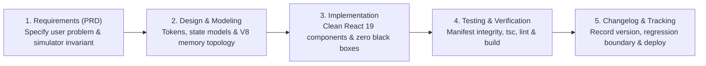

# Interactive Learning Portal: Software Development Life Cycle (SDLC) & Feature Tracker

> **Repository Subsystem:** `apps/portal` (Companion Living Architecture & Simulation Portal)  
> **Tech Stack:** React 19 + TypeScript 5.8 + Vite 8 + Custom Vanilla CSS Design System  
> **Authoritative Specification Document:** Governs requirements, architecture, verification gates, and release changelogs.

---

## 1. System Philosophy & Quality Gateways

The `apps/portal` web application is an **enterprise-grade architectural showcase**. It is built with the same discipline, type-safety, and performance standards expected of Senior, Lead, and Staff Frontend Architects.

### The 5 Standard SDLC Stages
Every new feature, simulator lab, or architectural refactor in `apps/portal` strictly passes through 5 distinct gates:



---

## 2. Verification & Testing Standards (The CI/CD Gate)

Before any new feature is considered complete or committed, the following automated pipeline must pass with **zero errors and zero warnings**:

| Command | Purpose | Verification Gate |
| :--- | :--- | :--- |
| `npm run manifest` | Auto-indexes `notes/` into `src/assets/manifest.json` and syncs to `public/notes`. | Validates all 7 phases and chapter titles. |
| `npm test` (`npm run test:integrity`) | Executes `scripts/test-manifest-integrity.mjs`. | Verifies 100% of manifest files physically exist on disk and all mapped labs exist. |
| `npx tsc --noEmit` | Strict TypeScript compiler validation. | Catches type mismatches and interface breakages. |
| `npm run lint` | Fast static analysis via `oxlint`. | Prevents code smell and syntax antipatterns. |
| `npm run build` | Full production bundle compilation. | Guarantees clean tree-shaking, Rollup bundling, and asset minification. |

---

## 3. Web App Feature Inventory & Status Matrix

### Category A: Core Reader & App Shell
| Feature ID | Feature Name | Description | Status | Added In |
| :--- | :--- | :--- | :--- | :--- |
| **FEAT-CORE-01** | **Vite + React 19 Scaffolding** | Base project, strict TypeScript configuration, asset paths. | [x] **Complete** | v0.1.0 |
| **FEAT-CORE-02** | **Vanilla CSS Token System** | High-contrast, sleek design system with CSS custom properties. | [x] **Complete** | v0.1.0 |
| **FEAT-CORE-03** | **Light & Dark Theme Switcher** | Modern light theme tokens as default with seamless dark mode switch. | [x] **Complete** | v0.2.0 |
| **FEAT-CORE-04** | **Browser Progress Persistence** | LocalStorage persistence for completed topics and reader scratchpads. | [x] **Complete** | v0.2.0 |
| **FEAT-CORE-05** | **SPA Cross-Link Interceptor** | Intercepts markdown `[link](file://...)` links to keep navigation inside SPA. | [x] **Complete** | v0.2.0 |
| **FEAT-CORE-06** | **Mermaid Vector SVG Rendering** | Compiles ````mermaid ```` blocks into dynamic, responsive SVG diagrams. | [x] **Complete** | v0.2.0 |
| **FEAT-CORE-07** | **Scratchpad & Copy for Mentor** | In-reader scratchpad with one-click Markdown clipboard formatting. | [x] **Complete** | v0.2.0 |
| **FEAT-CORE-08** | **Automated Integrity Test Suite** | `scripts/test-manifest-integrity.mjs` verifying note and lab links. | [x] **Complete** | v0.2.1 |

---

### Category B: Interactive Simulation Labs (Living Arena)
| Lab ID | Lab Name | Topic Association | Interactive Features | Status |
| :--- | :--- | :--- | :--- | :--- |
| **LAB-10** | **JSX Compiler & `$$typeof` Inspector** | Phase 03 Topic 03 (`03-jsx-compilation`) | Live JSX-to-`_jsx` AST desugaring, XSS JSON injection test, falsy `0` bug sandbox. | [x] **Complete** |
| **LAB-11** | **Component Purity & StrictMode** | Phase 03 Topic 04 (`04-component-model-pure-functions`) | In-place mutation (`.sort`) vs pure ES2023 (`.toSorted`), StrictMode double-rendering stress-test. | [x] **Complete** |
| **LAB-12** | **Render Cycle Stepper** | Phase 03 Topic 05 (`05-render-cycle`) | 5-stage Trigger $\rightarrow$ Render $\rightarrow$ Commit $\rightarrow$ Paint stepper, Double Buffering inspector, microsecond telemetry. | [x] **Complete** |
| **LAB-04** | **4-Lane Event Loop Simulator** | Phase 01 Topic 04 (`04-event-loop`) | Call Stack, Microtasks, 16.6ms Render Gate, Macrotasks, 60 FPS meter, and INP regression simulator. | 📋 *Backlog* |
| **LAB-13** | **Reconciliation & Diffing Visualizer** | Phase 04 Topic 02 (`02-reconciliation-diffing-algorithm`) | Step-by-step list reordering, `lastPlacedIndex` watermark move tracker, index-as-key state bleed demo. | 📋 *Backlog* |
| **LAB-14** | **Fiber Linked-List Work Loop** | Phase 04 Topic 03 (`03-fiber-architecture`) | Interactive `child`, `sibling`, `return` linked-list tree walker with step pause/resume. | 📋 *Backlog* |
| **LAB-15** | **31-Bit Priority Lanes Inspector** | Phase 04 Topic 05 (`05-lanes-priority-mechanics`) | Bitwise operations (`lanes & -lanes`), 16 parallel transition lanes, starvation escalation. | 📋 *Backlog* |
| **LAB-19** | **RSC Flight Wire Format Parser** | Phase 04 Topic 09 (`09-rsc-internals`) | Live parser of `M`, `J`, `S` Flight chunks with client reference component boundary inspector. | 📋 *Backlog* |
| **LAB-21** | **State Normalization Visualizer** | Phase 05 Topic 01 (`01-state-modeling-normalization`) | Nested tree vs flat normalized `byId`/`allIds` tables with $O(1)$ mutation comparison. | 📋 *Backlog* |

---

### Category C: Learning Optimization & Assessment
| Feature ID | Feature Name | Description | Status | Target Phase |
| :--- | :--- | :--- | :--- | :--- |
| **FEAT-LEARN-01** | **Flashcards Arena** | Interactive flashcards drilling sticky memory anchors ("Museum Rule", "Chameleon vs Bulldozer"). | 📋 *Queued* | Phase P5 |
| **FEAT-LEARN-02** | **Architect Scenario Quizzes** | Multiple-choice and code puzzle interview drills with real-time feedback. | 📋 *Queued* | Phase P5 |
| **FEAT-LEARN-03** | **Client-Side Full Text Search** | Fast instant search across all 32+ chapters using MiniSearch / Lunr. | 📋 *Queued* | Phase P6 |
| **FEAT-LEARN-04** | **GitHub Pages Deployment** | Automated GitHub Actions CI workflow building and deploying to public URL. | 📋 *Queued* | Phase P6 |

---

### Category D: Navigation, Wayfinding & Hyperlinked Knowledge Graph
| Feature ID | Feature Name | Description | Status | Added In |
| :--- | :--- | :--- | :--- | :--- |
| **FEAT-NAV-01** | **Interactive Breadcrumb Trail** | Hierarchical wayfinding (`Dashboard > Phase XX > Chapter Title`) with click-to-navigate ancestor nodes. | [x] **Complete** | v0.3.0 |
| **FEAT-NAV-02** | **Topic Navigation History & "Go Back" Stack** | Stateful history stack recording in-app jumps with dedicated `← Back to [Previous Topic]` button and browser `pushState`/`popstate` sync. | [x] **Complete** | v0.3.0 |
| **FEAT-NAV-03** | **Sequential Chapter Walker** | Bottom-of-article dual action cards (`← Previous Topic: [Title]` and `Next Topic: [Title] →`) for uninterrupted sequential study across phases. | [x] **Complete** | v0.3.0 |
| **FEAT-NAV-04** | **Cross-Article Link Resolver & Anchor Jumps** | Intercepts markdown cross-topic links, resolves section anchors (`#heading`), and smooth-scrolls in SPA state without full reload. | [x] **Complete** | v0.3.0 |

---

### Category E: UI/UX Modernization & Typographic Reading System
| Feature ID | Feature Name | Description | Status | Target Version |
| :--- | :--- | :--- | :---: | :---: |
| **FEAT-UI-01** | **Sticky Table of Contents & Synchronized ScrollSpy** | Pinned viewport TOC with matching build/runtime slugifier and smooth-scrolling offset. | 🚀 *In Progress* | v0.4.0 |
| **FEAT-UI-02** | **Diagram Bounding & Aspect-Ratio Preservation** | `.mermaid-wrapper` with `max-height: 520px` and responsive SVG viewBox clamping. | 🚀 *In Progress* | v0.4.0 |
| **FEAT-UI-03** | **Constrained Typographic Prose (`max-width: 780px`)** | Distraction-free reading column (65–75 CPL) with enhanced line-height (`1.7`) and hierarchy. | 🚀 *In Progress* | v0.4.0 |
| **FEAT-UI-04** | **Standardized Sidebar Badges & Title Normalization** | Uniform `[01]`, `[02]`, `[AC]` pills across all phases with stripped redundant prefixes. | 🚀 *In Progress* | v0.4.0 |
| **FEAT-UI-05** | **Micro-Interactions & "Back to Top" Action** | Floating smooth scroll button, card hover lifts, and smooth chapter transition animations. | 🚀 *In Progress* | v0.4.0 |

---

## 4. Versioned Release Changelog (Regression History)

### [v0.3.1] - 2026-10-06
- **Added:** Resilient Markdown Math Preprocessor (`cleanMarkdownFormatting()`) in `TopicReader.tsx` automatically rendering mathematical formulas into styled Unicode blocks.
- **Added:** Automated LaTeX Syntax Validator in `scripts/test-manifest-integrity.mjs` verifying zero raw LaTeX escape codes across all indexed notes.
- **Fixed:** Sanitized raw LaTeX expressions across all notes (`01-javascript-execution-model.md`, `04-event-loop.md`, `02-reconciliation-diffing-algorithm.md`, `06-concurrent-features.md`, `07-suspense-error-boundaries.md`, `08-ssr-streaming-hydration.md`, `00-angular-vs-react-mental-model.md`).
- **Verified:** 100% test integrity pass and 0 TypeScript compiler errors.

### [v0.3.0] - 2026-10-06
- **Added:** Interactive Breadcrumb Trail (`FEAT-NAV-01`) at the top of the Topic Reader.
- **Added:** Stateful Navigation History Stack & "← Back to: [Previous Chapter]" Button (`FEAT-NAV-02`) in `App.tsx` and `TopicReader.tsx`.
- **Added:** Full Browser History & URL Query synchronization (`?topic=...` with `pushState` and `popstate` support for native browser/mouse back buttons).
- **Added:** Sequential Chapter Walker Cards (`FEAT-NAV-03`) at the footer of each chapter for continuous book-style reading.
- **Added:** Markdown Section Anchor & Cross-Topic Interceptor (`FEAT-NAV-04`) supporting smooth scrolling to specific headings.
- **Fixed:** TypeScript compiler warnings in `RenderCycleLab.tsx` (`timerRef` type and unused icons).
- **Verified:** 100% test integrity pass and production build compilation clean (`npm run build`).

### [v0.2.1] - 2026-10-06
- **Added:** Automated Manifest & Lab Integrity Test Suite ([`scripts/test-manifest-integrity.mjs`](./scripts/test-manifest-integrity.mjs)).
- **Added:** Interactive Simulation Lab 12: The 3-Phase Render Cycle Stepper ([`RenderCycleLab.tsx`](./src/features/visualizers/topic-05-render/RenderCycleLab.tsx)).
- **Added:** Integrated Lab 12 into [`VisualizerHub.tsx`](./src/features/visualizers/VisualizerHub.tsx).
- **Verified:** 32 topics across 7 phases indexed and tested with 100% test assertions passing.

### [v0.2.0] - 2026-10-05
- **Added:** Dual-Theme Support (Modern Light Theme default + Dark Theme toggle).
- **Added:** Browser Progress Persistence (`progressStorage.ts`) for topic completions and scratchpad notes.
- **Added:** Scratchpad feature in Topic Reader with one-click "📋 Copy for Mentor" clipboard action.
- **Added:** Native `mermaid.js` SVG vector rendering in `TopicReader.tsx`.
- **Fixed:** Monospace CSS font stack prioritizing Windows `Consolas` and `Cascadia Code` with disabled ligatures to fix broken ASCII table columns.

### [v0.1.0] - 2026-10-02
- **Added:** Initial `apps/portal` scaffold with Vite, React 19, and TypeScript.
- **Added:** Automated note indexing manifest script (`scripts/generate-manifest.mjs`).
- **Added:** Dashboard roadmap view and Topic Reader powered by `marked`, `prismjs`, and `dompurify`.
- **Added:** Lab 10 (`JsxCompilerLab.tsx`) and Lab 11 (`ComponentPurityLab.tsx`).
