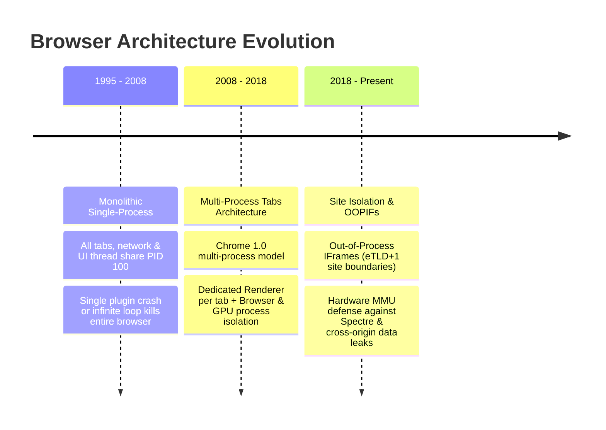
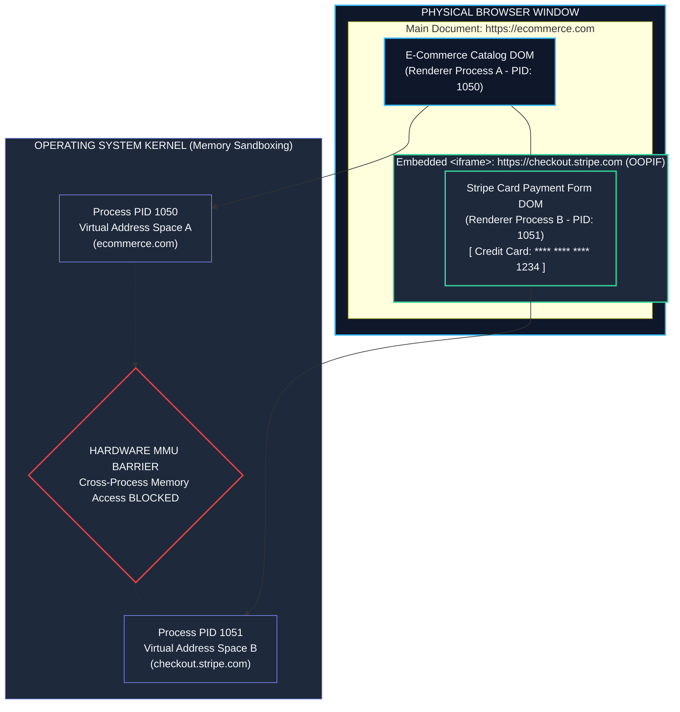

# Chapter 01: Browser Architecture & Multi-Process Model (Browser, Renderer, GPU, Network Processes, IPC & Site Isolation)

> "To master web performance and security, a senior engineer must look past the JavaScript engine and understand the operating system of the web: the modern multi-process browser. Every frame rendered and every network packet received is the product of coordinated inter-process communication across isolated sandboxes."  
> — **Browser Engine Architecture Principles**

---

## 1. Why This Topic Exists

Many frontend developers view the browser as a single monolithic program running their JavaScript. This fundamental misconception leads to poor architectural decisions, unexplained UI jank, memory bloat, and security vulnerabilities:
1. **The Single-Process Crash Era:** In early browsers (Internet Explorer 6, Firefox 1.x), the browser ran as a single monolithic operating system process. A memory leak or infinite loop in one tab crashed the entire browser window and killed every open tab.
2. **The Security Frontier & Spectre:** When the Spectre CPU hardware vulnerability emerged, malicious scripts in one tab could read arbitrary memory from other tabs running in the same process space (such as banking sessions or private tokens). The browser was forced to reinvent its security topology around **Site Isolation**—placing different origins into strictly isolated OS processes.
3. **The Rendering Pipeline Division:** In Chromium (Chrome, Edge, Brave), painting pixels at 60 or 120 FPS is decoupled from JavaScript execution. The **Browser Process**, **Renderer Process**, **GPU Process**, and **Network Process** coordinate over low-level Inter-Process Communication (IPC).

Understanding the multi-process model allows Senior and Staff Engineers to diagnose main-thread bottlenecks, design crash-resilient tabs, and anticipate how browser sandboxing constraints impact modern frontend architectures.

---

## 2. Learning Objectives

- Dissect the multi-process architecture of Chromium: Browser Process, Renderer Process, GPU Process, Network Process, and Utility/Plugin Processes.
- Trace the lifecycle of navigation from URL input in the address bar to the allocation of a dedicated Renderer Process.
- Master **Site Isolation** (`chrome://process-internals`) and understand how cross-origin `<iframe>` elements are allocated into separate Out-of-Process IFrames (OOPIFs).
- Understand how low-level **Inter-Process Communication (IPC)**, Shared Memory (`base::SharedMemory`), and Mojo message pipes pass data between the OS, Network, and Renderer.
- Understand the security sandbox: why the Renderer Process has **zero OS disk or network access** and must request capabilities through the Browser Process.
- Bridge architectural mental models directly to **Angular** (Zone.js execution within the Renderer process) and **.NET** (ASP.NET Core Kestrel process model, Blazor Server SignalR circuits, and Windows OS Process Isolation).

---

## 3. Historical Evolution



<details className="raw-schematic-details">
<summary>📄 View Raw ASCII Schematic</summary>

```text
ERA 1: Monolithic Single-Process Architecture (1995 - 2008)
┌────────────────────────────────────────────────────────┐
│ Single OS Process (PID 100)                            │
│ ├── UI Thread (Address bar, bookmarks, tabs)           │
│ ├── Network Socket Management                          │
│ ├── Tab 1 (JavaScript + DOM + Layout)                  │
│ └── Tab 2 (Crashing Plugin / Infinite Loop)            │
│ -> Outcome: Tab 2 crash kills the entire browser!      │
└────────────────────────────────────────────────────────┘
                           │
                           ▼
ERA 2: Multi-Process Tabs Architecture (2008 - 2018)
┌────────────────────────────────────────────────────────┐
│ Chrome 1.0 Introduces Multi-Process Architecture.      │
│ - Browser Process (UI & System coordination).          │
│ - 1 Renderer Process per Tab.                          │
│ - Crash isolation: Tab 2 crashes without affecting Tab1│
│ - GPU Process added for hardware-accelerated compositing│
└────────────────────────────────────────────────────────┘
                           │
                           ▼
ERA 3: Site Isolation & Out-of-Process IFrames (2018 - Present)
┌────────────────────────────────────────────────────────┐
│ Defense against Spectre & cross-origin side-channels.  │
│ - Process boundaries strictly enforced per-site (eTLD+1)│
│ - Cross-origin <iframe> elements get their own isolated│
│   Renderer Process (OOPIF).                            │
│ - Memory sandboxing eliminates cross-origin data theft. │
└────────────────────────────────────────────────────────┘
```

</details>


---

## 4. First Principles & Intuitive Physical Analogies (Layer 1)

### Analogy 1: The Corporate Headquarters and the Sealed Laboratories

Imagine a pharmaceutical conglomerate:
- **The Browser Process is the Corporate Headquarters (HQ):**  
  Located at the main gate. It owns the building, controls the front doors (the browser window, address bar, back/forward buttons), manages the phone lines (network stack), and pays the bills. It has full security clearance and keys to the city.
- **The Renderer Processes are the Hazmat Biological Laboratories:**  
  Located in sealed underground bunkers. Each lab handles raw chemicals sent from random clients on the street (untrusted HTML/JS downloaded from the web).
  - The scientists in the lab are locked inside. There are **no physical doors to the outside world**, no internet cables, and no hard drives.
  - If a scientist wants to save a file to disk or make a network call, they must slide a formal typed request through a sealed bulletproof slot (Mojo IPC) to HQ. HQ inspects the request. If safe, HQ saves the file on their behalf.
  - If an explosion occurs in Lab A (an infinite loop or memory leak in Tab A), **only Lab A fills with foam and locks down**. The scientists in Lab B and the executives at HQ continue working without interruption!

### Analogy 2: The Movie Studio, The Film Crew, and The Projectionist

- **The Renderer Process is the Film Crew on Set:** They read the script (HTML/CSS), direct the actors (JavaScript), and arrange the props (Layout). They create the individual animation frames.
- **The GPU Process is the Movie Projector:** It doesn't read the script or care about the actors' dialogue. It receives raw visual bitmaps from the set, composites them together using hardware acceleration, and projects them onto the screen at a flawless 60 or 120 FPS.

---

## 5. Internal Working & Engine Architecture (Layer 2)

### 1. The Core Browser Processes

In Chromium-based browsers, functionality is divided across specialized operating system processes:

```text
┌─────────────────────────────────────────────────────────────────────────┐
│                        BROWSER PROCESS (1 Instance)                     │
│  - Controls browser chrome (address bar, bookmarks, tabs, navigation).  │
│  - Manages OS capabilities (file access, clipboard, permissions).       │
│  - Spawns and manages all other child processes.                        │
└──────────────┬──────────────────┬──────────────────────┬────────────────┘
               │                  │                      │
         (Mojo IPC Pipe)    (Mojo IPC Pipe)        (Mojo IPC Pipe)
               │                  │                      │
               ▼                  ▼                      ▼
┌──────────────────────┐  ┌────────────────────┐  ┌───────────────────────┐
│   RENDERER PROCESS   │  │    GPU PROCESS     │  │    NETWORK PROCESS    │
│    (1 per Site)      │  │    (1 Instance)    │  │     (1 Instance)      │
│                      │  │                    │  │                       │
│ - Blink Engine (DOM) │  │ - Hardware raster  │  │ - HTTP/1.1, H/2, H/3  │
│ - V8 Engine (JS)     │  │ - Compositor tiles │  │ - TLS handshakes      │
│ - Layout & Style     │  │ - Direct3D / Metal │  │ - Network disk cache  │
│ - Sandboxed (No OS)  │  │ - Window surface   │  │ - Cookie Jar store    │
└──────────────────────┘  └────────────────────┘  └───────────────────────┘
```

### 2. The Mojo IPC System

Processes communicate using **Mojo**, Chromium's high-performance inter-process communication framework:
- Uses OS-native IPC primitives (Unix Domain Sockets on Linux/macOS, Named Pipes on Windows).
- Uses **Shared Memory (`base::SharedMemory`)** for large payloads. For example, when the Renderer renders a bitmap of a page tile, it does not copy megabytes of pixels across the pipe. It writes pixels into shared memory and passes a 64-bit memory handle to the GPU Process!

### 3. Site Isolation & Out-of-Process IFrames (OOPIF)

Chromium enforces **Site Isolation** based on `eTLD+1` (effective Top-Level Domain plus one label, e.g., `google.com` or `bank.com`):
- If `https://my-app.com` embeds an iframe from `https://stripe.com`, Chromium **spawns two completely separate Renderer Processes**.
- The main page runs in Renderer Process A (PID 2040).
- The Stripe payment iframe runs in Renderer Process B (PID 2041).
- Even if `my-app.com` is compromised by an XSS attack or attempts a Spectre side-channel memory read, the OS kernel memory boundary permanently prevents Process A from accessing the memory address space of Process B!

---

## 6. Runtime Flow & Execution Traces

### Execution Trace: What Happens When You Type a URL and Press Enter

```text
1. User types `https://example.com` into the Address Bar.
   -> Browser Process (UI Thread) determines: Is this a search query or a valid URL?
   -> Valid URL identified.

2. Browser Process dispatches request to Network Process:
   -> Network Process performs DNS lookup, TLS handshake, and HTTP GET.
   -> Network Process receives HTTP Response Headers:
      `Content-Type: text/html`, `HTTP/2 200 OK`.

3. Navigation Confirmation & Process Allocation:
   -> Network Process notifies Browser Process.
   -> Browser Process checks Site Isolation: Does an existing Renderer Process host `example.com`?
   -> No -> Browser Process spawns a new Renderer Process (PID 4012).

4. Document Commitment (Commit Navigation):
   -> Network Process streams HTML bytes via shared IPC pipe directly to Renderer Process.
   -> Browser Process updates UI: Address bar URL changes, tab security lock icon updates,
      navigation history advances.

5. Rendering Phase (Inside Renderer Process PID 4012):
   -> HTML Parser tokenizes stream, builds Blink DOM Tree.
   -> CSS Parser constructs CSSOM Tree.
   -> V8 parses and executes `<script>` tags.
   -> Layout, Paint, and Compositing generate visual tiles.

6. Presentation:
   -> Renderer submits compositor frame to GPU Process via Shared Memory.
   -> GPU draws pixels onto the physical display monitor.
   -> Renderer signals Browser Process: "First Contentful Paint (FCP) Complete!"
```

---

## 7. Memory Model & Sandboxing Constraints

### The Security Sandbox
The Renderer Process runs under strict operating system sandboxes (AppContainer on Windows, seccomp-bpf on Linux):

```text
┌────────────────────────────────────────────────────────┐
│             SANDBOXED RENDERER PROCESS CAPABILITIES    │
├───────────────────────────────┬────────────────────────┤
│ Permitted                     │ Denied (Blocked by OS) │
├───────────────────────────────┼────────────────────────┤
│ ✅ Allocate V8 Heap Memory    │ ❌ Open files on hard drive │
│ ✅ Execute JavaScript in V8   │ ❌ Open raw network sockets│
│ ✅ Calculate CSS Layout       │ ❌ Read clipboard directly │
│ ✅ Send Mojo messages to Host │ ❌ Access webcam or mic    │
│ ✅ Draw to Shared Memory      │ ❌ Spawn child processes   │
└───────────────────────────────┴────────────────────────┘
```

If a malicious JavaScript exploit escapes V8 execution, it remains trapped inside the Renderer Process sandbox, unable to write malware to the operating system filesystem!

---

## 8. Visual Diagrams (ASCII / Text)

### Out-of-Process IFrame (OOPIF) Site Isolation Topology



<details className="raw-schematic-details">
<summary>📄 View Raw ASCII Schematic</summary>

```text
┌────────────────────────────────────────────────────────────────────────┐
│                        PHYSICAL BROWSER WINDOW                         │
│                                                                        │
│   ┌────────────────────────────────────────────────────────────────┐   │
│   │ Main Document: https://ecommerce.com                           │   │
│   │ (Rendered by Renderer Process A - PID 1050)                    │   │
│   │                                                                │   │
│   │   ┌────────────────────────────────────────────────────────┐   │   │
│   │   │ Embedded <iframe>: https://checkout.stripe.com         │   │   │
│   │   │ (Rendered by Renderer Process B - PID 1051)            │   │   │
│   │   │                                                        │   │   │
│   │   │ [ Credit Card Number: **** **** **** 1234 ]            │   │   │
│   │   └────────────────────────────────────────────────────────┘   │   │
│   │                                                                │   │
│   └────────────────────────────────────────────────────────────────┘   │
│                                                                        │
└────────────────────────────────────────────────────────────────────────┘
                                    │
                                    ▼
┌────────────────────────────────────────────────────────────────────────┐
│                          OPERATING SYSTEM KERNEL                       │
│                                                                        │
│  [ Process PID 1050 (Memory Space A) ] ──X── [ Process PID 1051 (Space B) ] │
│                                                                        │
│  Hardware MMU blocks cross-process memory access!                     │
│  Spectre attacks from ecommerce.com CANNOT read Stripe card data!      │
└────────────────────────────────────────────────────────────────────────┘
```

</details>


---

## 9. Real World Usage & Production Patterns

### Pattern 1: Inspecting Browser Processes in Chromium

Engineers can inspect real-time process allocations:
1. Press `Shift + Escape` in Chrome or Edge to open the **Built-in Task Manager**.
2. Observe individual processes:
   - `Browser`: Main orchestrator.
   - `GPU Process`: Hardware composite manager.
   - `Tab: [Title]`: Specific Renderer processes.
   - `Subframe: [Domain]`: Out-of-process iframes.
3. Open `chrome://process-internals` to view real-time Site Isolation graphs and process limits.

### Pattern 2: Diagnostic Memory Leak Isolation via Heap Snapshots

When a single tab consumes 2 GB of memory:
- Because the tab runs in its own Renderer process, the memory leak does not crash adjacent browser tabs.
- You can inspect the exact OS process ID (`PID`) in Chrome Task Manager and capture an isolated heap profile without interference from other open tabs.

### Pattern 3: Mitigating OOPIF Communication Overhead

When embedding cross-origin micro-frontends or checkout widgets:
- Direct DOM access (`window.parent.document`) throws a `SecurityError: Blocked a frame with origin from accessing a cross-origin frame`.
- Communication must flow over asynchronous **`postMessage`** bridges:

```typescript
// Child IFRAME (checkout.stripe.com)
window.addEventListener('message', (event) => {
  // 1. Strictly validate origin to prevent cross-site data injection
  if (event.origin !== 'https://ecommerce.com') {
    return;
  }

  console.log('Received validated message from parent:', event.data);
});

// Parent Window (ecommerce.com)
const iframe = document.getElementById('payment-frame') as HTMLIFrameElement;
iframe.contentWindow?.postMessage(
  { type: 'INITIALIZE_TRANSACTION', amount: 9900 },
  'https://checkout.stripe.com' // Explicit target origin!
);
```

---

## 10. Angular Comparison

| Dimension | Chromium Browser Architecture | Angular (v17+) |
| :--- | :--- | :--- |
| **Execution Environment** | Runs inside the sandboxed **Renderer Process** main thread. | Angular applications execute within the V8 context inside that single Renderer process. |
| **Change Detection & UI** | Blink calculates DOM styles, layout, and compositing. | Angular Zone.js monkey-patches browser event APIs to trigger `ApplicationRef.tick()` before Blink layout. |
| **Process Isolation** | Separate browser tabs and cross-origin iframes run in distinct OS processes. | Angular has no native process isolation; all components and services share a single V8 heap space. |
| **Worker Offloading** | Web Workers run in dedicated background threads inside the Renderer process. | Angular CLI supports Web Workers (`ng generate web-worker`) to move CPU-heavy tasks off the main thread. |

---

## 11. .NET Comparison

| Dimension | Chromium Multi-Process Architecture | ASP.NET Core & .NET 9/10 |
| :--- | :--- | :--- |
| **Process Architecture** | Multi-process: Browser, Renderer, GPU, Network coordinated via IPC pipes. | Monolithic process: Single `dotnet.exe` hosting Kestrel server, thread pools, and GC. |
| **Inter-Process Comm (IPC)**| Chromium Mojo pipes and Shared Memory (`base::SharedMemory`). | Named Pipes, Unix Domain Sockets, or gRPC IPC across OS processes. |
| **Sandboxing & Security** | Renderer process runs with zero file/network privileges under OS AppContainer. | ASP.NET Core runs with the full OS privileges of the hosting service account (unless in Docker). |
| **Crash Blast Radius** | Single tab crash (Renderer) leaves browser and other tabs operational. | Unhandled exception in background thread can terminate the entire `dotnet.exe` worker process. |

---

## 12. Enterprise Perspective & Production Risks (Layer 4)

### 1. The Multi-Tab Process Limit Throttling Trap
- **The Failure Mode:** Chromium caps the maximum number of active Renderer processes based on available system RAM (typically 20 to 100 processes). When a user opens more tabs than the process limit, Chromium begins **sharing Renderer processes across multiple tabs**.
- **The Enterprise Risk:** If your heavy enterprise ERP application shares a Renderer process with a poorly written third-party tab, that third-party tab's CPU lockups or Garbage Collection pauses will directly degrade your application's responsiveness!
- **Mitigation:** Ensure mission-critical applications are served with strong origin boundaries (`Cross-Origin-Opener-Policy: same-origin`) to force the browser to prioritize dedicated process allocation.

### 2. Cross-Origin Embedder Policies & SharedArrayBuffer (Spectre Defense)
- **The Failure Mode:** Attempting to use high-performance WebAssembly multithreading or `SharedArrayBuffer` in modern browsers throws `ReferenceError: SharedArrayBuffer is not defined`.
- **The Cause:** Post-Spectre security requires explicit cross-origin isolation.
- **The Fix:** Serve enterprise assets with the following HTTP headers:
  ```http
  Cross-Origin-Opener-Policy: same-origin
  Cross-Origin-Embedder-Policy: require-corp
  ```
  This signals the browser to lock down the Renderer process into an isolated sandbox, unlocking `SharedArrayBuffer` safely.

---

## 13. Performance Considerations

```text
Chromium Main Thread CPU Time Distribution During Complex Page Load
┌─────────────────────────────────┬──────────────┬──────────────────────────────────┐
│ Task Category                   │ Time Spent   │ Responsible Engine               │
├─────────────────────────────────┼──────────────┼──────────────────────────────────┤
│ V8 Parse & Script Execution     │ 42%          │ Google V8 Engine                 │
│ Blink DOM Tree Construction     │ 18%          │ Blink C++ HTML Parser            │
│ Style Recalculation & Layout    │ 22%          │ Blink Layout Engine              │
│ Paint & Layer Creation          │ 10%          │ Blink Paint Pipeline             │
│ IPC Serialization Overhead      │ 8%           │ Chromium Mojo Subsystem          │
└─────────────────────────────────┴──────────────┴──────────────────────────────────┘
```

---

## 14. Tradeoffs

| Architecture | Strengths | Weaknesses |
| :--- | :--- | :--- |
| **Multi-Process Architecture** | Extreme stability (crash containment); hardware-level security (Site Isolation); multi-core CPU utilization. | High memory overhead; each process carries base V8 and Blink overhead (~30MB baseline RAM per tab). |
| **Single-Process Model** | Minimal memory footprint; instantaneous inter-tab data sharing. | Total fragility; a single tab crash kills the entire browser; zero defense against Spectre memory leaks. |
| **Out-of-Process IFrames (OOPIF)**| Complete security isolation for third-party widgets (Stripe, PayPal). | High memory footprint; synchronous parent-child DOM interaction is strictly impossible. |

---

## 15. Common Mistakes & Interview Traps

### Trap 1: Believing Every Browser Tab Gets Its Own Thread
- **Scenario:** A candidate says: *"Browsers are fast because every tab runs on a separate thread."*
- **Correction:** **WRONG.** Tabs don't just run on separate *threads*—they run in completely separate **operating system processes** with distinct memory address spaces, page tables, and file descriptor limits. Furthermore, each Renderer process internally contains dozens of threads (Main Thread, Compositor Thread, Raster Thread, Worker Pool).

### Trap 2: Believing JavaScript Can Directly Access Network Sockets
- **Scenario:** A candidate assumes `fetch()` in JavaScript creates an OS TCP socket directly.
- **The Reality:** The Renderer process is sandboxed and **physically forbidden** by the OS kernel from creating network sockets. `fetch()` serializes a Mojo IPC message to the **Network Process**. The Network Process handles the socket, TLS, and HTTP protocol, streaming the received bytes back to the Renderer via shared memory!

---

## 16. Interview Questions & Architectural Answers (Senior, Lead, Architect - Layer 5)

### Question 1 (Senior): "Why did browsers introduce Site Isolation, and what is an Out-of-Process IFrame (OOPIF)?"
**Architectural Answer:**  
Historically, all iframes inside a page ran in the same Renderer process as the parent document. However, the discovery of speculative execution side-channel attacks (**Spectre**) proved that malicious JavaScript could read any memory within its own process space. To prevent an embedded malicious ad or compromised iframe from stealing sensitive cookies, tokens, or form data from the parent application, Chromium introduced **Site Isolation**.  
Under Site Isolation, cross-origin iframes (`eTLD+1`) are hosted in dedicated **Out-of-Process IFrames (OOPIFs)**—physically separate operating system processes. Hardware Memory Management Units (MMUs) at the CPU level enforce that neither process can access the other's address space.

### Question 2 (Lead): "How does Chromium render animations at 60 FPS even when the JavaScript Main Thread is locked in an infinite loop?"
**Architectural Answer:**  
Chromium divides rendering between the **Main Thread** and the **Compositor Thread**:
1. When animations modify properties that require Layout or Paint (e.g., `width`, `top`, `color`), the Main Thread must recalculate geometry, which freezes if JavaScript is busy.
2. However, for animations using **CSS `transform` and `opacity`**, the elements are promoted to independent GPU layers (compositor tiles).
3. The **Compositor Thread** (running independently in the Renderer process) and the **GPU Process** manipulate these pre-painted layer bitmaps directly on the GPU hardware without querying the Main Thread.
4. Therefore, CSS transforms and compositor animations continue scrolling and animating smoothly at 60/120 FPS even if the JavaScript main thread is completely locked!

### Question 3 (Architect): "How would you design a mission-critical multi-tenant financial portal to guarantee crash isolation across 20 distinct data widgets?"
**Architectural Answer:**  
1. **Subdomain Partitioning:** Host disparate widgets across distinct subdomains (`trading.portal.com`, `news.portal.com`, `analytics.portal.com`).
2. **Cross-Origin OOPIF Isolation:** Embed widgets using `<iframe>` elements configured with `eTLD+1` isolation boundaries, forcing the browser to allocate separate Renderer processes.
3. **Mojo Crash Resilience:** If the heavy analytics widget exhausts memory or crashes, its dedicated Renderer process terminates (displaying the "Sad Tab" icon in that iframe only) while the primary trading console remains operational and connected to real-time WebSockets.
4. **Asynchronous PostMessage Bus:** Establish a typed, origin-validated `postMessage` event bus with heartbeat timeouts to detect crashed subframes and automatically reload them.

---

## 17. Senior-Level Mental Model & "How to Remember This Forever" (Memory Anchors - Layer 3)

### The Memory Peg: "The High-Security Prison"
- **The Browser Process is the Prison Warden:** Sits in the command tower, holds the keys, talks to the governor (the OS).
- **The Renderer Processes are the Isolated Prison Cells:** Untrusted prisoners (web scripts) are locked inside. No phones, no shovels, no internet.
- **The Mojo Pipe is the Intercom on the Cell Wall:** The prisoner must politely ask the warden for a glass of water (network data) or a book (file access).
- **The GPU Process is the Stadium Floodlight:** Illuminates the yard from high above, completely indifferent to what the prisoners are plotting inside their cells.

---

## 18. Core Vocabulary & "Aha!" Breakthrough Insights (Refresher)

- **Renderer Process:** The sandboxed process responsible for running Blink (HTML/CSS parsing) and V8 (JavaScript execution).
- **Mojo:** Chromium’s cross-platform IPC and message-passing system.
- **Site Isolation:** Security feature ensuring that distinct websites (`eTLD+1`) run in separate OS processes.
- **OOPIF (Out-of-Process IFrame):** An `<iframe>` rendered in a completely separate operating system process from its parent page.
- **The "Aha!" Insight:** Your JavaScript code **never touches the network or the hard drive directly**. Every single I/O operation is a serialized IPC request to the Browser/Network process!

---

## 19. Key Takeaways

1. **Chromium is a multi-process operating system:** Browser, Renderer, GPU, and Network processes coordinate over Mojo IPC.
2. **The Renderer Process is completely sandboxed:** It has zero operating system disk or raw network socket privileges.
3. **Site Isolation prevents cross-origin memory snooping (Spectre)** by allocating separate Renderer processes for distinct sites.
4. **CSS `transform` and `opacity` animate on the Compositor Thread**, running smoothly even if the JavaScript main thread is locked.
5. **Cross-origin iframes run in Out-of-Process IFrames (OOPIFs)**, requiring asynchronous `postMessage` communication.
6. **Tabs are crash-isolated:** A crash in one Renderer process does not terminate the browser or adjacent tabs.

---

## 20. Revision Sheet

```text
┌────────────────────────────────────────────────────────────────────────────────────────┐
│                        CHROMIUM MULTI-PROCESS ARCHITECTURE                             │
├─────────────────────┬──────────────┬───────────────────────────────────────────────────┤
│ Process Name        │ Count        │ Responsibilities                                  │
├─────────────────────┼──────────────┼───────────────────────────────────────────────────┤
│ Browser Process     │ Exactly 1    │ Address bar, UI, window management, process spawner│
│ GPU Process         │ Exactly 1    │ Rasterizes tiles, hardware compositor, OpenGL/D3D │
│ Network Process     │ Exactly 1    │ Sockets, TLS, HTTP/2/3, disk cache, Cookie Jar    │
│ Renderer Process    │ 1 per Site   │ Blink DOM, V8 JS engine, Layout, Style (Sandboxed)│
├─────────────────────┴──────────────┴───────────────────────────────────────────────────┤
│ Key Process Diagnostics:                                                               │
│   Shift + Escape                      // Open Chrome Task Manager                      │
│   chrome://process-internals          // Inspect Site Isolation & Process Tree         │
│                                                                                        │
│ Architectural Golden Rule:                                                             │
│   "JavaScript executes in an isolated sandbox; the browser coordinates via IPC."      │
└────────────────────────────────────────────────────────────────────────────────────────┘
```
