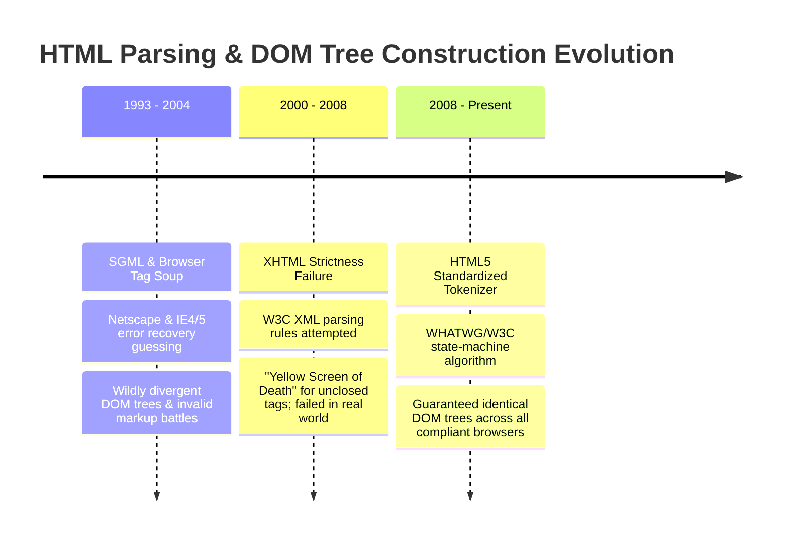

# Chapter 02: DOM & CSSOM Tree Construction (HTML/CSS Tokenization, Speculative Parsing, C++ Blink Node Allocation & Script Blocking)

> "A web page does not execute as text. Before a single style can be computed or a single script can manipulate a layout, raw network bytes must undergo lexical tokenization, stack-based tree construction, and C++ memory allocation within the Blink engine. Understanding this pipeline is the key to mastering the Critical Rendering Path."  
> — **Browser Rendering Engine Internals**

---

## 1. Why This Topic Exists

When an HTTP response arrives over the network, it is nothing more than a stream of raw binary bytes. Transforming those bytes into an interactive visual application requires two foundational data structures:
1. **The Document Object Model (DOM):** The tree representation of the HTML document.
2. **The CSS Object Model (CSSOM):** The tree representation of the cascade and stylesheets.

Most developers assume HTML parsing is simple and linear. It is neither:
- **HTML Parsing is Non-Deterministic:** Unlike standard programming languages (which can be parsed with formal Context-Free Grammars), HTML parsing cannot be purely pre-parsed because JavaScript can execute mid-stream and inject arbitrary markup using `document.write()`.
- **The CSSOM Script-Blocking Barrier:** Many engineers do not realize that **CSS blocks JavaScript execution**. If the browser encounters a `<script>` tag while a stylesheet is still downloading, the browser **freezes JavaScript execution** until the CSSOM finishes building, because scripts might query element geometries via `window.getComputedStyle()`.
- **The C++ Blink to V8 Engine Bridge:** The DOM does not live in JavaScript's V8 heap. It lives in the browser's C++ memory space (Blink engine). Every `document.getElementById` or property mutation crosses a high-overhead cross-context bridge.

Mastering how the DOM and CSSOM are constructed, how the **Speculative Preload Scanner** mitigates network latency, and how script execution blocks the parser is fundamental to optimizing web performance.

---

## 2. Learning Objectives

- Trace the 5-stage pipeline from raw network bytes to memory trees: **Bytes → Characters → Tokens → Nodes → DOM Tree**.
- Understand the state machine of the HTML5 Tokenizer and the open-element stack management in the Tree Builder.
- Dissect the construction of the CSSOM and understand why stylesheets are render-blocking and script-blocking.
- Inspect how the **Speculative Preload Scanner** runs on a background thread to discover sub-resources before the main parser unblocks.
- Analyze the memory layout of C++ `blink::Element` objects and the cost of the **V8-to-Blink cross-context bridge**.
- Differentiate between `<script>`, `<script defer>`, `<script async>`, and `<script type="module">` at the parser level.
- Bridge architectural mental models directly to **Angular** (AOT template compilation bypassing HTML parsing) and **.NET** (ASP.NET Core Razor tokenization and Blazor WebAssembly DOM bridge).

---

## 3. Historical Evolution



<details className="raw-schematic-details">
<summary>📄 View Raw ASCII Schematic</summary>

```text
ERA 1: SGML & Fault-Tolerant Browser Tag Soup (1993 - 2004)
┌────────────────────────────────────────────────────────┐
│ Netscape Navigator, Internet Explorer 4/5.             │
│ - No standardized error recovery rules.                │
│ - Browsers guessed intent on malformed HTML (`<b><i></b>`)│
│ - Wildly divergent DOM trees across different browsers. │
└────────────────────────────────────────────────────────┘
                           │
                           ▼
ERA 2: XHTML Strictness Failure (2000 - 2008)
┌────────────────────────────────────────────────────────┐
│ W3C attempted to force XML parsing rules on the web.   │
│ - Any syntax error (unclosed <p>) showed "Yellow Screen│
│   of Death" to users.                                  │
│ - Failed because real-world web content was messy.     │
└────────────────────────────────────────────────────────┘
                           │
                           ▼
ERA 3: HTML5 Standardized Parsing Algorithm (2008 - Present)
┌────────────────────────────────────────────────────────┐
│ WHATWG & W3C HTML5 Specification.                      │
│ - Mathematically defined parsing & error-recovery specs│
│ - Guarantee: Any HTML input produces the identical DOM │
│   tree across all compliant browsers.                  │
│ - Introduces the background Speculative Preload Scanner│
└────────────────────────────────────────────────────────┘
```

</details>

---

## 4. First Principles & Intuitive Physical Analogies (Layer 1)

### Analogy 1: The Assembly Line with the Red Emergency Stop Lever

Imagine an industrial manufacturing plant:
- **Raw Material Ingestion:** Rolls of sheet metal (raw binary bytes) enter the factory. A machine cuts them into standardized stamped parts: bolts, plates, gears (Tokens: `StartTag: div`, `EndTag: p`).
- **The Construction Stack (DOM Tree):** Workers bolt parts together into a complex mechanical tractor (The DOM Tree).
- **The Blueprint (CSSOM):** The painting instructions and dimension specs arrive simultaneously on a separate conveyor.
- **The `<script>` Tag is the Guest Inspector with the Emergency Stop Lever:**  
  When an un-deferred `<script>` arrives on the conveyor belt, **the entire assembly line grinds to an immediate halt**.
  - Why? The inspector might use a sledgehammer to remodel the tractor (`document.body.appendChild`) or ask for its exact color (`getComputedStyle`).
  - If the paint blueprint (CSSOM) is still in the mail, the inspector refuses to look at the tractor until the blueprint arrives.
  - While the main assembly line is frozen, a nimble scout running ahead on the catwalks (The **Speculative Preload Scanner**) spots upcoming orders for wheels and headlights and radios the warehouse to start shipping them immediately!

### Analogy 2: The Foreign Embassy Bridge (V8 to Blink C++)

- In your living room sits **JavaScript (The V8 Engine)**. It speaks JavaScript fluently.
- Down the street across an international border sits **The DOM Tree (The Blink C++ Engine)**. It speaks native C++.
- When you execute `document.getElementById('header').style.color = 'red'`, JavaScript cannot simply reach over and flip a memory bit.
- It must hire an official translator, walk across the international customs bridge (the **Cross-Context Binding Bridge**), submit the request in C++, wait for Blink to mutate its internal `blink::Element` C++ struct, and walk back.
- Doing this once takes 1 microsecond. Doing this 10,000 times in a tight loop causes massive frame drops!

---

## 5. Internal Working & Engine Architecture (Layer 2)

### 1. The 5-Stage DOM Construction Pipeline

```text
Network Byte Stream (01001000 01010100...)
       │
       ▼ (Stage 1: Decoding - UTF-8 character conversion)
Characters ('<', 'h', 't', 'm', 'l', '>')
       │
       ▼ (Stage 2: Tokenization - State machine emits Tag tokens)
Tokens (StartTag: html, StartTag: body, StartTag: div, Text: Hello, EndTag: div...)
       │
       ▼ (Stage 3: Tree Construction - Open Element Stack resolution)
C++ Blink Nodes (blink::HTMLDivElement, blink::TextNode allocated via Oilpan GC)
       │
       ▼ (Stage 4: Document Linking)
DOM Tree (In-Memory Tree Structure)
```

### 2. The HTML Tokenizer State Machine
The HTML tokenizer is a formal state machine defined by WHATWG:
- **Data State:** Consumes characters until it encounters `<`. Transitions to **Tag Open State**.
- **Tag Open State:** If followed by an ASCII letter, transitions to **Tag Name State** and constructs a `StartTag` token. If followed by `/`, transitions to **End Tag Open State**.
- **Self-Correction & Recovery:** If it encounters malformed nesting like `<b><i>Bold & Italic</b></i>`, the HTML5 parser executes the **Adoption Agency Algorithm**, repairing the hierarchy so the DOM remains a valid tree without throwing an exception.

### 3. The CSSOM Construction Pipeline
CSS parsing differs from HTML parsing because CSS is context-free:
1. CSS text is tokenized into rules, selectors, and declarations.
2. The browser builds a hierarchical tree where child nodes inherit styles from parent nodes.
3. **CSS is Render-Blocking:** The browser will **never** paint any pixels on the screen until the CSSOM is 100% complete, because rendering without styles would cause an unacceptable **Flash of Unstyled Content (FOUC)**.
4. **CSS is Script-Blocking:** If a `<script>` tag is encountered, the browser pauses execution of that script until all preceding stylesheets have finished downloading and parsing.

```text
HTML Parser encountered <script>
              │
              ▼
    Are stylesheets still loading?
             / \
       YES  /   \  NO
           /     \
          ▼       ▼
    PAUSE SCRIPT  EXECUTE SCRIPT
    WAIT CSSOM    IMMEDIATELY
```

### 4. The Speculative Preload Scanner
Because parsing can freeze on `<script>` tags, modern browsers deploy the **Speculative Preload Scanner**:
- While the Main Thread is blocked waiting for scripts or stylesheets, a secondary background thread scans ahead through the remaining unparsed HTML stream.
- It searches specifically for external resource URLs: `<link rel="stylesheet">`, `<script src="...">`, and ``.
- It immediately dispatches asynchronous fetch requests to the **Network Process**, pre-warming the cache so the files are already downloaded by the time the main HTML parser catches up!

---

## 6. Runtime Flow & Execution Traces

### Execution Trace: Full Document Parse with Mixed Resources

```text
Timeline (Milliseconds)
t = 0ms     Network receives first chunk of HTML bytes.
t = 10ms    Parser encounters <link rel="stylesheet" href="styles.css">.
            -> Network Process begins downloading styles.css (Async).
            -> HTML Parser CONTINUES parsing HTML.
t = 25ms    Parser encounters <script src="analytics.js"></script> (No defer/async!).
            -> CRITICAL HALT: HTML parser STOPS.
            -> Is styles.css still downloading? YES!
            -> Parser blocks on styles.css BEFORE executing analytics.js!
            -> Background Preload Scanner wakes up: finds  ahead.
            -> Dispatches download for hero.jpg.
t = 70ms    styles.css finishes downloading. CSSOM constructed.
t = 75ms    analytics.js finishes downloading. V8 executes analytics.js.
t = 90ms    analytics.js completes execution.
t = 95ms    HTML Parser RESUMES from where it paused.
t = 120ms   Final </html> token parsed.
t = 125ms   Browser fires `DOMContentLoaded` event on `document`!
```

---

## 7. Memory Model & Blink C++ Node Heap Layout

In Chromium's Blink engine:
- Every DOM element is an instance of a C++ class: `blink::HTMLDivElement` inheriting from `blink::Element`, `blink::ContainerNode`, and `blink::Node`.
- Nodes are managed by Blink’s dedicated garbage collector: **Oilpan** (`cppgc`).
- When JavaScript interacts with a node (`const el = document.querySelector('div')`):
  1. V8 allocates a lightweight JavaScript wrapper object (`v8::internal::JSObject`) on the V8 nursery heap.
  2. This JS wrapper contains an internal pointer holding the raw memory address of the C++ `blink::Element` struct.
  3. **The Memory Weight:** While an ephemeral React Virtual DOM object costs ~64 bytes in JavaScript memory, the underlying C++ `blink::Element` costs **300 to 800 bytes** of memory due to parent/sibling pointers, attribute vectors, layout flags, and event listener lists.

---

## 8. Visual Diagrams (ASCII / Text)

### Script Loading Behavior: Parser-Blocking vs. Defer vs. Async vs. Module

```mermaid
flowchart TD
    subgraph Standard["1. Standard &lt;script src='...'&gt; (Synchronous Blocking)"]
        direction LR
        S_Parse1["HTML Parsing"] --> S_Wait["🛑 Parsing BLOCKED<br/>(Network Download + Script Execution)"] --> S_Parse2["HTML Parsing Resumes"]
    end

    subgraph AsyncScript["2. &lt;script async src='...'&gt; (Asynchronous Interruption)"]
        direction LR
        A_Parse1["HTML Parsing Continues<br/>(Parallel Background Download)"] --> A_Exec["⚡ Executes MOMENT download finishes<br/>(Interrupts parser immediately)"] --> A_Parse2["HTML Parsing Resumes"]
    end

    subgraph DeferScript["3. &lt;script defer src='...'&gt; (Non-Blocking Deferred)"]
        direction LR
        D_Parse["HTML Parsing Runs Uninterrupted to Completion<br/>(Parallel Background Download)"] --> D_Exec["✅ Executes strictly AFTER DOM is built<br/>(Preserves document order before DOMContentLoaded)"]
    end

    subgraph ModuleScript["4. &lt;script type='module'&gt; (ES Module Standard)"]
        direction LR
        M_Parse["HTML Parsing Runs Uninterrupted<br/>(Deferred by default; scoped execution)"] --> M_Exec["✅ Executes strictly AFTER HTML parsing finishes"]
    end

    classDef block fill:#1e293b,stroke:#ef4444,stroke-width:1px,color:#f8fafc;
    classDef async fill:#1e293b,stroke:#f59e0b,stroke-width:1px,color:#f8fafc;
    classDef defer fill:#0f172a,stroke:#34d399,stroke-width:2px,color:#f8fafc;

    class S_Parse1,S_Wait,S_Parse2 block;
    class A_Parse1,A_Exec,A_Parse2 async;
    class D_Parse,D_Exec,M_Parse,M_Exec defer;
```



<details className="raw-schematic-details">
<summary>📄 View Raw ASCII Schematic</summary>

```text
LEGEND:
[=== HTML Parsing ===]  [--- Downloading Script ---]  [*** Executing Script ***]

1. Standard <script src="...">
[=== Parsing ===]                      [=== Parsing ===]
                 [--- Download ---][*** Execute ***]
(HTML parsing completely halts during download AND execution!)

2. <script async src="...">
[=============== Parsing ===============]
                 [--- Download ---][*** Execute ***]
(Downloads in background; executes the MOMENT it downloads, interrupting parsing!)

3. <script defer src="...">
[=========================== Parsing ===========================]
                 [--- Download ---]                              [*** Execute ***]
(Downloads in background; executes strictly AFTER HTML parsing finishes, in order!)

4. <script type="module" src="...">
[=========================== Parsing ===========================]
                 [--- Download ---]                              [*** Execute ***]
(Deferred by default; scoped to module; strictly preserves execution order!)
```

</details>


---

## 9. Real World Usage & Production Patterns

### Pattern 1: High-Performance Critical Path Resource Hints

```html
<!DOCTYPE html>
<html lang="en">
<head>
  <meta charset="UTF-8">
  <title>Enterprise Portal</title>

  <!-- 1. Preconnect to critical API and CDN origins to negotiate TLS early -->
  <link rel="preconnect" href="https://fonts.gstatic.com" crossorigin>
  <link rel="preconnect" href="https://api.enterprise.com">

  <!-- 2. Preload critical fonts & hero image (Discovered by Preload Scanner immediately) -->
  <link rel="preload" href="/fonts/inter-var.woff2" as="font" type="font/woff2" crossorigin>
  <link rel="preload" href="/images/hero-banner.webp" as="image" fetchpriority="high">

  <!-- 3. Critical CSS (Render-blocking, but small and inlined or fast CDN) -->
  <link rel="stylesheet" href="/css/critical.css">

  <!-- 4. Non-critical CSS loaded asynchronously without blocking render -->
  <link rel="preload" href="/css/non-critical.css" as="style" onload="this.onload=null;this.rel='stylesheet'">
  <noscript><link rel="stylesheet" href="/css/non-critical.css"></noscript>

  <!-- 5. Scripts deferred to guarantee 0ms parser blocking -->
  <script defer src="/js/app-bundle.js"></script>
</head>
<body>
  <div id="root"></div>
</body>
</html>
```

### Pattern 2: Auditing Parser Blocking in Chrome DevTools

1. Open DevTools → **Performance Panel** → Record page load.
2. Under the **Main Thread** flamechart, locate the long purple **`Parse HTML`** block.
3. Look for vertical breaks in `Parse HTML`:
   - If you see `Evaluate Script` dividing `Parse HTML`, an un-deferred script is blocking your parser!
   - Hover over the script task to find the offending third-party script.

---

## 10. Angular Comparison

| Dimension | Browser DOM & CSSOM | Angular (v17+) |
| :--- | :--- | :--- |
| **Template Parsing** | Browser parses raw HTML strings into C++ `blink::Node` trees at runtime. | Angular AOT Compiler parses HTML templates at **build time**, emitting optimized JavaScript instructions. |
| **DOM Creation Mechanism** | C++ HTML Tokenizer allocates elements sequentially. | Angular runtime directly calls `renderer.createElement()` / native `document.createElement()` without HTML parser. |
| **Style Scoping** | Global CSSOM cascade; specificity wars; all styles are global. | Angular Emulated View Encapsulation injects unique host attributes (`_ngcontent-c12`) into Blink nodes. |
| **Script Execution** | Managed by browser parser; blocking scripts halt DOM construction. | Angular lazy chunks load via dynamic `import()`, completely non-blocking to the initial DOM parse. |

---

## 11. .NET Comparison

| Dimension | Browser DOM & CSSOM | ASP.NET Core & Blazor |
| :--- | :--- | :--- |
| **HTML Tokenization** | Native C++ Blink HTML5 Tokenizer running inside the client sandbox. | `RazorViewEngine` and `HtmlEncoder` tokenizing `.cshtml` / `.razor` strings on the server. |
| **Tree Abstraction** | Document Object Model (DOM) living in C++ process memory. | Blazor `RenderTree` (an in-memory C# array structure representing UI elements). |
| **Bridge Overhead** | V8 $\leftrightarrow$ Blink C++ Cross-Context Bridge. | WebAssembly $\leftrightarrow$ JavaScript JSImport / JSExport Bridge (in Blazor WASM). |
| **CSS Management** | CSSOM parsed and cascaded directly in the browser engine. | CSS Isolation (`.razor.css`) scoped at build time using attribute selectors (`b-xxxxxx`). |

---

## 12. Enterprise Perspective & Production Risks (Layer 4)

### 1. The Excessive DOM Size Trap (> 1,500 Nodes)
- **The Failure Mode:** An enterprise data grid renders 10,000 table rows directly into the DOM without virtualization.
- **The Engine Impact:**
  - Memory consumption spikes by 150 MB (due to 10,000 `blink::HTMLTableRowElement` C++ structures).
  - Every subsequent CSS style recalculation must traverse 10,000 nodes ($O(n)$ complexity), turning simple hover interactions into 200ms CPU freezes.
  - DevTools Lighthouse audit throws: **`Avoid an excessive DOM size (Threshold: 800 nodes optimal, 1,400 maximum)`**.
- **The Architectural Fix:** Implement **Virtualization** (`@tanstack/react-virtual` or Angular CDK Virtual Scroll). Only render the ~30 DOM rows currently visible within the user's viewport.

### 2. The Detached DOM Tree Memory Leak
- **The Failure Mode:** A single-page application removes a modal window from the UI, but a global JavaScript event listener retains a reference to an inner button:
  ```typescript
  // GLOBAL LEAK
  const button = document.getElementById('save-btn');
  window.addEventListener('resize', () => {
    console.log(button.clientWidth);
  });
  // Modal is removed from DOM via parent.removeChild(modal);
  ```
- **The Engine Impact:** Even though the modal is removed from the screen, the V8 closure holds a reference to `button`. In Blink, a single child node reference keeps the **entire ancestor DOM tree allocated in C++ memory**! Over hours of user sessions, memory balloons until the tab crashes with `Out of Memory`.

---

## 13. Performance Considerations

```text
Resource Loading Attribute Matrix
┌──────────────────────┬──────────────────────┬──────────────────────┬──────────────────┐
│ Script Attribute     │ Download Behavior    │ Execution Timing     │ Parser Blocking  │
├──────────────────────┼──────────────────────┼──────────────────────┼──────────────────┤
│ Standard (<script>)  │ Halts HTML Parser    │ Immediately          │ YES (Severe)     │
│ async                │ Background (Parallel)│ Immediately on load  │ YES (Interrupted)│
│ defer                │ Background (Parallel)│ After DOM complete   │ NO (Zero Block)  │
│ type="module"        │ Background (Parallel)│ After DOM complete   │ NO (Zero Block)  │
└──────────────────────┴──────────────────────┴──────────────────────┴──────────────────┘
```

---

## 14. Tradeoffs

| Technique | Pros | Cons |
| :--- | :--- | :--- |
| **Inline Critical CSS** | 0ms network latency; instantaneous CSSOM construction; eliminates FOUC. | Bloats HTML file size; uncacheable across multiple routes. |
| **External Stylesheet** | Cached indefinitely by HTTP browser cache; shared across all pages. | Render-blocking on cold page load; incurs network round-trip. |
| **`defer` Script Loading** | Guarantees non-blocking DOM parse; strictly preserves script execution order. | Cannot execute immediately for scripts needed before paint (e.g., theme toggle). |
| **`async` Script Loading** | Downloads non-blocking; ideal for isolated third-party beacons (Google Analytics). | Non-deterministic execution order; can break if scripts depend on one another. |

---

## 15. Common Mistakes & Interview Traps

### Trap 1: Believing CSS Does Not Block JavaScript
- **Scenario:** The interviewer asks: *"Does an external stylesheet block an un-deferred `<script>` tag?"*
- **Candidate Answer:** *"No, CSS only blocks rendering, it doesn't block JavaScript."*
- **Correction:** **COMPLETELY WRONG.** The browser will **pause script execution** until pending stylesheets finish downloading and parsing. If JavaScript executes `window.getComputedStyle(element).color`, it requires the CSSOM to return an accurate answer. Therefore, CSSOM blocks JavaScript!

### Trap 2: Confusing `DOMContentLoaded` with the `load` Event
- **Scenario:** An engineer attaches a metric probe to `window.onload` thinking it measures when the DOM is ready.
- **The Reality:**
  - **`DOMContentLoaded`:** Fires when the HTML parser has finished constructing the DOM tree and all deferred scripts have executed. External images, iframes, and async scripts may still be downloading.
  - **`window.onload`:** Fires only when the document **and all external sub-resources** (images, stylesheets, fonts, iframes) have 100% completed downloading.

---

## 16. Interview Questions & Architectural Answers (Senior, Lead, Architect - Layer 5)

### Question 1 (Senior): "Why is an inline `<script>` placed directly after an external `<link rel='stylesheet'>` a severe performance bottleneck?"
**Architectural Answer:**  
Even though the inline script has zero download latency (it is already embedded in the HTML), the browser **refuses to execute it** until the preceding external stylesheet finishes downloading and the CSSOM is constructed. Because the inline script cannot execute, the **HTML parser is completely paused**. This creates a catastrophic serialization bottleneck where HTML parsing, DOM construction, and subsequent rendering are held hostage by the stylesheet download!

### Question 2 (Lead): "How does Blink's Speculative Preload Scanner work, and what coding patterns blind it from discovering critical assets?"
**Architectural Answer:**  
The **Speculative Preload Scanner** runs on a secondary thread, scanning ahead through raw HTML tokens to detect external URLs (`<link>`, `<script>`, ``) and initiating speculative downloads while the main parser is blocked.  
**Patterns that blind the Preload Scanner:**
1. **Dynamic Script Injections:** `const s = document.createElement('script'); s.src = 'app.js'; document.head.appendChild(s);` (Invisible to raw HTML tokens).
2. **CSS `@import` rules:** Hidden inside CSS stylesheets; requires downloading the first CSS file before the second is discovered.
3. **Hidden URLs in JavaScript:** Loading assets via string concatenation or config objects.  
**Mitigation:** Use declarative HTML tags or explicit `<link rel="preload">` tags in the document `<head>`.

### Question 3 (Architect): "How do modern frontend compilers like React 19 and Angular optimize away the V8-to-Blink cross-context bridge penalty?"
**Architectural Answer:**  
1. **Batching & Dirty Marking:** Rather than mutating individual DOM nodes directly on every state tick, frameworks batch updates.
2. **Virtual DOM Diffing (React):** Reconciles in pure V8 heap memory (~64-byte objects), calculating the minimum set of mutations before making a batched cross-context bridge call during the Commit Phase.
3. **Direct Element Instructions (Angular / Solid / Svelte):** Compilers bypass runtime Virtual DOM trees completely, generating compiled direct-instruction code paths that perform surgical, single-instruction property updates (`element.textContent = val`), eliminating intermediary bridge traversal overhead.

---

## 17. Senior-Level Mental Model & "How to Remember This Forever" (Memory Anchors - Layer 3)

### The Memory Peg: "The Tractor Assembly Line and The Legal Inspector"
- **The DOM is the Tractor:** Built from stamped metal parts (tokens) on the conveyor belt.
- **The CSSOM is the Paint Blueprint:** Tells the factory what color the tractor must be.
- **The `<script>` is the Legal Inspector:** Pulls the emergency stop lever. If the paint blueprint isn't in their hands, the inspector refuses to budge, and the whole factory halts.
- **The Preload Scanner is the Drone Flying Overhead:** Sees that tires and windows are needed further down the road, and radios the warehouse to start shipping them immediately.

---

## 18. Core Vocabulary & "Aha!" Breakthrough Insights (Refresher)

- **DOM (Document Object Model):** The C++ tree representation of an HTML document in Blink memory.
- **CSSOM (CSS Object Model):** The tree representation of associated style rules and their cascade.
- **Speculative Preload Scanner:** A secondary browser thread that scans ahead through HTML to download sub-resources before the main parser arrives.
- **Render-Blocking:** An asset that prevents the browser from drawing pixels until it finishes downloading and parsing (CSS stylesheets).
- **The "Aha!" Insight:** The DOM does not live in JavaScript! It lives in Blink's C++ memory. Every time you touch the DOM from JavaScript, you are paying a cross-language translation toll!

---

## 19. Key Takeaways

1. **DOM construction is a 5-stage pipeline:** Bytes → Characters → Tokens → Nodes → DOM Tree.
2. **CSS is render-blocking and script-blocking:** Un-deferred scripts freeze execution until preceding stylesheets finish parsing.
3. **The Speculative Preload Scanner mitigates blocking scripts** by discovering and downloading assets on a background thread.
4. **Always use `<script defer>` or `<script type="module">`** to ensure scripts download in the background without halting the HTML parser.
5. **Keep total DOM depth under 32 levels and total node count under 800** to prevent high style recalculation latency.
6. **Beware of detached DOM trees:** JavaScript event listeners holding references to removed elements cause severe memory leaks.

---

## 20. Revision Sheet

```text
┌────────────────────────────────────────────────────────────────────────────────────────┐
│                        DOM & CSSOM CONSTRUCTION CHEAT SHEET                            │
├────────────────────────────────────────────────────────────────────────────────────────┤
│ Pipeline Stages:                                                                       │
│   Bytes -> Characters -> Tokens -> C++ Blink Nodes -> In-Memory DOM Tree               │
│                                                                                        │
│ Script Attributes Comparison:                                                          │
│   <script src="a.js">           // BLOCKS HTML Parser during download & execution      │
│   <script async src="a.js">     // Parallel download; executes IMMEDIATELY when ready  │
│   <script defer src="a.js">     // Parallel download; executes strictly AFTER DOM parse│
│   <script type="module">        // Deferred by default; strict execution order         │
│                                                                                        │
│ Critical Resource Hints:                                                               │
│   <link rel="preconnect" href="...">        // Pre-warms DNS + TLS handshake           │
│   <link rel="preload" href="..." as="...">  // Forces high-priority early download     │
│                                                                                        │
│ Architectural Golden Rule:                                                             │
│   "Never let scripts halt the parser; keep stylesheets lean and scripts deferred."     │
└────────────────────────────────────────────────────────────────────────────────────────┘
```
