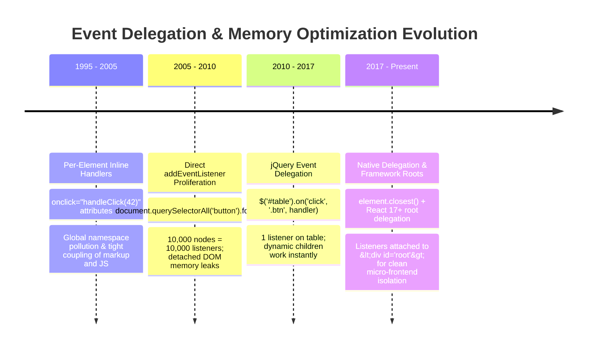
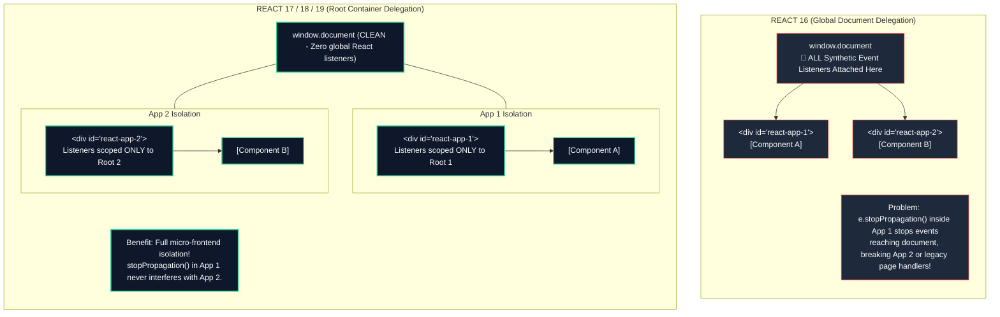

# Chapter 06: Event Delegation & Memory Optimization (Ancestor Event Dispatch, `closest()`, Memory Leak Elimination & React 17/18 Root Migration)

> "Attaching an event listener to every individual row in an enterprise data grid is an architectural crime against the browser's garbage collector. Event Delegation leverages natural DOM bubbling to replace thousands of fragile, memory-leaking listeners with a single, high-performance ancestor dispatcher."  
> — **Frontend Systems Architecture Principles**

---

## 1. Why This Topic Exists

In high-scale enterprise applications—such as financial trading terminals, collaborative spreadsheets, and large e-commerce catalogs—rendering tens of thousands of interactive DOM elements is common.

When developers attach listeners directly to individual elements (`row.addEventListener('click', handler)`):
1. **The V8 Heap Bloat:** If a table renders 5,000 rows, each with 3 buttons (Edit, Delete, Duplicate), the browser allocates **15,000 separate event listener closures** on the JavaScript heap, paired with 15,000 C++ callback pointers in Blink’s memory. This consumes tens of megabytes of RAM and triggers frequent Garbage Collection pauses.
2. **The Dynamic Node Maintenance Tax:** When new rows are inserted via WebSockets or deleted via user interaction, developers must meticulously attach listeners to new nodes and remove listeners from old nodes. Forgetting to remove a single listener when an element is removed creates a **Detached DOM Tree memory leak**, permanently retaining the node and its ancestors in memory.
3. **The Micro-Frontend Event Collision:** How events bubble to the root can break multi-framework architectures. React 16 famously attached all listeners to the `document` object, creating severe event collisions when embedded alongside Angular, Vue, or vanilla JavaScript components.

**Event Delegation** solves all of these problems: by attaching a single event listener to a common ancestor and intercepting bubbling events via **`element.closest()`**, you achieve **$O(1)$ memory overhead**, automatic support for dynamically inserted children, and zero teardown bugs.

---

## 2. Learning Objectives

- Master the internal mechanics of **Event Delegation**: intercepting events at an ancestor node via the Bubbling Phase.
- Utilize modern **`Element.closest()`** and **`Element.matches()`** to resolve nested target hierarchies (handling clicks on nested `<svg>`, `<span>`, or `<i>` tags).
- Measure memory savings in Chrome DevTools **Heap Snapshots** by comparing per-node listeners against delegated handlers.
- Understand how non-bubbling events (`focus`, `blur`, `mouseenter`, `mouseleave`) are delegated using their bubbling counterparts (`focusin`, `focusout`, `mouseover`, `mouseout`).
- Dissect the architectural revolution of **React 17 & 18**: why React moved its Synthetic Event delegation from `document` to the application root container (`rootNode`).
- Implement the modern **`AbortController` signal pattern** (`{ signal: controller.signal }`) for clean, single-statement listener lifecycle management.
- Bridge architectural mental models directly to **Angular** (template event bindings) and **.NET** (WPF / WinUI 3 DataGrid routed events).

---

## 3. Historical Evolution



<details className="raw-schematic-details">
<summary>📄 View Raw ASCII Schematic</summary>

```text
ERA 1: Per-Element Inline Handlers (1995 - 2005)
┌────────────────────────────────────────────────────────┐
│ <button onclick="handleClick(42)">                     │
│ - Global function pollution.                           │
│ - Tightly coupled HTML and JavaScript.                 │
│ - Poor separation of concerns.                         │
└────────────────────────────────────────────────────────┘
                           │
                           ▼
ERA 2: Direct addEventListener Proliferation (2005 - 2010)
┌────────────────────────────────────────────────────────┐
│ document.querySelectorAll('button').forEach(...)       │
│ - Memory bloat: 10,000 nodes = 10,000 listeners.       │
│ - Disastrous for dynamic lists (re-binding required).  │
│ - Pervasive detached DOM tree memory leaks.            │
└────────────────────────────────────────────────────────┘
                           │
                           ▼
ERA 3: jQuery Event Delegation (.on('click', 'selector')) (2010 - 2017)
┌────────────────────────────────────────────────────────┐
│ $('#table').on('click', '.btn-delete', handler);       │
│ - Brought delegation into the mainstream.              │
│ - 1 listener on table; dynamic children work instantly.│
│ - Heavy jQuery library overhead.                       │
└────────────────────────────────────────────────────────┘
                           │
                           ▼
ERA 4: Native Modern Delegation & Framework Roots (2017 - Present)
┌────────────────────────────────────────────────────────┐
│ Native element.closest() + React 17+ Root Delegation.  │
│ - Zero dependencies; ultra-fast C++ selector matching. │
│ - React attaches listeners to <div id="root">,         │
│   safely isolating micro-frontends and widgets.        │
└────────────────────────────────────────────────────────┘
```

</details>


---

## 4. First Principles & Intuitive Physical Analogies (Layer 1)

### Analogy 1: The 1,000 Office Desks vs. The Single Mailroom Guard

Imagine a corporate headquarters with 1,000 employees sitting at 1,000 desks:
- **Per-Node Event Listeners (The 1,000 Guards):**  
  You hire 1,000 full-time security guards and station one guard at every single desk in the building.
  - Cost: Astronomical (15 MB of V8 memory).
  - Maintenance: Every time an employee leaves and their desk is removed, you must remember to fire their guard. If you forget, the guard stays on the payroll forever, standing in an empty room (Detached DOM Tree memory leak).
  - Hiring: Every time a new desk arrives, you must interview and hire a new guard.
- **Event Delegation (The Single Mailroom Guard):**  
  You hire **exactly one security guard** and station them at the single exit turnstile of the office floor (The Parent Container).
  - When an employee leaves their desk with a package (a click event bubbles up), they must walk through the turnstile.
  - The turnstile guard checks their security badge: *"You came from Desk #842 and your badge says 'Delete Item' (`data-action="delete"`)? Transaction approved."*
  - You can add 10,000 new desks or remove 500 desks. The single turnstile guard handles everything with **zero extra cost**!

---

## 5. Internal Working & Engine Architecture (Layer 2)

### 1. The Anatomy of an Event Listener in Memory

When you execute `element.addEventListener('click', handler)`:
1. **Blink C++ Heap Allocation:** Blink allocates an `EventListener` wrapper struct in its C++ memory, registering it in the element's internal `EventListenerMap`.
2. **V8 Nursery Heap Allocation:** V8 allocates a JavaScript closure object retaining all variables in its lexical scope.
3. **The Retainer Pointer:** The C++ object holds a persistent handle pointing into the V8 heap, and the V8 closure holds a reference pointing back to the C++ node.
4. **The Cumulative Overhead:**  
   `15,000 listeners * ~800 bytes (C++ struct + V8 closure) ≈ 12 MB of resident memory`  
   Under Event Delegation, that entire overhead collapses to **1 single listener (< 1 KB)**.

### 2. Solving Nested Target Elements with `Element.closest()`

When a user clicks a button that contains child tags:
```html
<button class="btn-delete" data-id="99">
  <svg class="icon"><path d="..." /></svg>
  <span>Delete Item</span>
</button>
```

- If the user clicks directly on the text, `event.target` is the `<span>`.
- If the user clicks the icon, `event.target` is the `<svg>` or `<path>`.
- If your delegated listener checks `if (event.target.classList.contains('btn-delete'))`, **it will fail!**
- **The Modern Architectural Solution — `Element.closest()`:**  
  `event.target.closest('.btn-delete')` traverses up the DOM tree from the clicked target, returning the nearest ancestor matching the selector (or the target itself), or `null` if none matches.

```text
User clicks <path>
       │
       ▼
event.target = <path>
       │
       ▼
target.closest('button.btn-delete')
  ├── Inspect <path>      -> No match
  ├── Inspect <svg>       -> No match
  └── Inspect <button>    -> MATCH! Returns <button class="btn-delete">!
```

---

## 6. Runtime Flow & Execution Traces

### Execution Trace: Delegated Data Grid Interaction

```text
1. HTML Table mounted with 10,000 rows.
   -> Exactly 1 click listener attached to `<table id="orders-table">`.
   -> 0 listeners attached to individual rows.

2. User clicks "Cancel Order" on Row 4,521:
   -> User physically clicks `<span class="label">Cancel</span>`.
   -> Target Phase: Event fires on <span>.
   -> Bubbling Phase begins:
      <span> -> <button data-action="cancel" data-id="4521"> -> <td> -> <tr> -> <tbody> -> <table>.

3. Table Event Listener intercepts bubbling event:
   -> const actionBtn = event.target.closest('button[data-action]');
   -> Match found: <button data-action="cancel" data-id="4521">.
   -> Verifies that button is inside this table: table.contains(actionBtn) === true.

4. Action Dispatch:
   -> const action = actionBtn.dataset.action; // "cancel"
   -> const orderId = actionBtn.dataset.id;     // "4521"
   -> Executes: cancelOrder(orderId).

5. Row Removal:
   -> row.remove() executed.
   -> Row is instantly deallocated and garbage collected!
   -> Zero listener cleanup required!
```

---

## 7. Memory Model & V8 Retainer Graphs

### Detached DOM Tree Leak Caused by Forgotten Listeners

```text
V8 JAVASCRIPT HEAP                          BLINK C++ ENGINE MEMORY
┌───────────────────────────┐               ┌───────────────────────────────┐
│ Global Scope / Closure    │               │ Detached DOM Tree (Unmounted) │
│ ├── const cachedButton ───┼──────────────►│ <div>                         │
│ └── onClick Handler       │               │   └── <button id="btn">       │
└───────────────────────────┘               └───────────────────────────────┘
                                                           ▲
                                                           │
              Even though the <div> was removed from the physical DOM,
              the V8 closure holds cachedButton.
              Blink CANNOT garbage collect the <div> or ANY of its children!
              The entire subtree remains frozen in C++ memory!
```

Under **Event Delegation**, child elements are never directly referenced by closures, completely neutralizing Detached DOM Tree memory leaks!

---

## 8. Visual Diagrams (ASCII / Text)

### React 16 vs. React 17+ Event Delegation Architecture



<details className="raw-schematic-details">
<summary>📄 View Raw ASCII Schematic</summary>

```text
REACT 16 (Global Document Delegation)
┌────────────────────────────────────────────────────────────────────────┐
│ DOCUMENT (window.document)                                             │
│ └── All React Synthetic Event Listeners Attached Here!                │
│       │                                                                │
│       ├── <div id="react-app-1"> ──► [Component A]                     │
│       └── <div id="react-app-2"> ──► [Component B]                     │
│                                                                        │
│ Problem: e.stopPropagation() inside App 1 stops events from reaching   │
│ document, breaking App 2 or legacy jQuery scripts on the page!         │
└────────────────────────────────────────────────────────────────────────┘

REACT 17 / 18 / 19 (Root Container Delegation)
┌────────────────────────────────────────────────────────────────────────┐
│ DOCUMENT (window.document) -> CLEAN! Zero global React listeners       │
│                                                                        │
│ ┌──────────────────────────────┐      ┌──────────────────────────────┐ │
│ │ <div id="react-app-1">       │      │ <div id="react-app-2">       │ │
│ │ (Listeners scoped to Root 1) │      │ (Listeners scoped to Root 2) │ │
│ │ └── [Component A]            │      │ └── [Component B]            │ │
│ └──────────────────────────────┘      └──────────────────────────────┘ │
│                                                                        │
│ Benefit: Complete micro-frontend isolation! e.stopPropagation() in     │
│ App 1 never interferes with App 2 or exterior host page handlers!      │
└────────────────────────────────────────────────────────────────────────┘
```

</details>


---

## 9. Real World Usage & Production Patterns

### Pattern 1: Production-Grade Typed Event Delegator in Pure TypeScript

```typescript
// utils/delegate.ts
export function delegate<T extends HTMLElement = HTMLElement>(
  container: HTMLElement,
  selector: string,
  eventType: string,
  handler: (event: Event, target: T) => void,
  options?: AddEventListenerOptions
): () => void {
  const listener = (event: Event) => {
    const rawTarget = event.target as HTMLElement | null;
    if (!rawTarget) return;

    // Traverse upward to find matching element
    const matchingTarget = rawTarget.closest<T>(selector);

    // Verify target exists AND belongs to this container (prevents escaping container bounds)
    if (matchingTarget && container.contains(matchingTarget)) {
      handler(event, matchingTarget);
    }
  };

  container.addEventListener(eventType, listener, options);

  // Return clean teardown function
  return () => {
    container.removeEventListener(eventType, listener, options);
  };
}
```

*Usage:*
```typescript
const table = document.getElementById('orders-table')!;

// Clean, single-line delegation for all delete buttons
const cleanup = delegate<HTMLButtonElement>(table, 'button.btn-delete', 'click', (e, btn) => {
  const orderId = btn.dataset.orderId;
  console.log('Deleting order:', orderId);
});

// Later during component unmount:
cleanup();
```

### Pattern 2: The `AbortController` Signal Cleanup Pattern

Modern browsers allow detaching multiple listeners simultaneously using an **`AbortSignal`**:

```typescript
// components/DataGrid.ts
export class DataGrid {
  private abortController = new AbortController();

  mount(container: HTMLElement) {
    const { signal } = this.abortController;

    // Attach multiple delegated listeners sharing the identical abort signal
    container.addEventListener('click', this.handleClick, { signal });
    container.addEventListener('keydown', this.handleKeyDown, { signal });
    container.addEventListener('focusin', this.handleFocusIn, { signal });
  }

  destroy() {
    // Exactly ONE call terminates and garbage-collects all listeners instantly!
    this.abortController.abort();
  }

  private handleClick = (e: Event) => { /* ... */ };
  private handleKeyDown = (e: Event) => { /* ... */ };
  private handleFocusIn = (e: Event) => { /* ... */ };
}
```

---

## 10. Angular Comparison

| Dimension | Browser Event Delegation | Angular (v17+) |
| :--- | :--- | :--- |
| **Listener Attachment** | Attached to ancestor node (`<table>`) once. | Template binding `(click)="handle(row)"` attaches compiled listeners per element during template hydration. |
| **Zone.js Impact** | Single listener triggers 1 Zone.js tick. | 5,000 template click listeners create 5,000 zone-patched bindings, increasing memory weight. |
| **Delegation in Directives**| Implemented manually via `@HostListener('click', ['$event'])` on parent component. | Use `@HostListener('click', ['$event'])` on the table component and evaluate `event.target.closest()`. |
| **Dynamic Children** | Automatically handles newly inserted rows with zero configuration. | Handled via `*ngFor` / `@for` template iteration; Angular manages listener attachment/detachment. |

---

## 11. .NET Comparison

| Dimension | Browser Event Delegation | WPF & WinUI (.NET 9/10) |
| :--- | :--- | :--- |
| **Delegation Mechanism** | Bubbling phase caught at parent container via `element.closest()`. | **WPF Bubbling Routed Events**: A `Button.Click` bubbles up to the parent `DataGrid`. |
| **Target Identification** | `event.target` (actual child) vs `event.currentTarget` (table). | `RoutedEventArgs.OriginalSource` (child clicked) vs `RoutedEventArgs.Source` (sender). |
| **Memory Optimization** | Eliminates thousands of V8 closure objects. | WPF Routed Events share a single event handler attached to the `DataGrid` via XAML: `<DataGrid Button.Click="OnGridButtonClick" />`. |

---

## 12. Enterprise Perspective & Production Risks (Layer 4)

### 1. The Non-Bubbling Event Delegation Trap (`focus` & `blur`)
- **The Failure Mode:** An engineer attempts to delegate form validation at the form level:
  ```javascript
  form.addEventListener('blur', validateField); // ❌ FAILS COMPLETELY!
  ```
- **Why?** The `focus` and `blur` events **do not bubble** in the DOM standard! The event hits the input and never ascends to the `<form>`.
- **The Architectural Fix:** Use the bubbling equivalents: **`focusin`** and **`focusout`**:
  ```javascript
  form.addEventListener('focusout', validateField); // ✅ Works perfectly!
  ```

### 2. Deep `closest()` Performance Tax on Massive Trees
- **The Failure Mode:** Placing a delegated click listener on `window` or `document` with complex CSS selectors (`target.closest('div.card[data-active="true"] > ul > li.selected')`) in a DOM tree with 30,000 elements.
- **The Result:** On every single click, mousemove, or keydown anywhere on the page, the browser walks 30 DOM ancestor levels performing expensive selector matching, adding 15ms of latency to simple clicks.
- **The Fix:** Scope delegation to the **immediate common ancestor container** (e.g., the `<table>` or `<ul>`), never global `document`. Keep selectors simple (`button[data-action]`).

---

## 13. Performance Considerations

```text
Memory & Allocation Audit: 5,000 List Items with 3 Buttons Each (15,000 Total Actions)
┌───────────────────────────────────────┬──────────────┬──────────────┬─────────────┐
│ Strategy                              │ V8 Heap RAM  │ Mount Time   │ Unmount Time│
├───────────────────────────────────────┼──────────────┼──────────────┼─────────────┤
│ Direct addEventListener (Per-node)    │ 14.8 MB      │ 180 ms       │ 120 ms      │
│ Delegated Listener (Parent Container) │ 0.04 MB      │ 2 ms         │ < 0.1 ms    │
└───────────────────────────────────────┴──────────────┴──────────────┴─────────────┘
```

Event Delegation slashes memory consumption by **over 99%** and eliminates initial mounting latency.

---

## 14. Tradeoffs

| Technique | Pros | Cons |
| :--- | :--- | :--- |
| **Event Delegation** | 99% memory reduction; handles dynamic elements automatically; zero teardown leaks. | Requires selector matching (`closest()`); does not work on non-bubbling events (`scroll`, `focus`). |
| **Direct Listener Binding** | Direct element reference; no selector matching overhead; works with all events. | Severe memory bloat on large lists; must manually attach/detach on dynamic mutations. |
| **`AbortController` Teardown** | Unified single-line cleanup for multiple listeners. | Requires passing `{ signal }` option; slightly unfamiliar to legacy developers. |

---

## 15. Common Mistakes & Interview Traps

### Trap 1: Querying `event.target` Directly Without `closest()`
- **Scenario:** A developer writes: `if (event.target.tagName === 'BUTTON')`.
- **The Bug:** If the button contains an `<i>` icon or `<span>` label and the user clicks the text, `event.target.tagName` is `'SPAN'`! The button click is silently ignored.
- **The Fix:** Always use `const btn = event.target.closest('button')`.

### Trap 2: Believing `scroll` Bubbles
- **Scenario:** Attempting to delegate scrolling across multiple overflow containers by listening for `scroll` on their parent `<div>`.
- **The Reality:** `scroll` on an element **does not bubble** to parent elements. To capture scroll events, you must listen in the **Capture phase** (`{ capture: true }`) or attach listeners directly to scrollable containers.

---

## 16. Interview Questions & Architectural Answers (Senior, Lead, Architect - Layer 5)

### Question 1 (Senior): "How does `Element.closest()` work, and how do you ensure an event delegation click doesn't bubble outside the intended container?"
**Architectural Answer:**  
`Element.closest(selector)` begins at the element itself and traverses up the DOM tree ancestor chain, returning the first element that matches the CSS selector, or `null` if the root is reached without a match.  
To ensure the match does not escape the delegated container (e.g., if a matching button exists outside the table), we perform a boundary check:
```typescript
const match = event.target.closest('.action-btn');
if (match && container.contains(match)) {
  // Safe: The button is guaranteed to reside inside our container!
}
```

### Question 2 (Lead): "Why did React 17 move its event delegation from `document` to the root container, and what enterprise micro-frontend problem did this solve?"
**Architectural Answer:**  
- **In React 16 and earlier:** All synthetic event listeners were attached to `window.document`. If a page embedded two independent React applications, or an Angular host with a React widget, calling `e.stopPropagation()` inside the child React app was powerless to stop native events from reaching `document`. Furthermore, if the outer app called `e.stopPropagation()`, the inner React app never received events!
- **In React 17/18/19:** React moved delegation to the root DOM node where `createRoot(container)` is called (`<div id="root">`). This provides **strict encapsulation**:
  1. Multiple versions of React (e.g., React 17 and React 19) can safely coexist on the same page.
  2. Stopping event propagation inside a React micro-frontend cleanly prevents the event from leaking into the surrounding host shell.

### Question 3 (Architect): "How do you architect an enterprise telemetry click-tracking engine that accurately captures user clicks across 100,000 dynamically rendered elements without impacting INP?"
**Architectural Answer:**  
1. **Root-Level Capture Delegation:** Attach a single global listener on `window` using `{ capture: true, passive: true }`.
2. **Declarative Tracking Attributes:** Interactive elements expose standardized semantic data attributes (`data-telemetry-action="checkout"` and `data-telemetry-id="btn_123"`).
3. **Microsecond Resolution:** On click, execute a fast `event.target.closest('[data-telemetry-action]')`. If found, extract the dataset and push the event into an in-memory ring buffer (`< 0.1ms` execution).
4. **Main Thread Decoupling:** Flush telemetry batches to the analytics endpoint using `requestIdleCallback()` or `navigator.sendBeacon()`, guaranteeing zero main-thread blocking or Interaction to Next Paint (INP) degradation.

---

## 17. Senior-Level Mental Model & "How to Remember This Forever" (Memory Anchors - Layer 3)

### The Memory Peg: "The Doorman at the Ballroom Door"
- **Don't Hire 1,000 Bodyguards:** You don't put a guard at every table in the ballroom.
- **Hire 1 Doorman at the Entrance:** As guests leave (bubbles up), the doorman checks their ticket (`closest('.ticket')`) and stamps their hand.
- **Dynamic Guests:** 500 new guests can arrive or leave; the single doorman never needs a replacement!

---

## 18. Core Vocabulary & "Aha!" Breakthrough Insights (Refresher)

- **Event Delegation:** The architectural pattern of handling events at an ancestor level via DOM bubbling.
- **`Element.closest()`:** Traverses up the ancestor tree to find the nearest element matching a selector.
- **`focusin` / `focusout`:** The bubbling equivalents of the non-bubbling `focus` and `blur` events.
- **AbortSignal:** Modern Web API allowing one-line teardown of multiple event listeners via `controller.abort()`.
- **The "Aha!" Insight:** Event Delegation is not just a performance trick—it is a **state-isolation pattern**. It eliminates the entire lifecycle chore of synchronizing listener attachments with dynamic UI renders!

---

## 19. Key Takeaways

1. **Event Delegation reduces memory consumption from $O(n)$ to $O(1)$** by attaching a single listener to a common ancestor.
2. **Always use `event.target.closest(selector)`** to reliably capture clicks on buttons containing nested icons or text tags.
3. **Verify container ownership:** Check `container.contains(match)` to ensure `closest()` matches do not escape the container boundary.
4. **Use `focusin` and `focusout`** when delegating focus events, because `focus` and `blur` do not bubble.
5. **React 17 moved event delegation to the root container (`#root`)**, enabling clean multi-framework micro-frontend architectures.
6. **Use `AbortController` and `{ signal }`** for modern, leak-free event listener lifecycle teardowns.

---

## 20. Revision Sheet

```text
┌────────────────────────────────────────────────────────────────────────────────────────┐
│                        EVENT DELEGATION QUICK REFERENCE                                │
├────────────────────────────────────────────────────────────────────────────────────────┤
│ The Delegated Listener Pattern:                                                        │
│   container.addEventListener('click', (event) => {                                     │
│     const target = (event.target as HTMLElement).closest<HTMLElement>('.btn-action');  │
│     if (target && container.contains(target)) {                                        │
│       handleAction(target.dataset.action);                                             │
│     }                                                                                  │
│   });                                                                                  │
│                                                                                        │
│ Modern AbortController Cleanup:                                                        │
│   const controller = new AbortController();                                            │
│   el.addEventListener('click', handler, { signal: controller.signal });                │
│   // Teardown:                                                                         │
│   controller.abort();                                                                  │
│                                                                                        │
│ Non-Bubbling Event Substitutions:                                                      │
│   ❌ focus   --> Use ✅ focusin                                                        │
│   ❌ blur    --> Use ✅ focusout                                                       │
│   ❌ mouseenter -> Use ✅ mouseover                                                    │
│   ❌ mouseleave -> Use ✅ mouseout                                                    │
│                                                                                        │
│ Golden Architectural Rule:                                                             │
│   "Never bind in a loop; delegate to the parent; resolve with closest()."              │
└────────────────────────────────────────────────────────────────────────────────────────┘
```
