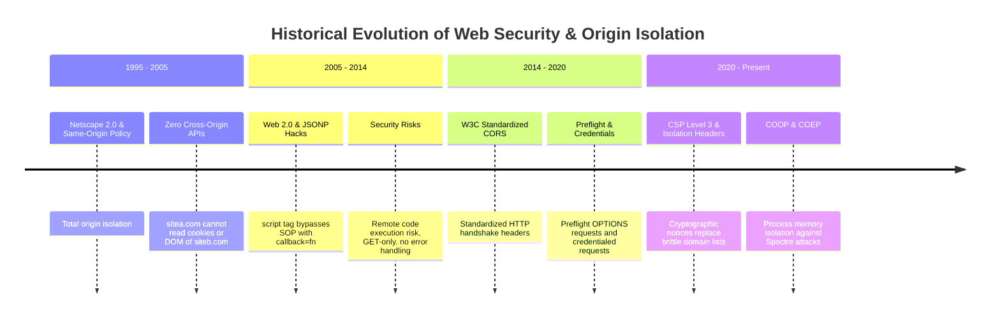
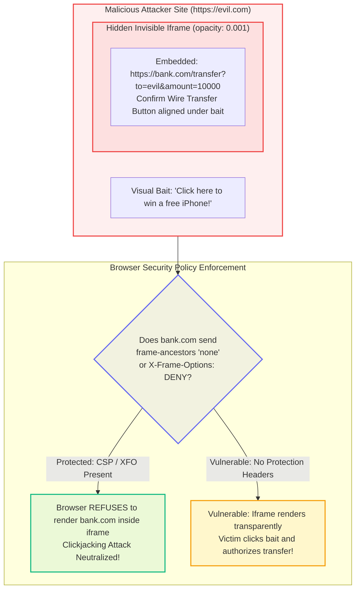

# Chapter 08: Same-Origin Policy, CORS & Security Headers (Preflight OPTIONS, CSP Level 3, Nonces, HSTS, X-Frame-Options & Permissions Policy)

> "The Same-Origin Policy is the cornerstone of the entire World Wide Web security architecture. Without it, visiting any random website would allow malicious JavaScript to silently read your bank accounts, steal your enterprise session cookies, and impersonate your identity across the internet. Everything we build is constrained and protected by this security perimeter."  
> — **Web Platform Security Architecture**

---

## 1. Why This Topic Exists

Web applications run in an inherently hostile environment: the user's browser executes untrusted third-party code from multiple origins simultaneously. To prevent chaos, the browser enforces the **Same-Origin Policy (SOP)**.

However, modern architectures rely heavily on decoupled systems: Single Page Applications on `https://app.enterprise.com` querying APIs on `https://api.enterprise.com`, third-party payment gateways, and content distribution networks.
1. **The CORS Misunderstanding:** Many engineers view **Cross-Origin Resource Sharing (CORS)** as an annoying error message rather than a security protocol. They mistakenly try to "fix" CORS by adding client headers, or worse, configure servers with insecure wildcards (`Access-Control-Allow-Origin: *`).
2. **The Preflight Latency Tax:** A misconfigured API will force the browser to emit a synchronous **HTTP OPTIONS Preflight request** before *every single API mutation*, adding an extra 100ms to 300ms of network latency to user actions.
3. **The XSS Defense Frontier (CSP):** Relying solely on framework sanitization is insufficient to prevent Cross-Site Scripting (XSS). Modern enterprise compliance (SOC2, HIPAA, PCI-DSS) requires a **Content Security Policy (CSP Level 3)** utilizing cryptographically random **per-request nonces**.

Understanding how the browser’s **Network Process** enforces the SOP, how preflight handshakes work, and how to construct ironclad security headers is non-negotiable for Senior and Staff Engineers.

---

## 2. Learning Objectives

- Master the strict definition of an **Origin**: the exact tuple of **`Protocol + Host + Port`**.
- Understand the internal mechanics of the **Same-Origin Policy (SOP)** and why requests succeed in Postman/cURL but fail in browser JavaScript.
- Differentiate between **Simple Requests** (no preflight) and **Preflighted Requests** (HTTP OPTIONS handshake).
- Master server-side CORS headers: `Access-Control-Allow-Origin`, `Access-Control-Allow-Credentials`, `Access-Control-Allow-Headers`, `Access-Control-Allow-Methods`, and **`Access-Control-Max-Age`**.
- Architect modern **Content Security Policy (CSP Level 3)** using dynamic cryptographic nonces (`'nonce-...'`) and `'strict-dynamic'`.
- Enforce enterprise security headers: **HSTS** (`Strict-Transport-Security`), **X-Frame-Options / frame-ancestors** (Clickjacking mitigation), **X-Content-Type-Options: nosniff**, and **Permissions-Policy**.
- Bridge architectural mental models directly to **Angular** (dev server proxy configurations) and **.NET** (ASP.NET Core `app.UseCors()` and security middleware).

---

## 3. Historical Evolution



<details className="raw-schematic-details">
<summary>📄 View Raw ASCII Schematic</summary>

```text
ERA 1: Netscape 2.0 & The Same-Origin Policy (1995 - 2005)
┌────────────────────────────────────────────────────────┐
│ Total origin isolation.                                │
│ - Page on sitea.com cannot read cookies or DOM of      │
│   siteb.com.                                           │
│ - Zero cross-origin API calls allowed.                 │
└────────────────────────────────────────────────────────┘
                           │
                           ▼
ERA 2: Web 2.0 & JSONP Hacks (2005 - 2014)
┌────────────────────────────────────────────────────────┐
│ <script src="https://api.com/data?callback=fn">        │
│ - Bypassed SOP because <script> tags were exempt.      │
│ - Massive security risk (Remote Code Execution / XSS). │
│ - GET-only; zero error handling.                       │
└────────────────────────────────────────────────────────┘
                           │
                           ▼
ERA 3: W3C Standardized CORS (2014 - 2020)
┌────────────────────────────────────────────────────────┐
│ Standardized HTTP handshake headers.                   │
│ - Controlled relaxation of SOP.                        │
│ - Preflight OPTIONS requests for custom verbs/headers. │
│ - Secure authenticated requests via credentials.       │
└────────────────────────────────────────────────────────┘
                           │
                           ▼
ERA 4: Modern CSP Level 3 & Isolation Headers (2020 - Present)
┌────────────────────────────────────────────────────────┐
│ Defense-in-depth security perimeter.                   │
│ - Cryptographic Nonces replace brittle domain lists.   │
│ - COOP (Cross-Origin-Opener-Policy) & COEP isolate     │
│   process memory against Spectre attacks.              │
└────────────────────────────────────────────────────────┘
```
</details>

---

## 4. First Principles & Intuitive Physical Analogies (Layer 1)

### Analogy 1: The Embassy Customs Gate and The Postman

Imagine two sovereign nations: *App-Land* (`app.com`) and *Bank-Land* (`bank.com`):
- **The Postman (cURL / Postman / Python script):**  
  An independent postman in an airplane flies straight into Bank-Land, hands a letter to the teller, and gets an envelope with cash back. The postman has no sovereign borders.
- **The Browser (The International Customs Gate):**  
  A citizen of App-Land goes to the embassy in App-Land and asks: *"Can I have Bank-Land's secret ledger?"*
  - The citizen writes a letter. The browser flies the letter to Bank-Land (`https://bank.com`).
  - Bank-Land receives the letter and processes it.
  - But when the envelope comes back to the border, **the Customs Officer (The Browser)** inspects the outside of the envelope:
  - *"Does Bank-Land officially state on the envelope that App-Land is authorized to read this? (`Access-Control-Allow-Origin: https://app.com`)"*
  - If the stamp is missing, the Customs Officer **shreds the envelope right in front of the citizen!**
  - **The Revelation:** The server *already processed the request*! The browser simply refused to let the JavaScript code read the answer!

### Analogy 2: The Cryptographic Royal Signet (CSP Nonce)

- Without CSP: Anyone who slips a piece of paper into the castle mailbox with ink on it (an inline `<script>` injected via XSS) gets their instructions executed by the guards.
- With CSP Nonce: Every single morning, the King generates a random, secret 128-bit wax stamp (the Nonce: `nonce-8f2a...`).
- The guards are ordered: *"If you find any parchment in the mailbox that does not bear today's exact royal wax stamp, throw it in the fire immediately!"*
- When an attacker injects `<script>stealData()</script>`, it has no royal stamp. The browser refuses to execute it!

---

## 5. Internal Working & Engine Architecture (Layer 2)

### 1. What Constitutes an Origin?

An Origin is strictly defined by three components: **Scheme (Protocol) + Host (Domain) + Port**.

```text
Target URL: https://portal.enterprise.com:443/dashboard

Comparison against Target:
┌───────────────────────────────────────────────┬──────────────┬────────────────────────────┐
│ Compared URL                                  │ Same Origin? │ Reason                     │
├───────────────────────────────────────────────┼──────────────┼────────────────────────────┤
│ https://portal.enterprise.com/profile         │ ✅ YES       │ Scheme, Host, Port match   │
│ http://portal.enterprise.com/dashboard        │ ❌ NO        │ Scheme mismatch (http)     │
│ https://api.enterprise.com/dashboard          │ ❌ NO        │ Host mismatch (subdomain)  │
│ https://portal.enterprise.com:8080/dashboard  │ ❌ NO        │ Port mismatch (8080)       │
│ https://enterprise.com/dashboard              │ ❌ NO        │ Host mismatch (root domain)│
└───────────────────────────────────────────────┴──────────────┴────────────────────────────┘
```

---

### 2. Simple Requests vs. Preflighted Requests

The browser categorizes cross-origin requests into two types:

#### Type A: Simple Requests (No Preflight)
A request is "Simple" **only** if it meets all three conditions:
1. **Method:** `GET`, `HEAD`, or `POST`.
2. **Headers:** Only safe-listed headers (`Accept`, `Accept-Language`, `Content-Language`, `Content-Type`).
3. **Content-Type:** Strictly limited to `application/x-www-form-urlencoded`, `multipart/form-data`, or `text/plain`.

*Behavior:* The browser sends the request immediately with an `Origin: https://app.com` header. If the response contains matching `Access-Control-Allow-Origin`, JavaScript receives the data.

#### Type B: Preflighted Requests (HTTP OPTIONS First)
If a request violates *any* of the simple rules (e.g., uses `POST` with `Content-Type: application/json`, uses `PUT`/`DELETE`, or includes custom headers like `Authorization`):
1. The browser pauses the actual request.
2. The browser automatically emits an **`OPTIONS` request** (The Preflight) to the server.
3. The server must respond with HTTP `200` or `204` and explicit headers approving the operation.
4. Only once the preflight succeeds does the browser fire the actual payload request!

---

## 6. Runtime Flow & Execution Traces

### Execution Trace: Full Preflighted Cross-Origin API Call

```text
Scenario: User on `https://app.com` submits JSON with an Auth token to `https://api.com/users`

STEP 1: PREFLIGHT HANDSHAKE (Automatic Browser Handshake)
Client ──► OPTIONS /users HTTP/1.1
           Host: api.com
           Origin: https://app.com
           Access-Control-Request-Method: POST
           Access-Control-Request-Headers: Authorization, Content-Type

Server ──► HTTP/1.1 204 No Content
           Access-Control-Allow-Origin: https://app.com
           Access-Control-Allow-Methods: GET, POST, OPTIONS
           Access-Control-Allow-Headers: Authorization, Content-Type
           Access-Control-Allow-Credentials: true
           Access-Control-Max-Age: 86400  <── (Cache this preflight for 24 hours!)

STEP 2: ACTUAL PAYLOAD REQUEST (Browser Executes Unblocked)
Client ──► POST /users HTTP/1.1
           Host: api.com
           Origin: https://app.com
           Authorization: Bearer eyJhbGci...
           Content-Type: application/json
           { "name": "Alice" }

Server ──► HTTP/1.1 201 Created
           Access-Control-Allow-Origin: https://app.com
           Access-Control-Allow-Credentials: true
           { "id": 42, "status": "active" }

STEP 3: Browser verifies Access-Control-Allow-Origin matches https://app.com.
        Promise resolves! JavaScript receives user data.
```

---

## 7. Memory Model & Cryptographic Security Layout

### Content Security Policy (CSP Level 3) Architecture

CSP instructs the browser which resources (scripts, styles, images, fonts) are permitted to load and execute.

```text
Content-Security-Policy:
  default-src 'self';
  script-src 'self' 'nonce-EDNnf03nceIOfn39fn3e9h3sdfa' 'strict-dynamic';
  style-src 'self' 'nonce-EDNnf03nceIOfn39fn3e9h3sdfa';
  img-src 'self' https://images.cdn.com data:;
  font-src 'self' https://fonts.gstatic.com;
  connect-src 'self' https://api.enterprise.com;
  object-src 'none';
  base-uri 'self';
  form-action 'self';
  frame-ancestors 'none';
  upgrade-insecure-requests;
```

### The Power of `'strict-dynamic'`
In legacy CSP Level 2, developers had to whitelist every single third-party domain (`https://analytics.google.com`, `https://tagmanager.google.com`). This was brittle and easily bypassed.  
In **CSP Level 3**:
- When you use `'nonce-...' 'strict-dynamic'`, any script that executes with the valid cryptographic nonce is **trusted to dynamically load its own child scripts**.
- The browser automatically propagates trust to children, completely eliminating massive, brittle domain whitelists!

---

## 8. Visual Diagrams (ASCII / Text)

### Clickjacking Defense: `X-Frame-Options` vs. `frame-ancestors`



<details className="raw-schematic-details">
<summary>📄 View Raw ASCII Schematic</summary>

```text
MALICIOUS ATTACKER SITE: https://evil.com
┌────────────────────────────────────────────────────────────────────────┐
│ Visual Bait: "Click here to win a free iPhone!"                        │
│                                                                        │
│   HIDDEN INVISIBLE IFRAME (opacity: 0.001):                            │
│   ┌────────────────────────────────────────────────────────────────┐   │
│   │ Embedded: https://bank.com/transfer?to=evil&amount=10000       │   │
│   │ [ Confirm Wire Transfer Button ] (Aligned right under bait!)   │   │
│   └────────────────────────────────────────────────────────────────┘   │
└────────────────────────────────────────────────────────────────────────┘

BROWSER DEFENSE:
If https://bank.com emits:
Content-Security-Policy: frame-ancestors 'none';  (or X-Frame-Options: DENY)

The browser immediately REFUSES to render bank.com inside the iframe!
Clickjacking attack completely neutralized!
```
</details>

---

## 9. Real World Usage & Production Patterns

### Pattern 1: Production Enterprise CORS Middleware in Node.js / Express

```typescript
// middleware/cors.ts
import type { Request, Response, NextFunction } from 'express';

const ALLOWED_ORIGINS = new Set([
  'https://app.enterprise.com',
  'https://admin.enterprise.com',
]);

export function enterpriseCors(req: Request, res: Response, next: NextFunction) {
  const origin = req.headers.origin;

  // 1. Strict Origin Validation (Never use '*' with credentials!)
  if (origin && ALLOWED_ORIGINS.has(origin)) {
    res.setHeader('Access-Control-Allow-Origin', origin);
    res.setHeader('Access-Control-Allow-Credentials', 'true');
    res.setHeader('Vary', 'Origin'); // Critical for HTTP caching proxies!
  }

  // 2. Configure Preflight Headers
  res.setHeader('Access-Control-Allow-Methods', 'GET, POST, PUT, DELETE, PATCH, OPTIONS');
  res.setHeader('Access-Control-Allow-Headers', 'Content-Type, Authorization, X-Requested-With');
  
  // 3. Cache Preflight Handshake for 24 Hours (Eliminates redundant OPTIONS latency!)
  res.setHeader('Access-Control-Max-Age', '86400');

  // 4. Handle Preflight OPTIONS Immediately
  if (req.method === 'OPTIONS') {
    res.status(204).end();
    return;
  }

  next();
}
```

### Pattern 2: Enterprise Security Headers Suite

Every enterprise web application must transmit these headers on all HTML documents:

```http
# 1. Enforce HTTPS strictly for 2 years (including subdomains and HSTS preload list)
Strict-Transport-Security: max-age=63072000; includeSubDomains; preload

# 2. Prevent MIME-type sniffing (Defends against file upload script execution)
X-Content-Type-Options: nosniff

# 3. Block Clickjacking completely
X-Frame-Options: DENY

# 4. Restrict browser hardware capabilities
Permissions-Policy: camera=(), microphone=(), geolocation=(), payment=()

# 5. Prevent cross-origin referrer leakage
Referrer-Policy: strict-origin-when-cross-origin
```

---

## 10. Angular Comparison

| Dimension | Browser Security Perimeter | Angular (v17+) |
| :--- | :--- | :--- |
| **CORS Ingestion** | Browser Network Process enforces CORS and blocks unauthorized responses. | Angular `HttpClient` cannot fix a server-side CORS error; requests fail with status 0. |
| **Local Development** | Cross-origin requests between `localhost:4200` and `localhost:5000` trigger CORS. | Solved via Angular CLI Dev Server proxy: `proxy.conf.json` proxying `/api` locally without CORS. |
| **XSS Sanitization** | Content Security Policy (CSP) acts as browser-level enforcement. | Angular `DomSanitizer` automatically sanitizes values bound in templates against XSS. |
| **Bypassing Sanitization** | CSP blocks scripts regardless of client code. | `domSanitizer.bypassSecurityTrustHtml()` allows raw HTML, but CSP nonces still restrict script execution. |

---

## 11. .NET Comparison

| Dimension | Browser Security Perimeter | ASP.NET Core & .NET 9/10 |
| :--- | :--- | :--- |
| **CORS Policy Engine** | Browser client evaluates incoming `Access-Control-*` headers. | Server configures policy: `builder.Services.AddCors(options => ...)` and `app.UseCors("EnterprisePolicy")`. |
| **Preflight Handling** | Browser emits HTTP OPTIONS automatically. | ASP.NET Core CORS middleware intercepts `OPTIONS` requests and emits HTTP 204. |
| **HSTS Enforcement** | Browser honors `Strict-Transport-Security` header. | `app.UseHsts()` natively injects HSTS headers in production environments. |
| **Antiforgery (CSRF)** | Relies on `SameSite=Lax` cookies and custom request headers. | ASP.NET Core Antiforgery Tokens (`IAntiforgery`) with cryptographic form tokens. |

---

## 12. Enterprise Perspective & Production Risks (Layer 4)

### 1. The `Access-Control-Allow-Origin: *` Credential Contradiction
- **The Failure Mode:** An engineer attempts to support cookies on an open API:
  ```http
  Access-Control-Allow-Origin: *
  Access-Control-Allow-Credentials: true
  ```
- **The Browser Engine Rejection:** **The browser will reject this response with an explicit security error!**
- **Why?** The W3C specification strictly forbids wildcard `*` origins when credentials (`cookies`, `HTTP auth`) are permitted, because allowing any arbitrary site on the internet to read authenticated corporate data would instantly destroy web security.
- **The Fix:** The server must dynamically reflect the explicit requesting origin (after validating it against an allowed whitelist).

### 2. The Missing `Vary: Origin` Cache Poisoning Vulnerability
- **The Failure Mode:** An enterprise API reflects the client's `Origin` header in `Access-Control-Allow-Origin`, but sits behind an edge reverse proxy (Cloudflare, AWS CloudFront, Fastly) **without transmitting `Vary: Origin`**.
- **The Disaster:**
  1. User A visits `https://app.com`. Origin header is `https://app.com`. Server responds with `Access-Control-Allow-Origin: https://app.com`.
  2. The CDN caches this HTTP response.
  3. User B visits `https://admin.com`. The CDN serves the cached response holding `Access-Control-Allow-Origin: https://app.com`.
  4. User B’s browser throws a CORS error, breaking the admin dashboard globally!
- **The Fix:** Always transmit **`Vary: Origin`** whenever `Access-Control-Allow-Origin` is dynamic.

---

## 13. Performance Considerations

```text
Preflight Caching Impact on Mobile API Latency (150ms Network Round-Trip)
┌───────────────────────────────────────┬───────────────────────────┬──────────────┐
│ Configuration                         │ Preflight Handshake       │ API Latency  │
├───────────────────────────────────────┼───────────────────────────┼──────────────┤
│ No Max-Age (Preflight on EVERY call)  │ 150 ms OPTIONS on every POST│ 300 ms Total │
│ Access-Control-Max-Age: 86400 (Cached)│ 0 ms (Cached for 24 hours)│ 150 ms Total │
└───────────────────────────────────────┴───────────────────────────┴──────────────┘
```

Configuring `Access-Control-Max-Age` cuts API mutation latency **in half** for repeat user interactions.

---

## 14. Tradeoffs

| Mechanism | Strengths | Weaknesses |
| :--- | :--- | :--- |
| **Strict CSP (Nonces)** | Defeats 99.9% of XSS injection attacks; required for SOC2 / banking compliance. | High operational complexity; blocks third-party marketing tags without refactoring. |
| **Preflight Handshake (CORS)** | Verifies server intent before transmitting potentially destructive payloads. | Adds 1 RTT of latency to cross-origin API calls unless properly cached with `Max-Age`. |
| **Strict HSTS Preload** | Permanently shields against SSL-stripping and man-in-the-middle attacks. | High risk: Misconfiguring an invalid certificate locks users out of your domain for years. |

---

## 15. Common Mistakes & Interview Traps

### Trap 1: Believing CORS Protects the Server
- **Scenario:** A developer says: *"Our API is protected from hackers because CORS only allows `https://company.com`."*
- **Correction:** **FATAL MISCONCEPTION.** CORS is a **browser-enforced client security policy**. An attacker using Python, Go, cURL, or Postman can send requests to your API all day long—CORS does not stop them! CORS protects **users** from having their authenticated browser session hijacked by malicious websites.

### Trap 2: Believing You Can Fix a CORS Error in Frontend JavaScript
- **Scenario:** A frontend engineer tries to add `headers: { 'Access-Control-Allow-Origin': '*' }` to their client `fetch()` call to fix a CORS error.
- **The Reality:** **Completely impossible.** `Access-Control-*` headers are **response headers emitted by the server**. Setting them on the client request does nothing! CORS can **only** be resolved by configuring the server.

---

## 16. Interview Questions & Architectural Answers (Senior, Lead, Architect - Layer 5)

### Question 1 (Senior): "Why does a cross-origin API request succeed in Postman but fail in the browser with a CORS error?"
**Architectural Answer:**  
Postman is a developer testing tool running as an unrestricted desktop application. It does not enforce the browser’s **Same-Origin Policy (SOP)**.  
When the browser sends a cross-origin request:
1. The browser successfully transmits the HTTP request to the server.
2. The server processes the request and sends the response back to the browser’s Network Process.
3. The browser inspects the response headers for `Access-Control-Allow-Origin`.
4. If missing or mismatched, the browser’s security sandbox **blocks the JavaScript execution context from accessing the response body**, rejecting the fetch Promise with a `TypeError: Failed to fetch`. The failure occurs entirely inside the client’s security sandbox!

### Question 2 (Lead): "How do you design a zero-trust Content Security Policy (CSP) for an enterprise web application that utilizes dynamic code splitting?"
**Architectural Answer:**  
1. **Per-Request Cryptographic Nonce:** On every inbound HTML request, Edge Middleware generates a random 128-bit base64 nonce (e.g., `crypto.randomUUID()`).
2. **CSP Header Generation:** Middleware injects the header:
   `Content-Security-Policy: script-src 'self' 'nonce-{RANDOM}' 'strict-dynamic'; object-src 'none'; base-uri 'self';`.
3. **Template Nonce Binding:** Server Components inject the identical nonce into all server-rendered `<script nonce="{RANDOM}">` tags.
4. **`strict-dynamic` Propagation:** When initial scripts load, `'strict-dynamic'` instructs the browser to automatically trust any dynamic chunks imported via `import()` by those nonced scripts, enabling seamless code splitting without maintaining brittle URL whitelists.

### Question 3 (Architect): "How would you eliminate preflight OPTIONS latency across a global microservices architecture?"
**Architectural Answer:**  
1. **Edge CDN Termination:** Deploy an API Gateway / CDN (Cloudflare or Azure Front Door) in front of the microservices.
2. **Edge Preflight Handling:** Terminate `OPTIONS` requests directly at the nearest CDN Edge Point of Presence, returning HTTP 204 in < 10ms without hitting origin services.
3. **Aggressive Cache Max-Age:** Transmit `Access-Control-Max-Age: 86400` (24 hours). The browser stores the preflight permissions in its internal cache, executing subsequent mutations with **zero preflight overhead**.
4. **BFF Domain Alignment:** Where possible, route frontend and API traffic through a single reverse proxy origin (`https://app.com/api/*`), converting all cross-origin calls into **same-origin requests** and eliminating CORS handshakes entirely!

---

## 17. Senior-Level Mental Model & "How to Remember This Forever" (Memory Anchors - Layer 3)

### The Memory Peg: "The Foreign Border Customs Guard"
- **The Server is the Merchant across the border:** Will sell to anyone who walks up with money (cURL or Browser).
- **The Browser is the Border Customs Guard:** If the merchant’s box doesn't have an export permit (`Access-Control-Allow-Origin: your-country`), the customs guard destroys the package at the border.
- **The CSP Nonce is the Daily Password:** If a visitor can't whisper today's secret password, they are not allowed to speak inside the castle.

---

## 18. Core Vocabulary & "Aha!" Breakthrough Insights (Refresher)

- **Same-Origin Policy (SOP):** The fundamental security model restricting how documents from one origin can interact with resources from another.
- **CORS (Cross-Origin Resource Sharing):** The HTTP-header-based mechanism allowing servers to declare which origins can access their resources.
- **Preflight (OPTIONS):** The automated browser handshake sent before non-simple requests to verify server permissions.
- **CSP Nonce:** A cryptographically random, one-time token used to authenticate trusted scripts.
- **The "Aha!" Insight:** CORS is not server security—it is **client security**! It prevents malicious websites from using your logged-in browser as an unauthorized attack proxy against third-party APIs!

---

## 19. Key Takeaways

1. **An Origin is strictly Protocol + Host + Port;** if any of the three differs, the request is cross-origin.
2. **CORS does not stop the server from executing;** it stops the browser from delivering the response to JavaScript.
3. **Never configure `Access-Control-Allow-Origin: *` with credentials;** the browser will reject it.
4. **Always set `Access-Control-Max-Age`** to cache preflight OPTIONS requests and eliminate redundant latency.
5. **Always transmit `Vary: Origin`** when serving dynamic CORS headers to prevent CDN cache poisoning.
6. **Use CSP Level 3 with `'nonce-...'` and `'strict-dynamic'`** to permanently neutralize XSS attacks.

---

## 20. Revision Sheet

```text
┌────────────────────────────────────────────────────────────────────────────────────────┐
│                        CORS & SECURITY HEADERS CHEAT SHEET                             │
├────────────────────────────────────────────────────────────────────────────────────────┤
│ Server CORS Headers Response:                                                          │
│   Access-Control-Allow-Origin: https://app.enterprise.com                             │
│   Access-Control-Allow-Methods: GET, POST, PUT, DELETE, OPTIONS                       │
│   Access-Control-Allow-Headers: Authorization, Content-Type                            │
│   Access-Control-Allow-Credentials: true                                               │
│   Access-Control-Max-Age: 86400             // Cache preflight for 24 hours           │
│   Vary: Origin                              // Prevent CDN cache poisoning             │
│                                                                                        │
│ Essential Security Headers Suite:                                                      │
│   Strict-Transport-Security: max-age=63072000; includeSubDomains; preload             │
│   X-Content-Type-Options: nosniff                                                      │
│   X-Frame-Options: DENY                                                                │
│   Permissions-Policy: camera=(), microphone=(), geolocation=()                         │
│                                                                                        │
│ Modern CSP Level 3 Template:                                                           │
│   Content-Security-Policy: script-src 'self' 'nonce-{RANDOM}' 'strict-dynamic';        │
│                            object-src 'none'; base-uri 'self'; frame-ancestors 'none'; │
│                                                                                        │
│ Golden Architectural Rule:                                                             │
│   "Validate origins explicitly; cache preflights aggressively; enforce CSP with nonces."│
└────────────────────────────────────────────────────────────────────────────────────────┘
```
