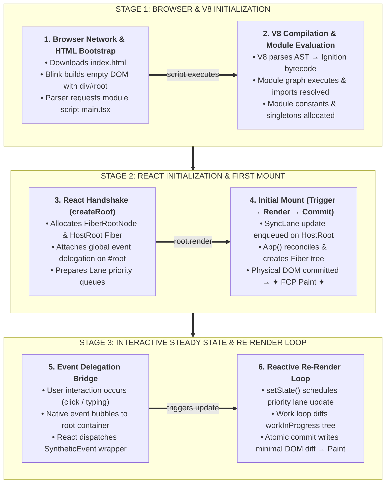
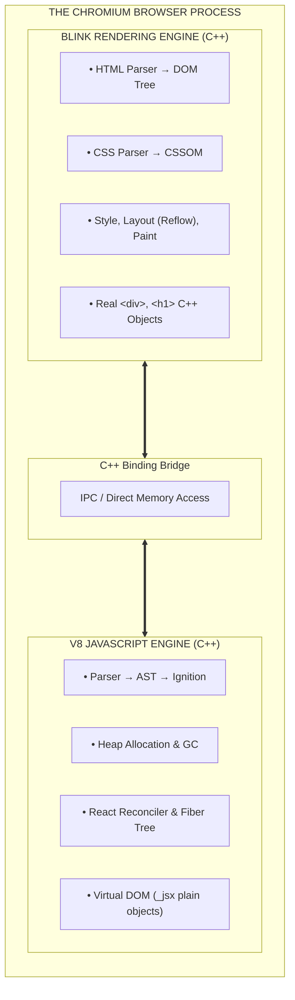

# Architectural Companion: React Application Lifecycle & Runtime Architecture

---

## 1. Executive Summary

This architecture reference maps the complete macroscopic lifecycle of a modern React application: from the initial HTTP request and browser HTML bootstrap, through V8 compilation and module graph evaluation, into the React initialization handshake (`createRoot`), the 3-phase Render Cycle (Trigger → Render → Commit), and the ongoing interactive state loop.



---

## 2. Phase 1: Browser Network & HTML Bootstrapping

When the browser requests a Single Page Application (SPA):

```html
<!DOCTYPE html>
<html lang="en">
  <head>
    <meta charset="UTF-8" />
    <meta name="viewport" content="width=device-width, initial-scale=1.0" />
    <title>Enterprise Portal</title>
  </head>
  <body>
    <!-- 1. The Mounting Anchor (Landing Pad) -->
    <div id="root"></div>

    <!-- 2. The ES Module Entry Point -->
    <script type="module" src="/src/main.tsx"></script>
  </body>
</html>
```

1. **HTML Parsing:** The browser's C++ rendering engine (**Blink** in Chrome/Edge) streams and parses HTML tokens.
2. **DOM Tree Creation:** Blink creates native C++ DOM nodes (`blink::HTMLDivElement` for `<div id="root">`).
3. **Empty Shell:** At this exact instant, `<div id="root">` is an empty node. The user sees a blank screen.
4. **Script Encounter:** The parser hits `<script type="module">` and requests the JavaScript bundle over HTTP.

---

## 3. Phase 2: V8 Compilation & Module Resolution

Once the JavaScript bundle arrives over the network, it is handed to Google's **V8 Engine**:

```typescript
// main.tsx entry point executed by V8
import React from 'react';
import ReactDOM from 'react-dom/client';
import App from './App';
import './index.css';
```

1. **Parsing to AST:** V8's scanner and parser turn source code into an **Abstract Syntax Tree (AST)**.
2. **Bytecode Compilation (Ignition):** Ignition compiles the AST into bytecode.
3. **Module Graph Execution:** V8 executes `main.tsx` in a top-level module context, evaluating imports and resolving module dependencies.
4. **Top-Level Code:** Any constants, analytics SDK initialization, or module-scoped variables execute **once** during this phase.

---

## 4. Phase 3: The React Initialization Handshake (`createRoot`)

```typescript
const container = document.getElementById('root')!;
const root = ReactDOM.createRoot(container);
```

When `ReactDOM.createRoot` executes, React establishes its engine infrastructure:

1. **`FiberRootNode` Allocation:**  
   React allocates a special singleton C++/JS host object called `FiberRootNode`. It stores:
   - Reference to the physical DOM container (`container: div#root`).
   - The `current` Fiber pointer.
   - Priority lanes bitmask (`pendingLanes`, `suspendedLanes`).
   - The Fiber update queue.
2. **`HostRoot` Fiber Node:**  
   React creates the root node of the Fiber tree (`tag: HostRoot`, `type: null`).
3. **Global Event Delegation Setup:**  
   React **does not** attach `addEventListener` to individual buttons or inputs. Instead, `createRoot` attaches a single set of listeners to `#root` for nearly all standard browser events (`click`, `input`, `keydown`, `touchstart`). All user interactions bubble up to this single choke point.

---

## 5. Phase 4: Initial Mount (Trigger → Render → Commit → Paint)

Execution continues with:
```typescript
root.render(<App />);
```

### Step A: The Trigger
React wraps `<App />` into an `Update` record, assigns it `SyncLane` priority, and attaches it to `HostRoot.updateQueue`. It asks the Scheduler to start a work loop.

### Step B: The Render Phase (Virtual Reconciliation)
The Reconciler executes `workLoopSync` in pure JavaScript memory (V8 Heap):
- Top-down traversal begins at `HostRoot`.
- React invokes the component function: `App()`.
- Hooks execute: `useState(0)` allocates the initial `Hook` record in the Fiber's `memoizedState` singly linked list.
- JSX transforms into `_jsx()` calls, allocating plain JavaScript objects (`ReactElement`) in V8 New Space.
- React traverses down to child components, recursively invoking their functions.
- As it returns back up (`completeWork`), React creates the off-screen Blink C++ DOM nodes (`document.createElement('div')`) and links them together.
- Effect flags are collected: `flags |= Placement`.
- **Note:** *The browser screen remains completely blank during this phase. Zero mutations have touched the live DOM tree.*

### Step C: The Commit Phase (Physical DOM Injection)
Commit is synchronous and atomic (cannot be paused):
1. **Mutation Sub-phase:** React physically mounts the completed off-screen DOM tree into `<div id="root">`.
2. **Pointer Swap (Double Buffering):**  
   ```javascript
   fiberRoot.current = workInProgress;
   ```
   The newly rendered tree is now the active, official `current` Fiber tree.
3. **Layout Sub-phase:** `useLayoutEffect` setups execute synchronously. The DOM has been mutated in memory, but the browser has **not yet painted pixels**.

### Step D: The First Browser Paint (FCP)
React yields control of the JavaScript main thread to the browser engine:
1. Blink recalculates styles for the new nodes.
2. Blink performs layout reflow (calculating box x/y coordinates and sizes).
3. The Compositor & GPU paint pixels to the display.
4. **The user sees the initial UI on screen!**

### Step E: Passive Effects (`useEffect`)
Scheduled via `MessageChannel` / Scheduler after paint:
- `useEffect` callbacks run asynchronously.
- Network requests (`fetch('/api/user')`), subscriptions, and analytics execute without blocking user interaction or initial paint.

---

## 6. Phase 5 & 6: The Event Bridge & Re-render Loop

```text
User clicks <button>
         │
         ▼
1. Native browser click event bubbles up to <div id="root">
         │
         ▼
2. React's root listener intercepts event, wraps into SyntheticEvent
         │
         ▼
3. React dispatches onClick={handleClick}
         │
         ▼
4. Handler calls: setCount(prev => prev + 1)
         │
         ▼
5. dispatchSetState() queues update on Fiber
         │
         ▼
6. Scheduler queues new Render Phase:
   - App() re-runs with new state = 1
   - Diffing identifies text changed from "0" to "1"
   - Fiber flagged with flags = Update
         │
         ▼
7. Commit Phase updates DOM: textNode.nodeValue = "1"
         │
         ▼
8. Next Browser Paint displays updated number to user
```

---

## 7. The Dual-Engine Architecture: Blink vs. V8 & The C++ Bridge

Understanding the browser requires distinguishing between the **Rendering Engine (Blink)** and the **JavaScript Engine (V8)**:



### What is Blink & What is its Purpose?
* **Definition:** **Blink** is Chromium's C++ **Rendering & Layout Engine** (used by Google Chrome, Microsoft Edge, Brave, Opera). Safari uses **WebKit**; Firefox uses **Gecko**.
* **Primary Responsibilities:**
  1. **DOM Construction:** Parses HTML into native C++ node objects (`blink::Element`, `blink::Node`).
  2. **CSSOM Construction:** Parses CSS rules and builds the style cascade.
  3. **Layout / Reflow Calculation:** Calculates geometry—the exact physical x, y coordinates, widths, and heights of every box.
  4. **Paint & GPU Compositing:** Emits drawing instructions and passes bitmap layers to the GPU.
* **The V8-Blink C++ Bridge:**  
  V8 and Blink are distinct systems running within the same thread. When JavaScript accesses the DOM (`document.getElementById()`, `node.appendChild()`), execution must cross the **C++ Binding Bridge**. Crossing this boundary incurs CPU marshalling and memory overhead.  
  *This is the fundamental reason React exists:* Computing diffs in pure JavaScript (V8 Heap) costs micro-fractions of a millisecond. React minimizes bridge crossings by only touching Blink during the atomic Commit Phase.

### What is V8 & What is its Purpose?
* **Definition:** **V8** is Google's open-source, high-performance C++ **JavaScript and WebAssembly Engine**.
* **Primary Responsibilities:**
  1. Executes ECMAScript specification code.
  2. Allocates and manages Heap Memory (New Space, Old Space, Large Object Space).
  3. Executes Garbage Collection (Minor Scavenger, Major Mark-Sweep-Compact).
  4. Manages the Call Stack and Execution Contexts.
* **Key Insight:** V8 natively has **zero knowledge** of HTML, `<div>`, CSS, or `window`. Blink injects DOM objects into V8 as **Host Objects**, exposing methods like `appendChild` to JavaScript.

---

## 8. The V8 Compilation Pipeline: AST, Ignition & TurboFan

```text
  Raw JS Source Code (Text)
  "const sum = a + b;"
           │
           ▼
    [ V8 Scanner / Lexer ]
           │ (Tokens: CONST, IDENTIFIER, ASSIGN, IDENTIFIER, PLUS, IDENTIFIER)
           ▼
    [ AST (Abstract Syntax Tree) ]  ──► Hierarchical grammatical blueprint of code
           │
           ▼
    [ Ignition Bytecode Compiler ]  ──► Fast, low-memory interpreter (Fast Startup!)
           │
           ▼
    Bytecode Execution (Ignition)
           │ (If function becomes hot/frequently called)
           ▼
    [ TurboFan JIT Compiler ]       ──► Highly optimized native Assembly/Machine Code
```

### Why do we need the AST (Abstract Syntax Tree)?
A CPU cannot execute a raw string of text. The V8 scanner tokenizes the characters and parses them into a validated, hierarchical tree called the **AST**:
* It validates language syntax (catching `SyntaxError`s before execution).
* It resolves variable identifiers and lexical scopes (`var`, `let`, `const`).
* It produces the formal semantic blueprint that the compiler interprets.

### Why do we need Ignition (Bytecode) instead of Direct Machine Code?
Historically, V8 compiled JavaScript directly to native machine code (Assembly). This was replaced by **Ignition** for two critical reasons:
1. **Startup Speed:** Compiling complex JavaScript to native machine code takes noticeable CPU time. Ignition compiles AST to compact **Bytecode** in milliseconds, allowing applications to start running almost instantaneously.
2. **Memory Footprint:** Native machine code takes huge amounts of memory. In large enterprise web applications, **over 50% of JavaScript is executed only once** (bootstrapping and setup logic). Generating machine code for one-time code bloated memory on mobile devices.
3. **Adaptive Optimization:** Ignition interprets bytecode while collecting runtime profiling metrics (type feedback). If a function is called thousands of times ("hot"), V8 feeds the bytecode to **TurboFan**, which emits ultra-fast, optimized machine code.

---

## 9. State Trigger Mechanics: `dispatchSetState()`

When a developer writes:
```typescript
const [count, setCount] = useState(0);
```

What is `setCount` under the hood?

Inside React Fiber, `setCount` is a curried dispatcher function:
```javascript
const setCount = dispatchSetState.bind(null, currentlyRenderingFiber, queue);
```

### The Step-by-Step Dispatch Mechanics:
1. **Update Creation:** When you invoke `setCount(5)`, `dispatchSetState` allocates an `Update` object:
   ```javascript
   const update = {
     lane: priorityLane,
     action: 5,
     hasEagerState: false,
     eagerState: null,
     next: null
   };
   ```
2. **Eager Bailout Optimization (Fast-Path):**  
   If the component has no active work scheduled (`fiber.lanes === NoLanes`), React calculates the next state immediately inside the event handler:
   ```javascript
   const currentState = queue.lastRenderedState;
   const eagerState = reducer(currentState, action);
   if (Object.is(currentState, eagerState)) {
     // BAIL OUT! Do NOT schedule a render pass. Component function will NOT run!
     return;
   }
   ```
3. **Queue Enqueueing:** If the value changed, the update is enqueued into the circular linked list `queue.pending`.
4. **Triggering the Scheduler:** React calls `scheduleUpdateOnFiber(fiber, lane)`. This marks the Fiber and its ancestors as dirty, finds the root `FiberRootNode`, and instructs the React Scheduler to queue a **Render Phase**.

---

## 10. Intercepting Paint: `useLayoutEffect` vs. `useEffect`

Both hooks have identical APIs: `useEffect(callback, deps)` vs `useLayoutEffect(callback, deps)`. However, their execution points in the browser pipeline are radically different:

```text
Commit Phase (Mutation):  React modifies Blink DOM nodes in memory.
         │
         ▼
Commit Phase (Layout):    useLayoutEffect runs SYNCHRONOUSLY!
                          (DOM is updated, but Browser has NOT painted pixels yet)
         │
         ▼
✦✦ BROWSER PAINT ✦✦       Browser computes geometry and paints pixels to screen.
         │
         ▼
Passive Effects Phase:    useEffect runs ASYNCHRONOUSLY (via MessageChannel postMessage).
```

### Why `useLayoutEffect` Exists (Preventing Visual Flicker)
If you measure a DOM node and update state inside `useEffect`:
1. Commit phase updates DOM.
2. **Browser paints (Frame 1):** The user sees the element in its unpositioned or initial state.
3. `useEffect` runs, reads `node.getBoundingClientRect()`, and calls `setState()`.
4. Re-render triggers, commit updates DOM.
5. **Browser paints (Frame 2):** The element jumps to its final position.  
*Result:* **Perceptible visual flicker / layout jitter.**

By using `useLayoutEffect`, your measurement and any synchronous state updates happen **before** the browser paints. The user only ever sees the correct, final frame (zero flicker).

---

## 11. Toolchain Architecture: What is Vite & How It Powers React

```text
┌────────────────────────────────────────────────────────────────────────┐
│                                  VITE                                  │
│                                                                        │
│  [ Local Dev Server ]                       [ Production Build ]       │
│  • Starts in ~100ms                         • Runs `npm run build`     │
│  • Serves files via Native ES Modules       • Bundles with Rollup      │
│  • Transforms TSX/JSX on-the-fly (esbuild)  • Tree-shaking & Minifying │
│  • Fast Refresh (HMR) in <15ms              • Generates /dist folder   │
│                     │                                                  │
│                     ▼                                                  │
│         [ Your React Application ]                                     │
│         (App.tsx, Components, Hooks, Virtual DOM, Blink DOM)           │
└────────────────────────────────────────────────────────────────────────┘
```

### What is Vite?
* **Definition:** **Vite** (French for *"fast"*, pronounced `/vit/`) is a modern, next-generation **Frontend Development Server & Build Tool** created by Evan You.
* **How It Relates to React:**
  - **React is a runtime library:** React (`react`, `react-dom`) provides the UI component model, reconciliation engine, and hooks. React does not know how to start an HTTP server, transpile TypeScript, compile JSX, or hot-reload modules.
  - **Vite is the build pipeline and developer workbench:** It compiles TypeScript/JSX and serves the application to the browser.

### The Architectural Shift: Webpack (Create React App) vs. Vite

| Feature | Legacy Webpack (Create React App) | Modern Vite + React |
| :--- | :--- | :--- |
| **Dev Server Boot** | Bundled your entire app into memory first (took **30–90 seconds** on large codebases). | Starts **instantly (<200ms)** because it does **not** bundle upfront; it serves files on-demand over native browser ES Modules. |
| **Transpiler** | Babel / `tsc` (written in JavaScript; single-threaded, slow). | **`esbuild`** (written in Go; runs 20–50x faster than JavaScript-based transpilers). |
| **Hot Module Replacement (HMR)** | Slow re-compilation of chunks (2–5 seconds). | Near-instant (~15ms) via `@vitejs/plugin-react` (React Fast Refresh), swapping components while preserving state. |
| **Production Bundler** | Webpack | Highly optimized, tree-shaken **Rollup** production bundle. |

---

## 12. Master System Coordinate Table

| System Component | Physical Location | Primary Responsibility |
| :--- | :--- | :--- |
| **`index.html`** | Browser Blink HTML Parser | Initial static container and script tag loading |
| **V8 Engine** | Browser JS Virtual Machine | AST parsing, bytecode compilation (Ignition), heap memory & GC |
| **Blink Engine** | Browser C++ Layout & DOM Engine | Native DOM tree, CSSOM, Style, Layout reflow, and Painting |
| **The C++ Bridge** | V8-Blink Binding Boundary | Marshals calls between JavaScript and native C++ DOM nodes |
| **Vite** | Node.js Toolchain / Dev Server | On-demand ES module serving, `esbuild` JSX transpilation, and Rollup bundling |
| **`createRoot`** | `react-dom/client` | Instantiates `FiberRootNode` and mounts root event delegation |
| **`dispatchSetState()`** | React Dispatcher (V8 Heap) | Creates updates, runs eager bailout, and schedules work with the Scheduler |
| **Component Body** | V8 Heap / Reconciler | **Render Phase** calculation: `UI = f(State)` |
| **Fiber Tree** | V8 Heap (Old Pointer Space) | Persistent dual trees (`current` and `workInProgress`) |
| **Virtual DOM (`_jsx`)** | V8 Young Generation (New Space) | Ephemeral descriptor objects created per render pass |
| **`useLayoutEffect`** | Commit Phase (Layout Sub-phase) | Synchronous execution **before** browser paint to prevent flicker |
| **`useEffect`** | React Scheduler / MessageQueue | Asynchronous passive execution **after** browser paint |
| **Event Delegation** | Root DOM Node (`#root`) | Single native listener dispatching to React Fiber synthetic tree |
