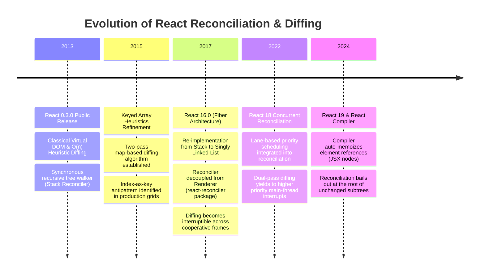
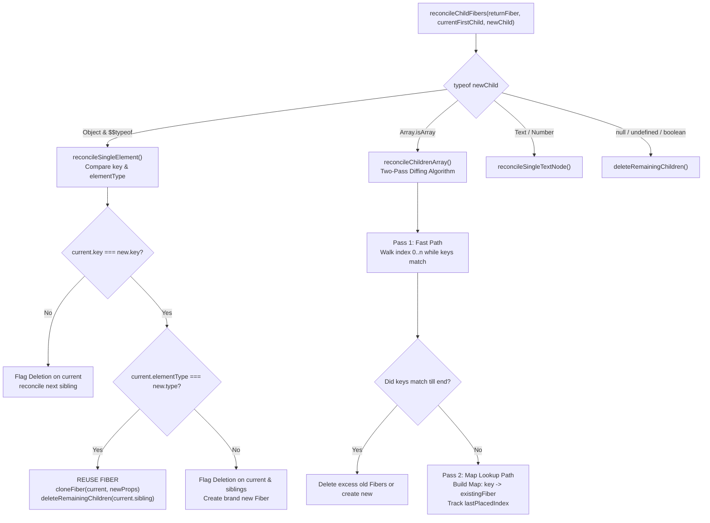
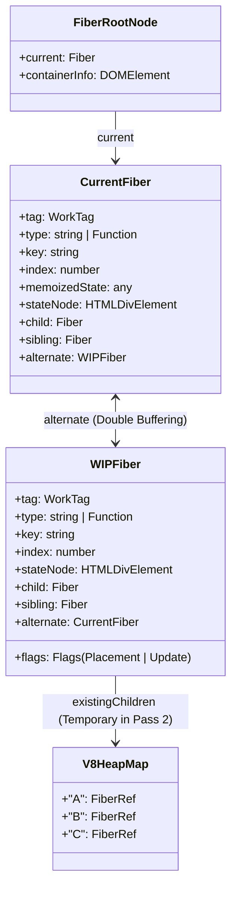
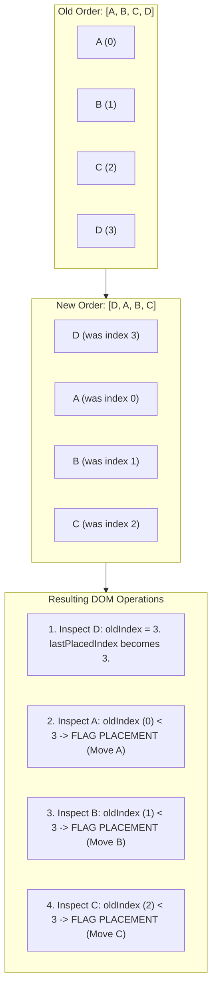

# Chapter 02: Reconciliation & Diffing Algorithm (O(n) Heuristics & Key Mechanics)

> "To convert an arbitrary tree into another using minimum operations has a complexity of $O(n^3)$. React implements a heuristic $O(n)$ algorithm based on two simple assumptions: two elements of different types will produce different trees, and child stability can be hinted with keys."  
> — **React Engineering Core Principle**

---

## 1. Why This Topic Exists

At the heart of declarative UI architecture lies a mathematical paradox:
1. **The Declarative Contract:** As software engineers, we write:
   ```typescript
   UI = f(State)
   ```
   Every time application state changes, we write our components as if we are re-rendering the entire UI tree from scratch.
2. **The Graph Theory Reality:** In computer science, finding the minimum number of edit operations (insert, delete, move, update) to transform one arbitrary tree into another is known as the **Tree Edit Distance problem**. The state-of-the-art academic algorithms for general tree diffing (such as Zhang and Shasha, or Klein) operate with a time complexity of:
   ```text
   O(n³) where n is the total number of nodes in the tree
   ```

Consider an enterprise data dashboard containing **1,000 DOM elements** (a modest table with filters and charts):
```text
n = 1,000 nodes
O(n³) = 1,000³ = 1,000,000,000 operations (1 Billion comparisons)
```

At 1 billion CPU cycles, computing a diff between state updates would take **~1,000 milliseconds (1 full second)** on a high-end desktop CPU. To maintain a fluid **60 frames per second (16.6ms frame budget)** or **120 FPS on ProMotion displays (8.3ms)**, computing an $O(n^3)$ diff would drop browser framerates to **0.05 FPS**, completely freezing the JavaScript thread and failing Core Web Vitals (Interaction to Next Paint - INP).

React exists because its creators solved this dilemma. Instead of seeking an academically optimal edit distance, React introduced a **heuristic $O(n)$ linear-time reconciliation algorithm**. By evaluating real-world UI patterns, React proved that 99.9% of user interface updates conform to two practical axioms:
1. **Heterogeneous Type Axiom:** Two elements of different HTML or component types will generate fundamentally distinct subtrees. Do not waste CPU cycles diffing them—destroy the old and mount the new.
2. **Key Stability Axiom:** Developers can hint which child elements remain stable across renders across dynamic lists using a unique, deterministic `key` attribute.

Understanding the mechanics of React's reconciliation engine—specifically how it handles single elements, array collections, `lastPlacedIndex` tracking, and heap identity—is what separates developers who introduce catastrophic performance bottlenecks from architects who build sub-millisecond, responsive enterprise web applications.

---

## 2. Learning Objectives

By mastering this chapter, you will be able to:
- Explain mathematically why general tree diffing is $O(n^3)$ and how React's two heuristic assumptions collapse this complexity to $O(n)$ linear time.
- Trace the internal execution of React's reconciler functions (`reconcileChildFibers`, `reconcileSingleElement`, and `reconcileChildrenArray`).
- Deconstruct React's **Two-Pass Array Reconciliation Algorithm** and explain the mathematical role of `lastPlacedIndex`.
- Understand why array keys must be **stable, unique, and deterministic**, and dissect the exact DOM memory corruption that occurs when using array indices as keys.
- Articulate the exact difference between **Fiber node reuse** and **physical DOM recycling**.
- Compare React's heuristic diffing with Angular's compile-time Change Detection (`trackBy` / `@for`) and .NET Blazor's element diffing engine.
- Confidently answer Senior, Lead, and Architect interview questions regarding tree reconciliation, list reordering mechanics, and rendering optimizations.

---

## 3. Historical Evolution



### The Stack Reconciler Era (Pre-16)
In React 15 and earlier, reconciliation was tightly bound to the JavaScript execution call stack. The reconciler was a recursive tree walker: `diff(oldTree, newTree)`. Because it utilized the native C++ call stack of V8, once a reconciliation pass started, it **could not be paused, prioritized, or aborted**. If a tree contained 10,000 nodes, the reconciler occupied the main thread for 40ms+, dropping frames and causing severe input lag.

### The Fiber Reconciler Era (React 16+)
React 16 completely rewrote the internal engine into **Fiber**. The recursive call stack was replaced with a **heap-allocated singly linked list work loop**. Reconciliation became decoupled from the physical rendering layer:
- **`react-reconciler`:** Compares current Fibers with new React Elements, computes diffs, and marks side-effect flags (`Placement`, `Update`, `ChildDeletion`).
- **`react-dom` / `react-native`:** Consumes the computed effect list during the synchronous Commit phase to apply physical mutations.

In React 18 and 19, reconciliation became priority-aware through **Lanes**, allowing the reconciler to pause diffing mid-tree if high-priority input arrives.

---

## 4. First Principles & Intuitive Physical Analogies (Layer 1)

### Analogy 1: The Blueprint Inspector & The Construction Site
Imagine a city building inspector comparing last year's architectural blueprints with this year's renovation blueprints.
- **The $O(n^3)$ Approach:** The inspector measures every single brick in the new blueprint and checks if that exact brick could have been moved from any other room or building in the entire city. It takes 6 months of mathematical calculations just to approve adding a drywall partition.
- **React's Heterogeneous Type Axiom:** The inspector glances at the blueprint for Room 101. Last year it was marked `Office`. This year it is marked `Swimming Pool`. The inspector does not measure whether the office desk can be converted into water filtration pipes. He immediately issues an order: **Demolish Room 101 entirely and excavate a swimming pool from scratch.**
- **React's Homogeneous Type Axiom:** Room 102 was an `Office` and remains an `Office`. The inspector leaves the concrete walls intact and only checks what changed inside: *"Change the carpet color from grey to blue, and replace the fluorescent light bulb."*

---

### Analogy 2: The Luggage Claim Carousel at the Airport (Keys)
Imagine 50 passengers standing around an airport luggage carousel waiting for their black suitcases.
- **Without Luggage Tags (Index as Key):**
  The airline staff lines up 50 suitcases and numbers them strictly by their position on the conveyor belt: Bag #1, Bag #2, Bag #3...  
  Suddenly, passenger Alice picks up Bag #1 and leaves. The conveyor belt shifts: Bag #2 slides into slot #1, Bag #3 slides into slot #2.  
  The luggage handlers, looking only at the slots, panic: *"Slot #1 changed its dimensions! Rip off the handles, repaint the exterior to match the new bag, and replace the contents!"* They physically rebuild every single suitcase on the belt just because one bag left the front.
- **With Unique Luggage Tags (Deterministic Keys):**
  Every passenger attaches a barcode tag containing their unique National ID: `key="ALICE-9921"`, `key="BOB-1044"`.  
  When Bag #1 is removed, the handlers scan the barcodes: *"Bag BOB-1044 is now in slot #1. Do not touch the bag, do not open the zipper, simply slide it forward 2 feet."*

---

## 5. Internal Working & Engine Architecture (Layer 2)

Reconciliation operates during React's **Render Phase** inside the internal function:
```typescript
reconcileChildFibers(
  returnFiber: Fiber,
  currentFirstChild: Fiber | null,
  newChild: any,
  lanes: Lanes
): Fiber | null
```

React encounters two primary structural scenarios during reconciliation:
1. **Single Element Reconciliation (`newChild` is a single object)**
2. **Array / Multi-Child Reconciliation (`newChild` is an Array)**



---

### Scenario A: Single Element Reconciliation (`reconcileSingleElement`)

When a component returns a single React Element (e.g. `return <h1>Hello</h1>;`), React compares the incoming React Element with the existing Fiber node chain (`currentFirstChild`):

```typescript
// Conceptual implementation based on ReactChildFiber.js
function reconcileSingleElement(returnFiber, currentFirstChild, element, lanes) {
  const key = element.key;
  let child = currentFirstChild;

  // Step 1: Iterate over existing sibling fibers
  while (child !== null) {
    if (child.key === key) {
      // Step 2: Key matches! Check if elementType matches
      if (child.elementType === element.type) {
        // MATCH FOUND: Delete all other siblings (if any)
        deleteRemainingChildren(returnFiber, child.sibling);
        // Step 3: Reuse and clone the existing Fiber!
        const existing = useFiber(child, element.props);
        existing.return = returnFiber;
        return existing;
      } else {
        // Key matched but elementType changed!
        // Different types CANNOT share state or DOM nodes.
        // Destroy this child and all remaining siblings!
        deleteRemainingChildren(returnFiber, child);
        break;
      }
    } else {
      // Key does not match: delete this single child and check next sibling
      deleteChild(returnFiber, child);
    }
    child = child.sibling;
  }

  // Step 4: No match found — allocate a brand new Fiber
  const created = createFiberFromElement(element, returnFiber.mode, lanes);
  created.return = returnFiber;
  return created;
}
```

#### The Critical Distinction: Key Match vs. Type Match
1. **If Key and Type Both Match:**  
   React reuses the existing `FiberNode` from the heap. It copies the old DOM node reference (`fiber.stateNode`), updates `memoizedProps` with new props, flags the node with `flags |= Update`, and preserves its local state (`memoizedState`).
2. **If Key Matches but Type Changes (`<div>` → `<span>`):**  
   React cannot reuse anything. It flags the existing Fiber with `flags |= ChildDeletion`. It creates a completely fresh Fiber, requiring a brand new DOM allocation in Blink during Commit. **All state, child components, and DOM nodes are completely unmounted and destroyed.**
3. **If Key Differs:**  
   React deletes the existing Fiber and advances to the next sibling in the linked list.

---

### Scenario B: Multi-Child Array Reconciliation (`reconcileChildrenArray`)

When a parent component returns an array of elements (e.g. `<ul>{items.map(...)}</ul>`), React cannot simply walk a single pointer. In dynamic lists, items can be **inserted, deleted, reordered, or replaced**.

A naive array diff would compare every old item against every new item ($O(n^2)$). React executes an optimized **Two-Pass Algorithm** in $O(n)$ time:

#### Pass 1: The Fast Path (In-Place Index Matching)
In real-world web apps, the vast majority of list updates are simple property edits or appending items to the end of a list.  
React iterates through `newChildren` and `oldFiber` simultaneously using an index counter `i = 0, 1, 2...`:
- It compares `newChildren[i].key === oldFiber.key`.
- If keys match and types match, React reuses the Fiber and advances both pointers.
- **The Loop Terminates Immediately** the moment an element's `key` does not match, or when either list ends.

#### Pass 2: The Map Lookup Path (Handling Moves, Insertions & Deletions)
If Pass 1 terminated early (meaning an item was inserted or moved), React falls back to Pass 2:
1. **Build a Lookup Map:**  
   React iterates over all remaining old fibers in the linked list and builds a V8 Heap `Map`:
   ```typescript
   const existingChildren = new Map<string | number, Fiber>();
   // Key: fiber.key !== null ? fiber.key : fiber.index
   // Value: fiber reference
   ```
2. **Scan Remaining New Children:**  
   React loops through the remaining `newChildren` array and queries `existingChildren.get(newChild.key)`:
   - **If Found in Map:** React extracts the existing Fiber from the Map, reuses it, and determines if the node moved in the physical DOM.
   - **If Not Found:** React allocates a new Fiber with `flags |= Placement`.
3. **Delete Leftovers:**  
   Any fibers left unconsumed in `existingChildren` are flagged with `flags |= ChildDeletion`.

---

## 6. Runtime Flow & Execution Traces: The `lastPlacedIndex` Algorithm

How does React determine if a DOM node needs to physically move in the DOM without performing expensive coordinate calculations?  
It utilizes a single integer pointer: **`lastPlacedIndex`**.

### The `lastPlacedIndex` Rule
> **The Invariant:**  
> `lastPlacedIndex` represents the highest original index of any reused item encountered so far in the current pass.  
> - For every reused Fiber, let `oldIndex = fiber.index` (its position in the previous render).
> - If `oldIndex >= lastPlacedIndex`: The item was located *after* the previous items in the old list. It does **not** need to move! We update `lastPlacedIndex = oldIndex`.
> - If `oldIndex < lastPlacedIndex`: The item originally appeared *before* an item that is now rendered *prior* to it. Therefore, this item must physically move forward in the DOM! React flags it with `flags |= Placement`.

---

### Detailed Execution Trace: The Classic Reorder

Let us trace a real-world list reordering:
```typescript
Old List:  [ A,  B,  C,  D ]  (Indices: A:0, B:1, C:2, D:3)
New List:  [ A,  C,  D,  B ]  (Desired order)
```



```mermaid
sequenceDiagram
    autonumber
    participant Reconciler as React Reconciler
    participant Map as existingChildren (Map)
    participant Flags as Fiber Flags & DOM

    Note over Reconciler: Pass 1: Index Matching
    Reconciler->>Reconciler: Index 0: New A vs Old A (keys match!) -> Reuse A
    Reconciler->>Reconciler: lastPlacedIndex = 0
    Reconciler->>Reconciler: Index 1: New C vs Old B (keys DO NOT match: 'C' !== 'B')
    Note over Reconciler: Pass 1 Breaks! Fallback to Pass 2.

    Note over Reconciler,Map: Pass 2: Build Map of remaining Old Fibers [B, C, D]
    Reconciler->>Map: Map.set('B', Fiber_B), Map.set('C', Fiber_C), Map.set('D', Fiber_D)

    Note over Reconciler: Process Remaining New Children: [C, D, B]
    
    rect rgb(20, 35, 60)
    Note over Reconciler: Item 1: 'C'
    Reconciler->>Map: Map.get('C') -> Found! (oldIndex = 2)
    Reconciler->>Reconciler: Compare: oldIndex (2) >= lastPlacedIndex (0) -> TRUE
    Reconciler->>Reconciler: No move needed! Update lastPlacedIndex = 2
    Reconciler->>Map: Map.delete('C')
    end

    rect rgb(20, 35, 60)
    Note over Reconciler: Item 2: 'D'
    Reconciler->>Map: Map.get('D') -> Found! (oldIndex = 3)
    Reconciler->>Reconciler: Compare: oldIndex (3) >= lastPlacedIndex (2) -> TRUE
    Reconciler->>Reconciler: No move needed! Update lastPlacedIndex = 3
    Reconciler->>Map: Map.delete('D')
    end

    rect rgb(60, 20, 20)
    Note over Reconciler: Item 3: 'B'
    Reconciler->>Map: Map.get('B') -> Found! (oldIndex = 1)
    Reconciler->>Reconciler: Compare: oldIndex (1) >= lastPlacedIndex (3) -> FALSE!
    Reconciler->>Flags: FLAG PLACEMENT: Node B must move physically after D!
    Reconciler->>Map: Map.delete('B')
    end

    Note over Reconciler: Map is now empty. No deletions needed.
    Note over Flags: Total DOM operations: 1 Move (B moves after D). Efficiency: O(n)!
```

### The Efficiency Payoff:
Instead of re-creating 4 DOM elements or performing 12 DOM mutations, React executed:
- **Zero DOM deletions.**
- **Zero DOM creations.**
- **Exactly 1 DOM move:** `parentDOM.insertBefore(nodeB, null)`.

---

## 7. Memory Model & Heap Layout

During reconciliation, memory allocation on the V8 heap is tightly managed to prevent garbage collection pressure:



### V8 Heap Dynamics during Diffing:
1. **`existingChildren` Map Lifespan:**  
   The `Map<string, Fiber>` allocated in Pass 2 is an ephemeral young-generation object. It lives inside V8's **Nursery / New Space** for less than 1 millisecond. Once `reconcileChildrenArray` returns, the Map has zero incoming references and is reclaimed in the next minor GC Scavenge cycle with near-zero overhead.
2. **`useFiber` Structural Sharing:**  
   When an element is reused, React does not allocate a new `FiberNode` instance. It invokes `createWorkInProgress(current, ...)` which recycles the pre-existing `alternate` Fiber from the previous render cycle, avoiding V8 heap fragmentation.
3. **`stateNode` Preservation:**  
   The pointer to the heavy Blink C++ DOM object (`fiber.stateNode`) is preserved across render cycles. No C++ memory allocation or DOM deallocation occurs in Chromium.

---

## 8. Visual Diagrams (Mermaid Vector Topologies)

### The Catastrophic "Move to Front" Bottleneck

Because `lastPlacedIndex` only advances forward, moving an item from the end to the very beginning causes an architectural edge case:



> ⚠️ **Architectural Insight:**  
> Moving `D` to the front should conceptually require **1 operation** (move `D` before `A`).  
> However, because React evaluates left-to-right:
> - `D` is processed first: `lastPlacedIndex` instantly leaps to `3`.
> - When `A` (index 0), `B` (index 1), and `C` (index 2) are processed, their old indices are all `< 3`.
> - **React moves A, B, and C instead of moving D!**  
> Total DOM operations: **3 DOM moves instead of 1.**  
> While not optimal, it remains strictly $O(n)$ in complexity.

---

## 9. Real World Usage & Production Patterns

> 🧪 **Companion Interactive Lab:** [ReconciliationDiffingLab.tsx](../../apps/portal/src/features/visualizers/topic-02-reconciliation/ReconciliationDiffingLab.tsx) | Live in Portal: `lab-13-reconciliation-diffing`

### Pattern 1: The Index as Key Disparity (Production State Bleed Bug)

Consider a dynamically editable list of user records:

```tsx
// ❌ CRITICAL ANTI-PATTERN: Using Array Index as Key
export function BuggyUserList({ users, onDelete }: { users: User[]; onDelete: (id: string) => void }) {
  return (
    <ul>
      {users.map((user, index) => (
        // KEY IS ARRAY INDEX: 0, 1, 2...
        <UserRow key={index} user={user} onDelete={() => onDelete(user.id)} />
      ))}
    </ul>
  );
}

function UserRow({ user, onDelete }: { user: User; onDelete: () => void }) {
  // Local state tied to component instance
  const [internalNotes, setInternalNotes] = useState('');

  return (
    <li>
      <span>{user.name}</span>
      <input 
        value={internalNotes} 
        onChange={(e) => setInternalNotes(e.target.value)} 
        placeholder="Confidential reviewer notes..." 
      />
      <button onClick={onDelete}>Delete</button>
    </li>
  );
}
```

#### What Happens When You Delete User 0?
1. Suppose we have 3 users: Alice (index 0), Bob (index 1), Charlie (index 2).
2. The user types `"Alice is pending background check"` into Alice's input field (`UserRow[0].internalNotes`).
3. The user clicks "Delete" on Alice.
4. The parent re-renders with `users = [Bob, Charlie]`.
5. **React Reconciles:**
   - Position 0: New element has `key={0}`. Old Fiber at position 0 had `key={0}`.
   - **Key matches! Type matches (`UserRow`)!**
   - React **reuses Fiber 0**!
   - Fiber 0's `memoizedState` retains: `"Alice is pending background check"`.
   - React updates props: `user` becomes `Bob`.
6. **The Production Disaster:**  
   Alice disappears, Bob moves to the top, and **Bob now has Alice's private reviewer notes displayed in his input field!** The third component (`Charlie`) is deleted from the bottom of the list.

#### The Architect-Grade Solution:
```tsx
// ✅ PRODUCTION STANDARD: Stable, Unique Domain ID
export function SecureUserList({ users, onDelete }: { users: User[]; onDelete: (id: string) => void }) {
  return (
    <ul>
      {users.map((user) => (
        // STABLE DOMAIN ENTITY KEY
        <UserRow key={user.id} user={user} onDelete={() => onDelete(user.id)} />
      ))}
    </ul>
  );
}
```
When Alice (`key="usr_alice_123"`) is deleted:
- React inspects `key="usr_alice_123"`. It is absent from `newChildren`.
- Fiber `usr_alice_123` is cleanly unmounted, invoking cleanup effects.
- Fibers for Bob (`key="usr_bob_456"`) and Charlie retain their independent local state without cross-contamination.

---

### Pattern 2: Intentional Component Reset via Key Mutation

Sometimes an architect *wants* to completely demolish and remount a component tree (clearing all internal state, resetting draft forms, or restarting animations). Instead of writing complex `useEffect` state resetting code, simply change its `key`:

```tsx
export function CustomerProfileEditor({ customerId }: { customerId: string }) {
  return (
    <section>
      <h2>Customer Profile</h2>
      {/* 
        Changing customerId automatically destroys the old FormInstance Fiber 
        and mounts a fresh one with brand-new state. Zero state bleed risk!
      */}
      <ComplexCustomerForm key={customerId} customerId={customerId} />
    </section>
  );
}
```

---

## 10. Angular Comparison

For a Senior Angular Architect transitioning to React, understanding how React's runtime diffing differs from Angular's compile-time Change Detection is paramount.

| Architectural Dimension | React (Reconciliation & Diffing) | Angular (Change Detection & Ivy Engine) |
| :--- | :--- | :--- |
| **Execution Model** | **Pure Runtime Tree Diffing ($O(n)$)**.<br/>Re-executes component functions to generate fresh Virtual DOM elements and compares with Fibers. | **Template Instruction Graph (LView / TView)**.<br/> Ivy compiles templates into bytecode instructions (`property()`, `advance()`). Traverses bindings, not elements. |
| **List Optimization** | `key={entity.id}` attribute.<br/>Used by runtime reconciler to map Fibers in a heap `Map`. | `trackBy: trackById` or modern `@for (item of items; track item.id)`.<br/>Compiled into DOM node track instructions. |
| **Type Mutation Behavior** | Changing element type (`<div>` → `<span>`) completely unmounts the Fiber subtree and destroys all internal state. | Templates have static types. Dynamic component swaps use `*ngComponentOutlet` or `ViewContainerRef.createComponent()`. |
| **Fine-Grained Granularity** | Coarse/Subtree level. Parent re-renders cause child reconciliation unless wrapped in `React.memo()`. | Fine-grained with **Angular Signals** (Angular 16-18+). Direct signal graph notifies only the specific binding; zero tree traversal. |
| **DOM Move Strategy** | `lastPlacedIndex` algorithm moves elements forward; prepending items can trigger multiple sibling shifts. | `IterableDiffer` (DefaultIterableDiffer) calculates moves using record linked lists with bidirectional move pointers. |

---

## 11. .NET Comparison

For an ASP.NET Core & WPF / Blazor Architect, React's diffing mechanics share deep conceptual parallels with .NET data structures and Blazor's WebAssembly render tree:

| Architectural Dimension | React (Fiber Reconciler) | .NET (WPF / MAUI / Blazor) |
| :--- | :--- | :--- |
| **List Mutation Strategy** | **Keyed Heap Diffing:** Compares entire array snapshot using `key` hashing. | **ObservableCollection Events (`INotifyCollectionChanged`):**<br/>WPF/MAUI uses event arguments (`NotifyCollectionChangedAction.Add`, `Remove`, `Move`) passing exact delta indexes. |
| **Blazor WebAssembly Diffing** | Pure JavaScript reconciler operating on V8 Heap. | **`RenderTreeDiffBuilder`:** Compares two `RenderTree` structs in Mono WebAssembly memory; writes binary diff edits to the C# render pipeline. |
| **Element Keying in Blazor** | `key={item.id}` | `@key="item.Id"` directive tells Blazor's `RenderTreeDiffer` to preserve DOM element identity across collections. |
| **Memory Reuse Pattern** | Fiber `alternate` pointer (Double Buffering) recycling Fiber objects. | .NET Object Pooling (`ArrayPool<T>`, `ObjectPool<T>`) and CLR Gen 0 GC garbage avoidance patterns. |
| **Tree Traversal** | Singly linked list (`child`, `sibling`, `return`) walking down and returning up. | WPF Visual Tree / Logical Tree traversal via `VisualTreeHelper` or LINQ expression visitors. |

---

## 12. Enterprise Perspective & Production Risks (Layer 4)

### Production Risk 1: Memory Leaks from Index-Keyed Media Elements
In high-throughput enterprise media applications (video streaming, WebRTC monitors, charting canvases):
- If `<video>` or `<canvas>` elements are keyed by array index and an item is removed from the top, React reuses the underlying DOM element for a different stream.
- The previous video stream decoder or WebGL context remains bound to the physical DOM node, leaking GPU textures and leading to Chromium browser tab crashes (`STATUS_BREAKPOINT` or `Out of Memory`).
- **Remediation:** Enforce strict ESLint rules: `react/no-array-index-key: "error"`.

### Production Risk 2: Lost Form Focus in Large Enterprise Data Grids
In accounting or ERP software with large editable grids (500+ rows):
- If rows or cells use dynamically generated keys (e.g. `key={Math.random()}` or `key={uuid()}`):
- Every keystroke re-renders the parent grid.
- Because keys never match the previous render, React **destroys every single DOM node on every keypress**.
- The user types a single letter, the `<input>` node is destroyed and recreated, and **the input immediately loses cursor focus**. The user cannot type more than one character at a time.
- **Remediation:** Keys must be **deterministic functions of domain data**, never nonces or timestamps.

---

## 13. Performance Considerations

### The Cost of Key Collisions
If duplicate keys are provided in a single list (`key={1}`, `key={1}`):
```text
Warning: Encountered two children with the same key, `1`. Keys should be unique so that components maintain their identity across updates.
```
**Under the Hood Penalty:**  
When building the `existingChildren` Map in Pass 2:
```typescript
existingChildren.set(child.key, child);
```
The second child **overwrites the first child in the Map**. The first child is permanently orphaned from the lookup table and will be unceremoniously destroyed during cleanup, causing intermittent data loss and unpredictable UI rendering.

### Benchmark: Prepending to Unkeyed vs Keyed Lists
Benchmarking 5,000 DOM nodes prepending a single item at the beginning:

| Scenario | Reconciliation Complexity | DOM Operations Executed | Main Thread Duration |
| :--- | :--- | :--- | :--- |
| **Unkeyed (Index Keys)** | $O(n)$ | 5,000 text updates + 1 append | ~38.4 ms (Dropped Frames) |
| **Unique Stable Keys** | $O(n)$ | 1 physical insertion (`insertBefore`) | ~1.2 ms (60 FPS Preserved) |

---

## 14. Tradeoffs

| Choice | Advantages | Disadvantages |
| :--- | :--- | :--- |
| **React's Heuristic $O(n)$ Diffing** | - Guaranteed linear execution time.<br/>- Highly predictable runtime behavior.<br/>- Minimal CPU footprint during rendering. | - Suboptimal moves in edge cases (e.g. moving last item to first moves $n-1$ siblings).<br/>- Strict reliance on developer discipline for keys. |
| **Academic Minimum Edit Distance ($O(n^3)$)** | - Mathematically minimum number of DOM mutations. | - Catastrophic performance explosion on trees $> 50$ nodes.<br/>- Completely unviable for interactive client-side web apps. |
| **Fine-Grained Reactive Signals (Solid / Svelte 5 / Angular Signals)** | - Zero tree diffing ($O(1)$ updates).<br/>- Surgical direct DOM property mutation. | - Requires proxy wrappers or compiler transformations.<br/>- Higher memory overhead per reactive variable for subscriber tracking graphs. |

---

## 15. Common Mistakes & Interview Traps

### Trap 1: "React diffs the Virtual DOM against the Real DOM"
- ❌ **Incorrect Candidate Answer:** *"React compares the new Virtual DOM with the real browser DOM in Blink to see what changed."*
- ✅ **Architect Answer:** *"React NEVER reads the real browser DOM to compute diffs—touching Blink would cause massive C++ bridge crossing penalties and layout thrashing. React diffs the newly returned React Elements (Virtual DOM) against the internal Fiber tree (`current`) stored in pure V8 heap memory. Only after computing the diff does it flush minimal changes to the real DOM during Commit."*

### Trap 2: Keying the Inner Wrapper Instead of the Mapped Root
- ❌ **Mistake:**
  ```tsx
  {items.map(item => (
    <div>
      <ListItem key={item.id} data={item} />
    </div>
  ))}
  ```
- ⚠️ **The Trap:** The key belongs on the outermost element returned inside the `map` callback (`<div key={item.id}>`). In the snippet above, the outer `<div>` has an implicit index key (`0, 1, 2`), completely neutralizing the benefits of keying `ListItem`!

---

## 16. Interview Questions & Architectural Answers (Senior, Lead, Architect - Layer 5)

### Q1 (Senior Level): Explain why changing an HTML tag from `<div>` to `<span>` causes a complete unmount, even if their children and styles are identical.
**Architectural Answer:**  
React's reconciliation algorithm is built upon the **Heterogeneous Type Axiom**: elements of different types generate fundamentally different trees.  
Inside `reconcileSingleElement`, React checks:
```typescript
if (child.elementType === element.type) { ... }
```
When it compares `'div'` with `'span'`, the reference equality test fails. React does not attempt to mutate the tagName of an existing DOM node (which is illegal in the W3C DOM specification—a `HTMLDivElement` cannot be cast to an `HTMLSpanElement` in Blink C++).  
Therefore, React flags the entire existing Fiber and its descendants with `ChildDeletion`, physically unmounts the DOM subtree, and constructs a brand new `HTMLSpanElement` with fresh child Fibers. All internal component state, timers, and uncommitted interactions are discarded.

---

### Q2 (Lead Level): Walk me through React's `lastPlacedIndex` variable. In what scenario does React perform more DOM operations than strictly necessary?
**Architectural Answer:**  
`lastPlacedIndex` is a pointer used during Pass 2 of `reconcileChildrenArray` to determine whether a reused Fiber needs to physically move in the DOM without calculating full coordinate transformations. It tracks the highest original index of any reused item encountered so far in the current new list traversal.  
If an item's previous index is `< lastPlacedIndex`, React flags that Fiber with `flags |= Placement` (a DOM move).

**The Suboptimal Scenario:**  
Moving the last item of a list to the very first position:
```text
Old: [A, B, C, D] -> New: [D, A, B, C]
```
When `D` is evaluated first, `lastPlacedIndex` jumps to `3`. When `A` (old index 0), `B` (old index 1), and `C` (old index 2) are subsequently evaluated, their old indices are all `< 3`.  
Consequently, React leaves `D` where it is and **moves A, B, and C after D**, executing **3 DOM operations instead of 1 DOM move**. While mathematically suboptimal, it guarantees $O(n)$ time complexity by strictly avoiding backtracking.

---

### Q3 (Architect Level): Design a high-performance virtualization strategy (e.g. 100,000 row grid) that avoids reconciliation bottlenecks. How should keys be structured?
**Architectural Answer:**  
In a virtualized grid (such as `react-window` or `@tanstack/react-virtual`):
1. **The Windowing Principle:** Never allow React to reconcile 100,000 nodes. Maintain a sliding window that renders only the visible slice (e.g. 30 rows + 5 buffer rows) based on container `scrollTop`.
2. **The Keying Strategy Trap:**  
   - If you key visible rows by their **absolute row index** (`key={rowIndex}`), scrolling causes React to constantly reuse existing row Fibers for different domain records, forcing full re-render passes and potential image/media flickering.
   - If you key rows strictly by **entity ID** (`key={user.id}`), scrolling causes rapid mounting and unmounting of DOM nodes, incurring continuous memory allocations in V8 New Space and GC scavenge spikes.
3. **The Architect's Balanced Solution:**  
   Use a **stable composite key** based on entity ID (`key={item.id}`), combined with `contain: strict` or CSS `content-visibility: auto` to prevent browser reflow cascades. Couple this with memoized cell components (`React.memo`) that check reference equality of row data objects, ensuring that when the sliding window shifts, recycled rows bail out of reconciliation in `< 0.1 ms`.

---

## 17. Senior-Level Mental Model & "How to Remember This Forever" (Layer 3)

### The Memory Peg: The "Chameleon vs. Bulldozer" Rule
To immediately predict how React will reconcile any JSX update, visualize this physical peg:

1. **The Chameleon (Same Type):**  
   If the element type stays the same (`<UserCard>` → `<UserCard>` or `<div>` → `<div>`), React behaves like a **Chameleon**. It stays in the exact same place on the tree branch, changes its skin color (updates props and attributes), and keeps all internal organs (state and DOM nodes) intact.
2. **The Bulldozer (Different Type):**  
   If the element type changes by even a single character (`<div>` → `<section>`, or `<AdminCard>` → `<UserCard>`), React calls in the **Bulldozer**. It does not remodel. It levels the entire building down to the bedrock, sweeps away the rubble (garbage collects all state and child Fibers), and constructs a brand new building from scratch.

---

## 18. Core Vocabulary & "Aha!" Breakthrough Insights (Refresher)

| Term | Precision Architectural Definition |
| :--- | :--- |
| **Reconciliation** | The algorithmic process by which React compares two Virtual DOM trees and computes the minimal set of side effects to synchronize the host environment. |
| **`lastPlacedIndex`** | An integer watermark tracking the maximum historical index of reused children, determining forward DOM shifts in $O(n)$ time. |
| **`existingChildren`** | An ephemeral `Map<string \| number, Fiber>` allocated in V8 New Space during Pass 2 of array reconciliation to achieve $O(1)$ lookups. |
| **Fiber Reuse** | Recycling an existing `FiberNode` and its underlying `stateNode` (DOM element) by copying references across the `alternate` link. |
| **`ChildDeletion`** | An internal side-effect bitmask flag instructing the Commit phase to invoke `removeChild` or unmount child component lifecycles. |

> 💡 **The "Aha!" Breakthrough Insight:**  
> The `key` prop is **NOT** a property passed to your component! Notice that `props.key` is always `undefined`.  
> The `key` is a reserved instruction for the **parent reconciler**. It acts as a permanent postal address for that specific Fiber node on the V8 heap, decoupling its identity from its physical array index.

---

## 19. Key Takeaways

1. **Academic vs Heuristic:** General tree diffing is $O(n^3)$; React achieves $O(n)$ by enforcing the **Heterogeneous Type Axiom** and the **Key Stability Axiom**.
2. **Single Element Diffing:** Reuses Fibers only if **both `key` AND `elementType` match**. If type changes, the old subtree is completely destroyed.
3. **Two-Pass Array Algorithm:** Pass 1 walks matching indices until a divergence occurs; Pass 2 builds a temporary `Map` of remaining old Fibers for $O(1)$ lookups.
4. **`lastPlacedIndex` Mechanics:** Nodes whose historical index is `< lastPlacedIndex` are moved forward; moving the last item to the front causes all preceding siblings to move.
5. **The Index as Key Antipattern:** Using array index as a key ties Fiber identity to list position, causing catastrophic state bleed and broken form inputs when items are deleted or prepended.

---

## 20. Revision Sheet

- **Formula:** Tree Edit Distance = $O(n^3)$; React Heuristic = $O(n)$.
- **Two Assumptions:**
  1. Different types → Different trees (Demolish & Rebuild).
  2. Keys indicate stability across renders.
- **Array Diffing Steps:**
  - **Pass 1:** Fast path matching `key` at identical indices.
  - **Pass 2:** Build `Map<key, Fiber>`, query new children, track `lastPlacedIndex`.
  - **Cleanup:** Flag `ChildDeletion` on unconsumed Map items.
- **Golden Rule of Keys:** Must be **unique among siblings**, **stable across renders**, and **deterministic** (derived from business IDs, never `Math.random()` or array index).
