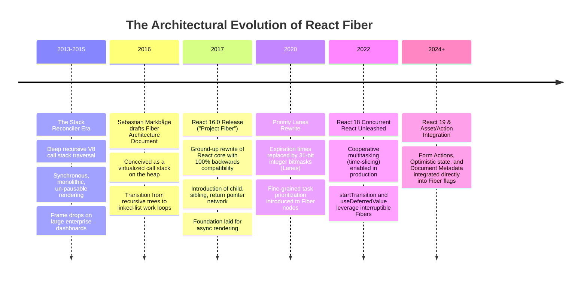
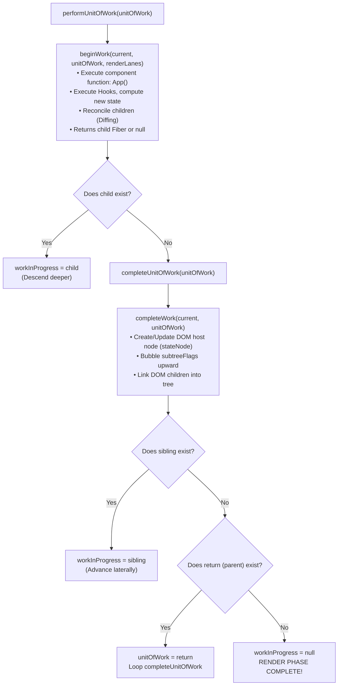
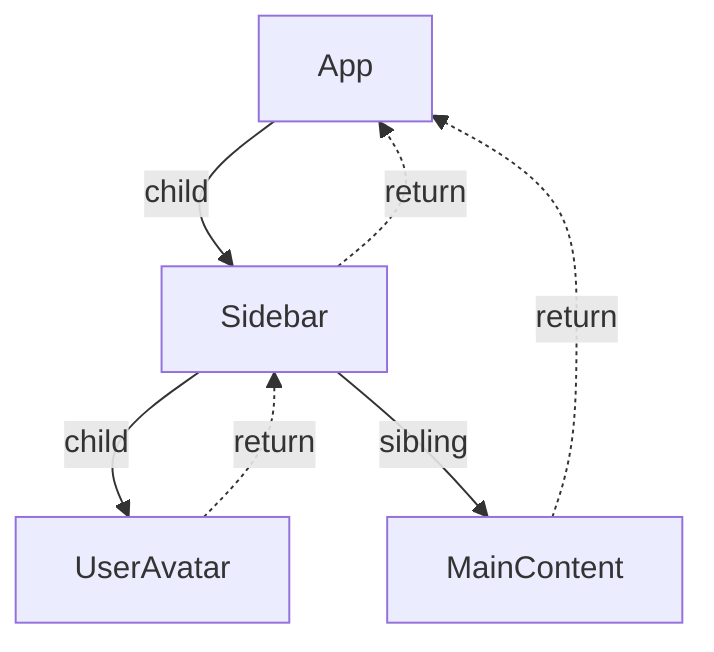
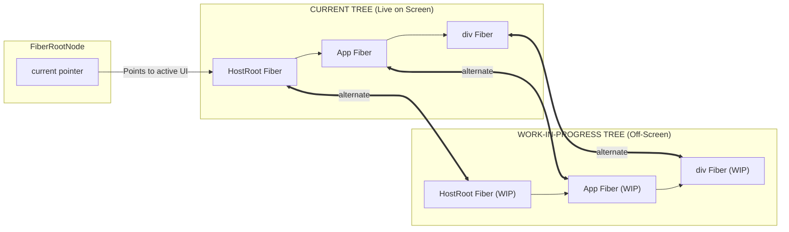
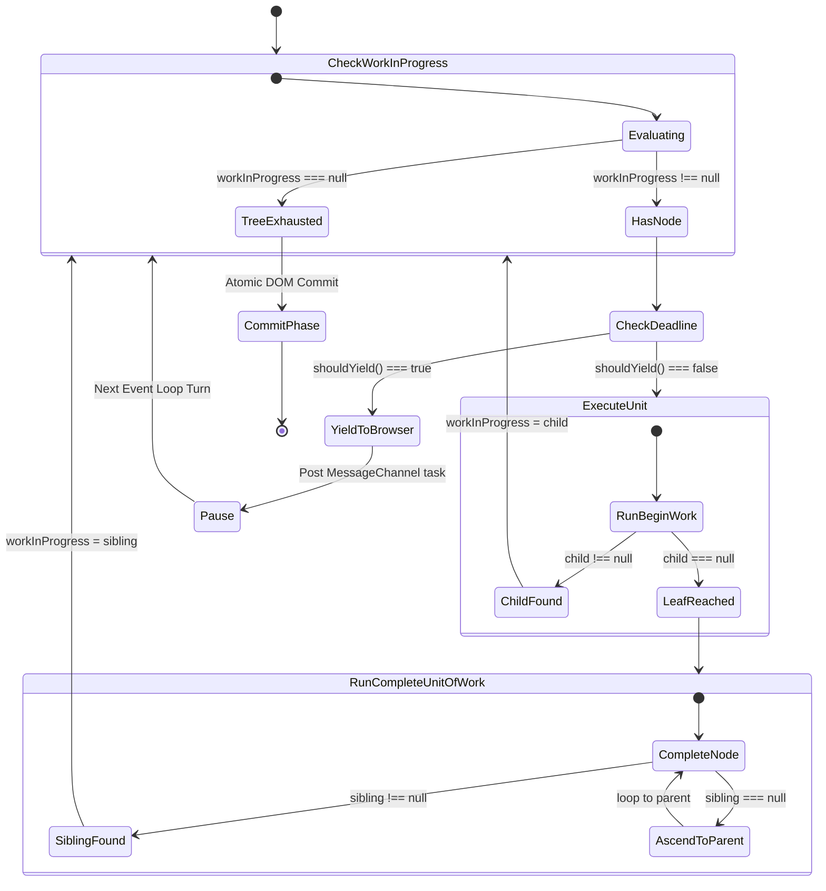

# Chapter 03: Fiber Architecture & Linked List Work Trees

> "Fiber is a reimplementation of the stack, specialized for React components. You can think of a single Fiber as a virtual stack frame. The advantage of reimplementing the stack is that you can keep stack frames in memory and execute them however (and whenever) you want."  
> — **Sebastian Markbåge, React Core Architect**

---

## 1. Why This Topic Exists

To understand why React built the **Fiber Architecture**, one must understand the fatal engineering limitation of the JavaScript platform: **the single-threaded Call Stack**.

In React 15 and earlier (the "Stack Reconciler" era), when a state change occurred at the root of an enterprise application, React executed a synchronous recursive function:
```typescript
function reconcile(element, parentDOM) {
  // 1. Mutate DOM
  // 2. Recursively call reconcile on all children
  element.children.forEach(child => reconcile(child, currentDOM));
}
```

Because this algorithm relied on JavaScript's native execution call stack:
1. **Uninterruptible Execution:** Once the V8 engine pushed the first `reconcile()` frame onto the Call Stack, the JavaScript main thread was 100% monopolized until the deepest leaf node was evaluated.
2. **Main Thread Lockup:** In an enterprise application with 5,000 components, a single re-render pass could take **40ms to 100ms** of continuous CPU time.
3. **Dropped Frames & User Latency:** Browsers run a display refresh cycle at **60 Hz (16.6ms per frame)** or **120 Hz (8.3ms per frame)**. If the JavaScript main thread does not yield to the browser rendering engine (Blink) within that 16.6ms budget, the browser cannot run Layout, cannot Paint, and cannot process user input (typing, mouse clicks, scrolling). The application stutters, drops frames, and triggers severe **INP (Interaction to Next Paint)** Core Web Vital penalties.

The engineering question that confronted the React Core Team was radical:  
*How do you pause, resume, abort, and prioritize a deeply nested recursive tree traversal on a single-threaded runtime?*

The answer: **You cannot pause a native C++ / V8 call stack.**  
Therefore, React had to **virtualize the call stack on the heap**. 

React Fiber replaced the implicit execution call stack with a **heap-allocated, doubly-linked, singly-traversed tree structure**. Each Fiber node represents an explicit virtual stack frame. By moving stack frames from the thread's execution stack into heap memory objects, React gained absolute sovereignty over time itself: work could be chopped into 5ms slices, suspended when a user clicks a button, resumed when the thread is idle, or completely discarded if a newer state update renders it obsolete.

---

## 2. Learning Objectives

By mastering this chapter, you will be able to:
- Explain the physical limitations of the legacy Stack Reconciler and the architectural imperatives that produced Fiber.
- Deconstruct the physical memory anatomy of a `FiberNode` (tag, type, props, state, pointers, flags, lanes).
- Trace the three core navigation pointers: **`child`**, **`sibling`**, and **`return`**, and explain why React uses this specific topology over traditional array-based children.
- Walk through the core engine work loops: `workLoopSync` vs `workLoopConcurrent`, and the bidirectional traversal of `beginWork` (down) and `completeUnitOfWork` (up).
- Master the **Double Buffering Pattern**: explain how the `current` and `workInProgress` trees interact across the `alternate` pointer to guarantee tear-free, atomic UI commits.
- Compare React's virtualized stack with Angular's Ivy `LView`/`TView` runtime and .NET CLR async state machine frames.
- Confidently answer Senior, Lead, and Architect interview questions regarding Fiber tree mechanics and low-level scheduling.

---

## 3. Historical Evolution



---

## 4. First Principles & Intuitive Physical Analogies (Layer 1)

### Analogy 1: The Tall Stack of Dinner Plates vs. The Ring Binder with Bookmarks
- **The Legacy Stack Reconciler (The Stack of Plates):**  
  Imagine a chef washing a vertical stack of 10,000 dinner plates. Once he begins, he is trapped in an assembly line. If a VIP customer walks in and shouts *"I need a glass of water immediately!"*, the chef cannot stop. If he leaves the stack mid-way, the tower of plates collapses and shatters. He must finish washing all 10,000 plates before addressing the VIP.
- **The Fiber Reconciler (The Ring Binder with Bookmarks):**  
  Instead of a physical stack, imagine the work is documented as a **ring binder where every page represents one task** (`FiberNode`).  
  Every page has three simple marginal notes:
  - *Next sub-task:* Turn to page 5 (`child`).
  - *Next colleague's task:* Turn to page 6 (`sibling`).
  - *Parent supervisor:* Return to page 1 (`return`).  
  The chef processes page 1, page 2, page 3. Suddenly, the VIP customer arrives.  
  The chef simply drops a **bookmark** on page 3, steps away to serve the glass of water (a high-priority click event), returns 4 milliseconds later, opens the binder directly to the bookmark, and resumes processing page 4. **No work is lost; no stack collapses.**

---

### Analogy 2: The Two Canvas Artist (Double Buffering)
Imagine an artist hired to paint a mural in a bustling corporate lobby.
- **Single Canvas Approach (Naive DOM Mutation):**  
  The artist paints directly on the lobby wall. As he works, the lobby visitors see half-drawn eyes, messy paint drips, and incomplete sketches. If the fire alarm rings mid-way, visitors are left staring at an ugly, broken, half-painted wall.
- **Double Buffering (React Fiber's `current` vs. `workInProgress`):**  
  The artist keeps a finished painting hanging on the lobby wall (**`current` tree**). Visitors see a 100% polished, complete image.  
  Behind a curtain in the back room, the artist works on an identical second canvas (**`workInProgress` tree**). He can sketch, erase, pause to drink coffee, or throw away the canvas if the design changes.  
  Only when the back-room painting is 100% complete and perfect does the artist take 1 millisecond to swap the paintings on the wall:
  ```text
  fiberRoot.current = workInProgress;
  ```
  The lobby visitors instantly see the brand-new, perfect mural. There is **zero flickering, zero partial rendering, and zero visual tearing.**

---

## 5. Internal Working & Engine Architecture (Layer 2)

### Anatomy of a `FiberNode` Instance

Every React element, component, and DOM host node is represented in the V8 heap as a `FiberNode`. Below is the architectural memory structure as defined in `ReactFiber.js`:

```typescript
function FiberNode(
  tag: WorkTag,
  pendingProps: mixed,
  key: null | string,
  mode: TypeOfMode,
) {
  // 1. Instance Identity & Hierarchy
  this.tag = tag;                 // Integer enum (FunctionComponent, ClassComponent, HostComponent, etc.)
  this.key = key;                 // Stable unique identifier for diffing
  this.elementType = null;         // The unresolved element type (e.g. MyComponent)
  this.type = null;                // The resolved function/class or DOM tag ('div', 'h1')
  this.stateNode = null;           // Reference to real DOM node or class instance (Blink C++ pointer)

  // 2. The 3 Structural Linked-List Pointers
  this.child = null;               // Pointer to first immediate child
  this.sibling = null;             // Pointer to next immediate sibling
  this.return = null;              // Pointer to parent Fiber (the return address)

  this.index = 0;                  // Position within sibling array

  // 3. Props and State Inputs/Outputs
  this.pendingProps = pendingProps;// Incoming props from JSX (_jsx)
  this.memoizedProps = null;       // Props used to render the last committed output
  this.updateQueue = null;         // Singly-linked list of state updates (actions)
  this.memoizedState = null;       // Singly-linked list of Hooks (Hook objects) or Class state

  // 4. Effects & Commit Sub-Phase Tracking
  this.flags = NoFlags;            // Bitmask for side-effects (Placement, Update, Deletion)
  this.subtreeFlags = NoFlags;     // Bitmask aggregating all descendant side-effects
  this.deletions = null;           // Array of child fibers to be unmounted

  // 5. Priority Lanes & Scheduling
  this.lanes = NoLanes;            // Bitmask representing priority of work on this node
  this.childLanes = NoLanes;       // Bitmask representing priority of work in subtree

  // 6. Double Buffering Reflection Pointer
  this.alternate = null;           // Pointer to twin Fiber on opposite tree (current <-> WIP)
}
```

---

### The Three Structural Pointers: Why Not an Array of Children?

Traditional AST or DOM trees store child nodes in an array:
```typescript
interface TreeNode {
  children: TreeNode[]; // ❌ Rejected by React Fiber
}
```

Why did React reject `children[]` in favor of `child`, `sibling`, and `return`?
1. **Dynamic Resumption Without Index Bookkeeping:**  
   If React pauses mid-tree inside an array of children, it must track integer indices `[parentIndex, childIndex, subChildIndex]` across arbitrary call depths. With linked lists, saving the active execution position requires storing **only a single reference pointer**: `workInProgress = activeFiber`.
2. **$O(1)$ Child Insertion & Sibling Navigation:**  
   In linked lists, splicing or advancing across siblings is a pointer assignment (`fiber.sibling`), avoiding array reallocation and index shifting in V8 New Space.
3. **The "Call Stack" Analogy:**
   - `child` → Calling a nested function (`push` frame).
   - `sibling` → Executing the next statement in the same function block.
   - `return` → Returning a value back to the caller (`pop` frame).

---

## 6. Runtime Flow & Execution Traces: The Work Loop

The Fiber engine processes work through a centralized while-loop:

```typescript
function workLoopConcurrent() {
  // Perform work until either the tree is complete OR the 5ms frame deadline expires!
  while (workInProgress !== null && !shouldYield()) {
    performUnitOfWork(workInProgress);
  }
}
```

### The Two Steps of Every Unit of Work

Every Fiber node is processed in two distinct phases: **`beginWork`** (going down) and **`completeWork`** (coming back up).



---

### Step-by-Step Traversal Walkthrough

Consider this component hierarchy:
```tsx
<App>
  <Sidebar>
    <UserAvatar />
  </Sidebar>
  <MainContent />
</App>
```



1. **`performUnitOfWork(App)`:**
   - Runs `beginWork(App)`. App returns `<Sidebar>` and `<MainContent>`.
   - React creates `Sidebar` Fiber. Returns `Sidebar`.
   - `workInProgress` becomes `Sidebar`.
2. **`performUnitOfWork(Sidebar)`:**
   - Runs `beginWork(Sidebar)`. Returns `UserAvatar`.
   - React creates `UserAvatar` Fiber. Returns `UserAvatar`.
   - `workInProgress` becomes `UserAvatar`.
3. **`performUnitOfWork(UserAvatar)`:**
   - Runs `beginWork(UserAvatar)`. It is a leaf node; returns `null`.
   - No child exists! React invokes `completeUnitOfWork(UserAvatar)`.
   - Runs `completeWork(UserAvatar)`: creates physical DOM node for avatar.
   - Checks: Does `UserAvatar.sibling` exist? **No.**
   - Ascends to parent: `UserAvatar.return` → `Sidebar`.
4. **`completeUnitOfWork(Sidebar)`:**
   - Runs `completeWork(Sidebar)`: attaches avatar DOM node into sidebar DOM container.
   - Bubbles effect flags up to parent.
   - Checks: Does `Sidebar.sibling` exist? **YES! `MainContent`.**
   - `workInProgress` becomes `MainContent`!
5. **`performUnitOfWork(MainContent)`:**
   - Runs `beginWork(MainContent)` ... descends and completes.
6. **Final Ascent:**
   - `MainContent` completes → Ascends to `App` → `completeWork(App)` finishes.
   - `workInProgress` becomes `null`.
   - **Render Phase Ends. React transitions to atomic synchronous Commit Phase!**

---

## 7. Memory Model & Heap Layout: The Double Buffering Pattern

In computer graphics, video games avoid screen tearing by maintaining two framebuffers: the **Front Buffer** (currently displayed on the monitor) and the **Back Buffer** (where the GPU draws the next frame off-screen).  
React Fiber applies this exact architectural pattern directly to the V8 Heap:



### The Lifecycle of Double Buffering:
1. **At Any Given Instant:**
   - `fiberRoot.current` points to the `current` Fiber tree. This tree reflects what the user currently sees on their screen.
   - When a state change is scheduled, React invokes `createWorkInProgress(current, pendingProps)`.
2. **Lazy Node Allocation via `alternate`:**  
   React **does not** clone the entire tree upfront! It only allocates WIP fibers for paths where updates occur. If a twin node already exists on `current.alternate` from a previous render cycle, React **recycles that object directly on the V8 heap**, simply overwriting its `pendingProps` and resetting its `flags`.
3. **The Atomic Commit Pointer Swap:**  
   During the Render phase, the WIP tree can be interrupted, discarded, or re-run dozens of times without touching the screen.  
   Once the WIP tree is 100% finished and DOM mutations are flushed off-screen, React executes one atomic reference assignment in memory:
   ```javascript
   fiberRoot.current = workInProgress;
   ```
   In a microsecond, the entire application switches over. The old `current` tree now becomes the new `workInProgress` ready to be recycled in future updates.

---

## 8. Visual Diagrams (Mermaid Vector Topologies)

### The Fiber Work Loop Traversal Matrix



---

## 9. Real World Usage & Production Patterns

> 🧪 **Companion Interactive Lab:** [FiberWorkLoopLab.tsx](../../apps/portal/src/features/visualizers/topic-03-fiber/FiberWorkLoopLab.tsx) | Live in Portal: `lab-14-fiber-work-loop`

### Pattern 1: Inspecting the Internal Fiber in the Browser Console
Because React stores Fiber references on real DOM nodes, you can inspect any live component's Fiber tree in Chrome DevTools:

```javascript
// Open DevTools on any React site and select an element:
const domElement = $0;

// Access React's internal Fiber key (dynamically prefixed by React version)
const fiberKey = Object.keys(domElement).find(key => 
  key.startsWith('__reactFiber$') || key.startsWith('__reactInternalInstance$')
);

const fiber = domElement[fiberKey];

console.log("Active Fiber Node:", fiber);
console.log("Component Type:", fiber.type);
console.log("Local State (Hooks List):", fiber.memoizedState);
console.log("Parent Fiber:", fiber.return);
console.log("Twin Fiber (Alternate):", fiber.alternate);
```

---

### Pattern 2: Architecting Heavy Component Trees to Maximize Bailouts

Because Fiber processes nodes top-down via `beginWork`, if an update occurs deep in the tree, you can prevent Fiber from traversing unnecessary nodes by leveraging **Element Identity Bailout**:

```tsx
// ❌ SUBOPTIMAL: Re-creates Child element on every Parent render
export function SuboptimalDashboard() {
  const [ticker, setTicker] = useState(0);

  return (
    <div>
      <button onClick={() => setTicker(t => t + 1)}>Tick: {ticker}</button>
      {/* HeavyTable will be traversed by beginWork every tick! */}
      <HeavyTable />
    </div>
  );
}

// ✅ ARCHITECT PATTERN: Passing Children as Pre-Rendered Elements
export function OptimizedDashboard({ children }: { children: React.ReactNode }) {
  const [ticker, setTicker] = useState(0);

  return (
    <div>
      <button onClick={() => setTicker(t => t + 1)}>Tick: {ticker}</button>
      {/* 
        React detects children reference did NOT change:
        current.child.memoizedProps === workInProgress.child.pendingProps
        beginWork immediately BAILS OUT, skipping the entire HeavyTable subtree!
      */}
      {children}
    </div>
  );
}

// App Usage:
// <OptimizedDashboard><HeavyTable /></OptimizedDashboard>
```

---

## 10. Angular Comparison

For a Senior Angular Architect transitioning to React, understanding Fiber vs. Angular Ivy provides immense clarity on how each framework approaches component lifecycles.

| Architectural Dimension | React (Fiber Engine) | Angular (Ivy Engine) |
| :--- | :--- | :--- |
| **Component Representation** | **`FiberNode` (JavaScript Object on V8 Heap)**.<br/>Stores state, props, effect flags, and linked list pointers. | **`LView` (Logical View Array) & `TView` (Template View Definition)**.<br/>Flat arrays where indices map directly to DOM nodes and pipe instances. |
| **Work Scheduler** | **Cooperative Time-Slicing Scheduler**.<br/>Can pause, abort, and resume traversal based on 5ms deadline (`shouldYield`). | **Synchronous Microtask / Zone.js Dispatcher**.<br/>Traverses component view hierarchy top-to-bottom synchronously upon change detection tick. |
| **Tree Pointers** | Explicit linked list pointers (`child`, `sibling`, `return`). | Array index offsets (`lView[CHILD_HEAD]`, `lView[NEXT]`, `lView[PARENT]`). |
| **State Buffer Strategy** | **Double Buffering** (`current` vs `workInProgress` trees). Commits atomically at end of pass. | **In-Place Mutation**.<br/>Directly compares current binding values against previous values inside `lView` slots (`bindingUpdated()`). |
| **Fine-Grained Execution** | Tree-based reconciliation traversal (unless short-circuited by `memo` or compiler). | Expression-based checking; in Angular Signals, execution jumps directly to the consuming signal consumer node. |

---

## 11. .NET Comparison

For an ASP.NET Core & WPF / CLR Architect, React's Fiber engine shares direct parallels with low-level .NET concurrency and runtime mechanics:

| Architectural Dimension | React (Fiber Architecture) | .NET (CLR / C# Runtime) |
| :--- | :--- | :--- |
| **Virtual Stack Concept** | **`FiberNode` on Heap**.<br/>Virtualizes JavaScript call frames to allow non-blocking cooperative execution. | **`AsyncStateMachine` Struct on Heap**.<br/>C# compiler converts `async`/`await` methods into heap-allocated state machines that save local registers when yielding. |
| **Cooperative Multitasking** | 5ms yielding loop using `MessageChannel` / `shouldYield()`. | `ThreadPool.Yield()` or `await Task.Yield()`, which relinquishes thread execution back to the CLR thread pool. |
| **Double Buffering Pattern** | `current` vs `workInProgress` Fiber trees swapping via `fiberRoot.current`. | Graphics Double Buffering in WPF / WinForms (`SetStyle(ControlStyles.DoubleBuffer, true)`) and DirectX swap chains (`Present()`). |
| **Effect Flags Bitmask** | 32-bit bitwise flags (`Placement`, `Update`, `ChildDeletion`). | C# `[Flags] enum` (e.g. `FileAccess.Read | FileAccess.Write`) used for high-throughput bitwise checking. |
| **Object Recycling** | Recycling `alternate` Fiber nodes to avoid V8 GC scavenging spikes. | `ArrayPool<T>.Shared` and `ObjectPool<T>` in ASP.NET Core Kestrel to avoid Gen 0 / Gen 1 garbage collection. |

---

## 12. Enterprise Perspective & Production Risks (Layer 4)

### Production Risk 1: Memory Leaks from Detached DOM Retained by Fibers
In long-running Single Page Applications (trading terminals, CRM portals):
- When a component unmounts, React severs the DOM node from the document.
- However, if a developer stores a DOM reference in an external closure, global cache, or forgotten event listener:
  ```typescript
  // ❌ DISASTROUS MEMORY LEAK
  const globalElementsCache = [];
  function BadComponent() {
    const ref = useRef<HTMLDivElement>(null);
    useEffect(() => {
      globalElementsCache.push(ref.current); // Retains DOM element!
    }, []);
    return <div ref={ref}>Data</div>;
  }
  ```
- **The Engine Consequence:** Because the DOM node maintains an internal reference back to its `FiberNode` (`__reactFiber$...`), and that Fiber retains references to `memoizedProps`, `memoizedState`, and its entire parent/sibling Fiber graph, **the entire unmounted component tree remains pinned in V8 Old Space memory**. The GC cannot collect it, leading to steady memory leakage and browser tab termination.

### Production Risk 2: CPU Starvation from Synchronous Work Loop Lockup
If an engineer wraps expensive synchronous CPU computations (e.g. encrypting a large payload, parsing 50MB JSON, or processing complex matrix math) directly inside a component's render body:
- `beginWork` executes the component function synchronously.
- React's `shouldYield()` check only occurs **between units of work** (between Fiber nodes).
- If a single component function takes **800ms** to execute, React **cannot yield**.
- The main thread freezes, animations stutter, and the browser displays the "Page Unresponsive" dialog.
- **Remediation:** Offload CPU-heavy computations to Web Workers (`comlink`) or slice them across microtasks using `scheduler.yield()`.

---

## 13. Performance Considerations

### V8 Hidden Class Stability in `FiberNode`
The `FiberNode` constructor initializes all properties in the **exact same order** with uniform initial types (numbers as `0`, pointers as `null`).  
This ensures that every `FiberNode` instance in your application shares the **exact same V8 Hidden Class (`Map`)**. V8's Inline Caches (IC) remain monomorphic when accessing `fiber.child` or `fiber.memoizedState`, executing pointer lookups in single assembly instructions (`mov rax, [rbx + 0x18]`).

### Cache Locality vs. Traversal Cost
While linked lists have slightly lower CPU cache locality than flat contiguous arrays, React's Fiber structure offsets this because:
1. `current` and `workInProgress` nodes are allocated in close temporal proximity in V8 New Space.
2. The ability to abort or bail out of entire subtrees at the root of a branch saves millions of CPU cycles compared to walking rigid arrays.

---

## 14. Tradeoffs

| Architectural Decision | Advantages | Disadvantages |
| :--- | :--- | :--- |
| **Heap-Allocated Virtual Stack (Fiber)** | - Traversal can be paused, resumed, and aborted.<br/>- Supports concurrent time-slicing (60 FPS responsiveness).<br/>- Priority-based scheduling (Lanes). | - Significantly higher V8 heap memory footprint (~150 bytes per Fiber node).<br/>- Increased engine complexity compared to a simple recursive function. |
| **Double Buffering (`alternate`)** | - Zero partial UI tearing.<br/>- Atomic commits.<br/>- Recycles objects between renders, minimizing GC allocations. | - Keeps two full Fiber trees in memory during render passes, doubling peak heap consumption during heavy updates. |
| **Linked List (`child`/`sibling`/`return`)** | - Saving execution state requires storing only 1 pointer (`workInProgress`).<br/>- Dynamic structural inserts without array reallocation. | - Traversal requires manual step loops instead of simple `for` loops. |

---

## 15. Common Mistakes & Interview Traps

### Trap 1: "The Fiber Tree is a 1-to-1 mirror of the DOM Tree"
- ❌ **Candidate Assumption:** *"For every HTML element in the DOM, there is exactly one Fiber node, and vice versa."*
- ✅ **Architect Reality:** *"The Fiber tree contains vastly more nodes than the DOM tree. Every React Fragment (`<React.Fragment>`), Context Provider (`<ThemeContext.Provider>`), Context Consumer, Suspense Boundary (`<Suspense>`), and Custom Component (`<UserProfile>`) has its own dedicated `FiberNode` on the heap, even though they emit zero physical DOM nodes."*

### Trap 2: Thinking Double Buffering Clones the Entire Tree Upfront
- ❌ **Candidate Assumption:** *"When state changes, React immediately makes a deep copy of the entire current Fiber tree to create the workInProgress tree."*
- ✅ **Architect Reality:** *"React constructs the `workInProgress` tree **lazily** during `beginWork`. As it descends, it only creates or recycles `alternate` nodes for the exact branch being evaluated. Unchanged subtrees reuse the existing pointers without duplicating nodes."*

---

## 16. Interview Questions & Architectural Answers (Senior, Lead, Architect - Layer 5)

### Q1 (Senior Level): Why couldn't React achieve concurrent rendering with the legacy Stack Reconciler? What fundamental computer science problem did Fiber solve?
**Architectural Answer:**  
The legacy Stack Reconciler relied on native recursive function calls on JavaScript's single execution stack. In V8, the native call stack is managed by the C++ runtime and CPU architecture: once a thread enters a recursive execution chain, it **cannot be paused, saved to disk/heap, or resumed later** from userland JavaScript. To yield to the browser's render pipeline, the entire recursion had to complete.  
Fiber solved this by **virtualizing the call stack on the heap**. By reifying execution frames into JavaScript objects (`FiberNode`), the execution stack became a data structure. React can execute one unit of work, pause by stashing a pointer to `workInProgress`, yield the main thread to Blink for 16ms to process user input, and subsequently resume the work loop exactly where it left off.

---

### Q2 (Lead Level): Detail the exact traversal algorithm of `completeUnitOfWork`. How does React traverse from a leaf node to its sibling or parent?
**Architectural Answer:**  
When `beginWork` returns `null` (indicating a leaf node with no children), React transitions to `completeUnitOfWork`:
1. It executes `completeWork(unitOfWork)` on the active node, creating the physical DOM instance (`stateNode`), linking child DOM nodes together, and bubbling effect flags to `unitOfWork.return`.
2. It checks if a sibling exists: `const sibling = unitOfWork.sibling;`
   - If `sibling !== null`, React assigns `workInProgress = sibling` and breaks out to the main work loop to begin processing that sibling branch.
3. If no sibling exists, React must ascend:
   - It sets `unitOfWork = unitOfWork.return;` (moving to the parent).
   - If `unitOfWork === null` or matches the root, rendering is complete (`workInProgress = null`).
   - Otherwise, it loops back to step 1 to execute `completeWork` on the parent node.  
This algorithm guarantees a complete Depth-First Search (DFS) post-order traversal without maintaining an explicit call stack.

---

### Q3 (Architect Level): How does Fiber's Double Buffering pattern prevent visual UI tearing during concurrent interrupts?
**Architectural Answer:**  
UI tearing occurs when different parts of a visual interface display data from conflicting points in time (e.g. an account balance shows updated numbers, but the transaction list shows old items).  
Fiber prevents tearing via **Double Buffering**:
1. All interruptible, time-sliced work (component rendering, Hooks execution, diffing) occurs strictly on the **`workInProgress` tree** in background V8 heap memory.
2. The user's screen remains permanently bound to the immutable **`current` tree** via `fiberRoot.current`.
3. If a high-priority user interaction interrupts a low-priority transition render, React simply abandons the unfinished `workInProgress` tree. Because zero mutations ever touched the real DOM during the Render phase, the user's screen remains 100% consistent.
4. When a render pass completes cleanly, React commits the changes to the DOM and executes an atomic pointer swap: `fiberRoot.current = workInProgress;`. Tearing is mathematically impossible because the DOM is never updated partially.

---

## 17. Senior-Level Mental Model & "How to Remember This Forever" (Layer 3)

### The Memory Peg: The "Ring Binder & The Twin Whiteboards"
1. **The Ring Binder (Fiber Linked List):**  
   Never picture a tree with arrays of children. Picture a **ring binder notebook**. Every page is a `FiberNode`. To navigate, you only have three tabs: **Go Deeper (`child`)**, **Go Right (`sibling`)**, and **Go Back to Boss (`return`)**. You can put a bookmark on any page, close the binder, go home for lunch, and open it right back to that exact page.
2. **The Twin Whiteboards (Double Buffering):**  
   Picture two whiteboards in a conference room. Whiteboard A is facing the CEO (**`current`**). Whiteboard B is facing the wall (**`workInProgress`**). You can write, erase, make mistakes, and sketch on Whiteboard B all morning. The CEO never sees a mess. Only when the chart is flawless do you spin the stand 180 degrees. Whiteboard B is now facing the CEO, and Whiteboard A is ready for your next draft.

---

## 18. Core Vocabulary & "Aha!" Breakthrough Insights (Refresher)

| Term | Precision Architectural Definition |
| :--- | :--- |
| **`FiberNode`** | A heap-allocated object representing an explicit virtual stack frame, holding component state, props, and traversal pointers. |
| **`workInProgress`** | The scratchpad Fiber tree currently being constructed or reconciled in V8 memory during the Render phase. |
| **`current`** | The active Fiber tree currently reflected in the live browser DOM and visible to the user. |
| **`alternate`** | The bidirectional reflection pointer linking a `current` Fiber with its corresponding `workInProgress` twin. |
| **`shouldYield()`** | The 5ms deadline check function that asks the browser/scheduler if high-priority main thread tasks are pending. |

> 💡 **The "Aha!" Breakthrough Insight:**  
> In computer science, **Recursion is simply a linked list allocated on the OS execution stack.**  
> Fiber did not change the mathematical nature of React's algorithm—it simply moved the linked list **from the C++ Call Stack to the JavaScript Heap!** Once it is on the heap, it is data, and data can be paused, inspected, and saved.

---

## 19. Key Takeaways

1. **The Stack Bottleneck:** React 15's Stack Reconciler was synchronous and un-pausable, causing severe dropped frames and INP regressions on large enterprise apps.
2. **The Virtualized Stack:** Fiber virtualizes execution stack frames as heap objects (`FiberNode`), enabling interruptible, priority-based cooperative rendering.
3. **The 3 Core Pointers:** Fiber navigates using `child` (first child), `sibling` (next sibling), and `return` (parent/caller).
4. **The Work Loop:** Traversal is an iterative loop alternating between `beginWork` (top-down) and `completeUnitOfWork` (bottom-up).
5. **Double Buffering:** React maintains two trees (`current` and `workInProgress`) linked via `alternate`, executing atomic commits via `fiberRoot.current = workInProgress` to eliminate visual UI tearing.

---

## 20. Revision Sheet

- **Core Problem Solved:** Cannot pause a native call stack → Re-implement the stack on the V8 heap.
- **Pointers Matrix:**
  - `child`: Pointer to first child.
  - `sibling`: Pointer to immediate next sibling.
  - `return`: Pointer to parent (return stack frame).
  - `alternate`: Twin node on opposite buffer tree.
- **Work Loop Phases:**
  - **`beginWork`:** Runs component, executes Hooks, diffs children.
  - **`completeWork`:** Allocates DOM node (`stateNode`), aggregates effect flags (`subtreeFlags`).
- **Commit Boundary:** Render Phase is interruptible on V8 Heap; Commit Phase is synchronous and atomic in Blink C++ DOM.
