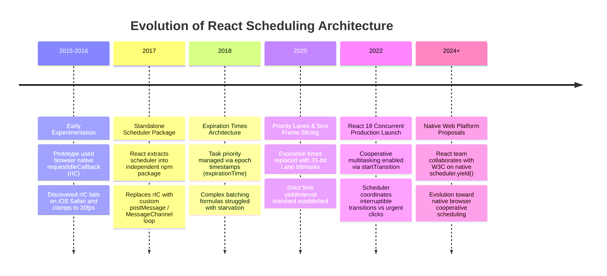
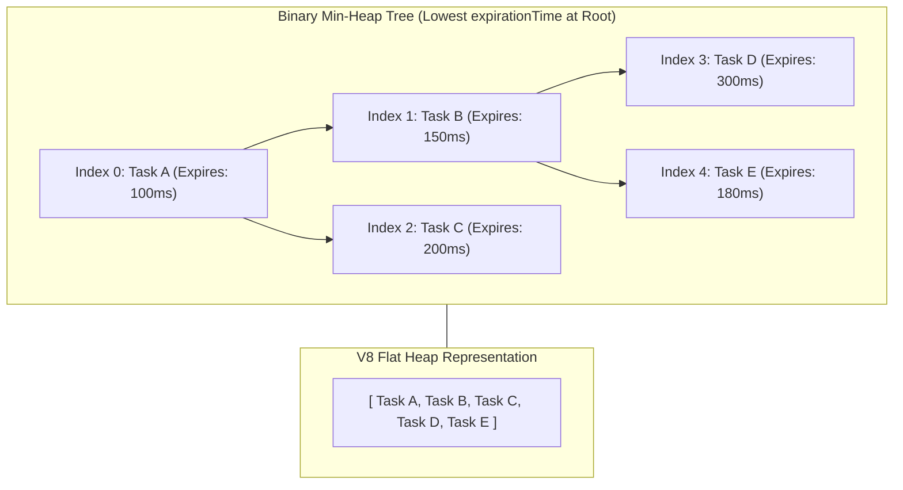

```mermaid
sequenceDiagram
    autonumber
    participant React as React Reconciler
    participant Sched as Scheduler (workLoop)
    participant MC as MessageChannel (Port)
    participant Blink as Chromium Main Thread (Blink)

    React->>Sched: scheduleCallback(NormalPriority, performWork)
    Sched->>MC: port2.postMessage(null)
    Note over Blink: Event Loop processes macrotask
    MC->>Sched: port1.onmessage -> performWorkUntilDeadline()
    
    rect rgb(20, 35, 60)
    Note over Sched: 5ms Time Slice Begins (startTime = 100.0ms)
    loop While workInProgress !== null && !shouldYield()
        Sched->>React: performUnitOfWork(Fiber)
        React-->>Sched: Unit finished (currentTime = 102.1ms -> continue)
        Sched->>React: performUnitOfWork(Fiber)
        React-->>Sched: Unit finished (currentTime = 105.2ms -> shouldYield() is TRUE!)
    end
    Note over Sched: 5.2ms elapsed: STOP WORK!
    end

    Sched->>MC: port2.postMessage(null) (Schedule next slice!)
    Note over Sched: Scheduler relinquishes JavaScript Call Stack!
    
    rect rgb(40, 60, 20)
    Note over Blink: Browser Main Thread Regains Control
    Blink->>Blink: Dispatches User Click Event
    Blink->>Blink: Recalculates Style & Runs Layout
    Blink->>Blink: Paints Pixels to Screen (V-Sync Preserved!)
    end

    Note over Blink: Next Macrotask executes
    MC->>Sched: port1.onmessage -> Resume workLoop exactly where it stopped!
```

# Chapter 04: Fiber Schedulers & Cooperative Time Slicing

> "The browser is an operating system with a single main thread. If you don't build an operating system scheduler inside your UI library, you will inevitably surrender user responsiveness to whoever wrote the longest function."  
> — **React Scheduler Architecture Rationale**

---

## 1. Why This Topic Exists

On the web platform, the **JavaScript Main Thread** is a shared, hyper-congested resource. It is responsible for:
1. Executing JavaScript application logic.
2. Parsing HTML tokens and building the DOM tree.
3. Calculating CSS rules, cascades, and style computations.
4. Performing Layout / Reflow (computing exact pixel dimensions and coordinates).
5. Rasterizing layers and Painting pixels to the display.
6. Dispatching user inputs (keyboard events, mouse clicks, scrolling, gestures).

When a browser connects to a display running at **60 Hz**, it has a strict frame budget of **16.6 milliseconds (1000ms / 60)**. On modern high-refresh screens (120 Hz ProMotion displays), that budget drops to **8.3 milliseconds**.

```text
60 FPS Budget:  [========== 16.6ms ==========]
8.3ms for JS  |  4ms Layout  |  2ms Paint  |  2.3ms V-Sync Buffer
```

In traditional JavaScript UI frameworks, rendering is **monolithic**. If an enterprise data dashboard takes **80 milliseconds** to reconcile and render, it monopolizes the main thread continuously for 80ms:
- The browser **skips 5 consecutive display frames** (severe visual stutter / jank).
- If the user types into an input or clicks "Cancel" at millisecond 10, the browser **cannot process the click until millisecond 80**.
- Google's Core Web Vital metric—**Interaction to Next Paint (INP)**—records an 80ms latency violation, hurting search rankings and user satisfaction.

To solve this without Web Workers (which lack direct DOM access), React engineered a userland **Cooperative Multitasking Operating System**: the **React Scheduler**.  
Instead of running rendering to completion, React chops reconciliation into **5-millisecond execution slices**. After every 5ms, React pauses, yields control of the main thread back to the browser engine to paint pixels and receive user inputs, and resumes execution in the next event loop turn.

---

## 2. Learning Objectives

By mastering this chapter, you will be able to:
- Explain why cooperative multitasking is required on the browser's single-threaded event loop.
- Detail why React **abandoned the browser's native `requestIdleCallback` (rIC)** API in production.
- Deconstruct why React uses **`MessageChannel`** instead of `setTimeout(fn, 0)`, `requestAnimationFrame`, or Microtasks.
- Dissect the binary **Min-Heap** data structure powering `taskQueue` and `timerQueue` in the `scheduler` package.
- Trace the internal execution flow of `workLoopConcurrent`, `shouldYieldToHost`, and `performWorkUntilDeadline`.
- Compare React's cooperative scheduler with Angular's Zone.js and .NET's Task Parallel Library (TPL) `TaskScheduler`.
- Confidently answer Senior, Lead, and Architect interview questions regarding browser time-slicing and task prioritization.

---

## 3. Historical Evolution



---

## 4. First Principles & Intuitive Physical Analogies (Layer 1)

### Analogy 1: The Cooperative Bank Teller and the 5-Minute Stopwatch
Imagine a single bank teller serving a long line of customers.
- **The Preemptive OS Approach (Threads):** A physical security guard forcefully grabs the customer by the collar every 5 minutes and pushes them to the back of the line, regardless of what they are doing. (JavaScript engines do not have preemptive thread interrupts).
- **The Monolithic Approach (Legacy React):** Customer #1 steps up to the counter with a box of 10,000 uncounted coins. The teller begins counting. A pregnant woman enters the bank needing a single glass of water. The teller ignores her and continues counting coins for 45 minutes.
- **The Cooperative Scheduler (React 18/19):**  
  The teller keeps a **5-minute stopwatch** on the counter (`yieldInterval = 5ms`).  
  When Customer #1 arrives with 10,000 coins, the teller says: *"I will count as many as I can for 5 minutes."*  
  At minute 5, the stopwatch beeps. The teller marks the count: *"1,200 coins counted so far"*, places the box on the counter, and looks at the lobby: *"Does anyone have an urgent emergency?"*  
  He gives the woman her glass of water (processes high-priority click), then turns back to the box and counts for another 5 minutes.

---

### Analogy 2: The Post Office Mailbox (`MessageChannel`)
Imagine you need to remind yourself to continue a project tomorrow morning without waking up your family tonight.
- If you set a loud alarm in your bedroom every 0 seconds (`setTimeout(fn, 0)`), the hotel clerk penalizes you with a mandatory **4ms delay** after 4 alarms.
- If you write a note on your bathroom mirror before sleeping (**Microtask / Promise**), you are legally forbidden from going to bed until all notes are erased—you end up working all night and **starve yourself of sleep (browser paint starvation)**.
- **The `MessageChannel` Solution:**  
  You walk to the 24-hour postal drop box on your street, drop a letter addressed to yourself (`port2.postMessage(null)`), and go to sleep.  
  The mail carrier delivers the letter in the very next morning mail delivery cycle. The browser successfully painted, processed user taps, and immediately handed you your letter to resume work.

---

## 5. Internal Working & Engine Architecture (Layer 2)

The `scheduler` package (`packages/scheduler/src/forks/Scheduler.js`) operates independently of React DOM and React Reconciler. It contains three foundational components:
1. **The Dual Min-Heap Queues:** `taskQueue` and `timerQueue`.
2. **The 5-Millisecond Deadline Clock:** `shouldYieldToHost()`.
3. **The Macrotask Trampoline:** `performWorkUntilDeadline()` driven by `MessageChannel`.

```mermaid
graph TD
    subgraph SchedulerCore["SCHEDULER ENGINE (Scheduler.js)"]
        TaskQueue["taskQueue (Min-Heap)<br/>Tasks ready to execute<br/>Sorted by: expirationTime"]
        TimerQueue["timerQueue (Min-Heap)<br/>Delayed tasks (delay > 0)<br/>Sorted by: startTime"]
        
        Clock["Deadline Clock<br/>deadline = currentTime + 5ms"]
    end

    subgraph BrowserPlatform["BROWSER PLATFORM"]
        MC["MessageChannel (port1 / port2)"]
        EventLoop["Browser Event Loop<br/>(Input -> Layout -> Paint)"]
    end

    TimerQueue -->|startTime reached| TaskQueue
    TaskQueue -->|Pop highest priority| Worker["workLoop()"]
    Worker --> Clock
    Clock -->|Time expired (>5ms)| Yield["shouldYieldToHost() = TRUE"]
    Yield --> MC
    MC -->|Macrotask| EventLoop
    EventLoop -->|Next Turn| Worker
```

---

### The 5 Priority Levels

Every task registered with the Scheduler is assigned one of five priority levels, each mapped to a specific timeout duration:

| Priority Level | Constant Value | Timeout Duration | Practical Use Case |
| :--- | :--- | :--- | :--- |
| **ImmediatePriority** | `1` | `-1 ms` (Expires instantly) | Discrete user input, typing, discrete click events. |
| **UserBlockingPriority** | `2` | `250 ms` | Dragging, scrolling, hover states. |
| **NormalPriority** | `3` | `5,000 ms` | Default state updates, data fetching responses. |
| **LowPriority** | `4` | `10,000 ms` | Background prefetching, analytics logging. |
| **IdlePriority** | `5` | `1,073,741,823 ms` (~12.4 days) | Idle garbage cleanup, speculative indexing. |

---

### Why React Abandoned `requestIdleCallback` (rIC)

Early React prototypes attempted to use the browser's native `window.requestIdleCallback`. The React team discarded it after extensive production testing due to fatal architectural flaws:
1. **No iOS Safari Support:** Apple deliberately refused to implement `requestIdleCallback` in WebKit for years.
2. **Low Refresh Rate Throttling:** The W3C specification for `requestIdleCallback` clamped execution callbacks to **20 frames per second (50ms intervals)** when user interaction paused, making smooth UI transitions impossible.
3. **Unpredictable Latency:** On busy tabs, `requestIdleCallback` could be deferred indefinitely, starving background work until browser timeout triggers fired.

---

### Why `MessageChannel` Over Other Async Primitives?

| Primitive Tested | Engineering Result | Why React Rejected It |
| :--- | :--- | :--- |
| **`Promise.resolve().then(...)` (Microtask)** | ❌ Complete Failure | **Microtask Exhaustion:** The browser event loop specification requires draining the microtask queue *completely* before yielding to Layout or Paint. Slicing with microtasks **freezes the browser** just like synchronous code! |
| **`setTimeout(fn, 0)` (Macrotask)** | ❌ Inefficient | **The 4ms Nesting Clamp:** HTML5 spec dictates that after 5 nested `setTimeout` calls, the browser enforces a mandatory minimum **4ms sleep penalty**. In a 16.6ms budget, wasting 4ms doing nothing destroys frame rates. |
| **`requestAnimationFrame` (rAF)** | ❌ Wrong Cadence | **Tied to V-Sync:** rAF fires once per display refresh *before* layout and paint. It cannot be used to yield and resume *between* paint operations. |
| **`MessageChannel` (Macrotask)** | ✅ **Production Choice** | **Zero Clamping Macrotask:** `channel.port2.postMessage(null)` schedules a macrotask that executes immediately after the current turn, with **0ms clamping penalty**, allowing Blink to paint and handle user input between slices! |

---

## 6. Runtime Flow & Execution Traces: Inside the Work Loop

Let us trace the internal execution loop of `performWorkUntilDeadline` and `workLoop`:

```typescript
// Conceptual extraction from packages/scheduler/src/forks/Scheduler.js
let startTime = -1;
let currentPriorityLevel = NormalPriority;
const frameInterval = 5; // The famous 5ms deadline!

function shouldYieldToHost() {
  const timeElapsed = getCurrentTime() - startTime;
  if (timeElapsed < frameInterval) {
    // Under 5ms: KEEP WORKING!
    return false;
  }
  // 5ms exceeded: YIELD TO BROWSER!
  return true;
}

function performWorkUntilDeadline() {
  if (scheduledHostCallback !== null) {
    const currentTime = getCurrentTime();
    startTime = currentTime;
    const hasTimeRemaining = true;
    let hasMoreWork = true;

    try {
      // Execute the active work loop!
      hasMoreWork = scheduledHostCallback(hasTimeRemaining, currentTime);
    } finally {
      if (hasMoreWork) {
        // More work remains: Post message to schedule next 5ms slice!
        schedulePerformWorkUntilDeadline();
      } else {
        scheduledHostCallback = null;
      }
    }
  }
}
```



---

## 7. Memory Model & Heap Layout: The Min-Heap Implementation

To ensure that looking up the highest-priority task executes in $O(1)$ time, the Scheduler implements a **Binary Min-Heap** stored in a flat contiguous V8 array:

```typescript
type Task = {
  id: number,
  callback: Function | null,
  priorityLevel: PriorityLevel,
  startTime: number,        // When task becomes active
  expirationTime: number,   // Sort index in taskQueue (startTime + timeout)
  sortIndex: number,
};

// Heap storage: flat V8 arrays
const taskQueue: Task[] = [];
const timerQueue: Task[] = [];
```



### Algorithmic Invariants:
- **Parent Index:** `Math.floor((index - 1) / 2)`
- **Left Child Index:** `(index * 2) + 1`
- **Right Child Index:** `(index * 2) + 2`
- **Peek ($O(1)$):** `taskQueue[0]` is always the most urgent task.
- **Push ($O(\log n)$):** Appends to array and invokes `siftUp()`.
- **Pop ($O(\log n)$):** Swaps root with tail, pops tail, and invokes `siftDown()`.

---

## 8. Visual Diagrams (Mermaid Vector Topologies)

### The Complete Event Loop Frame Budget Slice

```mermaid
gantt
    title Browser 16.6ms Frame Budget with React 5ms Time Slices
    dateFormat X
    axisFormat %s ms

    section Chromium Frame
    User Tap Event Dispatch      :active, a1, 0, 2
    React Slice 1 (5ms)          :crit, a2, 2, 7
    Blink Style & Layout Check   :done, a3, 7, 9
    React Slice 2 (5ms)          :crit, a4, 9, 14
    Browser Paint & GPU V-Sync   :done, a5, 14, 16.6
```



> 🌟 **The Architecture Win:**  
> Instead of a solid 14ms JavaScript block freezing the thread, the work was cleanly bifurcated into two 5ms slices. The browser squeezed user input handling and paint recalculations seamlessly into the gaps, guaranteeing an **Interaction to Next Paint (INP) score of < 16ms (Good / Green)**.

---

## 9. Real World Usage & Production Patterns

> 🧪 **Companion Interactive Lab:** [EventLoopSimulatorLab.tsx](../../apps/portal/src/features/visualizers/topic-04-event-loop/EventLoopSimulatorLab.tsx) | Live in Portal: `lab-04-event-loop`

### Pattern 1: Profiling 5ms Time Slices in Chrome DevTools
To observe React's 5ms time-slicing in production:
1. Open Chrome DevTools $\rightarrow$ **Performance** tab.
2. Enable **CPU 4x or 6x Slowdown** (to simulate average mobile hardware).
3. Trigger a large transition wrapped in `startTransition`:
   ```tsx
   import { startTransition, useState } from 'react';

   export function SearchDashboard() {
     const [query, setQuery] = useState('');
     const [results, setResults] = useState([]);

     function handleInput(e: React.ChangeEvent<HTMLInputElement>) {
       // Urgent input: Update text immediately (ImmediatePriority)
       setQuery(e.target.value);

       // Non-urgent rendering: Time-sliced across 5ms frames!
       startTransition(() => {
         setResults(computeMassiveDataset(e.target.value));
       });
     }

     return <input value={query} onChange={handleInput} />;
   }
   ```
4. Record the profile. In the **Main Thread Flame Chart**, you will see:
   - A sequence of small **5ms tasks** labeled `(anonymous)` or `performWorkUntilDeadline`.
   - Between each task, you will see a tiny sliver labeled **Frame** or **Paint**.
   - Total blocking time (TBT): **0ms**.

---

### Pattern 2: Integrating Directly with the Experimental Native Scheduler API

In modern Chromium browsers, the W3C is standardizing `scheduler.yield()`. You can write forward-compatible background workers that cooperate with React:

```typescript
// Enterprise Utility: Cooperative Chunked Processing
export async function yieldToMain() {
  if ('scheduler' in window && 'yield' in (window as any).scheduler) {
    // Native W3C browser yield!
    return await (window as any).scheduler.yield();
  }
  // Fallback: React-style MessageChannel macrotask yield
  return new Promise(resolve => {
    const channel = new MessageChannel();
    channel.port1.onmessage = resolve;
    channel.port2.postMessage(null);
  });
}

// Processing 100,000 enterprise records without freezing the UI:
export async function processHeavyRecords(records: DataRecord[]) {
  const start = performance.now();
  for (let i = 0; i < records.length; i++) {
    validateAndTransform(records[i]);
    
    // Check 5ms deadline
    if (performance.now() - start > 5) {
      await yieldToMain(); // Relinquish main thread!
    }
  }
}
```

---

## 10. Angular Comparison

For a Senior Angular Architect transitioning to React, understanding how React's cooperative scheduler contrasts with Angular's Zone.js is fundamental:

| Architectural Dimension | React (Scheduler & Time-Slicing) | Angular (Zone.js & NgZone) |
| :--- | :--- | :--- |
| **Concurrency Model** | **Cooperative Time-Slicing**.<br/>Chops rendering into 5ms slices; voluntarily yields thread to browser via macrotask. | **Monkey-Patched Interception**.<br/>Zone.js patches `addEventListener`, `setTimeout`, and `Promise` to detect when async tasks complete. |
| **Yielding Mechanism** | `MessageChannel` posting macrotasks between units of work. | Does not yield mid-render! Traverses component tree synchronously during change detection. |
| **Task Prioritization** | 5 discrete priority levels mapped to a binary Min-Heap (`Immediate`, `UserBlocking`, `Normal`, `Low`, `Idle`). | Binary priority: inside Angular zone (`NgZone.run`) vs outside Angular zone (`NgZone.runOutsideAngular`). |
| **Dropped Frame Prevention** | Slices work to maintain 60 FPS / 120 FPS frame budgets. | Relies on `ChangeDetectionStrategy.OnPush` or developer manually detaching change detectors (`ChangeDetectorRef.detach()`). |
| **Modern Evolution** | React Compiler + Lanes auto-prioritizing JSX branches. | Zoneless Angular (Angular 18+) driven by fine-grained **Signals**. |

---

## 11. .NET Comparison

For an ASP.NET Core & WPF / CLR Architect, React's Scheduler mirrors .NET task scheduling and UI dispatcher threading models:

| Architectural Dimension | React (Scheduler Architecture) | .NET (CLR / TPL Architecture) |
| :--- | :--- | :--- |
| **Task Queue Data Structure** | Binary Min-Heap (`taskQueue`) sorted by `expirationTime`. | `ThreadPool` global queue (FIFO) and local per-thread work-stealing queues (LIFO/FIFO). |
| **Thread Yielding** | `shouldYield()` checking `performance.now() - startTime > 5ms`. | `await Task.Yield()`, which posts continuation back to `SynchronizationContext` or thread pool. |
| **Priority Mapping** | 5 integer priority levels with timeout formulas. | `ThreadPriority` (`Highest`, `AboveNormal`, `Normal`, `BelowNormal`, `Lowest`). |
| **UI Thread Marshaling** | Single thread: yields via macrotask to allow browser UI paint. | Multi-threaded: Background threads must marshal updates to the UI thread via `Dispatcher.InvokeAsync()` (WPF/MAUI). |
| **Cancellation Architecture** | Task callback returns `null` or scheduler discards un-rendered WIP tree. | `CancellationTokenSource` and `cancellationToken.ThrowIfCancellationRequested()`. |

---

## 12. Enterprise Perspective & Production Risks (Layer 4)

### Production Risk 1: Starvation of Low-Priority Transitions
If a dashboard application repeatedly schedules high-priority updates (e.g. continuous typing in a fast search box or listening to high-frequency WebSocket ticks):
- The `taskQueue` continuously receives `ImmediatePriority` and `UserBlockingPriority` tasks.
- Low-priority transition work (`NormalPriority` or `LowPriority`) is repeatedly preempted and restarted.
- **The Starvation Failsafe:**  
  React solves this mathematically via **Task Expiration**:
  ```typescript
  task.expirationTime = startTime + timeout;
  ```
  Every task's `expirationTime` is absolute. As real-world time marches forward, even a low-priority task eventually crosses its expiration threshold:
  ```typescript
  if (task.expirationTime <= currentTime) {
    // TASK HAS EXPIRED!
    // React elevates it to IMMEDIATE PRIORITY, forcing synchronous completion!
  }
  ```
  This prevents permanent starvation in high-throughput enterprise systems.

### Production Risk 2: Wrapping State Updates in `flushSync` Indiscriminately
Developers occasionally discover `flushSync` from `react-dom` to force immediate DOM updates (e.g. before measuring element size):
```tsx
// ❌ DANGEROUS ENTERPRISE PATTERN
import { flushSync } from 'react-dom';

function handleDataArrival(data) {
  flushSync(() => {
    setMegaDataset(data); // FORCES COMPLETE SYNCHRONOUS RE-RENDER!
  });
}
```
- **The Consequence:** `flushSync` completely disables the cooperative Scheduler, bypassing the 5ms deadline check. If rendering takes 150ms, the main thread **freezes solid for the entire 150ms**, obliterating INP metrics.
- **Remediation:** Reserve `flushSync` strictly for mandatory synchronous DOM measurements (e.g. tooltips, scroll position anchoring).

---

## 13. Performance Considerations

### Why 5 Milliseconds? (The Mathematics of `yieldInterval`)
Why didn't the React team choose 1ms or 10ms as the yield interval?
1. **The 10ms+ Problem:** If React worked for 10ms, leaving only 6.6ms of a 16.6ms frame budget, any subsequent browser layout calculation or GPU rasterization could easily blow past the frame boundary, causing a frame drop.
2. **The 1ms Problem:** Posting a macrotask via `MessageChannel` incurs a small scheduling overhead (~0.05ms to 0.1ms depending on CPU load). Yielding every 1ms would waste **10% of total CPU time purely in task-switching overhead**.
3. **The 5ms Sweet Spot:** 5ms leaves **11.6ms of every frame** entirely free for the browser to run Layout, Paint, and Composite, while keeping task-switching overhead below **2%**.

---

## 14. Tradeoffs

| Architectural Decision | Advantages | Disadvantages |
| :--- | :--- | :--- |
| **5ms Cooperative Time-Slicing** | - Preserves 60 FPS / 120 FPS UI responsiveness.<br/>- Eliminates main-thread blocking (near-zero TBT).<br/>- Excellent INP Core Web Vital scores. | - Total throughput completion time for large trees is slightly longer due to yielding overhead.<br/>- Increases code complexity in the runtime engine. |
| **Monolithic Synchronous Rendering** | - Maximum raw CPU throughput (no macrotask context switching).<br/>- Simple call-stack debugging. | - Freezes UI on heavy updates.<br/>- Terrible responsiveness and dropped frames on mobile hardware. |
| **Web Worker Rendering** | - Completely removes rendering from main thread. | - DOM access is unavailable; requires serializing massive JSON mutation payloads across `postMessage`. |

---

## 15. Common Mistakes & Interview Traps

### Trap 1: "React uses Web Workers for time-slicing"
- ❌ **Candidate Assumption:** *"React time-slicing runs in background Web Workers so the main thread never touches rendering."*
- ✅ **Architect Reality:** *"React rendering executes on the **same single main thread** as the browser. Web Workers cannot touch DOM nodes directly. React achieves non-blocking responsiveness on a single thread through **cooperative time-slicing** using `MessageChannel` and a 5ms deadline clock."*

### Trap 2: Believing `shouldYield()` is Checked After Every JavaScript Statement
- ❌ **Candidate Assumption:** *"If my component function has a slow loop, React will pause it mid-function."*
- ✅ **Architect Reality:** *"React CANNOT interrupt an active JavaScript function. `shouldYieldToHost()` is only evaluated **between Fiber units of work** (between components). If a single component function takes 200ms to run, React is powerless to stop it."*

---

## 16. Interview Questions & Architectural Answers (Senior, Lead, Architect - Layer 5)

### Q1 (Senior Level): Why can't React use `Promise.resolve().then(...)` to yield to the browser between time slices?
**Architectural Answer:**  
Promises schedule **Microtasks**. In the ECMAScript and HTML Event Loop specifications, microtasks run immediately at the end of the current call stack turn, and the microtask queue must be **completely drained** before the browser event loop can proceed to the Rendering Opportunity (Style, Layout, Paint) or process UI input events.  
If React yielded using a resolved Promise, the next time slice would execute as another microtask in the exact same event loop turn. The browser would remain completely blocked from painting or processing clicks, completely defeating the purpose of cooperative scheduling. React must use a **Macrotask** (`MessageChannel`), which relinquishes the thread back to the browser event loop.

---

### Q2 (Lead Level): Explain the mathematical structure and role of `taskQueue` and `timerQueue` inside `Scheduler.js`. How do tasks transition between them?
**Architectural Answer:**  
React's Scheduler maintains two **Binary Min-Heaps** backed by flat V8 arrays:
1. **`timerQueue`:** Stores delayed tasks (scheduled with a future `delay` option). It is sorted by `task.startTime`. These tasks are not yet eligible for execution.
2. **`taskQueue`:** Stores immediate tasks ready to run. It is sorted by `task.expirationTime` (`startTime + timeout`).

**The Transition Protocol:**  
At the beginning of every `workLoop` or `advanceTimers` invocation:
- The Scheduler inspects `timerQueue.peek()` ($O(1)$).
- If `timer.startTime <= currentTime`, the task is ready! React pops it from `timerQueue` ($O(\log n)$), sets its `sortIndex = timer.expirationTime`, and pushes it into `taskQueue` ($O(\log n)$).
- This continues until the root of `timerQueue` has a `startTime > currentTime`.  
Tasks in `taskQueue` are then popped and executed in order of urgency.

---

### Q3 (Architect Level): How does React prevent starvation when low-priority transitions are continuously interrupted by high-priority user typing?
**Architectural Answer:**  
Starvation is prevented through **Dynamic Priority Escalation via Absolute Expiration Times**.  
When a task is scheduled, its `expirationTime` is computed as an absolute timestamp:
```typescript
task.expirationTime = currentTime + timeoutDuration; // e.g. now + 5000ms
```
Even if higher-priority tasks (`ImmediatePriority` or `UserBlockingPriority`) repeatedly jump ahead in the Min-Heap, the clock continuously advances.  
Eventually, `currentTime >= task.expirationTime`.  
When the Scheduler pops an expired task from `taskQueue`, it detects that `task.expirationTime <= currentTime`. The Scheduler immediately **bypasses `shouldYieldToHost()`**: it forces the work loop to execute synchronously without yielding until the expired task is committed. This guarantees that background tasks never starve indefinitely.

---

## 17. Senior-Level Mental Model & "How to Remember This Forever" (Layer 3)

### The Memory Peg: The "5-Minute Stopwatch & The Postal Drop Box"
1. **The 5-Minute Stopwatch (`shouldYield`):**  
   Picture React working with a digital stopwatch set to 5ms. After every component, it glances at the stopwatch. If under 5ms, it continues. The instant it hits 5ms, it puts its pencil down and steps back.
2. **The Postal Drop Box (`MessageChannel`):**  
   Picture React dropping a postcard to itself into the corner mailbox (`port2.postMessage`). It goes home. The browser postman comes by, delivers mail, cleans the street (Blink Paints pixels), and delivers the postcard back to React's doorstep (`port1.onmessage`) to start the next 5ms day.

---

## 18. Core Vocabulary & "Aha!" Breakthrough Insights (Refresher)

| Term | Precision Architectural Definition |
| :--- | :--- |
| **`yieldInterval`** | The 5ms constant threshold defining the maximum duration React can monopolize the main thread before yielding. |
| **`MessageChannel`** | The zero-clamping browser messaging API used by React to schedule immediate macrotasks across event loop turns. |
| **`shouldYieldToHost()`** | The internal predicate function that checks if the 5ms frame slice has expired or if the browser has pending input. |
| **`taskQueue`** | The binary min-heap array storing active tasks sorted by `expirationTime`. |
| **`timerQueue`** | The binary min-heap array storing delayed tasks sorted by `startTime`. |

> 💡 **The "Aha!" Breakthrough Insight:**  
> Cooperative multitasking works on the honor system!  
> React is not "multi-threaded." React simply agreed to **be polite**. Instead of eating the entire cake at once, it takes a small 5ms bite, steps back to let the browser breathe, and takes another bite.

---

## 19. Key Takeaways

1. **The 16.6ms Budget:** Browsers must execute JS, Layout, and Paint within 16.6ms (60 FPS); monolithic rendering monopolizes the thread, causing severe INP regressions.
2. **5ms Time Slices:** React slices work into 5ms chunks, yielding voluntarily via `shouldYieldToHost()`.
3. **The Macrotask Trampoline:** React uses `MessageChannel` because microtasks starve paint and `setTimeout` has a mandatory 4ms clamping penalty.
4. **Binary Min-Heaps:** Tasks are prioritized in $O(1)$ peek and $O(\log n)$ insert/pop operations via `taskQueue` and `timerQueue`.
5. **Anti-Starvation:** Low-priority tasks have absolute expiration timestamps; once expired, they are elevated to synchronous immediate execution.

---

## 20. Revision Sheet

- **Frame Slice Duration:** `5ms` (`yieldInterval`).
- **Core API Mechanism:** `new MessageChannel()` (`port2.postMessage(null)` $\rightarrow$ `port1.onmessage`).
- **Data Structures:** 2 Binary Min-Heaps in flat arrays (`taskQueue` and `timerQueue`).
- **Priority Levels:**
  - `ImmediatePriority`: -1ms timeout (instant).
  - `UserBlockingPriority`: 250ms timeout.
  - `NormalPriority`: 5,000ms timeout.
  - `LowPriority`: 10,000ms timeout.
  - `IdlePriority`: ~12.4 days timeout.
- **Yield Rule:** Only evaluated between Fiber nodes, never inside an active component function.
