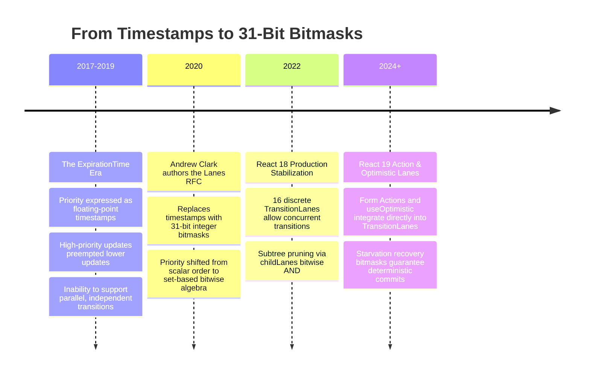
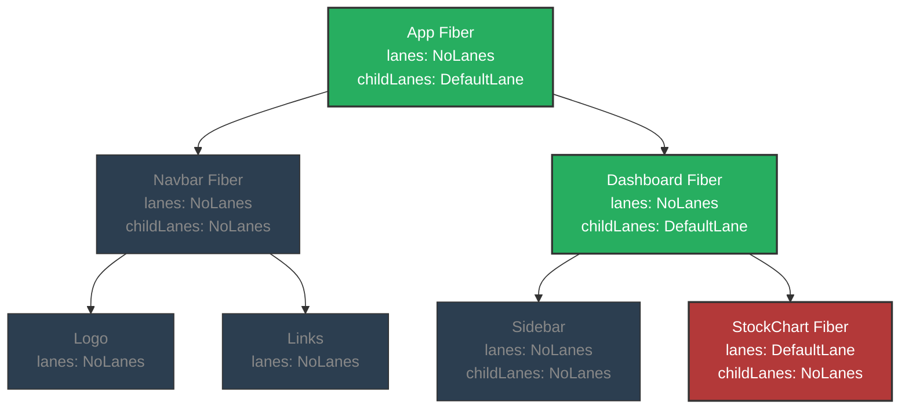
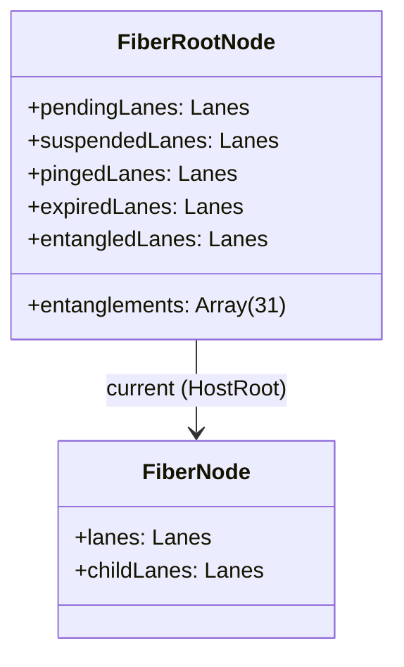
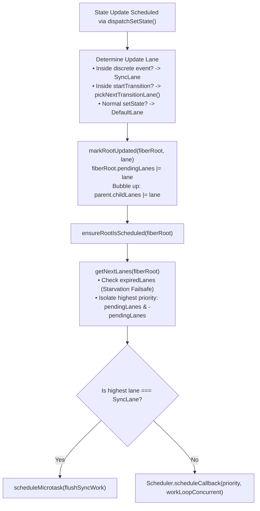

# Chapter 05: Lanes & Priority Mechanics (31-Bit Bitmasks & Entanglement)

> "A single number (expirationTime) can only express a linear order of importance. But in a complex UI, priority is multi-dimensional. You need to express not just 'when' something runs, but 'what group' it belongs to, whether it is batchable, and whether it must yield. Lanes represent this as a 31-bit bitmask."  
> — **Andrew Clark, React Core Architect**

---

## 1. Why This Topic Exists

In React 16 and 17, task prioritization was governed by a scalar number: **`expirationTime`**.  
Every state update was assigned a future timestamp (e.g. `expirationTime = 10,450ms`). Higher priority tasks were assigned earlier timestamps, and React processed them in numerical order.

While this scalar model was conceptually simple, it created a severe architectural dead-end when building **Concurrent React**:
1. **The Inability to Express Groups (Batches):** A single number can only tell you if Task A is more urgent than Task B ($A < B$). It cannot express: *"Task A and Task B have different origins, but they belong to the same logical Transition and must commit together."*
2. **The Inability to Decouple Priority from Order:** Sometimes React needs to pause an update, run a completely separate update, and then resume the first without discarding intermediate work. A linear timestamp model forced all intermediate work to either flush or be destroyed.
3. **The Suspense Boundary Bottleneck:** When a component suspends on data, React needs to mark its work as "suspended" without blocking other independent components on the page. Timestamps could not isolate subsets of work.

To solve this, React 18 completely replaced `expirationTime` with **Lanes**—a mathematical model based on **31-bit bitmasks**.

By representing work as individual bits in a 32-bit integer, React transformed priority management into **blazing-fast CPU bitwise operations** (`AND`, `OR`, `NOT`, `XOR`). With Lanes, React can:
- Check if a component has pending work with a single CPU instruction (`lanes & renderLanes`).
- Represent **16 concurrent transitions simultaneously** without cross-contamination.
- Entangle related updates into atomic units (`entangledLanes`).
- Execute priority queries in sub-nanosecond time with zero V8 heap memory allocation.

---

## 2. Learning Objectives

By mastering this chapter, you will be able to:
- Explain why scalar timestamps (`expirationTime`) failed and why 31-bit bitmasks (Lanes) were required.
- Deconstruct the V8 engine optimization behind 31-bit integers: **Smis (Small Integers)** and zero-allocation bitwise arithmetic.
- Master the fundamental bitwise algorithms used in React's core: **`lanes & -lanes` (isolating the lowest set bit / highest priority lane)**.
- Map out the complete 31-bit Lane hierarchy from `SyncLane` to `IdleLane`.
- Trace how `fiber.lanes` and `fiber.childLanes` enable instantaneous subtree bailout during reconciliation.
- Understand **Lane Entanglement** and how React guarantees consistency across shared boundaries.
- Confidently answer Senior, Lead, and Architect interview questions regarding React's priority mechanics.

---

## 3. Historical Evolution



---

## 4. First Principles & Intuitive Physical Analogies (Layer 1)

### Analogy 1: The Multi-Lane Superhighway
Imagine a massive modern highway leading into a metropolis:
- **The Single-Lane Road (`expirationTime`):**  
  Every vehicle must drive in a single file line. An ambulance (`ImmediatePriority`) can flash its sirens and pass a slow truck (`Transition`), but if the road is blocked by a bridge under construction (**Suspense**), every single car behind it is permanently trapped.
- **The 31-Lane Superhighway (React Lanes):**  
  The highway is divided into 31 specialized, parallel lanes:
  - **Lane 1 (The Siren Lane - `SyncLane`):** Strictly reserved for police and ambulances. Zero speed limit; never blocked.
  - **Lanes 2–3 (The Commuter Express - `InputContinuousLane`):** For fast-moving passenger vehicles (scrolling, dragging).
  - **Lanes 6–21 (The Logistics Corridor - `TransitionLanes`):** 16 separate lanes where freight trucks transport long-term cargo. Truck 8 can cruise without blocking Truck 9.
  - **Lane 31 (The Street Sweeper - `IdleLane`):** Runs only at 3 AM when all other lanes are completely empty.

---

### Analogy 2: The 31-Light Industrial Switchboard
Imagine a factory control room with a panel of **31 physical toggle switches**.
- Every switch represents a specific type of work.
- If Switch 1 is flipped UP, the factory knows a fire alarm is active (`SyncLane`).
- If Switches 6 through 10 are flipped UP, the factory is running five background assembly lines (`TransitionLanes`).
- How does the plant manager check if there is ANY work to do today?  
  He doesn't check 31 items one-by-one. He executes a single electric check:
  ```text
  panel !== 0
  ```
- How does he instantly find the SINGLE MOST URGENT switch currently flipped on?  
  He applies a magnetic pulse (`lanes & -lanes`) that instantly isolates the lowest flipped switch.

---

## 5. Internal Working & Engine Architecture (Layer 2)

### Why Exactly 31 Bits? The V8 Engine Smi Optimization

In Google's V8 JavaScript engine (and JavaScriptCore in WebKit), numbers are typically stored as 64-bit floating-point values (doubles) on the heap. Allocating objects on the heap incurs garbage collection overhead.

However, V8 implements a crucial low-level optimization known as **Smi (Small Integer)**:
- On 64-bit architectures, integers that fit within **31 bits (signed)** are **never allocated on the heap**.
- Instead, V8 stores the integer **directly inside the pointer value itself** by tagging the lowest bit with a `0`!

```text
V8 Smi Pointer Layout (64-bit):
[ 32 bits: Integer Value ] [ 31 bits: Padding ] [ 1 bit: 0 (Smi Tag) ]
```

> ⚡ **Architectural Genius:**  
> By restricting Lanes to **31 bits**, React guarantees that every Lane bitmask is a **V8 Smi**.  
> Bitwise operations on Lanes execute directly in CPU registers with **zero memory allocation, zero pointer chasing, and zero garbage collection pressure!**

---

### The 31-Bit Lane Topology

Below is the complete architectural layout of React's 31 Lanes (from `ReactFiberLane.js`):

```typescript
export const TotalLanes = 31;

// 1. Synchronous & Discrete User Input (Highest Priority)
export const NoLanes: Lanes               = 0b0000000000000000000000000000000;
export const SyncLane: Lane               = 0b0000000000000000000000000000001; // Discrete clicks, typing

// 2. Continuous User Input
export const InputContinuousLane: Lane   = 0b0000000000000000000000000000010; // Scrolling, mouse move

// 3. Default (Normal) Priority
export const DefaultLane: Lane           = 0b0000000000000000000000000100000; // Normal setState, fetch responses

// 4. Transition Lanes (16 Parallel Independent Lanes!)
const TransitionLane1: Lane              = 0b0000000000000000000000100000000;
// ... (TransitionLanes 2 through 15) ...
const TransitionLane16: Lane             = 0b0000000100000000000000000000000;
export const TransitionLanes: Lanes      = 0b0000000111111111111111100000000; // 16 bits reserved!

// 5. Retry Lanes (Suspense Retries)
const RetryLane1: Lane                   = 0b0000001000000000000000000000000;
export const RetryLanes: Lanes           = 0b0000111000000000000000000000000;

// 6. Idle & Offscreen Priority (Lowest Priority)
export const IdleLane: Lane              = 0b0100000000000000000000000000000;
export const OffscreenLane: Lane         = 0b1000000000000000000000000000000;
```

---

### The Beating Heart of the Scheduler: `lanes & -lanes`

How does React extract the **single highest-priority Lane** from a bitmask containing multiple pending updates in $O(1)$ time?

It utilizes a famous two's-complement binary arithmetic identity:
```typescript
export function getHighestPriorityLane(lanes: Lanes): Lane {
  return lanes & -lanes;
}
```

#### The Mathematical Proof:
Suppose a Fiber has updates queued for `DefaultLane` (bit 5) and `InputContinuousLane` (bit 1):
```text
lanes = 0b0000000000000000000000000100010  (Integer value: 34)
```

In two's-complement binary representation, `-lanes` is computed by inverting all bits (`NOT`) and adding 1:
```text
~lanes   = 0b1111111111111111111111111011101
+ 1      = 0b1111111111111111111111111011110  (-lanes)
```

Now, perform bitwise `AND` (`lanes & -lanes`):
```text
  lanes:   0b0000000000000000000000000100010
& -lanes:  0b1111111111111111111111111011110
-----------------------------------------------
  Result:  0b0000000000000000000000000000010  (InputContinuousLane!)
```

> 🎯 **The Result:**  
> In a **single CPU cycle**, `lanes & -lanes` obliterates all higher bits and isolates the **lowest set bit**, which mathematically corresponds to React's **highest priority lane**!

---

## 6. Runtime Flow & Execution Traces: Subtree Pruning via `childLanes`

How does React skip rendering thousands of unchanged components without walking their Fibers?  
By maintaining **`childLanes`** on every parent Fiber.



### The Traversal Decision in `beginWork`:
When React visits `Navbar Fiber`:
```typescript
function beginWork(current, workInProgress, renderLanes) {
  const updateLanes = workInProgress.lanes;

  // 1. Does this specific Fiber have work for this render pass?
  if (!includesSomeLane(renderLanes, updateLanes)) {
    // 2. No! Check if ANY of its descendants have work:
    if (!includesSomeLane(renderLanes, workInProgress.childLanes)) {
      // BAIL OUT COMPLETELY!
      // Skip Navbar, skip NavLogo, skip NavLinks!
      return bailoutOnAlreadyFinishedWork(current, workInProgress, renderLanes);
    }
  }
  // Descend deeper...
}
```

Because `Navbar.childLanes === NoLanes`, React bails out in **0.001 milliseconds**, pruning the entire navigation subtree from evaluation!

---

## 7. Memory Model & Heap Layout: Lane State Fields

On `FiberRootNode` and `FiberNode`, Lanes are tracked across several key fields:



### What Each Field Stores:
1. **`pendingLanes`:** All lanes that currently have scheduled work awaiting execution.
2. **`suspendedLanes`:** Lanes that attempted to render but hit an unresolved Promise (Suspense). React will not attempt to render these lanes until notified.
3. **`pingedLanes`:** Suspended lanes whose Promises have just resolved! React wakes them up to retry rendering.
4. **`expiredLanes`:** Lanes that were repeatedly preempted by higher priority work and exceeded their starvation threshold. These lanes **must execute synchronously immediately**.
5. **`entangledLanes`:** A bitmask of lanes that must be rendered together in the same batch.

---

## 8. Visual Diagrams (Mermaid Vector Topologies)

### The Lane Scheduling Decision Tree



---

## 9. Real World Usage & Production Patterns

> 🧪 **Companion Interactive Lab:** [LanesPriorityLab.tsx](../../apps/portal/src/features/visualizers/topic-05-lanes/LanesPriorityLab.tsx) | Live in Portal: `lab-15-lanes-priority`

### Pattern 1: De-prioritizing Massive State Updates via `startTransition`

```tsx
import React, { useState, useTransition } from 'react';

export function AnalyticsDashboard() {
  const [filterText, setFilterText] = useState('');
  const [dataPoints, setDataPoints] = useState<number[]>([]);
  const [isPending, startTransition] = useTransition();

  function handleFilterChange(e: React.ChangeEvent<HTMLInputElement>) {
    const text = e.target.value;

    // 1. URGENT LANE: SyncLane
    // Guarantees the input box updates in 1ms with 0 input lag!
    setFilterText(text);

    // 2. NON-URGENT LANE: TransitionLanes (e.g. TransitionLane1)
    // Sliced across 5ms frames. Yields to any future keystrokes!
    startTransition(() => {
      const filtered = compute100kDataPoints(text);
      setDataPoints(filtered);
    });
  }

  return (
    <div>
      <input value={filterText} onChange={handleFilterChange} placeholder="Filter 100k points..." />
      {isPending && <span className="spinner">Crunching data concurrently...</span>}
      <DataChart points={dataPoints} />
    </div>
  );
}
```

---

### Pattern 2: Emergency Synchronous Lane Escalation via `flushSync`

When a developer needs to read DOM geometry immediately after setting state (e.g. calculating tooltip position or scrolling a chat list to the bottom):

```tsx
import { flushSync } from 'react-dom';

function sendMessage(chatMessage: string) {
  // Escalate this specific state update to SyncLane
  // Forces React to flush rendering and commit to DOM SYNCHRONOUSLY!
  flushSync(() => {
    setMessages(prev => [...prev, chatMessage]);
  });

  // DOM is guaranteed to be updated right here!
  const chatContainer = document.getElementById('chat-scroll')!;
  chatContainer.scrollTop = chatContainer.scrollHeight;
}
```

---

## 10. Angular Comparison

For a Senior Angular Architect transitioning to React, understanding how React Lanes compares to Angular's Change Detection model reveals deep architectural philosophies:

| Architectural Dimension | React (Lanes Architecture) | Angular (Ivy & Signals) |
| :--- | :--- | :--- |
| **Priority Granularity** | **31-bit Bitmask Priority System**.<br/>Updates carry specific lane priorities (`SyncLane`, `TransitionLanes`, `DefaultLane`). | **Binary Dirty Model**.<br/>Components are either `CheckAlways` or `OnPush` (Dirty or Clean). All dirty components update in one pass. |
| **Interruption Capability** | Low-priority transition lanes can be interrupted, discarded, and restarted by higher-priority lanes mid-flight. | Synchronous change detection cannot be interrupted. Once `tick()` starts, it traverses until complete. |
| **Subtree Skipping** | Bitwise check: `!(renderLanes & childLanes)` instantly bails out of entire subtrees. | Angular skips subtrees if an `OnPush` component's inputs have not changed by reference and no internal events fired. |
| **Modern Direction** | React 18/19 embraces multi-lane concurrent scheduling. | Angular 17+ introduced **Signals** to bypass tree traversal entirely via direct node notification graphs. |

---

## 11. .NET Comparison

For an ASP.NET Core & WPF / CLR Architect, React's Lanes system shares direct lineage with C# enum flags and thread scheduling:

| Architectural Dimension | React (Lanes) | .NET (CLR & C#) |
| :--- | :--- | :--- |
| **Bitmask Algebra** | 31-bit bitwise integers (`lanes & -lanes`, `lanes \| lane`). | **`[Flags] enum` in C#**.<br/>e.g. `BindingFlags.Public \| BindingFlags.Instance` evaluated with `HasFlag()` or `&`. |
| **Data Types on Runtime** | V8 Smis (31-bit Small Integers) stored unboxed without heap allocations. | Value types (`struct`, `int`, `enum`) allocated on stack/registers without Gen 0 GC overhead. |
| **Priority Isolation** | 16 independent `TransitionLanes` allowing parallel non-conflicting background renders. | Multiple `TaskScheduler` queues or custom thread pool partitions in TPL. |
| **Subtree Traversal Optimization** | Aggregating child lane bits up the tree (`parent.childLanes \|= child.lanes`). | Visual Tree bubbling / tunneling routing strategies in WPF (`RoutedEventArgs.Handled`). |

---

## 12. Enterprise Perspective & Production Risks (Layer 4)

### Production Risk 1: Lane Starvation in High-Throughput Trading / Telemetry Apps
In financial trading apps receiving 500 WebSocket price updates per second:
- If price ticks arrive continuously as `DefaultLane` or `InputContinuousLane`:
- Low-priority analytical recalculations scheduled in `TransitionLanes` will **never find an idle frame**.
- The transition is constantly interrupted and reset to zero progress.
- **The Engine Failsafe (`markStarvedLanesAsExpired`):**  
  Every time React schedules a render, it checks timestamps. If a `TransitionLane` has been waiting for more than **5,000ms**, React marks it as **Expired**:
  ```typescript
  fiberRoot.expiredLanes |= starvedLane;
  ```
  Expired lanes immediately take absolute precedence over new incoming default updates, forcing React to flush them synchronously to eliminate starvation.

### Production Risk 2: Accidental "SyncLane Cascades"
If developers call `setState` inside `useLayoutEffect` setups:
- `useLayoutEffect` runs synchronously before paint.
- State updates dispatched inside `useLayoutEffect` are automatically assigned **`SyncLane`**!
- React is forced to immediately start a nested synchronous render pass before the browser can paint.
- Doing this repeatedly triggers React's internal watchdog:  
  `Maximum update depth exceeded. This can happen when a component repeatedly calls setState inside useLayoutEffect...`
- **Remediation:** State synchronization should occur in `useEffect` (passive) or ideally computed as pure derived state during rendering.

---

## 13. Performance Considerations

### The Zero-Allocation Miracle of Smis
In high-frequency rendering loops (e.g. 60 FPS animations or drag-and-drop interactions):
- Creating JavaScript objects (`{ priority: 'high', type: 'transition' }`) allocates 32–48 bytes in V8 New Space per update.
- Allocating 1,000 objects per second triggers frequent **Cheney Scavenge minor GC pauses** (1ms–3ms hitches).
- Because Lanes are **31-bit integers**, V8 stores them as Smis. **Zero heap memory is allocated**. Operations execute directly on CPU registers, maintaining a perfectly flat GC profile.

---

## 14. Tradeoffs

| Approach | Advantages | Disadvantages |
| :--- | :--- | :--- |
| **31-Bit Bitmask Lanes** | - Sub-nanosecond bitwise checks (`lanes & -lanes`).<br/>- Expresses sets of tasks, batching, and entanglements.<br/>- Zero V8 heap allocation (Smi optimization). | - Hard cap of 31 distinct lanes.<br/>- High cognitive complexity for engine maintenance. |
| **Scalar Timestamps (`expirationTime`)** | - Simple mental model ($A < B$).<br/>- Unlimited number of priority thresholds. | - Cannot express parallel batches or independent transitions.<br/>- Suspended tasks block unrelated updates. |

---

## 15. Common Mistakes & Interview Traps

### Trap 1: "Higher numeric value means higher priority in Lanes"
- ❌ **Candidate Assumption:** *"In binary, larger numbers represent higher values, so `0b1000` is higher priority than `0b0001`."*
- ✅ **Architect Reality:** *"In React Lanes, **smaller bit positions represent HIGHER priority!** E.g., Bit 0 (`0b00001`) is `SyncLane` (highest priority). Bit 30 (`0b1000...`) is `OffscreenLane` (lowest priority). `lanes & -lanes` isolates the rightmost set bit precisely to extract the highest priority work."*

### Trap 2: Believing Transitions Run on Web Workers
- ❌ **Candidate Assumption:** *"Because transitions are low priority and interruptible, React runs them in a background worker thread."*
- ✅ **Architect Reality:** *"All 31 Lanes execute strictly on the **single main thread**. React achieves concurrency not through multi-threading, but through **cooperative time-slicing and lane-based work filtering**."*

---

## 16. Interview Questions & Architectural Answers (Senior, Lead, Architect - Layer 5)

### Q1 (Senior Level): Why did React migrate from `expirationTime` to 31-bit Lanes? What architectural problem did it solve?
**Architectural Answer:**  
`expirationTime` modeled priority as a one-dimensional scalar timestamp. This made it impossible to represent **sets of related updates** or **independent parallel transitions**. If two low-priority transitions were scheduled, the timestamp model forced them into a strict linear sequence; if one suspended on network data, it blocked or aborted the other.  
Lanes solved this by modeling priority as a **31-bit bitmask**. 16 distinct bits are allocated to `TransitionLanes`. This allows React to run multiple concurrent transitions simultaneously, suspend one without affecting another, entangle related updates together, and check for pending subtree work using single-cycle CPU bitwise operators (`lanes & renderLanes`).

---

### Q2 (Lead Level): Explain how the mathematical identity `lanes & -lanes` works in binary arithmetic, and how React uses it.
**Architectural Answer:**  
In two's-complement binary arithmetic, the negation of an integer `-x` is calculated as `~x + 1` (invert all bits and add 1).  
When you perform bitwise `x & -x`:
- Inverting `x` flips all trailing zeros to ones and the lowest set bit to zero.
- Adding `1` causes a cascade of carries that turns all trailing ones back to zero, and flips the lowest set bit back to `1`.
- Performing `&` with the original `x` results in all higher bits being zeroed out, leaving **only the lowest set bit as `1`**.  
React uses `lanes & -lanes` in `getHighestPriorityLane()` to isolate the single highest-priority lane from a bitmask of pending work in a single CPU cycle, with zero iterations and zero memory allocations.

---

### Q3 (Architect Level): What is "Lane Entanglement" and why is it necessary? Provide a concrete scenario where un-entangled lanes would cause a production crash.
**Architectural Answer:**  
**Lane Entanglement** is a mechanism where React binds two or more distinct lanes together into a single indivisible bitmask, forcing them to render and commit in the exact same render pass.  
**The Crash Scenario:**  
Imagine a component that consumes two pieces of state:
1. `users`: Fetched via a low-priority Transition (`TransitionLane1`).
2. `selectedUserId`: Updated via a high-priority click (`SyncLane`).  
If the user clicks "Select User 5", and `selectedUserId` commits in `SyncLane` *before* the `users` transition finishes:
The UI attempts to render `users.find(u => u.id === selectedUserId)`.  
Because `users` has not yet committed, `user` is `undefined`, and accessing `user.profile.name` throws an unhandled **`TypeError: Cannot read property of undefined`** (a classic UI tearing crash!).  
React detects this shared dependency and **entangles** `TransitionLane1` with the synchronous lane (`fiberRoot.entangledLanes |= TransitionLane1`). It refuses to commit `selectedUserId` until both lanes can be resolved together safely.

---

## 17. Senior-Level Mental Model & "How to Remember This Forever" (Layer 3)

### The Memory Peg: The "31-Lane Superhighway & The Two's Complement Bit Hack"
1. **The 31-Lane Superhighway:**  
   Picture 31 parallel highway lanes. Lane 1 is the Siren Lane (`SyncLane`). Lanes 6–21 are the 16 Freight Transition Lanes. Cars in Lane 8 can drive alongside cars in Lane 9 without crashing.
2. **The Bit Hack (`lanes & -lanes`):**  
   Remember the phrase: *"Ampersand Minus"* (`& -`). It is a high-speed magnetic clamp that instantly grabs the lowest bit (highest priority) and crushes all other bits to dust in one CPU cycle.

---

## 18. Core Vocabulary & "Aha!" Breakthrough Insights (Refresher)

| Term | Precision Architectural Definition |
| :--- | :--- |
| **`Lanes`** | A 31-bit integer bitmask where each bit represents a discrete category of priority and batch identity. |
| **`SyncLane`** | Bit 0 (`0b0001`): The highest priority lane, reserved for discrete synchronous user inputs. |
| **`TransitionLanes`** | A 16-bit range (`0b0000000111111111111111100000000`) allocated for interruptible, concurrent transitions. |
| **`childLanes`** | A bitmask on every Fiber aggregating all pending work across its entire descendant subtree. |
| **`lanes & -lanes`** | The two's-complement bitwise operation isolating the rightmost set bit (highest priority lane). |
| **Lane Entanglement** | Coupling multiple lanes together into an atomic unit to prevent data tearing and state desynchronization. |

> 💡 **The "Aha!" Breakthrough Insight:**  
> Why are there 16 Transition Lanes instead of just 1?  
> Because if you have a search box (`Transition A`) and an interactive map (`Transition B`), giving them separate bits means typing in the search box **does not cancel or block the map rendering!** They run as parallel, non-conflicting concurrent transitions on the same thread.

---

## 19. Key Takeaways

1. **Lanes Replace ExpirationTime:** 31-bit bitmasks replaced scalar timestamps to enable multi-task batching, parallel transitions, and Suspense isolation.
2. **V8 Smi Optimization:** 31-bit integers are stored directly inside pointers without V8 heap allocation, executing at native CPU register speeds.
3. **The `lanes & -lanes` Identity:** React extracts the highest-priority lane in a single CPU instruction via two's-complement binary arithmetic.
4. **Subtree Pruning:** If `!(renderLanes & fiber.childLanes)`, React skips the entire subtree in 1 nanosecond.
5. **Lane Entanglement:** Prevents UI tearing by forcing dependent state updates across different priorities to commit atomically.

---

## 20. Revision Sheet

- **Bit Length:** 31 bits (Fits in V8 Smi).
- **Priority Direction:** **Lower bit index = Higher Priority** (Bit 0 `SyncLane` > Bit 30 `OffscreenLane`).
- **Core Bitwise Primitives:**
  - Check intersection: `(lanes & renderLanes) !== NoLanes`
  - Merge lanes: `lanes |= newLane`
  - Remove lane: `lanes &= ~finishedLane`
  - Isolate highest priority: `lanes & -lanes`
- **Transition Budget:** 16 independent concurrent lanes (`TransitionLanes`).
- **Starvation Recovery:** `markStarvedLanesAsExpired` escalates transitions to synchronous execution after 5,000ms.
