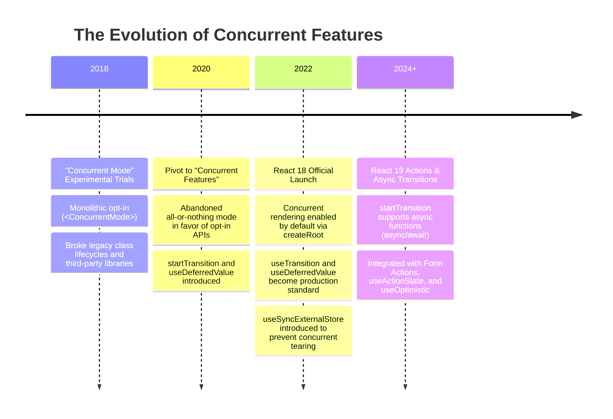
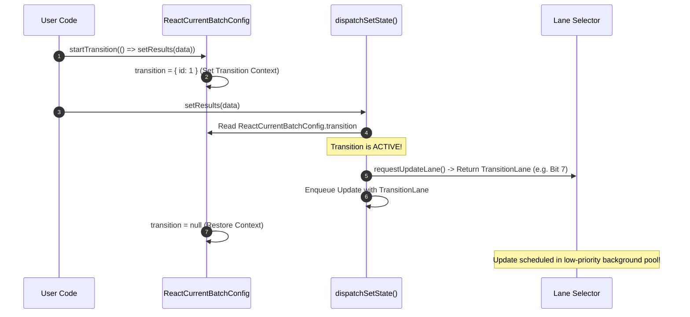
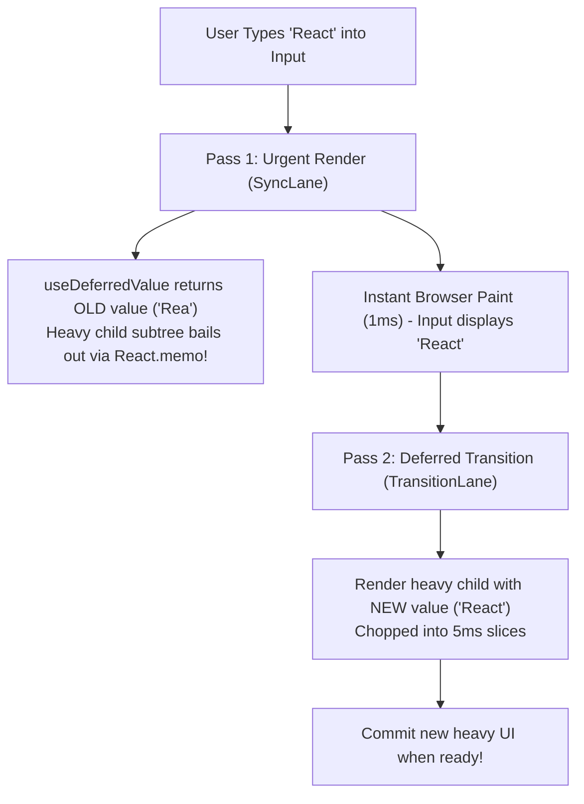
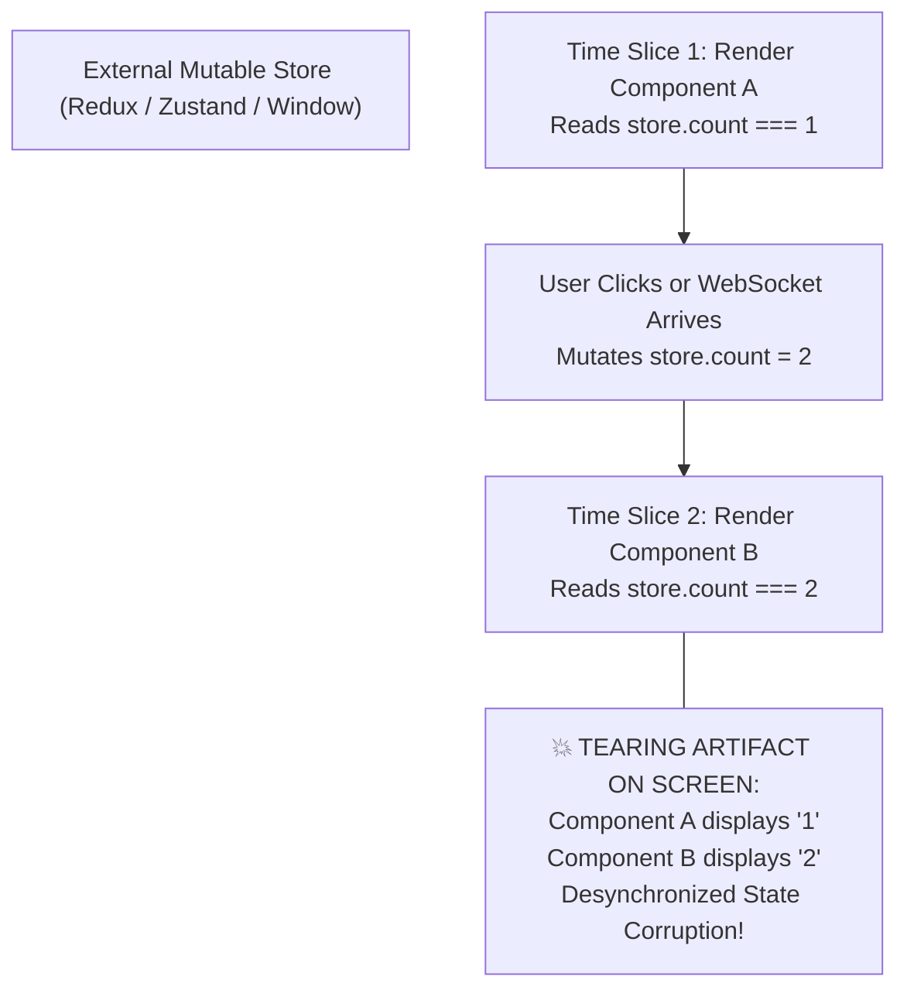

# Chapter 06: Concurrent Features (`startTransition`, `useDeferredValue` & Interruptible Renders)

> "Debouncing is a compromise we accepted because our UI frameworks were too rigid. A 300ms debounce adds 300ms of artificial lag even on a fast M3 Max CPU. Concurrent React renders as fast as the hardware allows, while yielding whenever the user interacts."  
> — **React Concurrent Design Philosophy**

---

## 1. Why This Topic Exists

In classical frontend engineering, developers constantly battled the **"Urgent vs. Heavy" dilemma**:
- **The Urgent Task:** When a user types into an input field, the cursor and characters must update within **16 milliseconds (60 FPS)**. Any delay > 50 ms is perceived as broken, sticky, or lagging.
- **The Heavy Task:** Filtering a list of 10,000 data rows, recalculating complex SVG charting points, or rendering an analytical pivot table often takes **60 to 100 milliseconds**.

Before React 18, all state updates were treated as **equally urgent**. If an input's `onChange` handler updated both the input text and the heavy chart:
```typescript
function handleChange(e) {
  setText(e.target.value);      // Urgent!
  setChartData(e.target.value);  // Heavy!
}
```
React processed both synchronously. The 100ms chart calculation locked the main thread, causing the input box to freeze and characters to drop.

### The Historical Patch: Debouncing & Throttling
For 15 years, the industry applied a band-aid: `lodash.debounce(fn, 300)` or RxJS `debounceTime(300)`.  
While debouncing prevented main thread thrashing, it introduced an **infuriating architectural flaw**:  
It introduced a **mandatory 300ms artificial penalty** on *every single interaction*, regardless of whether the user was on an ultra-fast desktop workstation or an entry-level smartphone. The UI felt artificially sluggish.

### The Concurrent Revolution
React 18 introduced **Concurrent Features** powered by Fiber's interruptible work loops and Priority Lanes.  
Instead of setting artificial timers, React allows developers to explicitly classify updates into:
1. **Urgent Updates:** Clicks, keypresses, touches, typing (execute in `SyncLane` or `InputContinuousLane`).
2. **Transition Updates:** Screen switches, massive list filtering, chart recalculations, tab transitions (execute in `TransitionLanes`).

Under Concurrent React, when a user types `"A"`, React immediately updates the input box, begins computing the chart in the background in 5ms slices, and **if the user types `"B"` mid-way, React instantly discards the unfinished chart for `"A"` and starts computing `"B"` without dropping a single frame!**

---

## 2. Learning Objectives

By mastering this chapter, you will be able to:
- Articulate the mechanical difference between classical Debouncing/Throttling and React Concurrent Transitions.
- Deconstruct the internal execution of **`startTransition`** and **`useTransition`**, tracing `ReactCurrentBatchConfig.transition`.
- Master **`useDeferredValue`** and understand how it forks values across render passes.
- Trace how React interrupts an active background transition render when an urgent click or keypress arrives.
- Understand the **Tearing Problem** in concurrent rendering and explain why **`useSyncExternalStore`** is required for external global state.
- Compare React's concurrent transitions with Angular's RxJS reactive operators and .NET's UI Thread Dispatcher priorities.
- Confidently answer Senior, Lead, and Architect interview questions regarding concurrent features and rendering lifecycles.

---

## 3. Historical Evolution



---

## 4. First Principles & Intuitive Physical Analogies (Layer 1)

### Analogy 1: The Executive Assistant & The Urgent Phone Call
Imagine a corporate Executive Assistant managing tasks for a CEO.
- **The Classical Approach (Synchronous React):**  
  The Assistant is typing a 100-page financial quarterly report (**Heavy Task**). The CEO's red telephone rings (**Urgent Call**). The Assistant ignores the ringing telephone and refuses to answer until all 100 pages of the report are printed and bound.
- **The Debounce Approach (`lodash.debounce`):**  
  The Assistant stares at the telephone for 5 minutes without touching any paperwork, waiting to see if anyone calls again before doing any work at all.
- **The Concurrent Approach (`startTransition`):**  
  The Assistant types the financial report in 5-minute chunks. When the telephone rings, the Assistant instantly puts down the pen, answers the phone, takes a message (updates `SyncLane`), hangs up, and immediately picks up the pen to continue the report. **Zero delay on the telephone, zero idle waste on the report.**

---

### Analogy 2: The Live TV Broadcast & The Background Recording Studio
- **The Urgent Update (`text`):**  
  The live news anchor speaking directly to millions of viewers on live TV. You cannot pause, delay, or stutter this broadcast.
- **The Deferred Value (`useDeferredValue`):**  
  The graphic design team in the back room generating 3D election map graphics.  
  While the graphics team is rendering the latest 3D map, the live broadcast continues showing the previous map. The moment the new 3D map is completely rendered and verified, the director switches the graphic on screen. Viewers never see a half-rendered or blank graphic.

---

## 5. Internal Working & Engine Architecture (Layer 2)

### How `startTransition` Works Under the Hood

When you wrap a state update inside `startTransition`, what physically happens inside the React engine?

```typescript
// Conceptual implementation from ReactStartTransition.js
import ReactSharedInternals from 'shared/ReactSharedInternals';

const { ReactCurrentBatchConfig } = ReactSharedInternals;

export function startTransition(scope: () => void, options?: BatchConfigTransition) {
  const prevTransition = ReactCurrentBatchConfig.transition;
  
  // 1. Assign a new Transition marker object
  ReactCurrentBatchConfig.transition = {};

  try {
    // 2. Execute the user's synchronous callback!
    scope();
  } finally {
    // 3. Restore previous transition context
    ReactCurrentBatchConfig.transition = prevTransition;
  }
}
```



### The Engine Flow:
1. `startTransition` sets a global flag on `ReactCurrentBatchConfig.transition`.
2. Any `setState` dispatched synchronously inside that callback reads `ReactCurrentBatchConfig.transition`.
3. Seeing this flag, the dispatcher **does NOT assign `SyncLane` or `DefaultLane`**; it assigns one of the **16 `TransitionLanes`** (`0b0000000111111111111111100000000`).
4. The update is enqueued into the Scheduler as **`NormalPriority`** with a cooperative 5ms deadline, completely yielding to urgent user inputs.

---

### How `useDeferredValue` Works Under the Hood

Many developers believe `useDeferredValue` is just a debounce with built-in timers. This is completely false.  
`useDeferredValue` works by **forking the component's value across two distinct render passes**:

```typescript
// Conceptual implementation from ReactFiberHooks.js
function updateDeferredValue<T>(value: T, initialValue?: T): T {
  const hook = updateWorkInProgressHook();
  const prevValue = hook.memoizedState;

  // Check if incoming value is referentially different
  if (Object.is(value, prevValue)) {
    return value;
  }

  // Value changed! Are we currently in an urgent render pass?
  const currentRenderLanes = getRenderLanes();
  
  if (isSubsetOfLanes(currentRenderLanes, TransitionLanes)) {
    // We are ALREADY in a low-priority transition render pass!
    // Commit the new value!
    hook.memoizedState = value;
    return value;
  } else {
    // We are in an URGENT render pass (SyncLane / DefaultLane)!
    // 1. Immediately schedule a background transition for the new value:
    scheduleDeferredValueUpdate(hook, value);
    // 2. Return the OLD value to keep the urgent render blazing fast!
    return prevValue;
  }
}
```



---

## 6. Runtime Flow & Execution Traces: The Concurrent Interrupt

What happens when an urgent user input interrupts an active transition?  
Let us trace a user typing `"R"`, followed by `"E"` 8 milliseconds later:

```mermaid
sequenceDiagram
    autonumber
    participant User as User Keyboard
    participant Main as JS Main Thread
    participant WIP as workInProgress Fiber Tree
    participant DOM as Browser DOM / Blink

    User->>Main: Press 'R'
    Main->>Main: setQuery('R') (Urgent: SyncLane)
    Main->>DOM: DOM Update: Input shows 'R' (Paint complete in 1ms)
    Main->>Main: startTransition(setResults) -> Assign TransitionLane1
    
    rect rgb(20, 35, 60)
    Note over Main,WIP: Background Transition Begins (Processing 10,000 items)
    Main->>WIP: Begin diffing items 0..2500 (Time: 5ms elapsed -> yield)
    end

    User->>Main: Press 'E' (At millisecond 8!)
    Note over Main: URGENT EVENT INTERRUPTS MAIN THREAD!
    Main->>Main: setQuery('RE') (SyncLane)
    
    rect rgb(60, 20, 20)
    Note over Main,WIP: THE CONCURRENT INTERRUPT:
    Main->>WIP: ABANDON WIP TREE FOR 'R'!
    Note over WIP: Discards half-diffed workInProgress tree with zero DOM side-effects!
    end

    Main->>DOM: DOM Update: Input shows 'RE' (Instant paint!)
    Main->>Main: startTransition(setResults) -> Assign TransitionLane2 (for 'RE')
    
    rect rgb(20, 35, 60)
    Note over Main,WIP: Fresh Transition Begins for 'RE'
    Main->>WIP: Diff items 0..10,000 for 'RE' in 5ms slices
    Main->>DOM: Commit final filtered results for 'RE'!
    end
```



---

## 7. Memory Model & Heap Layout: The Tearing Problem & `useSyncExternalStore`

### What is UI Tearing?
**Tearing** is a visual artifact where two components on the screen read from the same shared mutable state store during a concurrent render pass, but display **inconsistent, conflicting values** because the store was mutated mid-render:



### The Architectural Solution: `useSyncExternalStore`
To prevent tearing when reading external stores (Redux, Zustand, MobX, browser `navigator.onLine`):
```typescript
const state = useSyncExternalStore(
  subscribe,    // Function to register a callback when store changes
  getSnapshot,   // Function returning current immutable snapshot of store
  getServerSnapshot // Optional SSR snapshot
);
```

#### How React Guarantees Tear-Free Reads:
1. When React yields to the browser, if an external mutation occurs, React invokes `getSnapshot()`.
2. If `getSnapshot()` returns a value referentially different from what was read at the start of the render pass:
3. **React detects the tear!** It immediately abandons the concurrent render pass and restarts it **synchronously in `SyncLane`**, guaranteeing consistent, tear-free reads across the entire screen.

---

## 8. Visual Diagrams (Mermaid Vector Topologies)

### Comparison: Debouncing vs. Concurrent `useDeferredValue`

```mermaid
gantt
    title Debounce (Fixed 300ms Penalty) vs Concurrent (Zero Artificial Lag)
    dateFormat X
    axisFormat %s ms

    section User Typing
    Keypress 'A'              :crit, k1, 0, 10
    Keypress 'B'              :crit, k2, 80, 90

    section Debounced UI (300ms)
    Artificial Timer Waiting  :active, d1, 90, 390
    Render Results for 'AB'   :done, d2, 390, 450

    section Concurrent UI (React 18)
    Render 'A' in background  :a1, 10, 80
    Interrupt on 'B'!         :crit, a2, 80, 90
    Render 'AB' immediately   :done, a3, 90, 150
```



> 🌟 **The Quantitative Difference:**  
> - **Debounced UI:** User waits **450 milliseconds** to see results.  
> - **Concurrent UI:** User sees results in **150 milliseconds** (a **3x speedup** on fast devices), while maintaining identical zero-input-lag guarantees!

---

## 9. Real World Usage & Production Patterns

> 🧪 **Companion Interactive Lab:** [ConcurrentFeaturesLab.tsx](../../apps/portal/src/features/visualizers/topic-06-concurrent/ConcurrentFeaturesLab.tsx) | Live in Portal: `lab-16-concurrent-features`

### Pattern 1: High-Performance Tab Switching with `useTransition`

When switching tabs in an enterprise application, loading a heavy tab synchronously causes the UI to freeze on the old tab before suddenly jumping. With `useTransition`, the old tab remains responsive while the new tab renders off-screen:

```tsx
import { useState, useTransition } from 'react';

export function EnterprisePortal() {
  const [activeTab, setActiveTab] = useState<'summary' | 'ledger' | 'analytics'>('summary');
  const [isPending, startTransition] = useTransition();

  function selectTab(tab: 'summary' | 'ledger' | 'analytics') {
    startTransition(() => {
      // Switches tab concurrently in the background!
      setActiveTab(tab);
    });
  }

  return (
    <div>
      <nav className="tab-bar">
        <button onClick={() => selectTab('summary')} className={activeTab === 'summary' ? 'active' : ''}>
          Summary
        </button>
        <button onClick={() => selectTab('ledger')} className={activeTab === 'ledger' ? 'active' : ''}>
          General Ledger {isPending && activeTab !== 'ledger' && '⏳'}
        </button>
        <button onClick={() => selectTab('analytics')} className={activeTab === 'analytics' ? 'active' : ''}>
          Real-time Analytics
        </button>
      </nav>

      <main style={{ opacity: isPending ? 0.7 : 1, transition: 'opacity 0.2s' }}>
        {activeTab === 'summary' && <SummaryView />}
        {activeTab === 'ledger' && <HeavyLedgerView />}
        {activeTab === 'analytics' && <RealtimeAnalyticsChart />}
      </main>
    </div>
  );
}
```

---

### Pattern 2: Search Autocomplete with `useDeferredValue` and `React.memo`

```tsx
import React, { useState, useDeferredValue, memo } from 'react';

export function SearchPortal() {
  const [searchQuery, setSearchQuery] = useState('');
  
  // Fork the query: searchQuery is urgent, deferredQuery is non-urgent
  const deferredQuery = useDeferredValue(searchQuery);

  return (
    <div>
      {/* Input is bound to urgent state: Typing is 100% fluid! */}
      <input 
        value={searchQuery} 
        onChange={(e) => setSearchQuery(e.target.value)} 
        placeholder="Type to filter 50,000 customers..." 
      />

      {/* 
        CRITICAL ARCHITECT REQUIREMENT: 
        The child component MUST be wrapped in React.memo!
        If it is not memoized, it will re-render during the urgent pass anyway,
        completely defeating the purpose of useDeferredValue!
      */}
      <FilteredCustomerList query={deferredQuery} />
    </div>
  );
}

// Memoized child list
const FilteredCustomerList = memo(function FilteredCustomerList({ query }: { query: string }) {
  const filtered = useMemo(() => filterMassiveDataset(query), [query]);

  return (
    <ul>
      {filtered.map(customer => (
        <li key={customer.id}>{customer.name} - {customer.company}</li>
      ))}
    </ul>
  );
});
```

---

## 10. Angular Comparison

For a Senior Angular Architect transitioning to React, understanding concurrent rendering vs. Angular's reactive stream architecture is illuminating:

| Architectural Dimension | React (Concurrent Features) | Angular (RxJS & Signals) |
| :--- | :--- | :--- |
| **Input Prioritization** | **Built into Runtime Engine**.<br/>`startTransition` and `useDeferredValue` prioritize updates via 31-bit Lanes. | **Handled via RxJS Stream Operators**.<br/>Developers compose pipelines: `valueChanges.pipe(debounceTime(300), distinctUntilChanged(), switchMap(...))`. |
| **Interruption Mechanism** | React's Fiber reconciler automatically discards unfinished background trees when new input arrives. | RxJS `switchMap` unsubscribes from the previous HTTP Observable, cancelling in-flight network requests. |
| **Time-Slicing** | Engine chops rendering into 5ms slices via `MessageChannel`. | Angular Change Detection runs synchronously per tick; relies on Web Workers or `requestAnimationFrame` manually. |
| **Tearing Prevention** | `useSyncExternalStore` forces synchronous fallback if external store mutates mid-render. | Zone.js runs change detection synchronously after microtask queue drains; tearing cannot occur because rendering is never paused. |

---

## 11. .NET Comparison

For an ASP.NET Core & WPF / CLR Architect, React's concurrent features directly reflect .NET threading priorities and cooperative cancellation:

| Architectural Dimension | React (Concurrent Features) | .NET (WPF / TPL Architecture) |
| :--- | :--- | :--- |
| **Priority Classification** | `startTransition` downgrades work to `TransitionLanes`. | `Dispatcher.BeginInvoke(DispatcherPriority.Background, ...)` or `DispatcherPriority.ApplicationIdle`. |
| **Interrupted Work Discard** | React drops references to un-rendered WIP Fibers; V8 GC collects them. | `CancellationTokenSource.Cancel()` throws `OperationCanceledException` to abort background `Task`. |
| **Forked Values** | `useDeferredValue` returns old value during urgent pass, new value during transition pass. | WPF `Binding.IsAsync = true` or maintaining a local `ViewModel` property backing store. |
| **Tearing Protection** | `useSyncExternalStore` detects snapshot divergence. | Thread synchronization via `lock`, `ReaderWriterLockSlim`, or immutable collections (`ImmutableList<T>`). |

---

## 12. Enterprise Perspective & Production Risks (Layer 4)

### Production Risk 1: The "Controlled Input Lockup" Anti-Pattern
A catastrophic mistake commonly seen in production enterprise codebases:
```tsx
// ❌ DISASTROUS ANTI-PATTERN: Wrapping Input State in startTransition
function BadSearchInput() {
  const [text, setText] = useState('');

  function handleChange(e) {
    startTransition(() => {
      // DANGER: Controlled input value is downgraded to TransitionLane!
      setText(e.target.value);
    });
  }

  return <input value={text} onChange={handleChange} />;
}
```
- **The Production Disaster:**  
  Because `setText` is now low-priority:
  - If the user types fast, React **delays updating `text`** to let other work run.
  - The `<input>` DOM node and React's `text` state fall out of sync.
  - The user's cursor **jumps to the end of the input field** on every keystroke, and typed characters appear in reverse or dropped order!
- **The Golden Rule:** **NEVER wrap the state variable bound directly to an `<input value={...}>` in `startTransition`!** Keep the input state urgent, and defer the downstream filtering via `useDeferredValue`.

---

## 13. Performance Considerations

### Why `useDeferredValue` Requires `React.memo`
When you use `const deferredQuery = useDeferredValue(query)`:
1. In Pass 1 (Urgent), `SearchPortal` re-renders because `query` changed.
2. If `<FilteredCustomerList>` is **NOT wrapped in `React.memo`**:
   - React will invoke `FilteredCustomerList()` immediately during Pass 1, passing it the *old* `deferredQuery`.
   - The heavy component re-calculates anyway! The urgent pass takes 100ms, completely destroying the performance optimization!
3. If `<FilteredCustomerList>` **IS wrapped in `React.memo`**:
   - In Pass 1, React compares props: `oldProps.query === newProps.query` (`'old'` === `'old'`).
   - React **bails out instantly (0.01ms)**, flushes the urgent input to the screen, and schedules Pass 2 for the transition.

---

## 14. Tradeoffs

| Mechanism | Advantages | Disadvantages |
| :--- | :--- | :--- |
| **Concurrent Transitions (`startTransition`)** | - Zero artificial lag (renders at maximum hardware speed).<br/>- Automatically interruptible by urgent user input.<br/>- Keeps UI interactive during heavy background loads. | - Slightly higher CPU usage due to abandoned intermediate renders.<br/>- Components render multiple times across passes. |
| **Classical Debounce (`lodash.debounce`)** | - Simple mental model.<br/>- Guarantees minimum delay between heavy function calls. | - Adds fixed artificial latency (e.g. 300ms) on all devices.<br/>- UI freezes once the debounce timer expires. |
| **Web Worker Offloading** | - 100% moves computation off the main thread. | - Data must be serialized across `postMessage`.<br/>- Cannot render React components or touch the DOM. |

---

## 15. Common Mistakes & Interview Traps

### Trap 1: "useTransition is for asynchronous data fetching only"
- ❌ **Candidate Assumption:** *"useTransition is used to fetch data from APIs and show a loading spinner."*
- ✅ **Architect Reality:** *"While React 19 expanded transitions to support async functions, `useTransition` was fundamentally designed for **CPU-bound rendering transitions** (slicing Virtual DOM reconciliation across frames). Its primary purpose is UI thread scheduling, not network fetching."*

### Trap 2: Believing `useDeferredValue` Delays State Updates by Time
- ❌ **Candidate Assumption:** *"useDeferredValue delays the update by 200 milliseconds."*
- ✅ **Architect Reality:** *"There are **no timers** inside `useDeferredValue`. If the user's computer has an idle CPU, the deferred pass runs immediately (0ms delay). If the computer is under heavy load, it waits until the main thread is free. It is dynamic and hardware-adaptive."*

---

## 16. Interview Questions & Architectural Answers (Senior, Lead, Architect - Layer 5)

### Q1 (Senior Level): Explain the mechanical difference between Debouncing an input and using `useDeferredValue`.
**Architectural Answer:**  
Debouncing is **time-based**; `useDeferredValue` is **resource-based (cooperative)**.  
A 300ms debounce introduces a mandatory 300ms artificial waiting period on every keystroke, even if the device's CPU is completely idle and could render the result in 2ms. Furthermore, once the 300ms timer expires, debounced rendering runs **synchronously**, locking the main thread and freezing the UI if the user decides to resume typing.  
In contrast, `useDeferredValue` does not wait on arbitrary timers. It executes an urgent render immediately (updating the input), and schedules the deferred update in `TransitionLanes`. If the CPU is fast, the deferred UI updates within 5ms. If the user types another character while the deferred UI is rendering, React **instantly aborts the background render** to process the new keystroke. It provides the responsiveness of debouncing with zero artificial latency.

---

### Q2 (Lead Level): What is "UI Tearing" in concurrent rendering, and how does `useSyncExternalStore` solve it?
**Architectural Answer:**  
In concurrent rendering, React slices the reconciliation of a component tree across multiple 5ms frames, yielding to the browser event loop between slices.  
If an external mutable state store (like Redux or Zustand) is updated by an event (e.g. a WebSocket message) during a yield:
- Components rendered *before* the yield read the old state value.
- Components rendered *after* the yield read the new state value.  
This results in **Tearing**: the committed UI simultaneously displays contradictory data from two different points in time.  
`useSyncExternalStore` prevents tearing by enforcing a strict contract:
1. It registers a subscription callback and queries `getSnapshot()`.
2. If `getSnapshot()` returns a new reference while a concurrent render is in-flight, React detects that the store mutated during rendering.
3. React **immediately de-opts from concurrent mode** and re-runs the entire render pass **synchronously in `SyncLane`**, guaranteeing that all components read from a single, atomic snapshot of the store.

---

### Q3 (Architect Level): Why does wrapping an input's state in `startTransition` cause cursor jumping? How do you architect a high-throughput search box to prevent it?
**Architectural Answer:**  
**The Cursor Jump Mechanism:**  
A controlled `<input value={text} onChange={e => setText(e.target.value)} />` relies on **synchronous round-trip reconciliation**.  
When the user types a character:
1. The native DOM input immediately displays the new character at the OS level.
2. The `onChange` event fires.
3. If `setText` is wrapped in `startTransition`, React delays updating `text` in favor of urgent work.
4. When React eventually re-renders the input with the delayed `text`, it detects that the physical DOM input's `value` does not match React's delayed `value`.
5. React overwrites `input.value` with its older state, causing the browser to **reset the cursor selection range to the very end of the string**, breaking mid-word typing and dropping fast keystrokes.

**The Architectural Solution:**  
Decouple input state from filtered state:
- Keep the input value bound to **urgent local state**: `const [query, setQuery] = useState('')` (updates in `SyncLane`).
- Pass that urgent state into `useDeferredValue`: `const deferredQuery = useDeferredValue(query)`.
- Pass `deferredQuery` into a memoized list component (`React.memo`).  
The input updates synchronously with zero cursor issues, while the heavy list reconciles concurrently in background transition slices.

---

## 17. Senior-Level Mental Model & "How to Remember This Forever" (Layer 3)

### The Memory Peg: The "Emergency Room Triage Rule & The Live/Studio Dual Cameras"
1. **The Emergency Room Triage (`startTransition`):**  
   Think of React as an ER doctor. A heart attack patient comes in (**`SyncLane` - Typing/Clicking**); the doctor drops all paperwork immediately to treat them. A patient with a sprained ankle comes in (**`TransitionLane` - Filtering 10k items**); the doctor treats them in the waiting room whenever there are no heart attacks.
2. **The Live/Studio Cameras (`useDeferredValue`):**  
   Camera 1 is broadcasting live news (**Urgent Input**). Camera 2 is rendering special effects in the studio (**Deferred Child**). Camera 1 never goes black. Camera 2 is displayed on air only when the special effects finish rendering.

---

## 18. Core Vocabulary & "Aha!" Breakthrough Insights (Refresher)

| Term | Precision Architectural Definition |
| :--- | :--- |
| **`startTransition`** | A function that marks all state updates executed synchronously within its scope as non-urgent `TransitionLanes`. |
| **`useTransition`** | A Hook returning `[isPending, startTransition]` providing both transition scheduling and a pending state boolean. |
| **`useDeferredValue`** | A Hook that accepts a value and returns a forked version that lags behind during urgent renders and catches up in transitions. |
| **Tearing** | Visual inconsistency where UI elements on the same screen display conflicting state versions due to external mutations mid-render. |
| **`useSyncExternalStore`** | The React 18+ primitive required to safely read from external state stores without concurrent tearing. |

> 💡 **The "Aha!" Breakthrough Insight:**  
> `useDeferredValue` does not delay your state; **it delays the child tree!**  
> If you don't wrap the child in `React.memo()`, you haven't delayed anything—you just made your component run twice!

---

## 19. Key Takeaways

1. **Urgent vs Non-Urgent:** Typing and clicks require sub-16ms latency; filtering and rendering can be safely deferred.
2. **Beyond Debouncing:** Concurrent transitions eliminate arbitrary timers, updating as fast as the CPU allows while remaining 100% interruptible.
3. **The Concurrent Interrupt:** When urgent input arrives mid-transition, React abandons the unfinished `workInProgress` tree with zero DOM side-effects.
4. **Input Separation:** Never wrap `<input value={...}>` state in `startTransition`; use `useDeferredValue` on the downstream consumer instead.
5. **Tearing Prevention:** External stores must use `useSyncExternalStore` to detect mid-render mutations and force synchronous recovery.

---

## 20. Revision Sheet

- **Core Primitives:**
  - `startTransition(scope)`: Wraps state updates in non-urgent `TransitionLanes`.
  - `const [isPending, startTransition] = useTransition()`: Provides UI pending indicator.
  - `const deferredValue = useDeferredValue(urgentValue)`: Forks value across render passes.
- **Mandatory Pairing:** `useDeferredValue` MUST be paired with `React.memo()` on the child component to achieve bailout!
- **Starvation Failsafe:** Transitions waiting > 5,000 ms are auto-escalated to synchronous execution.
- **External Stores:** Always use `useSyncExternalStore` for Redux, Zustand, or browser APIs to prevent tearing.
