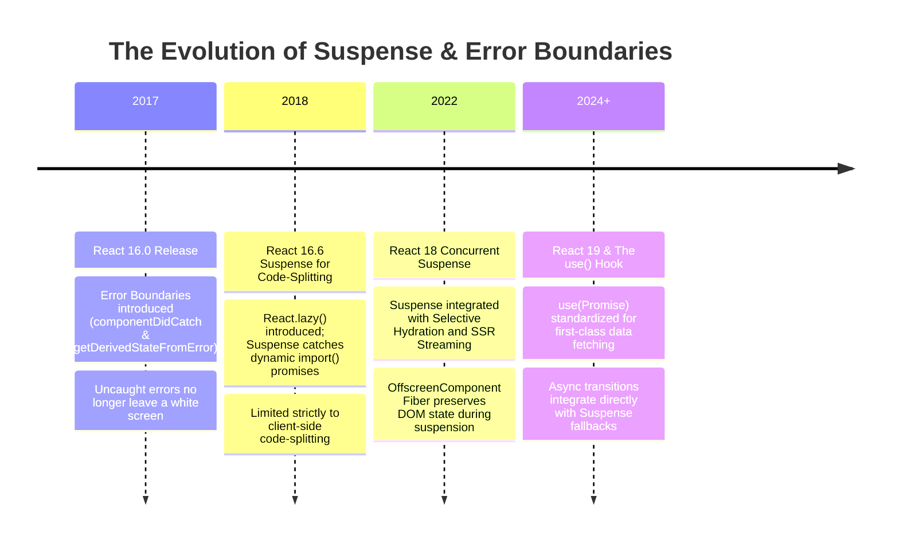
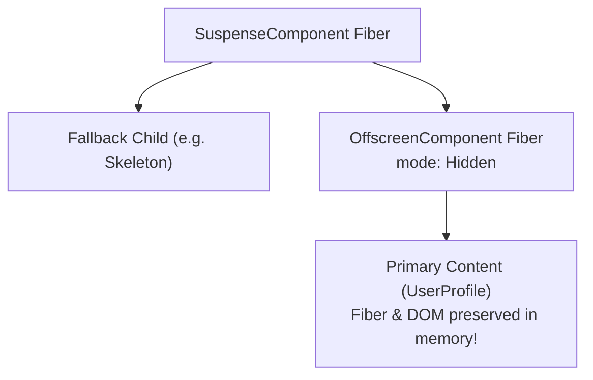
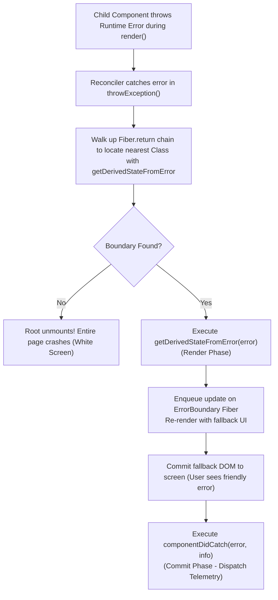
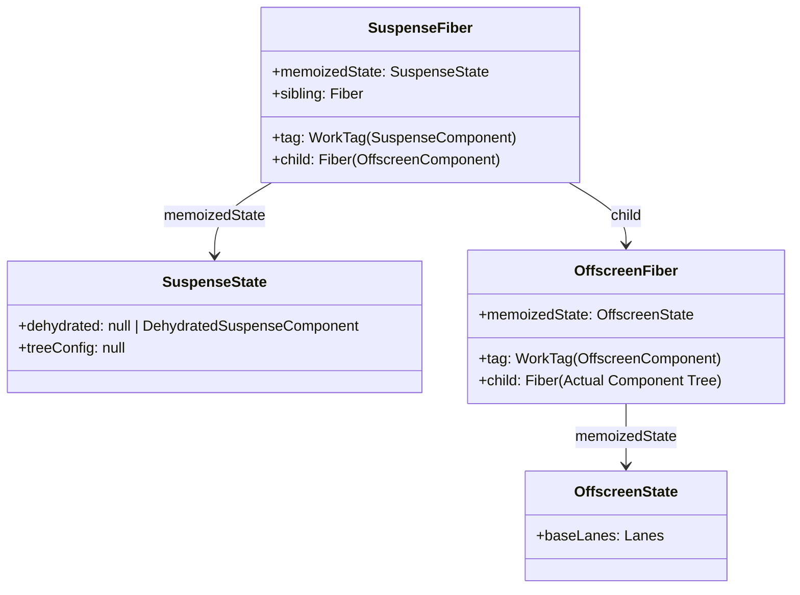
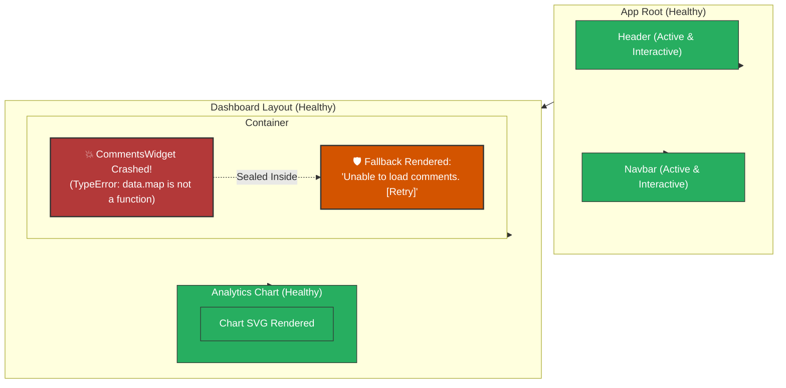

```mermaid
sequenceDiagram
    autonumber
    participant Engine as React Reconciler (workLoop)
    participant Comp as UserProfile Component
    participant Suspense as Suspense Fiber
    participant Prom as Network Promise

    Engine->>Comp: beginWork(UserProfile)
    Comp->>Comp: Call readData(promise)
    Note over Comp: Data is pending!
    Comp-->>Engine: THROW promise! (JavaScript Exception)
    
    rect rgb(20, 35, 60)
    Note over Engine: Reconciler unwinds call stack:
    Engine->>Suspense: Catch thrown value in finishQueueingConcurrentWork()
    Note over Suspense: Inspects value: Is it a Promise (.then is function)? YES!
    end

    Suspense->>Prom: Attach ping listener: promise.then(pingListener)
    Suspense->>Suspense: Mark Fiber with flags |= DidCapture
    Suspense->>Engine: Re-render branch with fallback={<Skeleton />}!
    Note over Engine: DOM displays Skeleton to user!

    rect rgb(40, 60, 20)
    Note over Prom: Network Data Arrives!
    Prom->>Suspense: pingListener() fires!
    Suspense->>Engine: scheduleUpdateOnFiber(RetryLane)
    Engine->>Comp: beginWork(UserProfile) (Retry Pass)
    Comp->>Comp: readData(promise) -> Status is 'fulfilled'! Returns data!
    Engine->>Engine: DOM commits UserProfile UI!
    end
```

# Chapter 07: Suspense Architecture & Error Boundaries (Promise Throwing & Blast Radius Containment)

> "Control flow in traditional programming uses exceptions to halt execution and climb up the call stack. Suspense uses JavaScript's exception mechanism not to crash, but to pause: a component throws a Promise, the nearest Suspense boundary catches it, and when the Promise settles, React pings the tree to resume."  
> — **React Core Architectural Model**

---

## 1. Why This Topic Exists

In early React applications, two systemic engineering challenges degraded user experience and code quality:
1. **The Boilerplate of Asynchronous State:**  
   Every component that fetched data had to manage three orthogonal states:
   ```typescript
   const [data, setData] = useState(null);
   const [isLoading, setIsLoading] = useState(true);
   const [error, setError] = useState(null);
   ```
   Render functions were bloated with defensive checks:
   ```tsx
   if (isLoading) return <Spinner />;
   if (error) return <ErrorMessage error={error} />;
   return <UserProfile data={data} />;
   ```
   When five nested components fetched their own data, this produced fragmented, jarring UI "spinners inside spinners" (loading cascades).
2. **The "White Screen of Death" (Unhandled Exceptions):**  
   In native JavaScript, if a single deeply nested child component threw a runtime exception (e.g. `Cannot read property 'name' of undefined` while formatting a date):
   - The error escaped to the browser window.
   - React 15 unmounted the **entire application tree**.
   - The user was left staring at a completely blank white screen, unable to save their work or navigate away.

To resolve these architectural flaws, React introduced two declarative boundary primitives built directly into the Fiber reconciliation engine:
- **Error Boundaries:** Contain the "blast radius" of JavaScript runtime errors, gracefully replacing only the crashed widget with a fallback UI while keeping the rest of the application fully functional.
- **Suspense:** Inverts async data fetching control flow. Instead of components manually checking if data is ready, a component attempts to read data; if the data is not yet cached, it **throws a Promise**. The nearest `<Suspense>` boundary catches the Promise, displays a fallback skeleton, attaches a listener, and automatically resumes rendering the moment the data arrives.

---

## 2. Learning Objectives

By mastering this chapter, you will be able to:
- Deconstruct the exact mechanism of **"Throwing a Promise"** and trace how the Fiber reconciler catches it.
- Explain the role of **`ping` listeners** and how they schedule retries using **`RetryLanes`**.
- Understand the hidden **`OffscreenComponent` Fiber** that preserves suspended DOM nodes off-screen without destroying their state.
- Dissect the execution lifecycle of Error Boundaries (`getDerivedStateFromError` vs `componentDidCatch`).
- Clarify why Error Boundaries **CANNOT** catch errors inside event handlers, `setTimeout`, or asynchronous callbacks.
- Compare React's boundary architecture with Angular's `ErrorHandler` and .NET's `try-catch` middleware.
- Confidently answer Senior, Lead, and Architect interview questions regarding Suspense internals and error containment.

---

## 3. Historical Evolution



---

## 4. First Principles & Intuitive Physical Analogies (Layer 1)

### Analogy 1: The Trapdoor & The Safety Net (Suspense)
Imagine an acrobat performing a routine on a high platform in a circus.
- **The Classical Approach (Manual `isLoading`):**  
  The acrobat must constantly look down at his feet, check if the floorboards are nailed down, pause his routine, and personally hold up a sign saying *"Please wait, carpenters are still building the floor."*
- **The Suspense Approach (The Trapdoor):**  
  The acrobat performs his routine boldly, assuming the floor exists.  
  If he steps onto a missing floorboard (**uncached data**), he falls through a **spring-loaded trapdoor**!  
  Directly beneath the stage is a **Safety Net** (`<Suspense fallback={<Skeleton />}>`).  
  The safety net catches him gently. The circus ringmaster immediately shows a puppet show to the audience (**the Fallback UI**).  
  Meanwhile, carpenters rush in and lay down the missing floorboards. The moment the floor is solid (**Promise fulfills**), the safety net bounces the acrobat right back onto the main stage to continue his routine seamlessly.

---

### Analogy 2: The Submarine Bulkhead Doors (Error Boundaries)
Imagine a modern military submarine navigating deep ocean waters.
- **Without Error Boundaries:**  
  The submarine is one giant open cavern. If a torpedo hits the torpedo bay in the bow and creates a leak, water rushes unimpeded through the entire vessel. The entire submarine sinks to the ocean floor (**White Screen of Death**).
- **With Error Boundaries:**  
  The submarine is compartmentalized with **watertight steel bulkhead doors** (`<ErrorBoundary>`).  
  When a leak occurs in Room 4 (a runtime bug in the Comments Widget), the emergency sensors trigger:
  - The heavy steel doors slam shut around Room 4 (**Error Caught**).
  - Room 4 is sealed off and safely isolated (**Fallback Rendered**).
  - The remaining 95% of the submarine (the navigation system, engines, and life support) continues operating completely unharmed.

---

## 5. Internal Working & Engine Architecture (Layer 2)

### How "Throwing a Promise" Works Under the Hood

In JavaScript, any value can be thrown: `throw new Error()`, `throw "string"`, or `throw new Promise(...)`.  
When a component suspended on data executes, it throws an unresolved Promise:

```typescript
// Conceptual pattern used by React.lazy, React 19 use(), or TanStack Query
function readData(promise) {
  if (promise.status === 'fulfilled') {
    return promise.value; // Data is ready! Return synchronously!
  } else if (promise.status === 'rejected') {
    throw promise.reason; // Caught by Error Boundary!
  } else if (promise.status === 'pending') {
    throw promise;        // CAUGHT BY SUSPENSE BOUNDARY!
  } else {
    promise.status = 'pending';
    promise.then(
      result => {
        promise.status = 'fulfilled';
        promise.value = result;
      },
      error => {
        promise.status = 'rejected';
        promise.reason = error;
      }
    );
    throw promise; // CAUGHT BY SUSPENSE BOUNDARY!
  }
}
```



---

### The Hidden Architecture: The `OffscreenComponent` Fiber

When a component suspends, what happens to its Fiber nodes? Does React destroy them?  
**NO!** React 18 introduced the **`OffscreenComponent` Fiber**:



#### Why the Offscreen Fiber is an Engineering Masterpiece:
1. **Preserves Internal State:** If a component suspends *after* the user has typed text or triggered local state, React does not destroy the Fiber. It hides the DOM node using CSS:
   ```css
   display: none !important;
   ```
2. **Pre-Rendering & Layout:** The suspended tree can continue reconciling off-screen in background transition slices. When the Promise resolves, React simply removes `display: none`. The component appears **instantly with zero mounting lag!**

---

## 6. Runtime Flow & Execution Traces: Error Boundary Traversal

Error Boundaries are implemented using Class Components because they rely on two specific lifecycle hooks that execute across different phases of the React engine:

```typescript
export class GlobalErrorBoundary extends React.Component<Props, State> {
  state: State = { hasError: false, error: null };

  // Phase 1: RENDER PHASE (Static, Pure)
  // Invoked immediately when a descendant throws an error.
  // Must return updated state to trigger fallback rendering.
  static getDerivedStateFromError(error: Error): State {
    return { hasError: true, error };
  }

  // Phase 2: COMMIT PHASE (Impure, Side-Effects)
  // Invoked synchronously during the Commit phase after the fallback DOM has mounted.
  // Used for logging errors to telemetry (Sentry, Datadog).
  componentDidCatch(error: Error, errorInfo: React.ErrorInfo) {
    logErrorToMonitoringService(error, errorInfo.componentStack);
  }

  render() {
    if (this.state.hasError) {
      return this.props.fallback(this.state.error);
    }
    return this.props.children;
  }
}
```



---

## 7. Memory Model & Heap Layout



### Heap Topology Rules:
- When active: `SuspenseFiber.child` points directly to the `OffscreenComponent` in visible mode.
- When suspended: React allocates or updates a sibling Fiber containing the `fallback` element, while the `OffscreenComponent` has its visibility mode toggled to `Hidden`.
- Both subtrees remain pinned on the V8 heap, ensuring garbage collection does not discard partially reconciled work.

---

## 8. Visual Diagrams (Mermaid Vector Topologies)

### The Blast Radius Containment Topology



> 🛡️ **The Architectural Invariant:**  
> The error in `CommentsWidget` was contained strictly within its local boundary. The user can still interact with the `Header`, navigate tabs, and analyze `Analytics Chart`. The blast radius was confined to **0.5% of the viewport**.

---

## 9. Real World Usage & Production Patterns

> 🧪 **Companion Interactive Lab:** [SuspenseErrorLab.tsx](../../apps/portal/src/features/visualizers/topic-07-suspense/SuspenseErrorLab.tsx) | Live in Portal: `lab-17-suspense-error`

### Pattern 1: Declarative Data Fetching with React 19 `use()`

In React 19, reading Promises directly inside components became standardized via the `use()` API:

```tsx
import { Suspense, use } from 'react';
import { GlobalErrorBoundary } from './GlobalErrorBoundary';

// 1. Service function returning a native Promise
function fetchUserProfile(userId: string): Promise<UserData> {
  return fetch(`/api/users/${userId}`).then(res => {
    if (!res.ok) throw new Error('Failed to load profile');
    return res.json();
  });
}

// 2. Component reads Promise directly using use()!
function UserProfileCard({ userPromise }: { userPromise: Promise<UserData> }) {
  // If promise is pending: THROWS PROMISE -> Suspense renders fallback!
  // If promise rejects: THROWS ERROR -> ErrorBoundary catches error!
  // If promise resolves: RETURNS DATA SYNCHRONOUSLY!
  const user = use(userPromise);

  return (
    <div className="card">
      
      <h3>{user.name}</h3>
      <p>{user.email}</p>
    </div>
  );
}

// 3. Parent orchestrates Boundaries
export function ProfilePage({ userId }: { userId: string }) {
  const promise = fetchUserProfile(userId);

  return (
    <GlobalErrorBoundary fallback={(err) => <p className="error">{err.message}</p>}>
      <Suspense fallback={<SkeletonProfileCard />}>
        <UserProfileCard userPromise={promise} />
      </Suspense>
    </GlobalErrorBoundary>
  );
}
```

---

### Pattern 2: Enterprise Sized Error Boundary with Sentry Telemetry & Auto-Reset

```tsx
import React, { Component, ErrorInfo, ReactNode } from 'react';

interface Props {
  children: ReactNode;
  fallbackTitle?: string;
  onReset?: () => void;
}

interface State {
  hasError: boolean;
  error: Error | null;
}

export class EnterpriseWidgetBoundary extends Component<Props, State> {
  state: State = { hasError: false, error: null };

  static getDerivedStateFromError(error: Error): State {
    return { hasError: true, error };
  }

  componentDidCatch(error: Error, errorInfo: ErrorInfo) {
    // Dispatch to enterprise observability pipeline
    console.error("[CRITICAL WIDGET FAILURE]", error, errorInfo);
    if (window.Sentry) {
      window.Sentry.captureException(error, { extra: { componentStack: errorInfo.componentStack } });
    }
  }

  handleReset = () => {
    this.setState({ hasError: false, error: null });
    this.props.onReset?.();
  };

  render() {
    if (this.state.hasError) {
      return (
        <div className="widget-error-container" role="alert">
          <h4>{this.props.fallbackTitle || 'Widget Temporarily Unavailable'}</h4>
          <p className="error-details">{this.state.error?.message}</p>
          <button onClick={this.handleReset} className="retry-btn">
            🔄 Try Reloading Widget
          </button>
        </div>
      );
    }
    return this.props.children;
  }
}
```

---

## 10. Angular Comparison

For a Senior Angular Architect transitioning to React, comparing React's component-tree boundaries with Angular's dependency-injected error handling reveals distinct paradigms:

| Architectural Dimension | React (Suspense & Error Boundaries) | Angular (ErrorHandler & AsyncPipe) |
| :--- | :--- | :--- |
| **Error Handling Scope** | **Component-Tree Scoped (Hierarchical)**.<br/>Boundaries catch errors strictly for their descendants, containing the visual blast radius. | **Global Service Injection**.<br/>`ErrorHandler` class intercepts all unhandled errors at the root injector level. |
| **Async Loading UI** | Declarative `<Suspense fallback={<Skeleton />}>` catches thrown Promises automatically. | Handled at template expression level via `*ngIf="data$ | async as data; else loadingTpl"`. |
| **Component Preservations** | Suspended subtrees remain preserved in `OffscreenComponent` Fibers with state intact. | If an Angular component fails or is destroyed, its view is physically detached from `ViewContainerRef`. |
| **Language Mechanisms** | Uses JavaScript's native `throw` mechanism (throwing Promises or Errors) to climb the Fiber tree. | Reactive Observables emitting `next`, `error`, `complete` events across RxJS pipelines. |

---

## 11. .NET Comparison

For an ASP.NET Core & WPF / CLR Architect, React's boundaries mirror C# exception propagation and middleware pipelines:

| Architectural Dimension | React (Boundaries) | .NET (CLR & ASP.NET Core) |
| :--- | :--- | :--- |
| **Control Flow Analogy** | `throw Promise` / `throw Error` climbing Fiber `return` pointers. | `throw new Exception()` unwinding CLR execution stack frames. |
| **Blast Radius Containment** | `<ErrorBoundary>` wraps a subtree. | `try-catch` blocks wrapping specific subsystem calls, or ASP.NET Core `UseExceptionHandler()` middleware. |
| **Offscreen Memory** | `OffscreenComponent` hiding DOM nodes while preserving state. | WPF `Visibility.Collapsed` or keeping WPF UI elements instantiated in memory without rendering. |
| **Telemetry Dispatch** | `componentDidCatch(error, info)` sending reports in Commit phase. | `ILogger<T>.LogError(ex, ...)` inside global exception filters (`IExceptionFilter`). |

---

## 12. Enterprise Perspective & Production Risks (Layer 4)

### Production Risk 1: The "Suspense Waterfall" Antipattern
A frequent performance failure in enterprise React applications:
```tsx
// ❌ CRITICAL ANTI-PATTERN: Nested Suspense Waterfalls
function Dashboard() {
  return (
    <Suspense fallback={<Spinner />}>
      <UserProfile /> {/* Fetches user (takes 300ms) */}
      <Suspense fallback={<Spinner />}>
        <UserOrders /> {/* Fetches orders ONLY AFTER UserProfile finishes! (takes 300ms) */}
        <Suspense fallback={<Spinner />}>
          <UserInvoices /> {/* Fetches invoices ONLY AFTER Orders finishes! (takes 300ms) */}
        </Suspense>
      </Suspense>
    </Suspense>
  );
}
```
- **The Consequence:** Total loading time is **300ms + 300ms + 300ms = 900ms**! The user sees a sequence of three cascading loading spinners.
- **The Remediation:**  
  1. **Parallel Fetching:** Initiate promises simultaneously at the route or parent level (`Promise.all([fetchUser(), fetchOrders(), fetchInvoices()])`).
  2. **Coarse vs Fine Boundaries:** Use parallel siblings rather than deeply nested parent-child waterfalls.

### Production Risk 2: Throwing Un-Cached Promises (Infinite Render Loop!)
If a developer creates a fresh Promise inside the component render body without caching:
```tsx
// ❌ FATAL DISASTER: Creates a new Promise on EVERY render!
function BadComponent() {
  // DANGER: Every time this runs, a BRAND NEW Promise is allocated!
  const data = use(fetch('/api/data').then(r => r.json()));
  return <div>{data.name}</div>;
}
```
- **The Infinite Loop Explosion:**
  1. `BadComponent` renders $\rightarrow$ allocates `Promise #1` $\rightarrow$ throws `Promise #1`.
  2. Suspense catches `Promise #1`, attaches listener.
  3. `Promise #1` resolves $\rightarrow$ Suspense pings React to re-render `BadComponent`.
  4. `BadComponent` re-renders $\rightarrow$ allocates **`Promise #2`** $\rightarrow$ throws `Promise #2`!
  5. The loop repeats infinitely, pinning the CPU at 100% and firing thousands of network requests!
- **The Rule:** Promises passed to `use()` **MUST be cached** (via React `cache()`, TanStack Query, Next.js fetch cache, or module-scoped maps).

---

## 13. Performance Considerations

### Why Error Boundaries CANNOT Catch Errors in Event Handlers
A universal interview question: *Why does an Error Boundary fail to catch an error thrown inside `onClick`?*
```tsx
function Button() {
  function handleClick() {
    throw new Error('Crash in click!'); // ❌ NOT CAUGHT BY ERROR BOUNDARY!
  }
  return <button onClick={handleClick}>Click Me</button>;
}
```
**The Mechanical Reason:**  
Error Boundaries catch errors that occur **during the Render phase** while the Reconciler is walking the Fiber tree (`beginWork` / `completeWork`).  
Event handlers do **not** run during rendering. They run **long after the render phase is complete**, directly in the browser's native event loop turn. When `handleClick` throws, React's reconciler is not on the call stack!  
**Solution for Event Handlers:** Use standard JavaScript `try / catch` blocks inside event handlers.

---

## 14. Tradeoffs

| Mechanism | Advantages | Disadvantages |
| :--- | :--- | :--- |
| **Suspense (Throwing Promises)** | - Eliminates manual `isLoading` state boilerplate.<br/>- Coordinates multiple async children without layout shift.<br/>- Enables Streaming SSR and Selective Hydration. | - Requires integration with a Suspense-compatible cache.<br/>- Control flow via exceptions can complicate local unit testing. |
| **Error Boundaries** | - Confines visual crashes to small subtrees.<br/>- Prevents complete application white-screens.<br/>- Declarative fallback rendering. | - Still requires Class Components (no native `useErrorBoundary` hook in core).<br/>- Cannot catch async errors in event handlers or `useEffect`. |

---

## 15. Common Mistakes & Interview Traps

### Trap 1: "Error Boundaries catch errors in useEffect"
- ❌ **Candidate Assumption:** *"If my `useEffect` callback throws an error, the nearest Error Boundary catches it."*
- ✅ **Architect Reality:** *"Error Boundaries catch errors thrown during rendering, in lifecycle methods, and in constructors. However, unhandled promise rejections inside `useEffect` async functions escape to `window.onunhandledrejection` unless caught inside the effect."*

### Trap 2: Believing Suspense Fetches Data Inside the Component
- ❌ **Candidate Assumption:** *"The `<Suspense>` component triggers the network request."*
- ✅ **Architect Reality:** *"`<Suspense>` does not fetch anything. It is purely a **reactive coordinator**. It catches promises thrown by its children, renders a fallback, and coordinates when the children can be displayed."*

---

## 16. Interview Questions & Architectural Answers (Senior, Lead, Architect - Layer 5)

### Q1 (Senior Level): Why must `getDerivedStateFromError` be static, while `componentDidCatch` is an instance method?
**Architectural Answer:**  
This distinction reflects React's separation between the **Render Phase** and the **Commit Phase**:
1. **`getDerivedStateFromError` runs during the Render Phase:**  
   The Render phase must be pure and free of side-effects because it can be aborted or time-sliced. By making this method `static`, React guarantees that developers cannot access `this`, preventing them from triggering side-effects (like logging to analytics or mutating the DOM) during rendering. Its sole purpose is to return a new state object to trigger the fallback UI.
2. **`componentDidCatch` runs during the Commit Phase:**  
   The Commit phase is synchronous and guaranteed to complete. Side-effects are explicitly permitted here. It has access to `this` and receives both the `error` and the `errorInfo.componentStack`, making it the designated place to log telemetry, dispatch error metrics, or trigger secondary actions.

---

### Q2 (Lead Level): Explain the role of `RetryLanes` when a Suspense promise resolves. How does React resume rendering?
**Architectural Answer:**  
When a component throws a Promise during rendering, React attaches a `ping` listener:
```typescript
promise.then(pingListener, pingListener);
```
When the network request completes and the Promise settles, `pingListener()` executes.  
Inside `pingListener()`, React does not run an urgent synchronous render; instead, it assigns the update a **`RetryLane`** (bits 12–14 in the 31-bit Lane bitmask).  
React calls `markRootPinged(root, pingedLanes)` and schedules a work pass with the Scheduler.  
When the work loop reaches the suspended `SuspenseComponent` Fiber, it detects that its lane is pinged. React switches `SuspenseComponent` from Fallback mode back to Primary mode, re-entering the `beginWork` traversal of the primary children. Because the promise is now fulfilled, `use()` or the cache returns data synchronously, and the real UI commits to the DOM.

---

### Q3 (Architect Level): Design an enterprise Resilience Architecture for a financial trading terminal with 20 independent live widgets. How do you structure Suspense and Error Boundaries?
**Architectural Answer:**  
In a financial terminal (where widgets include order books, news tickers, chart canvases, and trade execution buttons):
1. **The Isolation Principle (Widget-Level Boundaries):**  
   Never place a single global Error Boundary around the entire dashboard. Wrap **every individual widget in its own dedicated `<EnterpriseWidgetBoundary>`**. If the Crypto News Ticker crashes due to malformed JSON, the Stock Order Execution widget must remain 100% operational.
2. **Suspense Hierarchy (Skeleton Decoupling):**  
   - Place a top-level Suspense boundary for the macro layout (navigation shell).
   - Place **independent sibling Suspense boundaries** around each widget with bespoke skeleton loaders. This prevents the slowest API endpoint (e.g. historical data taking 800ms) from blocking fast endpoints (e.g. balance taking 50ms).
3. **Telemetry & Blast Containment:**  
   Configure `componentDidCatch` on each widget boundary to tag the error with `widgetId`, `userId`, and `marketContext`. If a widget crashes more than 3 times consecutively, automatically transition the widget into a "Circuit Breaker" state, disabling automatic retries to prevent client-side DDoS on failing backend services.

---

## 17. Senior-Level Mental Model & "How to Remember This Forever" (Layer 3)

### The Memory Peg: The "Spring-Loaded Trapdoor & The Submarine Bulkhead Doors"
1. **The Trapdoor (Suspense):**  
   Picture a stage with a trapdoor. When data is missing, the actor falls through the trapdoor into the basement. The stage manager shows a puppet show (**Skeleton**). When the data arrives, the spring pushes the actor right back onto the stage.
2. **The Submarine Bulkhead (Error Boundary):**  
   Picture watertight steel doors in a submarine. When a pipe bursts in one room, the steel door slams shut. That room is flooded, but the rest of the crew survives and sails the submarine safely into port.

---

## 18. Core Vocabulary & "Aha!" Breakthrough Insights (Refresher)

| Term | Precision Architectural Definition |
| :--- | :--- |
| **`DidCapture`** | An internal Fiber effect flag indicating that a boundary has intercepted an exception or suspended Promise. |
| **`OffscreenComponent`** | A specialized Fiber node that preserves suspended subtrees in memory with `display: none` without unmounting them. |
| **`RetryLanes`** | Dedicated priority lane bits reserved for re-attempting suspended reconciliation passes after promises resolve. |
| **`pingListener`** | The callback attached to a thrown Promise's `.then()` method that notifies React to schedule a retry pass. |
| **Blast Radius** | The portion of the UI tree impacted and replaced by a fallback when an unhandled error occurs. |

> 💡 **The "Aha!" Breakthrough Insight:**  
> Suspense is NOT just for data loading—it is **React's built-in Async Pause Button!**  
> By turning asynchronous latency into a synchronous exception, React components can remain pure, synchronous functions of state!

---

## 19. Key Takeaways

1. **Declarative Async & Errors:** Suspense and Error Boundaries replace manual loading/error flags with structured tree-based control flow.
2. **Throwing Promises:** Suspense catches thrown Promises, attaches ping listeners, and renders fallbacks.
3. **Offscreen Preservation:** Suspended trees are not destroyed; they are preserved in `OffscreenComponent` Fibers with DOM state intact.
4. **Phase Separation:** `getDerivedStateFromError` is static and runs in the pure Render phase; `componentDidCatch` runs in the side-effect Commit phase.
5. **Blast Radius Sizing:** Granular boundaries around independent widgets isolate failures, preventing the dreaded White Screen of Death.

---

## 20. Revision Sheet

- **Suspense Mechanism:** Component throws Promise $\rightarrow$ Reconciler catches $\rightarrow$ Renders fallback $\rightarrow$ Promise settles $\rightarrow$ `ping` schedules `RetryLane` $\rightarrow$ Re-renders primary tree.
- **Error Boundary Methods:**
  - `static getDerivedStateFromError(error)`: Render phase, pure, returns fallback state.
  - `componentDidCatch(error, errorInfo)`: Commit phase, side-effects, telemetry logging.
- **Uncaught Boundaries:** Errors in event handlers, `setTimeout`, or `useEffect` must be caught via standard `try / catch`.
- **React 19 Primitive:** `use(Promise)` allows native synchronous-style Promise consumption inside components.
