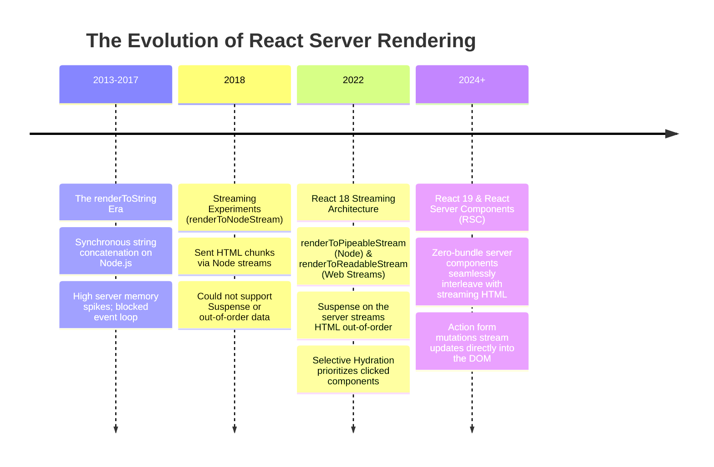
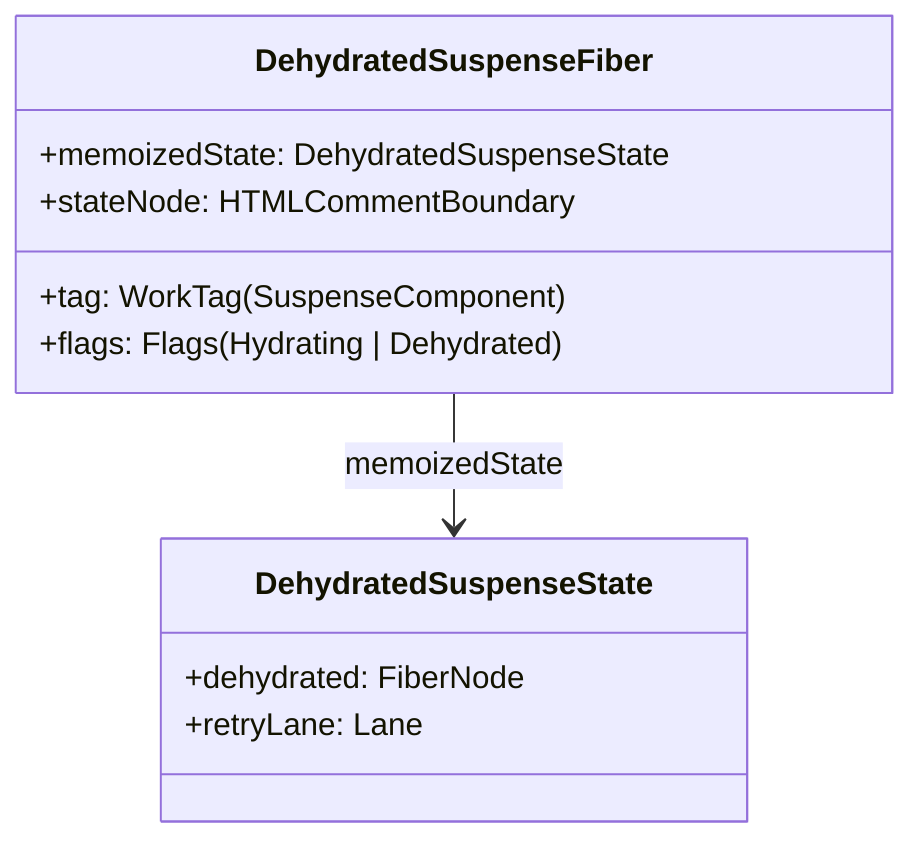
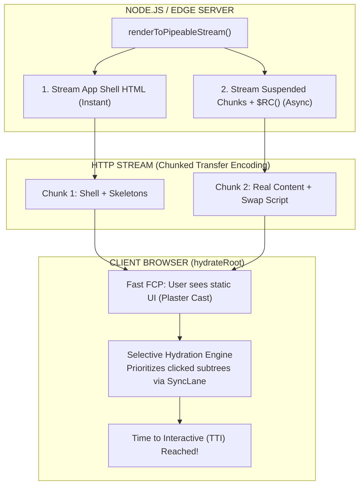

# Chapter 08: Server-Side Rendering (SSR) & Streaming Hydration (`renderToPipeableStream` & Selective Hydration)

> "Traditional SSR was an 'All-or-Nothing' waterfall: you couldn't send any HTML until all data was fetched; you couldn't hydrate anything until all scripts downloaded; you couldn't interact with anything until everything was hydrated. Streaming SSR and Selective Hydration break this waterfall into concurrent streams."  
> — **Dan Abramov, React Architecture Core**

---

## 1. Why This Topic Exists

Server-Side Rendering (SSR) was invented to solve two critical weaknesses of client-side Single Page Applications (SPAs):
1. **Search Engine Optimization (SEO):** Web crawlers (Googlebot, Bingbot, social media scrapers) need fully formed HTML documents rather than an empty `<div id="root"></div>`.
2. **First Contentful Paint (FCP):** Users on slow cellular connections should see readable text and images immediately, rather than waiting 5 seconds for a 2MB JavaScript bundle to download, parse, and execute.

However, classical SSR (React 15 through React 17's `renderToString`) suffered from a fatal **"All-or-Nothing" Architectural Waterfall**:

```mermaid
gantt
    title The Classical SSR Waterfall (React 17 renderToString)
    dateFormat X
    axisFormat %s s

    section Server
    Fetch Fast Data (Header/Nav)       :done, s1, 0, 1
    Fetch Slow Data (Comments/Reviews) :crit, s2, 1, 4
    renderToString() to HTML           :active, s3, 4, 4.5
    Send HTML over Network             :done, s4, 4.5, 5

    section Client
    Download 2MB JS Bundle             :active, c1, 5, 7.5
    Hydrate Entire Page Monolithically :crit, c2, 7.5, 8.5
    Page Becomes Interactive!          :milestone, m1, 8.5, 8.5
```



### The Three "All-or-Nothing" Bottlenecks:
1. **You couldn't send ANY HTML until the SLOWEST data arrived:** If 95% of your page took 50ms to load, but a third-party product reviews widget took 3,000ms, the server generated **zero bytes of HTML** for 3 seconds. The browser showed a blank white screen.
2. **You couldn't hydrate ANYTHING until ALL JavaScript downloaded:** The browser had to download every single component's JavaScript code before React could begin hydration.
3. **You couldn't interact with ANYTHING until EVERYTHING was hydrated:** Hydration was a monolithic, synchronous tree walk. If a heavy data grid took 300ms to hydrate, clicking a simple navigation link was completely ignored.

React 18 shattered this waterfall with **Streaming SSR with Suspense** (`renderToPipeableStream` on Node.js / `renderToReadableStream` on Edge runtimes) and **Selective Hydration**.

---

## 2. Learning Objectives

By mastering this chapter, you will be able to:
- Contrast the monolithic architecture of `renderToString` with the streaming pipeline of `renderToPipeableStream`.
- Trace how React streams early HTML shells, renders server-side Suspense fallbacks, and replaces them later via inline `<template>` swaps and `$RC` scripts.
- Deconstruct the mechanics of **Selective Hydration** and explain how React interrupts hydration to prioritize user clicks.
- Dissect the causes of **Hydration Mismatches** and how React 18/19 recovers from DOM discrepancies.
- Differentiate between `onShellReady` (for interactive human users) and `onAllReady` (for search engine crawlers).
- Compare React's selective hydration with Angular's Non-destructive Hydration and .NET Blazor's Streaming Rendering.
- Confidently answer Senior, Lead, and Architect interview questions regarding enterprise SSR architecture.

---

## 3. Historical Evolution



---

## 4. First Principles & Intuitive Physical Analogies (Layer 1)

### Analogy 1: The Monolithic Banquet vs. The Conveyor Belt Dim Sum
- **Classical SSR (`renderToString` - The Monolithic Banquet):**  
  You go to a 10-course banquet. The kitchen refuses to bring out the soup, the salad, or the bread until the slow-roasted roast duck finishes cooking 3 hours later. You sit starving at an empty table for 3 hours, then all 10 courses arrive simultaneously cold.
- **Streaming SSR (`renderToPipeableStream` - Dim Sum Conveyor Belt):**  
  The moment you sit down, the waiter immediately places hot tea and steamed dumplings on your table (**The Shell HTML - 50ms**).  
  While you enjoy your appetizers, the kitchen is roasting the duck (**Suspense Fallback**).  
  The instant the duck is finished, a cart rolls directly to your table, slides the duck onto your plate, and removes the empty dish (**Streaming Template Swap - 800ms**). You never sat waiting at an empty table.

---

### Analogy 2: The Plaster Cast & The Breathing Muscle (Hydration)
Imagine a medical patient with an injured arm.
- **The Server HTML:** The doctor wraps the arm in a rigid, motionless white plaster cast. The cast looks like an arm, has the exact shape of an arm, and keeps the arm protected (**Visual HTML**). But it cannot move; it has no nerves or muscles (**Zero Event Listeners**).
- **The Hydration Process:**  
  Hydration is the miracle of **breathing biological life into the plaster cast**.  
  React steps through the existing HTML structure and attaches living nerves (`addEventListener`), wire reflexes (Hooks state), and circulation (Fiber nodes).  
- **Selective Hydration:**  
  Instead of reviving the entire body at once, if someone taps the patient's index finger (**User Clicks a Button**), the doctor immediately rushes to infuse life into the index finger first, allowing it to flex instantly while the rest of the body finishes reviving in the background.

---

## 5. Internal Working & Engine Architecture (Layer 2)

### The Anatomy of `renderToPipeableStream`

In modern Node.js environments, React server rendering is executed via:
```typescript
import { renderToPipeableStream } from 'react-dom/server';

app.get('/', (req, res) => {
  let didError = false;

  const stream = renderToPipeableStream(<App />, {
    bootstrapScripts: ['/main.js'],
    
    // Triggered the instant the initial layout shell is ready!
    onShellReady() {
      res.statusCode = didError ? 500 : 200;
      res.setHeader('Content-Type', 'text/html');
      stream.pipe(res); // Stream HTML shell immediately to browser!
    },

    // Triggered when ALL suspended data is finished (Used for SEO Crawlers)
    onAllReady() {
      // Optional: Log metrics or cache full response
    },

    onError(err) {
      didError = true;
      console.error(err);
    }
  });
});
```

---

### How Out-of-Order Streaming HTML Works: The `$RC` Replacement Script

How can a server send HTML for a component that finishes loading *after* the browser has already received the main page?  
React achieves this through **Inline `<template>` Tags and Micro-Scripts**:

#### Step 1: The Initial Shell Stream (Sent at 50ms)
When React encounters `<Suspense fallback={<Skeleton />}>`, it emits placeholder comment markers and the fallback markup:

```html
<!-- Initial HTML streamed to browser -->
<div id="root">
  <nav>Navbar (Rendered)</nav>
  <main>
    <!--$?-->
    <template id="B:0"></template>
    <div class="skeleton">Loading comments...</div>
    <!--/$-->
  </main>
</div>
```
- `<!--$?-->` and `<!--/$-->`: HTML comment markers denoting a **Dehydrated Suspense Boundary**.
- `<template id="B:0">`: A placeholder marker anchored in the DOM tree.

#### Step 2: The Data Resolves (Sent at 600ms)
When the slow comments query finishes on the server, React streams an additional chunk into the **same HTTP connection**:

```html
<!-- Appended to the stream later over the same HTTP response -->
<div hidden id="S:0">
  <div class="comments-container">
    <h3>User Comments (5)</h3>
    <p>Great architectural breakdown!</p>
  </div>
</div>

<script>
  // React's internal micro-replacement function:
  // Swaps the contents of template B:0 with the resolved HTML S:0
  $RC("B:0", "S:0");
</script>
```

#### Step 3: Browser Execution
The browser encounters the tiny inline `$RC` script:
1. It reads the hidden `<div>` with `id="S:0"`.
2. It deletes the `.skeleton` placeholder.
3. It moves the `S:0` DOM nodes directly into the position of `B:0`.
4. **The user sees the real comments appear without a single byte of client-side JavaScript executing!**

---

## 6. Runtime Flow & Execution Traces: Selective Hydration

Once the HTML and the JavaScript bundle arrive at the browser, React begins **Hydration**.  
Before React 18, hydration was an uninterruptible synchronous loop: `ReactDOM.hydrate()`.  
In React 18/19, `hydrateRoot` executes **Selective Hydration** driven by Priority Lanes:

```mermaid
sequenceDiagram
    autonumber
    participant User as User
    participant Browser as Browser Main Thread
    participant Reconciler as React Hydration Engine
    participant CardA as Widget A (Heavy Analytics)
    participant CardB as Widget B (User Comments)

    Note over Reconciler: Background Hydration Begins (NormalPriority / LowLane)
    Reconciler->>CardA: Hydrating Widget A... (Parsing 5,000 nodes)
    
    rect rgb(60, 20, 20)
    Note over User: User Clicks "Like" on Widget B (At millisecond 15!)
    User->>Browser: Click event fires on un-hydrated Widget B!
    Browser->>Reconciler: React Root Event Listener captures native click!
    end

    rect rgb(20, 35, 60)
    Note over Reconciler: SELECTIVE HYDRATION INTERRUPT:
    Reconciler->>Reconciler: Detects click target is inside un-hydrated boundary (Widget B)!
    Reconciler->>CardA: PAUSE hydration of Widget A!
    Reconciler->>CardB: ELEVATE Widget B to SyncLane!
    Reconciler->>CardB: Hydrate Widget B synchronously (takes 2ms)!
    end

    rect rgb(40, 60, 20)
    Note over Reconciler: EVENT REPLAY:
    Reconciler->>CardB: Replay captured "Like" click on now-hydrated onClick handler!
    CardB->>Browser: Update UI: Like count increments to 1!
    end

    Note over Reconciler: Resume background hydration of Widget A!
```



---

## 7. Memory Model & Heap Layout: Dehydrated Fibers

During hydration, React creates a special category of Fiber node: **`DehydratedSuspenseComponent`**.



### The Invariant:
- React does **not allocate virtual DOM elements** for HTML that hasn't been hydrated yet.
- The Fiber holds a direct pointer to the opening HTML comment (`stateNode: <!--$?-->`).
- Only when the boundary is scheduled for hydration does React parse the underlying DOM nodes into true child Fibers, saving hundreds of kilobytes of V8 heap memory on initial load.

---

## 8. Visual Diagrams (Mermaid Vector Topologies)

### The Complete Streaming SSR & Selective Hydration Architecture



---

## 9. Real World Usage & Production Patterns

> 🧪 **Companion Interactive Lab:** [StreamingHydrationLab.tsx](../../apps/portal/src/features/visualizers/topic-08-streaming/StreamingHydrationLab.tsx) | Live in Portal: `lab-18-streaming-hydration`

### Pattern 1: Differentiating Human Users vs. Search Engine Crawlers

When building an enterprise SSR server, you want **streaming for human users** (lowest TTFB and FCP), but **complete HTML for search crawlers** (Googlebot, social preview bots):

```typescript
import { renderToPipeableStream } from 'react-dom/server';
import { isbot } from 'isbot'; // Popular bot detection library

export function handleSsrRequest(req: Request, res: Response) {
  const userAgent = req.headers['user-agent'] || '';
  const isSearchCrawler = isbot(userAgent);

  let didError = false;

  const stream = renderToPipeableStream(<App />, {
    bootstrapScripts: ['/bundle.js'],

    // For Human Users: Pipe immediately when the shell is ready!
    onShellReady() {
      if (!isSearchCrawler) {
        res.statusCode = didError ? 500 : 200;
        res.setHeader('Content-Type', 'text/html');
        stream.pipe(res);
      }
    },

    // For Search Engine Bots: Wait until ALL Suspense promises settle!
    onAllReady() {
      if (isSearchCrawler) {
        res.statusCode = didError ? 500 : 200;
        res.setHeader('Content-Type', 'text/html');
        stream.pipe(res); // Crawlers receive 100% complete, un-skeletonized HTML!
      }
    },

    onShellError(err) {
      // Fallback: If shell crashes, render client-side SPA fallback
      res.statusCode = 500;
      res.send('<!DOCTYPE html><html><body><div id="root"></div><script src="/bundle.js"></script></body></html>');
    }
  });
}
```

---

### Pattern 2: Suppressing Intentional Client/Server Discrepancies

Sometimes a component *must* render differently on server vs client (e.g. rendering a formatted timestamp in the user's local timezone):

```tsx
// ❌ CAUSES HYDRATION MISMATCH ERROR
export function BadTimestamp() {
  // Server renders UTC (e.g. 5:00 PM), Client in Tokyo renders JST (e.g. 2:00 AM)!
  return <span>{new Date().toLocaleTimeString()}</span>;
}

// ✅ ARCHITECT SOLUTION 1: Two-Pass Rendering via Mounted Flag
export function SafeClientTimestamp() {
  const [mounted, setMounted] = useState(false);

  useEffect(() => {
    setMounted(true);
  }, []);

  if (!mounted) {
    // Render deterministic placeholder on server and initial client hydration
    return <span>Loading local time...</span>;
  }

  // After hydration completes, render client-specific timezone!
  return <span>{new Date().toLocaleTimeString()}</span>;
}

// ✅ ARCHITECT SOLUTION 2: suppressHydrationWarning (For Text Nodes)
export function SuppressedTimestamp() {
  return (
    <span suppressHydrationWarning>
      {new Date().toLocaleTimeString()}
    </span>
  );
}
```

---

## 10. Angular Comparison

For a Senior Angular Architect transitioning to React, comparing React's streaming hydration with Angular's server-side evolution reveals fascinating convergence:

| Architectural Dimension | React (Streaming & Selective Hydration) | Angular (Non-Destructive Hydration & Event Replay) |
| :--- | :--- | :--- |
| **Hydration Strategy** | **Selective Hydration**.<br/>Hydrates subtrees out-of-order based on user clicks; un-hydrated boundaries remain as comments. | **Non-Destructive Hydration** (Angular 16+).<br/>Walks DOM without destroying nodes; uses DOM contract markers. |
| **Event Buffering & Replay** | Native event delegation on `#root` captures clicks on unhydrated nodes, prioritizes hydration, and replays events. | **Event Replay** (`withEventReplay()` via `@angular/core`).<br/>Uses Google's Event Contract library to record and replay user actions. |
| **Server Streaming** | `renderToPipeableStream` emits inline `<template>` and `$RC` scripts to stream HTML out-of-order. | Traditional Angular Universal buffered full HTML; Angular 17+ introduced `@defer` blocks for partial hydration. |
| **Component Pruning** | Unhydrated subtrees are stored as lightweight dehydrated Fibers. | Views are hydrated according to Ivy template instructions. |

---

## 11. .NET Comparison

For an ASP.NET Core & Blazor Architect, React's streaming SSR directly mirrors .NET 8's revolutionary web rendering model:

| Architectural Dimension | React (Streaming SSR) | .NET 8 (Blazor Streaming Rendering) |
| :--- | :--- | :--- |
| **Out-of-Order HTML Streaming** | Emits `<template id="B:0">` and streams `$RC("B:0", "S:0")` scripts down the HTTP response. | **`[StreamRendering]` Attribute in Blazor**.<br/>Streams initial layout, pushes `<template blazor:target="id">`, and patches the DOM via blazor.web.js. |
| **Hydration Analogy** | Breathing life into static HTML via event listeners and Fiber hooks. | Blazor WebAssembly / Server circuit startup attaching WebAssembly runtime to pre-rendered HTML. |
| **SEO Handling** | `onAllReady` blocks until all async data resolves for crawlers. | Blazor server prerendering buffering full HTML before completing response pipeline. |
| **Streaming API** | `renderToPipeableStream` using Node `Writable` streams. | ASP.NET Core `HttpResponse.Body.FlushAsync()` streaming chunks across Kestrel. |

---

## 12. Enterprise Perspective & Production Risks (Layer 4)

### Production Risk 1: The Devastating Performance Cost of Hydration Mismatches
When React hydrator encounters HTML in the browser that does not match the V8 Virtual DOM tree:
```text
Warning: Text content did not match. Server: "Welcome, Guest" Client: "Welcome, John Doe"
```
**The Under the Hood Penalty:**  
1. React cannot safely reuse the existing DOM node.
2. It **destroys the mismatched DOM node entirely** (`removeChild`) and allocates a brand-new DOM node in Blink C++ (`createElement`).
3. If the mismatch occurs at a high-level container (e.g. `<main>` or `<div>`), React **discards the ENTIRE server-rendered subtree and re-renders it on the client from scratch!**
4. All SEO benefits, TTFB optimizations, and FCP gains are completely wiped out, causing a massive layout shift (CLS) and CPU spike.

### Production Risk 2: Memory Leaks from Hanging Server Streams
If an asynchronous Promise thrown inside a server component never resolves (e.g. a deadlocked microservice or unhandled Redis timeout):
- `renderToPipeableStream` keeps the HTTP connection open indefinitely.
- The Node.js server retains the `Writable` stream, the React reconciler context, and the entire Fiber tree in memory.
- In high-traffic enterprise systems, thousands of hanging streams will exhaust Node's heap memory, triggering an **Out of Memory (OOM) process crash**.
- **The Remediation:** Always enforce strict server timeouts:
  ```typescript
  setTimeout(() => {
    stream.abort(new Error('Server render timeout exceeded'));
  }, 5000); // Enforce 5-second hard cap!
  ```

---

## 13. Performance Considerations

### Core Web Vitals Impact of Streaming SSR

| Metric | Classical SSR (`renderToString`) | Streaming SSR (`renderToPipeableStream`) | Architectural Reason |
| :--- | :--- | :--- | :--- |
| **TTFB (Time to First Byte)** | Poor (~800ms–2000ms) | **Sub-50ms (Ultra-Fast)** | Shell streams immediately without waiting for slow database queries. |
| **FCP (First Contentful Paint)** | Poor | **Sub-100ms** | Browser begins parsing and painting the shell while data loads. |
| **LCP (Largest Contentful Paint)** | Average | **Fast** | Primary content streams and displays with minimal delay. |
| **INP (Interaction to Next Paint)** | Poor (High TBT) | **Excellent (<16ms)** | Selective Hydration prioritizes clicked elements, preventing thread lockup. |

---

## 14. Tradeoffs

| Architecture | Advantages | Disadvantages |
| :--- | :--- | :--- |
| **Streaming SSR with Suspense** | - Lowest possible TTFB.<br/>- Fast FCP and responsive LCP.<br/>- Interactive prior to full hydration via Selective Hydration. | - Requires Node.js or Edge runtime (cannot host on static S3 bucket).<br/>- Increased server CPU utilization under massive traffic spikes. |
| **Static Site Generation (SSG)** | - Zero server CPU; served from edge CDN.<br/>- Lowest operational hosting cost. | - Stale data; cannot stream real-time personalized content.<br/>- Long build times for large sites (100k pages). |
| **Client-Side Rendering (SPA)** | - Trivial hosting architecture.<br/>- Zero server rendering overhead. | - Terrible SEO; slow FCP; white screen on initial cellular load. |

---

## 15. Common Mistakes & Interview Traps

### Trap 1: "Hydration re-creates all DOM elements from scratch"
- ❌ **Candidate Assumption:** *"Hydration destroys the server HTML and replaces it with React's Virtual DOM elements."*
- ✅ **Architect Reality:** *"Hydration NEVER re-creates matching DOM nodes! It walks the existing physical DOM elements produced by the server, matches them with corresponding Fiber nodes, and **only attaches event listeners** and sets internal pointers. This is why hydration is significantly faster than initial client mounting."*

### Trap 2: Accessing `window` or `document` in Component Render Bodies
- ❌ **The Trap:**
  ```tsx
  function UserAgent() {
    const width = window.innerWidth; // 💥 CRASHES ON SERVER: window is not defined!
    return <div>Width: {width}</div>;
  }
  ```
- ✅ **Architect Reality:** *"Component render bodies execute on BOTH the Node.js server and the client browser. `window`, `document`, and `localStorage` do not exist in Node.js. Browser-specific APIs must be safely isolated inside `useEffect` (which only runs on the client) or guarded with `typeof window !== 'undefined'`."*

---

## 16. Interview Questions & Architectural Answers (Senior, Lead, Architect - Layer 5)

### Q1 (Senior Level): Explain the mechanical difference between `onShellReady` and `onAllReady` in `renderToPipeableStream`. When would you use each?
**Architectural Answer:**  
- **`onShellReady` fires when the initial layout shell has finished rendering:**  
  This includes all components *outside* the `<Suspense>` boundaries. When `onShellReady` fires, the server streams the shell HTML immediately to the browser, accompanied by fallback skeleton markup for any suspended components. This is the optimal strategy for **human users**, as it achieves the lowest possible Time to First Byte (TTFB) and allows the browser to begin downloading assets and painting the UI immediately.
- **`onAllReady` fires when the entire tree—including all suspended asynchronous data—has finished rendering:**  
  No fallback skeletons remain; the HTML is 100% complete. This is the strategy required for **search engine crawlers (Googlebot) and social scrapers**, because web crawlers do not execute progressive streaming JavaScript scripts ($RC) reliably. It guarantees that bots index the final, complete text without skeletons.

---

### Q2 (Lead Level): Detail the exact mechanics of Selective Hydration. What happens when a user clicks an unhydrated button while another heavy component is mid-hydration?
**Architectural Answer:**  
In React 18/19, `createRoot` attaches global event delegation listeners to the `#root` container for standard browser events (`click`, `input`, etc.).  
When a user clicks a button inside an un-hydrated Suspense boundary:
1. The native click event bubbles up to `#root`.
2. React's top-level listener intercepts the event and inspects the target DOM node.
3. React detects that the target belongs to an un-hydrated **`DehydratedSuspenseComponent` Fiber**.
4. Rather than executing the click handler immediately (which would fail because no handler is attached), React **records the click event in an internal event queue**.
5. React's Scheduler immediately **interrupts whatever component was currently hydrating**, elevates the clicked boundary to **`SyncLane`**, and hydrates that specific boundary synchronously.
6. Once the boundary's Fibers are created and event listeners are linked, React **replays the recorded click event** against the newly hydrated component.  
The user's click takes effect seamlessly without dropped interactions, achieving sub-millisecond perceived responsiveness.

---

### Q3 (Architect Level): Walk through React's internal algorithm for out-of-order HTML streaming. How does the browser replace a skeleton with real HTML without client-side bundle execution?
**Architectural Answer:**  
React uses an ingenious inline script and template replacement protocol:
1. When a server component suspends, React emits placeholder HTML comment boundaries (`<!--$?-->`) wrapping a `<template id="B:0"></template>` anchor and the fallback HTML markup (`<div class="skeleton">`). The HTTP response stream remains open.
2. Later, when the server-side data promise fulfills, React continues writing to the open HTTP stream. It sends the resolved HTML wrapped in a hidden container: `<div hidden id="S:0">...real content...</div>`.
3. Immediately following the hidden content, React streams a tiny self-executing inline script: `<script>$RC("B:0", "S:0")</script>`.
4. Inside the browser, the browser's native HTML parser encounters the script and executes `$RC`:
   - `$RC` retrieves `template B:0` and `div S:0`.
   - It removes the skeleton DOM nodes from `B:0`'s parent.
   - It extracts the child nodes from `S:0` and inserts them directly into the parent container at the exact location of `B:0`.
   - It removes the temporary `S:0` element from the DOM.  
This entire DOM swap occurs via native browser C++ DOM manipulation, requiring **zero bytes of React client-side bundle JavaScript** to be parsed or executed.

---

## 17. Senior-Level Mental Model & "How to Remember This Forever" (Layer 3)

### The Memory Peg: The "Conveyor Belt Dim Sum & The Miracle of Plaster Casts"
1. **The Conveyor Belt Dim Sum (Streaming SSR):**  
   Don't wait for the whole banquet. Send the tea and dumplings now (**Shell**). Slide the duck onto the table the second it's cooked (**Streaming Swap Script**).
2. **The Plaster Cast (Hydration):**  
   Server HTML is a motionless plaster cast. Hydration is the nervous system waking up. If someone pokes the finger (**User Click**), React wakes up the finger first (**Selective Hydration**), letting it move while the rest of the body finishes waking up.

---

## 18. Core Vocabulary & "Aha!" Breakthrough Insights (Refresher)

| Term | Precision Architectural Definition |
| :--- | :--- |
| **`renderToPipeableStream`** | The React 18+ Node.js server API that streams HTML progressively using Node Writable streams. |
| **Selective Hydration** | The concurrent algorithm that prioritizes hydrating specific subtrees out-of-order based on user interactions. |
| **Dehydrated Fiber** | A lightweight Fiber node pointing to server-rendered HTML comment markers (`<!--$?-->`) without virtual DOM memory weight. |
| **`$RC()`** | React's client-side micro-replacement script that swaps server-streamed content templates into fallback placeholders. |
| **Hydration Mismatch** | A discrepancy between server-rendered HTML and client initial render that forces React to discard and recreate DOM nodes. |

> 💡 **The "Aha!" Breakthrough Insight:**  
> Selective Hydration turns user impatience into priority!  
> In React 18, clicking an un-hydrated button is not an error—it is an **invitation for React to drop everything and hydrate that exact button immediately!**

---

## 19. Key Takeaways

1. **The Waterfall Destroyed:** Streaming SSR breaks the "All-or-Nothing" bottleneck, allowing the shell to stream in `< 50ms` while slow data streams asynchronously.
2. **Out-of-Order Delivery:** Server fallbacks are swapped via inline `<template>` elements and `$RC()` micro-scripts over a single HTTP connection.
3. **Selective Hydration:** React hydrates components out-of-order, instantly elevating clicked components to `SyncLane` and replaying user events.
4. **Human vs Crawler Strategy:** Use `onShellReady` for human users to maximize TTFB/FCP; use `onAllReady` for search engine bots to guarantee complete indexing.
5. **Mismatch Penalty:** Hydration mismatches force React to destroy server DOM nodes and recreate them, devastating layout stability and performance.

---

## 20. Revision Sheet

- **Core Server API:** `renderToPipeableStream(<App />, { onShellReady, onAllReady, onError })`.
- **Client Entry Point:** `hydrateRoot(document.getElementById('root'), <App />)`.
- **Streaming Markers:** `<!--$?-->` (Suspended), `<!--$-->` (Hydrated), `<template id="B:X">` (Anchor), `$RC("B:X", "S:X")` (Swap).
- **Crawler Guard:** `isbot(userAgent) ? onAllReady : onShellReady`.
- **Timeouts:** Always attach a hard abort timeout (`stream.abort()`) to prevent hanging Node.js streams.
