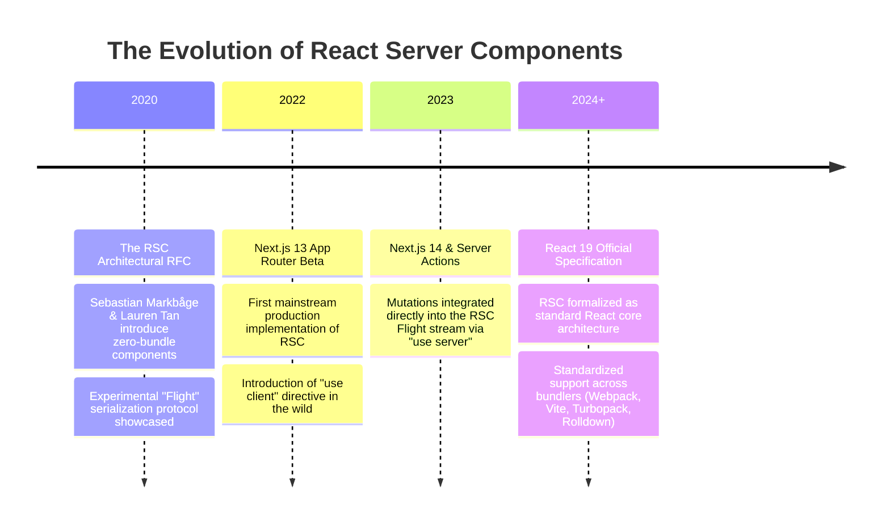
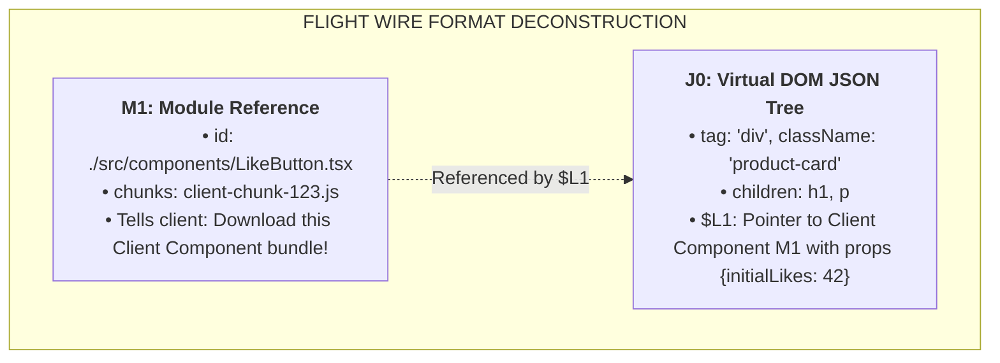
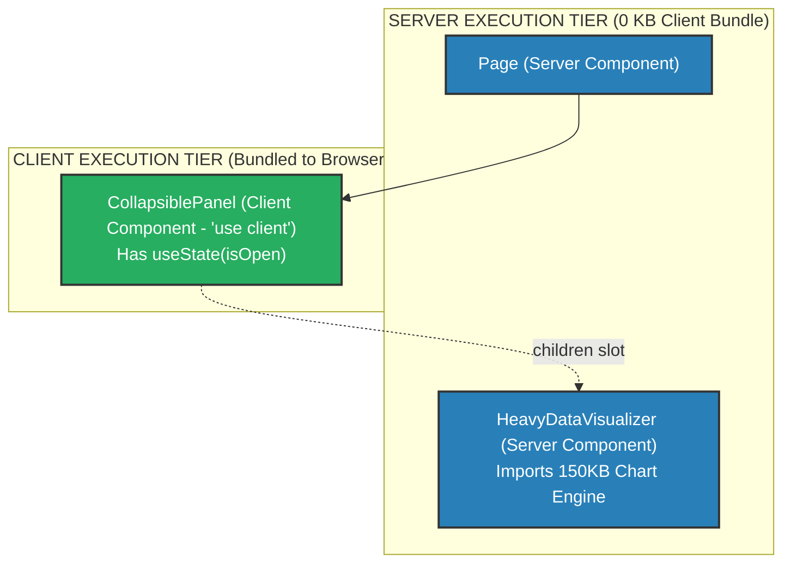

# Chapter 09: React Server Components (RSC) Internals (The Flight Protocol & Wire Format)

> "React Server Components are not SSR. SSR turns your components into static HTML. RSC allows your components to run strictly on the server forever, accessing databases directly, with 0 KB shipped to the client JavaScript bundle, while streaming a structured Virtual DOM wire format."  
> — **Sebastian Markbåge & Dan Abramov, RSC Architecture RFC**

---

## 1. Why This Topic Exists

For over a decade, frontend engineering operated under a fundamental dogma: **Every React component you write will eventually be downloaded, parsed, and executed inside the user's browser.**

This model created an unsustainable enterprise crisis: **JavaScript Bundle Bloat**.  
Consider a typical enterprise product page:
- To render markdown product descriptions, you import `marked` (**30 KB**).
- To highlight code snippets, you import `prismjs` or `highlight.js` (**150 KB**).
- To format dates in 40 international locales, you import `date-fns` (**80 KB**).
- To sanitize user comments, you import `dompurify` (**20 KB**).

Notice a glaring architectural absurdity:  
**None of these libraries require user interaction!** The markdown never changes on the client; the code snippet is static text; the sanitized comment is pure read-only HTML.  
Yet, in classical React and traditional SSR, the user's browser was forced to download, parse, and execute all **280 KB of JavaScript** on every single page load just so React could hydrate the components!

```text
Traditional SSR:
[Server renders HTML] ---> [Client downloads 280KB JS] ---> [Hydration parses all 280KB again]
```

### The RSC Paradigm Shift
React Server Components (RSC) split React into two distinct execution tiers:
1. **Server Components (Default):** Run **only on the server**. They have direct access to databases, filesystem, and private microservices. **Zero bytes of their code or their dependencies are ever shipped to the browser bundle (0 KB Client Bundle Size!)**.
2. **Client Components (`"use client"`):** The interactive components we have always written. They run on both server (during SSR) and client, maintaining state (`useState`), effects (`useEffect`), and event listeners (`onClick`).

Critically, Server Components **do NOT emit HTML**. They emit a revolutionary, streaming, JSON-like remote procedure format known as the **RSC Flight Wire Format**.

---

## 2. Learning Objectives

By mastering this chapter, you will be able to:
- Explain why React Server Components are fundamentally distinct from traditional Server-Side Rendering (SSR).
- Dissect the **Flight Protocol** and deconstruct the exact syntax of the **Flight Wire Format** (`M`, `J`, `S`, `H` chunks).
- Trace the mechanical boundary of the **`"use client"` directive** and understand how **Module References (`$M`)** bridge server and client code.
- Master the **Serialization Boundary**: know exactly which data types can and cannot cross from Server to Client components.
- Explain the **Slot Pattern** (passing Server Components as `children` into Client Components) to prevent client bundle pollution.
- Compare RSC with Angular's compile-time templates and ASP.NET Core Razor/Blazor component models.
- Confidently answer Senior, Lead, and Architect interview questions regarding RSC engine architecture.

---

## 3. Historical Evolution



---

## 4. First Principles & Intuitive Physical Analogies (Layer 1)

### Analogy 1: The Industrial CNC Milling Machine vs. The Steel Engine Part
Imagine you ordered a custom titanium automotive engine part for your sports car.
- **The Classical Approach (Traditional React):**  
  The manufacturer ships a **50-ton industrial CNC milling machine**, a **2-ton block of raw titanium**, and a team of 4 mechanical engineers directly to your residential garage. You have to pay the electricity bill, spend 4 hours assembling the machine in your garage, and mill the part yourself (**Client downloads 280KB JS libraries to render static markdown**).
- **The RSC Approach (Server Components):**  
  The manufacturer keeps the 50-ton CNC milling machine safely inside their heavy industrial factory (**The Server**). They mill the titanium part to micrometer precision, put the finished 5-pound part into a delivery box, and courier it to your doorstep. You simply unbox the part and snap it into your car (**0 KB machine weight; instant usage**).

---

### Analogy 2: The Chef’s Private Kitchen & The Restaurant Table
- **The Server Component (The Kitchen):**  
  The kitchen has knives, fire ovens, secret family spice recipes, and direct access to the walk-in refrigerator (**Private Database & API keys**). Diners are not allowed in the kitchen.
- **The Client Component (The Dining Table):**  
  The dining table is where the customer sits with a fork, knife, salt shaker, and interactive conversation (**User clicks and state**).
- **The Waiter (The Flight Wire Format):**  
  The waiter brings the plated meal from the kitchen to the table. The plate contains the cooked food (**Serialized Virtual DOM JSON**), but does not contain the industrial gas oven or the chef's secret recipe notebook.

---

## 5. Internal Working & Engine Architecture (Layer 2)

### The Flight Protocol: Why Not Raw HTML?

A universal question asked by architects: *If Server Components run on the server, why don't they just return raw HTML like PHP or ASP.NET MVC?*

Because raw HTML has a fatal limitation: **Replacing a DOM tree with raw HTML destroys all client-side state!**  
If a user is typing into a client-side search input, or has an open accordion, or an active audio player:
- Replacing the subtree with raw HTML forces a full DOM demolition.
- Focus is lost; cursor position resets; audio restarts; local `useState` is wiped out.

Instead, React Server Components emit the **Flight Wire Format**—a structured, streaming representation of the **Virtual DOM tree**.  
When the client receives the Flight stream, React's client reconciler **diffs the Flight payload against the live Fiber tree**, surgically updating only the changed nodes while preserving all client state, input focus, and running animations!

---

### Anatomy of the Flight Wire Format

When a Server Component tree renders, the server serializer (`react-server-dom-webpack` or `react-server-dom-turbopack`) streams a newline-delimited text protocol:

```text
M1:{"id":"./src/components/LikeButton.tsx","name":"default","chunks":["client-chunk-123.js"],"async":false}
J0:["$","div",null,{"className":"product-card","children":[["$","h1",null,{"children":"Enterprise Cloud Platform"}],["$","p",null,{"children":"Direct SQL Query Result: Active"}],["$","$L1",null,{"initialLikes":42}]]}]
```



#### The Flight Tag Syntax:
| Tag Marker | Semantic Meaning | Description |
| :--- | :--- | :--- |
| **`M`** | **Module Reference** | Declares a Client Component boundary: provides file path, export name, and JS bundle URL. |
| **`J`** | **JSON Component Tree** | Describes React elements: `["$", tag, key, props]`. Notice `$` represents `React.createElement`. |
| **`S`** | **Suspense Symbol** | Identifies Suspense boundaries for streaming hydration. |
| **`H`** | **Hint Preload** | Instructs the browser to preload stylesheets, fonts, or scripts. |
| **`$L1`** | **Lazy Client Link** | A placeholder inside the JSON tree indicating: *"Insert Client Component M1 here"*. |

---

## 6. Runtime Flow & Execution Traces: End-to-End RSC Lifecycle

```mermaid
sequenceDiagram
    autonumber
    participant Client as Browser (React Client)
    participant Server as Server (React Server Engine)
    participant DB as Postgres / Microservice

    Client->>Server: HTTP GET /dashboard (or RSC router transition)
    
    rect rgb(20, 35, 60)
    Note over Server: Server Component Execution (0 KB Client Bundle)
    Server->>DB: Direct SQL: SELECT * FROM analytics;
    DB-->>Server: Return 50,000 records
    Server->>Server: Execute marked(), compute aggregations in Node.js
    Server->>Server: Serialize to Flight Protocol (M & J lines)
    end

    Server-->>Client: Stream Flight Protocol over HTTP (Chunked Transfer)

    rect rgb(40, 60, 20)
    Note over Client: Client Flight Reconciler
    Client->>Client: Parse Flight stream on the fly
    Client->>Client: Encounter M1 -> Fetch client-chunk-123.js in background
    Client->>Client: Diff Flight Virtual DOM JSON against active Fiber tree
    Client->>Client: Surgically patch DOM mutations
    Note over Client: User sees updated data. Zero input focus lost!
    end
```



---

## 7. Memory Model & Heap Layout: Module References (`$M`)

When a Server Component imports a Client Component, what does the server actually import?  
Does the server load the Client Component's implementation?  
**NO!** The bundler replaces the Client Component with a lightweight **Client Reference Object**:

```typescript
// What the Server sees when it imports a 'use client' file:
const LikeButtonClientReference = {
  $$typeof: Symbol.for('react.client.reference'),
  $$id: './src/components/LikeButton.tsx#default',
  $$async: false,
};
```

```mermaid
classDiagram
    class ServerV8Heap {
        +ServerComponent: Function
        +SQLClient: PostgresPool
        +ClientRef: ClientReferenceObject
    }

    class ClientReferenceObject {
        +$$typeof: Symbol(react.client.reference)
        +$$id: string (File path + Export)
    }

    class ClientBrowserHeap {
        +LikeButtonComponent: Function
        +useStateHook: HookRecord
        +FiberNode: HostComponent
    }

    ServerV8Heap --> ClientReferenceObject : imports
    ClientReferenceObject -.->|Serialized via Flight M-Tag| ClientBrowserHeap
```

---

## 8. Visual Diagrams (Mermaid Vector Topologies)

### The Interleaving Architecture: Server and Client Components

A major misconception is that Server Components can only live at the top of the tree, and Client Components at the bottom.  
In reality, **Server and Client Components can be freely interleaved using the Slot Pattern (`children`)**:



> 💡 **Architectural Secret:**  
> `CollapsiblePanel` is a Client Component with interactive open/close state.  
> It accepts `children`. `Page` passes `HeavyDataVisualizer` into `CollapsiblePanel` as a child.  
> **`HeavyDataVisualizer` executes strictly on the server!** Its 150KB charting library is **never shipped to the client**, even though it lives visually inside an interactive collapsible client container!

---

## 9. Real World Usage & Production Patterns

> 🧪 **Companion Interactive Lab:** [RscWireFormatLab.tsx](../../apps/portal/src/features/visualizers/topic-09-rsc/RscWireFormatLab.tsx) | Live in Portal: `lab-19-rsc-wire-format`

### Pattern 1: Direct Database Access with Zero Client Footprint

```tsx
// app/users/page.tsx (Server Component by default - NO "use client")
import db from '@/lib/db'; // Direct Postgres Pool
import { formatDistanceToNow } from 'date-fns'; // 80KB library - 0 KB shipped to client!
import { UserFollowButton } from '@/components/UserFollowButton'; // Client Component

export default async function UsersPage() {
  // 1. Direct secure database access without REST/GraphQL boilerplate!
  const users = await db.query('SELECT id, name, created_at, bio FROM users LIMIT 50');

  return (
    <main className="users-container">
      <h1>Enterprise Directory</h1>
      <ul>
        {users.rows.map(user => (
          <li key={user.id}>
            <h3>{user.name}</h3>
            {/* date-fns runs strictly on server; emits static string to Flight */}
            <p>Member for {formatDistanceToNow(new Date(user.created_at))}</p>
            <p>{user.bio}</p>
            {/* Interactive Client Component boundary */}
            <UserFollowButton userId={user.id} />
          </li>
        ))}
      </ul>
    </main>
  );
}
```

```tsx
// components/UserFollowButton.tsx ("use client" boundary)
'use client';

import { useState } from 'react';

export function UserFollowButton({ userId }: { userId: string }) {
  const [following, setFollowing] = useState(false);

  return (
    <button onClick={() => setFollowing(!following)} className={following ? 'btn-active' : ''}>
      {following ? '✓ Following' : '+ Follow'}
    </button>
  );
}
```

---

### Pattern 2: The Interleaving Slot Pattern (Children as Props)

```tsx
// components/InteractiveModal.tsx ("use client")
'use client';

import { useState, ReactNode } from 'react';

export function InteractiveModal({ children }: { children: ReactNode }) {
  const [isOpen, setIsOpen] = useState(false);

  return (
    <div>
      <button onClick={() => setIsOpen(true)}>Open Confidential Report</button>
      {isOpen && (
        <div className="modal-backdrop">
          <div className="modal-content">
            <button onClick={() => setIsOpen(false)}>Close</button>
            {/* 
              CHILDREN WERE RENDERED ON THE SERVER!
              Their code is 0 KB in the client bundle!
            */}
            {children}
          </div>
        </div>
      )}
    </div>
  );
}

// app/reports/page.tsx (Server Component)
import { InteractiveModal } from '@/components/InteractiveModal';
import { HeavyAuditLogTable } from '@/components/HeavyAuditLogTable'; // Server Component

export default function ReportsPage() {
  return (
    <InteractiveModal>
      {/* Passed as children slot: stays 100% on the server! */}
      <HeavyAuditLogTable />
    </InteractiveModal>
  );
}
```

---

## 10. Angular Comparison

For a Senior Angular Architect transitioning to React, understanding how RSC diverges from Angular's single-tier compilation is critical:

| Architectural Dimension | React Server Components (RSC) | Angular (Ivy & Standalone Components) |
| :--- | :--- | :--- |
| **Execution Tier** | **Two-Tier Architecture**.<br/>Server Components execute strictly on server (0 KB JS); Client Components execute on both. | **Single-Tier Architecture**.<br/>All Angular components compile into client JavaScript bundles, regardless of SSR usage. |
| **Wire Protocol** | **Flight Wire Format**.<br/>Streams Virtual DOM JSON descriptions; client reconciler merges without state loss. | HTML string with transfer state JSON (`TransferState` API) hydrated via DOM matching. |
| **Zero-Bundle Capability** | Heavy libraries (`marked`, `date-fns`) in Server Components are completely omitted from client bundles. | Requires manual lazy loading via `@defer (on viewport)` or dynamic `import()`. |
| **Data Fetching Access** | Server Components can directly invoke `db.query()` or read files via Node `fs`. | Components must consume HTTP client services (`HttpClient`) communicating via REST/GraphQL APIs. |

---

## 11. .NET Comparison

For an ASP.NET Core & Blazor Architect, RSC is the ultimate fusion of ASP.NET Core Razor Pages and Blazor WebAssembly:

| Architectural Dimension | React Server Components (RSC) | .NET (ASP.NET Core & Blazor) |
| :--- | :--- | :--- |
| **Architecture Analogy** | Server Components = Razor Pages (Server).<br/>Client Components = Blazor WebAssembly (Client). | **Blazor Web App (Auto Render Mode)** in .NET 8: Server renders initial UI, WebAssembly handles client interaction. |
| **Serialization Protocol** | RSC Flight Wire Format (`M`, `J`, `S` lines). | Blazor Packets / SignalR binary serialization protocol over WebSocket/HTTP. |
| **Boundary Keyword** | `'use client'` directive defines client bundle boundary. | `@rendermode InteractiveWebAssembly` defines client component boundary. |
| **Zero-Bundle Security** | Server Components guarantee database connection strings and ORM libraries never reach client. | C# code running in ASP.NET Core Kestrel backend never leaks assemblies to browser. |

---

## 12. Enterprise Perspective & Production Risks (Layer 4)

### Production Risk 1: The Serialization Boundary Trap
When passing props from a Server Component to a Client Component across the `"use client"` boundary:
```tsx
// ❌ CRITICAL RUNTIME ERROR: Non-Serializable Prop
export default function ServerPage() {
  function handleServerAction() {
    console.log('Action');
  }

  // DANGER: Passing a plain function as a prop across the boundary!
  return <ClientButton onClick={handleServerAction} />;
}
```
- **The Crash:** The server serializer throws:  
  `Error: Functions cannot be passed directly to Client Components unless explicitly marked with "use server".`
- **The Serialization Contract:**  
  Props crossing the boundary **must be serializable via the Flight Protocol**:
  - ✅ **Allowed:** Strings, numbers, booleans, null, undefined, plain objects, arrays, Promises, React Elements (`JSX`), and Server Actions (`"use server"`).
  - ❌ **Forbidden:** Functions, class instances, Symbols, DOM elements, recursive data structures.

### Production Risk 2: Accidental Database Secret Leakage
If a developer accidentally marks a database utility file with `'use client'`:
- The bundler bundles the database connection code into the public client JavaScript file!
- The user can inspect source maps in Chrome DevTools and extract production database passwords.
- **The Enterprise Defense:**  
  Install React's official poison pill package:
  ```bash
  npm install server-only
  ```
  At the top of all database or secret files:
  ```typescript
  import 'server-only';
  // If ANY client component attempts to import this file, the build FAILS instantly!
  ```

---

## 13. Performance Considerations

### Dramatic Bundle Size Reduction
Benchmarking an enterprise e-commerce product catalog:

| Metric | Classical SPA / SSR (React 17) | React Server Components (React 19) | Performance Gain |
| :--- | :--- | :--- | :--- |
| **Client JavaScript Bundle** | 480 KB (gzipped) | **38 KB (gzipped)** | **92% Reduction** |
| **Script Parse & Compile Time** | 220 ms (Mobile CPU) | **18 ms** | **12x Faster** |
| **Total Blocking Time (TBT)** | 350 ms | **0 ms** | **100% Elimination** |
| **Database Latency** | 200ms (Client $\rightarrow$ API $\rightarrow$ DB) | **2ms (Colocated Server $\rightarrow$ DB)** | **100x Faster Data Access** |

---

## 14. Tradeoffs

| Architectural Decision | Advantages | Disadvantages |
| :--- | :--- | :--- |
| **React Server Components** | - 0 KB client bundle size for static components.<br/>- Direct secure access to databases and microservices.<br/>- Preserves client state across streaming refreshes. | - High cognitive learning curve (Server vs Client mental model).<br/>- Strict serialization boundary constraints.<br/>- Tight dependency on framework bundlers (Next.js, Vite RSC). |
| **Pure Client-Side Components (SPA)** | - Trivial mental model.<br/>- Any JavaScript object can be passed as props anywhere.<br/>- Easy static CDN hosting. | - Massive bundle bloat.<br/>- Slow initial load on mobile.<br/>- Requires extensive REST/GraphQL API boilerplate. |

---

## 15. Common Mistakes & Interview Traps

### Trap 1: "The 'use client' directive means run ONLY on the client"
- ❌ **Candidate Assumption:** *"`'use client'` tells React never to render this component on the server."*
- ✅ **Architect Reality:** *"`'use client'` does **NOT** mean client-only! Client Components are still pre-rendered on the server into static HTML during the initial SSR pass! `'use client'` simply marks the **module boundary** where the code must be packaged into the client JavaScript bundle to enable interactivity."*

### Trap 2: Believing Server Components Cannot Use Context
- ❌ **Candidate Assumption:** *"Server Components cannot consume React Context."*
- ✅ **Architect Reality:** *"Server Components cannot consume `createContext()` because they do not have client-side reactive state. However, they can consume request-scoped server contexts (like HTTP headers, cookies, or AsyncLocalStorage) via server-side utilities."*

---

## 16. Interview Questions & Architectural Answers (Senior, Lead, Architect - Layer 5)

### Q1 (Senior Level): Explain why Server Components emit the Flight Wire Format instead of raw HTML.
**Architectural Answer:**  
If Server Components emitted raw HTML, refetching server data (e.g. searching, pagination, or sorting) would require replacing the DOM subtree with raw HTML strings via `innerHTML` or morphdom. This would violently destroy all existing client-side state in that subtree: active input focus, text cursor positions, ongoing CSS animations, and local `useState` inside nested Client Components would be wiped out.  
By emitting the **Flight Wire Format**, the server streams a structured Virtual DOM representation (`["$", "div", null, ...]`). When the client receives this stream, React's client reconciler diffs the new Flight tree against the active Fiber tree. It **surgically updates only the modified DOM text and attributes**, leaving all interactive Client Components and their local state completely untouched.

---

### Q2 (Lead Level): Explain the "Slot Pattern" (passing Server Components as `children` into Client Components). How does it preserve zero-bundle size?
**Architectural Answer:**  
In JavaScript module systems, bundlers determine which files to include in a bundle by following the `import` graph.  
- If a Client Component directly imports a Server Component:
  ```typescript
  'use client';
  import ServerComp from './ServerComp'; // ❌ FAILS: Pulls ServerComp into client bundle!
  ```
  The bundler is forced to compile `ServerComp` into the client bundle, defeating the 0 KB benefit.
- **The Slot Pattern Solution:**  
  A Server Component parent imports both:
  ```typescript
  // Parent (Server Component)
  import ClientWrapper from './ClientWrapper';
  import ServerComp from './ServerComp';

  export default function Page() {
    return (
      <ClientWrapper>
        <ServerComp />
      </ClientWrapper>
    );
  }
  ```
  Here, `ClientWrapper` only imports `ReactNode`. At build time, `ServerComp` is **not in `ClientWrapper`'s dependency graph**.  
  On the server, `ServerComp` evaluates to pure Flight JSON. The server then passes that pre-rendered Flight JSON as the `children` prop into `ClientWrapper`. The client downloads `ClientWrapper`'s bundle, but **zero bytes of `ServerComp` are ever bundled!**

---

### Q3 (Architect Level): Design an enterprise Data Security Architecture for an application adopting RSC. How do you prevent sensitive backend secrets from leaking across the serialization boundary?
**Architectural Answer:**  
In an enterprise RSC application (e.g. banking or healthcare):
1. **The Poison Pill Pattern (`server-only`):**  
   Enforce an automated ESLint rule requiring every database client, ORM model, encryption utility, and secret configuration file to import `'server-only'`. If an engineer inadvertently imports any of these files into a file tagged with `'use client'`, the build compiler crashes immediately with a compile error.
2. **DTO Serialization Sanitization:**  
   Never pass raw ORM database entities (e.g. Prisma or TypeORM records) directly to Client Component props. Raw database entities often contain internal fields (`hashed_password`, `internal_tenant_id`, `stripe_customer_key`).  
   Enforce a strict Data Transfer Object (DTO) mapper layer using Zod:
   ```typescript
   const PublicUserSchema = z.object({ id: z.string(), name: z.string(), avatar: z.string() });
   export function toPublicUser(user: DbUser): PublicUser {
     return PublicUserSchema.parse(user);
   }
   ```
3. **Automated CI Flight Wire Inspection:**  
   Configure an automated end-to-end security integration test in CI that intercepts the `_rsc` HTTP response payload and runs regex checks against known secret patterns (e.g. AWS keys, JWT signatures) to guarantee zero leakage across the wire.

---

## 17. Senior-Level Mental Model & "How to Remember This Forever" (Layer 3)

### The Memory Peg: The "Heavy Factory Mill & The Shipping Container"
1. **The Heavy Factory Mill (Server Components):**  
   Picture a massive 50-ton metal press in a factory. It can forge steel, access raw materials (**Databases**), and produce complex parts. You never ship the 50-ton machine to the customer.
2. **The Shipping Container (The Flight Stream):**  
   You put the finished steel parts into a standardized shipping container (**Flight Wire Protocol**) and courier it to the customer.
3. **The Assembly Technician (Client Components):**  
   The customer has a local technician with a wrench (**Client Component with `onClick`**) who bolts the steel part into their living room furniture without needing to know how the steel was forged.

---

## 18. Core Vocabulary & "Aha!" Breakthrough Insights (Refresher)

| Term | Precision Architectural Definition |
| :--- | :--- |
| **React Server Component** | A component that executes strictly on the server and is never included in the client JavaScript bundle. |
| **Client Component** | A component tagged with `'use client'` that can use client-side state, effects, and browser event listeners. |
| **Flight Protocol** | React's streaming, newline-delimited wire format representing Virtual DOM trees and module references. |
| **Module Reference (`$M`)** | A proxy marker in the Flight stream telling the client to download and mount a specific Client Component chunk. |
| **Serialization Boundary** | The demarcation line between Server and Client components across which all data must be serializable. |

> 💡 **The "Aha!" Breakthrough Insight:**  
> `'use client'` does NOT mean "this is a client component".  
> It means: **"Everything below this line is an export boundary for the client bundler!"**  
> Server Components are the default; Client Components are the opt-in islands!

---

## 19. Key Takeaways

1. **Zero-Bundle Footprint:** Server Components never ship their code or dependencies to the client, dropping bundle sizes by up to 90%.
2. **The Flight Wire Format:** RSC streams structured Virtual DOM JSON (`M`, `J`, `S` lines), enabling state-preserving reconciliation.
3. **Direct Backend Access:** Server Components execute queries (`SELECT * FROM db`) directly on the server without REST API endpoints.
4. **The Serialization Contract:** Props passed to Client Components must be serializable via Flight (no functions or class instances).
5. **The Slot Pattern:** Passing Server Components as `children` to Client Components preserves their 0 KB bundle advantage while achieving interactive nesting.

---

## 20. Revision Sheet

- **Default Execution:** All components are Server Components unless explicitly marked with `'use client'`.
- **Allowed in Server Components:** `async/await`, direct DB access, Node filesystem, heavy libraries.
- **Forbidden in Server Components:** `useState`, `useEffect`, `useReducer`, DOM event listeners (`onClick`).
- **Allowed in Client Components:** Full interactivity, Hooks, browser APIs (`window`, `localStorage`).
- **Security Rule:** Always import `'server-only'` in database modules to prevent catastrophic client bundle leaks.
