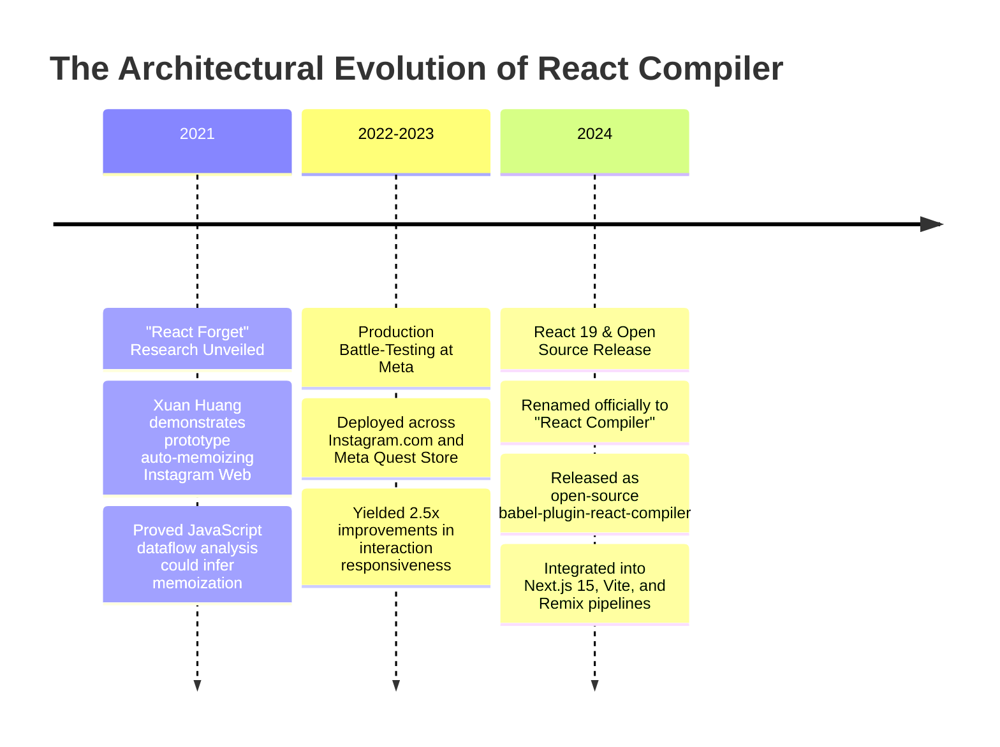
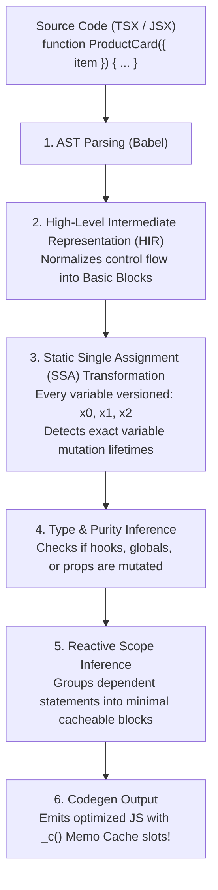
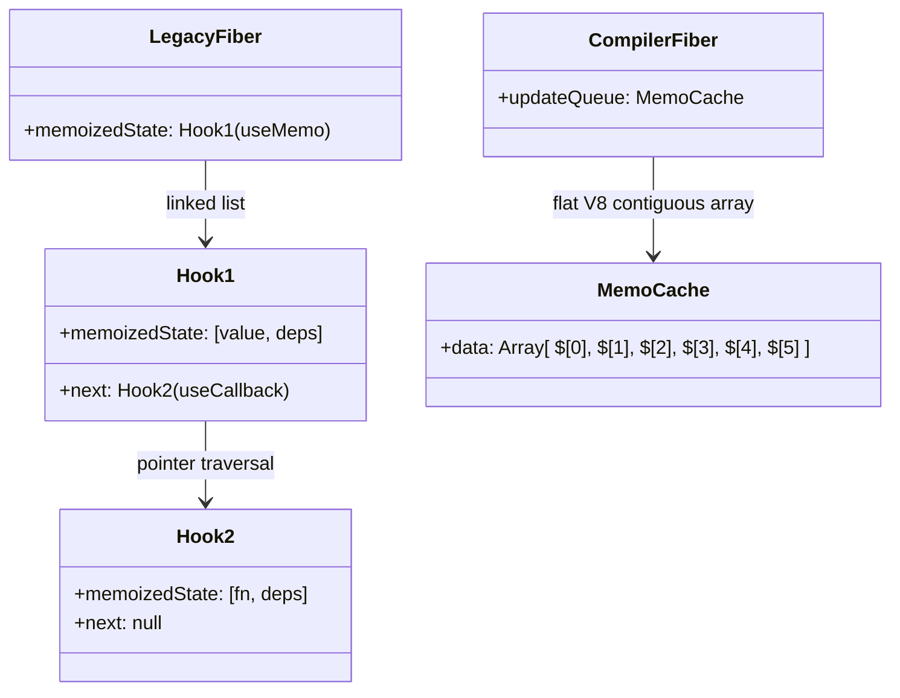
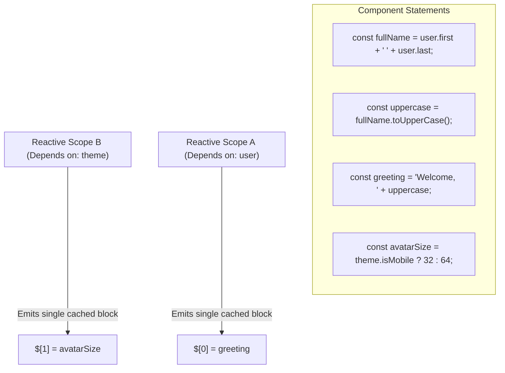

# Chapter 10: The React Compiler & React Forget Internals (Static Single Assignment & Auto-Memoization)

> "Developers spend half their working hours agonizing over dependency arrays in useMemo and useCallback, or debugging cascade re-renders caused by new object references. The React Compiler removes this cognitive tax forever: it analyzes pure JavaScript semantics at build time and automatically inserts optimal memoization."  
> — **Xuan Huang & Joe Savona, React Compiler Core Team**

---

## 1. Why This Topic Exists

From the release of React Hooks in 2018 through React 18, React developers endured a pervasive, exhausting engineering burden: **The Manual Memoization Tax**.

To prevent unnecessary child re-renders and preserve referential equality, developers were forced to litter their codebases with three defensive primitives:
1. **`useMemo`:** To cache expensive calculations or object references.
2. **`useCallback`:** To prevent child functions from breaking referential equality on every parent render.
3. **`React.memo`:** To wrap child components so they skip rendering when props stay identical.

```tsx
// ❌ THE EXHAUSTING MANUAL MEMOIZATION ERA (React 16.8 - 18)
const memoizedCallback = useCallback(() => {
  doSomething(a, b);
}, [a, b]); // ⚠️ Miss a dependency? Stale closure bug!

const memoizedValue = useMemo(() => {
  return computeExpensiveValue(a, b);
}, [a, b]); // ⚠️ Add an inline object? Memoization broken!

const MemoizedChild = React.memo(ChildComponent);
```

### The Three Fatal Flaws of Manual Memoization:
1. **High Cognitive Overhead:** Developers had to manually track mutable values, constantly asking: *"Does this object reference change every render?"*
2. **Fragile Dependency Arrays:** Missing a dependency caused insidious **Stale Closure bugs** where functions operated on data from 5 renders ago. Including too many caused cascade re-renders.
3. **Pervasive Code Uglification:** Up to **30% of lines of code** in large enterprise repositories were pure memoization boilerplate that had nothing to do with business logic.

The React Core team asked a fundamental computer science question:  
*If JavaScript is a statically analyzable programming language, why should human beings write memoization caching logic by hand? Why can't a compiler do it automatically?*

The answer is **The React Compiler** (formerly codenamed **"React Forget"**).  
The React Compiler is an **Ahead-of-Time (AOT) optimizing Babel / Rollup / Vite plugin**. It parses standard, idiomatic JavaScript/TypeScript into an Intermediate Representation, performs **Static Single Assignment (SSA)** dataflow analysis, infers **Reactive Scopes**, and automatically transforms your components to cache every calculation, object, function, and JSX element with mathematical perfection.

---

## 2. Learning Objectives

By mastering this chapter, you will be able to:
- Explain why manual memoization (`useMemo`, `useCallback`, `React.memo`) was a design compromise and how the React Compiler eliminates it.
- Deconstruct the multi-stage compiler pipeline: **AST → HIR (High-level Intermediate Representation) → SSA → Reactive Scope Inference → Codegen**.
- Dissect the **Memo Cache (`_c()`)** runtime primitive and explain how it replaces Hooks with indexed cache slot comparisons.
- Understand the strict prerequisites of the compiler: why **The Rules of React** (component purity, immutable props) are mandatory.
- Explain why the React Compiler does **NOT** eliminate the Virtual DOM or turn React into a Signals-based framework.
- Compare React's AOT AST compilation with Angular Ivy's template compilation and .NET Roslyn source generators.
- Confidently answer Senior, Lead, and Architect interview questions regarding compiler mechanics and migration strategies.

---

## 3. Historical Evolution



---

## 4. First Principles & Intuitive Physical Analogies (Layer 1)

### Analogy 1: The Accountant’s Memory Pad vs. The Autonomous Cash Register
- **Manual Memoization (The Exhausted Accountant):**  
  An accountant sits at a busy supermarket checkout. Every time a customer buys bread, milk, and eggs, the accountant pulls out a notebook, flips through 500 pages, manually verifies: *"Did the price of milk change? Did the price of bread change?"*, writes down the total, cross-checks the date, and signs his name. If the accountant gets tired or misses a line, the store loses money (**Stale Closure / Memory Leak**).
- **The React Compiler (The Autonomous Cash Register):**  
  The supermarket installs a smart computerized cash register with a barcode scanner. The computer tracks every price automatically in microsecond memory slots (`$[0]`, `$[1]`, `$[2]`). The cashier doesn't have to write down notes or think about memory—the hardware register **guarantees that identical inputs produce instant cached outputs** without human error.

---

### Analogy 2: The Master Watchmaker vs. The Robotic Precision Solderer
- Writing `useMemo` and `useCallback` by hand is like an artisan using tweezers and a magnifying glass to manually solder individual copper wires onto a circuit board.
- The React Compiler is the **automated robotic photolithography machine** in a silicon fabrication plant: it scans the schematic blueprint (your plain JSX code) and prints micro-caches with laser precision across every square millimeter of the chip.

---

## 5. Internal Working & Engine Architecture (Layer 2)

### The Compiler Pipeline: From Source Code to Byte-Efficient Codegen

The React Compiler does not execute at runtime in the browser; it runs **at build time** inside your bundler (Vite, Next.js, Webpack).



---

### Stage 1: Static Single Assignment (SSA)
In standard JavaScript, variables can be reassigned multiple times:
```typescript
let x = 10;
if (condition) {
  x = x + 5;
}
return x;
```
To understand when a value actually changes, the compiler converts this into **Static Single Assignment (SSA)**, where **every variable is assigned exactly once**:
```text
x0 = 10;
if (condition) {
  x1 = x0 + 5;
}
x2 = phi(x0, x1); // Phi node resolves which version of x is active
return x2;
```
By analyzing SSA dataflows, the compiler tracks the **exact lifespan of every mutation**. It knows with mathematical certainty whether an object was mutated in-place or remained completely referentially stable!

---

### Stage 2: The Memo Cache Runtime Primitive (`_c()`)

How does the compiler output memoization without calling `useMemo` 50 times (which would blow up the Fiber `memoizedState` linked list)?  
It uses a specialized, low-level internal runtime hook: **`useMemoCache`** (aliased as **`_c`**).

```typescript
// What YOU write:
function UserBadge({ user, onClick }) {
  const formattedName = user.firstName.toUpperCase() + ' ' + user.lastName;
  return (
    <div className="badge" onClick={onClick}>
      <span>{formattedName}</span>
    </div>
  );
}
```

```javascript
// What the REACT COMPILER outputs:
function UserBadge(props) {
  const $ = _c(6); // Allocate 6 cache slots on this Fiber!
  const { user, onClick } = props;

  // Cache Block 1: Compute formattedName
  let formattedName;
  if ($[0] !== user.firstName || $[1] !== user.lastName) {
    formattedName = user.firstName.toUpperCase() + ' ' + user.lastName;
    $[0] = user.firstName;
    $[1] = user.lastName;
    $[2] = formattedName;
  } else {
    formattedName = $[2]; // CACHE HIT! Zero CPU calculation!
  }

  // Cache Block 2: The JSX Element Tree
  let t0;
  if ($[3] !== onClick || $[4] !== formattedName) {
    t0 = (
      <div className="badge" onClick={onClick}>
        <span>{formattedName}</span>
      </div>
    );
    $[3] = onClick;
    $[4] = formattedName;
    $[5] = t0;
  } else {
    t0 = $[5]; // CACHE HIT! Identical React Element reference!
  }

  return t0;
}
```

---

## 6. Runtime Flow & Execution Traces: The Cascade Bailout

What happens when `UserBadge` re-renders because a parent state changed, but `user` and `onClick` remained identical?

```mermaid
sequenceDiagram
    autonumber
    participant Parent as Parent Component
    participant Badge as UserBadge (Compiled)
    participant Cache as Memo Cache ($ array)
    participant Reconciler as React Reconciler

    Parent->>Badge: Re-render with same { user, onClick }
    Badge->>Cache: Compare $[0] !== user.firstName -> FALSE
    Badge->>Cache: Compare $[1] !== user.lastName -> FALSE
    Note over Badge: Cache Hit! formattedName = $[2] (0 CPU cycles)

    Badge->>Cache: Compare $[3] !== onClick -> FALSE
    Badge->>Cache: Compare $[4] !== formattedName -> FALSE
    Note over Badge: Cache Hit! t0 = $[5] (Returns PREVIOUS JSX Element Object!)
    
    Badge-->>Reconciler: Return t0
    
    rect rgb(40, 60, 20)
    Note over Reconciler: RECONCILER BAILOUT:
    Reconciler->>Reconciler: Check: current.child === workInProgress.child?
    Note over Reconciler: Exact reference equality (Object.is) matches!
    Reconciler->>Reconciler: BAIL OUT OF ENTIRE SUBTREE! (0 DOM diffing)
    end
```



> ⚡ **The Revolutionary Payoff:**  
> Notice that the compiled code **auto-memoized the JSX element itself (`t0`)**!  
> When React sees that the returned element object is referentially identical to the previous render, **it does not even diff the children!** It bails out of reconciliation immediately. You get the benefits of `React.memo` everywhere across your entire application automatically!

---

## 7. Memory Model & Heap Layout: Flat Array Cache vs. Hook Linked List



### The Performance Advantage of the Memo Cache Array:
1. **Zero Pointer Chasing:** In legacy Hooks, React traversed a singly linked list of `Hook` objects (`hook.next.next.next`), incurring V8 heap pointer dereference overhead.
2. **Flat Array Locality:** The `_c(6)` array is a single contiguous flat array allocated on the V8 heap. Index lookups (`$[0]`, `$[1]`) execute as direct CPU memory offset reads (`[rbx + 0x20]`), achieving maximum L1/L2 CPU cache hit rates.

---

## 8. Visual Diagrams (Mermaid Vector Topologies)

### The Reactive Scope Grouping Strategy

The compiler does not simply wrap every single line in an `if` statement. It infers **Reactive Scopes**—grouping dependent statements together:



---

## 9. Real World Usage & Production Patterns

> 🧪 **Companion Interactive Lab:** [CompilerInternalsLab.tsx](../../apps/portal/src/features/visualizers/topic-10-compiler/CompilerInternalsLab.tsx) | Live in Portal: `lab-20-compiler-internals`

### Pattern 1: Configuring React Compiler in Vite (React 19)

```javascript
// vite.config.ts
import { defineConfig } from 'vite';
import react from '@vitejs/plugin-react';

export default defineConfig({
  plugins: [
    react({
      babel: {
        plugins: [
          [
            'babel-plugin-react-compiler',
            {
              target: '19', // Targets React 19 memoCache runtime
              sources: (filename) => {
                // Compile only your source code, ignore node_modules
                return filename.indexOf('src/') !== -1;
              },
            },
          ],
        ],
      },
    }),
  ],
});
```

---

### Pattern 2: Opting Out via the `'use no memo'` Directive

If you have a complex legacy component that deliberately relies on reference recreation, or violates component purity in a way that breaks under compiler optimization, you can opt out granularly:

```tsx
export function LegacyThirdPartyChart({ rawData }: { rawData: any }) {
  'use no memo'; // Tells the React Compiler to SKIP this component completely!

  // This component will compile as standard un-memoized React code
  return <canvas ref={(node) => initializeGlCanvas(node, rawData)} />;
}
```

---

## 10. Angular Comparison

For a Senior Angular Architect transitioning to React, comparing the React Compiler to Angular's Ahead-of-Time (AOT) Ivy compiler reveals contrasting philosophies:

| Architectural Dimension | React Compiler (AOT Optimization) | Angular Ivy AOT Compiler |
| :--- | :--- | :--- |
| **Compilation Target** | **Pure JavaScript / TypeScript AST**.<br/>Analyzes functions, local variables, and loops in standard TSX code. | **HTML Template Strings**.<br/>Compiles declarative Angular templates (`<div *ngIf="...">`) into Ivy instructions. |
| **Memoization Strategy** | Automatically inserts **Memo Cache (`_c`)** slots to preserve reference equality across props and JSX elements. | Ivy templates have static structure; change detection checks template expression bindings directly in `LView`. |
| **Runtime Architecture** | Still uses **Virtual DOM and Fiber**.<br/>The compiler simply makes Virtual DOM diffing fast by auto-memoizing element references. | **Template Instruction Graph**.<br/>Zero Virtual DOM; Ivy instructions update DOM bindings directly. |
| **Opt-Out Mechanism** | Granular directive: `'use no memo'` on per-component or per-file basis. | Template compilation is mandatory; developer controls checking via `ChangeDetectionStrategy.OnPush`. |

---

## 11. .NET Comparison

For an ASP.NET Core & C# / CLR Architect, the React Compiler shares direct architectural lineage with Roslyn Source Generators and JIT Compiler optimizations:

| Architectural Dimension | React Compiler | .NET (Roslyn & CLR) |
| :--- | :--- | :--- |
| **Compilation Phase** | Build-time Babel/Vite AST transform. | **Roslyn Source Generators / AOT Compilation** (`NativeAOT`) inspecting C# syntax trees. |
| **SSA (Static Single Assignment)** | Converts mutable JS variables into versioned SSA representations (`x0, x1`) to analyze lifetimes. | **JIT Compiler SSA Phase**.<br/>CLR JIT converts MSIL bytecode into SSA form for register allocation and dead code elimination. |
| **Loop Invariant Hoisting** | Hoists static JSX nodes and pure derived values out of render loops into Memo Cache slots. | C# JIT loop invariant code motion hoisting invariant computations outside `for/while` loops. |
| **Developer Discipline** | Eliminates manual `useMemo` / `useCallback`. | Eliminates manual boxing/unboxing and manual object pooling in high-throughput C# code. |

---

## 12. Enterprise Perspective & Production Risks (Layer 4)

### Production Risk 1: The "Impure Component" Compilation Trap
The React Compiler assumes that your components conform strictly to the **Rules of React**:
1. Components must be **Pure Functions**: identical inputs must produce identical JSX outputs.
2. Component render bodies must **NOT mutate external variables or props**.

Consider this buggy legacy component:
```tsx
// ❌ FAILS UNDER REACT COMPILER: Prop Mutation Antipattern
function BuggyCustomerList({ customers }) {
  // DANGER: Mutating props directly inside render!
  customers.sort((a, b) => a.name.localeCompare(b.name));

  return <ul>{customers.map(c => <li key={c.id}>{c.name}</li>)}</ul>;
}
```
- **The Crash:** The compiler's SSA analysis assumes `customers` is immutable. It groups the sorting and mapping into a memoized cache scope.
- In-place mutation corrupts the parent's state reference, causing unpredictable UI glitches or silent rendering failures.
- **Remediation:** Enforce the ESLint plugin: `eslint-plugin-react-compiler`. It flags purity violations **before** you build!

### Production Risk 2: Reading `ref.current` During Render
```tsx
function BadComponent() {
  const renderCount = useRef(0);
  renderCount.current++; // ❌ FORBIDDEN: Writing/reading refs during render!

  return <div>Render count: {renderCount.current}</div>;
}
```
- **The Engine Reason:** Refs are mutable containers designed for side-effects and DOM nodes. Reading or mutating `ref.current` during rendering breaks the compiler's purity invariants. The compiler will either fail compilation or produce stale rendered outputs.
- **Rule:** Refs should only be accessed in event handlers or `useEffect`.

---

## 13. Performance Considerations

### Does the React Compiler Eliminate the Virtual DOM?
A widespread industry misconception is: *"The React Compiler turns React into Svelte or Solid signals, eliminating the Virtual DOM."*  
**THIS IS 100% FALSE.**
- React still uses the **Virtual DOM and Fiber Reconciler**.
- What the compiler does is make Virtual DOM diffing **infinitely cheaper**.
- In classical React, when a parent re-renders, it creates brand-new element objects (`{ type: 'div', props: ... }`) for all children. React was forced to walk the entire child tree diffing props.
- With the React Compiler, the child element objects are **cached in `_c()` slots**.  
  Because `oldElement === newElement` (strict reference equality), the Fiber reconciler **bails out at the root of the branch in 1 CPU cycle!** The Virtual DOM diff is completely skipped.

---

## 14. Tradeoffs

| Aspect | Advantages | Disadvantages |
| :--- | :--- | :--- |
| **React Compiler Auto-Memoization** | - Completely eliminates manual `useMemo` and `useCallback` boilerplate.<br/>- Eliminates stale closure bugs from bad dependency arrays.<br/>- Bails out of child reconciliation across the entire tree automatically. | - Slower build times (Babel AST and SSA analysis adds ~10–20% to build duration).<br/>- Requires strict compliance with Rules of React (catches legacy sloppy code). |
| **Manual Memoization (`useMemo`)** | - Explicit control over exactly what is cached.<br/>- Works with legacy bundlers without compiler plugins. | - Enormous human mental burden.<br/>- High defect rate (stale closures, broken referential equality).<br/>- Code bloat. |

---

## 15. Common Mistakes & Interview Traps

### Trap 1: "I still need to wrap every function in useCallback when using React Compiler"
- ❌ **Candidate Assumption:** *"I should still write useCallback just to be safe."*
- ✅ **Architect Reality:** *"Writing manual `useCallback` and `useMemo` under the React Compiler is an **anti-pattern**. It clutters code and can interfere with the compiler's own SSA reactive scope inference. Delete them and write clean, idiomatic JavaScript!"*

### Trap 2: Believing the Compiler Optimizes Network Requests
- ❌ **Candidate Assumption:** *"The compiler caches my fetch() calls."*
- ✅ **Architect Reality:** *"The React Compiler optimizes **in-memory JavaScript execution and JSX allocations**. It does not cache asynchronous network requests. Data caching remains the responsibility of React Server Components, TanStack Query, or React `cache()`."*

---

## 16. Interview Questions & Architectural Answers (Senior, Lead, Architect - Layer 5)

### Q1 (Senior Level): How does the React Compiler's SSA (Static Single Assignment) analysis work, and why is it necessary?
**Architectural Answer:**  
In dynamic JavaScript, a variable declared with `let` can be mutated or reassigned multiple times across complex branching logic (`if`, `for`, `switch`). This makes it exceedingly difficult for a compiler to determine whether a value passed to a child component has actually changed.  
The React Compiler solves this by transforming the component's AST into **High-level Intermediate Representation (HIR) in Static Single Assignment (SSA) form**.  
In SSA form:
1. Every variable assignment is given a unique versioned identifier (`x0`, `x1`, `x2`).
2. Where branches merge, phi nodes (`ϕ`) are inserted to resolve the active version.
3. Every mutation to an object (e.g. `obj.push(item)`) is tracked as a mutation event that links the object's lifespan to the mutated item.  
This allows the compiler to prove with mathematical certainty the exact **lifetime and dependencies of every value**, enabling it to group dependent statements into atomic **Reactive Scopes** without developer-supplied dependency arrays.

---

### Q2 (Lead Level): Explain how the `_c()` Memo Cache hook operates at runtime. How does it achieve bailout without `React.memo`?
**Architectural Answer:**  
`_c(size)` is a specialized internal hook that allocates a contiguous flat array of `size` slots on the Fiber node's `updateQueue`.  
During component execution, the compiler structures code into guards:
```javascript
if ($[0] !== depA || $[1] !== depB) {
  $[2] = compute(depA, depB);
  $[0] = depA;
  $[1] = depB;
}
const result = $[2];
```
Crucially, the compiler applies this caching pattern not only to raw values, but to **the returned JSX elements themselves**:
```javascript
if ($[3] !== propA || $[4] !== result) {
  $[5] = <Child propA={propA} data={result} />;
  $[3] = propA;
  $[4] = result;
}
return $[5];
```
When `Parent` re-renders with unchanged inputs, the compiler returns the **exact same JSX element reference (`$[5]`)**.  
When React's Reconciler processes this child, it checks:
```typescript
if (current.child.elementType === workInProgress.child.type && current.child.memoizedProps === workInProgress.child.pendingProps)
```
Because the JSX element reference is identical, `memoizedProps === pendingProps` evaluates to `true`. React **bails out of child reconciliation immediately**, achieving the performance of `React.memo` everywhere without wrapping a single component!

---

### Q3 (Architect Level): Design an enterprise migration strategy for an existing repository of 200,000 lines of React 18 code to React 19 and the React Compiler.
**Architectural Answer:**  
Migrating a massive enterprise codebase to the React Compiler requires a disciplined 4-stage engineering pipeline:
1. **Stage 1: Purity Auditing with ESLint:**  
   Do not enable the compiler immediately. First, install and enforce `eslint-plugin-react-compiler` across the entire repository in CI:
   ```bash
   npm install -D eslint-plugin-react-compiler
   ```
   This automated linter identifies all "Rules of React" violations: mutating props, reading refs during render, and impure functions. Dedicate a sprint to refactoring these violations.
2. **Stage 2: StrictMode Verification:**  
   Ensure the entire application is wrapped in `<React.StrictMode>` in development. StrictMode's double-invocation intentionally exposes side-effects during render bodies, catching hidden mutations that would corrupt the compiler's memo cache.
3. **Stage 3: Canary Directory Rollout:**  
   Configure `babel-plugin-react-compiler` with a directory whitelist:
   ```javascript
   {
     sources: (filename) => filename.includes('src/features/new-modular-feature/')
   }
   ```
   Enable the compiler for a single isolated feature module. Run performance profiling in Datadog/Sentry to verify zero regressions and measure INP improvements.
4. **Stage 4: Repository-Wide Rollout with Escape Hatches:**  
   Enable the compiler globally. For any brittle legacy third-party charting or WebGL canvas components that fail compilation, apply the `'use no memo'` directive at the top of the file. Gradually remove legacy manual `useMemo` and `useCallback` boilerplate during regular feature maintenance.

---

## 17. Senior-Level Mental Model & "How to Remember This Forever" (Layer 3)

### The Memory Peg: The "Autonomous Assembly Robot & The Numbered Cashier Drawers"
1. **The Autonomous Assembly Robot:**  
   Stop acting like an artisan with tweezers soldering `useMemo` and `useCallback` wires by hand. Let the compiler robot scan your code and auto-solder the caches with laser precision.
2. **The Numbered Cashier Drawers (`_c(N)`):**  
   Picture a cash register with numbered drawers `$[0]`, `$[1]`, `$[2]`. If drawer 0 matches input A and drawer 1 matches input B, don't calculate anything—just pull the answer straight out of drawer 2.

---

## 18. Core Vocabulary & "Aha!" Breakthrough Insights (Refresher)

| Term | Precision Architectural Definition |
| :--- | :--- |
| **React Compiler** | An Ahead-of-Time (AOT) optimizing Babel/Vite plugin that auto-memoizes React code at build time. |
| **Static Single Assignment (SSA)** | A compiler intermediate representation where every variable is assigned exactly once, enabling precise lifetime tracking. |
| **High-level Intermediate Representation (HIR)** | The compiler's normalized control-flow graph representing basic code blocks. |
| **Reactive Scope** | An inferred cluster of dependent instructions and outputs that can be cached as an atomic unit. |
| **Memo Cache (`_c()`)** | The low-level React 19 runtime hook allocating flat array slots for compiler-generated memoization checks. |
| **`'use no memo'`** | A component-level or file-level directive instructing the React Compiler to skip optimization. |

> 💡 **The "Aha!" Breakthrough Insight:**  
> The React Compiler does not change HOW React renders; **it stops React from rendering when it doesn't need to!**  
> You write simple, pure, un-memoized code, and the compiler turns it into hyper-optimized, auto-memoized assembly.

---

## 19. Key Takeaways

1. **The Memoization Tax Abolished:** The React Compiler eliminates the cognitive burden of `useMemo`, `useCallback`, and `React.memo`.
2. **Build-Time AOT:** Runs at build time via Babel/Vite, using SSA dataflow analysis to infer Reactive Scopes.
3. **The `_c()` Memo Cache:** Replaces linked-list Hooks with indexed comparisons on flat contiguous V8 arrays (`$[0] !== dep`).
4. **Auto-Memoized Elements:** The compiler auto-caches JSX elements (`t0`), enabling instant Fiber reconciliation bailouts across the entire tree.
5. **Rules of React Mandatory:** Components must be pure functions with immutable props; violations must be flagged with `eslint-plugin-react-compiler`.

---

## 20. Revision Sheet

- **Compiler Name:** React Compiler (formerly "React Forget").
- **Core Pipeline:** Source → AST → HIR → SSA → Reactive Scopes → Codegen (`_c`).
- **Runtime Hook:** `_c(size)` allocating flat array slots on `Fiber.updateQueue`.
- **Bailout Guarantee:** Auto-caches JSX elements, satisfying `current.memoizedProps === workInProgress.pendingProps` to skip child diffing.
- **Escape Hatch:** Add `'use no memo'` at the top of a component to bypass the compiler.
