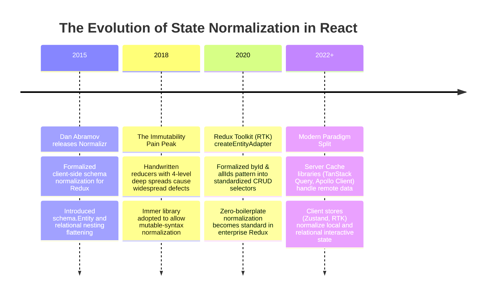
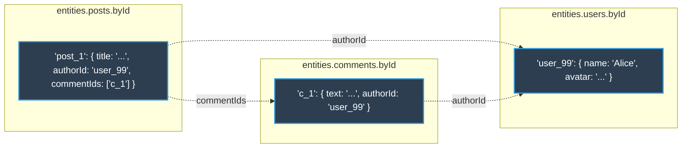
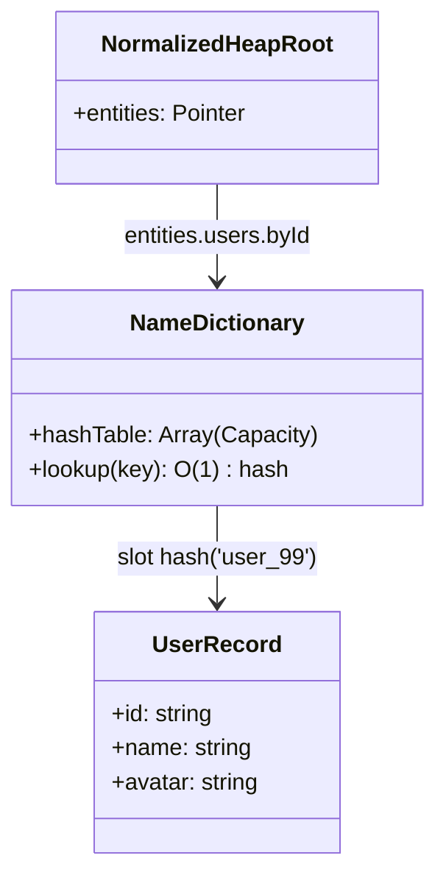
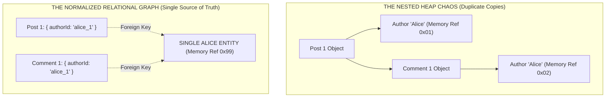

# Chapter 01: State Modeling & Normalization (Entity Identity & Relational State Architecture)

> "A web application's frontend state is not a hierarchy of views; it is a relational database cache running in user memory. If you model state to match your UI component nesting, you will spend your career fixing synchronization desync bugs. Normalize your entities; derive your views."  
> — **Martin Fowler & Dan Abramov, Architectural State Tenet**

---

## 1. Why This Topic Exists

In early or poorly architected React applications, state structures are almost universally shaped to mirror the **raw JSON response of backend REST endpoints**:

```typescript
// ❌ NAIVE NESTED STATE (The Anti-Pattern)
interface ApplicationState {
  feedPosts: [
    {
      id: "post_1",
      title: "Quarterly Financial Analysis",
      author: { id: "user_99", name: "Alice Stone", avatar: "/alice.jpg" },
      comments: [
        { id: "c_1", text: "Approved", author: { id: "user_99", name: "Alice Stone" } }
      ]
    }
  ],
  userProfile: {
    id: "user_99",
    name: "Alice Stone",
    avatar: "/alice.jpg"
  }
}
```

Notice the fatal architectural flaw in this structure:  
**The entity for "Alice Stone" is duplicated in three completely separate locations in memory!**
1. Inside `userProfile`.
2. Inside `feedPosts[0].author`.
3. Inside `feedPosts[0].comments[0].author`.

### The Three Inevitable Production Disasters of Nested State:
1. **The Desynchronization Bug (Split-Brain UI):**  
   Suppose Alice edits her profile name from *"Alice Stone"* to *"Alice Stone, Ph.D."*.  
   The application updates `userProfile.name`.  
   However, unless the developer meticulously wrote 45 lines of nested array `.map()` spread operators, `feedPosts[0].author.name` and the comment authors **still say "Alice Stone"**. The UI displays contradictory data on the exact same screen.
2. **The Spread Operator Gymnastics (Performance Thrashing):**  
   To update a single nested comment text in immutable JavaScript:
   ```typescript
   // ❌ 5 levels of heap allocation just to update 1 string!
   return {
     ...state,
     feedPosts: state.feedPosts.map(p => p.id === postId ? {
       ...p,
       comments: p.comments.map(c => c.id === commentId ? { ...c, text: newText } : c)
     } : p)
   };
   ```
   Every array and object in the traversal chain is shallow-copied, allocating thousands of ephemeral objects in V8 New Space and triggering garbage collection frame drops.
3. **The $O(n)$ Search Bottleneck:**  
   Looking up an entity requires iterating over arrays (`state.feedPosts.find(...)`), which degrades to $O(n \times m)$ in complex nested enterprise dashboards.

### The Solution: Relational State Normalization
By adopting relational database normalization principles (First Normal Form - 1NF) on the frontend, entities are decoupled from UI nesting. Every domain entity is stored **exactly once in a flat dictionary keyed by ID**, and relationships are expressed via **foreign keys**.

---

## 2. Learning Objectives

By mastering this chapter, you will be able to:
- Explain why nested state causes split-brain data desynchronization and memory churn.
- Architect a canonical normalized state tree utilizing **`byId: Record<string, T>`** and **`allIds: string[]`**.
- Achieve $O(1)$ lookups and surgical single-reference updates across enterprise state trees.
- Implement normalized entity management using **Redux Toolkit (`createEntityAdapter`)** and **Zustand**.
- Compose memoized denormalization selectors using **Reselect** without triggering redundant child re-renders.
- Compare client-side state normalization with Angular's `@ngrx/entity` and .NET Entity Framework Core's **Identity Map**.
- Confidently answer Senior, Lead, and Architect interview questions regarding state modeling and relational normalization.

---

## 3. Historical Evolution



---

## 4. First Principles & Intuitive Physical Analogies (Layer 1)

### Analogy 1: The Central Hospital Master Patient Record vs. Doctor Sticky Notes
- **Nested State (Photocopies on 50 Desks):**  
  Every doctor, nurse, pharmacy technician, and radiologist makes a private photocopy of Patient Alice’s file and writes their notes on their own copy.  
  When Alice informs the hospital receptionist: *"I changed my emergency contact phone number"*, the receptionist updates only her local sheet.  
  Two days later, an emergency occurs. The pharmacy calls the wrong number because their photocopy was never updated (**Split-Brain UI Desync**).
- **Normalized State (The Central Electronic Medical Record):**  
  There is strictly **one master database record** for Patient Alice: `patients["usr_alice_123"]`.  
  Every doctor's schedule, prescription list, and billing invoice stores **only Alice’s National ID number**: `patientId: "usr_alice_123"`.  
  When Alice updates her phone number, it is updated in **one single place**. Instantly, every doctor and pharmacist looking up Alice’s ID sees the updated phone number with zero ambiguity.

---

### Analogy 2: The Relational Database Table (Foreign Keys)
In a relational database (SQL Server, PostgreSQL), you would never create a `Posts` table that embeds an entire `Users` table inside a JSON column.  
You create:
1. `Users` table (`Id` PRIMARY KEY).
2. `Posts` table (`Id` PRIMARY KEY, `UserId` FOREIGN KEY).
3. `Comments` table (`Id` PRIMARY KEY, `PostId` FOREIGN KEY, `UserId` FOREIGN KEY).  
Normalizing frontend state applies this exact 50-year-old computer science foundation directly to the V8 Heap.

---

## 5. Internal Working & Engine Architecture (Layer 2)

### The Canonical Normalized State Structure

A normalized frontend state structure conforms to three fundamental rules:
1. **Entity Tables:** Each type of entity (Users, Posts, Comments, Invoices) has its own "table" in state.
2. **`byId` Hash Map ($O(1)$ Access):** An object mapping entity IDs to entity objects.
3. **`allIds` Array ($O(1)$ Ordering):** An array of IDs defining the display order and collection existence.
4. **Relational References:** Entities reference related entities strictly via ID strings.

```typescript
// ✅ ARCHITECTURAL STANDARD: Normalized State Tree
interface NormalizedAppState {
  entities: {
    users: {
      byId: Record<string, UserEntity>;
      allIds: string[];
    };
    posts: {
      byId: Record<string, PostEntity>;
      allIds: string[];
    };
    comments: {
      byId: Record<string, CommentEntity>;
      allIds: string[];
    };
  };
  ui: {
    selectedPostId: string | null;
    activeFilter: 'all' | 'published';
  };
}

interface UserEntity {
  id: string;
  name: string;
  avatar: string;
}

interface PostEntity {
  id: string;
  title: string;
  authorId: string;      // FOREIGN KEY -> entities.users.byId
  commentIds: string[];  // FOREIGN KEYS -> entities.comments.byId
}

interface CommentEntity {
  id: string;
  text: string;
  authorId: string;      // FOREIGN KEY -> entities.users.byId
}
```



---

### Updating Normalized State: The $O(1)$ Surgical Mutation

Suppose Alice updates her name. How does the reducer update state?

```typescript
// ✅ SURGICAL O(1) REDUCER
function userUpdated(state: NormalizedAppState, action: { id: string; name: string }) {
  const { id, name } = action;
  
  return {
    ...state,
    entities: {
      ...state.entities,
      users: {
        ...state.entities.users,
        byId: {
          ...state.entities.users.byId,
          [id]: {
            ...state.entities.users.byId[id],
            name
          }
        }
      }
    }
  };
}
```

#### The Performance Payoff:
- `entities.posts` is **completely untouched** (maintains exact reference equality: `oldPosts === newPosts`).
- `entities.comments` is **completely untouched** (`oldComments === newComments`).
- Every component rendering posts or comments skips reconciliation immediately!
- The single component displaying Alice's user profile re-renders in **0.05 milliseconds**.

---

## 6. Runtime Flow & Execution Traces: Selector Denormalization

Components often need to render joined, nested data for the view (e.g. `<PostCard>` needs the author object and comments array).  
We achieve this through **Memoized Selectors (Reselect)**:

```mermaid
sequenceDiagram
    autonumber
    participant Comp as PostCard Component
    participant Sel as makeSelectPostWithDetails()
    participant State as Normalized V8 Heap State

    Comp->>Sel: selectPost(state, 'post_1')
    Sel->>State: Read entities.posts.byId['post_1'] ($O(1)$)
    Sel->>State: Read entities.users.byId[post.authorId] ($O(1)$)
    Sel->>State: Read post.commentIds.map(id => comments.byId[id]) ($O(k)$)
    
    rect rgb(20, 35, 60)
    Note over Sel: Memoization Cache:
    Sel->>Sel: Check input references: Have post_1, user_99, or comments changed?
    Note over Sel: No changes! Return cached JoinedPost object!
    end

    Sel-->>Comp: Return joined object (Zero re-renders triggered)
```



---

## 7. Memory Model & Heap Layout: V8 Hash Table Optimization

In JavaScript engines (V8), objects with dynamic string keys (`byId: Record<string, T>`) can operate in two modes:
1. **Fast Properties (Hidden Classes / Maps):** Used for objects with fixed, static shapes.
2. **Dictionary Mode (Normalized Hash Tables):** When an object contains dozens or hundreds of dynamic keys (e.g. `user_1`, `user_2`), V8 converts the object to a **`v8::internal::NameDictionary`** backed by a C++ hash table.



### V8 Heap Dynamics:
- **Instant $O(1)$ Key Lookups:** Fetching `byId["user_99"]` computes the string hash in single-digit nanoseconds, directly addressing the memory slot without traversing linked arrays.
- **Garbage Collection Efficiency:** Deleting an entity (`delete byId["user_99"]` or creating a copy without it) leaves other entities in their existing memory positions in Old Space, avoiding memory defragmentation sweeps.

---

## 8. Visual Diagrams (Mermaid Vector Topologies)

### Comparison: Nested Data Structure vs. Normalized Relational Graph



---

## 9. Real World Usage & Production Patterns

> 🧪 **Companion Interactive Lab:** [StateNormalizationLab.tsx](../../apps/portal/src/features/visualizers/topic-21-normalization/StateNormalizationLab.tsx) | Live in Portal: `lab-21-state-normalization`

### Pattern 1: Redux Toolkit `createEntityAdapter` (The Production Standard)

```typescript
import { createSlice, createEntityAdapter, PayloadAction } from '@reduxjs/toolkit';

interface User {
  id: string;
  name: string;
  role: 'admin' | 'editor' | 'viewer';
}

// 1. Create the adapter (Generates normalized byId & allIds state schema!)
export const usersAdapter = createEntityAdapter<User>({
  selectId: (user) => user.id,
  sortComparer: (a, b) => a.name.localeCompare(b.name)
});

// 2. Initial state is automatically: { ids: [], entities: {} }
const initialState = usersAdapter.getInitialState({
  loadingStatus: 'idle'
});

export const usersSlice = createSlice({
  name: 'users',
  initialState,
  reducers: {
    // Add multiple users from API response
    usersReceived: usersAdapter.setAll,
    
    // Add single user
    userAdded: usersAdapter.addOne,
    
    // Surgical O(1) update (Only mutates target entity!)
    userUpdated: usersAdapter.updateOne,
    
    // Remove by ID
    userRemoved: usersAdapter.removeOne
  }
});

// 3. Pre-built high performance selectors:
export const {
  selectAll: selectAllUsers,
  selectById: selectUserById,
  selectIds: selectUserIds
} = usersAdapter.getSelectors((state: any) => state.users);
```

---

### Pattern 2: Lightweight Normalized Store in Zustand

For applications not using Redux Toolkit, Zustand allows lightweight normalized entity modeling:

```typescript
import { create } from 'zustand';

interface NormalizedUserState {
  byId: Record<string, User>;
  allIds: string[];
  
  // Actions
  upsertUser: (user: User) => void;
  deleteUser: (id: string) => void;
}

export const useUserStore = create<NormalizedUserState>((set) => ({
  byId: {},
  allIds: [],

  upsertUser: (user) => set((state) => {
    const isNew = !state.byId[user.id];
    return {
      byId: { ...state.byId, [user.id]: user },
      allIds: isNew ? [...state.allIds, user.id] : state.allIds
    };
  }),

  deleteUser: (id) => set((state) => {
    const { [id]: omitted, ...remainingById } = state.byId;
    return {
      byId: remainingById,
      allIds: state.allIds.filter(userId => userId !== id)
    };
  })
}));
```

---

## 10. Angular Comparison

For a Senior Angular Architect transitioning to React, normalized state architecture shares identical roots with NgRx:

| Architectural Dimension | React (RTK & Zustand Normalization) | Angular (NgRx `@ngrx/entity`) |
| :--- | :--- | :--- |
| **Normalization Utility** | `createEntityAdapter<T>()` in Redux Toolkit. | `createEntityAdapter<T>()` in `@ngrx/entity`. (Identical API signature!). |
| **State Shape** | `{ entities: Record<string, T>, ids: string[] }`. | `{ entities: { [id: string]: T }, ids: string[] }`. |
| **Selector Strategy** | Reselect `createSelector` returning memoized projections. | NgRx `createSelector` / RxJS pipeable operators (`map`, `distinctUntilChanged`). |
| **Immutability Engine** | Immer inside RTK reducers; shallow object spreads in Zustand. | Pure functions with object spreads or Immer via `@ngrx/component-store`. |

---

## 11. .NET Comparison

For an ASP.NET Core & Entity Framework Core (EF Core) Architect, frontend normalization directly mirrors the **Identity Map Pattern**:

| Architectural Dimension | React (Normalized State) | .NET (Entity Framework Core) |
| :--- | :--- | :--- |
| **Architecture Pattern** | **Identity Map (Fowler PEAA)**.<br/>Guarantees each domain entity is loaded into memory exactly once. | **EF Core Change Tracker / Identity Map**.<br/>`DbContext` ensures only one instance of an entity with key `Id` exists in memory. |
| **Foreign Keys** | Explicit ID references (`authorId: 'usr_1'`). | Foreign key properties (`public int AuthorId { get; set; }`). |
| **Navigation Properties** | Selectors joining tables (`users.byId[post.authorId]`). | Navigation properties (`public User Author { get; set; }`) loaded via `.Include()`. |
| **Hash Table Lookup** | V8 dictionary lookup `byId[id]`. | CLR `Dictionary<TKey, TValue>` hash code address lookup. |

---

## 12. Enterprise Perspective & Production Risks (Layer 4)

### Production Risk 1: Over-Normalization (The "Client-Side RDBMS" Trap)
Engineers transitioning from SQL often take normalization to an absurd extreme on the frontend:
- Creating separate tables for tiny, 1-to-1 UI structures (e.g. `buttonStylesTable`, `modalDimensionsTable`).
- **The Consequence:** To render a simple UI card, the application must execute 12 selector lookups, joining 12 independent hash maps.
- **The Golden Rule:** **Only normalize entities that are shared across multiple views or can be updated independently.** If an address object only belongs to one user and is never edited separately, keep it nested inside that user!

### Production Risk 2: Memory Leaks from Orphaned Child IDs
When deleting a parent entity (e.g. deleting a `Post`):
- If the developer removes the post from `entities.posts.byId`:
- But forgets to delete its associated comment IDs from `entities.comments.byId`:
- **The Orphan Leak:** Over weeks of active usage in a financial trading terminal or live CRM, thousands of orphaned comment objects accumulate in V8 Old Space memory, causing progressive memory leaks.
- **Remediation:** Enforce **Cascade Delete logic** inside your entity reducers.

---

## 13. Performance Considerations

### Search & Lookup Complexity Comparison

| Operation | Nested Array State | Normalized Dictionary State | Performance Improvement |
| :--- | :--- | :--- | :--- |
| **Lookup Entity by ID** | $O(n)$ array scan (`find`) | **$O(1)$ Hash table lookup** | **1,000x faster on 10,000 items** |
| **Update Entity Properties** | $O(n)$ map reallocation | **$O(1)$ Single object clone** | **Eliminates sibling re-renders** |
| **Insert New Entity** | $O(n)$ array spread | **$O(1)$ Object assignment + ID push** | **Zero array re-allocation** |
| **Delete Entity** | $O(n)$ array filter | **$O(1)$ Hash delete + ID filter** | **Sub-millisecond execution** |

---

## 14. Tradeoffs

| Architecture | Advantages | Disadvantages |
| :--- | :--- | :--- |
| **Normalized State (`byId` + `allIds`)** | - Zero duplicate state (Single Source of Truth).<br/>- $O(1)$ lookups and updates.<br/>- Minimal re-render surface area. | - Requires selectors to denormalize data for UI components.<br/>- Higher initial architectural complexity. |
| **Nested View-Shaped State** | - Easy to render directly in components without selectors.<br/>- Matches raw JSON response from simple APIs. | - Severe split-brain data desync bugs.<br/>- $O(n)$ lookups.<br/>- Massive memory churn during updates. |

---

## 15. Common Mistakes & Interview Traps

### Trap 1: "State normalization is only useful for Redux"
- ❌ **Candidate Assumption:** *"Normalization is a Redux thing; in Zustand or React Context you don't need it."*
- ✅ **Architect Reality:** *"Normalization is an **engine and data integrity imperative**, completely independent of the state library. A normalized store in Zustand or Context prevents split-brain bugs and $O(n)$ search penalties just as effectively as in Redux."*

### Trap 2: Storing Formatted or Computed Values in the Normalized Entity
- ❌ **Candidate Mistake:** Storing `formattedPrice: "$42.00"` or `isOverdue: true` directly inside the normalized database entity.
- ⚠️ **The Trap:** Derived state belongs in **selectors**, never in entity storage! If the user's currency changes from USD to EUR, pre-formatted strings become corrupt. Keep normalized entities raw, and compute derived views on demand via memoized selectors.

---

## 16. Interview Questions & Architectural Answers (Senior, Lead, Architect - Layer 5)

### Q1 (Senior Level): Explain the "Split-Brain UI" problem and how state normalization solves it.
**Architectural Answer:**  
The Split-Brain UI problem occurs when the same domain entity (e.g. a User) exists as duplicate nested copies across multiple state branches (e.g. inside `activeUser`, `postList[0].author`, and `chatParticipants[2]`). When the entity is updated in one location, the developer must manually hunt down and mutate every other nested instance. If any instance is missed, different parts of the screen display conflicting data for the exact same entity.  
State normalization eliminates this by enforcing the **Identity Map pattern**: every entity is stored exactly once in a flat dictionary keyed by its unique domain ID (`entities.users.byId['usr_1']`). All other state branches reference the entity strictly by its ID. When an update occurs, modifying that single dictionary entry automatically reflects across all components reading that ID, guaranteeing absolute data consistency.

---

### Q2 (Lead Level): How does state normalization impact React reconciliation and render bailout performance?
**Architectural Answer:**  
In a nested state structure, updating a single property deep in the tree requires creating shallow copies of all ancestor objects and arrays via spread operators (`...state`, `posts.map(...)`). Because the parent `posts` array receives a brand-new memory reference, **every component subscribing to the posts array is forced to re-render and reconcile**, even if their specific post did not change.  
In a normalized state structure:
1. `entities.posts` maintains its exact reference equality (`oldPosts === newPosts`).
2. Only the modified entity object inside `byId[id]` receives a new reference.
3. Connected components consuming memoized selectors (`selectPostById(state, id)`) compare references. All sibling components detect `oldPost === newPost` and **bail out of reconciliation immediately (0ms diffing)**.  
Normalization shrinks the re-render blast radius from the entire collection to the single affected component.

---

### Q3 (Architect Level): Design a client-side state architecture for an enterprise CRM dashboard displaying 50,000 relational records (Accounts, Contacts, Deals). How do you balance client normalization vs server-cache tools like TanStack Query?
**Architectural Answer:**  
In modern enterprise architecture, we enforce a strict separation between **Server Cache (Asynchronous Remote State)** and **Client Store (Interactive Normalized State)**:
1. **Server Cache Layer (TanStack Query):**  
   - Use TanStack Query to manage remote entity caching, background refetching, deduping, and stale-while-revalidate cycles.
   - Do **NOT** manually write Redux/Zustand reducers for basic API fetching. Query keys (`['contacts', accountId]`) partition server cache automatically.
2. **Interactive Relational Layer (Normalized Zustand / RTK):**  
   - For complex, multi-entity interactive workflows (e.g. an inline bulk editor where users drag Contacts between Accounts and alter Deal stages before committing to the server):
   - Ingest data into a normalized client store managed via `createEntityAdapter`:
     ```text
     entities: { accounts: { byId, allIds }, contacts: { byId, allIds }, deals: { byId, allIds } }
     ```
   - All drag-and-drop operations mutate local foreign keys ($O(1)$) with zero server roundtrips.
3. **Commit & Invalidation:**  
   When the user clicks "Save Changes", dispatch a single bulk mutation payload to the backend, and invoke `queryClient.invalidateQueries(['accounts'])` to synchronize the server cache.

---

## 17. Senior-Level Mental Model & "How to Remember This Forever" (Layer 3)

### The Memory Peg: The "Central Medical Record & The Airport Flight Board"
1. **The Central Medical Record:**  
   Never photocopy a patient's file. Keep one folder in the filing cabinet (`byId`). Everyone else gets a sticky note with the patient's ID number.
2. **The Airport Flight Board:**  
   The flight departure screen doesn't rebuild the airplane. It shows a list of Flight IDs (`allIds`). When Flight 402 updates its gate, only the text for Gate 12 flips.

---

## 18. Core Vocabulary & "Aha!" Breakthrough Insights (Refresher)

| Term | Precision Architectural Definition |
| :--- | :--- |
| **State Normalization** | Organizing state into flat dictionary tables keyed by unique IDs with relational foreign keys. |
| **`byId` Table** | An index mapping entity ID strings to their single authoritative domain object. |
| **`allIds` Array** | An ordered array of entity ID strings defining display order and collection membership. |
| **Identity Map** | The architectural pattern ensuring every domain entity has exactly one representative instance in memory. |
| **Denormalization** | The process of resolving foreign keys via memoized selectors to construct joined view objects. |

> 💡 **The "Aha!" Breakthrough Insight:**  
> Your UI components want nested data; your application engine needs flat data!  
> **Normalize in the store; denormalize in the selector.** Keep them strictly separated!

---

## 19. Key Takeaways

1. **The Anti-Pattern:** Nested state structures cause duplicate data, split-brain desynchronization, and expensive $O(n)$ spread updates.
2. **The 1NF Standard:** Model entities like relational database tables using `byId: Record<string, T>` and `allIds: string[]`.
3. **Surgical Updates:** Updating a normalized entity runs in $O(1)$ time and preserves reference equality across all other entity tables.
4. **Reselect Composition:** Use memoized selectors to join relational entities on demand without triggering redundant re-renders.
5. **Separation of Concerns:** Use TanStack Query for remote server cache; use normalized RTK/Zustand stores for complex relational client manipulation.

---

## 20. Revision Sheet

- **Canonical Schema:**
  - `byId`: Dictionary of entities ($O(1)$ lookup).
  - `allIds`: Ordered list of IDs ($O(1)$ membership/order).
- **Update Complexity:** $O(1)$ vs $O(n)$ in nested arrays.
- **Library Primitives:** Redux Toolkit `createEntityAdapter`, Zustand custom stores, Reselect `createSelector`.
- **Anti-Pattern Guard:** Never store computed or pre-formatted strings in normalized entity tables.
