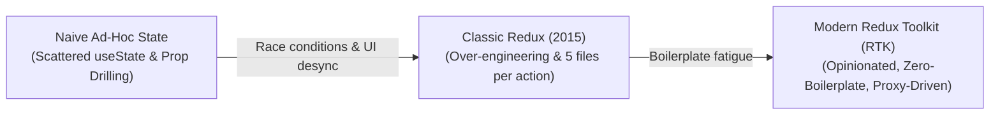
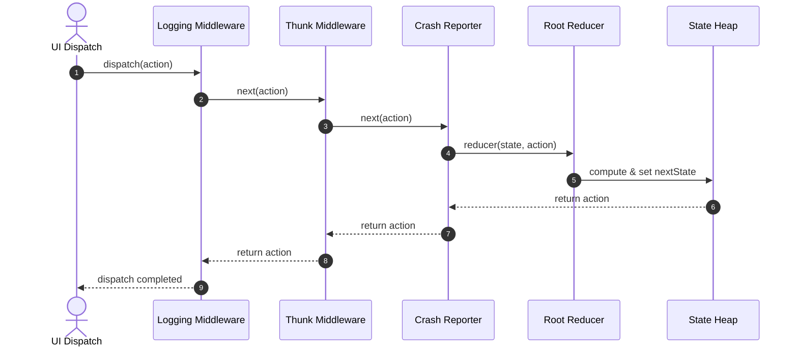
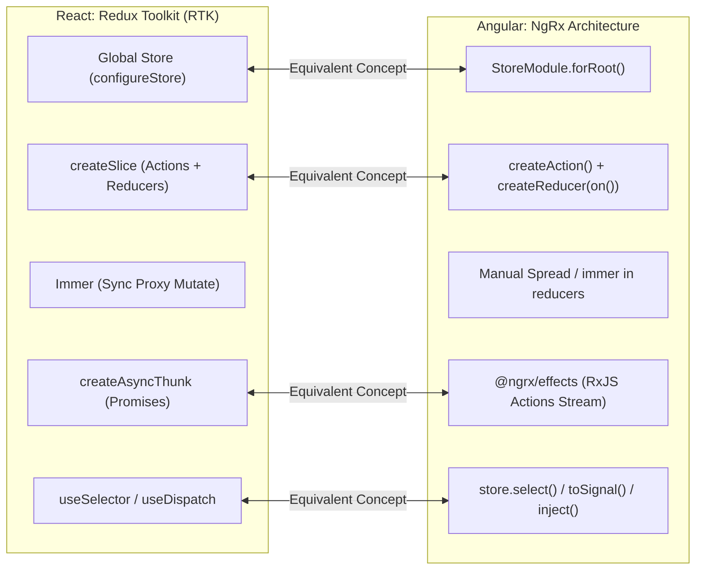
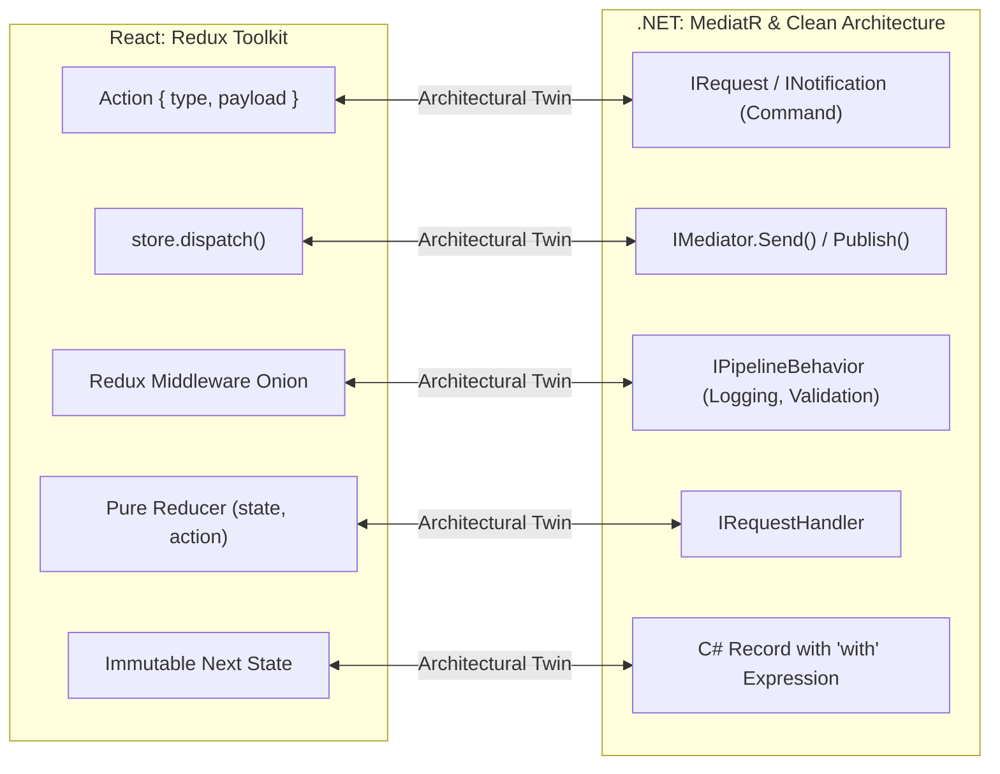

# Chapter 02: Redux Toolkit (RTK) vs. Angular NgRx Architecture (Predictable Unidirectional Data Flow, Proxies, and Enterprise Event-Driven Stores)

> "Those who cannot remember the past are condemned to repeat it; those who mutate shared in-memory state without an audit trail are condemned to debug it at 3:00 AM. Unidirectional data flow is not a syntax preference—it is the only proven mathematical constraint that keeps enterprise client state deterministic."  
> — **Martin Fowler & Dan Abramov, State Architecture Principles**

---

## 1. Why This Topic Exists

In complex enterprise client applications, shared client state is the single greatest source of runtime instability, race conditions, and unrepeatable defects. 

In early React architecture, developers struggled through two opposing extremes:



### The Three Pitfalls of Classic Redux That RTK Solved:
1. **Boilerplate Fatigue (The 5-File Tax):**  
   Adding a single button toggle in classic Redux required modifying:
   - `actionTypes.js` (string constant definitions).
   - `actions.js` (action creator function).
   - `reducer.js` (massive `switch(action.type)` with nested object spread operators).
   - `constants.js` (initial state).
   - `selectors.js` (reselect wrappers).
2. **Accidental In-Place Mutation:**  
   Writing nested immutable updates by hand (`return { ...state, user: { ...state.user, address: { ...state.user.address, zip: '10001' } } }`) was error-prone. A single missed spread operator mutated existing heap memory in place, causing React's reconciler to bail out of rendering because `oldProps === newProps`.
3. **Configuration Chaos:**  
   Setting up Redux DevTools, `redux-thunk`, serialized state invariant checks, and immutable state invariant middleware required dozens of lines of delicate store configuration boilerplate.

**Redux Toolkit (RTK)** was created by the Redux core team as the official, opinionated, standard toolset for Redux development. It integrates **Immer** for seamless copy-on-write proxy updates, automates store configuration via `configureStore`, merges actions and reducers into cohesive **Slices** (`createSlice`), and standardizes asynchronous side-effects through `createAsyncThunk`.

---

## 2. Learning Objectives

By the end of this chapter, an experienced Senior / Staff Engineer will:
- Master the **Unidirectional Data Flow pipeline**: `dispatch(action) -> middleware onion -> pure reducer -> state update -> selector subscription -> UI render`.
- Understand the **internal V8 engine mechanics of Immer 10**: how ES6 `Proxy` trap interception constructs shadow drafts and performs structural sharing copy-on-write operations.
- Construct production-grade state slices using `createSlice`, `createAsyncThunk`, and typed builder callbacks.
- Dissect the **Redux Middleware Onion Architecture** and write custom enterprise middleware for telemetry and audit logging.
- Deep-dive into architectural equivalences between **Redux Toolkit** and **Angular NgRx** (Section 10) and **.NET MediatR / CQRS** (Section 11).
- Identify and mitigate critical production risks: Immer draft leakage, non-serializable payload corruption, and async race conditions.

---

## 3. Historical Evolution

```
2014 (Flux) ───────────► 2015 (Classic Redux) ──► 2019 (Redux Toolkit 1.0) ──► 2024-2026 (RTK 2.0 & React 19)
Multiple stores          Single global store       createSlice + Immer           ESM-first, strict TS 5+
Central Dispatcher       switch-case reducers      createAsyncThunk              Built-in RTK Query
Callback registration    Manual spread operators   configureStore defaults       useSyncExternalStore primitives
```

- **2014 — The Flux Pattern (Facebook):** Facebook introduced unidirectional data flow to eliminate the infamous "ghost unread notification" bug caused by bi-directional data binding in Backbone/MVC. Flux utilized multiple stores and a centralized dispatcher.
- **2015 — Redux (Dan Abramov & Andrew Clark):** Consolidated Flux into a single immutable state tree governed by pure mathematical reducer functions `(state, action) => newState`. Introduced the time-travel debugging revolution via the Redux DevTools.
- **2016–2018 — The Boilerplate Crisis:** As codebases grew, hand-written Redux became synonymous with boilerplate fatigue. Teams turned to Redux-Saga, Redux-Thunk, and Ducks patterns with conflicting conventions.
- **2019 — Redux Toolkit (RTK 1.0):** Standardized best practices out-of-the-box: `createSlice`, auto-generated action creators, integrated Immer, and `createEntityAdapter`.
- **2021 — RTK Query:** Introduced built-in data fetching and server caching, eliminating the need for hand-written async loading slices for REST/GraphQL endpoints.
- **2024–2026 — RTK 2.0 & React 19 Integration:** Fully ESM-native, Immer 10 optimization, automated memoization alignment with the React 19 Compiler, and zero-allocation selector subscriptions via `useSyncExternalStore`.

---

## 4. First Principles & Intuitive Physical Analogies (Layer 1)

### Metaphor 1: The Corporate Accounting Ledger & The Certified Auditing Clerk
Imagine a billion-dollar commercial bank:
- Nobody—not even the CEO—is permitted to walk into the vault with a pen and cross out the account balance written in the ledger book (*No Direct State Mutation*).
- To deposit or transfer money, a customer must fill out a standardized **Transaction Slip** specifying what should happen and the exact parameters (*The Action*: `{ type: 'account/deposit', payload: 1000 }`).
- The slip is handed through a security window to a **Certified Auditing Clerk** (*The Reducer*).
- The clerk reads the previous page of the ledger, turns to a **pristine, brand-new page**, writes down the previous balance plus the deposit, and stamps it (*Pure Function returning a brand-new Immutable State reference*).
- If an auditor demands proof of how the balance reached $1,000,000, the bank replays every stamped transaction slip from day one (*Time-Travel Debugging & Deterministic Replay*).

### Metaphor 2: The Architect's Tracing Paper (Immer Copy-on-Write)
Suppose an architect has a master blueprint of a 100-story skyscraper:
- If the client wants to redesign the windows on floor 42, erasing lines on the original blueprint risks tearing the parchment (*Mutating shared memory in place*).
- Instead, the architect places a **transparent sheet of tracing paper** over the blueprint (*The Immer Draft Proxy*).
- The architect sketches the new windows directly on the tracing paper (*Imperative mutation syntax: `draft.floors[42].windows = 'double-glazed'`*).
- When done, the blueprint scanner analyzes the modifications:
  - Floors 1 through 41 and 43 through 100 were never touched; the scanner reuses their original blueprint references directly (*Structural Sharing*).
  - Only floor 42 and the master binding are reprinted (*Surgical Allocation*).

### Metaphor 3: The Airport Baggage Inspection Line (Redux Middleware Onion)
When an action is dispatched, it does not strike the reducer immediately:
- The dispatched action is a piece of luggage traveling down an airport conveyor belt.
- It passes through consecutive inspection tunnels (*Middleware*):
  1. *Tunnel 1 (Logger):* Scans and prints the luggage barcode to the console.
  2. *Tunnel 2 (Auth Check):* Confirms the passenger holds a valid security credential.
  3. *Tunnel 3 (Async Thunk):* Diverts oversized luggage to a holding area while awaiting customs clearance.
- Only when all inspection tunnels call `next(action)` does the luggage arrive at the final cargo hold (*The Reducer*).

---

## 5. Internal Working & Engine Architecture (Layer 2)

```mermaid
flowchart TD
    subgraph ReduxToolkitEngine ["Redux Toolkit Core Engine Architecture"]
        UI["React Component (useSelector / useDispatch)"] -->|dispatch(action)| MW1["Middleware 1 (Logger)"]
        MW1 -->|next(action)| MW2["Middleware 2 (Async Thunk)"]
        MW2 -->|next(action)| MW3["Middleware N"]
        MW3 --> Reducer["Root Reducer Function"]
        
        subgraph ImmerKernel ["Immer Copy-on-Write Engine"]
            Reducer --> Draft["new Proxy(currentState, Traps)"]
            Draft -->|Mutations Recorded| Traps["Proxy 'set' & 'get' Traps"]
            Traps --> FinishDraft["finishDraft() Analysis"]
            FinishDraft -->|Produce Next State| NextState["Immutable Next State (Structural Sharing)"]
        end
        
        NextState --> Store["Store (currentState = NextState)"]
        Store --> Listeners["Notify Registered Listeners (useSyncExternalStore)"]
        Listeners --> UI
    end
```

### 1. The Redux Store Closure Kernel
At its foundational runtime layer, the Redux store is implemented as a functional closure encapsulating private state variables:

```typescript
function createStore(reducer, preloadedState, enhancer) {
  if (enhancer) {
    return enhancer(createStore)(reducer, preloadedState);
  }

  let currentReducer = reducer;
  let currentState = preloadedState;
  let currentListeners = new Set<() => void>();
  let isDispatching = false;

  function getState() {
    if (isDispatching) {
      throw new Error('Reducers may not dispatch actions.');
    }
    return currentState;
  }

  function subscribe(listener: () => void) {
    currentListeners.add(listener);
    return function unsubscribe() {
      currentListeners.delete(listener);
    };
  }

  function dispatch(action: { type: string; payload?: unknown }) {
    if (isDispatching) {
      throw new Error('Reducers may not dispatch actions.');
    }
    try {
      isDispatching = true;
      currentState = currentReducer(currentState, action);
    } finally {
      isDispatching = false;
    }

    // Synchronous notification of all active component subscriptions
    for (const listener of currentListeners) {
      listener();
    }
    return action;
  }

  // Prime the initial state tree
  dispatch({ type: '@@redux/INIT' });

  return { getState, subscribe, dispatch };
}
```

### 2. Immer Proxy Mechanics Under the Hood
Redux Toolkit wraps every reducer case inside Immer's `createNextState` (`produce`):

```typescript
// Simplified Conceptual Immer Engine
function produce(baseState: any, recipe: (draft: any) => void) {
  const modified = new Map<any, any>();
  const proxies = new Map<any, any>();

  function createProxy(base: any) {
    if (typeof base !== 'object' || base === null) return base;
    if (proxies.has(base)) return proxies.get(base);

    const handler: ProxyHandler<any> = {
      get(target, prop) {
        const value = modified.has(target) ? modified.get(target)[prop] : target[prop];
        return createProxy(value); // Lazy proxying on demand
      },
      set(target, prop, value) {
        if (!modified.has(target)) {
          // Shallow copy allocated on the first write
          modified.set(target, Object.assign({}, target));
        }
        modified.get(target)[prop] = value;
        return true;
      }
    };

    const proxy = new Proxy(base, handler);
    proxies.set(base, proxy);
    return proxy;
  }

  const rootProxy = createProxy(baseState);
  recipe(rootProxy);

  // Structural sharing pass: reconstruct tree reusing unmodified branches
  function finalize(base: any) {
    if (!modified.has(base)) return base;
    const copy = modified.get(base);
    for (const key of Object.keys(copy)) {
      copy[key] = finalize(copy[key]);
    }
    return Object.freeze(copy);
  }

  return finalize(baseState);
}
```

---

## 6. Runtime Flow & Execution Traces

Let us trace the complete execution lifecycle when a user clicks a button to execute `dispatch(fetchOrderById('ord_101'))`:

```
[UI Component: onClick]
       │
       ▼
1. dispatch(fetchOrderById('ord_101'))
       │
       ▼
2. Redux Thunk Middleware Intercepts
   ├── Dispatches: fetchOrderById.pending (Sync Action)
   │     ├── Root Reducer runs -> Immer draft marks `loading = true`
   │     └── Listeners notified -> UI displays Spinner
   │
   └── Executes Payload Creator: async (orderId, { rejectWithValue }) => { ... }
         │
         ▼
3. HTTP Network Request executes via Fetch/Axios (Asynchronous IO)
   ├── Success (HTTP 200 OK)
   │     │
   │     ▼
   │   Dispatches: fetchOrderById.fulfilled(response.data)
   │     ├── Immer modifies `orders.byId[ord_101]` & sets `loading = false`
   │     ├── Store pointer updates: currentState = nextState
   │     └── useSyncExternalStore fires -> useSelector extracts order -> Component renders Order Details
   │
   └── Failure (HTTP 500 / Network Error)
         │
         ▼
       Dispatches: fetchOrderById.rejected(error)
         ├── Immer sets `error = action.payload` & `loading = false`
         └── UI displays Error Alert
```

---

## 7. Memory Model & Heap Layout

```
V8 Heap Before Dispatch:
[Root State @ 0x1000]
 ├── auth: [AuthSlice @ 0x2000] (user: "Alice", token: "xyz")
 ├── settings: [SettingsSlice @ 0x3000] (theme: "dark")
 └── orders: [OrdersSlice @ 0x4000]
      ├── ids: ["ord_1"] @ 0x4100
      └── byId: {"ord_1": {...}} @ 0x4200

User Dispatches: orders/addOrder({ id: "ord_2", ... })

V8 Heap After Dispatch (Structural Sharing):
[Root State @ 0x9000] (NEW POINTER)
 ├── auth: [AuthSlice @ 0x2000]  <─── EXACT SAME POINTER (0 bytes allocated)
 ├── settings: [SettingsSlice @ 0x3000] <─── EXACT SAME POINTER (0 bytes allocated)
 └── orders: [OrdersSlice @ 0x8000] (NEW POINTER)
      ├── ids: ["ord_1", "ord_2"] @ 0x8100 (NEW ARRAY)
      └── byId: {"ord_1": [REUSED @ 0x4200], "ord_2": [NEW @ 0x8200]}
```

### The V8 Garbage Collection Advantage:
Because `auth` and `settings` are completely untouched, V8 does not allocate a single new byte for their memory structures. React components subscribed to `state.auth` via `useSelector(state => state.auth)` verify `oldAuth === newAuth` via pure pointer equality (`0x2000 === 0x2000`) and **completely abort reconciliation in 0 microseconds**.

---

## 8. Visual Diagrams

### Redux Middleware Onion Architecture
The middleware pipeline forms concentric execution layers around the central store:



---

## 9. Real World Usage & Production Patterns

> 🧪 **Companion Interactive Lab:** [VisualizerHub.tsx](../../apps/portal/src/features/visualizers/VisualizerHub.tsx) | Live in Portal: `lab-21-state-normalization`

Here is a 100% self-contained, publication-grade production architecture implementing typed slices, normalized entities, asynchronous thunks, custom middleware, and strict hook typing:

```typescript
// ============================================================================
// 1. TYPED REDUX TOOLKIT CORE CONFIGURATION
// ============================================================================
import { 
  configureStore, 
  createSlice, 
  createAsyncThunk, 
  createEntityAdapter,
  PayloadAction,
  Middleware
} from '@reduxjs/toolkit';
import { TypedUseSelectorHook, useDispatch, useSelector } from 'react-redux';

// Entity Schema
export interface OrderItem {
  id: string;
  customerName: string;
  totalAmount: number;
  status: 'PENDING' | 'SHIPPED' | 'DELIVERED';
  createdAt: string;
}

// 2. NORMALIZED ENTITY ADAPTER
export const ordersAdapter = createEntityAdapter<OrderItem, string>({
  selectId: (order) => order.id,
  sortComparer: (a, b) => b.createdAt.localeCompare(a.createdAt)
});

// 3. ASYNCHRONOUS THUNK WITH ABORT SIGNAL & REJECT WITH VALUE
export const fetchOrderById = createAsyncThunk<
  OrderItem,
  string,
  { rejectValue: string }
>(
  'orders/fetchById',
  async (orderId, { rejectWithValue, signal }) => {
    try {
      const response = await fetch(`/api/v1/orders/${orderId}`, { signal });
      if (!response.ok) {
        return rejectWithValue(`Server returned HTTP ${response.status}`);
      }
      return (await response.json()) as OrderItem;
    } catch (err: unknown) {
      if (err instanceof Error && err.name === 'AbortError') {
        return rejectWithValue('Request was aborted');
      }
      return rejectWithValue('Network communication failure');
    }
  }
);

// 4. ORDER SLICE DEFINITION (IMMER COPY-ON-WRITE)
export interface OrdersSliceState {
  loading: boolean;
  error: string | null;
  activeFilter: 'ALL' | 'PENDING' | 'SHIPPED';
}

export const ordersSlice = createSlice({
  name: 'orders',
  initialState: ordersAdapter.getInitialState<OrdersSliceState>({
    loading: false,
    error: null,
    activeFilter: 'ALL'
  }),
  reducers: {
    setFilter(state, action: PayloadAction<OrdersSliceState['activeFilter']>) {
      // Immer allows direct mutation syntax!
      state.activeFilter = action.payload;
    },
    orderStatusUpdated(state, action: PayloadAction<{ id: string; status: OrderItem['status'] }>) {
      ordersAdapter.updateOne(state, {
        id: action.payload.id,
        changes: { status: action.payload.status }
      });
    },
    orderRemoved: ordersAdapter.removeOne
  },
  extraReducers: (builder) => {
    builder
      .addCase(fetchOrderById.pending, (state) => {
        state.loading = true;
        state.error = null;
      })
      .addCase(fetchOrderById.fulfilled, (state, action) => {
        state.loading = false;
        ordersAdapter.upsertOne(state, action.payload);
      })
      .addCase(fetchOrderById.rejected, (state, action) => {
        state.loading = false;
        state.error = action.payload ?? 'Failed to load order';
      });
  }
});

// 5. CUSTOM ENTERPRISE TELEMETRY MIDDLEWARE
export const telemetryMiddleware: Middleware = storeAPI => next => action => {
  const start = performance.now();
  const result = next(action);
  const duration = performance.now() - start;

  if (duration > 16.6) {
    console.warn(`[PERF ALERT] Action ${(action as any).type} took ${duration.toFixed(2)}ms (dropped frame!)`);
  }
  return result;
};

// 6. STORE CREATION
export const store = configureStore({
  reducer: {
    orders: ordersSlice.reducer
  },
  middleware: (getDefaultMiddleware) =>
    getDefaultMiddleware({
      serializableCheck: {
        // Warn if non-serializable objects (Functions, Promises) enter actions
        warnAfter: 128
      }
    }).concat(telemetryMiddleware)
});

// 7. INFERRED TYPE EXPORTS & CUSTOM HOOKS
export type RootState = ReturnType<typeof store.getState>;
export type AppDispatch = typeof store.dispatch;

export const useAppDispatch = () => useDispatch<AppDispatch>();
export const useAppSelector: TypedUseSelectorHook<RootState> = useSelector;

// 8. TYPED SELECTORS
export const ordersSelectors = ordersAdapter.getSelectors<RootState>(
  (state) => state.orders
);
```

---

## 10. Angular Comparison (Quarantined)

For Senior and Lead Engineers with deep background in **Angular**, **NgRx**, and **RxJS**, the following architectural bridges map Redux Toolkit concepts to the Angular ecosystem:



### Deep Architectural Comparison Matrix

| Dimension | Redux Toolkit (React) | Angular NgRx (`@ngrx/store`) |
| :--- | :--- | :--- |
| **Primary Paradigm** | Functional JavaScript + ES6 Proxy mutation (`Immer`). | Reactive Streams (`RxJS` Observables) + Functional Reducers. |
| **Side Effect Mechanism** | Asynchronous Thunks (`createAsyncThunk`) running standard Promises. | **NgRx Effects** (`@ngrx/effects`) listening to the global `Actions` stream via RxJS operators (`switchMap`, `exhaustMap`). |
| **Cancellation & Concurrency** | Manual `AbortController` signal passed via Thunk API. | Declarative RxJS flattening operators (`switchMap` for cancellation, `exhaustMap` for button debouncing). |
| **Action & Reducer Coupling** | **Unified Slice** (`createSlice` generates both action creators and reducers together). | Historically separated: `createAction`, `createReducer(initialState, on(...))`. Unified in newer NgRx SignalStore. |
| **Component Subscription** | `useSelector(selector)` integrated with React's `useSyncExternalStore`. | `store.select(selector)` returning `Observable<T>`, consumed via `async` pipe or `toSignal()`. |
| **Local / Feature State** | Handled via React Context, Zustand, or dynamic `reducerManager`. | **NgRx ComponentStore** or modern **NgRx SignalStore** (`signalStore()`). |
| **Zone.js / Change Detection** | Pure reference comparison (`Object.is`) triggers Fiber work loop. | Emitting on an Observable triggers Zone.js microtask check or signals dirty marking in zoneless Angular. |
| **Boilerplate Level** | Very Low (`createSlice` handles types, actions, and reducers in ~20 lines). | Moderate to High (Requires Actions, Reducers, Effects classes, and Module registrations). |

### Code Comparison: Redux Async Thunk vs. NgRx Effect

#### React Redux Toolkit Async Thunk:
```typescript
export const loadUserProfile = createAsyncThunk(
  'user/loadProfile',
  async (userId: string, { rejectWithValue, signal }) => {
    const res = await fetch(`/api/users/${userId}`, { signal });
    if (!res.ok) return rejectWithValue('User not found');
    return res.json();
  }
);
```

#### Angular NgRx Effect (RxJS):
```typescript
@Injectable()
export class UserEffects {
  private actions$ = inject(Actions);
  private userService = inject(UserService);

  loadUserProfile$ = createEffect(() =>
    this.actions$.pipe(
      ofType(UserActions.loadUserProfile),
      switchMap(({ userId }) =>
        this.userService.getUser(userId).pipe(
          map(user => UserActions.loadUserProfileSuccess({ user })),
          catchError(err => of(UserActions.loadUserProfileFailure({ error: err.message })))
        )
      )
    )
  );
}
```

---

## 11. .NET Comparison (Quarantined)

For Backend and Distributed Systems Architects transitioning from **.NET / ASP.NET Core**, Redux Toolkit maps directly to **CQRS (Command Query Responsibility Segregation)**, **MediatR**, and **Event Sourcing**:



### Deep Architectural Comparison Matrix

| Dimension | Redux Toolkit (React) | .NET / ASP.NET Core (CQRS & MediatR) |
| :--- | :--- | :--- |
| **Message Dispatch** | `store.dispatch(action)` broadcasts an immutable message. | `mediator.Send(command)` or `mediator.Publish(notification)` via `MediatR`. |
| **Execution Flow** | Synchronous traversal through the Middleware onion down to the reducer. | Pipeline execution through registered `IPipelineBehavior<TRequest, TResponse>`. |
| **State Immutability** | Immer ES6 Proxy copy-on-write trees. | C# 9+ **Records** with non-destructive mutation using `with` expressions (`user with { Name = "Alice" }`). |
| **Event Sourcing Audit** | Time-Travel Debugging (replay action sequence to recreate state). | Event Sourcing via Marten / EventStoreDB (rehydrate aggregate from domain events). |
| **Memory Allocation** | V8 heap young generation allocation; garbage collected via Cheney's Scavenger. | CLR Gen0 allocation; highly optimized GC with value types (`readonly struct`) for zero heap allocations. |
| **Validation Layer** | RTK `serializableStateInvariantMiddleware` / custom Zod schema middleware. | FluentValidation integrated inside MediatR `ValidationBehavior`. |

### Code Comparison: Redux Reducer vs. C# MediatR Handler

#### React Redux Toolkit Reducer:
```typescript
const bankSlice = createSlice({
  name: 'bank',
  initialState: { balance: 0, transactions: [] },
  reducers: {
    deposit(state, action: PayloadAction<{ amount: number; memo: string }>) {
      state.balance += action.payload.amount;
      state.transactions.push(action.payload.memo);
    }
  }
});
```

#### C# MediatR Command Handler with Record Copy-on-Write:
```csharp
public record DepositCommand(decimal Amount, string Memo) : IRequest<BankState>;

public record BankState(decimal Balance, ImmutableList<string> Transactions);

public class DepositCommandHandler : IRequestHandler<DepositCommand, BankState>
{
    private readonly IStateStore _store;

    public async Task<BankState> Handle(DepositCommand command, CancellationToken ct)
    {
        var currentState = await _store.GetStateAsync(ct);
        
        // C# Non-Destructive Mutation (Copy-on-Write)
        var nextState = currentState with
        {
            Balance = currentState.Balance + command.Amount,
            Transactions = currentState.Transactions.Add(command.Memo)
        };

        await _store.SaveStateAsync(nextState, ct);
        return nextState;
    }
}
```

---

## 12. Enterprise Perspective & Production Risks (Layer 4)

In mission-critical enterprise systems, mismanaging Redux Toolkit leads to catastrophic failure modes:

### Production Risk 1: The Accidental Return & Mutate Conflict in Immer
Immer allows either mutating the draft **OR** returning a new object, but **NEVER BOTH**:

```typescript
// ❌ CATASTROPHIC RUNTIME CRASH
updateUser(state, action) {
  state.lastUpdated = Date.now(); // Mutated draft
  return action.payload;          // Returned new object -> RUNTIME ERROR!
}

// ✅ CORRECT: Either mutate the draft
updateUser(state, action) {
  Object.assign(state, action.payload);
  state.lastUpdated = Date.now();
}

// ✅ OR return a replacement without touching the draft
updateUser(state, action) {
  return { ...action.payload, lastUpdated: Date.now() };
}
```

### Production Risk 2: Non-Serializable Objects in State
Placing Promises, Symbols, functions, or class instances (e.g. `new Date()`, Axios cancel tokens) into Redux state breaks:
1. **Redux DevTools Time Travel:** Replaying actions cannot deserialize functions.
2. **Web Worker Offloading:** `postMessage` cannot structured-clone functions.
3. **Hydration from SSR:** `JSON.stringify()` silently wipes out non-serializable fields.

### Production Risk 3: Asynchronous Race Conditions in Search Sliders
When a user types rapidly into a search bar, dispatching multiple thunks creates a classic asynchronous race condition where an earlier, slow request completes **after** a later, fast request:

```typescript
// ❌ RACE CONDITION: Slow query overwrites fast query
export const searchProducts = createAsyncThunk(
  'products/search',
  async (query: string) => fetch(`/api/search?q=${query}`).then(r => r.json())
);

// ✅ FIX: Leverage AbortSignal provided by RTK
export const searchProductsSafe = createAsyncThunk(
  'products/search',
  async (query: string, { signal }) => {
    const response = await fetch(`/api/search?q=${query}`, { signal });
    return response.json();
  }
);
```

---

## 13. Performance Considerations

1. **Immer Overhead on Huge Arrays (100,000+ Items):**  
   Immer's proxy creation incurs approximately a **2x to 3x CPU overhead** compared to raw hand-written array slices. When manipulating arrays with over 50,000 items, bypass Immer by returning a raw frozen array or utilize normalized `byId` lookup dictionaries via `createEntityAdapter`.
2. **Selector Reference Equality (`useSelector` vs. Reselect):**  
   Returning a new array or object literal directly from a selector causes components to re-render on **every single dispatched action**:
   ```typescript
   // ❌ CRITICAL BUG: Creates a new array reference on EVERY action dispatch!
   const activeUsers = useAppSelector(state => 
     state.users.allIds.filter(id => state.users.byId[id].isActive)
   );

   // ✅ FIX: Memoize via createSelector
   const selectActiveUsers = createSelector(
     [(state: RootState) => state.users.allIds, (state: RootState) => state.users.byId],
     (allIds, byId) => allIds.filter(id => byId[id].isActive)
   );
   ```

---

## 14. Tradeoffs

| Choice | Advantages | Disadvantages |
| :--- | :--- | :--- |
| **Redux Toolkit (RTK)** | Single authoritative source of truth, time-travel debugging, deterministic audit logs, battle-tested in enterprise multi-team codebases. | Boilerplate is higher than atomic libraries (Zustand), Immer CPU tax on massive datasets, steep conceptual learning curve for junior developers. |
| **Zustand (Atomic Store)** | Zero boilerplate, tiny bundle size (~1 KB), hooks-based, no Providers required. | Harder to enforce strict architectural conventions across 50+ enterprise developers; lacks built-in time-travel devtools suite. |
| **TanStack Query (Server State)** | Eliminates 90% of client async thunk boilerplate, automated cache invalidation, deduplication. | Only manages server-synchronized cache; cannot coordinate complex client-only state machines (e.g. multi-step form wizards). |

---

## 15. Common Mistakes & Interview Traps

- **Trap 1: "Is Immer mutating the actual original state in place?"**  
  *Answer:* No. Immer wraps the base state in a native ES6 `Proxy`. When you write `state.user.name = 'Bob'`, the `set` trap intercepts the operation, creates a shallow copy of the target object on the V8 heap, and flags the path as modified. The original state remains 100% frozen and untouched.
- **Trap 2: "Can you dispatch an action inside a Reducer?"**  
  *Answer:* Absolutely not. Reducers are pure mathematical functions: `State_next = f(State_current, Action)`. Redux will explicitly throw an error if `isDispatching === true`. Dispatches inside reducers produce infinite cascading loops and non-deterministic state side-effects.
- **Trap 3: "Is `store.dispatch` asynchronous?"**  
  *Answer:* Standard `dispatch(action)` is **100% synchronous**. It synchronously runs the entire middleware chain, invokes the reducer, updates `currentState`, and notifies subscribers. It only appears asynchronous when intercepted by a middleware like `redux-thunk` that returns a Promise.

---

## 16. Interview Questions & Architectural Answers (Senior, Lead, Architect - Layer 5)

### Q1 (Senior Level): How does `useSelector` determine whether a component must re-render?
**Architectural Answer:**  
`useSelector` internally subscribes to the Redux store via React 18's `useSyncExternalStoreWithSelector`. Whenever any action is dispatched anywhere in the store:
1. `useSelector` runs the supplied selector function against `store.getState()`.
2. It compares the newly selected value against the previously cached value using strict reference equality (`Object.is` or custom equality function).
3. If the reference is strictly identical (`oldValue === newValue`), the hook silently bails out and React **does not schedule a render pass**.
4. If the reference changed, it notifies the React Fiber reconciler to schedule a render on that component's lane.

### Q2 (Lead Level): How would you write a custom Redux middleware to enforce schema validation on actions?
**Architectural Answer:**  
```typescript
import { Middleware } from '@reduxjs/toolkit';
import { z } from 'zod';

const ActionSchema = z.object({
  type: z.string(),
  payload: z.unknown().optional(),
  meta: z.record(z.unknown()).optional()
});

export const schemaValidatorMiddleware: Middleware = store => next => action => {
  const result = ActionSchema.safeParse(action);
  if (!result.success) {
    console.error('[SCHEMA VIOLATION] Action failed schema validation:', result.error.format());
    throw new Error(`Invalid action payload dispatched: ${(action as any).type}`);
  }
  return next(action);
};
```

### Q3 (Architect Level): How do you design state architecture for a multi-tenant enterprise portal combining Server State and Client State?
**Architectural Answer:**  
In modern enterprise architecture, a Staff Architect enforces the **Dual-Store Boundary**:
1. **Server State (TanStack Query / RTK Query):** 90% of state is simply a cached reflection of backend databases. This is managed exclusively by RTK Query / TanStack Query, which handles background refetching, cache TTL, optimistic UI updates, and deduplication.
2. **Client State (Redux Toolkit):** Only true client-owned state resides in Redux: active filters, multi-step checkout drafts, offline transaction queues, and cross-cutting UI mode flags.
3. This separation prevents Redux from degenerating into a bloated, manual API cache while preserving its strengths for deterministic business logic.

---

## 17. Senior-Level Mental Model & "How to Remember This Forever" (Layer 3)

### The Three Anchors:
1. **The Museum Blueprint Rule:**  
   The Redux state is a fragile, priceless manuscript locked inside a glass case in the museum. You never touch it with ink. Immer gives you a sheet of tracing paper (the draft). When you are done drawing, the museum archives print a fresh edition containing only the modified pages.
2. **The Middleware Onion:**  
   Every action dispatched must peel through the layers of the onion from the outside in (logging -> auth -> thunks -> reducer) and bubble back out.
3. **The Pure Function Postulate:**  
   A Redux store is nothing more than a fold (reduction) over time:  
   `State = Actions.reduce((currentState, action) => reducer(currentState, action), initialState)`

---

## 18. Core Vocabulary & "Aha!" Breakthrough Insights (Refresher)

- **Action:** An immutable plain JavaScript object containing a mandatory string `type` and optional `payload` describing *what occurred*.
- **Reducer:** A pure, deterministic mathematical function with signature `(state, action) => newState`.
- **Slice:** A cohesive Redux Toolkit module bundling action creators, action types, and reducer logic into a single declaration.
- **Immer Draft:** A temporary ES6 `Proxy` wrapping the current state, recording imperative mutations to compute an immutable next state via copy-on-write.
- **Structural Sharing:** Reusing pointers to unmodified subtrees in memory to achieve $O(1)$ allocations on untouched branches.
- **Thunk:** A delayed computation function returned from an action creator that receives `(dispatch, getState)` to execute asynchronous side-effects.

---

## 19. Key Takeaways

1. **Redux Toolkit is the modern standard for Redux:** Never write classic Redux with manual string action types and switch statements.
2. **Immer eliminates spread operator gymnastics:** Write clean imperative code (`state.todos.push(item)`) that compiles to safe copy-on-write immutable heap allocations.
3. **Redux state is synchronous and deterministic:** The reducer is a pure mathematical calculation. Side effects belong strictly in Middleware and Thunks.
4. **Architectural Equivalence:** Redux Slices map to NgRx Features; Thunks map to NgRx Effects and .NET MediatR Handlers; Middleware maps to ASP.NET Core `IPipelineBehavior`.

---

## 20. Revision Sheet

```
┌────────────────────────────────────────────────────────────────────────┐
│                   REDUX TOOLKIT (RTK) CHEAT SHEET                      │
├───────────────────────────────┬────────────────────────────────────────┤
│ Configuration                 │ configureStore({ reducer, middleware })│
├───────────────────────────────┼────────────────────────────────────────┤
│ Slice Declaration             │ createSlice({ name, initialState,      │
│                               │   reducers, extraReducers })           │
├───────────────────────────────┼────────────────────────────────────────┤
│ Normalized Entities           │ createEntityAdapter({ selectId })      │
│                               │ adapter.addOne, adapter.upsertMany     │
├───────────────────────────────┼────────────────────────────────────────┤
│ Asynchronous Operations       │ createAsyncThunk('type', async (arg,   │
│                               │   { rejectWithValue, signal }) => ...) │
├───────────────────────────────┼────────────────────────────────────────┤
│ Performance Invariant         │ NEVER return new object reference from │
│                               │ inline useSelector. Use createSelector │
├───────────────────────────────┼────────────────────────────────────────┤
│ Immer Safety Rule             │ Mutate draft OR return replacement.    │
│                               │ NEVER do both in the same reducer case!│
└───────────────────────────────┴────────────────────────────────────────┘
```
