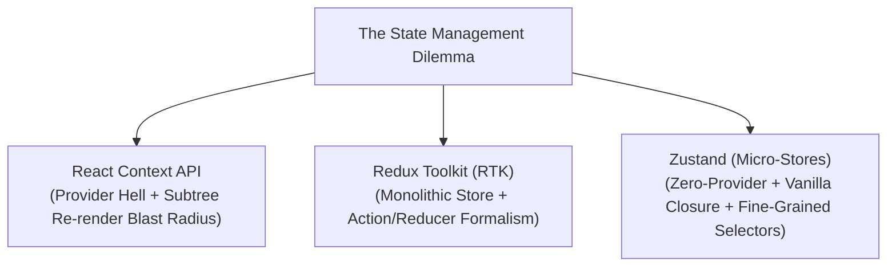
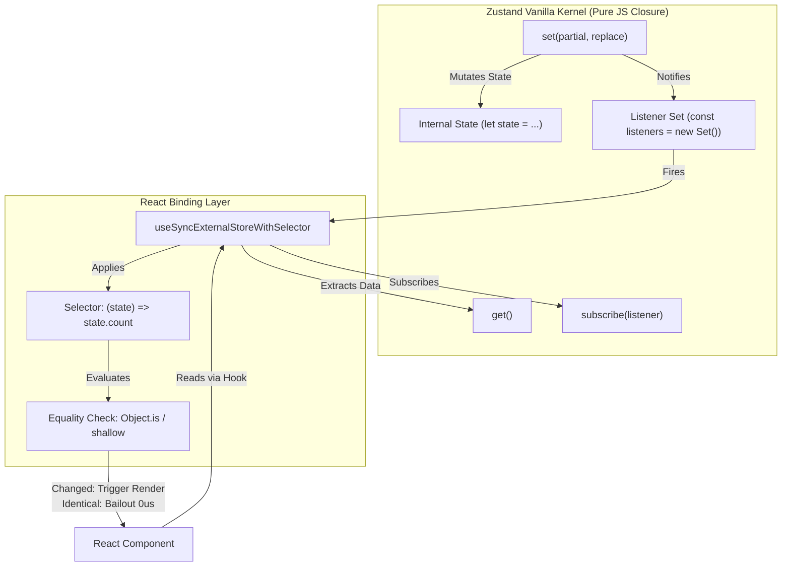
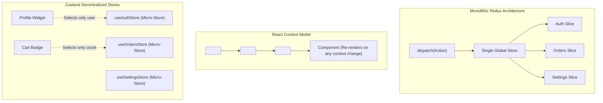
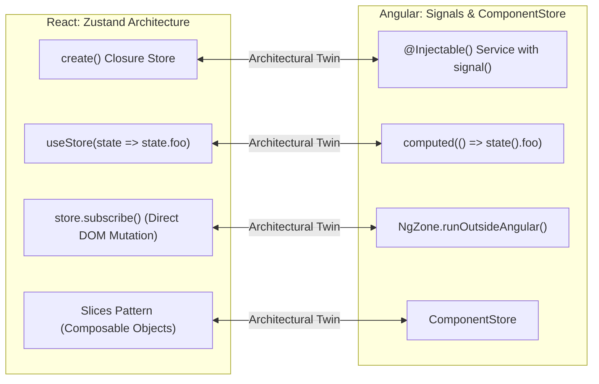
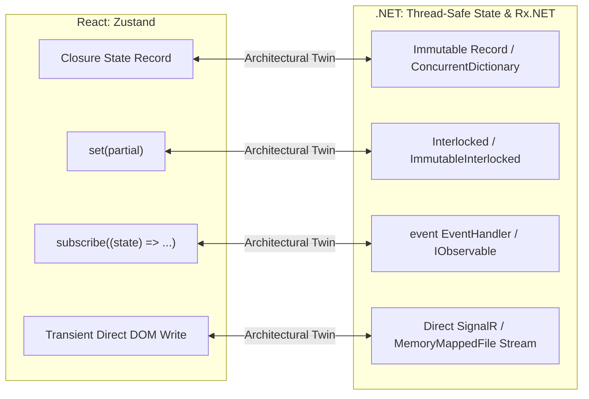

# Chapter 03: Zustand & Atomic State Management (Decentralized State, Micro-Stores, and Subscription Optimization)

> "The original sin of frontend architecture was assuming that all global state must live in a monolithic tree wrapped in a Root Provider. State should be as local as possible, as global as necessary, and decoupled from the React component tree lifecycle."  
> — **Daishi Kato, Creator of Zustand & Jotai**

---

## 1. Why This Topic Exists

As React applications expand from medium-sized projects into enterprise platforms, engineering teams repeatedly encounter the **"Context & Monolith" Crisis**:



### The Three Structural Failures of Classic Approaches:
1. **The Context Re-render Blast Radius:**  
   React Context was designed for low-frequency dependency injection (themes, localization, current user). When used for high-frequency state (form inputs, active selections, real-time telemetry), every state change forces **every component calling `useContext` to re-render**, even if the component only cares about a single unchanged property.
2. **Provider Hell & Tree Coupling:**  
   Context requires wrapping components inside `<Provider>` tags. Moving a widget outside its Provider tree crashes the application (`Cannot read property of undefined`). Furthermore, testing components requires wrapping every unit test in 10 nested mock providers.
3. **The Monolith Overhead for Agile Modules:**  
   While Redux Toolkit provides an enterprise-grade audit trail, many modules (e.g., a modal dialog coordinator, a real-time canvas tool, a local filter drawer) do not warrant action types, reducers, and global store slices.

**Zustand** (German for *"State"*) solves these issues by providing a **closure-based external store** that operates completely outside the React component lifecycle. It requires **zero Context Providers**, supports **fine-grained selector subscriptions**, and features **transient updates** that can bypass React's Virtual DOM reconciliation entirely for 60 FPS / 120 FPS performance.

---

## 2. Learning Objectives

By the end of this chapter, an experienced Senior / Staff Engineer will:
- Master the **Zero-Provider Architecture**: how Zustand stores exist as pure JavaScript closures on the V8 heap independently of React Fiber.
- Understand the integration between Zustand and **React 18/19's `useSyncExternalStoreWithSelector`**, preventing UI Tearing during concurrent rendering.
- Implement **Transient State Updates** to mutate the DOM directly at 60 FPS / 120 FPS without triggering React component re-renders.
- Structure enterprise codebases using the **Slices Pattern** (modular, composable sub-stores sharing a single unified API).
- Compare Zustand against **Angular ComponentStore & Signals** (Section 10) and **.NET Singleton State Services & Reactive Extensions** (Section 11).
- Identify and prevent critical production hazards: selector reference instability, stale closures in asynchronous callbacks, and server-side state leakage in SSR/Next.js.

---

## 3. Historical Evolution

```
2015 (Redux) ────────► 2018 (Context API) ──► 2020 (Zustand 3.x) ──► 2022-2026 (Zustand 4/5 + React 19)
Monolithic tree        Built-in Provider       Closure-based store    useSyncExternalStore primitive
Action dispatchers     Re-render blast         Zero providers         TypeScript 5+ inference
Heavy boilerplate      No selectors            Selector subscription  React Compiler compatible
```

- **2015–2018 — The Redux Hegemony:** Global state lived in a single immutable tree. Every minor update required dispatching serialized actions through middleware chains.
- **2018 — React 16.3 Context API:** React released the rewritten Context API. Teams attempted to replace Redux entirely with Context + `useReducer`, immediately triggering production performance degradations due to un-memoized consumer re-renders.
- **2019–2020 — The Poimandres Revolution (Zustand 1.0–3.0):** Paul Henschel and Daishi Kato introduced Zustand for high-performance 3D WebGL scenes (`react-three-fiber`). Because 3D rendering updates at 60 FPS, React's Context and reconciler were too slow. Zustand decoupled state from React entirely.
- **2022 — React 18 & `useSyncExternalStore`:** Zustand 4.0 adopted React 18's official concurrent primitive `useSyncExternalStore`, eliminating edge-case race conditions and concurrent tearing.
- **2024–2026 — Modern Zustand 5.0 & React 19:** Full ESM support, zero-dependency core (~1.1 KB minzipped), native TypeScript inference without type casts, and seamless integration alongside the React Compiler.

---

## 4. First Principles & Intuitive Physical Analogies (Layer 1)

### Metaphor 1: The Town Square PA System vs. The Private Pager
- **React Context is a Town Square PA System:**  
  When any piece of information updates (e.g., *"The town hall clock ticked 1 second"*), the PA system broadcasts at full volume across the entire town square. Every single resident (*Component*) must stop what they are doing and listen to the announcement, even if they only care about whether the bank is open.
- **Zustand is a Private Pager Service:**  
  Each resident registers a specific alert filter (*Selector*): *"Only beep my pager if the temperature drops below freezing"*. When the clock ticks, your pager remains completely silent (*Zero Re-render*). You are only interrupted when your specific subscribed criteria changes.

### Metaphor 2: The Bulletin Board Outside the Building (Zero-Provider Architecture)
- With React Context, information is pinned inside a secure conference room (*The `<Provider>`*). If a worker is standing outside in the hallway or in another wing of the building, they cannot access the board (*Uncaught Error: Context not found*).
- With Zustand, the bulletin board is mounted on the public street corner outside the building (*Pure V8 Heap Closure*). Anyone—React components, background Web Workers, standalone analytics scripts, or integration tests—can read and write to the board without entering the building.

### Metaphor 3: The Highway Fast Lane (Transient Updates)
- Normal React rendering is an interstate highway with a toll booth (*Fiber Reconciliation & Virtual DOM diffing*). Every time your state changes, your car must stop at the toll booth, hand over a ticket, and wait for the gate to open.
- A **Transient Update** in Zustand is a dedicated high-speed flyover lane. When a vehicle needs to update an element at 60 FPS (like a dragging slider or a live stock price), it bypasses the toll booth entirely and drives straight to the destination (*Direct DOM Mutation via `ref`*).

---

## 5. Internal Working & Engine Architecture (Layer 2)



### 1. The 40-Line Vanilla Store Kernel
At its heart, Zustand is not a React library; it is a microscopic, framework-agnostic **Vanilla JavaScript state bus**:

```typescript
// Conceptual Implementation of Zustand Core Kernel
type StateCreator<T> = (set: (partial: Partial<T> | ((prev: T) => Partial<T>), replace?: boolean) => void, get: () => T) => T;

export function createStore<T extends object>(initializer: StateCreator<T>) {
  let state: T;
  const listeners = new Set<(state: T, prevState: T) => void>();

  const getState = () => state;

  const setState = (partial: Partial<T> | ((prev: T) => Partial<T>), replace?: boolean) => {
    const nextState = typeof partial === 'function' ? (partial as Function)(state) : partial;

    // Pointer comparison: Abort if state is strictly identical
    if (!Object.is(nextState, state)) {
      const previousState = state;
      state = replace 
        ? (nextState as T) 
        : Object.assign({}, state, nextState); // Shallow merge by default

      // Synchronously notify all registered listeners
      listeners.forEach(listener => listener(state, previousState));
    }
  };

  const subscribe = (listener: (state: T, prevState: T) => void) => {
    listeners.add(listener);
    // Return unsubscribe function
    return () => listeners.delete(listener);
  };

  // Initialize the store state
  state = initializer(setState, getState);

  return { getState, setState, subscribe };
}
```

### 2. The React Binding via `useSyncExternalStoreWithSelector`
To connect this external vanilla closure safely to React 18/19's concurrent rendering pipeline, Zustand wraps the store using React's official subscription primitive:

```typescript
import { useSyncExternalStoreWithSelector } from 'use-sync-external-store/shim/with-selector';

export function useStore<T, S>(
  store: ReturnType<typeof createStore<T>>,
  selector: (state: T) => S = store.getState as any,
  equalityFn: (a: S, b: S) => boolean = Object.is
): S {
  return useSyncExternalStoreWithSelector(
    store.subscribe,
    store.getState,
    store.getState, // Server-side snapshot for SSR
    selector,
    equalityFn
  );
}
```

---

## 6. Runtime Flow & Execution Traces

Let us trace what occurs under the hood when a component executes `set(state => ({ count: state.count + 1 }))`:

```
1. Component Action Handler Invoked
       │
       ▼
2. store.setState(updater) executes inside vanilla JS closure
   ├── Evaluates: nextState = updater(currentState)
   ├── Reference Check: Object.is(currentState, nextState) -> FALSE
   ├── Memory Allocation: Allocated shallow clone Object.assign({}, state, nextState)
   └── Updates Pointer: currentState = nextState
       │
       ▼
3. Listener Notification Loop: listeners.forEach(fn => fn(nextState, prevState))
       │
       ▼
4. useSyncExternalStoreWithSelector Intercepts in Active Components
   ├── Component A Selector: state => state.userName
   │     └── userName_old === userName_new (Strict Equality)
   │     └── ACTION: BAILOUT! Zero re-render scheduled.
   │
   └── Component B Selector: state => state.count
         └── count_old (1) !== count_new (2)
         └── ACTION: React reconciler receives scheduled dirty Fiber!
       │
       ▼
5. React Fiber Reconciler Renders Component B Only
   └── Virtual DOM Diff -> Commit Phase -> DOM Mutated (#counter-text)
```

---

## 7. Memory Model & Heap Layout

```
V8 Heap Layout of Zustand Store:
[Module Scope Closure @ 0x1000]
 ├── currentState @ 0x2000
 │    ├── user: { id: "u_1", name: "Alice" } @ 0x2100
 │    ├── count: 42 (Unboxed Smi)
 │    └── theme: "dark"
 └── listeners: Set(3) @ 0x3000
      ├── 0x3100 -> useSyncExternalStore listener (Component B)
      ├── 0x3200 -> useSyncExternalStore listener (Component C)
      └── 0x3300 -> Transient DOM Subscriber (Window Resize Handler)
```

### Why Zustand Avoids React Context Heap Bloat:
In React Context, every consumer creates a Fiber node dependency (`fiber.dependencies`) linked list entry. When Context updates, React traverses the entire subtree down from the Provider, checking child lanes.  
In Zustand, **there is zero Fiber context dependency graph**. Components communicate directly with a flat V8 `Set` of function pointers. When an update occurs, the function pointers execute in a single micro-loop.

---

## 8. Visual Diagrams

### Monolithic Redux vs. React Context vs. Zustand Atomic Stores



---

## 9. Real World Usage & Production Patterns

> 🧪 **Companion Interactive Lab:** [VisualizerHub.tsx](../../apps/portal/src/features/visualizers/VisualizerHub.tsx) | Live in Portal: `lab-21-state-normalization`

Here is a 100% self-contained, publication-grade production architecture implementing the **Zustand Slices Pattern**, **Persist Middleware**, **Devtools**, and **Transient DOM Updates**:

```typescript
// ============================================================================
// 1. PRODUCTION ZUSTAND STORE: SLICES PATTERN & MIDDLEWARE
// ============================================================================
import { create, StateCreator } from 'zustand';
import { devtools, persist, subscribeWithSelector } from 'zustand/middleware';
import { useShallow } from 'zustand/react/shallow';
import React, { useRef, useEffect } from 'react';

// ============================================================================
// SLICE 1: AUTHENTICATION DOMAIN
// ============================================================================
export interface UserProfile {
  id: string;
  name: string;
  role: 'ADMIN' | 'USER';
}

export interface AuthSlice {
  user: UserProfile | null;
  isAuthenticated: boolean;
  login: (profile: UserProfile) => void;
  logout: () => void;
}

const createAuthSlice: StateCreator<
  RootStore,
  [['zustand/devtools', never], ['zustand/persist', unknown]],
  [],
  AuthSlice
> = (set) => ({
  user: null,
  isAuthenticated: false,
  login: (profile) => set({ user: profile, isAuthenticated: true }, false, 'auth/login'),
  logout: () => set({ user: null, isAuthenticated: false }, false, 'auth/logout')
});

// ============================================================================
// SLICE 2: REAL-TIME TELEMETRY DOMAIN
// ============================================================================
export interface TelemetrySlice {
  fps: number;
  memoryUsageMb: number;
  updateTelemetry: (fps: number, memoryMb: number) => void;
}

const createTelemetrySlice: StateCreator<
  RootStore,
  [['zustand/devtools', never], ['zustand/persist', unknown]],
  [],
  TelemetrySlice
> = (set) => ({
  fps: 60,
  memoryUsageMb: 24.5,
  updateTelemetry: (fps, memoryUsageMb) => 
    set({ fps, memoryUsageMb }, false, 'telemetry/update')
});

// ============================================================================
// COMBINED ROOT STORE
// ============================================================================
export type RootStore = AuthSlice & TelemetrySlice;

export const useRootStore = create<RootStore>()(
  devtools(
    persist(
      subscribeWithSelector((...a) => ({
        ...createAuthSlice(...a),
        ...createTelemetrySlice(...a)
      })),
      {
        name: 'enterprise-root-storage',
        // Only persist the auth slice, ignore high-frequency telemetry!
        partialize: (state) => ({ user: state.user, isAuthenticated: state.isAuthenticated })
      }
    ),
    { name: 'EnterpriseZustandStore' }
  )
);

// ============================================================================
// PATTERN A: FINE-GRAINED SELECTOR CONSUMPTION WITH useShallow
// ============================================================================
export const UserStatusBadge: React.FC = () => {
  // useShallow prevents re-renders when returning multi-property object literals!
  const { user, isAuthenticated } = useRootStore(
    useShallow((state) => ({
      user: state.user,
      isAuthenticated: state.isAuthenticated
    }))
  );

  if (!isAuthenticated || !user) {
    return <div className="badge badge-guest">Guest User</div>;
  }

  return (
    <div className="badge badge-active">
      <span>{user.name}</span> ({user.role})
    </div>
  );
};

// ============================================================================
// PATTERN B: 60 FPS TRANSIENT UPDATE (BYPASSES REACT FIBER ENTIRELY)
// ============================================================================
export const RealtimeFpsMeter: React.FC = () => {
  const fpsTextRef = useRef<HTMLSpanElement>(null);

  useEffect(() => {
    // Direct DOM mutation bypassing React reconciliation!
    const unsubscribe = useRootStore.subscribe(
      (state) => state.fps,
      (fps) => {
        if (fpsTextRef.current) {
          fpsTextRef.current.innerText = `${fps} FPS`;
          fpsTextRef.current.style.color = fps < 30 ? '#ef4444' : '#10b981';
        }
      },
      { fireImmediately: true }
    );

    return unsubscribe;
  }, []);

  // Component renders ONCE and NEVER re-renders again!
  return (
    <div className="fps-counter">
      Engine Health: <span ref={fpsTextRef}>-- FPS</span>
    </div>
  );
};
```

---

## 10. Angular Comparison (Quarantined)

For Senior and Staff Engineers with deep background in **Angular**, **NgRx ComponentStore**, and **Angular Signals**, the following architectural bridges map Zustand to the Angular ecosystem:



### Deep Architectural Comparison Matrix

| Dimension | React Zustand | Angular Signals / ComponentStore |
| :--- | :--- | :--- |
| **Store Lifecycle** | Pure JavaScript closure created at module scope or via hook factory. | Angular `@Injectable({ providedIn: 'root' })` singleton or component-scoped injector. |
| **Subscription Model** | Pull-based selector evaluated upon store mutation via `useSyncExternalStore`. | Push-pull reactive graph (`signal()`, `computed()`) tracking dependencies via GLRE (Global Reactive Execution). |
| **Provider Requirement** | **Zero Providers.** Works directly in vanilla TS, background workers, or components. | Root services require no providers; scoped instances require component `providers: [MyStore]`. |
| **Fine-Grained Updates** | Selector function returning scalar or shallow object (`useShallow`). | Direct signal read in template (`<span>{{ user().name }}</span>`); dirty marks only that DOM binding. |
| **Transient Bypass** | `store.subscribe(selector, callback)` bypasses React Virtual DOM diffing. | `NgZone.runOutsideAngular(() => element.innerText = ...)` bypasses Zone.js change detection. |
| **Boilerplate** | Extremely Low (~10 lines of code per store). | Low with Signals (`signal()`), Moderate with `ComponentStore`. |

### Code Comparison: Zustand Store vs. Angular Signal Service

#### React Zustand Micro-Store:
```typescript
export const useCounterStore = create<{ count: number; increment: () => void }>((set) => ({
  count: 0,
  increment: () => set((state) => ({ count: state.count + 1 }))
}));
```

#### Angular Signal Store Service:
```typescript
@Injectable({ providedIn: 'root' })
export class CounterService {
  private readonly _count = signal(0);
  readonly count = this._count.asReadonly();

  increment() {
    this._count.update(c => c + 1);
  }
}
```

---

## 11. .NET Comparison (Quarantined)

For Backend and Distributed Systems Architects transitioning from **.NET / ASP.NET Core**, Zustand maps directly to **Singleton State Services**, **Reactive Extensions (Rx.NET)**, and **In-Memory Caches**:



### Deep Architectural Comparison Matrix

| Dimension | React Zustand | .NET / C# Architecture |
| :--- | :--- | :--- |
| **State Storage** | JavaScript heap closure reference (`let state`). | Singleton Service registered via `builder.Services.AddSingleton<IStateService, StateService>()`. |
| **Concurrency & Thread Safety** | **Single-threaded Event Loop.** Atomic by nature without locks or semaphores. | Multi-threaded CLR. Requires `lock`, `ReaderWriterLockSlim`, or `ConcurrentDictionary<TKey, TValue>`. |
| **Change Notification** | Synchronous iteration over a `Set<(state) => void>`. | C# `event EventHandler<StateChangedEventArgs>` or Rx.NET `Subject<T>`. |
| **Non-Destructive Update** | Object spread `Object.assign({}, state, partial)`. | C# 9+ Record non-destructive mutation (`state with { Count = state.Count + 1 }`). |
| **Transient Bypass** | Direct DOM `ref.current.innerText = value` bypassing React. | Bypassing Blazor `StateHasChanged()` via direct JS Interop or WebSocket byte stream. |

### Code Comparison: Zustand Store vs. C# Reactive State Service

#### React Zustand:
```typescript
export const useAuthStore = create<AuthState>((set) => ({
  token: null,
  setToken: (token) => set({ token })
}));
```

#### C# Reactive Singleton Service (.NET 8):
```csharp
public record AuthState(string? Token);

public interface IAuthService
{
    AuthState CurrentState { get; }
    IObservable<AuthState> StateChanged { get; }
    void SetToken(string token);
}

public class AuthService : IAuthService
{
    private AuthState _state = new(null);
    private readonly Subject<AuthState> _subject = new();

    public AuthState CurrentState => _state;
    public IObservable<AuthState> StateChanged => _subject.AsObservable();

    public void SetToken(string token)
    {
        // Thread-safe copy-on-write
        var next = _state with { Token = token };
        Interlocked.Exchange(ref _state, next);
        _subject.OnNext(next);
    }
}
```

---

## 12. Enterprise Perspective & Production Risks (Layer 4)

In large-scale production codebases, misusing Zustand creates subtle architectural hazards:

### Production Risk 1: Object Selector Reference Instability (The Re-render Storm)
Returning a new object literal directly from a selector without `useShallow` triggers a full component re-render on **every single state change across the entire store**:

```typescript
// ❌ CRITICAL DEFECT: Allocates a new { user, theme } object on EVERY store update!
const { user, theme } = useRootStore(state => ({
  user: state.user,
  theme: state.theme
}));

// ✅ FIX 1: Split into individual scalar selectors
const user = useRootStore(state => state.user);
const theme = useRootStore(state => state.theme);

// ✅ FIX 2: Use useShallow to perform shallow reference comparisons
import { useShallow } from 'zustand/react/shallow';
const { user, theme } = useRootStore(
  useShallow(state => ({ user: state.user, theme: state.theme }))
);
```

### Production Risk 2: Server-Side State Leakage in Next.js (Cross-User Infection)
In Next.js (App Router / SSR), module-level Zustand stores created at the global file scope are **shared across concurrent server requests**:

```typescript
// ❌ CATASTROPHIC SECURITY VULNERABILITY IN SSR:
// This store is shared across ALL HTTP requests hitting the Node.js server!
export const useUserStore = create<UserStore>((set) => ({
  user: null, // Request A sets user -> Request B reads Request A's data!
}));

// ✅ REMEDIATION IN SSR / FULL-STACK:
// Use a factory function combined with React Context to guarantee request isolation:
export const createUserStore = (initialData: UserData) => 
  createStore<UserStore>((set) => ({ ...initialData }));
```

### Production Risk 3: Stale Closures in Asynchronous Actions
When reading state inside asynchronous actions, relying on closed-over scope rather than `get()` reads stale heap memory:

```typescript
// ❌ STALE CLOSURE BUG
const useStore = create((set, get) => ({
  count: 0,
  incrementAfterDelay: async () => {
    // Reading `count` from closure after 2000ms reads the OLD count!
    await fetch('/api/log');
    set(state => ({ count: state.count + 1 })); // ✅ Always use state updater or get()
  }
}));
```

---

## 13. Performance Considerations

1. **Transient Updates for 60 FPS / 120 FPS Interactions:**  
   When building drag-and-drop handles, scroll-linked animations, or real-time trading tickers, never call `set()` inside high-frequency listeners (`window.onscroll`, `requestAnimationFrame`). Instead, mutate local refs or utilize `useStore.subscribe()` to patch DOM text nodes directly.
2. **Selective Component Subscription vs. Prop Drilling:**  
   Directly subscribe deep leaf components to their specific state slices. Avoid subscribing a top-level parent component and passing state down via props; direct subscriptions localize the re-render boundary to only the leaf node.
3. **`partialize` in Persistence:**  
   Never blindly serialize an entire store to `localStorage`. High-frequency telemetry or transient UI flags thrash disk I/O and exceed storage quotas. Use `partialize` to selectively persist only critical business fields.

---

## 14. Tradeoffs

| Criterion | Redux Toolkit (RTK) | Zustand | React Context |
| :--- | :--- | :--- | :--- |
| **Bundle Size** | ~11 KB minzipped. | **~1.1 KB minzipped.** | 0 KB (Built into React). |
| **Provider Requirement** | Mandatory `<Provider store={...}>`. | **Zero Providers.** | Mandatory `<Context.Provider>`. |
| **Boilerplate** | Moderate (Slices, Thunks, Builder). | **Minimal (Functional Closure).** | Low to High. |
| **Subtree Isolation** | Single global store tree. | **Decentralized Micro-Stores.** | Scoped to Provider subtree. |
| **Time-Travel DevTools** | World-class out of the box. | Available via `devtools()` middleware. | None natively. |
| **Ideal Use Case** | Massive enterprise apps with strict audit logging. | High-performance apps, modular UI, 3D/Canvas, rapid feature stores. | Low-frequency themes, locale, DI tokens. |

---

## 15. Common Mistakes & Interview Traps

- **Trap 1: "Does Zustand use React Context under the hood?"**  
  *Answer:* No. Zustand is completely independent of React Context. It maintains state in a vanilla JavaScript closure on the V8 heap and registers components via `useSyncExternalStoreWithSelector`.
- **Trap 2: "Why did my component re-render when an unrelated store property changed?"**  
  *Answer:* You either called `useStore()` without a selector (subscribing to the entire state object) or returned a newly allocated object literal `state => ({ a: state.a, b: state.b })` without `useShallow`.
- **Trap 3: "Can Zustand stores be used outside of React components?"**  
  *Answer:* Yes, 100%. You can execute `useStore.getState()` and `useStore.setState()` inside utility functions, API clients, WebSocket handlers, or integration test suites without mounting any React components.

---

## 16. Interview Questions & Architectural Answers (Senior, Lead, Architect - Layer 5)

### Q1 (Senior Level): How does `useSyncExternalStore` prevent UI Tearing in Zustand during React 18 Concurrent Rendering?
**Architectural Answer:**  
In React 18 concurrent rendering, React can pause a render pass mid-tree to yield execution back to the browser for urgent events. If an external store updates while a render pass is paused, components rendered before the pause would display the old value, while components rendered after the pause would display the new value (**UI Tearing**).  
`useSyncExternalStore` enforces an invariant: whenever an external store mutation is detected during a concurrent render pass, React **discards the in-progress work-in-progress (WIP) tree** and restarts the render synchronously from the root, guaranteeing that the committed DOM displays a single, atomic snapshot of state.

### Q2 (Lead Level): How do you structure a multi-domain enterprise application using the Zustand Slices pattern?
**Architectural Answer:**  
Rather than creating 20 disconnected stores or one giant monolithic file, a Lead Architect implements the **Slices Pattern**:
1. Declare strongly-typed domain slices using `StateCreator<RootStore, [], [], SliceInterface>`.
2. Each slice manages its own domain logic (e.g. `createAuthSlice`, `createCartSlice`, `createUiSlice`).
3. Slices can read or update sibling slices by referencing the combined `RootStore` parameter.
4. Compose all slices into a single root store: `create<RootStore>((...a) => ({ ...createAuthSlice(...a), ...createCartSlice(...a) }))`.
5. This combines modular code organization with seamless cross-domain state access.

### Q3 (Architect Level): Compare Zustand, Redux Toolkit, and TanStack Query in an Enterprise Clean Architecture frontend.
**Architectural Answer:**  
A Staff Architect categorizes state by its **origin and caching lifecycle**:
1. **Server State (TanStack Query):** Handles 85% of application state (fetching, caching, invalidation, deduplication, optimistic mutations). Neither Redux nor Zustand should be used as a manual cache for REST/GraphQL APIs.
2. **Global Client State (Redux Toolkit OR Zustand):**
   - Choose **Redux Toolkit** if the enterprise requires strict event-sourcing audit compliance, standardized middleware pipelines across 50+ distributed teams, and complex time-travel telemetry.
   - Choose **Zustand** if the enterprise prioritizes micro-frontend independence, minimal bundle weight, zero-provider ergonomics, and high-frequency real-time animations.
3. **Local Ephemeral State (`useState` / `useReducer`):** Kept within individual component subtrees for form input typing and accordion toggles.

---

## 17. Senior-Level Mental Model & "How to Remember This Forever" (Layer 3)

### The Three Memory Pegs:
1. **The Public Bulletin Board:**  
   Zustand is a bulletin board outside the building. Anyone can pin a note (`setState`), read a notice (`getState`), or watch for updates (`subscribe`) without being inside a React conference room (`<Provider>`).
2. **The Scalpel vs. The Sledgehammer:**  
   React Context is a sledgehammer that shatters the entire subtree with re-renders. A Zustand selector is a surgical scalpel that re-renders only the exact component whose selected scalar value changed.
3. **The Highway Flyover (Transient Bypass):**  
   If an animation or high-frequency event needs 60 FPS, take the flyover lane: use `store.subscribe()` and mutate the DOM ref directly, completely bypassing the React Fiber reconciler.

---

## 18. Core Vocabulary & "Aha!" Breakthrough Insights (Refresher)

- **Micro-Store:** A small, decentralized, domain-focused state store operating independently of a global tree.
- **Zero-Provider:** The architectural capability to read and write state without wrapping the component tree in Context providers.
- **Selector:** A pure function `(state) => slice` that extracts a specific subsection of state to minimize component re-renders.
- **`useShallow`:** A comparison wrapper that performs shallow equality on object or array selector returns, preventing unnecessary re-render passes.
- **Transient Update:** A direct subscriber callback that updates DOM nodes or WebGL elements directly without triggering a React render cycle.
- **UI Tearing:** A visual corruption defect where different parts of the screen render contradictory state versions during concurrent rendering passes.

---

## 19. Key Takeaways

1. **Zustand decouples state from React:** State lives in pure JavaScript closures on the V8 heap, accessible inside and outside the component tree.
2. **Zero Providers eliminates wrapper nesting:** Move components anywhere in the application hierarchy without worrying about missing Context boundaries.
3. **Fine-grained selectors prevent re-render cascades:** Components re-render only when their selected scalar or shallowly-compared value changes.
4. **Transient updates unlock 60 FPS / 120 FPS performance:** Subscribe directly to store updates and mutate DOM refs to bypass Virtual DOM diffing.
5. **Architectural Equivalence:** Zustand stores map to Angular `@Injectable()` Signal Services and .NET Singleton State Services with `IObservable<T>`.

---

## 20. Revision Sheet

```
┌────────────────────────────────────────────────────────────────────────┐
│                      ZUSTAND ARCHITECTURE CHEAT SHEET                  │
├───────────────────────────────┬────────────────────────────────────────┤
│ Store Creation                │ const useStore = create((set, get)     │
│                               │   => ({ count: 0, inc: () => ... }))   │
├───────────────────────────────┼────────────────────────────────────────┤
│ Scalar Selector (Safe)        │ const count = useStore(s => s.count);  │
├───────────────────────────────┼────────────────────────────────────────┤
│ Object Selector (Requires     │ const { a, b } = useStore(             │
│ useShallow)                   │   useShallow(s => ({ a: s.a, b: s.b }))│
├───────────────────────────────┼────────────────────────────────────────┤
│ Out-of-React Access           │ useStore.getState();                   │
│                               │ useStore.setState({ count: 10 });      │
├───────────────────────────────┼────────────────────────────────────────┤
│ Transient Update (60 FPS)     │ useStore.subscribe(                    │
│                               │   s => s.fps, fps => ref.innerText=fps)│
├───────────────────────────────┼────────────────────────────────────────┤
│ Slices Pattern                │ (...a) => ({ ...createA(...a),         │
│                               │              ...createB(...a) })       │
├───────────────────────────────┼────────────────────────────────────────┤
│ SSR Invariant                 │ Never use module-level create() in SSR.│
│                               │ Use factory function + React Context.  │
└───────────────────────────────┴────────────────────────────────────────┘
```
