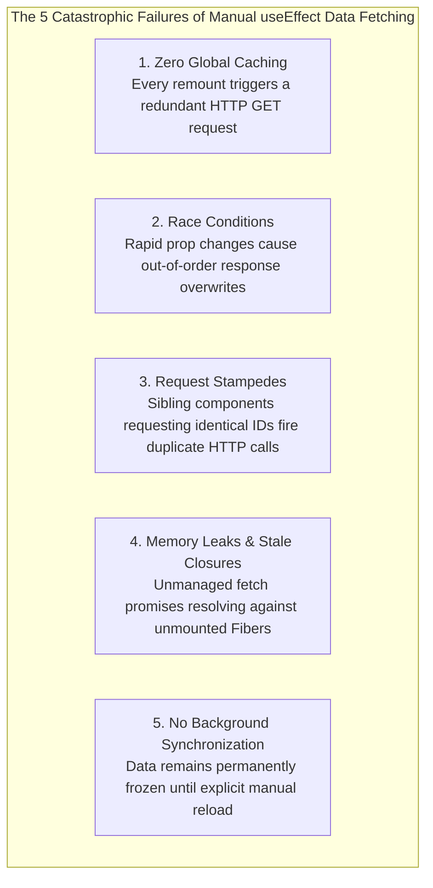
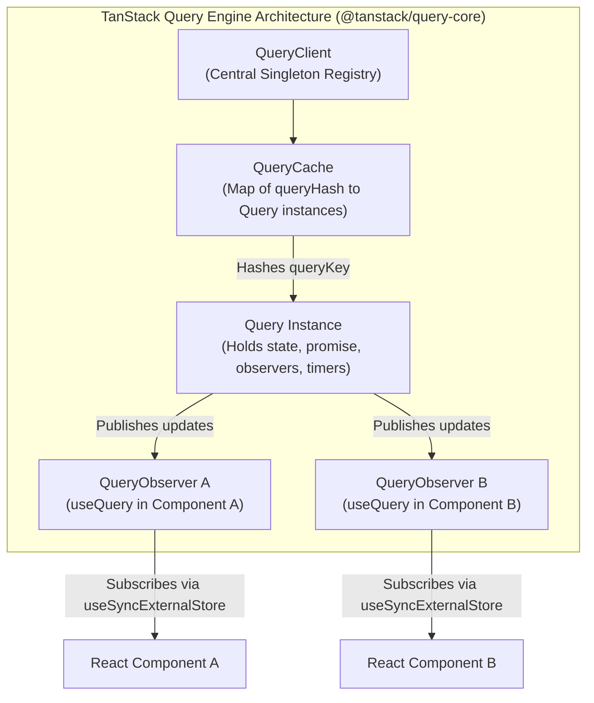
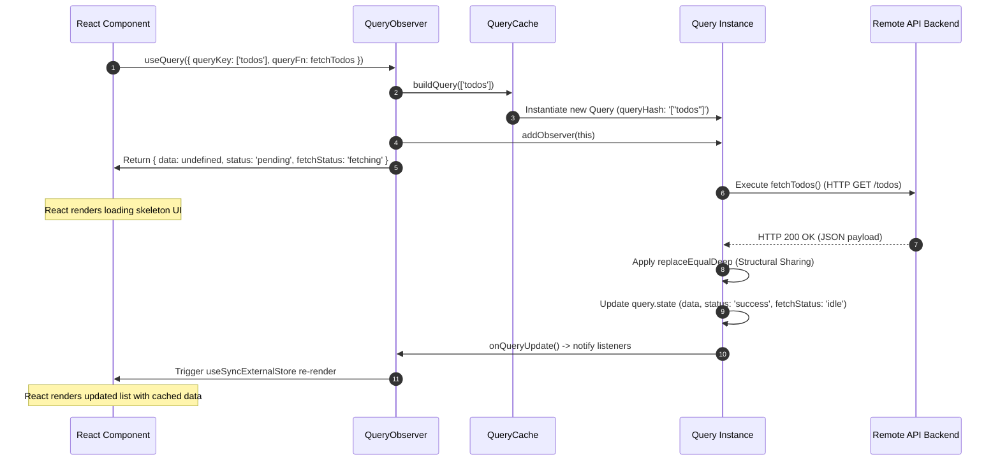

# Chapter 04: Server State & TanStack Query (React Query) Architecture

> "Server state is not client state. Server state is remotely persisted, asynchronously retrieved, shared among multiple clients, and potentially stale the microsecond it reaches your browser. Treating server data as local component state is the single greatest architectural error in modern frontend engineering."  
> — **Tanner Linsley, Creator of TanStack Query**

---

## 1. Why This Topic Exists

For years, React developers managed asynchronous network data using the **"useEffect Fetch Antipattern"**:

```tsx
// The Classic Architectural Antipattern: Treating Server Data as Local State
function UserProfile({ userId }: { userId: string }) {
  const [data, setData] = useState<User | null>(null);
  const [isLoading, setIsLoading] = useState<boolean>(true);
  const [error, setError] = useState<Error | null>(null);

  useEffect(() => {
    let isCancelled = false;
    setIsLoading(true);

    fetch(`/api/users/${userId}`)
      .then((res) => res.json())
      .then((user) => {
        if (!isCancelled) {
          setData(user);
          setIsLoading(false);
        }
      })
      .catch((err) => {
        if (!isCancelled) {
          setError(err);
          setIsLoading(false);
        }
      });

    return () => {
      isCancelled = true;
    };
  }, [userId]);

  if (isLoading) return <div>Loading...</div>;
  if (error) return <div>Error: {error.message}</div>;
  return <div>{data?.name}</div>;
}
```



### The Fundamental Axiom: Client State vs. Server State

Frontend state divides cleanly into two fundamentally distinct categories with opposite characteristics:

| Dimension | Client State (Zustand, Redux, useState) | Server State (TanStack Query, Apollo) |
| :--- | :--- | :--- |
| **Ownership** | 100% owned, controlled, and synchronized by the browser application. | Owned by a remote database; the browser only possesses an **ephemeral cache snapshot**. |
| **Persistence** | Synchronous, lives inside the browser memory (V8 heap). | Asynchronous, lives remotely across the network boundary. |
| **Concurrency** | Single-user, local mutations are deterministic and immediate. | Multi-user, can be mutated by other users/background jobs at any millisecond. |
| **Staleness** | Never stale; the client is the single source of truth. | **Always potentially stale** the instant the network response arrives. |
| **Primary Needs** | Deterministic state transitions, UI action dispatching. | Deduplication, caching, background revalidation, garbage collection, retry policies. |

**TanStack Query** exists to extract server state completely out of global client stores (Redux, Zustand) and component state (`useState`), replacing imperative fetch plumbing with an automated, declarative caching and synchronization engine.

---

## 2. Learning Objectives

By the end of this chapter, an experienced Senior / Staff Engineer will:
- Articulate the mechanical difference between **Server State** and **Client State** at a systems architecture level.
- Dissect the internal engine of TanStack Query: `QueryClient`, `QueryCache`, `Query`, and `QueryObserver`.
- Understand the exact protocol of **RFC 5861 (Stale-While-Revalidate)** and how TanStack Query implements it on the V8 event loop.
- Master the lifecycle and garbage collection interplay between **`staleTime`** (freshness horizon) and **`gcTime`** (heap retention horizon).
- Deconstruct **Structural Sharing** (`replaceEqualDeep`): how TanStack Query preserves referential equality across network updates to prevent unnecessary React Fiber reconciliations.
- Map TanStack Query concepts cleanly to **Angular Signals/RxJS** (Section 10) and **.NET Distributed Caching & MediatR** (Section 11).
- Diagnose enterprise production hazards: cache stampedes, query key serialization pitfalls, memory leaks from unbounded queries, and hydration mismatches in SSR.

---

## 3. Historical Evolution

```
2015 (Redux Async) ──────► 2018 (Apollo Client) ────► 2020 (React Query v1/v2) ──► 2023-2026 (TanStack Query v5)
Action -> Thunk           GraphQL cache-first         REST/Promise agnostic        Framework-agnostic core
Reducer stores server     Normalized cache            stale-while-revalidate       Zero-waterfall Suspense
Massive boilerplate       Locked to GraphQL           Automatic deduplication      Optimized structural sharing
```

- **2015–2018 — The Redux Monolith Era:**  
  Teams dumped all API responses into Redux. A single API call required defining 3 action types (`FETCH_USERS_REQUEST`, `FETCH_USERS_SUCCESS`, `FETCH_USERS_FAILURE`), an async thunk or saga, reducer branches, and normalization logic. Redux stores bloated into massive, unmanageable dumps of stale server snapshots.
- **2018–2019 — The Apollo Client Revelation:**  
  GraphQL teams experienced Apollo Client's automated caching. Developers realized they didn't need Redux for 90% of their apps; they simply needed an automated cache for remote data. However, Apollo was tightly coupled to GraphQL.
- **2020 — React Query (Tanner Linsley):**  
  React Query brought Apollo-style cache-first mechanics to arbitrary async functions (REST, Axios, Fetch, gRPC-web). It introduced automated request deduplication, window focus refetching, and declarative query keys.
- **2023–2026 — TanStack Query v5 & Beyond:**  
  The core was decoupled from React into `@tanstack/query-core` (usable in Vue, Svelte, Solid, and Angular). Version 5 simplified API surfaces, unified functional callbacks into query options, introduced native Suspense and Error Boundary integration, and hardened structural sharing algorithms for React 19 concurrent mode.

---

## 4. First Principles & Intuitive Physical Analogies (Layer 1)

### Metaphor 1: The Remote Central Warehouse vs. The Counter Display
- **Client State is your cash register drawer:** You count the money, you put bills in, you take coins out. You own it completely, and the total is exact at every millisecond.
- **Server State is a framed photograph of a shipping container sitting in a remote warehouse 5,000 miles away:**  
  The warehouse contains millions of crates. While you hold a photo showing "Crate #42 has 50 pallets", a forklift driver at the warehouse may have unloaded 20 pallets 5 seconds ago. Your photo is now an out-of-date artifact. You do not "own" the warehouse; you only hold a cached photograph.

### Metaphor 2: The Bakery Shelf (Stale-While-Revalidate)
- When a customer walks into a bakery at 8:00 AM asking for a croissant, the baker does not say: *"Stand there and wait 45 minutes while I mix flour, knead dough, and bake a fresh one from scratch"* (*Imperative loading spinner*).
- Instead, the baker hands them the croissant sitting in the glass display case immediately (*Serve stale cached data with zero latency*).
- Simultaneously, the baker signals the assistant in the kitchen: *"Hey, replenish the display with a fresh batch from the oven"* (*Background asynchronous revalidation*).
- When the fresh batch is ready, the display is silently updated with zero disruption to the customer.

### Metaphor 3: The Train Station Passenger Counter (Request Deduplication)
- Suppose 10 passengers stand at Platform 4, and all 10 want to know: *"When is the 8:15 express train arriving?"*
- Without TanStack Query (*The useEffect Antipattern*), all 10 passengers simultaneously dial the station master's private desk phone. The station master receives 10 ringing phones, answers each individually, and repeats the same sentence 10 times (*Request Thundering Herd / Network Waste*).
- With TanStack Query, the station master posts a single shared loudspeaker announcement on Platform 4. All 10 passengers listen to the identical broadcast. Only one single phone call is placed.

---

## 5. Internal Working & Engine Architecture (Layer 2)



### The Four Foundational Pillars:

#### 1. `QueryClient` (The Master Singleton)
The root coordinator instantiated once per application (usually at the root provider level). It holds references to:
- `QueryCache`: The storage layer for all query entries.
- `MutationCache`: The storage layer for transactional mutation entries.
- `DefaultOptions`: Global policies for `staleTime`, `gcTime`, `retry`, and `refetchOnWindowFocus`.

#### 2. `QueryCache` (The Map Registry)
Internally, `QueryCache` maintains a plain JavaScript `Map<string, Query>`:
- The key is a deterministically serialized JSON string called `queryHash`.
- If two independent components declare `queryKey: ['users', 42]` and `queryKey: ['users', 42]`, both resolve to the identical `queryHash` (`"[\"users\",42]"`).
- Query keys are serialized using a deterministic serializer (`hashKey`) that sorts object keys, ensuring `{ id: 1, type: 'admin' }` and `{ type: 'admin', id: 1 }` generate the exact same hash.

#### 3. `Query` (The Stateful Node)
A single `Query` instance lives in the cache for each unique `queryHash`. It encapsulates:
- `state`: Current data snapshot `{ data, error, status, fetchStatus, dataUpdatedAt, errorUpdatedAt }`.
- `promise`: The active in-flight network promise (if fetching). If 10 components request this query simultaneously, all 10 await this **single shared promise**.
- `observers`: An array of active `QueryObserver` instances currently watching this query.
- `gcTimeout`: A timer reference for garbage collecting this entry when all observers unsubscribe.

#### 4. `QueryObserver` (The React Reactive Bridge)
A `QueryObserver` is the intermediate broker created by every invocation of `useQuery`:
- It tracks which specific properties of the query state the component actually uses (`notifyOnChangeProps`).
- It applies the optional `select` transform function.
- It provides a `subscribe(onStoreChange)` method compatible with React 18/19's `useSyncExternalStore`.

---

## 6. Runtime Flow & Execution Traces

### Trace 1: The First Mount & Background Fetch Sequence



### Trace 2: The Double Mount Deduplication Sequence (Two Sibling Components)

```
Time T0: Component A mounts -> useQuery(['users', 1])
  - QueryCache creates Query['["users",1]']
  - Query state: fetchStatus = 'fetching'
  - In-flight Promise P1 starts: fetch('/users/1')

Time T1 (+2ms): Component B mounts -> useQuery(['users', 1])
  - QueryCache looks up '["users",1]' -> MATCH FOUND!
  - Component B attaches QueryObserver B to existing Query['["users",1]']
  - Engine detects: fetchStatus === 'fetching', Promise P1 already pending.
  - Action: ZERO network requests fired! Component B attaches to Promise P1.

Time T2 (+120ms): Promise P1 resolves with User #1 payload.
  - Query['["users",1]'] updates its state.
  - Observers A and B are notified in the same microtask.
  - Both Component A and Component B render with the identical data reference.
```

---

## 7. Memory Model & Heap Layout

```
V8 Heap Memory Topology
========================================================================================
[Root Object / Window]
  │
  └── QueryClient Singleton (Old Pointer Space)
        ├── defaultOptions: { queries: { staleTime: 0, gcTime: 300000 } }
        └── queryCache: QueryCache
              └── queries: Map<string, Query>
                    │
                    ├── "[\"user\",101]": Query Object
                    │     ├── state: { data: { id: 101, name: "Alice" }, status: "success" }
                    │     ├── gcTimeout: null (Active observers exist)
                    │     └── observers: [ QueryObserver #1, QueryObserver #2 ]
                    │                           │                 │
                    │                           ▼                 ▼
                    │                     Component A       Component B
                    │                     (Fiber Node)      (Fiber Node)
                    │
                    └── "[\"user\",999]": Query Object (Inactive / Unmounted)
                          ├── state: { data: { id: 999, name: "Zack" } }
                          ├── observers: [] (Length === 0)
                          └── gcTimeout: TimeoutId (Counts down gcTime: 5 mins)
                                └── When timer expires -> queries.delete("[\"user\",999]")
                                      └── Cleaned up by V8 Scavenger / Mark-Sweep GC!
```

### Structural Sharing Engine (`replaceEqualDeep`):
When a query refetches data in the background, TanStack Query runs a recursive diff algorithm (`replaceEqualDeep`):
- If the newly fetched JSON object has fields with the exact same values as the old object, TanStack Query **retains the old object references**.
- If only 1 item out of an array of 1,000 items changed, only that 1 item gets a new reference; the other 999 items keep their existing V8 heap pointers.
- Result: React components wrapped in `React.memo` or consuming sub-properties will **not re-render**, completely eliminating Virtual DOM diffing costs.

---

## 8. Visual Diagrams (ASCII / Text)

### The `staleTime` vs. `gcTime` Timeline Matrix

```
Component Mounts
      │
      ▼ (Fresh Data Fetched)
┌─────────────────────────────────┐
│        DATA IS FRESH            │   staleTime window (e.g., 30 seconds)
│  - No background refetch on     │   - Returns cached data instantly
│    window focus or remount.     │   - ZERO network traffic
└─────────────────────────────────┘
      │
      ▼ (staleTime expires at 30s)
┌─────────────────────────────────┐
│        DATA IS STALE            │   Data remains in memory, but is marked stale.
│  - Returns cached data instantly│   - Triggers background refetch on window focus,
│  - BUT fires background GET     │     network reconnect, or component remount.
└─────────────────────────────────┘
      │
      ▼ (All components unmount -> Observers = 0)
┌─────────────────────────────────┐
│        DATA IS INACTIVE         │   gcTime window starts ticking (e.g., 5 minutes)
│  - Still retained in heap cache │   - If re-mounted before 5 mins: instant cached render!
│  - Awaiting garbage collection  │   - gcTimeout active
└─────────────────────────────────┘
      │
      ▼ (gcTime expires at 5 minutes)
┌─────────────────────────────────┐
│      EVICTED FROM HEAP          │   Query deleted from QueryCache Map.
│  - Free memory for V8 GC        │   - Next mount must show loading skeleton from scratch.
└─────────────────────────────────┘
```

---

## 9. Real World Usage & Production Patterns

> 🧪 **Companion Interactive Lab:** [TanStackQueryVisualizer.tsx](../../apps/portal/src/features/visualizers/topic-04/TanStackQueryVisualizer.tsx) | Live in Portal: `tanstack-query-architecture`

### Pattern 1: The Type-Safe Query Key Factory

Never scatter raw array literals like `['users', userId, 'posts']` across application components. A single typo causes silent cache desynchronization. Use the **Query Key Factory Pattern**:

```tsx
// features/users/users.keys.ts
export const userKeys = {
  all: ['users'] as const,
  lists: () => [...userKeys.all, 'list'] as const,
  list: (filters: UserFilters) => [...userKeys.lists(), { filters }] as const,
  details: () => [...userKeys.all, 'detail'] as const,
  detail: (id: string) => [...userKeys.details(), id] as const,
};

// features/users/useUserDetail.ts
import { useQuery, queryOptions } from '@tanstack/react-query';
import { userKeys } from './users.keys';
import { api } from '@/shared/api';

export const userDetailQueryOptions = (userId: string) =>
  queryOptions({
    queryKey: userKeys.detail(userId),
    queryFn: async ({ signal }) => {
      // Pass the AbortSignal to cancel HTTP request when component unmounts!
      const { data } = await api.get<UserProfile>(`/users/${userId}`, { signal });
      return data;
    },
    staleTime: 1000 * 60 * 5, // Fresh for 5 minutes
    gcTime: 1000 * 60 * 30,    // Retained in cache for 30 minutes
  });

export function useUserDetail(userId: string) {
  return useQuery(userDetailQueryOptions(userId));
}
```

### Pattern 2: Selector Performance with Data Projection

Use the `select` option to transform or filter data without causing unnecessary re-renders when other parts of the data change:

```tsx
// Only re-renders if user's display name actually changes, ignoring changes to email, avatar, etc.
export function useUserDisplayName(userId: string) {
  return useQuery({
    ...userDetailQueryOptions(userId),
    select: (user) => `${user.firstName} ${user.lastName}`,
  });
}
```

---

## 10. Angular Comparison

For Senior Angular Engineers transitioning to React, TanStack Query fulfills the architectural responsibilities historically divided between **RxJS multicasting operators**, **HTTP interceptor caches**, and **Angular 19 Resource APIs**:

| Architectural Concept | Angular Paradigm | React / TanStack Query Paradigm |
| :--- | :--- | :--- |
| **Request Multicasting / Deduplication** | `this.http.get().pipe(shareReplay({ buffer: 1, refCount: true }))` | Handled natively by `QueryCache.buildQuery()` and observer registry. |
| **Declarative Server State** | `rxResource({ request: () => this.id(), loader: ({request}) => ... })` (Angular 19) | `useQuery({ queryKey: ['item', id], queryFn: ... })` |
| **Cancellation on Param Change** | `switchMap((id) => this.service.get(id))` | Native `AbortSignal` injected directly into `queryFn({ signal })`. |
| **Stale-While-Revalidate** | Requires custom RxJS custom operators (`concat(cached$, network$)`) | Built directly into core state machine (`staleTime: 0` default). |
| **Cache Disposal** | Angular Service lifecycle (`ngOnDestroy` unsubscribes Subject) | `gcTime` timer triggers garbage collection when observers drop to 0. |

---

## 11. .NET Comparison

For .NET / ASP.NET Core Architects, TanStack Query mirrors distributed caching and pipeline architectures implemented on the backend:

| Architectural Concept | .NET / ASP.NET Core Paradigm | React / TanStack Query Paradigm |
| :--- | :--- | :--- |
| **Cache Store Architecture** | `IMemoryCache` / `IDistributedCache` (Redis) keyed by cache strings | `QueryCache` holding an in-memory `Map<string, Query>` keyed by serialized hashes. |
| **Thundering Herd Protection** | `FusionCache` / `MemoryCacheEntryOptions` with cache locking | Single in-flight `promise` on the `Query` object shared across all observers. |
| **Freshness vs. Retention** | Absolute Expiration vs. Sliding Expiration | `staleTime` (Freshness expiration) vs. `gcTime` (Eviction/Sliding expiration). |
| **Pipeline Interceptors** | ASP.NET Core Middleware pipeline & MediatR pipeline behaviors | TanStack Query Global `QueryClient` `defaultOptions` and query listeners. |
| **Cancellation Token Propagation** | `CancellationToken cancellationToken` passed into Controller actions | `AbortSignal signal` passed into `queryFn({ signal })` canceling `fetch`/`Axios`. |

---

## 12. Enterprise Perspective & Production Risks (Layer 4)

### Risk 1: The Inline Object `queryKey` Re-fetch Loop
```tsx
// ❌ CATASTROPHIC PRODUCTION BUG: Infinite network fetch storm
function UserOrders({ userId }: { userId: string }) {
  // Creating a new object literal on every render!
  const filterOptions = { status: 'active', limit: 20 };

  const { data } = useQuery({
    queryKey: ['orders', userId, filterOptions], // Object reference changes every render!
    queryFn: () => fetchOrders(userId, filterOptions),
  });
}
```
*Why this happens:* While TanStack Query performs deterministic key hashing, if the query options object itself contains unstable nested callbacks or functions, the hash diverges or causes re-render cascades. Always memoize query keys or keep them primitive.

### Risk 2: Unbounded Cache Growth & Memory Leaks in Single-Page Applications
In long-lived enterprise dashboards (e.g., trading consoles running for days without page refresh), querying unbounded entity IDs with `gcTime: Infinity` will cause the browser V8 heap to grow continuously until the tab crashes with **`Out of Memory (OOM)`**.
*Rule of thumb:* Always configure a finite `gcTime` (e.g., 5 to 30 minutes) for dynamic entity collections.

### Risk 3: Request Stampedes from Misconfigured `refetchOnWindowFocus`
By default, TanStack Query revalidates stale queries when the user alt-tabs back into the browser (`refetchOnWindowFocus: true`). If a corporate dashboard displays 45 individual widgets each running queries with `staleTime: 0`, switching tabs fires **45 simultaneous HTTP requests** at the backend API gateway, triggering rate limiters (HTTP 429) or database connection pool exhaustion.
*Remedy:* Set sensible default `staleTime` values (e.g., `staleTime: 1000 * 30`) across the entire enterprise application.

---

## 13. Performance Considerations

### Network vs. Computation Tradeoffs
- **Tracked Properties (`notifyOnChangeProps`):**  
  TanStack Query v5 tracks which properties your component actually reads via getters (e.g., `const { data } = useQuery(...)`). If the query background refetches and toggles `isFetching: true -> false`, but your component never read `isFetching`, **your component will not re-render**.
- **Server-Side Rendering (SSR) Hydration Size:**  
  When dehydrating the cache on Next.js/Node.js servers, every cached query is serialized into HTML payload. Dehydrating unnecessary queries inflates HTML bundle sizes by megabytes, harming First Contentful Paint (FCP). Only dehydrate critical above-the-fold queries.

---

## 14. Tradeoffs

| Capability | Benefit | Architectural Cost |
| :--- | :--- | :--- |
| **Zero-Configuration Caching** | Eliminates thousands of lines of boilerplate async code. | Increases production bundle size by ~13 KB (minzipped). |
| **Aggressive Background Revalidation** | Users always see near-live data without explicit reloads. | Increases backend API server traffic if `staleTime` is left at default `0`. |
| **Structural Sharing (`replaceEqualDeep`)** | Prevents React re-renders by preserving object references. | Adds minor CPU microtask overhead during JSON response parsing. |
| **Query Key String Hashing** | Automatic deduplication across disparate components. | Requires strict discipline in organizing deterministic query key schemas. |

---

## 15. Common Mistakes & Interview Traps

### Trap 1: Confusing `staleTime` and `gcTime`
- **Candidate Answer (Junior/Mid):** *"They are the same thing; they both control how long data stays cached."*
- **Architect Answer (Senior/Staff):**  
  *"They control completely different lifecycle stages. `staleTime` dictates **freshness**: whether a component will trigger a background network refetch upon mount or window focus. `gcTime` dictates **memory retention**: how long unused data remains in the V8 heap cache after all subscribing components have unmounted before being garbage collected."*

### Trap 2: Mutating Cached Data In-Place
```tsx
// ❌ CRITICAL BUG: Directly mutating query cache data
const { data } = useQuery({ queryKey: ['todos'], queryFn: fetchTodos });

function handleToggle(id: number) {
  const item = data.find(t => t.id === id);
  item.completed = !item.completed; // 💥 Mutates V8 heap object directly! Breaks structural sharing!
}
```
*Why this fails:* TanStack Query relies on immutable references. Mutating cached objects directly corrupts the `QueryCache`, breaks `replaceEqualDeep`, and causes bizarre UI desynchronization bugs.

---

## 16. Interview Questions & Architectural Answers (Senior, Lead, Architect - Layer 5)

### Q1: How does TanStack Query coordinate with React 18/19 Concurrent Mode to prevent UI Tearing?
**Architect Answer:**  
TanStack Query does not use standard `useEffect` + `useState` to deliver query updates. Instead, each `QueryObserver` connects to React via **`useSyncExternalStore`**.  
When React renders concurrently across multiple interrupted frames, reading from `useSyncExternalStore` guarantees that the snapshot read at the start of the render pass matches the snapshot read at the end of the pass. If the external `QueryCache` updates mid-render, React detects the version mismatch and restarts the render pass synchronously, preventing **UI Tearing** (where different components in the same tree display conflicting data versions).

### Q2: You are designing an enterprise monitoring dashboard with 100+ live telemetry cards. Alt-tabbing causes severe backend rate limiting due to window focus refetches. How do you re-architect this?
**Architect Answer:**  
I would implement a three-tiered mitigation strategy:
1. **Tier 1 (Global Freshness Horizon):** Elevate global `staleTime` in `QueryClient` from `0` to a sensible baseline (e.g., 30–60 seconds) so switches within short intervals trigger zero network traffic.
2. **Tier 2 (Focus Refetch Throttling):** Configure `focusManager.setEventListener` with a debounce/throttle wrapper, or disable `refetchOnWindowFocus` globally and enable it explicitly only on mission-critical transactional screens.
3. **Tier 3 (Batch Query Gateway / DataLoader Pattern):** Instead of 100 individual HTTP requests, implement a custom Query Batcher or use HTTP/2 multiplexing, aggregating disparate query keys into a consolidated bulk payload endpoint.

---

## 17. Senior-Level Mental Model & "How to Remember This Forever" (Layer 3)

### The "Rental Locker" Mental Peg:
- **`staleTime` is the Food Expiration Date:**  
  If the milk carton says *"Fresh until 2:00 PM"*, you drink it without checking the fridge. Once 2:00 PM passes, you can still drink it if you're thirsty (*Instant cached render*), but you immediately send your roommate to the supermarket to buy fresh milk (*Background revalidation*).
- **`gcTime` is the Garbage Collection Truck Schedule:**  
  Once you throw the empty carton into the garage trash bin (*Component unmounts*), the truck arrives in 5 minutes (*`gcTime: 300000`*). If you change your mind within 4 minutes, you can pull it back out without driving to the store. After 5 minutes, the truck hauls it away forever (*Evicted from V8 heap*).

---

## 18. Core Vocabulary & "Aha!" Breakthrough Insights (Refresher)

- **Server State:** Ephemeral, asynchronously retrieved data owned by a remote source of truth.
- **`staleTime`:** The duration (in ms) during which cached data is considered fresh; reads during this window trigger zero network fetches.
- **`gcTime` (formerly `cacheTime`):** The duration (in ms) that unused/inactive query data remains allocated in the V8 heap before deletion.
- **Structural Sharing (`replaceEqualDeep`):** Recursive diffing engine that preserves immutable object pointers when server payloads contain identical values.
- **Request Deduplication:** Coalescing simultaneous requests for the identical query key into a single in-flight Promise.
- **`useSyncExternalStore`:** The official React concurrent primitive used by `QueryObserver` to subscribe to external cache mutations safely.

---

## 19. Key Takeaways

1. **Server state is inherently different from client state;** treating it with `useState` and `useEffect` creates race conditions, memory leaks, and duplicate requests.
2. **TanStack Query is a state synchronization engine, not an HTTP client;** it operates on arbitrary JavaScript Promises (REST, GraphQL, gRPC, WebSocket).
3. **`QueryClient` maintains an in-memory `Map` of `Query` objects;** identical serialized query keys automatically share in-flight promises and cache snapshots.
4. **`staleTime` dictates network requests; `gcTime` dictates V8 heap garbage collection.**
5. **Structural sharing protects React components from re-renders** by keeping referential identity intact across background refetches.

---

## 20. Revision Sheet

```
┌────────────────────────────────────────────────────────────────────────┐
│               TANSTACK QUERY ARCHITECTURE QUICK REVISION               │
├────────────────────────────────────────────────────────────────────────┤
│ 1. Engine Core:                                                        │
│    QueryClient -> QueryCache (Map<queryHash, Query>)                   │
│    Query -> state, promise, observers (Set<QueryObserver>)             │
│                                                                        │
│ 2. The Golden Rule of Timers:                                          │
│    - staleTime: When to RE-FETCH from network (Default: 0 ms)          │
│    - gcTime:    When to DELETE from V8 heap   (Default: 5 mins)        │
│                                                                        │
│ 3. Hook Binding:                                                       │
│    useQuery() -> Creates QueryObserver -> Subscribes via              │
│    useSyncExternalStore (100% concurrent-safe, zero UI tearing).       │
│                                                                        │
│ 4. Structural Sharing:                                                 │
│    replaceEqualDeep compares new payload vs old cache. Unchanged       │
│    references are preserved -> React.memo skips re-render!             │
│                                                                        │
│ 5. Golden Production Pattern:                                          │
│    Always use Query Key Factories: queryKeys.detail(id)                │
│    Always pass { signal } to fetcher for automatic abort!             │
└────────────────────────────────────────────────────────────────────────┘
```
