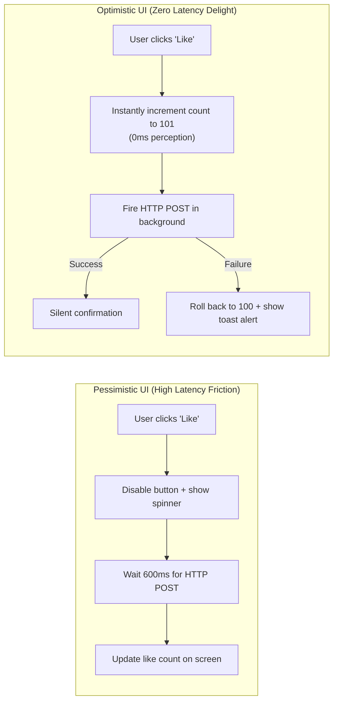
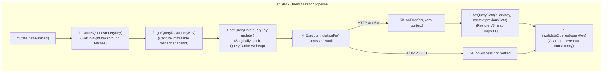
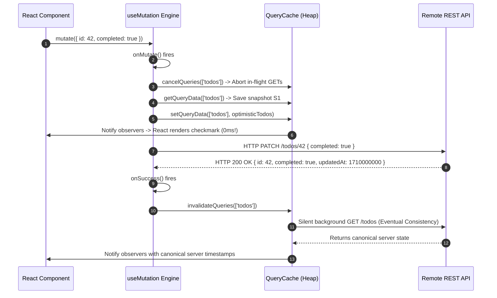

# Chapter 05: Cache Invalidation & Optimistic UI Updates (Mutations, Rollbacks, and Consistency Models)

> "There are only two hard things in Computer Science: cache invalidation and naming things."  
> — **Phil Karlton**

---

## 1. Why This Topic Exists

In high-performance web applications, network latency creates a fundamental usability barrier:



### The Architectural Dilemma:
1. **Pessimistic UI** guarantees consistency by forcing the user to wait for remote server confirmation, but introduces sluggishness, high friction, and jarring spinners.
2. **Optimistic UI** provides perceived instant responsiveness (<16ms 60 FPS transitions), but introduces severe distributed systems hazards:
   - **Out-of-Order Race Conditions:** An earlier slow query overwrites a newer optimistic mutation.
   - **Rollback Complexity:** If the network request fails (HTTP 500, network drop, validation error), the UI must deterministically rewind to its exact prior snapshot without corrupting concurrent user interactions.
   - **Eventual Consistency Desynchronization:** Server-generated fields (database primary keys, timestamps, computed discounts) must replace temporary client-generated IDs seamlessly.

Mastering **Cache Invalidation** and **Transactional Optimistic Mutations** is what separates junior state hackers from enterprise frontend architects.

---

## 2. Learning Objectives

By the end of this chapter, an experienced Senior / Staff Engineer will:
- Master the difference between **Pessimistic** and **Optimistic** mutation lifecycles.
- Dissect the 4-phase transaction contract of TanStack Query: `onMutate`, `onError`, `onSuccess`, and `onSettled`.
- Understand the **Ghost Rollback Bug** and why `await queryClient.cancelQueries()` is an absolute mathematical requirement.
- Design targeted **Cache Invalidation Topologies** (exact matching, fuzzy key prefixes, and predicate filters).
- Implement multi-entity transactional rollbacks using immutable memory snapshots.
- Compare React mutation architectures with **Angular NgRx Effects / Signals** (Section 10) and **.NET Unit of Work & Compensating Transactions** (Section 11).
- Identify mission-critical boundaries where Optimistic UI should be strictly forbidden (financial transactions, inventory reservations).

---

## 3. Historical Evolution

```
2010 (Full Page Reload) ──► 2015 (Redux Manual Rollback) ──► 2019 (Apollo Optimistic) ──► 2023-2026 (TanStack v5 Transactional)
Submit Form               Dispatch TOGGLE_START          optimisticResponse           Context snapshotting
Server renders page       Dispatch TOGGLE_ROLLBACK       GraphQL schema coupled       cancelQueries race prevention
Heavy latency             100+ lines of action boilerplate Fragment updates          Automatic garbage-collected rollbacks
```

- **The Early Web Era (Pessimistic Forms):** Every mutation locked the browser, sent an HTTP POST, and awaited a 302 redirect. Zero optimistic capabilities.
- **The Redux Golden Age (2015–2018):** Developers implemented optimistic UI by manually writing three actions per mutation (`POST_LIKE_START`, `POST_LIKE_SUCCESS`, `POST_LIKE_FAIL`), storing previous state in reducer fields, and manually dispatching rollback actions on error. The sheer boilerplate caused rampant developer burnout.
- **The GraphQL / Apollo Breakthrough (2018–2020):** Apollo introduced `optimisticResponse`, automatically applying a temporary record to its normalized InMemoryCache. However, rollbacks were tied exclusively to GraphQL schemas.
- **The Modern TanStack Era (2020–2026):** TanStack Query formalized the **Transactional Context Pattern**: snapshotting arbitrary query cache state in `onMutate`, passing snapshots to `onError` via closure contexts, and enforcing eventual consistency via `onSettled` invalidation.

---

## 4. First Principles & Intuitive Physical Analogies (Layer 1)

### Metaphor 1: The Waiter's Pencil vs. The Ink Stamp
- **Pessimistic Mutation is an Ink Stamp:**  
  When you order coffee at a diner, the waiter refuses to write it down on your bill until the barista hands them the brewed cup. If the barista takes 10 minutes, you sit waiting with an empty table and no receipt.
- **Optimistic Mutation is Writing in Pencil with an Eraser:**  
  The waiter immediately jots down *"1 Coffee - $4.00"* on your bill in light pencil (*Instant UI update*). You can immediately calculate your total. If the barista announces the espresso machine is broken (*HTTP 500 error*), the waiter takes out an eraser, rubs out the pencil line, and restores your original subtotal (*Deterministic Rollback*).

### Metaphor 2: Stopping the Conveyor Belt (`cancelQueries`)
- Imagine a factory conveyor belt delivering product boxes (*In-flight background GET requests*).
- You decide to manually swap the contents of a box on the sorting table (*Optimistic PUT mutation*).
- If you don't hit the emergency stop button on the conveyor belt (*`cancelQueries`*), an old box that was already traveling down the belt will slam into your table 100ms later, knocking your new box off the table and replacing it with the old version (*The Ghost Rollback / Race Condition*).

### Metaphor 3: The Library Index Card Invalidation
- When a library books a newly acquired volume into storage (*Database Mutation*), the librarian does not individually rewrite 50,000 encyclopedia volumes.
- Instead, the librarian walks over to the card catalog drawer and slaps a red *"STALE - MUST VERIFY"* sticker onto the catalog card (*`invalidateQueries`*).
- The next time a student walks up to look at that drawer, the sticker forces the librarian to check the central warehouse shelf for the latest edition.

---

## 5. Internal Working & Engine Architecture (Layer 2)



### The Transactional Contract Mechanics:

#### 1. The Pre-Flight Invalidation Interceptor (`cancelQueries`)
Before modifying local cache, `queryClient.cancelQueries({ queryKey })` must be invoked. Internally, this iterates over all active `Query` instances matching the query key and calls their underlying `AbortController.abort()`. This prevents pending HTTP GET requests from resolving *after* the optimistic mutation, which would wipe out your optimistic update.

#### 2. The Context Snapshot Carrier
The return value of `onMutate` is passed directly as the `context` parameter to both `onError` and `onSettled`. This creates a clean lexical boundary:
```ts
onMutate: async (newTodo) => {
  // Capture snapshot
  const previousTodos = queryClient.getQueryData(['todos']);
  // Return context object
  return { previousTodos };
};
// onError receives whatever onMutate returned!
onError: (err, newTodo, context) => {
  queryClient.setQueryData(['todos'], context?.previousTodos);
};
```

#### 3. Invalidation Ripple Mechanics (`invalidateQueries`)
When `invalidateQueries({ queryKey })` executes:
- It marks the matching query's state as `isStale: true`.
- If the query currently has **active observers** (i.e., at least one mounted React component is rendering it), it immediately schedules a background refetch.
- If the query has **zero active observers** (inactive), it refetches nothing, but sets the stale flag so the next time a component mounts, it will immediately fetch fresh data.

---

## 6. Runtime Flow & Execution Traces

### Trace 1: Successful Optimistic Mutation Sequence



### Trace 2: Network Failure & Rollback Execution Trace

```
T0: User clicks "Delete Post #101"
T1 (0ms): onMutate fires.
    - Snapshot captured: previousPosts = [Post 101, Post 102]
    - Cache updated: setQueryData removes Post 101.
    - UI updates instantly: Post 101 vanishes from screen.
T2 (300ms): Network drops. HTTP 503 Service Unavailable returned.
T3 (301ms): onError(error, vars, context) fires.
    - Engine reads context.previousPosts.
    - Executes: setQueryData(['posts'], context.previousPosts).
    - UI immediately re-renders Post 101 back onto the screen.
    - Toast alert displayed: "Failed to delete post. Please retry."
T4 (302ms): onSettled fires.
    - Executes: invalidateQueries(['posts']).
    - Verifies cache sync with remote database.
```

---

## 7. Memory Model & Heap Layout

```
V8 Heap Lifecycle During Optimistic Mutation
========================================================================================
[Phase 1: onMutate Snapshot Capture]
  QueryCache
    └── '["todos"]' ───► Array (Pointer @0x100)
                              ├── Todo 1 { id: 1, done: false }
                              └── Todo 2 { id: 2, done: false }

  MutationContext (Retained by Promise closure)
    └── previousTodos ──► Pointer @0x100 (Pinned in memory)

[Phase 2: Optimistic Cache Patch]
  QueryCache
    └── '["todos"]' ───► New Array (Pointer @0x200)  <── React renders this!
                              ├── Todo 1 { id: 1, done: false }
                              └── Todo 2 { id: 2, done: true }  <── Mutated copy!

[Phase 3a: Success Path]
  - Network succeeds.
  - MutationContext released. Pointer @0x100 becomes unreachable -> Collected by Minor GC!

[Phase 3b: Failure Path (Rollback)]
  - Network fails.
  - setQueryData restores Pointer @0x100 back to QueryCache!
  - Pointer @0x200 becomes unreachable -> Cleaned up by V8 GC!
```

---

## 8. Visual Diagrams (ASCII / Text)

### Cache Invalidation Filter Matrix

```
Query Key in Cache:        invalidateQueries Match Behavior:
─────────────────────────────────────────────────────────────────────────────
['todos']                  ['todos']                --> MATCH (Exact)
['todos', 1]               ['todos']                --> MATCH (Prefix match)
['todos', 1, 'comments']   ['todos']                --> MATCH (Prefix match)
['todos', 1]               ['todos', 1]             --> MATCH (Exact)
['todos', 2]               ['todos', 1]             --> NO MATCH
['todos', 1]               ['todos', { exact: true }] -> NO MATCH (Has sub-key)
─────────────────────────────────────────────────────────────────────────────
```

---

## 9. Real World Usage & Production Patterns

> 🧪 **Companion Interactive Lab:** [OptimisticUiVisualizer.tsx](../../apps/portal/src/features/visualizers/topic-05/OptimisticUiVisualizer.tsx) | Live in Portal: `optimistic-ui-mutations`

### Production Pattern: The Bulletproof Optimistic Todo Mutation

```tsx
import { useMutation, useQueryClient } from '@tanstack/react-query';
import { api } from '@/shared/api';

interface Todo {
  id: string;
  title: string;
  completed: boolean;
  updatedAt?: string;
}

interface MutationContext {
  previousTodos?: Todo[];
}

export function useToggleTodo() {
  const queryClient = useQueryClient();

  return useMutation<Todo, Error, { id: string; completed: boolean }, MutationContext>({
    mutationFn: async ({ id, completed }) => {
      const response = await api.patch<Todo>(`/todos/${id}`, { completed });
      return response.data;
    },

    // 1. Transaction Start: Executed synchronously before the network request
    onMutate: async ({ id, completed }) => {
      // Step A: Cancel any outgoing refetches to avoid overwriting our optimistic update
      await queryClient.cancelQueries({ queryKey: ['todos'] });

      // Step B: Snapshot the previous state on the V8 heap
      const previousTodos = queryClient.getQueryData<Todo[]>(['todos']);

      // Step C: Optimistically update the cache with structural immutability
      queryClient.setQueryData<Todo[]>(['todos'], (old) => {
        if (!old) return [];
        return old.map((todo) =>
          todo.id === id ? { ...todo, completed } : todo
        );
      });

      // Step D: Return the rollback context
      return { previousTodos };
    },

    // 2. Transaction Rollback: Invoked if mutationFn throws an error
    onError: (err, variables, context) => {
      if (context?.previousTodos) {
        queryClient.setQueryData(['todos'], context.previousTodos);
      }
    },

    // 3. Transaction Finalization: Always runs on success OR error
    onSettled: () => {
      // Re-fetch to guarantee 100% eventual consistency with the server DB
      queryClient.invalidateQueries({ queryKey: ['todos'] });
    },
  });
}
```

---

## 10. Angular Comparison

For Senior Angular Architects transitioning to React, TanStack Query mutations replace complex **NgRx Effects**, **RxJS error-handling operators**, and manual rollback actions:

| Architectural Concept | Angular Paradigm | React / TanStack Query Paradigm |
| :--- | :--- | :--- |
| **Optimistic Action Dispatch** | `this.store.dispatch(toggleTodoOptimistic({ id }))` | `useMutation`'s `onMutate` synchronous hook. |
| **Rollback Handling** | Catch block inside NgRx Effect dispatching `toggleTodoRollback({ previousState })` | `onError: (err, vars, context) => setQueryData(key, context.previous)` |
| **Canceling In-flight Requests** | `switchMap()` or `takeUntil()` on an active RxJS Observable | `await queryClient.cancelQueries({ queryKey })` aborting fetchers. |
| **Refetch After Mutation** | Dispatching `loadTodos()` action inside Effect `tap()` | `queryClient.invalidateQueries({ queryKey })` in `onSettled`. |
| **Concurrency Management** | RxJS flattening operators: `exhaustMap`, `concatMap`, `mergeMap` | TanStack Mutation queues: `mutationKey` with custom scope/concurrency. |

---

## 11. .NET Comparison

For .NET / ASP.NET Core Architects, TanStack Query optimistic mutations closely mirror **Database Transactions**, **Unit of Work**, and the **Saga Compensating Transaction Pattern**:

| Architectural Concept | .NET / ASP.NET Core Paradigm | React / TanStack Query Paradigm |
| :--- | :--- | :--- |
| **Transaction Snapshot** | `using var transaction = dbContext.Database.BeginTransaction()` | Capturing snapshot in `onMutate`: `getQueryData()`. |
| **Rollback Execution** | `await transaction.RollbackAsync()` inside a `catch` block | `setQueryData(key, context.previousData)` inside `onError`. |
| **Compensating Action** | MassTransit Saga / Outbox Compensating Event (undo side-effect) | Restoring prior state and publishing UI error toast notifications. |
| **Cache Tag Invalidation** | ASP.NET Core 7+ Output Cache Tag Invalidation: `IOutputCacheStore.EvictByTagAsync()` | TanStack Query key prefix invalidation: `invalidateQueries({ queryKey: ['todos'] })`. |
| **Eventual Consistency** | CQRS Read Model projection catch-up via background worker | `onSettled` background refetch syncing with database primary keys. |

---

## 12. Enterprise Perspective & Production Risks (Layer 4)

### Risk 1: The "Ghost Rollback" Bug
Occurs when a background refetch was fired *before* the mutation, but resolves *after* the mutation updates the cache:
```
Time 0: Background refetch starts: GET /todos (In-flight)
Time 50ms: User clicks toggle. onMutate sets { done: true }.
Time 120ms: GET /todos finishes with { done: false }.
Result: The GET response wipes out the optimistic toggle! The checkmark disappears!
```
*Enterprise Fix:* You **must** call `await queryClient.cancelQueries({ queryKey })` inside `onMutate`.

### Risk 2: Optimistic Mutation Cascades
If a user rapidly fires 5 optimistic updates on the same item within 2 seconds:
- Mutation #1 succeeds.
- Mutation #2 fails (triggers rollback).
- Mutations #3, #4, #5 were computed based on the state of Mutation #2.
*Production Rule:* For rapid-fire updates (e.g., typing into an auto-saving input or dragging a slider), use **Debouncing** before invoking `mutate`, or use a serialized mutation queue (`scope: { id }`).

### Risk 3: The Danger Zone: Where Optimistic UI Must NEVER Be Used
Never implement Optimistic UI for:
1. **Financial Payments & Checkout:** Deducting wallet balances or confirming bank transfers before server confirmation creates disastrous user misunderstandings.
2. **Limited Stock Reservations:** Booking airline seats or concert tickets where backend distributed locks determine allocation.
3. **Destructive Bulk Actions:** Permanent account deletion or bulk data purging.

---

## 13. Performance Considerations

### Selective vs. Nuclear Invalidation
- **Nuclear Invalidation (Antipattern):**  
  Calling `queryClient.invalidateQueries()` without arguments invalidates **every single query in the application cache**. A simple "Like" button triggers 50 background HTTP requests across all open tabs and widgets.
- **Surgical Invalidation (Best Practice):**  
  Always qualify invalidation with the exact key prefix or use predicate functions:
  ```ts
  queryClient.invalidateQueries({
    queryKey: ['posts', postId],
    exact: true,
  });
  ```

---

## 14. Tradeoffs

| Approach | Latency Perception | Complexity | Risk Profile |
| :--- | :--- | :--- | :--- |
| **Pessimistic UI** | High (User waits for network RTT). | Low (Zero rollback code required). | Safe (Single source of truth). |
| **Optimistic UI** | Zero (Instant <16ms interaction). | High (Requires snapshots, aborts, and rollbacks). | Risk of rollback flicker if network fails. |
| **Local Temporary State** | Instant. | Medium (State lives in component `useState`). | High (Desyncs with other components). |

---

## 15. Common Mistakes & Interview Traps

### Trap 1: Forgetting to Return the Context from `onMutate`
```tsx
// ❌ FAILS SILENTLY: Forgetting to return context
onMutate: async (newTodo) => {
  const previousTodos = queryClient.getQueryData(['todos']);
  // Missing: return { previousTodos };
},
onError: (err, newTodo, context) => {
  // context is undefined! Rollback cannot happen!
  queryClient.setQueryData(['todos'], context?.previousTodos);
}
```

### Trap 2: Skipping `onSettled` Invalidation
Developers assume that because their mutation succeeded, the cache is 100% accurate.  
*Why this is a trap:* Server databases frequently generate auto-incremented IDs, compute updated timestamps (`updatedAt`), calculate taxes, or apply server triggers. Without `invalidateQueries()` in `onSettled`, the client remains permanently desynchronized from server-computed fields.

---

## 16. Interview Questions & Architectural Answers (Senior, Lead, Architect - Layer 5)

### Q1: How do you handle optimistic UI when the backend returns a new entity with a server-generated ID?
**Architect Answer:**  
When creating a new record (e.g. `POST /todos`), the server assigns the permanent database UUID.  
In `onMutate`, I generate a temporary client-side ID (e.g., `temp-id-${crypto.randomUUID()}`) and optimistically append the item to the cache.  
In `onSuccess(serverData, variables, context)`, I call `setQueryData` to surgically replace the item having `temp-id` with the canonical `serverData` containing the true database ID.  
Finally, in `onSettled`, I trigger `invalidateQueries` to ensure complete consistency with list filters and pagination cursors.

### Q2: How do you prevent out-of-order race conditions when two mutations on the same entity occur in rapid succession?
**Architect Answer:**  
TanStack Query v5 supports mutation scopes and keying. By providing a `mutationKey: ['todo', id]`, mutations with the same scope are queued sequentially rather than executed in parallel.  
Additionally, in `onMutate`, we must always cancel in-flight queries for that key using `await queryClient.cancelQueries()`. If the operations are non-idempotent, we disable further interaction until the previous mutation settles, or use an internal event sequence number (Vector Clock) to discard stale mutation responses.

---

## 17. Senior-Level Mental Model & "How to Remember This Forever" (Layer 3)

### The "Banker's Ledger" Mental Anchor:
1. **`onMutate`:** Make a photocopy of the page (*Save Snapshot*), stop all incoming mail (*`cancelQueries`*), and write the new entry in pencil (*`setQueryData`*).
2. **`onError`:** Tear out the pencil page and paste the photocopy back into the binder (*Rollback*).
3. **`onSettled`:** Ring the central branch auditor to stamp the final official balance (*`invalidateQueries`*).

---

## 18. Core Vocabulary & "Aha!" Breakthrough Insights (Refresher)

- **Optimistic Mutation:** Updating local UI immediately under the assumption that the remote network request will succeed.
- **Pessimistic Mutation:** Delaying UI updates until remote server HTTP 200 confirmation is received.
- **Ghost Rollback:** An in-flight background query resolving after an optimistic mutation, inadvertently overwriting the optimistic state with stale data.
- **`cancelQueries`:** Aborting in-flight query fetchers via `AbortController` to protect optimistic cache integrity.
- **Eventual Consistency:** The distributed systems guarantee that after all updates complete, all replicas (server DB and client cache) will converge to the identical state.

---

## 19. Key Takeaways

1. **Optimistic UI turns sluggish network experiences into 0ms instant interactions**, but requires strict transactional discipline.
2. **Always follow the 4-phase contract:** Cancel in-flight queries -> snapshot state -> apply optimistic patch -> rollback on error -> invalidate on settled.
3. **`cancelQueries` is mandatory**, not optional; omitting it guarantees the Ghost Rollback bug in production.
4. **Reserve Optimistic UI for low-risk, reversible actions** (likes, toggles, inline edits); use Pessimistic UI for payments and destructive workflows.

---

## 20. Revision Sheet

```
┌────────────────────────────────────────────────────────────────────────┐
│             OPTIMISTIC MUTATIONS & INVALIDATION CHEAT SHEET            │
├────────────────────────────────────────────────────────────────────────┤
│ 1. Transaction Flow in useMutation:                                    │
│    onMutate:                                                           │
│      1. await queryClient.cancelQueries({ queryKey })                  │
│      2. const previous = queryClient.getQueryData(queryKey)            │
│      3. queryClient.setQueryData(queryKey, updater)                    │
│      4. return { previous }                                            │
│    onError:                                                            │
│      queryClient.setQueryData(queryKey, context.previous)              │
│    onSettled:                                                          │
│      queryClient.invalidateQueries({ queryKey })                       │
│                                                                        │
│ 2. Invalidation Syntax:                                                │
│    - Prefix match:  invalidateQueries({ queryKey: ['todos'] })         │
│    - Exact match:   invalidateQueries({ queryKey: ['todos'], exact:true│
│    - Active only:   invalidateQueries({ type: 'active' })              │
│                                                                        │
│ 3. Golden Rule:                                                        │
│    Never use Optimistic UI for financial, checkout, or destructive     │
│    operations. Always invalidate in onSettled for eventual consistency.│
└────────────────────────────────────────────────────────────────────────┘
```
