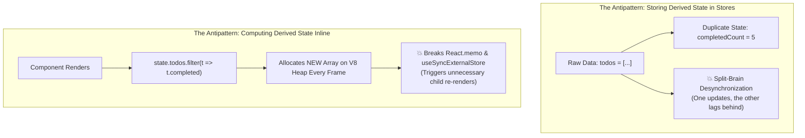
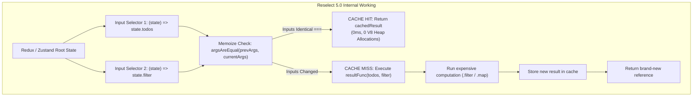

# Chapter 06: Reselect, Memoization & Selector Performance (Derived State, Reference Equality, and V8 ICs)

> "Derived state should never be stored in state. State is minimal and canonical; everything else is a projection. If your projections recalculate on every tick, you are drowning your runtime in garbage collection and Virtual DOM diffing."  
> — **Dan Abramov, Co-Creator of Redux**

---

## 1. Why This Topic Exists

In enterprise frontend architectures, over 70% of UI display data is **derived state**:
- Total price after applying tax and coupon codes.
- Filtered, sorted, and paginated lists of 5,000 transactions.
- Aggregated charts and metrics derived from normalized relational tables.



### The Architectural Dilemma:
1. If you store derived state directly in the store, you guarantee **split-brain desynchronization** bugs.
2. If you compute derived state inline using `.filter()`, `.map()`, or `.reduce()`, JavaScript generates **brand-new object references on every render**.
3. In modern React (React 18 & 19), `useSyncExternalStore` uses strict referential equality (`Object.is`) to detect state changes. An un-memoized selector returning a newly allocated array forces an infinite loop or constant re-rendering of the entire component tree.

**Reselect** is the industry-standard memoized selector library designed to solve this by caching derived projections based on **referential stability of inputs**.

---

## 2. Learning Objectives

By the end of this chapter, an experienced Senior / Staff Engineer will:
- Master the mathematical foundation of **Derived State Projections** (`UI = f(State)`).
- Dissect the internal engine of **Reselect 5.x**: Input selectors, result functions, `lruMemoize` vs. `weakMapMemoize`.
- Understand how referential equality (`===`) preserves V8 **Inline Caches (ICs)** and prevents New Space GC allocation storms.
- Solve the infamous **Multi-Instance Cache Thrashing Bug** using **Factory Selectors** (`makeSelectFilteredTodos`).
- Benchmark and compare Reselect against **Angular Signals `computed()`** (Section 10) and **.NET LINQ Deferred Execution & Memoization** (Section 11).
- Diagnose enterprise memory leaks: WeakMap memory topologies, closure scope bloat, and unbounded selector caches.

---

## 3. Historical Evolution

```
2015 (Reselect 1.0) ──────► 2017 (Reselect 4.0) ────► 2021 (RTK Integration) ──► 2023-2026 (Reselect 5.0)
Simple memoize            createSelector             Built-in createSelector     weakMapMemoize
Cache size = 1            Single-value closure       TypeScript auto-infer       Tree-based memoization
Manual TypeScript casts   Strict === equality        Standard Redux pattern      Zero-cost multi-instance
```

- **2015–2017 — The Genesis of Reselect:**  
  Created by Dan Abramov and Lee Byron. It provided a lightweight higher-order function that cached a single calculation (`cacheSize: 1`). If the inputs didn't change according to `===`, the cached output was returned directly.
- **2017–2021 — The Multi-Instance Cache Thrashing Problem:**  
  As apps grew, multiple instances of the same component (e.g. 50 items in a list) called the same selector with different props (e.g. `userId: 1`, then `userId: 2`). Because the selector only cached the *last* call, every call evicted the previous result, dropping cache hit rate to **0%**. Developers had to write complex selector factories (`makeSelectUser`).
- **2023–2026 — Reselect 5.0 Modern Era:**  
  Reselect was rewritten in modern TypeScript. It introduced **`weakMapMemoize`**, which builds an internal trie of `WeakMap` nodes keyed by object references. This provides **unbounded memoization without memory leaks**, eliminating the multi-instance cache thrashing problem forever.

---

## 4. First Principles & Intuitive Physical Analogies (Layer 1)

### Metaphor 1: The Tax Accountant's Sticky Note
- Imagine you take your financial papers to an accountant. They spend 2 hours calculating your complex tax deductions and write the final figure on a yellow sticky note: `Tax: $1,420`.
- Five minutes later, your spouse walks in and asks: *"What's our tax deduction?"*
- If the accountant is unmemoized (*Inline computation*), they throw the sticky note away, spread all 50 receipts across the table, and spend 2 hours recalculating the exact same numbers.
- If the accountant is memoized (*Reselect*), they look at the sticky note: *"The income and deductions haven't changed. Here is $1,420"* (0ms instant return).

### Metaphor 2: The Two Shoppers at the Information Booth (Cache Thrashing)
- A tourist booth has one clerk with a single memory slot (*`cacheSize: 1`*).
- Tourist A asks: *"What's the weather in Paris?"* The clerk looks it up: *"Paris is 18°C"*.
- Tourist B immediately asks: *"What's the weather in Tokyo?"* The clerk wipes their memory board and writes *"Tokyo is 24°C"*.
- Tourist A asks again 1 second later: *"What did you say Paris was?"*
- The clerk has already forgotten Paris! They must look it up from scratch again.
- **The Fix (Factory / WeakMap):** Give Tourist A and Tourist B their own private, independent notebooks (*Factory Selectors / WeakMap Memoization*).

### Metaphor 3: The Assembly Line Gatekeeper
- Raw steel and bolts arrive at a car manufacturing plant (*Store State Updates*).
- The painter only cares about car chassis, not bolts.
- The Selector acts as a gatekeeper: if only bolts arrived, the painter's door remains closed (*Referential identity preserved; component skips re-rendering*).

---

## 5. Internal Working & Engine Architecture (Layer 2)



### The Two Foundational Memoizers of Reselect 5:

#### 1. `lruMemoize` (Least Recently Used)
- The traditional default memoizer.
- Maintains an internal array of cached arguments and results up to a configured `maxSize` (default: 1).
- Compares arguments using strict equality (`===`) by default.
- If cache capacity is exceeded, the least recently accessed calculation is evicted.

#### 2. `weakMapMemoize` (Trie-based WeakMap Caching)
- Reselect 5's revolutionary new memoizer.
- Uses a hierarchical tree of `WeakMap` objects where each argument in the input tuple represents a node in the tree:
  ```
  Root WeakMap
    └── Key: state.todos (Object Reference)
          └── Nested WeakMap
                └── Key: state.filter (Object Reference)
                      └── Value: Cached Result Array
  ```
- **Garbage Collection Advantage:** If the user logs out or `state.todos` is replaced and discarded by V8 GC, the corresponding branch in the `WeakMap` is **automatically collected by the V8 Garbage Collector** with zero memory leaks!

---

## 6. Runtime Flow & Execution Traces

### Trace 1: Cache Hit Execution Trace (0ms Bailout)

```
Time T0: User clicks "Toggle Sidebar" (Unrelated state update: state.ui.sidebarOpen)
Time T1: Store updates. Redux dispatches event to all subscribers.
Time T2: useSyncExternalStore invokes selector: selectFilteredTodos(state)
  1. Input Selector 1 evaluates: state.todos -> Returns Pointer @0x100
  2. Input Selector 2 evaluates: state.filter -> Returns "ALL"
  3. Reselect checks previous inputs:
     - prevInput1 (@0x100) === currentInput1 (@0x100) -> TRUE
     - prevInput2 ("ALL") === currentInput2 ("ALL")   -> TRUE
  4. Cache Hit! Reselect bails out immediately without running result function!
  5. Returns cached result: Pointer @0x999
Time T3: useSyncExternalStore compares previous output (@0x999) with new output (@0x999).
  - Object.is(@0x999, @0x999) === true!
  - Result: ZERO COMPONENT RE-RENDERS! ZERO V8 HEAP ALLOCATIONS!
```

### Trace 2: Cache Miss & Recomputation Trace

```
Time T0: User clicks "Show Completed" -> state.filter changes from "ALL" to "COMPLETED"
Time T1: useSyncExternalStore invokes: selectFilteredTodos(state)
  1. Input Selector 1: state.todos -> Pointer @0x100 (Unchanged)
  2. Input Selector 2: state.filter -> "COMPLETED" (Changed!)
  3. Reselect detects input mismatch ("ALL" !== "COMPLETED").
  4. Cache Miss!
  5. Reselect executes resultFunc(todos, filter):
     - Executes: todos.filter(t => t.completed)
     - Allocates new Array on V8 Heap: Pointer @0x555
  6. Reselect updates cache with Pointer @0x555.
Time T2: useSyncExternalStore detects Object.is(@0x999, @0x555) === false.
  - Component successfully re-renders with fresh filtered list!
```

---

## 7. Memory Model & Heap Layout

```
V8 Heap Layout: Reselect Closure vs. weakMapMemoize
========================================================================================
[Reselect Selector Instance (Old Space)]
  │
  ├── inputSelectors: [ fn1, fn2 ]
  ├── resultFunc: fn3
  └── memoizedFn (Closure Scope)
        │
        ▼ (Under weakMapMemoize)
  rootWeakMap: WeakMap
    └── [Key: todos Pointer @0x100] (Weak Reference)
          │
          └── subWeakMap: WeakMap
                └── [Key: userFilter Pointer @0x200] (Weak Reference)
                      │
                      └── Value: Computed Result Array (Pointer @0x555)

* GC MECHANIC: If state.todos (@0x100) is garbage collected, the entire subtree
  is pruned automatically without manual cache invalidation!
```

---

## 8. Visual Diagrams (ASCII / Text)

### Multi-Instance Cache Thrashing: The Problem & The Solution

```
THE THRASHING PROBLEM (Single Shared Selector Instance with maxSize: 1):
Component #1 (User 1) calls selectUserTodo ──► Computes User 1 ──► Cache: [User 1]
Component #2 (User 2) calls selectUserTodo ──► Computes User 2 ──► Cache: [User 2] (User 1 evicted!)
Component #1 (User 1) calls selectUserTodo ──► Computes User 1 ──► Cache: [User 1] (User 2 evicted!)
Result: 0% Cache Hit Rate! 100% CPU Recomputation on every render!

THE ARCHITECTURAL SOLUTIONS:
Option A (Reselect 5 weakMapMemoize):
Single Selector instance, but uses a tree of WeakMaps.
User 1 and User 2 exist at separate nodes in the WeakMap trie. Cache Hit Rate: 100%!

Option B (Selector Factory Pattern):
export const makeSelectUserTodo = () => createSelector(...);
Component #1 gets its own private selector instance via useMemo().
Component #2 gets its own private selector instance via useMemo().
Cache Hit Rate: 100%!
```

---

## 9. Real World Usage & Production Patterns

> 🧪 **Companion Interactive Lab:** [ReselectVisualizer.tsx](../../apps/portal/src/features/visualizers/topic-06/ReselectVisualizer.tsx) | Live in Portal: `reselect-memoization-internals`

### Pattern 1: Reselect 5 with `weakMapMemoize` (Modern Standard)

```tsx
import { createSelector, weakMapMemoize } from '@reduxjs/toolkit';

interface RootState {
  todos: { id: string; text: string; completed: boolean; tag: string }[];
  filters: { status: 'all' | 'completed' | 'active'; activeTag: string };
}

// 1. Primitive Input Selectors
const selectTodos = (state: RootState) => state.todos;
const selectFilterStatus = (state: RootState) => state.filters.status;
const selectActiveTag = (state: RootState) => state.filters.activeTag;

// 2. Composed Memoized Selector using weakMapMemoize
export const selectFilteredTaggedTodos = createSelector(
  [selectTodos, selectFilterStatus, selectActiveTag],
  (todos, status, activeTag) => {
    // Only re-runs if todos, status, OR activeTag reference changes!
    return todos.filter((todo) => {
      const statusMatch =
        status === 'all'
          ? true
          : status === 'completed'
          ? todo.completed
          : !todo.completed;
      const tagMatch = activeTag === '' || todo.tag === activeTag;
      return statusMatch && tagMatch;
    });
  },
  {
    memoize: weakMapMemoize, // Unlimited multi-instance caching without memory leaks!
  }
);
```

### Pattern 2: Factory Selector Pattern for Dynamic Props

```tsx
import { useMemo } from 'react';
import { useSelector } from 'react-redux';
import { createSelector } from '@reduxjs/toolkit';

// Factory creating a unique selector instance with its own private cache
export const makeSelectTodoById = () =>
  createSelector(
    [(state: RootState) => state.todos, (_state: RootState, id: string) => id],
    (todos, id) => todos.find((t) => t.id === id)
  );

export function TodoListItem({ id }: { id: string }) {
  // Memoize the selector instance itself across renders of this component instance!
  const selectTodoById = useMemo(() => makeSelectTodoById(), []);
  
  const todo = useSelector((state: RootState) => selectTodoById(state, id));

  if (!todo) return null;
  return <div>{todo.text}</div>;
}
```

---

## 10. Angular Comparison

For Senior Angular Architects transitioning to React, Reselect selectors serve the same purpose as **Angular Signals `computed()`** and **RxJS `distinctUntilChanged`**:

| Architectural Concept | Angular Paradigm | React / Reselect Paradigm |
| :--- | :--- | :--- |
| **Derived State Primitive** | `computed(() => this.todos().filter(...))` (Angular Signals) | `createSelector([selectTodos], (todos) => ...)` |
| **Dependency Tracking** | Dynamic runtime dependency collection (Signal graph) | Explicit static declaration of input selectors array |
| **Glitch-Free Evaluation** | Push-Pull reactive graph algorithm (Diamond problem prevention) | Evaluated on-demand when subscriber invokes selector |
| **Referential Equality Guard** | `distinctUntilChanged()` or Signal equality function | Input comparison via `argsAreEqual` (default `===`) |
| **Multi-instance Caching** | Signal instances naturally bound to component instance (`this`) | Requires `weakMapMemoize` or Factory Selector `makeSelect...` |

---

## 11. .NET Comparison

For .NET / ASP.NET Core Architects, Reselect mirrors **LINQ Expression Trees**, **Deferred Execution**, and **Memoized Delegates**:

| Architectural Concept | .NET / ASP.NET Core Paradigm | React / Reselect Paradigm |
| :--- | :--- | :--- |
| **Derived Projection** | LINQ `.Where(...).Select(...)` over `IEnumerable` | Reselect `resultFunc` executing pure functional projection. |
| **Deferred Evaluation** | LINQ query is not executed until iterated (`foreach`, `.ToList()`) | Selector result function is not executed until inputs change. |
| **Compiled Delegate Caching** | Cached compiled delegates or `MemoryCache` with sliding expiration | `createSelector` memoizing output pointer based on input identity. |
| **Garbage-Collected Cache** | `ConditionalWeakTable<TKey, TValue>` (Weak references) | Reselect 5 `weakMapMemoize` utilizing V8 native `WeakMap`. |
| **Referential Equality** | `ReferenceEquals(a, b)` | JavaScript strict identity check `a === b` (`Object.is`). |

---

## 12. Enterprise Perspective & Production Risks (Layer 4)

### Risk 1: The Accidental Inline Identity Trap
```ts
// ❌ CRITICAL BUG: Returning a brand-new object or array unconditionally
export const selectUserPreferences = createSelector(
  [selectUser],
  (user) => {
    // 💥 Returns a new object reference every single time inputs change!
    // Worse: If input changed once, downstream selectors never cache!
    return {
      theme: user.theme,
      fontSize: user.fontSize,
      notifications: user.notifications ?? [], // New array allocated!
    };
  }
);
```
*Enterprise Fix:* If a selector merely picks fields, keep it granular or return primitives, or use `shallowEqual` downstream.

### Risk 2: Unbounded Map Caching in Long-Running Tabs
Using a custom memoizer backed by a plain JavaScript `Map<string, Result>` without an eviction policy will retain every queried ID forever. In enterprise trading dashboards or CRM tools, this leaks hundreds of megabytes over days.
*Architectural Rule:* Always use `weakMapMemoize` for object inputs or `lruMemoize` with a strictly bounded `maxSize` (e.g. 50–100) for primitive keys.

---

## 13. Performance Considerations

### Reselect vs. React Compiler (`React Forget`)
With React 19's React Compiler auto-memoizing component bodies:
- **Does Reselect become obsolete?**  
  **NO.** The React Compiler only memoizes *inside the component render function*.
- Reselect memoizes *outside the React component tree*, at the state container / store boundary.
- If a selector returns a cached reference, **React does not even enter the component render function** (`useSyncExternalStore` bails out before reconciliation). Reselect prevents the component from executing at all.

---

## 14. Tradeoffs

| Capability | Benefit | Architectural Cost |
| :--- | :--- | :--- |
| **Reselect Memoization** | Completely skips expensive array loops and child re-renders. | Memory footprint for storing input tuples and cached results. |
| **`weakMapMemoize`** | Infinite multi-instance caching with zero memory leaks. | Inputs must be JavaScript Objects (primitives cannot be WeakMap keys). |
| **Inline Selectors** | Zero boilerplate, simple to read. | Allocates new references every render; causes massive re-render waterfalls. |

---

## 15. Common Mistakes & Interview Traps

### Trap 1: Creating Selector Instances Inside the Component Body
```tsx
// ❌ CATASTROPHIC PERFORMANCE DISASTER
function UserBadge({ id }: { id: string }) {
  // Instantiating a brand-new selector on EVERY SINGLE RENDER!
  const selectUser = createSelector([selectUsers], (users) => users[id]);
  const user = useSelector(selectUser); // Cache is ALWAYS empty! Hit rate: 0%!
  return <div>{user.name}</div>;
}
```
*The Fix:* Use `useMemo(() => makeSelectUser(), [])` or a module-level parameterized selector with `weakMapMemoize`.

---

## 16. Interview Questions & Architectural Answers (Senior, Lead, Architect - Layer 5)

### Q1: How does Reselect 5's `weakMapMemoize` eliminate the multi-instance cache thrashing problem without leaking memory?
**Architect Answer:**  
Traditional Reselect used `lruMemoize` with `maxSize: 1`. When multiple component instances queried the same selector with different arguments, each call overwrote the single cache slot.  
Reselect 5's `weakMapMemoize` constructs a trie of `WeakMap` instances. Each argument in the input selector tuple forms a successive key in the trie.  
Because `WeakMap` holds *weak references* to its keys, the cache entries do not prevent JavaScript objects from being garbage collected. When an entity or component is discarded, V8's Garbage Collector automatically purges the corresponding trie node. This allows hundreds of components to query the same selector concurrently with distinct arguments with a 100% cache hit rate and zero memory leaks.

### Q2: Why does `useSyncExternalStore` trigger an infinite re-render loop if an un-memoized selector returns a new array?
**Architect Answer:**  
`useSyncExternalStore` calls `getSnapshot()` during render and subscribes to store notifications. When the store updates, it invokes `getSnapshot()` again and performs an `Object.is(prevSnapshot, newSnapshot)` comparison.  
If the selector returns a newly created array (e.g., `state.items.filter(...)`), `Object.is` evaluates to `false` even if the array elements are identical. React detects that the external store value changed mid-render, schedules an immediate synchronous re-render to prevent UI tearing, re-runs the selector, produces yet another new array reference, and repeats infinitely until React hits the maximum update depth limit.

---

## 17. Senior-Level Mental Model & "How to Remember This Forever" (Layer 3)

### The "Photocopier Counter" Mental Anchor:
- Input Selectors are the **Sensor Eyes**.
- If the two original pages haven't moved a single millimeter (*`===` check passes*), the photocopier does not press the scan button. It hands you the duplicate sitting in the output tray (*Cached reference*).
- If you move one page by 1 millimeter (*Input reference changes*), it scans the page, prints a fresh sheet (*New V8 heap allocation*), and places it in the tray.

---

## 18. Core Vocabulary & "Aha!" Breakthrough Insights (Refresher)

- **Derived State:** State that can be synchronously computed from primary canonical state.
- **Referential Stability:** Preserving the exact memory pointer (`0x...`) of an object across frames.
- **Cache Thrashing:** High-frequency eviction of cache slots caused by competing callers sharing an undersized cache.
- **`weakMapMemoize`:** Trie-based memoization using Ephemerons (`WeakMap`) that garbage collects automatically when keys lose reachability.
- **V8 Inline Cache (IC):** Fast CPU lookup paths in V8 optimized for stable object shapes and references.

---

## 19. Key Takeaways

1. **Never store derived state in primary stores;** project it using memoized selectors.
2. **Reselect caches the result based on input referential equality (`===`).** If inputs don't change, calculation and allocation are bypassed.
3. **Reselect 5's `weakMapMemoize` solves multi-instance thrashing** without requiring factory selectors for object inputs.
4. **Reselect operates at the store layer, skipping component rendering entirely**, complementing the React 19 Compiler.

---

## 20. Revision Sheet

```
┌────────────────────────────────────────────────────────────────────────┐
│                   RESELECT ARCHITECTURE QUICK REVISION                 │
├────────────────────────────────────────────────────────────────────────┤
│ 1. Selector Structure:                                                 │
│    createSelector([input1, input2], (res1, res2) => projection)        │
│                                                                        │
│ 2. The Invalidation Axiom:                                             │
│    Inputs identical (===) -> Return cached output (0ms, 0 allocations) │
│    Any input changed (!==) -> Execute resultFunc -> Cache new output   │
│                                                                        │
│ 3. Reselect 5 Memoizers:                                               │
│    - lruMemoize: Fixed capacity (maxSize: 1). Primitive/Object keys.   │
│    - weakMapMemoize: Trie of WeakMaps. Auto-GC, unbounded capacity.    │
│                                                                        │
│ 4. Golden Rules:                                                       │
│    - Never create selectors inside component render without useMemo.   │
│    - Never return new object literals { ... } unconditionally.         │
│    - Use Reselect to ensure useSyncExternalStore referential stability.│
└────────────────────────────────────────────────────────────────────────┘
```
