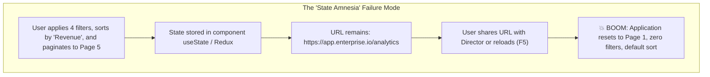

# Chapter 07: URL State Management & Deep Linking (The URL as Single Source of Truth, Nuqs, and History API Mechanics)

> "The URL is the most resilient, universal, and underutilized state container in computer science. If your users cannot copy the URL, paste it in Slack, and have their colleague see the exact same view, your application's state architecture is fundamentally broken."  
> — **Ryan Florence, Co-Creator of React Router & Remix**

---

## 1. Why This Topic Exists

Enterprise web applications repeatedly suffer from the **"State Amnesia" Bug**:



### The Architectural Axiom:
State is divided by its **Shareability Lifecycle**:
1. **Transient / Ephemeral State:** Does not belong in the URL (e.g., whether a tooltip is hovered, cursor coordinates, open dropdown flyouts).
2. **Contextual / Shareable State:** **Belongs strictly in the URL** (e.g., search keywords, filter criteria, active tabs, pagination offset, selected entity ID, modal dialog triggers).

Treating the URL as the **Canonical Single Source of Truth** gives your application:
- **Instant Deep Linking:** Every permutation of filters is bookmarkable and shareable.
- **Native Browser Ergonomics:** Full support for browser **Back** and **Forward** buttons.
- **Resilience Across Reloads:** Zero state loss when refreshing or restoring tabs.

---

## 2. Learning Objectives

By the end of this chapter, an experienced Senior / Staff Engineer will:
- Master the architectural boundary between **URL State** and **In-Memory State**.
- Dissect the underlying mechanics of the browser **History API**: `pushState`, `replaceState`, and `popstate` events.
- Understand why `window.history.pushState` **does not fire `popstate`**, and how routers synchronize with the browser.
- Implement type-safe, schema-validated URL state using modern primitives (`nuqs`, Zod, TanStack Router).
- Prevent the catastrophic **History API Rate Limiting** exception (`SecurityError: 100 calls per 30s`) via debounced transitions.
- Map URL state mechanics to **Angular `ActivatedRoute` & `Router`** (Section 10) and **ASP.NET Core Model Binding & Query Strings** (Section 11).
- Identify enterprise failure modes: 2,048 character URI length truncations, serialization drift, and query-based XSS injection.

---

## 3. Historical Evolution

```
1995 (MPA Query Strings) ──► 2014 (SPA Hash Bangs) ──► 2018 (React Router useSearchParams) ──► 2023-2026 (Type-Safe URL State & Nuqs)
Server handles ?q=react     Client ignores URL       Un-typed string manipulation             Schema-validated (Zod/Nuqs)
Full page reload            Hash amnesia (#!/home)    Manual parsing / casting                 React 19 Concurrent Transitions
```

- **1995–2010 — The Multi-Page Web:** Every state change was a GET form submission resulting in a new query string (`?page=2&category=tech`). URLs were always shareable, but navigation caused full page reloads.
- **2014–2018 — The SPA Hash-Bang Regression:** Early Single Page Applications dumped all state into Redux or component state. URLs became opaque (`/#/dashboard`). Users complained bitterly that the browser Back button was broken and links couldn't be shared.
- **2018–2022 — React Router `useSearchParams`:** Introduced an idiomatic hook wrapping the native `URLSearchParams` API. However, it had zero type safety, treated all values as strings (`"true"`, `"12"`), and lacked built-in debouncing or schema validation.
- **2023–2026 — The Type-Safe URL State Revolution:** Libraries like **`nuqs`** (formerly `next-usequerystate`) and **TanStack Router** elevated query parameters to first-class reactive state primitives with Zod schema validation, automatic type casting, shallow routing, and seamless integration with React 19 `startTransition`.

---

## 4. First Principles & Intuitive Physical Analogies (Layer 1)

### Metaphor 1: The GPS Coordinate Postcard
- Imagine standing at the edge of the Grand Canyon taking in a spectacular panoramic view.
- If you take a polaroid and put it in your pocket (*In-Memory Client State*), nobody else can see it. If you drop the camera (*Page Reload*), the view is gone.
- If you write the exact GPS latitude, longitude, and elevation on the back of a postcard and mail it to a friend (*The URL with Query Parameters*), your friend can drive to the exact same coordinates and witness the exact same vista.

### Metaphor 2: The Rewind Tape vs. The Whiteout Fluid (`pushState` vs. `replaceState`)
- **`pushState` is adding a new frame to the cassette tape:**  
  When a user clicks from Page 1 to Page 2, you record a new frame. When the user hits the browser Back button (*Rewind*), they step back to Page 1.
- **`replaceState` is applying Whiteout Fluid over the current line:**  
  When a user types 15 keystrokes into a search box (`"r"`, `"re"`, `"rea"`, `"reac"`, `"react"`), you do **not** want 15 entries on the tape. If you used `pushState`, the user would have to click Back 15 times just to leave the search page! Instead, you dab whiteout over the current frame (*`replaceState`*), keeping the history tape clean.

### Metaphor 3: The Airport Luggage Sizer
- The browser URL bar is an airline carry-on luggage sizer.
- You can pack small, essential identity tags: `?userId=42&sort=desc&page=3` (Fits easily).
- If you try to stuff a 5 MB JSON payload of table row data into the carry-on sizer, the airline gate agent stops you with an error (*HTTP 414 URI Too Long / Browser 2,048 character limit*).

---

## 5. Internal Working & Engine Architecture (Layer 2)

```mermaid
flowchart TD
    subgraph BrowserEngine ["Browser Joint Session History"]
        HistoryStack["Browser History Stack [Entry 0, Entry 1, Entry 2, ...]"]
        Location["window.location.search (?sort=asc&page=2)"]
    end

    subgraph RouterBridge ["React URL State Manager (Nuqs / Router)"]
        Hook["useQueryState / useSearchParams"]
        Adapter["Parser & Serializer (String <-> Type)"]
        Batcher["History Batcher & Debouncer"]
    end

    UI["React Component"] -->|Read State| Hook
    Hook --> Adapter
    Adapter --> Location
    UI -->|Write State: setPage(3)| Hook
    Hook --> Batcher
    Batcher -->|replaceState / pushState| HistoryStack
    HistoryStack -.->|Back Button: popstate event| Hook
```

### The Native History API Mechanics:

#### 1. `history.pushState(state, title, url)`
- Appends a brand-new entry onto the browser's Joint Session History stack.
- Updates the URL address bar immediately.
- **CRITICAL ARCHITECTURAL FACT:** `pushState` **DOES NOT** trigger a browser page reload, and it **DOES NOT** fire the `popstate` window event!

#### 2. `history.replaceState(state, title, url)`
- Overwrites the *current* entry in the history stack in place.
- Updates the URL address bar without expanding the navigation history.
- Like `pushState`, it does **not** fire the `popstate` event.

#### 3. The `popstate` Event Mystery
- The `window.addEventListener('popstate', ...)` event is fired **only** when the user navigates through browser actions: clicking the **Back** button, clicking the **Forward** button, or calling `history.back()`.
- **How React Routers synchronize:** Because programmatic `pushState` calls do not emit `popstate`, modern router libraries wrap or monkey-patch `history.pushState` and `history.replaceState` with custom event dispatchers to notify React subscribers.

---

## 6. Runtime Flow & Execution Traces

### Trace 1: The Debounced Search Keystroke Flow (`replaceState`)

```
T0: User types 'a' -> Local input displays 'a'
    - Debounce timer T1 scheduled (300ms)
T1 (100ms): User types 'p' -> Local input displays 'ap'
    - Timer T1 cancelled; Timer T2 scheduled (300ms)
T2 (200ms): User types 'i' -> Local input displays 'api'
    - Timer T2 cancelled; Timer T3 scheduled (300ms)
T3 (500ms): Timer T3 fires!
    - URL State Manager calls: history.replaceState(null, '', '?search=api')
    - URL bar updates cleanly to '?search=api'
    - History stack length remains 1 (Back button is NOT polluted!)
    - React 18 startTransition executes filtered query in background
```

### Trace 2: The Pagination Navigation Flow (`pushState` + `popstate`)

```
T0: User on Page 1 (URL: /items?page=1). History Stack: [ Page 1 ]
T1: User clicks "Page 2"
    - setPage(2, { history: 'push' })
    - history.pushState(null, '', '/items?page=2')
    - History Stack: [ Page 1, Page 2 ]
    - Component renders Page 2.
T2: User clicks Browser Back button
    - Browser moves pointer to Page 1.
    - Browser fires 'popstate' event on window!
    - React URL listener intercepts 'popstate'.
    - setPage state updates to 1.
    - Component renders Page 1 cleanly without full page reload!
```

---

## 7. Memory Model & Heap Layout

```
V8 Heap Memory: URL State Parsing
========================================================================================
[window.location.search String (Native C++ Blink)]
  │  "?sort=desc&page=3&tags=react&tags=performance"
  ▼
[V8 Ignition Heap]
  ├── URLSearchParams Instance (Allocates Parsed Map)
  │     ├── "sort" -> "desc"
  │     ├── "page" -> "3"
  │     └── "tags" -> ["react", "performance"]
  ▼
[Nuqs / Zod Schema Parser (Functional Pipeline)]
  ├── page: parseInt("3", 10)  ──► Number: 3 (Unboxed Smi)
  ├── sort: "desc"             ──► Const Literal: 'desc'
  └── tags: [...]              ──► Array of Strings
  ▼
[React Component Fiber]
  └── memoizedState: { page: 3, sort: 'desc', tags: [...] }
```

---

## 8. Visual Diagrams (ASCII / Text)

### Browser History Stack Transitions

```
ACTION: Initial Load
Stack: [ /dashboard ]
Pointer: ──────►

ACTION: User filters ?status=active (using replaceState)
Stack: [ /dashboard?status=active ]  <── Replaced in place!
Pointer: ──────►

ACTION: User clicks Page 2 (using pushState)
Stack: [ /dashboard?status=active, /dashboard?status=active&page=2 ]
Pointer: ───────────────────────────────►

ACTION: User hits Browser Back
Stack: [ /dashboard?status=active, /dashboard?status=active&page=2 ]
Pointer: ──────►  (Pointer moves back, popstate fires!)
```

---

## 9. Real World Usage & Production Patterns

> 🧪 **Companion Interactive Lab:** [UrlStateVisualizer.tsx](../../apps/portal/src/features/visualizers/topic-07/UrlStateVisualizer.tsx) | Live in Portal: `url-state-deep-linking`

### Production Pattern: Type-Safe URL State with `nuqs` and React 19 Transitions

```tsx
import React, { useTransition } from 'react';
import { useQueryState, parseAsInteger, parseAsString, parseAsArrayOf } from 'nuqs';

export function ProductCatalog() {
  const [isPending, startTransition] = useTransition();

  // 1. Type-Safe Search with Debounced Replace
  const [search, setSearch] = useQueryState(
    'q',
    parseAsString.withDefault('').withOptions({
      history: 'replace', // Do NOT pollute back button on keystrokes
      shallow: true,       // Update client without server roundtrip
      throttleMs: 300,     // Built-in debouncing/throttling
      startTransition,     // Wrap React updates in Concurrent Transition!
    })
  );

  // 2. Type-Safe Integer Pagination with Push
  const [page, setPage] = useQueryState(
    'page',
    parseAsInteger.withDefault(1).withOptions({
      history: 'push',    // Allow user to click Back to previous page
      shallow: true,
      startTransition,
    })
  );

  // 3. Array of Enums
  const [categories, setCategories] = useQueryState(
    'categories',
    parseAsArrayOf(parseAsString).withDefault([])
  );

  return (
    <div style={{ opacity: isPending ? 0.7 : 1 }}>
      <input
        type="search"
        placeholder="Filter products..."
        value={search}
        onChange={(e) => setSearch(e.target.value)}
      />

      <div className="pagination">
        <button
          disabled={page <= 1}
          onClick={() => setPage((p) => Math.max(1, p - 1))}
        >
          Previous
        </button>
        <span>Page {page}</span>
        <button onClick={() => setPage((p) => p + 1)}>Next</button>
      </div>
    </div>
  );
}
```

---

## 10. Angular Comparison

For Senior Angular Architects transitioning to React, URL state management maps to **Angular Router's `ActivatedRoute`** and **Navigation Extras**:

| Architectural Concept | Angular Paradigm | React / Nuqs Paradigm |
| :--- | :--- | :--- |
| **Reading Query Params** | `this.route.queryParams` (RxJS Observable) | `useQueryState()` hook or `useSearchParams()` |
| **Updating Query Params** | `this.router.navigate([], { queryParams: { page: 2 }, queryParamsHandling: 'merge' })` | `setPage(2, { shallow: true })` |
| **History Behavior** | `replaceUrl: true` vs `replaceUrl: false` | `history: 'replace'` vs `history: 'push'` |
| **Type Coercion** | Manual mapping in RxJS `.pipe(map(params => +params['page']))` | Schema parsers (`parseAsInteger`, `parseAsBoolean`) |
| **Navigation Lifecycle** | Route Resolvers & NavigationGuards (`CanActivate`) | React 19 `startTransition` and Suspense boundaries |

---

## 11. .NET Comparison

For .NET / ASP.NET Core Architects, URL State mirrors **Model Binding**, **Query String Parsers**, and **Route Constraints**:

| Architectural Concept | .NET / ASP.NET Core Paradigm | React / Nuqs Paradigm |
| :--- | :--- | :--- |
| **Query Extraction** | `[FromQuery] ProductFilterRequest request` | `useQueryState()` with schema parser |
| **Type Parsing & Validation** | `IModelBinder` / DataAnnotations / FluentValidation | `parseAsInteger` or Zod schema validation |
| **Query String Generation** | `QueryHelpers.AddQueryString(uri, queryParams)` | `serializer.serialize(value)` |
| **Default Fallback** | `public int Page { get; set; } = 1;` | `.withDefault(1)` |
| **Parameter Protection** | URL Encoding & anti-XSS request validation filters | Native `encodeURIComponent` & sanitize helpers |

---

## 12. Enterprise Perspective & Production Risks (Layer 4)

### Risk 1: The Browser History API Rate Limit Crash
```ts
// ❌ CATASTROPHIC BUG: Calling pushState on every single keystroke
<input onChange={(e) => navigate(`?q=${e.target.value}`)} />
```
*Why this crashes in production:* Both Google Chrome and WebKit enforce strict security quotas on the History API:  
**Maximum 100 history manipulations within 30 seconds**.  
A user typing quickly into an un-throttled search field will trigger:  
`Uncaught DOMException: SecurityError: Attempt to use history.pushState() more than 100 times per 30 seconds`.  
*Enterprise Solution:* Always use **`history: 'replace'`** combined with **300ms throttling/debouncing** for keyboard inputs.

### Risk 2: The 2,048 Character URI Truncation Failure
Internet Explorer historically capped URLs at 2,083 characters. Modern browsers support longer URLs, but enterprise reverse proxies (Nginx, AWS CloudFront, Cloudflare, Azure Front Door) default to a maximum header/URI size of **4 KB to 8 KB**.  
If an engineer attempts to store large state (e.g. complex filter trees or base64 JSON) in query params, requests will fail at the edge with **`HTTP 414 URI Too Long`**.  
*Rule:* Store only **IDs, primitives, and compact enums** in the URL; load actual objects from cache or database.

### Risk 3: Open Redirect and Query Parameter XSS
Never render unvalidated query parameters directly into the DOM or redirect URLs:
```tsx
// ❌ SECURITY HOLE: Reflected XSS
const [redirectUrl] = useQueryState('returnTo');
<a href={redirectUrl}>Continue</a> // Attacker injects: returnTo=javascript:stealTokens()
```
*Enterprise Fix:* Strictly validate parameters against an allow-list or protocol validator (e.g., ensure `returnTo` starts with `/` and not `//` or `javascript:`).

---

## 13. Performance Considerations

### Shallow Routing vs. Deep Re-mounting
- When updating URL search params in client-side architectures, ensure the navigation is configured as **shallow** (`shallow: true`).
- Shallow updates modify `window.location` and trigger state updates *without* remounting layout components, re-evaluating route loaders, or re-fetching above-the-fold server components.
- Combine with React 19 **`useTransition`**: Wrapping URL state updates in `startTransition` ensures the text input remains buttery smooth at 120 FPS while expensive table re-renders occur concurrently in the background.

---

## 14. Tradeoffs

| State Location | Shareability | Capacity | Back Button Support |
| :--- | :--- | :--- | :--- |
| **URL Search Params** | High (100% shareable link). | Low (<2 KB practical limit). | Yes (Native browser history). |
| **Client Memory (Zustand/RTK)** | Zero (Lost on share/refresh). | High (Bounded only by V8 RAM). | No (Requires custom history code). |
| **LocalStorage / SessionStorage** | Device-only (Not shareable via link).| Medium (~5 MB). | No (Out of sync with history). |

---

## 15. Common Mistakes & Interview Traps

### Trap 1: The Infinite URL Synchronization Loop
```tsx
// ❌ DISASTER: Two-way sync loop between local state and URL state
const [searchParams, setSearchParams] = useSearchParams();
const [filter, setFilter] = useState(searchParams.get('f') || '');

useEffect(() => {
  setFilter(searchParams.get('f') || '');
}, [searchParams]);

useEffect(() => {
  setSearchParams({ f: filter });
}, [filter]); // 💥 Triggers endless re-render loop!
```
*Why this fails:* Maintaining duplicate state in `useState` and `searchParams` creates two competing sources of truth.  
*The Architect Rule:* **Eliminate `useState` entirely.** Read directly from the URL and write directly to the URL.

---

## 16. Interview Questions & Architectural Answers (Senior, Lead, Architect - Layer 5)

### Q1: Why does `window.history.pushState()` NOT fire the `popstate` event, and how do client-side routers bridge this gap?
**Architect Answer:**  
The W3C specification explicitly designed `popstate` to represent *user-initiated session traversal* (e.g., clicking Back or Forward), not programmatic changes initiated by the script itself.  
Client-side routers bridge this gap by wrapping `window.history.pushState` and `window.history.replaceState`. When a route navigation occurs, the router executes the native method, then manually dispatches an internal synthetic event or calls its central subscriber registry to notify active React components to reconcile.

### Q2: How would you architect a search table supporting 15 distinct filters, multi-column sorting, and pagination so that it is 100% shareable, resilient to reload, and impervious to browser history rate limits?
**Architect Answer:**  
I would establish the URL query string as the canonical Single Source of Truth using a schema-validated abstraction like `nuqs` or TanStack Router:
1. **Schema Validation:** Define a strict Zod schema parsing and coercing all 15 parameters with defaults. Any unknown or malformed parameter falls back safely to default.
2. **History Strategy:** 
   - Keystroke search filters utilize `history: 'replace'` with a 300ms throttle to prevent History API `SecurityError` rate-limits.
   - Distinct discrete clicks (pagination, sorting, column toggles) utilize `history: 'push'` to maintain intuitive browser Back-button traversal.
3. **Concurrency:** Wrap updates in React 19 `startTransition` and enable shallow routing so typing remains non-blocking while the filtered data grid reconciles asynchronously.

---

## 17. Senior-Level Mental Model & "How to Remember This Forever" (Layer 3)

### The "Keystroke vs. Click" Golden Rule:
- **Keystrokes are `replaceState`** (You don't want 20 Back-button steps for typing one word).
- **Clicks are `pushState`** (Users expect Back-button to return to the previous page or tab).
- **The URL is the Postcard:** If you can't mail the link to a coworker and have them see your exact screen, your state architecture has failed.

---

## 18. Core Vocabulary & "Aha!" Breakthrough Insights (Refresher)

- **URL State:** Application state serialized into URL path segments or query parameters (`?key=value`).
- **Deep Linking:** Navigating directly to a specific sub-state or resource via a fully-qualified URL.
- **`pushState`:** Appends a new navigation record to the browser history stack.
- **`replaceState`:** Overwrites the current navigation record without adding a history entry.
- **`popstate`:** Native browser event dispatched when the user traverses session history (Back/Forward).
- **Shallow Routing:** Updating the browser URL without remounting page layouts or triggering server data loaders.

---

## 19. Key Takeaways

1. **The URL is the universal state container:** filter, search, pagination, and active tabs belong in the URL.
2. **Never duplicate URL state in `useState`;** derive UI directly from query parameters.
3. **Always throttle/debounce keyboard inputs** to avoid browser History API `SecurityError` rate limits.
4. **Use `replaceState` for high-frequency text inputs; use `pushState` for discrete clicks.**

---

## 20. Revision Sheet

```
┌────────────────────────────────────────────────────────────────────────┐
│                   URL STATE MANAGEMENT CHEAT SHEET                     │
├────────────────────────────────────────────────────────────────────────┤
│ 1. State Categorization:                                               │
│    - URL State: Search, filters, tabs, page index, entity ID.          │
│    - Memory State: Hover, animations, keystroke buffers, open flyouts. │
│                                                                        │
│ 2. History API Golden Rule:                                            │
│    - Typing in search box -> history: 'replace' + debounce 300ms       │
│    - Clicking page/tab   -> history: 'push' (Preserves Back button)    │
│                                                                        │
│ 3. Modern Pattern:                                                     │
│    useQueryState('page', parseAsInteger.withDefault(1))                │
│    - Schema-validated, type-safe, auto-coerced, shallow routing.       │
│                                                                        │
│ 4. Critical Production Trap:                                           │
│    Calling pushState on every keystroke triggers SecurityError         │
│    (Chrome/WebKit limit: max 100 history calls per 30 seconds).        │
└────────────────────────────────────────────────────────────────────────┘
```
