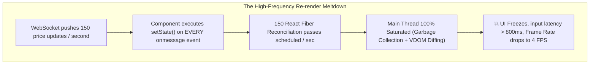
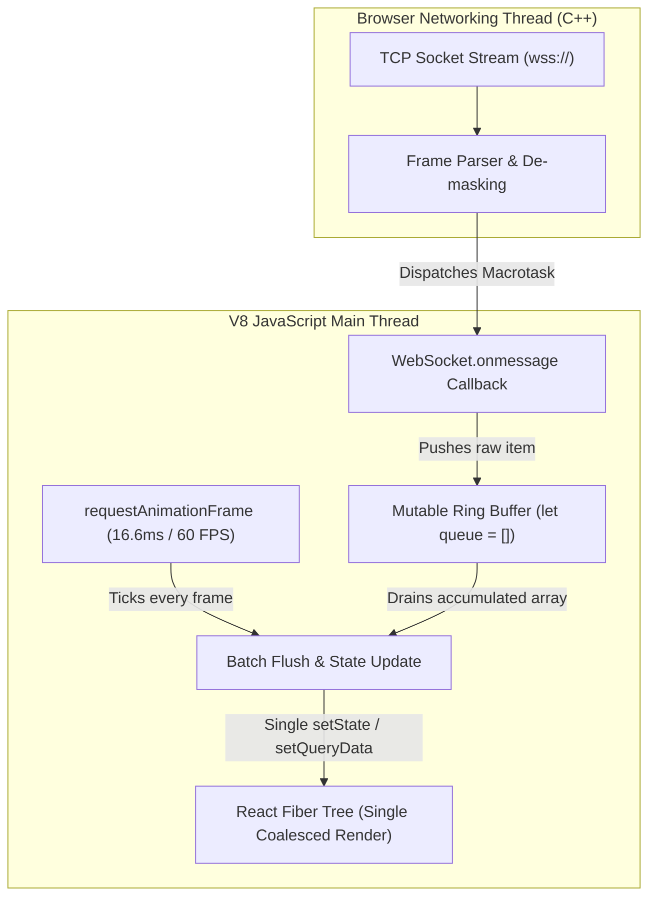

# Chapter 08: Real-Time State (WebSockets, SSE) & React Synchronization (Push vs Pull, Throttling 60 FPS Streams, and Reconnection Topologies)

> "A WebSocket connection is an open firehose running straight into your application. If you blindly wire incoming socket messages directly into React component state, you will drown the V8 event loop and freeze your user interface at 3 frames per second."  
> — **Senior Frontend Architect Insight**

---

## 1. Why This Topic Exists

Enterprise web applications are increasingly real-time: financial trading terminals, collaborative design canvases, multi-player whiteboards, and live IoT telemetry.

When teams connect real-time streaming protocols (WebSockets, Server-Sent Events) to React, they almost always hit the **"Main Thread Meltdown"**:



### The Three Critical Real-Time Engineering Challenges:
1. **The Frequency Mismatch:** Human displays refresh at **60 Hz (16.6ms) or 120 Hz (8.3ms)**. Ingesting 200 data points per second into separate render cycles wastes 90% of CPU cycles rendering intermediate frames no human eye can see.
2. **Lifecycle Coupling & StrictMode Hazards:** Sockets instantiated inside component hooks spawn duplicate zombie connections during React 18/19 StrictMode mount-unmount cycles.
3. **Connection Resilience:** Real-world networks drop. A production socket engine requires **Heartbeats (Ping-Pong)**, **Exponential Backoff with Jitter**, and **Offline Queueing**.

---

## 2. Learning Objectives

By the end of this chapter, an experienced Senior / Staff Engineer will:
- Choose definitively between **HTTP Long-Polling**, **Server-Sent Events (SSE)**, and **WebSockets** based on protocol tradeoffs.
- Architect the **Buffer & Batch Animation Loop** to coalesce high-frequency push events into buttery-smooth 60 FPS / 120 FPS UI updates.
- Patch real-time data seamlessly into **TanStack Query caches** (`setQueryData`) and **Zustand stores** without component unmount leaks.
- Implement production-grade connection resiliency: **Heartbeat/Ping-Pong detection**, **Exponential Backoff with Jitter**, and **Message Replay**.
- Map real-time patterns to **Angular RxJS `webSocket` & SignalR** (Section 10) and **ASP.NET Core SignalR Hubs & Channels** (Section 11).
- Prevent enterprise vulnerabilities: multi-tab connection exhaustion via `SharedWorker`, memory leaks from zombie event listeners, and token expiry mid-stream.

---

## 3. Historical Evolution

```
2000 (AJAX Polling) ────► 2006 (Comet / Long-Poll) ──► 2011 (RFC 6455 WebSockets) ──► 2023-2026 (Modern Coalesced Streaming)
setInterval(fetch, 5s)    Hanging HTTP requests        Full-duplex TCP framing          requestAnimationFrame buffering
Heavy HTTP header tax     High latency / server load    ws:// and wss:// protocols      useSyncExternalStore integration
```

- **2000–2006 — Short Polling:** Browsers executed `setInterval(() => fetch(), 3000)`. 95% of responses were HTTP 304 or identical payloads, creating massive server infrastructure waste.
- **2006–2011 — Comet / Long Polling:** The client opened an HTTP request that the server kept open until fresh data was available. Once answered, the client immediately opened another. Better latency, but heavy connection overhead.
- **2011 — The WebSocket Standard (RFC 6455) & SSE:** The browser gained native full-duplex TCP connections via the `WebSocket` API, as well as native unidirectional push over HTTP via `EventSource` (SSE).
- **2023–2026 — Modern Concurrent Streaming:** Today, real-time data is decoupled from component trees. External stream engines buffer events in memory and flush updates to React via `requestAnimationFrame` or `useSyncExternalStore`, preventing render thrashing while preserving 60 FPS responsiveness.

---

## 4. First Principles & Intuitive Physical Analogies (Layer 1)

### Metaphor 1: The Mailman vs. The Open Intercom vs. The Telephone
- **HTTP Request-Response is Sending a Letter:** You put a letter in the mailbox, wait 3 days for the mail truck, and get a reply letter.
- **Server-Sent Events (SSE) is an Office Intercom:** The speaker on the wall only broadcasts from the boss's desk down to your office. You cannot talk back through the speaker (*Unidirectional Push*), but it is cheap, simple, and runs over existing office wiring (*Standard HTTP/2*).
- **WebSockets is a Dedicated Open Telephone Call:** You pick up the phone, dial once, and leave the line open. Both parties can talk simultaneously at any microsecond (*Full Duplex TCP*).

### Metaphor 2: The Water Bucket & The Splash Guard (Buffer & Batch)
- Imagine an open faucet dripping 100 drops of water per second (*Incoming WebSocket events*).
- If you react to every individual drop by running across the room to mop the floor (*`setState` on every message*), you will collapse from exhaustion.
- Instead, you place a **Bucket** under the faucet (*A mutable array buffer on the V8 heap*).
- Once every 16 milliseconds (*`requestAnimationFrame`*), you pick up the bucket, empty the accumulated water in one clean pour, and put the bucket back. The floor gets cleaned at a steady 60 times a second with zero wasted energy.

---

## 5. Internal Working & Engine Architecture (Layer 2)



### The Three Transport Architectures Compared:

| Feature | HTTP Polling | Server-Sent Events (SSE) | WebSockets (`wss://`) |
| :--- | :--- | :--- | :--- |
| **Protocol** | Standard HTTP/1.1 or HTTP/2 | HTTP/2 or HTTP/1.1 Streaming | Native WebSocket Protocol (RFC 6455) |
| **Direction** | Pull (Client-initiated) | Push (Server-to-Client only) | Full Duplex (Bidirectional) |
| **Transport Overhead** | Full HTTP headers on every tick | Initial HTTP handshake only | 2-byte frame overhead per packet |
| **Reconnection** | Manual | **Automatic native reconnection** | Manual custom reconnection logic |
| **Firewall / Proxy** | 100% Traverse friendly | 100% Traverse friendly | Sometimes blocked by corporate proxies |
| **Ideal For** | Infrequent updates (1 min+) | Stock tickers, news, notifications | Collaborative editing, gaming, chat |

---

## 6. Runtime Flow & Execution Traces

### Trace 1: The 100-Messages-Per-Second Batching Execution Trace

```
Frame 1 (0ms to 16.6ms):
  - 0.0ms: RAF loop schedules next tick.
  - 2.1ms: WS message #1 arrives -> queue.push(item1) (V8 Array push: 0.001ms)
  - 5.4ms: WS message #2 arrives -> queue.push(item2)
  - 8.9ms: WS message #3 arrives -> queue.push(item3)
  - 14.2ms: WS message #4 arrives -> queue.push(item4)
  - 16.6ms: RAF fires!
      - Engine executes: const batch = queue.splice(0);
      - Dispatches single state update with [item1, item2, item3, item4].
      - React renders ONCE for all 4 items!
      - CPU load: < 2%! Frame time: 1.2ms. ZERO DROPPED FRAMES!
```

### Trace 2: Reconnection with Exponential Backoff and Jitter

```
T0: WebSocket drops (Network disconnect / Server restart).
T1: ws.onclose fires. Clean = false, Code = 1006 (Abnormal Closure).
T2: Calculate delay with Jitter:
    Formula: Math.min(maxDelay, baseDelay * (2 ** retryCount)) + Math.random() * 1000
    - Attempt 1: 1,000ms + 234ms jitter = 1,234ms
    - Attempt 2: 2,000ms + 891ms jitter = 2,891ms
    - Attempt 3: 4,000ms + 412ms jitter = 4,412ms
T3: Timer fires -> createWebSocketConnection().
T4: Handshake succeeds (HTTP 101 Switching Protocols).
T5: Reset retryCount = 0. Flush any pending outbound offline queue!
```

---

## 7. Memory Model & Heap Layout

```
V8 Heap Layout: Real-Time Stream Manager
========================================================================================
[Global / Module Scope]
  │
  └── RealtimeSocketClient (Singleton outside React Component Tree)
        ├── ws: WebSocket Instance (Retains native OS socket handle)
        ├── pingTimerId: TimeoutId (Heartbeat check)
        ├── incomingBuffer: Array<Message> (Pre-allocated V8 Nursery Space)
        │     ├── [0]: Pointer @0x101
        │     ├── [1]: Pointer @0x102
        │     └── [2]: Pointer @0x103
        └── listeners: Set<(batch: Message[]) => void>
              │
              └── Listener #1: TanStack Query Cache Updater
                    └── queryClient.setQueryData(['ticker'], ...)
```

---

## 8. Visual Diagrams (ASCII / Text)

### Multi-Tab Coordination: SharedWorker Architecture

```
TAB 1 (Trading View)         TAB 2 (Order Book)         TAB 3 (Portfolio)
       │                            │                            │
       └────────────────────────────┼────────────────────────────┘
                                    ▼
                         SharedWorker / BroadcastChannel
                                    │
                                    ▼ (ONLY 1 SINGLE SOCKET!)
                         WebSocket Connection (wss://)
                                    │
                                    ▼
                         Remote Enterprise Cluster
```
*Why this matters:* If a user opens 10 browser tabs to your application, creating 10 WebSocket connections wastes server connection pools. A **`SharedWorker`** or **`BroadcastChannel`** maintains **1 single shared socket** for the entire browser session.

---

## 9. Real World Usage & Production Patterns

> 🧪 **Companion Interactive Lab:** [RealtimeStreamVisualizer.tsx](../../apps/portal/src/features/visualizers/topic-08/RealtimeStreamVisualizer.tsx) | Live in Portal: `realtime-stream-sync`

### Production Pattern: High-Frequency RAF Batching Hook with TanStack Query Integration

```tsx
import { useEffect, useRef } from 'react';
import { useQueryClient } from '@tanstack/react-query';

interface TradeUpdate {
  symbol: string;
  price: number;
  timestamp: number;
}

export function useRealtimeTrades(symbol: string) {
  const queryClient = useQueryClient();
  const bufferRef = useRef<TradeUpdate[]>([]);
  const rafIdRef = useRef<number | null>(null);

  useEffect(() => {
    const ws = new WebSocket(`wss://api.enterprise.io/trades/${symbol}`);

    // 1. Flush accumulated buffer at 60 FPS using requestAnimationFrame
    const flushBuffer = () => {
      if (bufferRef.current.length > 0) {
        const batch = bufferRef.current;
        bufferRef.current = []; // Drain queue

        // Surgically patch TanStack Query cache in ONE single atomic update!
        queryClient.setQueryData<TradeUpdate[]>(['trades', symbol], (old = []) => {
          // Prepend latest trades, keeping only the last 50 items
          return [...batch, ...old].slice(0, 50);
        });
      }
      rafIdRef.current = requestAnimationFrame(flushBuffer);
    };

    // Start RAF loop
    rafIdRef.current = requestAnimationFrame(flushBuffer);

    // 2. High-speed ingest: only pushes into memory array! Zero React renders here!
    ws.onmessage = (event: MessageEvent) => {
      const trade: TradeUpdate = JSON.parse(event.data);
      bufferRef.current.push(trade);
    };

    // 3. Strict cleanup on unmount
    return () => {
      ws.close();
      if (rafIdRef.current !== null) {
        cancelAnimationFrame(rafIdRef.current);
      }
    };
  }, [symbol, queryClient]);
}
```

---

## 10. Angular Comparison

For Senior Angular Architects transitioning to React, real-time architectures map directly to **RxJS `webSocket()`**, **Angular SignalR**, and **buffer operators**:

| Architectural Concept | Angular Paradigm | React / Real-Time Pattern |
| :--- | :--- | :--- |
| **Stream Representation** | RxJS `webSocket<T>('wss://...')` Subject | Native `WebSocket` managed outside React + `useSyncExternalStore` |
| **Frequency Throttling** | `socket$.pipe(bufferTime(16))` or `sampleTime(16)` | Mutable array queue + `requestAnimationFrame` loop |
| **Connection Lifecycle** | Service Singleton (`providedIn: 'root'`) | Module-level singleton or Root Context provider |
| **Reconnection Logic** | RxJS `retry({ delay: (err, count) => timer(...) })` | Custom backoff timer loop with randomized Jitter |
| **Push Updates to UI** | `async` pipe or Angular 19 Signal `toSignal()` | `queryClient.setQueryData()` or Zustand store setter |

---

## 11. .NET Comparison

For .NET / ASP.NET Core Architects, client-side WebSocket management pairs directly with **ASP.NET Core SignalR** and **Channel pipelines**:

| Architectural Concept | .NET / ASP.NET Core Paradigm | React / Real-Time Pattern |
| :--- | :--- | :--- |
| **Server Hub** | `Hub<ITickerClient>` / `MapHub<TickerHub>("/ticker")` | WebSocket / SSE endpoint connection |
| **Client Abstraction** | `@microsoft/signalr` `HubConnectionBuilder` | Custom WebSocket client with event emitter |
| **Backpressure / Buffering** | `System.Threading.Channels.Channel<T>` | Heap array buffer drained via `requestAnimationFrame` |
| **Heartbeat / Keep-Alive** | SignalR Ping/Pong protocol (`keepAliveInterval`) | Client-side `setInterval` ping frame + pong timeout |
| **Distributed Backplane** | Azure SignalR Service / Redis Backplane | Client handles reconnect & server cluster failover |

---

## 12. Enterprise Perspective & Production Risks (Layer 4)

### Risk 1: The Zombie Socket Leak (React StrictMode & Fast Refresh)
In development, React 18 & 19 mount, unmount, and re-mount components immediately. If your socket connection logic does not properly track or close connections in the `useEffect` cleanup function, you will open **2 to 5 redundant active WebSocket connections** every time you edit a file, multiplying backend server load.

### Risk 2: Thundering Herd on Server Cluster Restart
When a backend server node hosting 50,000 WebSocket connections restarts, all 50,000 clients disconnect simultaneously.  
If clients reconnect with a fixed timer (e.g. `setTimeout(reconnect, 1000)`), **50,000 requests hit the new server in the exact same millisecond**, instantly crashing the server again (*The Thundering Herd Collapse*).  
*Mandatory Rule:* Always apply **Exponential Backoff with Full Jitter** (`delay = Math.random() * baseDelay * (2 ** retryCount)`).

### Risk 3: JWT Token Expiration Mid-Connection
WebSocket connections can stay open for hours or days. A user's JWT access token may expire after 15 minutes.  
*Architecture:* Implement an in-band token refresh message protocol:
`ws.send(JSON.stringify({ type: 'REFRESH_TOKEN', token: newJwt }))`, or configure the server to send an explicit warning frame before closing the socket, allowing the client to refresh the token and reconnect gracefully.

---

## 13. Performance Considerations

### JSON Parsing Cost on High-Throughput Streams
- Parsing 500 complex JSON strings per second on the JavaScript main thread can consume 15ms–20ms of execution time, dropping frames.
- **Enterprise Solution:** Offload JSON decoding to a dedicated **Web Worker**. The Web Worker ingests raw WebSocket binary (`ArrayBuffer`) or strings, parses the JSON off the main thread, and transfers structured objects to the main thread via `postMessage`.

---

## 14. Tradeoffs

| Mechanism | Strengths | Weaknesses |
| :--- | :--- | :--- |
| **Server-Sent Events (SSE)** | Native HTTP/2 multiplexing, automatic browser reconnection, zero custom protocols. | Unidirectional (Server-to-client only), text/UTF-8 only (no raw binary). |
| **WebSockets** | Full-duplex bidirectional communication, minimal 2-byte frame overhead, binary support. | Requires custom reconnection logic, heartbeats, and bypasses HTTP/2 multiplexing. |
| **Short Polling** | Trivial to implement, standard HTTP caching. | High network overhead, high latency, server connection exhaustion. |

---

## 15. Common Mistakes & Interview Traps

### Trap 1: Binding `ws.onmessage` Directly to `setState`
- **Candidate Answer (Junior):** *"I just call `setPrices(prev => [...prev, newPrice])` inside `ws.onmessage`."*
- **Architect Critique:** This creates an immediate CPU starvation disaster when market data spikes. Always decouple ingest from rendering using a buffer drained on `requestAnimationFrame`.

### Trap 2: Neglecting the Heartbeat (Silent Dead Sockets)
TCP sockets can die silently when intermediate cellular towers, NAT gateways, or corporate firewalls drop connection state without sending a TCP `FIN` packet. The browser believes the socket is `OPEN`, but no data will ever arrive.  
*The Fix:* Implement a client-side heartbeat timer: send a ping every 30 seconds; if no pong arrives within 5 seconds, forcefully terminate and restart the connection.

---

## 16. Interview Questions & Architectural Answers (Senior, Lead, Architect - Layer 5)

### Q1: How do you architect a frontend that ingests 1,000 WebSocket messages per second while maintaining 60 FPS user interaction?
**Architect Answer:**  
I implement a **Multi-Tiered Decoupled Pipeline**:
1. **Thread Isolation (Web Worker):** Terminate the WebSocket connection inside a dedicated Web Worker. The worker decodes binary frames and filters out un-viewed symbols off the main thread.
2. **Buffer & Coalescing Engine:** On the main thread, incoming updates are pushed into an in-memory mutable ring buffer.
3. **60 FPS Synchronized Drain:** A `requestAnimationFrame` loop drains the buffer at the display's native refresh rate (16.6ms), calculating the latest unified state snapshot and dispatching a single atomic update to the store.
4. **Transient DOM Rendering:** For mission-critical numbers (e.g. flashing ticker cells), use direct DOM mutations (`ref.current.textContent = newPrice`) to bypass Virtual DOM reconciliation entirely.

### Q2: Under what circumstances would you choose Server-Sent Events (SSE) over WebSockets in an enterprise system?
**Architect Answer:**  
I choose SSE when the communication pattern is predominantly **unidirectional (server-to-client)**, such as stock tickers, notification feeds, or LLM token streaming (e.g. ChatGPT responses).  
SSE operates over standard HTTP/2, which means it **multiplexes across existing HTTP connections** without opening new TCP ports, traverses corporate firewalls and proxies without issue, and has **built-in browser reconnection and event ID tracking (`Last-Event-ID`)** out of the box. I only choose WebSockets when bidirectional client-to-server messaging is strictly required with sub-millisecond latency.

---

## 17. Senior-Level Mental Model & "How to Remember This Forever" (Layer 3)

### The "Bucket & Splash Screen" Mental Anchor:
- The WebSocket is a **Firehose** running at 200 drops per second.
- The React Virtual DOM is a **Fine Silk Canvas** that tears if you hit it 200 times per second.
- You must always place a **Metal Bucket** (*The JS Array Buffer*) under the firehose, and empty the bucket onto the canvas only once per frame (*`requestAnimationFrame`*).

---

## 18. Core Vocabulary & "Aha!" Breakthrough Insights (Refresher)

- **Full-Duplex:** Simultaneous two-way communication over a single channel (WebSockets).
- **Server-Sent Events (SSE):** Unidirectional server-to-client streaming protocol over standard HTTP.
- **`requestAnimationFrame` (RAF):** Browser API synchronizing code execution with display hardware refreshes (typically 60Hz or 120Hz).
- **Exponential Backoff with Jitter:** Reconnection algorithm that increases retry delays exponentially while injecting random noise to prevent server thundering herds.
- **Heartbeat (Ping/Pong):** Periodic lightweight probe packets detecting silently dead TCP connections.

---

## 19. Key Takeaways

1. **Never call `setState` inside `ws.onmessage` directly** for high-frequency streams; always buffer and batch via `requestAnimationFrame`.
2. **SSE is superior to WebSockets for unidirectional streams** due to HTTP/2 multiplexing and native auto-reconnection.
3. **Always apply Exponential Backoff with Jitter** to prevent overwhelming servers after outages.
4. **Decouple socket lifecycle from component lifecycles** to prevent StrictMode duplicate connection bugs.

---

## 20. Revision Sheet

```
┌────────────────────────────────────────────────────────────────────────┐
│                   REAL-TIME STATE ARCHITECTURE REVISION                │
├────────────────────────────────────────────────────────────────────────┤
│ 1. The Real-Time Dilemma:                                              │
│    Stream: 100+ msgs/sec  vs.  Display: 60 FPS (16.6ms frames)         │
│    Solution: Buffer in JS array -> Flush ONCE per frame via RAF!       │
│                                                                        │
│ 2. Protocol Selection:                                                 │
│    - One-way stream (LLM tokens, tickers, alerts) -> SSE (EventSource) │
│    - Two-way interactive (chat, canvas, gaming)   -> WebSocket (wss://)│
│                                                                        │
│ 3. Resilience Triad:                                                   │
│    - Heartbeat: Detect silently dropped connections (Ping/Pong).       │
│    - Jitter: Randomize reconnect delays to avoid thundering herd.      │
│    - Cleanup: Close sockets and cancel RAF on component unmount!       │
│                                                                        │
│ 4. Golden Integration Pattern:                                         │
│    Patch TanStack Query via queryClient.setQueryData() in RAF batch!   │
└────────────────────────────────────────────────────────────────────────┘
```
