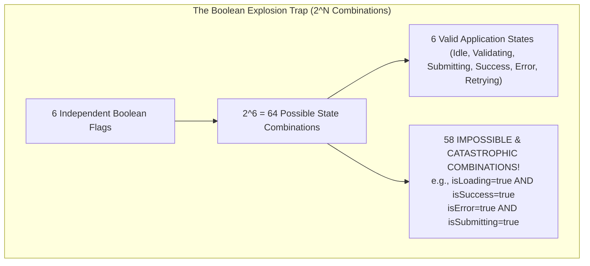

# Chapter 09: State Machines with XState in Complex UI Workflows (Finite State Automata, Statecharts, and Impossible States)

> "Make impossible states impossible. If your code allows `isLoading: true` and `isSuccess: true` to exist simultaneously, your system is not robust—it is merely waiting for the right race condition to crash."  
> — **David Khourshid, Creator of XState**

---

## 1. Why This Topic Exists

As frontend applications scale, component logic routinely degenerates into the **"Boolean Explosion"**:

```tsx
// The Classic Boolean Explosion Antipattern
const [isLoading, setIsLoading] = useState(false);
const [isError, setIsError] = useState(false);
const [isSuccess, setIsSuccess] = useState(false);
const [isSubmitting, setIsSubmitting] = useState(false);
const [isValidating, setIsValidating] = useState(false);
const [isRetrying, setIsRetrying] = useState(false);
```



### The Architectural Consequences of Boolean Soup:
1. **Unreachable Code Paths & Ghost Bugs:** A user double-clicks "Submit" while a network retry is pending, triggering conflicting API calls.
2. **Defensive Programming Paralyzes Velocity:** Developers write endless chains of `if (isLoading && !isError && !isSubmitting && isValid)`. Missing a single flag in one `if` condition produces a critical production defect.
3. **Zero Visual Auditing:** Product managers, QA engineers, and architects have no single source of truth describing how the system transitions between operational states.

**Finite State Machines (FSMs)** and **David Harel Statecharts** solve this by mathematically constraining the application: **the system can only exist in exactly one finite state at a time**, and can only transition to another state in response to explicitly declared events.

---

## 2. Learning Objectives

By the end of this chapter, an experienced Senior / Staff Engineer will:
- Master the mathematical formalisms of **Finite State Automata (FSA)** and **David Harel Statecharts** (Hierarchy, Parallelism, History).
- Dissect the **XState v5 Actor Model**: `setup()`, `createMachine()`, `assign()`, guards, and actions.
- Architect complex UI workflows (multi-step checkout wizards, authentication flows, media players) with zero impossible states.
- Differentiate cleanly between **Finite State** (`value`) and **Extended State / Quantitative Data** (`context`).
- Connect state machines to React 19 using `@xstate/react`'s `useActor` and `useSelector` with `useSyncExternalStore`.
- Map XState concepts to **Angular State Routing / NgRx State Machines** (Section 10) and **.NET Stateless Library / MassTransit State Machine Sagas** (Section 11).
- Identify enterprise failure modes: over-engineering trivial toggles, state machine context bloat, and bundle size overhead.

---

## 3. Historical Evolution

```
1950s (Turing / Moore) ──► 1987 (David Harel Statecharts) ──► 2015 (Redux Actions) ──► 2023-2026 (XState v5 Actor Model)
Mathematical Automata     Visual formalism (Hierarchy)      Unconstrained dispatch     Pure Actor Model, Type-Safe
Hardware & switches       Parallel states, guards, history   Any action anytime         Zero TS casts, React 19 Ready
```

- **1950s — Classical Automata:** Automata theory powered compilers and hardware circuits (Mealy and Moore machines). However, simple FSMs suffered from "state explosion" when modeling complex systems.
- **1987 — David Harel's Breakthrough:** Computer scientist David Harel published his seminal paper introducing **Statecharts**, adding **Hierarchical (nested) states**, **Parallel (orthogonal) states**, and **Extended State (Context)**.
- **2015–2018 — The Redux Illusion:** Redux brought predictability with pure reducers, but provided **zero state constraints**: any action could be dispatched at any time, even when the UI was in an invalid state to process it.
- **2023–2026 — XState v5 & Modern React:** David Khourshid rebuilt XState around the **Actor Model** (inspired by Erlang/Akka). Version 5 eliminates complex TypeScript typings, introduces the declarative `setup()` API, and integrates seamlessly with React concurrent rendering.

---

## 4. First Principles & Intuitive Physical Analogies (Layer 1)

### Metaphor 1: The Subway Turnstile
- A mechanical subway turnstile has exactly **two states**: `Locked` and `Unlocked`.
- It accepts exactly **two events**: `COIN` and `PUSH`.
- If it is `Locked` and you `PUSH`, the mechanical ratchet blocks the arm (*Ignored / Rejected Transition*).
- If you insert a `COIN`, the ratchet releases and it transitions to `Unlocked`.
- If it is `Unlocked` and you insert another `COIN`, it stays `Unlocked` (it does not double-unlock!).
- Once you `PUSH`, the ratchet immediately locks behind you, transitioning back to `Locked`.
- **The Physical Ratchet makes illegal states physically impossible.**

### Metaphor 2: The Traffic Light
- A traffic light transitions strictly: `Green` -> `Yellow` -> `Red` -> `Green`.
- It is physically impossible for the hardware to illuminate both `Green` and `Red` simultaneously.
- If an electrical short occurs, the hardware fails safe into a dedicated fallback state: `Blinking Yellow`.

### Metaphor 3: "State is Where You Are; Context is What You Carry in Your Backpack"
- **Finite State (`value`):** The room you are standing in (`'browsing'`, `'cartReview'`, `'payment'`, `'confirmed'`). You can only be in one room at a time.
- **Context (`context`):** The quantitative items in your backpack (`cartItems: []`, `totalAmount: 142.50`, `retryAttempts: 2`).

---

## 5. Internal Working & Engine Architecture (Layer 2)

```mermaid
flowchart TD
    subgraph XStateEngine ["XState v5 Statechart Engine"]
        Event["Incoming Event: { type: 'SUBMIT' }"] --> CurrentState["Current State Node: 'idle'"]
        CurrentState --> CheckGuards{"Evaluate Guards<br/>(e.g., isValidCart?)"}
        
        CheckGuards -->|Guard Fails (false)| Reject["Event Ignored / No-Op<br/>(State remains 'idle')"]
        CheckGuards -->|Guard Passes (true)| Transition["Execute State Transition"]
        
        Transition --> ExitActions["Run exit actions of 'idle'"]
        ExitActions --> TransitionActions["Run transition actions & assign()"]
        TransitionActions --> EntryActions["Run entry actions of 'submitting'"]
        EntryActions --> NewState["New State Node: 'submitting'<br/>(Invoke payment Actor / Promise)"]
    end
```

### The Anatomy of an XState v5 State Machine:

#### 1. Finite States (`states`)
Explicit named nodes (`idle`, `authenticating`, `success`, `failure`). The engine mathematically guarantees the machine is in exactly one state node (or a set of orthogonal states if parallel).

#### 2. Events (`on: { EVENT_NAME: ... }`)
The outside world can only communicate with the machine by sending structured event objects: `{ type: 'CLICK', payload: ... }`.

#### 3. Guards (`guard`)
Pure predicate functions `({ context, event }) => boolean` that act as gatekeepers. If the guard returns `false`, the transition is aborted and the machine remains in its current state.

#### 4. Actions & Assign (`actions`, `assign`)
- **Actions:** Fire-and-forget side effects (e.g., logging, triggering an audio ding, sending an analytics beacon).
- **`assign()`:** The **only** mechanism permitted to update `context`. Returns a new context object immutably.

#### 5. Invoked Actors (`invoke`)
Long-running async processes (Promises, Observables, or child machines) spawned when entering a state and automatically cancelled when exiting that state.

---

## 6. Runtime Flow & Execution Traces

### Trace 1: Checkout Wizard State Transition Trace

```
T0: Initial State: 'cart'
    - Context: { items: [Item A, Item B], total: 100 }
T1: User clicks "Checkout" -> Machine receives: { type: 'PROCEED' }
    - Guard: isCartNotEmpty -> returns TRUE.
    - Transitions to: 'shippingAddress'
T2: User enters invalid zip code and clicks "Continue" -> Machine receives: { type: 'SUBMIT_ADDRESS' }
    - Guard: isValidAddress -> returns FALSE!
    - Action: NO TRANSITION OCCURS. State remains 'shippingAddress'.
    - UI displays inline validation error.
T3: User enters valid zip code -> Machine receives: { type: 'SUBMIT_ADDRESS' }
    - Guard: isValidAddress -> returns TRUE.
    - assign({ address: event.data })
    - Transitions to: 'payment'
T4: User double-clicks "Pay Now" ($100):
    - First Click: { type: 'PAY' } -> Transitions to 'processingPayment'.
    - Payment Promise spawned!
    - Second Click (20ms later): { type: 'PAY' } arrives while in 'processingPayment'.
    - Engine detects: 'processingPayment' has NO transition for 'PAY'!
    - Second click is SILENTLY DROPPED! Zero duplicate credit card charges!
```

---

## 7. Memory Model & Heap Layout

```
V8 Heap Memory: XState v5 Machine & Actor
========================================================================================
[Static Machine Definition (Old Space / Immutable)]
  │  createMachine({ id: 'checkout', ... })
  │  Contains the transition graph, AST nodes, and guard functions.
  ▼
[Runtime Actor Instance (Created via createActor)]
  ├── status: 'active'
  ├── state: Snapshot Object (Allocated on V8 Heap)
  │     ├── value: 'processingPayment' (String primitive)
  │     ├── context: { items: [...], total: 100 } (Immutable pointer)
  │     └── status: 'active'
  ├── mailbox: Queue<Event> (Array of pending events)
  └── observers: Set<Observer>
        └── React Component Observer (subscribes via useSyncExternalStore)
```

---

## 8. Visual Diagrams (ASCII / Text)

### Visual Statechart: Checkout Flow with Rejection Ratchet

```
       ┌──────────┐
       │   Cart   │
       └────┬─────┘
            │ PROCEED [hasItems === true]
            ▼
   ┌─────────────────┐
   │ ShippingAddress │◄─────────────────┐
   └────────┬────────┘                  │
            │ SUBMIT [isValid === true] │ RETRY
            ▼                           │
       ┌─────────┐                      │
       │ Payment │                      │
       └────┬────┘                      │
            │ PAY                       │
            ▼                           │
 ┌───────────────────────┐              │
 │   ProcessingPayment   │              │
 └───┬───────────────┬───┘              │
     │ SUCCESS       │ FAILURE          │
     ▼               └──────────────────┘
┌─────────┐
│ Success │ (Terminal State)
└─────────┘
```

---

## 9. Real World Usage & Production Patterns

> 🧪 **Companion Interactive Lab:** [StateMachineVisualizer.tsx](../../apps/portal/src/features/visualizers/topic-09/StateMachineVisualizer.tsx) | Live in Portal: `xstate-workflow-engine`

### Production Pattern: Type-Safe Authentication State Machine (XState v5)

```tsx
import { setup, createActor, fromPromise, assign } from 'xstate';
import { useActor } from '@xstate/react';

interface User {
  id: string;
  name: string;
  email: string;
}

// 1. Machine Setup (Type-safe Actors, Actions, and Guards)
export const authMachine = setup({
  types: {
    context: {} as { user: User | null; errorMessage: string | null },
    events: {} as
      | { type: 'LOGIN'; credentials: { email: string; pass: string } }
      | { type: 'LOGOUT' }
      | { type: 'RETRY' },
  },
  actors: {
    loginService: fromPromise(async ({ input }: { input: { email: string; pass: string } }) => {
      const res = await fetch('/api/login', {
        method: 'POST',
        body: JSON.stringify(input),
      });
      if (!res.ok) throw new Error('Invalid email or password');
      return (await res.json()) as User;
    }),
  },
}).createMachine({
  id: 'auth',
  initial: 'unauthenticated',
  context: { user: null, errorMessage: null },
  states: {
    unauthenticated: {
      on: {
        LOGIN: { target: 'authenticating' },
      },
    },
    authenticating: {
      invoke: {
        src: 'loginService',
        input: ({ event }) => event.credentials,
        onDone: {
          target: 'authenticated',
          actions: assign({
            user: ({ event }) => event.output,
            errorMessage: () => null,
          }),
        },
        onError: {
          target: 'failure',
          actions: assign({
            errorMessage: ({ event }) => (event.error as Error).message,
          }),
        },
      },
    },
    authenticated: {
      on: {
        LOGOUT: {
          target: 'unauthenticated',
          actions: assign({ user: () => null }),
        },
      },
    },
    failure: {
      on: {
        RETRY: { target: 'unauthenticated' },
      },
    },
  },
});

// 2. React 19 Component Integration
export function AuthCard() {
  const [snapshot, send] = useActor(authMachine);

  return (
    <div>
      {snapshot.matches('unauthenticated') && (
        <button
          onClick={() =>
            send({ type: 'LOGIN', credentials: { email: 'dev@test.io', pass: 'secret' } })
          }
        >
          Sign In
        </button>
      )}

      {snapshot.matches('authenticating') && <div>Authenticating... Please wait.</div>}

      {snapshot.matches('authenticated') && (
        <div>
          Welcome, {snapshot.context.user?.name}!
          <button onClick={() => send({ type: 'LOGOUT' })}>Sign Out</button>
        </div>
      )}

      {snapshot.matches('failure') && (
        <div>
          Error: {snapshot.context.errorMessage}
          <button onClick={() => send({ type: 'RETRY' })}>Try Again</button>
        </div>
      )}
    </div>
  );
}
```

---

## 10. Angular Comparison

For Senior Angular Architects transitioning to React, XState maps to **State Routing Guards**, **NgRx Custom State Machines**, and **RxJS `scan()` operators**:

| Architectural Concept | Angular Paradigm | React / XState Paradigm |
| :--- | :--- | :--- |
| **Finite State Representation** | Enum or Union type in Component (`state: 'IDLE' \| 'BUSY'`) | `snapshot.matches('stateName')` in statechart |
| **Workflow Navigation Guards** | Angular Router `CanDeactivate` / `CanActivate` guards | Declarative `guard: ({ context, event }) => boolean` |
| **State Reducer Transition** | RxJS `actions$.pipe(scan(reducer, initialState))` | `createMachine()` transition graph |
| **Async Process Invocation** | NgRx Effect dispatching Success/Failure actions | `invoke: { src: 'promiseActor', onDone, onError }` |
| **UI Subscription** | Component with `async` pipe or Angular 19 Signal | `@xstate/react` `useActor` or `useSelector` |

---

## 11. .NET Comparison

For .NET / ASP.NET Core Architects, XState is the frontend equivalent of **Stateless**, **MassTransit State Machine Sagas**, and **Windows Workflow Foundation**:

| Architectural Concept | .NET / ASP.NET Core Paradigm | React / XState Paradigm |
| :--- | :--- | :--- |
| **State Machine Library** | `Stateless` (`StateMachine<State, Trigger>`) | `setup().createMachine(...)` |
| **Saga Orchestrator** | MassTransit Automatonymous Saga State Machine | XState Actor Model coordinating child machines |
| **Guard Predicates** | `.PermitIf(Trigger.Submit, State.Review, () => isValid)` | `guard: ({ context }) => isValid` |
| **State Machine Context** | Saga Instance State (`public Guid CorrelationId`) | `context: { ... }` (Extended State) |
| **Side Effect Execution** | `.OnEntry(() => SendEmail())` / `.OnExit(...)` | `entry: ['sendEmail']` / `exit: [...]` |

---

## 12. Enterprise Perspective & Production Risks (Layer 4)

### Risk 1: The Over-Engineering Trap
- Implementing an XState statechart for a simple modal visibility toggle or hover tooltip adds unnecessary complexity.
- **Rule of Thumb:** Use `useState` for simple 2-state booleans; use XState when you have **3+ interrelated states**, complex async workflows, or high-risk multi-step wizards (checkout, onboarding, compliance).

### Risk 2: Context Bloat (Duplicating Server Cache)
- Storing large arrays of 1,000 backend records in XState `context` is an antipattern.
- **Enterprise Best Practice:** Let **TanStack Query** handle server cache and pagination; let **XState** orchestrate the workflow state (which step the user is on, modal states, form validation progress).

### Risk 3: Bundle Size Budgeting
- `@xstate/react` and `xstate` add ~14 KB minzipped to your bundle. Ensure this cost is justified by the mission-critical reliability of the workflow.

---

## 13. Performance Considerations

### Fine-Grained Subscriptions with `useSelector`
If your machine context contains 20 fields that update frequently (e.g. mouse drag coordinates), calling `useActor` will cause your component to re-render on every coordinate change.  
*Optimization:* Use **`useSelector`**:
```tsx
const isSubmitting = useSelector(actorRef, (snapshot) => snapshot.matches('submitting'));
```
The component will **only re-render** when the boolean result of `snapshot.matches('submitting')` changes, completely ignoring irrelevant context changes!

---

## 14. Tradeoffs

| Approach | Reliability | Dev Overhead | Visual Clarity |
| :--- | :--- | :--- | :--- |
| **Boolean Flags (`useState`)** | Low (Impossible states proliferate). | Low upfront (High debugging cost). | Zero. |
| **Reducer (`useReducer`)** | Medium (Centralized, but no guards). | Medium. | Low. |
| **XState Statechart** | **Maximum (Impossible states eliminated).** | High upfront (Requires formal modeling). | **High (Visualizable in Stately Studio).** |

---

## 15. Common Mistakes & Interview Traps

### Trap 1: Mutating `context` In-Place
```ts
// ❌ CRITICAL BUG: Direct context mutation
actions: ({ context }) => {
  context.user = newUser; // 💥 Mutates V8 heap object directly! Breaks XState time travel!
}
```
*The Fix:* Always use `assign()` to produce a new immutable context object.

### Trap 2: Triggering Side Effects Inside Transition Reducers
Transitions must remain 100% pure mathematical projections. Never trigger HTTP calls or write to `localStorage` inside transitions; declare them as **Actions** or **Invoked Actors**.

---

## 16. Interview Questions & Architectural Answers (Senior, Lead, Architect - Layer 5)

### Q1: How does an XState Statechart mathematically eliminate "Impossible States"?
**Architect Answer:**  
In conventional boolean-based architectures, states are represented as Cartesian products ($2^N$ permutations). In contrast, a Statechart models states as a **mutually exclusive Finite State Automaton**:
1. At any point in time, the system resolves to a single discrete state configuration.
2. Transitions are strictly guarded: an event arriving in a state that does not declare a transition for that event is discarded as a no-op.
3. This mathematically guarantees that states like "Loading AND Error" or "Submitting AND Idle" cannot exist, eliminating entire classes of race condition bugs by construction.

### Q2: How do you architect a multi-step enterprise onboarding wizard that combines XState and TanStack Query?
**Architect Answer:**  
I separate concerns according to the **Dual-Engine Architecture**:
- **Workflow Orchestration (XState):** The state machine governs the workflow states (`Step1_Profile`, `Step2_CompanyInfo`, `Step3_Billing`, `VerificationPending`, `Completed`). It enforces step validation guards, handles transitions, and tracks draft form progress in its `context`.
- **Data Persistence & Cache (TanStack Query):** Data fetching and API sync are handled by TanStack Query. In XState step transitions, we invoke TanStack mutations via `fromPromise`. On success, TanStack updates the global cache and invalidates query keys, while XState transitions the user to the next step.

---

## 17. Senior-Level Mental Model & "How to Remember This Forever" (Layer 3)

### The "Subway Ratchet" Mental Anchor:
- You cannot walk backwards through a turnstile.
- You cannot drop a token while already in the middle of a rotation.
- **The Ratchet is the Statechart:** It enforces that you move strictly from one discrete chamber to the next, with zero possibility of being in two places at once.

---

## 18. Core Vocabulary & "Aha!" Breakthrough Insights (Refresher)

- **Finite State:** A mutually exclusive condition in which a system can exist.
- **Statechart:** David Harel's extension to FSMs adding hierarchy, concurrency, and context.
- **Extended State (`context`):** Quantitative data attributes carried alongside finite states.
- **Guard:** A pure boolean predicate guarding whether a transition is permitted.
- **Action:** A fire-and-forget side effect executed on entry, exit, or transition.
- **Actor:** An independent computational entity that communicates strictly via asynchronous messages.

---

## 19. Key Takeaways

1. **Boolean flags lead to the Boolean Explosion ($2^N$ states)**, where over 80% of states are impossible or buggy.
2. **State machines eliminate impossible states by design;** only valid, declared transitions are executed.
3. **Keep `context` minimal:** use XState for workflow control, and TanStack Query for server data caching.
4. **Use `useSelector` to prevent re-render cascades** when subscribing React components to XState actors.

---

## 20. Revision Sheet

```
┌────────────────────────────────────────────────────────────────────────┐
│                   XSTATE V5 ARCHITECTURE QUICK REVISION                │
├────────────────────────────────────────────────────────────────────────┤
│ 1. Core Triad:                                                         │
│    State (Where you are) | Event (What happened) | Context (What you carry│
│                                                                        │
│ 2. Transition Contract:                                                │
│    on: {                                                               │
│      SUBMIT: {                                                         │
│        guard: 'isValid',                                               │
│        target: 'submitting',                                           │
│        actions: ['trackAnalytics', assign({ ... })]                    │
│      }                                                                 │
│    }                                                                   │
│                                                                        │
│ 3. React 19 Binding:                                                   │
│    - useActor(machine)      -> Reads full state and returns send()     │
│    - useSelector(actor, fn) -> Fine-grained sub-property subscription  │
│                                                                        │
│ 4. Golden Rule:                                                        │
│    Never mutate context directly! Always use assign({ ... }).          │
└────────────────────────────────────────────────────────────────────────┘
```
