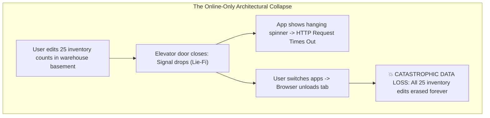
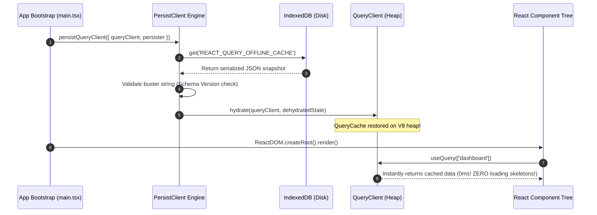

# Chapter 10: Enterprise Offline-First & Persistent State Strategies (IndexedDB, TanStack Query Persisters, and Conflict Resolution)

> "The network is an unreliable luxury, not a prerequisite. If your enterprise web application collapses into a white screen of death the moment a worker enters a warehouse elevator, your architecture has failed the fundamental test of durability."  
> — **Martin Kleppmann, Author of 'Designing Data-Intensive Applications'**

---

## 1. Why This Topic Exists

Enterprise field operations occur in the real world: hospital basements, cargo ships, factory floors, airline terminals, and underground transit tunnels.

In these environments, network connectivity is not binary ("Online" vs "Offline"); it exists in the dreaded state of **"Lie-Fi"**—the device shows 3 signal bars, but HTTP requests hang for 60 seconds before timing out.



### The Architectural Mandate:
Enterprise applications must be engineered **Local-First**:
1. **Reads are Instant:** Data is read immediately from local non-volatile storage (IndexedDB) with zero network latency.
2. **Writes are Durable:** Mutations are committed synchronously to a local outbox queue before any network attempt.
3. **Synchronization is Eventual:** Background engines reconcile local outboxes with backend databases using deterministic conflict resolution policies.

---

## 2. Learning Objectives

By the end of this chapter, an experienced Senior / Staff Engineer will:
- Evaluate browser storage tiers: `localStorage`, `sessionStorage`, `IndexedDB`, and `OPFS` (Origin Private File System).
- Understand why `localStorage` is an enterprise antipattern (synchronous V8 main-thread blocking, 5 MB cap, XSS vulnerability).
- Dissect the **TanStack Query Persister Engine**: `persistQueryClient`, dehydration, rehydration, and cache busters.
- Architect a resilient **Offline Mutation Outbox Queue** with causal ordering and poison-pill quarantining.
- Master distributed conflict resolution models: **Last-Write-Wins (LWW)**, **Optimistic Concurrency Control (ETags / Version Vectors)**, and **CRDTs**.
- Compare local-first patterns with **Angular Service Worker / PWA** (Section 10) and **.NET SQLite / EF Core Offline Sync** (Section 11).
- Navigate browser eviction traps: WebKit 7-day storage caps, quota eviction, and IndexedDB schema upgrades.

---

## 3. Historical Evolution

```
2000 (HTTP Cookies) ──► 2009 (localStorage) ──► 2015 (IndexedDB + PWA) ──► 2023-2026 (Local-First & Persisters)
4 KB limit              5 MB synchronous       Asynchronous B-Trees        Dehydration / Rehydration
Sent in every header    Blocks V8 Main Thread  Complex callback API        CRDTs, Outbox Queues, OPFS
```

- **2000–2009 — The Cookie Era:** Persistence was limited to 4 KB HTTP cookies sent on every single network request, choking bandwidth.
- **2009–2015 — HTML5 `localStorage`:** Provided a simple key-value store up to 5 MB. However, because it is **synchronously blocking**, reading or writing a 2 MB JSON blob freezes the V8 JavaScript event loop, dropping frames and causing input stutter.
- **2015–2022 — IndexedDB & Service Workers:** The W3C introduced IndexedDB—a transactional, asynchronous, indexed NoSQL database in the browser capable of storing gigabytes. However, its low-level callback API (`IDBRequest`) was notoriously painful to use without wrappers.
- **2023–2026 — Modern Local-First & Persisters:** Libraries like `@tanstack/react-query-persist-client`, `idb-keyval`, and CRDT frameworks (Automerge, Yjs) transformed persistence from manual plumbing into declarative cache dehydration pipelines.

---

## 4. First Principles & Intuitive Physical Analogies (Layer 1)

### Metaphor 1: The Field Geologist's Waterproof Journal
- A geologist exploring deep underground caverns does not radio headquarters every time they inspect a rock (*Online-only RPC*).
- They carry a **Waterproof Field Journal** strapped to their belt (*Local IndexedDB*). They write every measurement into the journal immediately.
- When they hike back to the surface at the end of the day (*Network Reconnection*), they open the journal and sync all measurements into the master laboratory database (*Outbox Queue Replay*).

### Metaphor 2: The Front Porch Outgoing Mailbox
- When you want to mail 3 letters on Sunday when the Post Office is closed (*Offline mode*), you don't throw the letters in the trash.
- You place them into the **Outgoing Mailbox on your front porch** (*The Persistent Mutation Queue*).
- When the mail carrier arrives on Monday morning (*`online` event*), they collect the letters in the exact order you left them and deliver them to their destinations (*Causal FIFO Replay*).

### Metaphor 3: The Library Book Edition Stamp (Concurrency Control)
- You check out Edition 3 of a medical encyclopedia to make annotations.
- While you are reading offline in your cabin, another doctor publishes Edition 4 on the central hospital server.
- When you attempt to sync your changes, the hospital auditor checks the stamp: *"Your annotations are based on Edition 3, but the master record is now Edition 4"*.
- The system rejects the blind overwrite and initiates a conflict resolution review.

---

## 5. Internal Working & Engine Architecture (Layer 2)

```mermaid
flowchart TD
    subgraph BrowserStorageEngine ["Browser Storage Engines"]
        LocalStorage["localStorage<br/>(Synchronous, 5MB limit, Blocks V8 Thread)"]
        IDB["IndexedDB Storage<br/>(Asynchronous, Gigabytes, Transactional B-Tree)"]
    end

    subgraph TanStackPersistPipeline ["TanStack Query Persistence Engine"]
        QC["QueryClient (In-Memory Cache)"]
        Dehydrate["Dehydration Serializer<br/>(Filters queries, packs into JSON)"]
        Persister["Async Storage Persister<br/>(idb-keyval / IndexedDB)"]
        Rehydrate["Rehydration Engine<br/>(Restores cache before first paint)"]
    end

    QC -->|On Cache Mutation (Throttled)| Dehydrate
    Dehydrate -->|Writes asynchronously| Persister
    Persister --> IDB
    IDB -->|App Bootstrap / Mount| Persister
    Persister -->|Loads snapshot| Rehydrate
    Rehydrate -->|Populates| QC
```

### Browser Storage Tiers Comparison:

| Storage Type | API Type | Quota Limit | Main Thread Blocking | Use Case |
| :--- | :--- | :--- | :--- | :--- |
| **`localStorage`** | Synchronous | ~5 MB | **YES (Freezes UI)** | Minor user preferences (theme: 'dark'). |
| **`sessionStorage`** | Synchronous | ~5 MB | **YES (Freezes UI)** | Single-tab transient form wizard. |
| **`IndexedDB`** | **Asynchronous** | **Gigabytes (Up to 80% of disk)** | **NO (Background I/O)** | **Enterprise offline cache & outbox queues.** |
| **`OPFS` (Origin Private File System)** | Asynchronous | Gigabytes | **NO (High-speed binary)** | Massive SQLite WASM, video, CAD files. |

---

## 6. Runtime Flow & Execution Traces

### Trace 1: App Bootstrap & Cache Rehydration Sequence



### Trace 2: Offline Mutation Outbox Replay Trace

```
T0: User disconnects from Wi-Fi. navigator.onLine = false.
T1: User clicks "Update Price" to $150.
    - Component calls mutate({ id: 42, price: 150 }).
    - TanStack Query detects: navigator.onLine is false.
    - Mutation state set to: 'paused'.
    - Outbox Engine persists mutation record to IndexedDB:
      { id: 'mut_101', type: 'UPDATE_PRICE', payload: { id: 42, price: 150 }, timestamp: T1 }
T2: User clicks "Update Price" to $175 (10 mins later).
    - Mutation persisted to IndexedDB:
      { id: 'mut_102', type: 'UPDATE_PRICE', payload: { id: 42, price: 175 }, timestamp: T2 }
T3: Wi-Fi reconnects! window fires 'online' event.
    - onlineManager.setOnline(true).
    - TanStack Query automatically resumes paused mutation queue!
    - Outbox executes mut_101 -> HTTP PUT /prices/42 ($150).
    - Outbox executes mut_102 -> HTTP PUT /prices/42 ($175).
    - Final server price is $175. Causal FIFO ordering preserved!
```

---

## 7. Memory Model & Heap Layout

```
V8 Heap vs. Non-Volatile Disk Topology
========================================================================================
[V8 Nursery & Old Pointer Space (Ephemeral RAM)]
  │
  ├── QueryClient Instance
  │     └── queryCache: Map<string, Query>
  │           └── '["products"]' ──► Array of 500 Objects (Pointer @0x400)
  │
  └── MutationQueue: Array<Mutation> (Paused in memory)

================================ Disk Boundary =========================================

[IndexedDB B-Tree Storage Engine (Non-Volatile Disk)]
  ├── Database: 'EnterpriseAppDB'
  │     └── ObjectStore: 'tanstack_cache'
  │           └── Key: 'REACT_QUERY_OFFLINE_CACHE'
  │                 └── Value: Compressed Dehydrated JSON Snapshot
  │
  └── ObjectStore: 'mutation_outbox'
        ├── Record #1: { id: 'm1', action: 'CREATE_ORDER', payload: {...} }
        └── Record #2: { id: 'm2', action: 'SUBMIT_INVOICE', payload: {...} }
```

---

## 8. Visual Diagrams (ASCII / Text)

### Distributed Conflict Resolution Models

```
MODEL 1: Last-Write-Wins (LWW)
Client A (Offline at 10:00 AM): Sets Status = "Approved"
Client B (Online at 10:05 AM):  Sets Status = "Rejected"
Client A reconnects at 10:10 AM: Sends timestamp 10:00 AM.
  - If server compares timestamps: Client B's update wins.
  - RISK: Client clock drift can corrupt true chronological order!

MODEL 2: Optimistic Concurrency Control (Version / ETag)
Client A checks out Order (Version: 5). Goes offline. Edits address.
Client B checks out Order (Version: 5). Edits payment terms. Commits -> Version becomes 6.
Client A reconnects: Sends PUT /orders with { version: 5, address: "..." }
  - Server detects: Current Version (6) !== Request Version (5).
  - Server returns: HTTP 409 Conflict!
  - Client handles: Prompts user with 3-way merge or fetches latest and reapplies!
```

---

## 9. Real World Usage & Production Patterns

> 🧪 **Companion Interactive Lab:** [OfflineStorageVisualizer.tsx](../../apps/portal/src/features/visualizers/topic-10/OfflineStorageVisualizer.tsx) | Live in Portal: `offline-persistence-engine`

### Production Pattern: IndexedDB Persistence with `idb-keyval` and Schema Versioning

```tsx
import { QueryClient } from '@tanstack/react-query';
import { persistQueryClient } from '@tanstack/react-query-persist-client';
import { createAsyncStoragePersister } from '@tanstack/query-async-storage-persister';
import { get, set, del } from 'idb-keyval';

// 1. Instantiate the QueryClient
export const queryClient = new QueryClient({
  defaultOptions: {
    queries: {
      gcTime: 1000 * 60 * 60 * 24, // Keep offline data in cache for 24 hours
      staleTime: 1000 * 60 * 5,    // Consider fresh for 5 minutes
      networkMode: 'offlineFirst', // Query cache first even when offline
    },
    mutations: {
      networkMode: 'offlineFirst', // Queue mutations instead of failing immediately
    },
  },
});

// 2. Create Asynchronous IndexedDB Persister (Zero Main Thread Blocking!)
const indexedDBPersister = createAsyncStoragePersister({
  storage: {
    getItem: async (key: string) => (await get(key)) ?? null,
    setItem: async (key: string, value: string) => await set(key, value),
    removeItem: async (key: string) => await del(key),
  },
  throttleTime: 1000, // Debounce disk writes to once per second!
});

// 3. Initialize Persistence with Schema Buster
export function initializeOfflinePersistence() {
  persistQueryClient({
    queryClient,
    persister: indexedDBPersister,
    maxAge: 1000 * 60 * 60 * 24, // 24 hours
    buster: 'v2.1.0-schema-update', // Incrementing this automatically flushes old cache!
    dehydrateOptions: {
      shouldDehydrateQuery: (query) => {
        // Only persist successful, non-confidential queries to disk
        return query.state.status === 'success' && !query.queryKey.includes('sensitive');
      },
    },
  });
}
```

---

## 10. Angular Comparison

For Senior Angular Architects transitioning to React, offline-first strategies mirror **Angular Service Worker (`@angular/pwa`)**, **`SwUpdate`**, and **IndexedDB Services**:

| Architectural Concept | Angular Paradigm | React / Local-First Paradigm |
| :--- | :--- | :--- |
| **Offline Cache Persistence** | Angular Service Worker `ngsw-config.json` asset/data groups | TanStack Query `persistQueryClient` + IndexedDB Persister |
| **Local Storage Database** | Angular Service wrapping IndexedDB (`Dexie` / `idb`) | `idb-keyval` or `createAsyncStoragePersister` |
| **Network Status Detection** | RxJS `fromEvent(window, 'online')` mapped to Signal | TanStack `onlineManager.isOnline()` |
| **Background Sync** | Service Worker Background Sync API (`SyncManager`) | Paused mutation queues with `networkMode: 'offlineFirst'` |
| **Cache Version Invalidation** | `SwUpdate.checkForUpdate()` & cache hash clearing | `buster: 'v2.1.0'` string matching |

---

## 11. .NET Comparison

For .NET / ASP.NET Core Architects, local-first React mirrors **SQLite local caching**, **EF Core Offline Stores**, and **Distributed Cache Sync**:

| Architectural Concept | .NET / ASP.NET Core Paradigm | React / Local-First Paradigm |
| :--- | :--- | :--- |
| **Embedded Client Storage** | SQLite (`Microsoft.Data.Sqlite`) in .NET MAUI / WPF | IndexedDB / Origin Private File System (OPFS) |
| **Offline Outbox Pattern** | Transactional Outbox Table in local database | IndexedDB Mutation Outbox Queue |
| **Optimistic Concurrency** | `[Timestamp] byte[] RowVersion` in Entity Framework Core | ETag / Version headers (`If-Match`) returning HTTP 409 |
| **Conflict Resolution** | `DbUpdateConcurrencyException` resolution strategies | Last-Write-Wins / 3-Way Merge dialogs |
| **Background Synchronization** | `IHostedService` / BackgroundWorker polling for network | `onlineManager` replaying queued mutations |

---

## 12. Enterprise Perspective & Production Risks (Layer 4)

### Risk 1: The iOS Safari 7-Day Storage Eviction Trap
On iOS WebKit (Safari), if a user does not interact with your web application within **7 days**, WebKit's Intelligent Tracking Prevention (ITP) may **delete all client-side IndexedDB and localStorage data**.  
*Mitigation:* If your application is installed as a **Progressive Web App (PWA)** to the iOS Home Screen, the 7-day cap is lifted and storage is treated as persistent. Always prompt field workers to install the enterprise PWA.

### Risk 2: The "Poison Pill" Mutation Deadlock
If an offline user queues 10 mutations, and Mutation #3 contains a validation error that causes the backend to return **HTTP 400 Bad Request**:
- If your queue engine blindly retries all failures, Mutation #3 will fail forever.
- This **blocks Mutations #4 through #10** from ever executing, creating a permanent queue deadlock.  
*Enterprise Solution:* Differentiate between **Transient Errors** (HTTP 503, Network Timeout -> Retry) and **Terminal Errors** (HTTP 400, 401, 422 -> Quarantine the mutation, alert the user, and resume the queue).

### Risk 3: Schema Drift & Serialization Crashes
If App Version 1.0 persists `{ user: { name: "John" } }`, and Version 2.0 expects `{ user: { firstName: "John", lastName: "" } }`, reading the old dehydrated cache on bootstrap will crash the application.  
*Mandatory Rule:* Always provide a **`buster`** string (e.g., `buster: process.env.APP_VERSION`). When the version changes, the persister wipes stale cached records automatically.

---

## 13. Performance Considerations

### Dehydration Throttling
- Serializing a 10 MB QueryCache to JSON is a CPU-intensive operation.
- Calling `persistQueryClient` without a throttle will freeze the UI during rapid updates.
- **Always configure `throttleTime: 1000` (or higher)** on your persister to coalesce disk writes.

---

## 14. Tradeoffs

| Mechanism | Latency | Reliability | Conflict Complexity |
| :--- | :--- | :--- | :--- |
| **Online-Only (No Persist)** | Dependent on Network (100ms–5000ms). | Zero offline capability. | None (Server is absolute truth). |
| **Cache Dehydration (Read-Only)** | Instant (0ms for reads). | High read availability; writes fail offline. | None. |
| **Full Local-First (Outbox Queue)** | Instant for reads AND writes (0ms). | Maximum (100% durable in field). | **High (Requires conflict handling).** |

---

## 15. Common Mistakes & Interview Traps

### Trap 1: Using `localStorage` for Offline Datasets
- **Candidate Answer (Junior):** *"I just serialize my Redux or React Query cache into `localStorage`."*
- **Architect Critique:** `localStorage` is synchronously blocking. Serializing and deserializing large datasets blocks the V8 main thread, causing severe UI lag. Furthermore, `localStorage` is capped at ~5 MB and is easily readable by cross-site scripting (XSS). Always use **IndexedDB** for structured enterprise caches.

### Trap 2: Replaying Mutations in Parallel
Executing queued mutations concurrently via `Promise.all()` violates causal dependencies (e.g. creating an invoice before creating the customer account). Queued mutations **must be replayed sequentially (FIFO)**.

---

## 16. Interview Questions & Architectural Answers (Senior, Lead, Architect - Layer 5)

### Q1: How do you design an enterprise offline mutation queue that prevents the "Poison Pill" deadlock?
**Architect Answer:**  
I implement a **Transactional Outbox with Error Classification**:
1. **FIFO Sequential Execution:** The queue processes mutations strictly one by one to preserve causality.
2. **Error Classification Gate:**
   - **Network & Server Failures (HTTP 5xx, timeouts):** Classified as *transient*. The queue pauses and schedules a backoff retry.
   - **Client Validation & Business Rule Failures (HTTP 4xx):** Classified as *terminal* (poison pills). The engine extracts the failed mutation, moves it into a persistent **Quarantine Store**, displays a notification to the user, and **resumes processing** the remaining mutations in the queue.
3. **Audit Log:** Quarantined items are inspectable in an administrative panel for manual resolution or retry.

### Q2: Compare Last-Write-Wins (LWW) against Optimistic Concurrency Control (OCC) with Version Vectors for offline synchronization.
**Architect Answer:**  
- **Last-Write-Wins (LWW):** Compares timestamps of conflicting records. While computationally simple, it relies on client clock synchronization (NTP). In real-world enterprise devices with clock skew, a device whose clock is 5 minutes fast will silently overwrite newer data.
- **Optimistic Concurrency Control (OCC):** Utilizes monotonic version integers or database ETags. The client sends `If-Match: "version-5"`. If the server record has advanced to Version 6, the write fails with HTTP 409 Conflict. This guarantees zero silent data corruption and enables deterministic 3-way merging.

---

## 17. Senior-Level Mental Model & "How to Remember This Forever" (Layer 3)

### The "Field Notebook & Quarantine Box" Mental Anchor:
- **IndexedDB is the Waterproof Notebook:** Write everything down instantly; never wait for the radio.
- **The Outbox is the Mail Slot:** Letters wait patiently in line until the carrier arrives.
- **The Quarantine Box:** If one letter has the wrong address, don't burn down the post office; pull that single letter aside and mail the rest.

---

## 18. Core Vocabulary & "Aha!" Breakthrough Insights (Refresher)

- **Local-First:** Software architecture where client storage is the primary source of truth for UI interactions.
- **Dehydration:** Serializing in-memory application state into a transportable or persistable format (JSON/Binary).
- **Rehydration:** Restoring serialized data back into in-memory V8 heap objects upon application bootstrap.
- **Cache Buster:** A version string used to invalidate and discard incompatible persisted storage schemas.
- **Poison Pill:** An invalid queued mutation that repeatedly fails, potentially stalling an entire FIFO replay queue.

---

## 19. Key Takeaways

1. **`localStorage` is synchronous and blocks the V8 thread;** always use IndexedDB for enterprise cache persistence.
2. **TanStack Query persisters restore cache before application mount**, eliminating layout shifts and loading skeletons.
3. **Offline mutation queues must execute sequentially (FIFO)** to maintain causal ordering.
4. **Always isolate terminal errors into a Quarantine store** to prevent the poison pill deadlock.

---

## 20. Revision Sheet

```
┌────────────────────────────────────────────────────────────────────────┐
│               OFFLINE-FIRST PERSISTENCE QUICK REVISION                 │
├────────────────────────────────────────────────────────────────────────┤
│ 1. Storage Hierarchy:                                                  │
│    - IndexedDB: Asynchronous, gigabytes, transactional -> ENTERPRISE   │
│    - localStorage: Synchronous, 5MB, blocks main thread -> AVOID       │
│                                                                        │
│ 2. TanStack Persister Setup:                                           │
│    persistQueryClient({                                                │
│      queryClient,                                                      │
│      persister: createAsyncStoragePersister({ storage: idbKeyval }),   │
│      buster: 'v1.0.0-schema',                                          │
│      maxAge: 1000 * 60 * 60 * 24                                       │
│    });                                                                 │
│                                                                        │
│ 3. Offline Mutation Rules:                                             │
│    - Replay sequentially (FIFO) to preserve causality.                 │
│    - Separate transient errors (retry) from terminal errors (quarantine│
│    - Use OCC (Version / ETag) instead of naive LWW timestamps.         │
└────────────────────────────────────────────────────────────────────────┘
```
