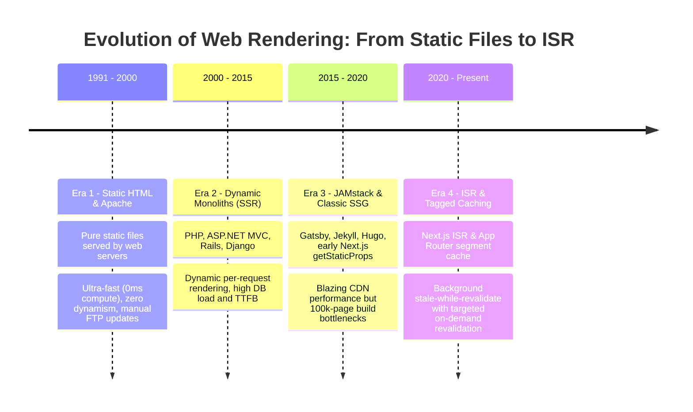
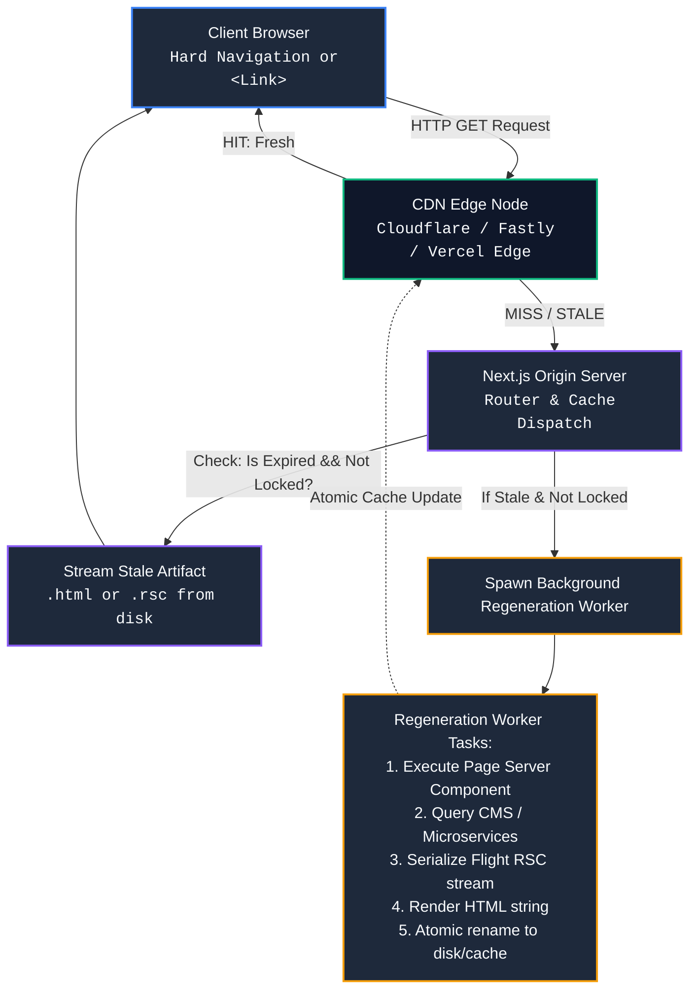

# Chapter 04: Static Site Generation (SSG) vs. Incremental Static Regeneration (ISR) (Build-Time Projection, Stale-While-Revalidate Caching & On-Demand Purging)

> "In high-throughput enterprise systems, computing the identical HTML or RSC Flight payload dynamically for millions of concurrent users is an architectural anti-pattern. True architectural maturity lies in shifting compute from request-time to build-time or background intervals, projecting immutable artifacts to the CDN edge while surgically orchestrating event-driven invalidation."  
> — **Enterprise Web Systems Axiom**

---

## 1. Why This Topic Exists

Every high-traffic web application inevitably collides with the fundamental trilemma of web delivery: **Latency, Data Freshness, and Computational Cost**.

1. **The Dynamic SSR Bottleneck:** Serving every inbound request dynamically via Server-Side Rendering (SSR) guarantees 100% data freshness. However, this forces every request to negotiate database queries, network microservice round-trips, and V8 HTML/RSC serialization. When traffic spikes 100x (such as Black Friday sales or breaking news), database connection pools exhaust, CPU saturates, Time to First Byte (TTFB) degrades from 50ms to 2,500ms, and servers crash.
2. **The Pure Static (SSG) Fragility:** Pure Static Site Generation (SSG) pre-renders all pages at build time into static HTML and JSON files. While it achieves optimal performance (sub-15ms TTFB served directly from Edge CDN storage without origin compute), it suffers from two fatal flaws at scale:
   - **The Infinite Build Time Wall:** An enterprise e-commerce platform with 500,000 products would require a 6-hour build pipeline. A minor typo fix in the footer requires rebuilding the entire repository.
   - **Stale Content Decay:** Content is permanently frozen at the moment of `next build`. Any price adjustment, inventory update, or editorial edit remains invisible until a full redeployment completes.
3. **The Solution — Incremental Static Regeneration (ISR):** Next.js introduced ISR to fuse the raw speed of pure static HTML with the elasticity of dynamic systems. ISR enables pages to be generated statically at build time, cached globally at CDN edge nodes, and incrementally regenerated in the background upon inbound requests or on-demand webhook triggers—**without rebuilding the entire website**.

Understanding how Next.js orchestrates SSG and ISR in the App Router (`generateStaticParams`, segment-level cache configurations, and tag-based on-demand revalidation) is a mandatory core competency for Senior and Staff Engineers architecting enterprise systems.

---

## 2. Learning Objectives

- Master the build-time static generation pipeline and the contract of `generateStaticParams` in the Next.js App Router.
- Dissect the runtime mechanics of Incremental Static Regeneration governed by RFC 5861 (`stale-while-revalidate`).
- Differentiate between **Time-Based Revalidation** (`revalidate = 60`) and **On-Demand Event-Driven Revalidation** (`revalidatePath`, `revalidateTag`).
- Inspect the physical disk and memory layout of `.next/server/app/`, tracing how `.html` and `.rsc` Flight artifacts are generated, read, and atomically swapped.
- Diagnose and eliminate accidental dynamic opt-out triggers (`cookies()`, `headers()`, dynamic `searchParams`) that silently destroy static pre-rendering.
- Architect enterprise-grade caching topologies: Edge CDN caching, Origin Data Cache, and distributed tag invalidation across multi-region deployments.
- Bridge architectural concepts directly to **Angular** (Angular SSR / Prerendering) and **.NET** (ASP.NET Core `[OutputCache]`, `IOutputCacheStore`, and Redis Cache Tagging).

---

## 3. Historical Evolution



<details className="raw-schematic-details">
<summary>📄 View Raw ASCII Schematic</summary>

```text
ERA 1: Handcrafted Static HTML & Apache (1991 - 2000)
┌────────────────────────────────────────────────────────┐
│ - Pure static files (.html) served by Apache/Nginx.    │
│ - Ultra-fast (0ms compute). Zero dynamism.             │
│ - Manual FTP file edits. Impractical for apps.         │
└────────────────────────────────────────────────────────┘
                           │
                           ▼
ERA 2: Monolithic Dynamic Server-Side Rendering (2000 - 2015)
┌────────────────────────────────────────────────────────┐
│ - PHP, ASP.NET WebForms/MVC, Ruby on Rails, Django.    │
│ - 100% Dynamic on every request. Data always fresh.    │
│ - Massive DB load, high TTFB, vulnerable to crashes.   │
└────────────────────────────────────────────────────────┘
                           │
                           ▼
ERA 3: JAMstack & Classic SSG (2015 - 2020)
┌────────────────────────────────────────────────────────┐
│ - Gatsby, Jekyll, Hugo, early Next.js (getStaticProps).│
│ - Blazing speed on Netlify/S3/Cloudflare CDN.          │
│ - The Scaling Wall: 100,000 pages = 2-hour builds.     │
│ - Content stale until CI/CD redeploy finishes.         │
└────────────────────────────────────────────────────────┘
                           │
                           ▼
ERA 4: Incremental Static Regeneration & Tagged Cache (2020 - Present)
┌────────────────────────────────────────────────────────┐
│ - Next.js ISR (Pages -> App Router segment caching).   │
│ - Static pages generated on-demand at runtime.         │
│ - Background stale-while-revalidate regeneration.      │
│ - Targeted on-demand cache busting via revalidateTag.  │
└────────────────────────────────────────────────────────┘
```

</details>

---

## 4. First Principles & Intuitive Physical Analogies (Layer 1)

### Analogy 1: The Daily Newspaper vs. The Self-Updating Electronic Ink Frame

Consider how news is distributed:
- **Server-Side Rendering (SSR):** A journalist sits at your kitchen table. Every time you ask "What's the news?", they pick up their phone, call 10 reporters, synthesize the stories, write a fresh page by hand, and hand it to you. Fresh? Yes. Exhausting and slow? Immensely.
- **Pure Static Site Generation (SSG):** A printed paper newspaper. At 4:00 AM (build time), the press prints 100,000 copies. They are dropped on everyone's doorstep instantly. But if an earthquake happens at 10:00 AM, the printed newspaper still reports yesterday's peace. It cannot change until tomorrow's print run.
- **Incremental Static Regeneration (ISR):** An **Electronic Ink Display Frame** mounted on your wall.
  - When you look at it, it instantly displays the page already painted on the screen (0ms latency, zero effort).
  - If more than 60 minutes have passed since the last refresh, the display detects an expiration timer. It **still shows you the current image** without flickering (Stale).
  - In the background, its tiny Wi-Fi chip wakes up, downloads the newest wire service update, paints the new image, and quietly updates the memory buffer.
  - The next person who walks into the room sees the updated edition immediately.

### Analogy 2: The Bakery Display Case and The Ghost Baker

Imagine an artisanal French bakery:
- Customers enter to buy croissants. The shopkeeper never makes customers wait 30 minutes while raw dough bakes in the oven. Instead, a batch of 20 croissants sits in the **heated glass display case** (The CDN Edge Cache).
- Every customer receives a croissant instantly off the shelf (10ms TTFB).
- The bakery has an internal rule: "Croissants are considered fresh for 15 minutes."
- At minute 16, a customer buys a croissant. The shopkeeper hands them the one from the case (Stale-While-Revalidate). The customer enjoys it immediately.
- Behind the scenes, the shopkeeper taps the bell to alert the **Ghost Baker** in the kitchen: *"Bake a fresh tray!"*
- The baker prepares a fresh batch. Once ready, the display case is replenished with the fresh batch. Any customer entering at minute 18 receives the warm, freshly baked croissant.
- If a critic orders a special pastry, the head chef can ring an emergency bell (`revalidateTag`), instantly dumping the old tray and baking a fresh one immediately.

---

## 5. Internal Working & Engine Architecture (Layer 2)

### 1. The Build Pipeline: Static Pre-Rendering

During `next build`, Next.js parses the route hierarchy. For each route segment:

```text
                  next build
                      │
                      ▼
        Does page use dynamic functions?
        (cookies(), headers(), searchParams,
         or fetch(..., { cache: 'no-store' }))
                     / \
                    /   \
              YES  /     \  NO
                  /       \
                 ▼         ▼
             DYNAMIC     STATIC
             (λ SSR)     (○ Prerender)
                           │
                           ▼
                  Does page export
               generateStaticParams()?
                     / \
                    /   \
              YES  /     \  NO (Static route)
                  /       \
                 ▼         ▼
          Generate N      Generate 1
          HTML + RSC      HTML + RSC
          payloads        payload
```

When static generation executes:
1. The React Server Component tree is rendered into the **React Flight Wire Format stream** (`.rsc`).
2. The RSC stream is piped into the HTML renderer (`renderToReadableStream` / `renderToPipeableStream`) to generate the corresponding static `.html` document.
3. Both files are written to `.next/server/app/path/to/page.html` and `.next/server/app/path/to/page.rsc`.

### 2. Time-Based Revalidation (`stale-while-revalidate`)

When a route exports `export const revalidate = 60;` or configures `fetch('...', { next: { revalidate: 60 } })`:

```text
Client Request
      │
      ▼
┌───────────────┐
│ Next.js Node/ │  Read Cached File (.html / .rsc)
│ Edge Server   │ ─────────────────────────────────► Cache Store (Disk/Memory)
└───────┬───────┘
        │
   Is (Now - CachedTimestamp) > 60s?
        │
       / \
  NO  /   \  YES (Stale)
     /     \
    ▼       ▼
 Return   1. IMMEDIATELY Return Stale Cache to Client
 Cache    2. Acquire Internal Regeneration Mutex Lock
          3. Spawn Background Worker Thread
                   │
                   ▼
             Execute RSC Component Tree
             Re-fetch Dynamic Resources
             Generate New .html & .rsc
                   │
                   ▼
             Atomic File Rename (Swap Old -> New)
             Release Mutex Lock
```

### 3. The Atomic File Swap & Stampede Protection

Next.js prevents **Cache Stampede (Dog-Piling)**:
- If 1,000 concurrent requests hit an expired ISR route simultaneously, Next.js **does NOT** trigger 1,000 parallel background builds.
- An in-memory/in-process **deduplication lock** ensures that exactly **one** background regeneration worker is spawned.
- The other 999 requests immediately receive the stale cached copy.
- The background regeneration writes to a temporary file (`page.html.tmp`). Once rendering completes successfully, it executes an **atomic filesystem swap** (`fs.renameSync`). If the background generation throws an uncaught error, Next.js discards the temporary file and **retains the old stale cache indefinitely**, preventing catastrophic site outages!

---

## 6. Runtime Flow & Execution Traces

### Execution Trace: Stale-While-Revalidate Lifecycle

```text
Timeline (Seconds)
t = 0s     Build Completed. page.html created (Timestamp: t=0).
t = 10s    User A requests /products/42.
           -> Age = 10s < 60s. Cache is FRESH.
           -> Returns cached page.html. Duration: 2ms.
t = 65s    User B requests /products/42.
           -> Age = 65s > 60s. Cache is STALE.
           -> STEP 1: Next.js immediately streams stale page.html to User B (Duration: 3ms).
           -> STEP 2: Background worker triggers page rendering:
                      - fetch(apiUrl) -> 200 OK (fresh data)
                      - RSC tree rendered -> new .rsc payload
                      - HTML rendered -> new page.html.tmp
                      - Atomic rename -> page.html updated (Timestamp: t=65).
t = 66s    User C requests /products/42 (while background worker is busy).
           -> Background worker is already running (Mutex held).
           -> Next.js immediately streams stale page.html to User C (Duration: 2ms).
t = 68s    Background worker completes. Cache now marked FRESH with timestamp t=65.
t = 70s    User D requests /products/42.
           -> Age = 5s < 60s. Cache is FRESH.
           -> Returns newly updated page.html. Duration: 2ms.
```

---

## 7. Memory Model & Disk Layout

On the origin server hosting Next.js (Node.js runtime), static and ISR assets reside in the `.next` directory structure:

```text
.next/
├── server/
│   └── app/
│       └── products/
│           └── [id]/
│               ├── page.js             # Compiled Server Component module
│               ├── page.html           # Pre-rendered HTML document
│               ├── page.rsc            # Serialized RSC Flight stream payload
│               └── page.meta           # Cache metadata (headers, revalidate TTL)
└── cache/
    ├── fetch-cache/                    # Granular fetch() response cache (tagged entries)
    └── incremental-cache/              # ISR segment cache storage
```

### Memory & Wire Payload Separation
When a user navigates directly to `https://example.com/products/42` (hard page load / bookmark):
- The CDN or Next.js server serves `page.html` (the full DOM tree).

When a user navigates via client-side routing (`<Link href="/products/42">`):
- Next.js does **not** download `page.html` again.
- Next.js downloads `page.rsc` (the Flight stream containing only the component props, React elements, and layout diffs).
- ISR keeps both `page.html` and `page.rsc` perfectly synchronized in disk storage.

---

## 8. Visual Diagrams (ASCII / Text)

### End-to-End ISR & On-Demand Revalidation Architecture



<details className="raw-schematic-details">
<summary>📄 View Raw ASCII Schematic</summary>

```text
┌────────────────────────────────────────────────────────────────────────────────────────┐
│                                   CLIENT BROWSER                                       │
└──────────────┬──────────────────────────────────────────────────────────▲──────────────┘
               │                                                          │
         HTTP GET Request                                           HTTP Response
               │                                                    (Fast HTML/RSC)
               ▼                                                          │
┌──────────────────────────────┐                                          │
│        CDN EDGE NODE         │                                          │
│   (Cloudflare / Fastly /     │─── [HIT: Fresh] ─────────────────────────┘
│    Vercel Edge Network)      │
└──────────────┬───────────────┘
               │
          [MISS / STALE]
               │
               ▼
┌────────────────────────────────────────────────────────────────────────────────────────┐
│                               NEXT.JS ORIGIN SERVER                                    │
│                                                                                        │
│   ┌────────────────────────────────────────────────────────────────────────────────┐   │
│   │                              ROUTER & CACHE DISPATCH                           │   │
│   │                                                                                │   │
│   │   1. Inspect URL & Params                                                      │   │
│   │   2. Read .next/server/app/products/[id].meta                                  │   │
│   └──────────────────────┬─────────────────────────────────────────────────────────┘   │
│                          │                                                             │
│              Is Expired && Not Locked?                                                 │
│                     /         \                                                        │
│               YES  /           \  NO                                                   │
│                   /             \                                                      │
│                  ▼               ▼                                                     │
│     ┌─────────────────────┐   ┌──────────────────────────────┐                         │
│     │ SPAWN BACKGROUND    │   │ STREAM STALE ARTIFACT        │─────────────────────────┘
│     │ REGENERATION WORKER │   │ (.html or .rsc from disk)    │
│     └──────────┬──────────┘   └──────────────────────────────┘
│                │
│                ▼
│     ┌─────────────────────────────────────────────────────────┐
│     │                  REGENERATION WORKER                    │
│     │                                                         │
│     │  - Execute Page Server Component                        │
│     │  - Query Headless CMS / Microservice                    │
│     │  - Serialize Flight RSC stream                          │
│     │  - Render HTML string                                   │
│     │  - Atomic rename: tmp -> .next/server/app/...           │
│     └─────────────────────────────────────────────────────────┘
│
└────────────────────────────────────────────────────────────────────────────────────────┘
```

</details>

---

## 9. Real World Usage & Production Patterns

### Pattern 1: Pure SSG with `generateStaticParams`

```tsx
// app/products/[slug]/page.tsx
import { notFound } from 'next/navigation';

interface ProductPageProps {
  params: Promise<{ slug: string }>;
}

// 1. Build-time route parameter generator
export async function generateStaticParams() {
  const products = await fetch('https://api.enterprise.com/products/top-selling', {
    headers: { Authorization: `Bearer ${process.env.INTERNAL_API_KEY}` }
  }).then(res => res.json());

  return products.map((product: { slug: string }) => ({
    slug: product.slug,
  }));
}

// 2. Control behavior for params NOT returned by generateStaticParams
// false: Return 404 immediately (Strict SSG)
// true: Generate page on-demand via ISR (Default)
export const dynamicParams = true;

export default async function ProductPage({ params }: ProductPageProps) {
  const { slug } = await params;
  
  const product = await fetch(`https://api.enterprise.com/products/${slug}`, {
    next: { tags: [`product-${slug}`, 'catalog'] }
  }).then(res => res.ok ? res.json() : null);

  if (!product) {
    notFound();
  }

  return (
    <article className="product-container">
      <h1>{product.title}</h1>
      <p className="price">${product.price.toFixed(2)}</p>
      <div className="description">{product.description}</div>
    </article>
  );
}
```

### Pattern 2: Time-Based ISR (`revalidate = 3600`)

```tsx
// app/blog/[slug]/page.tsx
// Revalidate this page in the background at most once every hour (3600 seconds)
export const revalidate = 3600;

export default async function BlogPost({ params }: { params: Promise<{ slug: string }> }) {
  const { slug } = await params;
  const post = await getBlogPostFromCms(slug);

  return (
    <main>
      <h1>{post.title}</h1>
      <time dateTime={post.publishedAt}>Published: {new Date(post.publishedAt).toLocaleDateString()}</time>
      <div dangerouslySetInnerHTML={{ __html: post.contentHtml }} />
    </main>
  );
}
```

### Pattern 3: Event-Driven On-Demand ISR via Server Action or Webhook

Instead of waiting for an arbitrary 60-second timer to expire, on-demand revalidation allows a CMS publish event or admin dashboard mutation to purge the cache instantly.

```tsx
// app/actions/catalog-actions.ts
'use server';

import { revalidateTag, revalidatePath } from 'next/cache';

export async function updateProductPrice(productId: string, slug: string, newPrice: number) {
  // 1. Execute DB / Microservice mutation
  await db.product.update({
    where: { id: productId },
    data: { price: newPrice }
  });

  // 2. Purge cache instantly by tag
  // Any page that fetched data using next: { tags: [`product-${slug}`] } is instantly purged
  revalidateTag(`product-${slug}`);
  
  // 3. Or purge the route path directly
  revalidatePath(`/products/${slug}`, 'page');

  return { success: true };
}
```

### Pattern 4: Webhook Route Handler for Headless CMS (Contentful / Strapi / Sanity)

```tsx
// app/api/revalidate/route.ts
import { NextRequest, NextResponse } from 'next/server';
import { revalidateTag } from 'next/cache';

export async function POST(request: NextRequest) {
  const secret = request.headers.get('x-webhook-secret');
  
  if (secret !== process.env.CMS_WEBHOOK_SECRET) {
    return NextResponse.json({ message: 'Invalid authentication secret' }, { status: 401 });
  }

  const payload = await request.json();
  const changedTag = payload.tag || 'catalog';

  // Atomic on-demand cache purge
  revalidateTag(changedTag);

  return NextResponse.json({ 
    revalidated: true, 
    tag: changedTag,
    timestamp: Date.now() 
  });
}
```

---

## 10. Angular Comparison

| Dimension | Next.js App Router (SSG & ISR) | Angular (v17+ SSR & Prerendering) |
| :--- | :--- | :--- |
| **Build-Time Prerendering** | Handled natively via `next build` + `generateStaticParams`. | Configured via `@angular/ssr` in `angular.json` (`prerender: true` or `routesFile`). |
| **Incremental Page Generation** | Native (`dynamicParams = true`). Un-prerendered URLs build statically on the first incoming request. | Not supported natively. Un-prerendered URLs must either fail or fall back to client-side CSR / full Node.js SSR. |
| **Background Revalidation (SWR)** | Native framework primitive (`revalidate = N`). Atomic background regeneration and cache swapping. | No built-in framework ISR. Requires configuring external reverse proxies (Nginx / Cloudflare Workers) with SWR rules. |
| **Tagged Cache Invalidation** | First-class primitives (`revalidateTag('tag')`, `revalidatePath('/path')`). | No native framework cache-tagging API. Cache invalidation must be handled by external edge CDN APIs. |
| **Wire Format Caching** | Caches dual artifacts: `.html` for initial load and `.rsc` Flight chunks for SPA soft transitions. | Caches `.html` and bootstrap bundles; client-side route transitions fetch separate REST/GraphQL endpoints. |

---

## 11. .NET Comparison

| Dimension | Next.js App Router (SSG & ISR) | ASP.NET Core (.NET 8/9/10) |
| :--- | :--- | :--- |
| **Output Caching Primitives** | Segment-level `revalidate = N` or `fetch(..., { next: { revalidate: N } })`. | `app.UseOutputCache()` middleware and `[OutputCache(Duration = 60)]` endpoint attributes. |
| **On-Demand Tag Invalidation** | `revalidateTag("product-42")` purges cache entries tagged with that key. | `IOutputCacheStore.EvictByTagAsync("product-42", CancellationToken.None)`. |
| **Cache Storage Medium** | Local disk (`.next/cache`), in-memory LRU, or custom `IncrementalCache` provider (Redis/S3). | In-memory `OutputCacheOptions` or distributed stores like `Microsoft.Extensions.Caching.StackExchangeRedis`. |
| **HTML & Payload Serialization** | Generates static HTML and React 19 RSC Flight stream (`.rsc`). | Buffers and caches complete raw HTTP response byte streams (HTML, JSON, or gzipped streams). |
| **Background Stale Delivery** | RFC 5861 `stale-while-revalidate` served natively by Next.js server runtime. | Typically configured via reverse proxy headers (`Cache-Control: public, max-age=60, stale-while-revalidate=300`) or custom middleware. |

---

## 12. Enterprise Perspective & Production Risks (Layer 4)

### 1. The Multi-Instance Cluster Cache Desynchronization Trap
- **The Failure Mode:** When Next.js is deployed in Kubernetes or Azure Container Apps across 10 replica pods, each pod runs its own local container filesystem. If Pod A receives a request for `/products/42` at minute 61, Pod A regenerates its local `.next/cache` disk. Pods B through J still retain the old stale cache!
- **The Architectural Fix:** In clustered deployments, you **must not** rely on local container disk storage for ISR. Implement a shared distributed cache provider (such as `@neshca/cache-handler` backed by Redis or Azure Blob Storage) so that an invalidation or regeneration on one pod instantly propagates to all replicas.

### 2. The Unchecked `dynamicParams = true` Disk Exhaustion
- **The Failure Mode:** If `dynamicParams = true` is left on a route with user-controlled input (`/search/[query]` or `/profiles/[username]`), malicious bots or scrapers can send millions of arbitrary requests (`/search/rand1`, `/search/rand2`, ...). Next.js will attempt to pre-render and cache every single variant to disk, consuming all server inodes and crashing the Node.js process with `ENOSPC`.
- **The Architectural Fix:** Use `export const dynamicParams = false;` on constrained enumeration routes, or ensure arbitrary input queries are marked as purely dynamic routes (`export const dynamic = 'force-dynamic'`) with rate limiting.

### 3. Pricing & Inventory Race Conditions in E-Commerce
- **The Failure Mode:** Using time-based ISR (`revalidate = 300`) on a product details page. During a flash sale, the price drops from $1,000 to $100. A customer visits the page, sees $100 (from a freshly generated page), and clicks "Buy Now". But a user hitting an adjacent CDN edge node still sees the stale $1,000 price for 5 minutes.
- **The Architectural Fix:**
  - **Static Shell + Dynamic Slot (PPR / RSC):** Pre-render the product layout, title, images, and reviews statically via ISR.
  - Render the real-time pricing and stock indicator in an uncached, dynamic child component wrapped in `<Suspense>` or fetch live pricing via Server Actions upon checkout initiation. Never trust cached client prices during mutation.

---

## 13. Performance Considerations

```text
Latency Comparison by Rendering Strategy (Origin DB Latency = 120ms)
┌─────────────────────────────────┬──────────────┬──────────────┬──────────────────┐
│ Strategy                        │ TTFB (Edge)  │ Origin Load  │ Freshness SLA    │
├─────────────────────────────────┼──────────────┼──────────────┼──────────────────┤
│ Dynamic SSR                     │ 180 - 450 ms │ 100% of Req  │ Real-time (0s)   │
│ Time-Based ISR (revalidate=60)  │ 10 - 25 ms   │ < 1% of Req  │ At most 60s lag  │
│ On-Demand ISR (revalidateTag)   │ 10 - 25 ms   │ ~0% of Req   │ Real-time (Event)│
│ Pure SSG (Build time only)      │ 10 - 25 ms   │ 0% of Req    │ Static to Deploy │
└─────────────────────────────────┴──────────────┴──────────────┴──────────────────┘
```

By offloading 99% of read requests to Edge CDN caches via ISR:
- Origin database connection pools remain idle and protected against DDoS traffic.
- Core Web Vitals **Largest Contentful Paint (LCP)** improves dramatically because TTFB drops below 50ms globally.

---

## 14. Tradeoffs

| Architecture | Advantages | Disadvantages |
| :--- | :--- | :--- |
| **Pure SSG** | Highest security (no server-side execution), zero server hosting costs, CDN edge delivery. | Long build times for large datasets; cannot update content without full CI/CD deployment. |
| **Time-Based ISR** | Near-zero origin load, ultra-low TTFB, predictable background refresh cycles. | Eventual consistency; visitors during the revalidation window observe stale data. |
| **On-Demand ISR** | Combines 100% data freshness with instant CDN static speed; zero wasted background regenerations. | Complex webhook orchestration required; potential race conditions across distributed edge nodes. |
| **Dynamic SSR** | Always fresh; perfect for authenticated, user-personalized dashboards. | High origin CPU/DB consumption; slow TTFB; single point of failure under traffic spikes. |

---

## 15. Common Mistakes & Interview Traps

### Trap 1: The "Accidental Dynamic Opt-Out" Bug
- **Scenario:** A candidate implements `generateStaticParams()` and expects the page to be pre-rendered as static HTML at build time. However, inside the component, they invoke `const cookieStore = await cookies();` or read `const headersList = await headers();`.
- **The Reality:** Accessing incoming request headers, cookies, or dynamic query strings immediately and silently opts the entire route segment out of static pre-rendering, converting it into a dynamic SSR page!
- **Interview Rule:** Static pages cannot read request-specific cookies or headers at build time. To personalize static pages, read user session tokens client-side or pass user-specific state via dynamic Server Actions.

### Trap 2: Believing Background Revalidation Blocks the Inbound Request
- **Scenario:** The interviewer asks: *"If an ISR page with `revalidate = 60` is requested after 120 seconds, will that user wait for the page to regenerate?"*
- **Candidate Answer:** *"Yes, because the cache expired, so the user waits for the new render."*
- **Correction:** **WRONG.** That is traditional cache expiration. Next.js implements **RFC 5861 `stale-while-revalidate`**. The user receives the stale cached page immediately (within milliseconds). The regeneration occurs completely out-of-band in the background.

### Trap 3: Expecting `revalidateTag()` to Update Open Browser Tabs
- **Scenario:** An engineer triggers `revalidateTag('catalog')` in a Server Action and wonders why a user who already loaded the website still sees the old data.
- **The Reality:** `revalidateTag` invalidates the server-side Data Cache and Next.js Full Route Cache. It does not push WebSocket messages or Server-Sent Events to open client browser tabs. The client will observe the new data only on their next navigation or page refresh.

---

## 16. Interview Questions & Architectural Answers (Senior, Lead, Architect - Layer 5)

### Question 1 (Senior): "How does Next.js handle an exception thrown during background ISR regeneration?"
**Architectural Answer:**  
Next.js utilizes an **optimistic rollback / defensive cache retention strategy**:
1. When background regeneration begins, Next.js renders the component into a temporary holding buffer.
2. If the database connection times out or the component throws an uncaught error, Next.js catches the exception, logs the error to `stderr`, and immediately discards the temporary build artifact.
3. The existing stale cache file (`page.html` / `page.rsc`) is **retained indefinitely** as the authoritative response.
4. Next.js will re-attempt regeneration on the next inbound request. This guarantees that a transient downstream microservice failure will **never** cause users to see a 500 error page on an ISR route.

### Question 2 (Lead): "We have an e-commerce catalog with 2,000,000 products. How would you design the build and caching architecture?"
**Architectural Answer:**  
Attempting to pre-render 2,000,000 pages during `next build` would crash CI/CD or take 20+ hours. The optimal enterprise architecture is a **Hybrid Tiered Pre-Rendering Strategy**:
1. **Build Time (Hot Pages Only):** Use `generateStaticParams()` to pre-render only the top 1,000 most frequently visited products (e.g., top sellers, promotional banners). Build time finishes in under 2 minutes.
2. **Runtime On-Demand ISR (Long-Tail Pages):** Set `export const dynamicParams = true;`. When a user requests product #1,452,109 for the first time, Next.js generates the page on-demand via Server-Side Rendering, serves it, and writes the resulting `.html` and `.rsc` files to the shared distributed cache. All subsequent users receive the static cache instantly.
3. **Event-Driven Invalidation:** Hook the Product Information Management (PIM) system webhooks into Next.js Route Handlers utilizing `revalidateTag(\`product-\${id}\`)` to ensure inventory and price changes invalidate the cache instantly.

### Question 3 (Architect): "How do you solve the Multi-Region Edge Invalidation problem when deploying Next.js across AWS, Azure, and Cloudflare?"
**Architectural Answer:**  
In a global enterprise topology:
1. **Edge Tier (Cloudflare / Fastly):** Configure the Edge CDN to respect cache tags via the `Surrogate-Key` or `Cache-Tag` HTTP response headers emitted by Next.js.
2. **Origin Tier (Multi-Region ECS / ACA):** Next.js pods are deployed across US-East, EU-West, and AP-Southeast.
3. **Distributed Cache Handler:** Configure `@neshca/cache-handler` backed by a globally replicated Redis cluster (e.g., Upstash or Azure Cache for Redis with active replication).
4. **Invalidation Pipeline:** When a CMS mutation occurs, an event is published to an Apache Kafka or Azure Service Bus topic. A lightweight worker consumes the message, issues an API call to the Cloudflare Cache Purge API (`POST /zones/:id/purge_cache` with `tags`), and invokes the Next.js `revalidateTag` endpoint. This guarantees cache eviction at both the CDN edge layer and origin instances within milliseconds globally.

---

## 17. Senior-Level Mental Model & "How to Remember This Forever" (Memory Anchors - Layer 3)

### The Memory Peg: "The Wax Seal vs. The Hot Display Case"
- **SSG is the Royal Wax Seal (Immutable):** Once stamped during build time, it never changes until the whole document is rewritten and re-stamped from scratch.
- **ISR is the Hot Display Case (Stale-While-Revalidate):** The customer is always served immediately from the heated shelf. The kitchen bakes a fresh tray in the background only when the timer dings.
- **`revalidateTag` is the Manager's Panic Button:** The moment expired ingredients are reported, the manager smashes the button, instantly sweeping the display case clean without waiting for the timer.

---

## 18. Core Vocabulary & "Aha!" Breakthrough Insights (Refresher)

- **RFC 5861 (`stale-while-revalidate`):** An HTTP standard that allows an HTTP cache to serve a stale asset immediately while asynchronously checking for an update in the background.
- **`generateStaticParams`:** The App Router replacement for `getStaticPaths`. Returns an array of parameter objects to pre-render at build time.
- **`dynamicParams`:** A boolean segment config option controlling whether parameters outside `generateStaticParams` return 404 (`false`) or are dynamically rendered on-demand (`true`).
- **Tag-Based Invalidation (`revalidateTag`):** A high-leverage architectural primitive that purges all cached entries associated with a string label across multiple routes simultaneously without knowing exact URL paths.
- **The "Aha!" Insight:** ISR is not just about HTML. In modern React 19, ISR caches the **React Flight Wire Format (`.rsc`)**. When navigating on the client, you get the speed of static CDN delivery combined with the fluid interactivity of client-side React rendering!

---

## 19. Key Takeaways

1. **SSG eliminates runtime compute** by rendering static HTML and RSC Flight files during `next build`, providing sub-20ms TTFB at the CDN edge.
2. **ISR eliminates the static build wall** by enabling on-demand static generation and background revalidation using the `stale-while-revalidate` protocol.
3. **Time-Based Revalidation (`revalidate = N`)** is optimal for high-volume, frequently updated content where slight eventual consistency is acceptable.
4. **On-Demand Revalidation (`revalidateTag`)** is the gold standard for enterprise CMS and e-commerce systems, marrying instant CDN speed with instantaneous data freshness upon business events.
5. **Accidental dynamic opt-outs** occur when Server Components read `cookies()`, `headers()`, or uncached `searchParams`, silently demoting static pages to dynamic SSR.
6. **In clustered environments (Kubernetes / Azure Container Apps)**, local container disk is insufficient for ISR. A shared distributed cache provider (Redis) is required to prevent node desynchronization.

---

## 20. Revision Sheet

```text
┌────────────────────────────────────────────────────────────────────────────────────────┐
│                          NEXT.JS SSG & ISR QUICK REFERENCE                             │
├────────────────────────────────────────────────────────────────────────────────────────┤
│ Segment Config Flags:                                                                 │
│   export const revalidate = 60;          // Time-based ISR (seconds)                   │
│   export const revalidate = 0;           // Force dynamic SSR                          │
│   export const revalidate = false;       // Cache indefinitely (Pure SSG)              │
│   export const dynamicParams = true;     // Render unlisted params on-demand (Default) │
│   export const dynamicParams = false;    // 404 on unlisted params (Strict SSG)        │
│                                                                                        │
│ Fetch Cache Configurations:                                                           │
│   fetch(url, { cache: 'force-cache' });  // Pure static cache (Default)                │
│   fetch(url, { cache: 'no-store' });     // Dynamic on every request                   │
│   fetch(url, { next: { revalidate: 60 } }); // Granular time-based ISR                 │
│   fetch(url, { next: { tags: ['t1'] } });   // Tagged cache entry                      │
│                                                                                        │
│ Invalidation Primitives:                                                               │
│   revalidateTag('tag-name');             // Purges by cache tag across all routes      │
│   revalidatePath('/blog/[slug]', 'page');// Purges specific route path cache           │
│                                                                                        │
│ Golden Rule:                                                                           │
│   "Static serves stale instantly; background regenerates silently; tags purge surgical"│
└────────────────────────────────────────────────────────────────────────────────────────┘
```
