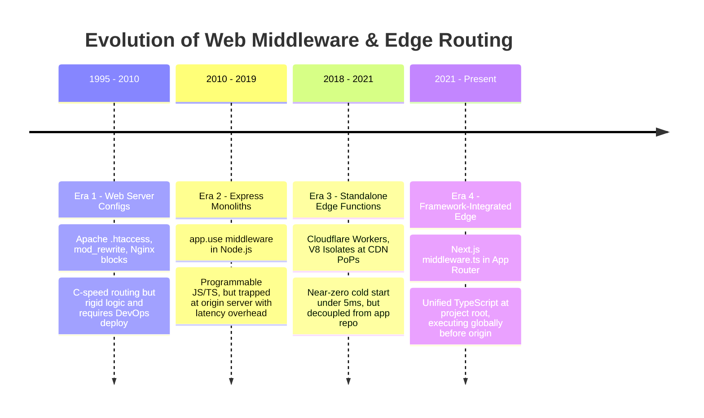
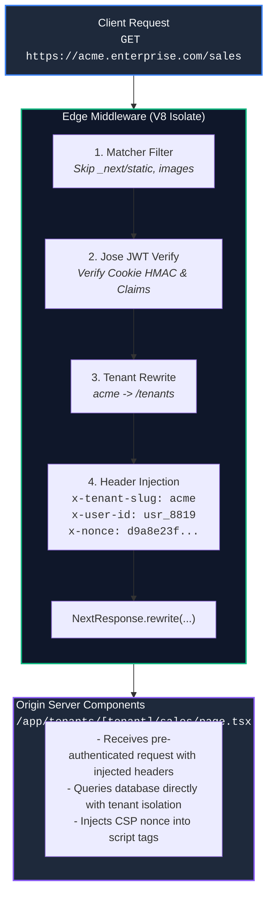

# Chapter 05: Middleware & Edge Runtime Mechanics (Edge Routing, Request Interception, Geo-IP, Auth Guards & V8 Isolates)

> "Traditional web architectures treat the origin server as both the bouncer and the banquet hall. In modern distributed systems, security enforcement, geographic routing, and tenant partitioning must execute at the planetary edge within ultra-lightweight V8 isolates before the origin server ever expends a single CPU cycle."  
> — **Distributed Edge Computing Principles**

---

## 1. Why This Topic Exists

In high-scale enterprise applications, allowing unauthenticated, malformed, or regionally misrouted traffic to traverse all the way to the origin server is an architectural anti-pattern:
1. **The Origin Latency Penalty:** If a user in Sydney requests an application hosted in a US-East data center, negotiating TLS, establishing TCP connections, and executing routing logic incurs hundreds of milliseconds of cross-continental network latency just to perform a simple authorization check or locale redirect.
2. **The Node.js Process Heavyweight Problem:** A standard Node.js server instance has significant memory overhead (50MB to 200MB per process) and measurable cold-start latency (200ms to 2,000ms). Invoking full Node.js runtimes for low-compute decisions (such as checking an auth cookie or rewriting a URL) wastes expensive compute.
3. **The Pre-Routing Decision Barrier:** Features like multi-tenant custom domains (`tenant.enterprise.com`), A/B test variant assignment, geolocation-based currency switching, and bot mitigation must occur **before** the router determines which page to render and before any page cache is evaluated.

Next.js **Edge Middleware** (`middleware.ts`) solves these challenges. Executing within the **Edge Runtime** (lightweight V8 engine isolates deployed across hundreds of global CDN Points of Presence), middleware intercepts every incoming HTTP request with **sub-5ms execution latency** and **near-zero cold starts**, enabling high-leverage routing, security, and transformation at the edge of the internet.

---

## 2. Learning Objectives

- Master the architecture of the **Next.js Edge Runtime**, contrasting lightweight V8 Isolates with the full Node.js runtime and operating system processes.
- Implement the core primitives of `middleware.ts`: `NextResponse.next()`, `NextResponse.rewrite()`, and `NextResponse.redirect()`.
- Mutate incoming request headers, inject user identity context, and manipulate outbound response cookies safely.
- Optimize route matching using high-performance **Matcher Configuration Regexes** to protect static assets (`_next/static`, images, favicons) from middleware latency penalties.
- Architect enterprise edge solutions: Edge JWT session verification, dynamic multi-tenant subdomain rewriting, and cryptographic Content Security Policy (CSP) nonce injection.
- Understand the technical constraints of V8 Isolates: the absence of Node.js C++ bindings (`fs`, `child_process`), memory caps, and runtime execution budgets.
- Bridge architectural mental models to **Angular** (Functional Route Guards & HTTP Interceptors) and **.NET** (ASP.NET Core Middleware Pipeline, `IApplicationBuilder`, and YARP Reverse Proxy).

---

## 3. Historical Evolution



<details className="raw-schematic-details">
<summary>📄 View Raw ASCII Schematic</summary>

```text
ERA 1: Web Server Configuration Files (1995 - 2010)
┌────────────────────────────────────────────────────────┐
│ Apache .htaccess, mod_rewrite, Nginx conf blocks.      │
│ - Extremely fast C-based routing and redirects.        │
│ - Cryptic syntax, zero programmability, rigid logic.   │
│ - Requires DevOps deployment for simple route rules.   │
└────────────────────────────────────────────────────────┘
                           │
                           ▼
ERA 2: Monolithic Node.js Express Middleware (2010 - 2019)
┌────────────────────────────────────────────────────────┐
│ app.use((req, res, next) => { ... })                   │
│ - Highly programmable in JavaScript / TypeScript.       │
│ - Trapped in the origin server process.                │
│ - High latency for global users; heavy memory footprint│
└────────────────────────────────────────────────────────┘
                           │
                           ▼
ERA 3: Cloudflare Workers & Standalone Edge Functions (2018 - 2021)
┌────────────────────────────────────────────────────────┐
│ V8 Isolates running at global CDN PoPs.                │
│ - Near-zero cold start (<5ms); distributed globally.   │
│ - Decoupled from application framework; separate repos │
│   and synchronization complexity.                      │
└────────────────────────────────────────────────────────┘
                           │
                           ▼
ERA 4: Framework-Integrated Edge Middleware (2021 - Present)
┌────────────────────────────────────────────────────────┐
│ Next.js middleware.ts in App Router.                   │
│ - Single unified TypeScript codebase at the root.      │
│ - Native integration with Next.js router & cache tier. │
│ - Executes in V8 Isolates globally before origin hits. │
└────────────────────────────────────────────────────────┘
```

</details>

---

## 4. First Principles & Intuitive Physical Analogies (Layer 1)

### Analogy 1: The Airport International Border Control vs. The City Hall

Consider entering an international country:
- **Origin Server Processing (City Hall):** Imagine arriving in a foreign country and getting on a 4-hour train ride to the capital city hall just to have an official inspect your passport. If your visa is expired, they tell you to turn around and take the 4-hour train back to the airport. This is what happens when authorization logic runs only on the origin server.
- **Edge Middleware (Airport Border Control):** Right as you step off the airplane at the entry gate, an immigration officer (The Edge V8 Isolate) checks your passport.
  - If invalid: You are turned away **instantly at the border** (sub-5ms redirect to `/login`).
  - If valid: They stamp your passport with an entry token (header injection: `x-user-id: 42`) and guide you to the domestic terminal (`NextResponse.next()`).
  - If you need a connecting flight: They immediately direct your gate without you ever leaving the airport (`NextResponse.rewrite()`).

### Analogy 2: The Bouncer at the Nightclub Door vs. The Waiter at the Table

- **Server Components & Route Handlers are the Waiters:** They take your detailed order, query the kitchen (database), prepare the dish, and serve the feast. They are skilled, computationally heavy, and belong inside the dining room.
- **Middleware is the Bouncer at the Velvet Rope:** The bouncer does not cook food. They look at your ID card, check the dress code, verify you are on the VIP guest list, and stamp your wrist. It takes 3 seconds. If you aren't on the list, you never enter the club.

---

## 5. Internal Working & Engine Architecture (Layer 2)

### 1. The V8 Isolate Architecture

Next.js Edge Middleware runs in the **Edge Runtime**, which is powered by Google V8 Isolates rather than a standard Node.js runtime.

```text
┌─────────────────────────────────────────────────────────────────────────┐
│                     TRADITIONAL NODE.JS PROCESS                         │
│                                                                         │
│  OS Process (PID 1024)                                                  │
│  ├── Memory Footprint: ~50MB - 200MB                                    │
│  ├── Node.js Standard Library (fs, path, net, child_process, buffer)    │
│  ├── libuv Thread Pool & Event Loop                                     │
│  └── Cold Start: 200ms - 1,500ms                                        │
└─────────────────────────────────────────────────────────────────────────┘

┌─────────────────────────────────────────────────────────────────────────┐
│                         V8 ISOLATE RUNTIME                              │
│                                                                         │
│  Single OS Process Hosting 10,000+ Lightweight Isolates                 │
│  ├── Memory Footprint: ~2MB - 5MB per Isolate                           │
│  ├── Complete Memory Sandbox (Zero shared heap between requests)        │
│  ├── Web Standard APIs Only (Fetch, Request, Response, URL, Crypto)     │
│  ├── NO Node.js Built-ins (No fs, no net, no child_process)             │
│  └── Cold Start: 0ms - 5ms (Instantaneous)                              │
└─────────────────────────────────────────────────────────────────────────┘
```

### 2. The Middleware Execution Pipeline

Middleware sits at the very beginning of the Next.js request processing lifecycle:

```text
Inbound HTTP Request
         │
         ▼
Does URL match `config.matcher`?
        / \
  NO   /   \   YES
      /     \
     │       ▼
     │  Execute middleware.ts (V8 Isolate)
     │       │
     │       ├─► NextResponse.redirect() ────► Return 307/308 to Client (Bypasses Origin)
     │       ├─► NextResponse.json() ────────► Return 401/403 to Client (Bypasses Origin)
     │       │
     │       ▼
     │  NextResponse.next() or NextResponse.rewrite()
     │  (Injected Headers / Cookies attached)
     │       │
     └───────┼────────────────────────────────────────┐
             ▼                                        ▼
    Evaluate Full Route Cache               Execute Route Handlers /
    (Static / ISR .html & .rsc)             Server Components (Node.js)
```

### 3. Rewrites vs. Redirects

Understanding the distinction between these two primitives is fundamental:
- **`NextResponse.redirect(url)` (HTTP 307 / 308):**
  - Sends a standard HTTP redirect response to the browser.
  - The client's address bar changes to the new URL.
  - Causes a new HTTP round-trip from the client.
- **`NextResponse.rewrite(destination)` (Internal Proxying):**
  - The browser's address bar **does NOT change** (seamless to the user).
  - Next.js internally maps the incoming request to a completely different route handler or component tree on the server.
  - Essential for **Multi-Tenancy** (mapping `tenant1.app.com` to `/app/tenant1/dashboard` invisibly).

---

## 6. Runtime Flow & Execution Traces

### Execution Trace: Authenticated Tenant Request

```text
Scenario: User visits `https://acme.enterprise.com/dashboard`
1. Request hits Edge CDN PoP.
2. Matcher matches `/dashboard`. V8 Isolate executes middleware.ts.
3. Host Header Inspection:
   -> hostname: "acme.enterprise.com" -> extracts tenant: "acme".
4. Authentication Cookie Check:
   -> Read cookie `__Secure-session-token`.
   -> Token found: Execute lightweight crypto verification via `jose`.
   -> Signature valid. Claims extracted: { sub: "usr_99", role: "admin" }.
5. Header Decoration:
   -> Clone request headers.
   -> Append `x-tenant-id: acme`.
   -> Append `x-user-id: usr_99`.
   -> Append `x-user-role: admin`.
6. Internal Route Rewrite:
   -> Rewrite target: `/tenants/acme/dashboard`.
7. Pipeline Forwarding:
   -> Request forwarded to Origin Node.js instance with decorated headers.
8. Page Server Component executes:
   -> Reads `headers().get('x-tenant-id')`.
   -> Renders tenant-specific dashboard directly without redundant DB auth queries!
```

---

## 7. Memory Model & Execution Environment

In the Edge Runtime:
1. **Memory Ceiling:** Edge isolates typically operate with a 128MB memory ceiling (configurable down to 10MB in certain CDN platforms). Memory leaks from global variables or long-lived in-memory caches will trigger instant termination.
2. **Ephemeral Lifecycle:** An isolate can be created and destroyed per request or pooled across a small burst of requests. Never rely on in-memory global state (`let userCache = {}`) in middleware!
3. **Execution Budget:** Edge middleware has a strict execution timeout (typically 25ms to 50ms of CPU time). Heavy loops, un-indexed string searching, or blocking I/O will result in an immediate `504 Gateway Timeout`.

---

## 8. Visual Diagrams (ASCII / Text)

### Multi-Tenant Edge Routing & Security Header Architecture



<details className="raw-schematic-details">
<summary>📄 View Raw ASCII Schematic</summary>

```text
┌────────────────────────────────────────────────────────────────────────────────────────┐
│                                   CLIENT REQUEST                                       │
│                        GET https://acme.enterprise.com/sales                           │
└──────────────────────────────────────────┬─────────────────────────────────────────────┘
                                           │
                                           ▼
┌────────────────────────────────────────────────────────────────────────────────────────┐
│                                EDGE MIDDLEWARE (V8)                                    │
│                                                                                        │
│   ┌────────────────────────┐    ┌────────────────────────┐    ┌────────────────────┐   │
│   │ 1. Matcher Filter      │───►│ 2. Jose JWT Verify     │───►│ 3. Tenant Rewrite  │   │
│   │    Skip _next/static   │    │    Verify Cookie HMAC  │    │    acme -> /tenants│   │
│   └────────────────────────┘    └────────────────────────┘    └─────────┬──────────┘   │
│                                                                         │              │
│   ┌──────────────────────────────────────────────────────────────────┐  │              │
│   │ 4. Header Injection:                                             │  │              │
│   │    x-tenant-slug: acme                                           │  │              │
│   │    x-user-id: usr_8819                                           │  │              │
│   │    x-nonce: d9a8e23f... (CSP Nonce)                              │  │              │
│   └──────────────────────────────────┬───────────────────────────────┘  │              │
│                                      │                                  │              │
│                                      ▼                                  │              │
│                           NextResponse.rewrite(...) ◄───────────────────┘              │
└──────────────────────────────────────┬─────────────────────────────────────────────────┘
                                       │
                                       ▼
┌────────────────────────────────────────────────────────────────────────────────────────┐
│                             ORIGIN SERVER COMPONENTS                                   │
│                        /app/tenants/[tenant]/sales/page.tsx                            │
│                                                                                        │
│   - Receives pre-authenticated request with x-user-id & x-tenant-slug                  │
│   - Queries database directly with tenant isolation                                   │
│   - Injects CSP nonce into script tags                                                 │
└────────────────────────────────────────────────────────────────────────────────────────┘
```

</details>

---

## 9. Real World Usage & Production Patterns

### Pattern 1: Complete Production-Grade `middleware.ts` with Auth, RBAC & Subdomain Routing

```typescript
// middleware.ts (Root of repository)
import { NextResponse } from 'next/server';
import type { NextRequest } from 'next/server';
import { jwtVerify } from 'jose';

// Define route protection boundaries
const PUBLIC_PATHS = ['/login', '/register', '/api/public', '/favicon.ico'];
const JWT_SECRET = new TextEncoder().encode(process.env.JWT_SECRET || 'super-secret-key-min-32-chars');

export async function middleware(request: NextRequest) {
  const { pathname } = request.nextUrl;
  const hostname = request.headers.get('host') || '';

  // 1. Multi-Tenant Subdomain Resolution
  // Extract tenant from 'tenant.domain.com'
  const currentHost = hostname.replace(`.${process.env.NEXT_PUBLIC_ROOT_DOMAIN}`, '');
  const isSubdomain = hostname.includes(`.${process.env.NEXT_PUBLIC_ROOT_DOMAIN}`) && currentHost !== 'www';

  // 2. Allow public assets and paths
  if (PUBLIC_PATHS.some((path) => pathname.startsWith(path))) {
    return NextResponse.next();
  }

  // 3. Edge Authentication Check via Jose
  const sessionToken = request.cookies.get('__Secure-session')?.value;

  if (!sessionToken) {
    const loginUrl = new URL('/login', request.url);
    loginUrl.searchParams.set('returnUrl', pathname);
    return NextResponse.redirect(loginUrl);
  }

  try {
    // Cryptographically verify token within V8 Isolate (zero Node C++ dependencies)
    const { payload } = await jwtVerify(sessionToken, JWT_SECRET, {
      algorithms: ['HS256'],
    });

    // 4. Role-Based Access Control (RBAC) Guard
    if (pathname.startsWith('/admin') && payload.role !== 'SUPER_ADMIN') {
      return NextResponse.redirect(new URL('/unauthorized', request.url));
    }

    // 5. Clone and decorate request headers for downstream Server Components
    const requestHeaders = new Headers(request.headers);
    requestHeaders.set('x-user-id', payload.sub as string);
    requestHeaders.set('x-user-role', payload.role as string);

    // 6. Handle Subdomain Rewriting if tenant detected
    if (isSubdomain) {
      requestHeaders.set('x-tenant-id', currentHost);
      const rewriteUrl = new URL(`/tenants/${currentHost}${pathname}`, request.url);
      return NextResponse.rewrite(rewriteUrl, {
        request: {
          headers: requestHeaders,
        },
      });
    }

    // 7. Proceed normally with mutated headers
    return NextResponse.next({
      request: {
        headers: requestHeaders,
      },
    });
  } catch (error) {
    // JWT signature invalid, expired, or tampered
    console.error('Edge Auth Verification Failed:', error);
    const loginUrl = new URL('/login', request.url);
    loginUrl.searchParams.set('error', 'session_expired');
    const response = NextResponse.redirect(loginUrl);
    response.cookies.delete('__Secure-session');
    return response;
  }
}

// CRITICAL: Matcher configuration to prevent middleware execution on static assets
export const config = {
  matcher: [
    /*
     * Match all request paths except for the ones starting with:
     * - _next/static (static files)
     * - _next/image (image optimization files)
     * - favicon.ico (favicon file)
     * - public assets (/images, etc.)
     */
    '/((?!_next/static|_next/image|images|favicon.ico).*)',
  ],
};
```

### Pattern 2: Dynamic CSP (Content Security Policy) Nonce Generation

A critical enterprise security practice: preventing XSS by attaching a dynamic cryptographic nonce to all script tags.

```typescript
// middleware.ts (CSP Nonce Injection)
import { NextResponse } from 'next/server';
import type { NextRequest } from 'next/server';

export function middleware(request: NextRequest) {
  // Generate a random 128-bit cryptographic nonce
  const nonce = Buffer.from(crypto.randomUUID()).toString('base64');
  
  const cspHeader = `
    default-src 'self';
    script-src 'self' 'nonce-${nonce}' 'strict-dynamic';
    style-src 'self' 'nonce-${nonce}';
    img-src 'self' blob: data:;
    font-src 'self';
    object-src 'none';
    base-uri 'self';
    form-action 'self';
    frame-ancestors 'none';
    upgrade-insecure-requests;
  `.replace(/\s{2,}/g, ' ').trim();

  // Set the CSP header on the incoming request so Server Components can read the nonce
  const requestHeaders = new Headers(request.headers);
  requestHeaders.set('x-nonce', nonce);
  requestHeaders.set('Content-Security-Policy', cspHeader);

  const response = NextResponse.next({
    request: {
      headers: requestHeaders,
    },
  });

  // Set the CSP header on the outbound response for the browser
  response.headers.set('Content-Security-Policy', cspHeader);

  return response;
}
```

---

## 10. Angular Comparison

| Dimension | Next.js Edge Middleware | Angular (v17+ SSR & Guards) |
| :--- | :--- | :--- |
| **Execution Tier** | Global Edge CDN PoP (V8 Isolates) before origin request is dispatched. | Client-side browser (SPA) or Origin Node.js server (`@angular/ssr`). |
| **Route Protection Mechanism** | Intercepts HTTP requests at network edge; redirects with HTTP 307 before rendering. | Functional `CanActivateFn` route guards; evaluates inside Angular router lifecycle. |
| **URL Rewriting** | Native transparent `NextResponse.rewrite()` altering the server-side target route without changing client URL. | Angular router redirects or custom Node.js Express server rewrites prior to SSR bootstrap. |
| **Request Header Decoration** | Mutates incoming request headers passed to Server Components (`requestHeaders.set`). | Angular `HttpInterceptorFn` mutates outgoing client HTTP requests made via `HttpClient`. |
| **Runtime Constraints** | Web Standards only; zero Node.js C++ or OS APIs (`fs`, `net`). | Client browser environment or full Node.js server context with full access to Node APIs. |

---

## 11. .NET Comparison

| Dimension | Next.js Edge Middleware | ASP.NET Core (.NET 8/9/10) |
| :--- | :--- | :--- |
| **Pipeline Architecture** | Single root `middleware.ts` intercepting incoming requests globally. | Composable middleware pipeline: `app.UseAuthentication()`, `app.UseAuthorization()`, `app.Use()`. |
| **Execution Location** | Planetary Edge PoP (Cloudflare / Vercel Edge) outside the host OS. | Within the Kestrel web server process running on the host OS / container. |
| **URL Rewriting & Proxying** | `NextResponse.rewrite()` maps internal paths. | `app.UseRewriter()` or enterprise YARP (Yet Another Reverse Proxy) for intelligent routing. |
| **Header Mutability** | `new Headers(request.headers)` cloned and forwarded downstream. | `HttpContext.Request.Headers["X-Custom"] = "Value"` directly mutated on the context. |
| **Resource Isolation** | V8 Isolates with strict 50ms CPU timeout and ~5MB heap footprint. | Managed CLR thread execution within the unified application process pool. |

---

## 12. Enterprise Perspective & Production Risks (Layer 4)

### 1. The Heavy Database ORM in Middleware Trap
- **The Failure Mode:** An engineer attempts to import Prisma, TypeORM, or Entity Framework Core into `middleware.ts` to perform a database query: `const user = await prisma.user.findUnique(...)`.
- **The Result:** The build crashes immediately! The Edge Runtime **does not support native Node.js TCP sockets or C++ bindings** required by traditional SQL database drivers.
- **The Architectural Fix:**
  - Verify tokens statelessly using **HMAC/RSA signatures** via `jose` with zero database round-trips.
  - If a database query is strictly mandatory at the edge, use an HTTP-based serverless database driver (e.g., Neon serverless driver, PlanetScale HTTP API, or Upstash Redis over REST).

### 2. The Missing Matcher Static Asset DOS Trap
- **The Failure Mode:** Omitting the `config.matcher` or using `matcher: ['/:path*']` without exclusions.
- **The Result:** Middleware executes on every single image (`/logo.png`), CSS file (`/_next/static/css/...`), and JavaScript chunk. In high-traffic systems, this consumes millions of unnecessary edge execution credits, increases server billings 500%, and inflates page load latency by adding 5ms to every sub-resource request.
- **The Architectural Fix:** Always implement defensive negative-lookahead matchers excluding `_next/static`, `_next/image`, and static assets.

### 3. The Infinite Redirect Loop Trap
- **The Failure Mode:** Middleware checks `if (!authToken) return NextResponse.redirect('/login')`. However, the `/login` page itself is not excluded in the matcher or public path list.
- **The Result:** Requesting `/dashboard` redirects to `/login`. Requesting `/login` triggers middleware, which sees no token and redirects to `/login`, creating an infinite browser loop (`ERR_TOO_MANY_REDIRECTS`).

---

## 13. Performance Considerations

```text
Performance Impact of Edge Middleware on Global Latency (User in Tokyo, Origin in Virginia, USA)
┌───────────────────────────────────────────────┬───────────────────────────┐
│ Routing Scenario                              │ Round-Trip Latency        │
├───────────────────────────────────────────────┼───────────────────────────┤
│ Unauthenticated Request (Origin Check)        │ 240 ms (Cross-Pacific)    │
│ Unauthenticated Request (Edge Middleware)     │ 8 ms (Tokyo Edge PoP)     │
│ Subdomain Rewrite (Edge Middleware)           │ 242 ms (Total to Origin)  │
│ Static Asset with Faulty Middleware Matcher   │ 18 ms (Unnecessary lag)   │
│ Static Asset with Proper Matcher Exclusion    │ 2 ms (Direct Edge Cache)  │
└───────────────────────────────────────────────┴───────────────────────────┘
```

By filtering unauthenticated requests and bot traffic at the Edge PoP:
- You eliminate 30% to 60% of spurious traffic from ever reaching your origin database and API microservices.
- Legitimate users get instant redirect feedback without waiting for intercontinental round-trips.

---

## 14. Tradeoffs

| Mechanism | Strengths | Weaknesses |
| :--- | :--- | :--- |
| **Edge Middleware (`middleware.ts`)** | Ultra-low latency (<5ms); global distributed execution; request interception before cache/origin. | Restricted APIs (no Node built-ins); 1MB-4MB bundle limit; no heavy long-running computation. |
| **Origin Route Handlers (`route.ts`)** | Full Node.js runtime; full access to database ORMs, file system, and native C++ libraries. | Slower execution; bound to origin region; requests must travel full distance over the internet. |
| **Server Component Auth Checks** | Direct access to server state; colocated with UI data fetching logic. | Executes after routing and layout resolution; cannot perform transparent sub-domain URL rewrites. |

---

## 15. Common Mistakes & Interview Traps

### Trap 1: Attempting to Read Response Body in Middleware
- **Scenario:** A candidate tries to inspect or modify the HTML body returned by a page inside middleware: `const res = await NextResponse.next(); const html = await res.text();`.
- **The Reality:** **Impossible in Next.js Middleware.** Middleware executes **before** route generation. `NextResponse.next()` returns an empty response object signaling the pipeline to continue. It does not contain the rendered HTML of downstream components. To stream or transform HTML, use React Server Components or Edge Route Handlers.

### Trap 2: Using Node.js `crypto` instead of Web Standard `crypto`
- **Scenario:** Writing `import crypto from 'crypto'; crypto.createHmac(...)` in middleware.
- **The Reality:** Fails build compilation or throws a runtime error in Edge Runtime. You must use the Web Standard `globalThis.crypto.subtle` or zero-dependency edge libraries like `jose`.

### Trap 3: Forgetting to Forward Headers on `NextResponse.next()`
- **Scenario:** Writing `request.headers.set('x-user-id', '123'); return NextResponse.next();` and expecting Server Components to see the header.
- **The Reality:** `request.headers.set` only modifies the local in-memory request object inside middleware. To forward modified headers to downstream Server Components, you **must explicitly pass the request headers object** into `NextResponse.next({ request: { headers: requestHeaders } })`.

---

## 16. Interview Questions & Architectural Answers (Senior, Lead, Architect - Layer 5)

### Question 1 (Senior): "How does Next.js pass mutated headers from `middleware.ts` to Server Components down the pipeline?"
**Architectural Answer:**  
When middleware executes `NextResponse.next({ request: { headers: modifiedHeaders } })`, Next.js serializes these headers into internal HTTP forward headers passed to the downstream Node.js/Edge worker during the same pipeline invocation. When a Server Component subsequently calls `const h = await headers()`, Next.js reads from this decorated request context. Note that this is a one-way propagation: Server Components cannot pass headers back up to middleware.

### Question 2 (Lead): "How would you architect a zero-latency Multi-Tenant Custom Domain system supporting 10,000 corporate clients using Next.js Middleware?"
**Architectural Answer:**  
1. **DNS & Edge Ingress:** All custom domains (`app.clienta.com`, `portal.clientb.com`) point via CNAME to a Wildcard Cloudflare / Azure Front Door distribution.
2. **Edge Lookup:** In `middleware.ts`, extract `request.headers.get('host')`.
3. **Tenant Cache via Edge KV:** Query a globally replicated Edge KV store (e.g., Cloudflare Workers KV or Upstash Redis) with an in-memory 5-minute LRU cache to map `hostname -> tenant_id`. (Avoid direct SQL database queries).
4. **Internal Rewrite:** Execute `NextResponse.rewrite(new URL(\`/tenants/\${tenantId}\${pathname}\`, request.url))`.
5. **Security Isolation:** Server Components read the verified `tenant_id` from the injected `x-tenant-id` header, guaranteeing that database queries are scoped exclusively to that tenant's schema or partition key.

### Question 3 (Architect): "What are the security implications of trusting `x-user-id` headers set in Middleware inside downstream Server Components?"
**Architectural Answer:**  
If an attacker sends an external HTTP request with a spoofed header `x-user-id: admin_1`, and middleware blindly forwards `request.headers`, the downstream application could suffer from **Privilege Escalation**.  
**Architectural Mitigation:**
1. **Defensive Stripping:** Middleware must unconditionally delete or overwrite any client-supplied internal headers before appending verified data: `requestHeaders.delete('x-user-id')`.
2. **Cryptographic Signing (Mutual Trust):** In enterprise zero-trust microservice environments, middleware signs the forwarding context with an internal HMAC secret (`x-internal-signature: hmac(userId + timestamp, SECRET)`). The downstream Server Component or microservice validates this signature before trusting the identity claims.

---

## 17. Senior-Level Mental Model & "How to Remember This Forever" (Memory Anchors - Layer 3)

### The Memory Peg: "The Highway Tollbooth with the Fast-Track Transponder"
- **Middleware is the Tollbooth:** It stands across all highway lanes before anyone enters the city.
- It scans your electronic transponder (Cookie / JWT).
- If your toll account is empty, the gate stays down and shoots you off to the service exit (`redirect('/login')`).
- If valid, it assigns you an express lane pass (Header injection) and flips the switch to route your car directly onto the specific arterial highway (`rewrite('/tenant/dashboard')`).
- Once you pass the tollbooth, you are inside the city (Server Components & Route Handlers), where the actual work happens.

---

## 18. Core Vocabulary & "Aha!" Breakthrough Insights (Refresher)

- **V8 Isolate:** A completely isolated instance of the Google V8 JavaScript engine sharing the same operating system process with other isolates, providing microsecond startup and megabyte-level memory isolation.
- **Edge Runtime:** The standardized subset of Web APIs (Fetch, Streams, Crypto) supported by V8 isolates across Next.js and CDN edge networks.
- **`NextResponse.rewrite`:** An internal proxying primitive that changes the rendered destination without altering the URL displayed in the user's browser address bar.
- **Matcher Regex:** The declarative routing configuration in `middleware.ts` that filters which URL paths invoke middleware execution.
- **The "Aha!" Insight:** Middleware does not replace Server Components—it **insulates** them. By filtering invalid requests at the planetary edge, your backend databases and Server Components only ever process clean, authenticated, pre-routed traffic!

---

## 19. Key Takeaways

1. **Next.js Edge Middleware executes in V8 Isolates** at the network edge with sub-5ms latency and near-zero cold starts.
2. **No Node.js C++ or OS APIs (`fs`, `net`, `child_process`) are available**; use Web Standard APIs (`crypto`, `fetch`) and zero-dependency libraries like `jose`.
3. **Use `NextResponse.redirect()`** to change the browser address bar via HTTP 307/308; use **`NextResponse.rewrite()`** for invisible server-side path mapping.
4. **Always configure a strict `config.matcher`** with negative lookaheads to exclude `_next/static`, `_next/image`, and static assets from running middleware.
5. **Never query traditional SQL databases via ORMs** inside middleware; verify JWTs statelessly or query Edge KV stores over HTTP.
6. **Pass mutated headers downstream** by providing `{ request: { headers: newHeaders } }` to `NextResponse.next()`.

---

## 20. Revision Sheet

```text
┌────────────────────────────────────────────────────────────────────────────────────────┐
│                          NEXT.JS EDGE MIDDLEWARE CHEAT SHEET                           │
├────────────────────────────────────────────────────────────────────────────────────────┤
│ File Location:                                                                         │
│   middleware.ts (Root of project or inside src/)                                       │
│                                                                                        │
│ Core Action Primitives:                                                                │
│   NextResponse.next({ request: { headers } }) // Proceed with modified headers        │
│   NextResponse.redirect(new URL('/login', req.url)) // HTTP 307 Redirect              │
│   NextResponse.rewrite(new URL('/internal-path', req.url)) // Invisible Proxy         │
│   NextResponse.json({ error: 'Unauthorized' }, { status: 401 }) // Edge API response  │
│                                                                                        │
│ Matcher Best Practice:                                                                 │
│   export const config = {                                                              │
│     matcher: ['/((?!_next/static|_next/image|favicon.ico|images).*)'],                │
│   };                                                                                   │
│                                                                                        │
│ Permitted APIs:                                                                        │
│   ✅ Web Fetch, Request, Response, Headers, URL                                       │
│   ✅ Web Crypto (crypto.subtle, crypto.randomUUID)                                    │
│   ✅ jose (JWT verification)                                                           │
│   ❌ fs, path, net, child_process                                                      │
│   ❌ Prisma, TypeORM, native database TCP drivers                                      │
│                                                                                        │
│ Architectural Golden Rule:                                                             │
│   "Stateless verification at the edge; stateful projection at the origin."             │
└────────────────────────────────────────────────────────────────────────────────────────┘
```
