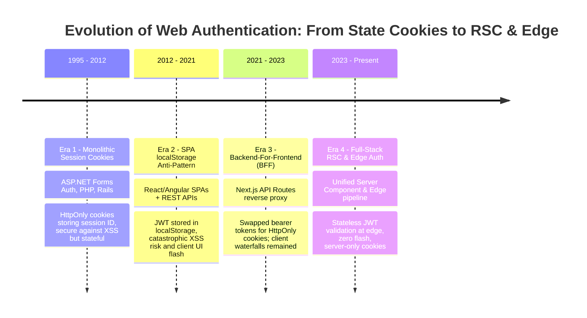
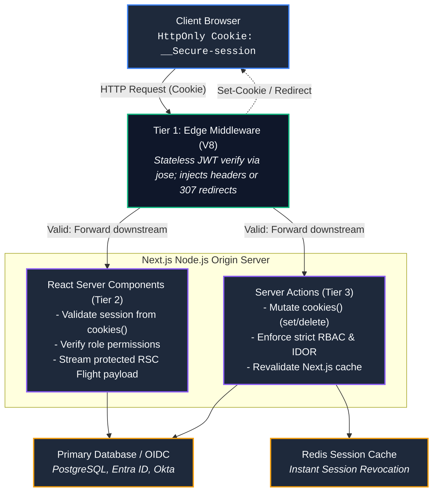

# Chapter 06: Authentication & Session Management in Full-Stack Next.js (JWT vs. Database Sessions, HttpOnly Cookies, Auth.js & Enterprise RBAC)

> "In a traditional Single Page Application, authentication is a client-side illusion: tokens reside in `localStorage`, and route guards merely hide DOM nodes. In modern full-stack React, authentication is an immutable server-side boundary: identity is projected from encrypted, HttpOnly transport cookies, verified at the edge, and enforced in the server's execution context before a single byte of UI is transmitted."  
> — **Full-Stack Security Architecture Principles**

---

## 1. Why This Topic Exists

Authentication in a full-stack Next.js application is fundamentally different from a legacy Single Page Application (SPA):
1. **The `localStorage` Security Disaster:** For years, frontend developers stored JWT access tokens in browser `localStorage` or `sessionStorage`. Any Cross-Site Scripting (XSS) vulnerability—even an innocuous third-party npm package injection—could execute `localStorage.getItem('token')` and permanently exfiltrate user credentials to an attacker's server.
2. **The Tri-Tier Execution Boundary:** In Next.js, code executes across three completely distinct environments:
   - **Edge Middleware:** Intercepts requests globally before routing; executes in V8 Isolates.
   - **React Server Components (RSC):** Render server-side on Node.js; can read request headers and cookies, but **cannot set or mutate cookies**.
   - **Server Actions & Route Handlers:** Execute mutations on Node.js; can read and write cookies, modify response headers, and orchestrate transactions.
3. **The Session Dilemma:** Should enterprise applications use **Stateless Encrypted JWTs** (which require zero database lookups on reads but are difficult to revoke instantly) or **Stateful Database Sessions** (which allow immediate revocation but force a database round-trip on every page navigation)?

Mastering how to securely store, verify, and propagate user identity across Edge Middleware, Server Components, and Server Actions—while implementing Role-Based Access Control (RBAC) and enterprise Single Sign-On (SSO)—is essential for any Senior or Staff Engineer designing modern web applications.

---

## 2. Learning Objectives

- Dissect the architectural tradeoffs between **Stateless JWTs** and **Stateful Database Sessions** in a React Server Component architecture.
- Master the **3-Tier Defense-in-Depth Authentication Model**: Edge Middleware (optimistic gate), Server Component Layouts (data isolation), and Server Actions (mutation enforcement).
- Implement tamper-proof session storage using **Encrypted, `HttpOnly`, `SameSite=Lax`, `Secure` cookies**.
- Understand the strict cookie mutability rule: why React Server Components can **only read** cookies (`await cookies()`), while Server Actions can **read, set, and delete** cookies.
- Implement **Sliding Session Expiration** and **Refresh Token Rotation (RTR)** safely without triggering race conditions.
- Integrate enterprise-grade **Auth.js (NextAuth v5)** and custom JWT pipelines with Role-Based Access Control (RBAC).
- Bridge architectural mental models directly to **Angular** (MSAL client auth, HTTP interceptors) and **.NET** (ASP.NET Core Cookie Authentication, `ClaimsPrincipal`, DPAPI, and IdentityServer).

---

## 3. Historical Evolution



<details className="raw-schematic-details">
<summary>📄 View Raw ASCII Schematic</summary>

```text
ERA 1: Monolithic Server-Side Session Cookies (1995 - 2012)
┌────────────────────────────────────────────────────────┐
│ ASP.NET Forms Auth, PHP PHPSESSID, Rails Session Store.│
│ - HttpOnly cookies storing an opaque session ID.       │
│ - Highly secure against XSS.                           │
│ - Tightly coupled to monolithic stateful servers.      │
└────────────────────────────────────────────────────────┘
                           │
                           ▼
ERA 2: Client-Side SPAs & The localStorage Anti-Pattern (2012 - 2021)
┌────────────────────────────────────────────────────────┐
│ React / Angular SPAs + REST APIs.                      │
│ - JWT stored in localStorage.                          │
│ - Appended manually via `Authorization: Bearer <jwt>`. │
│ - Catastrophic vulnerability to XSS token theft.       │
│ - Flawed route protection: UI flash before auth redirect│
└────────────────────────────────────────────────────────┘
                           │
                           ▼
ERA 3: The Backend-For-Frontend (BFF) Pattern (2021 - 2023)
┌────────────────────────────────────────────────────────┐
│ Next.js API Routes acting as a reverse proxy BFF.      │
│ - Tokens swapped for HttpOnly session cookies.         │
│ - Frontend never sees the raw access token.            │
│ - Still required client-side data fetching waterfalls. │
└────────────────────────────────────────────────────────┘
                           │
                           ▼
ERA 4: Full-Stack React 19 RSC & Edge Auth (2023 - Present)
┌────────────────────────────────────────────────────────┐
│ Unified Server Component & Edge Middleware Pipeline.   │
│ - Edge Middleware validates JWT signature statelessly. │
│ - Server Components read session directly from cookies │
│   during server rendering (zero client-side flash).    │
│ - Server Actions enforce RBAC before mutations execute.│
└────────────────────────────────────────────────────────┘
```

</details>

---

## 4. First Principles & Intuitive Physical Analogies (Layer 1)

### Analogy 1: The Wax-Sealed Royal Decree (JWT) vs. The Coat Check Claim Stub (Database Session)

Imagine checking into a high-security international conference:
- **The Stateless JWT is a Wax-Sealed Royal Decree:**
  - Upon entry, the King (Auth Server) issues you an elaborate parchment containing your name, clearance level ("Ambassador"), and an expiration timestamp ("Valid until 5:00 PM"). The decree is stamped with the King's personal cryptographic wax signet.
  - Everywhere you walk in the palace, guards don't need to call the King to verify who you are. They simply look at your parchment and verify that the wax seal has not been broken.
  - **The Tradeoff:** If the King fires you at 2:00 PM, you still possess a valid seal until 5:00 PM unless the guards maintain an explicit "Banned Persons" list.
- **The Stateful Database Session is a Coat Check Claim Stub:**
  - The attendant takes your coat, hangs it in the secure locker room, and hands you an opaque plastic token: `#842`.
  - Every time you want anything, an attendant must physically walk back into the locker room, find locker `#842`, and verify your profile in the central ledger.
  - **The Advantage:** If the attendant wants to revoke your access, they cross out line `#842` in the ledger. Instantly, your plastic token is useless.
  - **The Tradeoff:** Every single request forces an attendant to walk back to the database.

### Analogy 2: The Three Checkpoints on a Military Base

In a military installation, security is not a single gate:
1. **The Perimeter Highway Gate (Edge Middleware):** Guards verify you have an official military sticker on your windshield. If not, they make you turn around immediately (sub-5ms redirect to `/login`). They don't check your mission orders here—just that you have valid credentials.
2. **The Command Center Building Door (Server Component Layout):** Officers verify your specific clearance badge before allowing you to view classified maps (Server Components rendering confidential data).
3. **The Missile Launch Console (Server Actions):** Even if you are standing in the command center, pressing the "Launch" button requires entering a biometric key and dynamic two-factor confirmation (Server Action authorization check).

---

## 5. Internal Working & Engine Architecture (Layer 2)

### 1. The 3-Tier Defense-in-Depth Authentication Model

Enterprise Next.js applications must enforce authentication across three distinct layers:

```text
┌────────────────────────────────────────────────────────────────────────────────────────┐
│ TIER 1: EDGE MIDDLEWARE (The Fast Perimeter Gate)                                      │
│ - Runs in V8 Isolates globally before request reaches origin.                          │
│ - Purpose: Optimistically reject unauthenticated requests (HTTP 307 to /login).        │
│ - Verification: Stateless cryptographic signature check (jose.jwtVerify).              │
│ - Constraint: Never query SQL databases or execute heavy business logic.               │
└──────────────────────────────────────────┬─────────────────────────────────────────────┘
                                           │ (Authenticated Request Passed)
                                           ▼
┌────────────────────────────────────────────────────────────────────────────────────────┐
│ TIER 2: REACT SERVER COMPONENTS (The Data Boundary)                                    │
│ - Runs on Node.js origin server during page rendering.                                 │
│ - Purpose: Retrieve verified user ID, query tenant data, render personalized UI.       │
│ - Security: Read cookies via `await cookies()`. Verify session against cache/DB.       │
│ - Rule: Zero client-side flash; data is never transmitted if session is invalid.       │
└──────────────────────────────────────────┬─────────────────────────────────────────────┘
                                           │ (User Submits Mutation)
                                           ▼
┌────────────────────────────────────────────────────────────────────────────────────────┐
│ TIER 3: SERVER ACTIONS & ROUTE HANDLERS (The Mutation Fortress)                        │
│ - Runs on Node.js origin server during RPC invocation.                                 │
│ - Purpose: Re-verify user authentication AND enforce fine-grained RBAC permissions.     │
│ - Rule: NEVER trust Tier 1 or Tier 2 blindly. Server Actions must independently       │
│   authenticate the user before mutating database state (prevents IDOR / BOLA).         │
└────────────────────────────────────────────────────────────────────────────────────────┘
```

### 2. Cookie Mutability Lifecycle in Next.js

A critical architectural distinction that frequently trips up senior engineers:

```text
┌──────────────────────────────┬──────────────────┬──────────────────┐
│ Execution Context            │ Can Read Cookies?│ Can Write Cookies?│
├──────────────────────────────┼──────────────────┼──────────────────┤
│ Edge Middleware              │ ✅ request.cookies│ ✅ response.cookies│
│ React Server Components (RSC)│ ✅ await cookies()│ ❌ FORBIDDEN     │
│ Server Actions ('use server')│ ✅ await cookies()│ ✅ (await cookies()).set() │
│ Route Handlers (route.ts)    │ ✅ request.cookies│ ✅ NextResponse  │
└──────────────────────────────┴──────────────────┴──────────────────┘
```

**Why can't Server Components write cookies?**  
React Server Components stream HTML and RSC Flight payloads to the browser over HTTP Chunked Transfer Encoding. By the time a deep child component renders and attempts to set a cookie, the HTTP headers (status code and `Set-Cookie`) **have already been sent across the wire**! Therefore, Next.js strictly disallows modifying cookies in Server Components. All session state changes (login, logout, refresh) must occur within **Server Actions** or **Route Handlers**.

---

## 6. Runtime Flow & Execution Traces

### Execution Trace: Full Login & Protected Navigation Flow

```text
1. User enters credentials on `/login` form and clicks "Sign In".
2. Browser submits `<form action={loginAction}>` via Server Action POST.
3. Server Action `loginAction` executes on Node.js origin:
   - Validates input via Zod schema (`email`, `password`).
   - Verifies Argon2/Bcrypt password hash against database.
   - Generates signed JWT session token with claims: `{ sub: "u_1", role: "ADMIN", exp: now + 7d }`.
   - Invokes `(await cookies()).set('session', token, { httpOnly: true, secure: true, sameSite: 'lax' })`.
   - Calls `redirect('/dashboard')`.
4. Browser receives 303 Redirect with `Set-Cookie` header; navigates to `/dashboard`.
5. Inbound request hits Edge CDN PoP.
6. Edge Middleware intercepts `/dashboard`:
   - Extracts `session` cookie.
   - Verifies HMAC signature using `jose`. Signature valid!
   - Appends `x-user-id: u_1` and `x-user-role: ADMIN` to request headers.
   - Forwards request via `NextResponse.next()`.
7. Next.js Node.js server executes `app/dashboard/page.tsx` (Server Component):
   - Reads session securely from cookies.
   - Queries database: `db.dashboardData.findMany({ where: { userId: 'u_1' } })`.
   - Generates personalized HTML and RSC Flight payload.
8. Browser receives 200 OK. Zero loading spinner, zero client-side auth flash!
```

---

## 7. Memory Model & Cryptographic Security Layout

### Cookie Security Attributes: The Non-Negotiable Contract

Every enterprise authentication cookie must enforce the following flags:

```text
Set-Cookie: __Secure-session=eyJhbGciOi...; 
  Path=/; 
  HttpOnly; 
  Secure; 
  SameSite=Lax; 
  Max-Age=604800; 
  Priority=High
```

1. **`__Secure-` Prefix:** Enforces that the cookie can **only** be set over HTTPS. Plain HTTP connections will reject the cookie at the browser level.
2. **`HttpOnly`:** Completely blocks JavaScript `document.cookie` access. Shields the session token from 100% of client-side Cross-Site Scripting (XSS) exfiltration attacks.
3. **`SameSite=Lax`:** Prevents the browser from sending the cookie on cross-site sub-requests (such as `` or `<iframe>` tags), defending against Cross-Site Request Forgery (CSRF). Allows cookies on top-level navigation (clicking a link from an email).
4. **`Secure`:** Enforces TLS encryption in transit.
5. **The 4KB Cookie Limit:** Browsers cap individual cookies at 4,096 bytes. Storing bloated JWTs with 50 claims will silently truncate the cookie. For large token sets, implement a session ID pointing to a server-side Redis cache or implement a cookie chunking strategy (`session.0`, `session.1`).

---

## 8. Visual Diagrams (ASCII / Text)

### End-to-End Enterprise Auth & Token Exchange Architecture



<details className="raw-schematic-details">
<summary>📄 View Raw ASCII Schematic</summary>

```text
┌────────────────────────────────────────────────────────────────────────────────────────┐
│                                   CLIENT BROWSER                                       │
│    (Holds encrypted HttpOnly cookie: __Secure-session; zero access via JavaScript)     │
└──────────────┬──────────────────────────────────────────────────────────▲──────────────┘
               │                                                          │
         HTTP Request                                               HTTP Response
       (Carries Cookie)                                           (Set-Cookie Header)
               │                                                          │
               ▼                                                          │
┌─────────────────────────────────────────────────────────────────────────┴──────────────┐
│                               TIER 1: EDGE MIDDLEWARE (V8)                             │
│                                                                                        │
│   1. Read `__Secure-session` cookie.                                                   │
│   2. Validate cryptographic signature using Edge Web Crypto (`jose`).                   │
│   3. If invalid -> Return 307 Redirect to `/login?returnUrl=...`                       │
│   4. If valid -> Inject `x-user-id` and forward downstream via `NextResponse.next()`   │
└──────────────────────────────────────┬─────────────────────────────────────────────────┘
                                       │
                                       ▼
┌────────────────────────────────────────────────────────────────────────────────────────┐
│                        TIER 2 & 3: NODE.JS ORIGIN SERVER (Next.js)                     │
│                                                                                        │
│   ┌────────────────────────────────────────┐   ┌───────────────────────────────────┐   │
│   │   REACT SERVER COMPONENTS (TIER 2)     │   │     SERVER ACTIONS (TIER 3)       │   │
│   │                                        │   │                                   │   │
│   │ - Validate session from cookies().     │   │ - Mutate cookies() (set/delete).  │   │
│   │ - Verify role permissions.             │   │ - Enforce strict RBAC & IDOR.     │   │
│   │ - Stream protected RSC Flight payload. │   │ - Revalidate Next.js cache.       │   │
│   └───────────────────┬────────────────────┘   └─────────────────┬─────────────────┘   │
│                       │                                          │                     │
└───────────────────────┼──────────────────────────────────────────┼─────────────────────┘
                        │                                          │
                        ▼                                          ▼
         ┌──────────────────────────────┐          ┌──────────────────────────────┐
         │     REDIS SESSION CACHE      │          │   PRIMARY DATABASE / OIDC    │
         │  (Instant Session Revocation)│          │ (PostgreSQL, Entra ID, Okta) │
         └──────────────────────────────┘          └──────────────────────────────┘
```

</details>

---

## 9. Real World Usage & Production Patterns

### Pattern 1: Production-Grade Stateless Session Manager (`lib/session.ts`)

```typescript
// lib/session.ts
import 'server-only';
import { SignJWT, jwtVerify } from 'jose';
import { cookies } from 'next/headers';

const SECRET_KEY = new TextEncoder().encode(process.env.SESSION_SECRET || 'min-32-character-secret-key-enterprise');
const COOKIE_NAME = '__Secure-session';

export interface SessionPayload {
  userId: string;
  role: 'USER' | 'ADMIN' | 'BILLING_MANAGER';
  tenantId: string;
  expiresAt: Date;
}

// 1. Encrypt and sign session token
export async function encryptSession(payload: Omit<SessionPayload, 'expiresAt'>): Promise<string> {
  return new SignJWT({ ...payload })
    .setProtectedHeader({ alg: 'HS256' })
    .setIssuedAt()
    .setExpirationTime('7d')
    .sign(SECRET_KEY);
}

// 2. Decrypt and verify session token
export async function verifySessionToken(token: string): Promise<SessionPayload | null> {
  try {
    const { payload } = await jwtVerify(token, SECRET_KEY, {
      algorithms: ['HS256'],
    });
    return payload as unknown as SessionPayload;
  } catch (error) {
    return null;
  }
}

// 3. Create session cookie (Invoked from Server Actions)
export async function createSession(userId: string, role: SessionPayload['role'], tenantId: string) {
  const expiresAt = new Date(Date.now() + 7 * 24 * 60 * 60 * 1000); // 7 days
  const sessionToken = await encryptSession({ userId, role, tenantId });
  const cookieStore = await cookies();

  cookieStore.set(COOKIE_NAME, sessionToken, {
    httpOnly: true,
    secure: process.env.NODE_ENV === 'production',
    sameSite: 'lax',
    path: '/',
    expires: expiresAt,
  });
}

// 4. Retrieve session in React Server Components
export async function getSession(): Promise<SessionPayload | null> {
  const cookieStore = await cookies();
  const token = cookieStore.get(COOKIE_NAME)?.value;
  if (!token) return null;
  return verifySessionToken(token);
}

// 5. Destroy session cookie (Logout)
export async function deleteSession() {
  const cookieStore = await cookies();
  cookieStore.delete(COOKIE_NAME);
}
```

### Pattern 2: Enterprise Server Action Auth Guard with RBAC

```typescript
// app/actions/billing-actions.ts
'use server';

import { getSession } from '@/lib/session';
import { revalidatePath } from 'next/cache';

// Custom authorization error
class UnauthorizedError extends Error {
  constructor(message = 'Unauthorized') {
    super(message);
    this.name = 'UnauthorizedError';
  }
}

export async function cancelSubscription(subscriptionId: string) {
  // 1. Authenticate user session
  const session = await getSession();
  if (!session) {
    throw new UnauthorizedError('You must be authenticated to perform this action.');
  }

  // 2. Enforce Role-Based Access Control (RBAC)
  if (session.role !== 'ADMIN' && session.role !== 'BILLING_MANAGER') {
    throw new UnauthorizedError('Forbidden: Insufficient privileges.');
  }

  // 3. Prevent Insecure Direct Object References (IDOR / BOLA)
  // Ensure the subscription belongs to the user's specific tenant!
  const subscription = await db.subscription.findUnique({
    where: { id: subscriptionId },
  });

  if (!subscription || subscription.tenantId !== session.tenantId) {
    throw new UnauthorizedError('Resource not found or access denied.');
  }

  // 4. Perform the mutation
  await db.subscription.update({
    where: { id: subscriptionId },
    data: { status: 'CANCELED' },
  });

  // 5. Revalidate the billing dashboard cache
  revalidatePath('/dashboard/billing');
  return { success: true };
}
```

### Pattern 3: Protected Server Component with Automatic Redirection

```tsx
// app/dashboard/page.tsx
import { getSession } from '@/lib/session';
import { redirect } from 'next/navigation';

export default async function DashboardPage() {
  const session = await getSession();

  // Tier 2 Data Guard: redirect immediately if unauthenticated
  if (!session) {
    redirect('/login?returnUrl=/dashboard');
  }

  const reports = await db.financialReport.findMany({
    where: { tenantId: session.tenantId },
  });

  return (
    <div className="p-8">
      <h1>Enterprise Dashboard</h1>
      <p>Welcome, User {session.userId} ({session.role})</p>
      <div className="grid grid-cols-3 gap-4">
        {reports.map((report) => (
          <div key={report.id} className="card">
            <h3>{report.title}</h3>
          </div>
        ))}
      </div>
    </div>
  );
}
```

---

## 10. Angular Comparison

| Dimension | Next.js Full-Stack Auth | Angular (v17+) |
| :--- | :--- | :--- |
| **Token Storage Location** | Encrypted `HttpOnly` cookie (Inaccessible to browser JavaScript). | In-memory closure, `sessionStorage`, or `localStorage` via MSAL / angular-oauth2-oidc. |
| **XSS Vulnerability Vector** | Immune to token exfiltration via client-side XSS. | High risk: Malicious scripts can read `localStorage` and steal bearer tokens. |
| **Token Propagation** | Automatic via browser cookie jar on every HTTP request. | Explicitly attached via `HttpInterceptorFn` as an `Authorization: Bearer <token>` header. |
| **Initial Render Security** | Server evaluates session before sending HTML (Zero client-side flash). | Client bootstrap loads first; `CanActivateFn` guard evaluates client-side, causing layout shift or flash. |
| **Session Revocation** | Server Action deletes `HttpOnly` cookie and purges Redis cache entry. | Client clears token in memory; refresh tokens must be revoked at authorization server. |

---

## 11. .NET Comparison

| Dimension | Next.js Full-Stack Auth | ASP.NET Core (.NET 8/9/10) |
| :--- | :--- | :--- |
| **Cookie Encryption Engine** | Web Crypto / `jose` HMAC/AES or Auth.js encryption. | Microsoft Data Protection API (DPAPI) with machine key or Azure Key Vault ring. |
| **Identity Abstraction** | Custom TypeScript interface (`SessionPayload`) or NextAuth `Session`. | `ClaimsPrincipal`, `ClaimsIdentity`, and `Claim` primitives. |
| **Declarative Authorization** | Layout / Page guards (`if (session.role !== 'ADMIN') redirect()`). | `[Authorize(Roles = "Admin")]` or `[Authorize(Policy = "RequireBilling")]`. |
| **BFF Architecture** | Next.js acts as native BFF orchestrating downstream APIs. | YARP (Yet Another Reverse Proxy) or Duende BFF Security Framework. |
| **Session Storage** | Stateless JWT or distributed Redis cache. | `CookieAuthenticationOptions.SessionStore` backed by `IDistributedCache`. |

---

## 12. Enterprise Perspective & Production Risks (Layer 4)

### 1. The Instant Revocation Impossibility in Pure JWTs
- **The Failure Mode:** An employee is terminated or a laptop is stolen. An administrator clicks "Deactivate User" in the admin portal. However, the user holds a stateless JWT valid for 7 days. Because Edge Middleware and Server Components only verify the cryptographic signature without querying the database, the terminated employee retains full access for 7 days!
- **The Architectural Fix: The Hybrid Revocation Pattern:**
  - Issue short-lived access JWTs (15-minute expiration) paired with a server-managed refresh token in a secure database table.
  - Or maintain a lightweight **Redis Denylist / Token Epoch counter**: Middleware checks `user_epoch === redis.get('epoch:' + userId)`. When an admin revokes access, incrementing the user's epoch in Redis instantly invalidates all existing JWTs across all global regions within milliseconds.

### 2. The CSRF Vulnerability in Next.js Server Actions
- **The Failure Mode:** Relying on `SameSite=None` cookies for cross-domain APIs without CSRF tokens. An attacker hosts `evil.com`, which initiates a form post to `yourapp.com/api/actions`.
- **The Mitigation:**
  - Next.js Server Actions provide built-in CSRF defense: Next.js automatically validates the `Origin` and `Host` request headers against the allowed hostnames before executing any Server Action.
  - Always enforce `SameSite=Lax` or `SameSite=Strict` on authentication cookies.

### 3. Insecure Direct Object References (IDOR / BOLA)
- **The Failure Mode:** Checking authentication in Edge Middleware (`if (!token) redirect()`), but forgetting to verify tenant/user ownership inside a Server Action: `export async function deleteInvoice(id: string) { await db.invoice.delete({ where: { id } }); }`. Any authenticated user can delete any other company's invoices by guessing the ID!
- **The Mitigation:** Unconditionally scope all database queries in Server Actions by the authenticated `session.userId` or `session.tenantId`.

---

## 13. Performance Considerations

```text
Performance Impact of Auth Strategies on Server Component Latency
┌─────────────────────────────────┬──────────────┬──────────────┬──────────────────┐
│ Strategy                        │ DB Latency   │ Cacheability │ Revocation Speed │
├─────────────────────────────────┼──────────────┼──────────────┼──────────────────┤
│ Pure Stateless Encrypted JWT    │ 0 ms         │ High (Edge)  │ Delayed (At Exp) │
│ Stateful DB Session (Postgres)  │ 15 - 45 ms   │ Zero (Dynamic│ Instantaneous    │
│ Hybrid: JWT + Redis Token Epoch │ 1 - 3 ms     │ High         │ Instantaneous    │
└─────────────────────────────────┴──────────────┴──────────────┴──────────────────┘
```

The **Hybrid Token Epoch Pattern** represents the optimal enterprise compromise:
- Verifies the cryptographic signature statelessly in 0.5ms.
- Performs a single sub-2ms Redis lookup to verify that the session has not been revoked.
- Eliminates 95% of database connection pool strain compared to full SQL session queries.

---

## 14. Tradeoffs

| Architecture | Advantages | Disadvantages |
| :--- | :--- | :--- |
| **Stateless Encrypted JWT** | Zero database round-trips; infinitely scalable; easily verified at the Edge. | Invalidation latency; 4KB cookie payload limit; cannot list active sessions per device. |
| **Stateful Database Sessions** | Instantaneous revocation; full audit trail of active devices and IP addresses. | Adds 15-45ms database latency to every Server Component render; database scaling bottleneck. |
| **Third-Party Auth Providers (Auth0, Clerk, Cognito)** | Out-of-the-box MFA, passkeys, SAML SSO, and SOC2 compliance. | Vendor lock-in; recurring per-active-user SaaS costs; network dependency during authentication. |

---

## 15. Common Mistakes & Interview Traps

### Trap 1: Attempting to Set a Cookie Inside a React Server Component
- **Scenario:** A candidate writes `export default async function Page() { (await cookies()).set('visited', 'true'); ... }`.
- **The Reality:** **Crashes with a runtime error in Next.js.** Server Components stream data after HTTP headers are already committed. Cookies can **only be mutated in Server Actions or Route Handlers**.

### Trap 2: Believing Edge Middleware is Sufficient for Authorization
- **Scenario:** The candidate says: *"I protected `/dashboard` in `middleware.ts`, so I don't need auth checks inside my Server Actions or Server Components."*
- **Correction:** **FATAL SECURITY ERROR.** Server Actions are independent HTTP endpoints accessible directly via POST requests. An attacker can fire a raw `curl` POST request directly to the Server Action ID, completely bypassing the URL path checked by middleware! **Every Server Action must independently re-verify the session.**

### Trap 3: Exposing Secret Keys to the Client via Environment Variables
- **Scenario:** Using `NEXT_PUBLIC_JWT_SECRET` instead of `JWT_SECRET`.
- **The Reality:** Any environment variable prefixed with `NEXT_PUBLIC_` is inlined into the client-side JavaScript bundle. Any visitor can open DevTools, read your HMAC secret, and forge valid admin authentication tokens!

---

## 16. Interview Questions & Architectural Answers (Senior, Lead, Architect - Layer 5)

### Question 1 (Senior): "Why can't React Server Components modify cookies, and how do you implement sliding session expiration?"
**Architectural Answer:**  
Server Components use HTTP streaming chunked transfer encoding; by the time child components execute, HTTP response headers have already been transmitted to the client, making `Set-Cookie` header injection impossible.  
To implement **Sliding Session Expiration**:
1. Check the session timestamp inside **Edge Middleware** or a dedicated **Server Action**.
2. If the session has elapsed more than half its lifespan (e.g., 3.5 days of a 7-day token), Middleware or the Server Action sets a refreshed `Set-Cookie` header on the outbound response.
3. This decouples cookie mutation from the read-only Server Component rendering lifecycle.

### Question 2 (Lead): "How do you architect a multi-tenant enterprise Next.js app supporting both corporate Okta SAML SSO and consumer username/password logins?"
**Architectural Answer:**  
We implement a **Federated Identity BFF Pattern** using Auth.js / NextAuth v5:
1. **Login Routing:** The login screen asks for the user's email domain (`user@enterprise.com`).
2. **Domain Discovery:** If the domain matches a registered corporate tenant, redirect to the tenant's dedicated Okta/Entra ID SAML/OIDC Identity Provider. If consumer, show password / passkey fields.
3. **Session Normalization:** Once authenticated (either via OIDC callback or credential verification), the server normalizes the profile into an internal `SessionPayload` containing `{ userId, tenantId, roles, authMethod }`.
4. **Unified Cookie:** Issue a single unified `__Secure-session` HttpOnly cookie. The rest of the Next.js application (Middleware, Server Components, Server Actions) consumes the identical normalized session interface without caring which authentication provider was utilized.

### Question 3 (Architect): "An attacker discovers an XSS vulnerability in your React application. Describe your multi-layered defense architecture to ensure account sessions cannot be compromised."
**Architectural Answer:**  
1. **Tier 1 — HttpOnly Flag:** The session token resides exclusively in an `HttpOnly` cookie. Even with arbitrary JavaScript execution via XSS, the attacker cannot read `document.cookie` or steal the session token.
2. **Tier 2 — Dynamic CSP Nonces:** Middleware generates a cryptographically random nonce per request, applying a strict `Content-Security-Policy: script-src 'nonce-{RANDOM}' 'strict-dynamic'`. Injected inline `<script>` tags from the XSS exploit fail to execute because they lack the per-request nonce.
3. **Tier 3 — Origin & CSRF Defense:** Next.js Server Actions validate the `Origin` header. The attacker cannot make unauthorized state mutations on behalf of the user from external malicious domains.
4. **Tier 4 — Sensitive Action Step-Up Auth:** High-risk actions (password change, wire transfer, API key generation) require secondary biometric or password re-confirmation, defeating automated background XSS execution.

---

## 17. Senior-Level Mental Model & "How to Remember This Forever" (Memory Anchors - Layer 3)

### The Memory Peg: "The Vault, The Bouncer, and The Cashier"
- **The Bouncer (Middleware):** Checks that you have a VIP wristband at the door. Doesn't open the cash register.
- **The Vault (Server Components):** Reads your clearance level from the manifest, unlocks the display case, and shows you the diamonds. Never dispenses new wristbands.
- **The Cashier (Server Actions):** Handles the exchange of money, issues new wristbands, changes combinations, and locks the safe.

---

## 18. Core Vocabulary & "Aha!" Breakthrough Insights (Refresher)

- **`HttpOnly` Cookie:** A browser cookie flag that prevents client-side scripts from reading cookie contents, permanently neutralizing XSS credential exfiltration.
- **Sliding Session Expiration:** A session management pattern where a user's session expiration timer is automatically extended each time they interact with the application.
- **BOLA / IDOR:** Broken Object-Level Authorization (Insecure Direct Object Reference)—an OWASP Top 10 flaw where an API fails to verify that the requesting user owns the requested record ID.
- **Defense in Depth:** The security engineering principle of applying redundant security controls across every tier (Middleware, Layouts, Server Actions) rather than relying on a single defensive gate.
- **The "Aha!" Insight:** In Next.js App Router, you don't fetch the user session on the client. **The server already knows who you are before it renders.** This completely eliminates the dreaded "loading spinner flash" on protected dashboards!

---

## 19. Key Takeaways

1. **Never store authentication tokens in `localStorage` or `sessionStorage`**; use `HttpOnly`, `Secure`, `SameSite=Lax` cookies.
2. **Implement 3-Tier Defense in Depth:** Edge Middleware for edge redirects, Server Component layouts for data projection, and Server Actions for mutation authorization.
3. **Server Components cannot write cookies** because HTTP headers stream before child components complete rendering. Cookie mutations must happen in Server Actions or Route Handlers.
4. **Edge Middleware does not secure Server Actions.** Server Actions are public RPC endpoints and must independently authenticate users and enforce RBAC.
5. **Pure stateless JWTs cannot be revoked instantly**; implement the Hybrid Token Epoch pattern with Redis for instant session termination.
6. **Always scope Server Action database queries** by `session.tenantId` and `session.userId` to eliminate IDOR / BOLA vulnerabilities.

---

## 20. Revision Sheet

```text
┌────────────────────────────────────────────────────────────────────────────────────────┐
│                        NEXT.JS FULL-STACK AUTH CHEAT SHEET                             │
├────────────────────────────────────────────────────────────────────────────────────────┤
│ Cookie Configuration Standard:                                                         │
│   cookies().set('__Secure-session', token, {                                           │
│     httpOnly: true,                                                                    │
│     secure: process.env.NODE_ENV === 'production',                                     │
│     sameSite: 'lax',                                                                   │
│     path: '/',                                                                         │
│     maxAge: 60 * 60 * 24 * 7, // 7 days                                                │
│   });                                                                                  │
│                                                                                        │
│ Reading Session:                                                                       │
│   // Inside Server Component, Server Action, or Route Handler:                        │
│   const cookieStore = await cookies();                                                 │
│   const sessionToken = cookieStore.get('__Secure-session')?.value;                     │
│                                                                                        │
│ Rule of Cookie Mutability:                                                             │
│   Server Components:   READ ONLY (await cookies().get())                               │
│   Server Actions:      READ & WRITE (await cookies().set(), .delete())                 │
│   Middleware:          READ & WRITE (request.cookies, response.cookies)                │
│                                                                                        │
│ Defense in Depth Rule:                                                                 │
│   "Middleware guards the gate; Server Actions guard the vault."                       │
└────────────────────────────────────────────────────────────────────────────────────────┘
```
