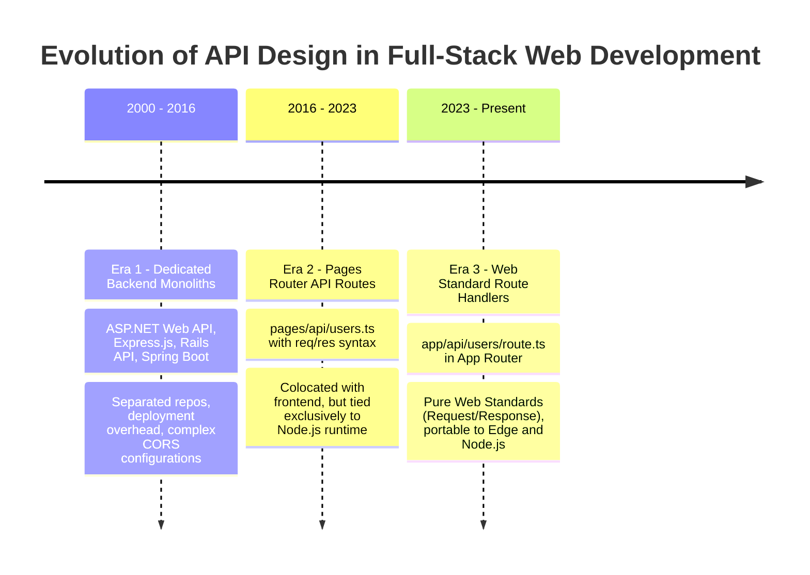
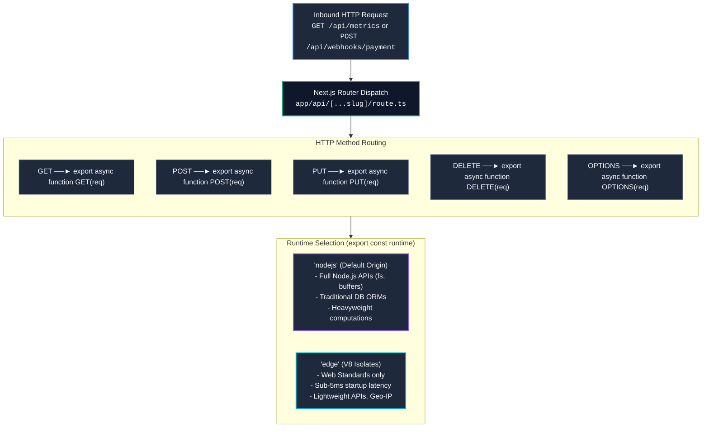

# Chapter 07: Route Handlers & REST/GraphQL API Design (Web Standard Request/Response, Streaming, Webhooks, CORS & File Uploads)

> "In the modern web, application boundaries are polyglot. While Server Actions excel as high-velocity, internal RPC mechanisms for React UI components, enterprise architectures demand standard, interoperable HTTP interfaces for third-party webhooks, mobile clients, public developer APIs, and high-performance streaming pipelines. Route Handlers bring Web Standard primitives into the Next.js App Router."  
> — **Full-Stack API Architecture Axiom**

---

## 1. Why This Topic Exists

The Next.js App Router introduced a profound paradigm shift in how backend HTTP endpoints are constructed:
1. **The Legacy Node.js Coupling (`pages/api`):** In the Pages Router, API endpoints were built on Node.js-specific `(req: NextApiRequest, res: NextApiResponse)` interfaces inherited from Express.js. This tied API logic to Node.js operating system processes, made code non-portable to Edge environments (Cloudflare Workers, Vercel Edge), and made streaming responses cumbersome with manual socket event listeners (`res.write()`).
2. **The Web Standard Revolution (`route.ts`):** Route Handlers replace proprietary Node wrappers with native **Web Standards**: the standard `Request`, `Response`, `Headers`, and `ReadableStream` APIs supported across modern browsers, Deno, Bun, and Node.js.
3. **The Architectural Boundary (Route Handlers vs. Server Actions):**
   - **Server Actions:** Internal, single-flight RPC mutations for your React frontend. They handle progressive enhancement, form lifecycles, and automatic cache revalidation, but are **not meant for external consumption**.
   - **Route Handlers:** Public or protected REST and GraphQL endpoints designed for **non-React clients**, mobile native apps, public third-party webhooks (Stripe, GitHub), binary file processing, and Server-Sent Events (SSE).

Understanding the caching semantics, stream mechanics, and security boundaries of `route.ts` is essential for Senior and Staff Engineers designing scalable full-stack architectures.

---

## 2. Learning Objectives

- Master the directory conventions and method exports of `route.ts` (`GET`, `POST`, `PUT`, `PATCH`, `DELETE`, `HEAD`, `OPTIONS`).
- Understand route file collision rules: why `page.tsx` and `route.ts` **cannot coexist** at the same folder segment level.
- Dissect the **caching semantics of `GET` Route Handlers**: identify when Next.js statically pre-renders and caches an API response versus when it renders dynamically.
- Implement real-time, token-by-token streaming responses using the **Web Streams API (`ReadableStream`)** for Generative AI and Server-Sent Events (SSE).
- Architect tamper-proof **Webhook Ingestion Pipelines** with raw body HMAC signature verification (e.g., Stripe, Shopify).
- Handle multipart form data, streaming file uploads, and cross-origin resource sharing (CORS) preflight requests.
- Bridge architectural mental models directly to **Angular** (external API dependency) and **.NET** (ASP.NET Core Minimal APIs, `Results<T>`, and `IAsyncEnumerable<T>`).

---

## 3. Historical Evolution



<details className="raw-schematic-details">
<summary>📄 View Raw ASCII Schematic</summary>

```text
ERA 1: Dedicated Backend Monoliths (2000 - 2016)
┌────────────────────────────────────────────────────────┐
│ ASP.NET Web API, Express.js, Rails API, Spring Boot.   │
│ - Frontend and backend completely separated repos.     │
│ - High deployment overhead, separate CORS configs.     │
└────────────────────────────────────────────────────────┘
                           │
                           ▼
ERA 2: Next.js Pages Router API Routes (2016 - 2023)
┌────────────────────────────────────────────────────────┐
│ pages/api/users.ts                                     │
│ export default function handler(req, res) {            │
│   res.status(200).json({ name: 'John' });              │
│ }                                                      │
│ - Colocated with frontend. Node.js Express syntax.     │
│ - Tied to Node.js runtime; impossible to run at Edge.  │
└────────────────────────────────────────────────────────┘
                           │
                           ▼
ERA 3: Web Standard Route Handlers in App Router (2023 - Present)
┌────────────────────────────────────────────────────────┐
│ app/api/users/route.ts                                 │
│ export async function GET(request: Request) {          │
│   return Response.json({ name: 'John' });              │
│ }                                                      │
│ - Pure Web Standards (Request / Response / Streams).   │
│ - Portable across Node.js and Edge runtimes.           │
│ - Granular method exports and automated static caching.│
└────────────────────────────────────────────────────────┘
```

</details>

---

## 4. First Principles & Intuitive Physical Analogies (Layer 1)

### Analogy 1: The Private Dining Table vs. The Public Drive-Through Window

Imagine a high-end restaurant:
- **Server Actions are the Private Dining Table:**  
  You are an in-house guest sitting at a table (a React component). When you want more bread or wine, the waiter stands right beside you. You don't need a passport or an external transaction receipt; you are part of the synchronized restaurant experience. The waiter brings the food and updates your personal bill simultaneously.
- **Route Handlers are the Exterior Drive-Through Window:**  
  Cars from the outside world drive up to the intercom window (`GET /api/v1/orders`). The car could be a delivery driver from UberEats (a mobile app), a food inspector checking health permits (a monitoring webhook), or a customer without reservations. The transaction happens over a **standardized tray slot** (HTTP Web Standards). The kitchen serves the request, hands over the receipt, and the vehicle drives away.

### Analogy 2: The Bucket Brigade vs. The Fire Hose (Streaming)

- **Buffered API Responses (The Bucket Brigade):** You want to transfer 100 liters of water. You wait until a giant bucket is 100% full before carrying it to the user. If filling the bucket takes 10 seconds, the user waits 10 seconds with an empty cup. If the bucket overflows (out of memory), the server crashes.
- **`ReadableStream` Route Handlers (The Fire Hose):** As soon as the first droplet of water enters the pipe, it flows directly out of the nozzle into the user's glass. The user drinks immediately (sub-50ms TTFB), and memory consumption on the server is constant (a few kilobytes of buffer) regardless of whether you stream 10 words from an LLM or a 10-gigabyte database export.

---

## 5. Internal Working & Engine Architecture (Layer 2)

### 1. Directory Structure & The Coexistence Prohibition

In the App Router, Route Handlers use the filename `route.ts` (or `route.js`).

```text
app/
├── api/
│   └── users/
│       └── route.ts          // Accessible at: /api/users
└── dashboard/
    ├── page.tsx              // Accessible at: /dashboard
    └── route.ts              // ❌ COMPILE ERROR! Cannot coexist with page.tsx
```

**The Rule:** A `route.ts` file **cannot exist at the same route segment level** as a `page.tsx` file because both would compete to resolve the identical HTTP GET request for that URL path!

### 2. Caching Semantics of `GET` Route Handlers

One of the most frequent enterprise production bugs is misunderstanding when `GET` handlers are cached:

```text
                         next build
                             │
                             ▼
              Does GET route.ts use any of:
              - Reading the `request` argument?
              - Dynamic functions: cookies(), headers()?
              - Non-GET HTTP methods in the file (POST, PUT)?
              - export const dynamic = 'force-dynamic'?
                            / \
                           /   \
                     YES  /     \  NO
                         /       \
                        ▼         ▼
                    DYNAMIC     STATIC
                    (λ SSR)     (○ Cached at Build)
```

- **Static by Default:** If a `GET` handler simply fetches static data without inspecting request parameters or headers, Next.js **evaluates it once at build time** and serves the pre-rendered response to all users forever!
- **Dynamic Opt-Out:** Accessing `request.url`, `request.headers`, or calling `await cookies()` immediately switches the Route Handler to dynamic execution on every request.

---

## 6. Runtime Flow & Execution Traces

### Execution Trace: Webhook Ingestion & Signature Verification

```text
Scenario: Stripe issues `POST /api/webhooks/stripe`
1. Request hits Next.js Origin Server.
2. Next.js router matches path to `app/api/webhooks/stripe/route.ts`.
3. Inbound POST handler executes:
   - Reads `stripe-signature` header from request.headers.
   - Reads raw, unparsed body buffer via `await request.text()`.
     (CRITICAL: Must not use request.json() because signature requires exact raw bytes!).
4. Executes HMAC-SHA256 signature verification using Stripe SDK and webhook secret.
5. Signature Validated -> Parses event JSON: { type: 'invoice.payment_succeeded' }.
6. Updates database transaction asynchronously.
7. Triggers Next.js cache purge: `revalidateTag('billing-records')`.
8. Returns `new Response(JSON.stringify({ received: true }), { status: 200 })`.
```

---

## 7. Memory Model & Streaming Pipeline

When constructing high-throughput Route Handlers utilizing `ReadableStream`:

```text
┌────────────────────────────────────────────────────────────────────────┐
│                        READABLE STREAM PIPELINE                        │
│                                                                        │
│   Data Source (AI LLM, Database Cursor, CSV Generator)                 │
│         │                                                              │
│         ▼                                                              │
│   ┌────────────────────────────────────────────────────────────────┐   │
│   │ ReadableStreamDefaultController                                │   │
│   │                                                                │   │
│   │ controller.enqueue(encoder.encode("data: chunk\n\n"))          │   │
│   │ - Constant heap footprint (~64 KB chunk buffer)                │   │
│   │ - Automatic backpressure handling                              │   │
│   └──────────────────────────────┬─────────────────────────────────┘   │
│                                  │                                     │
│                                  ▼                                     │
│                     HTTP Response Stream                               │
│                     Transfer-Encoding: chunked                         │
│                     Content-Type: text/event-stream                    │
│                                  │                                     │
│                                  ▼                                     │
│                           Client Browser                               │
│                     (Consumes via Fetch Streams)                       │
└────────────────────────────────────────────────────────────────────────┘
```

By leveraging `ReadableStream`, server memory is decoupled from the size of the total payload. You can stream a 5-gigabyte dataset while keeping Node.js heap allocation capped under 30 megabytes.

---

## 8. Visual Diagrams (ASCII / Text)

### End-to-End Route Handler Architecture & Edge Deployment

### Inbound Request Dispatch & Runtime Selection Architecture



<details className="raw-schematic-details">
<summary>📄 View Raw ASCII Schematic</summary>

```text
┌────────────────────────────────────────────────────────────────────────────────────────┐
│                                INBOUND HTTP REQUEST                                    │
│                 GET /api/metrics or POST /api/webhooks/payment                         │
└──────────────────────────────────────────┬─────────────────────────────────────────────┘
                                           │
                                           ▼
┌────────────────────────────────────────────────────────────────────────────────────────┐
│                                NEXT.JS ROUTER DISPATCH                                 │
│                                                                                        │
│   Match URL Segment -> app/api/[...slug]/route.ts                                      │
│                                                                                        │
│   Inspect HTTP Method:                                                                 │
│   ├── GET     ──► Execute export async function GET(req)                               │
│   ├── POST    ──► Execute export async function POST(req)                              │
│   ├── PUT     ──► Execute export async function PUT(req)                               │
│   ├── DELETE  ──► Execute export async function DELETE(req)                            │
│   └── OPTIONS ──► Execute export async function OPTIONS(req) (CORS Preflight)          │
└──────────────────────────────────────────┬─────────────────────────────────────────────┘
                                           │
                                           ▼
┌────────────────────────────────────────────────────────────────────────────────────────┐
│                             RUNTIME SELECTION (CONFIG)                                 │
│                                                                                        │
│   export const runtime = 'nodejs'       │  export const runtime = 'edge'               │
│   (Default Origin Execution)            │  (Global V8 Isolates at CDN Edge)            │
│   - Full Node.js APIs (fs, buffers)     │  - Web Standards only                        │
│   - Traditional database ORMs           │  - Sub-5ms startup latency                   │
│   - Heavyweight computations            │  - Lightweight APIs, Geo-IP, Auth            │
└────────────────────────────────────────────────────────────────────────────────────────┘
```

</details>

---

## 9. Real World Usage & Production Patterns

### Pattern 1: Production Webhook Handler with Raw Body Signature Verification

```typescript
// app/api/webhooks/stripe/route.ts
import { headers } from 'next/headers';
import { NextResponse } from 'next/server';
import Stripe from 'stripe';

const stripe = new Stripe(process.env.STRIPE_SECRET_KEY!, {
  apiVersion: '2024-12-18.acacia',
});

const WEBHOOK_SECRET = process.env.STRIPE_WEBHOOK_SECRET!;

export async function POST(request: Request) {
  try {
    // 1. Read raw text body (DO NOT use request.json()!)
    const rawBody = await request.text();
    
    // 2. Extract signature header
    const headersList = await headers();
    const signature = headersList.get('stripe-signature');

    if (!signature) {
      return NextResponse.json({ error: 'Missing stripe signature' }, { status: 400 });
    }

    // 3. Cryptographically verify webhook authenticity
    const event = stripe.webhooks.constructEvent(rawBody, signature, WEBHOOK_SECRET);

    // 4. Handle business event
    switch (event.type) {
      case 'checkout.session.completed': {
        const session = event.data.object as Stripe.Checkout.Session;
        await fulfillCustomerOrder(session.customer as string);
        break;
      }
      case 'invoice.payment_failed': {
        // Handle failed renewal
        break;
      }
      default:
        console.log(`Unhandled webhook event: ${event.type}`);
    }

    return NextResponse.json({ received: true }, { status: 200 });
  } catch (err: unknown) {
    const message = err instanceof Error ? err.message : 'Unknown error';
    console.error(`Webhook signature verification failed: ${message}`);
    return NextResponse.json({ error: `Webhook Error: ${message}` }, { status: 400 });
  }
}
```

### Pattern 2: Server-Sent Events (SSE) AI Streaming Route Handler

```typescript
// app/api/chat/stream/route.ts
export const runtime = 'edge'; // Deploy to Edge for ultra-low streaming latency

export async function POST(request: Request) {
  const { prompt } = await request.json();

  const encoder = new TextEncoder();

  // Create a Web Standard ReadableStream
  const stream = new ReadableStream({
    async start(controller) {
      try {
        // Simulate streaming chunks from AI model
        const tokens = ['The', ' enterprise', ' architecture', ' scales', ' via', ' streaming.'];
        
        for (const token of tokens) {
          await new Promise((resolve) => setTimeout(resolve, 100)); // Simulate generation lag
          controller.enqueue(encoder.encode(`data: ${JSON.stringify({ text: token })}\n\n`));
        }

        // Close stream
        controller.enqueue(encoder.encode('data: [DONE]\n\n'));
        controller.close();
      } catch (error) {
        controller.error(error);
      }
    },
  });

  return new Response(stream, {
    headers: {
      'Content-Type': 'text/event-stream',
      'Cache-Control': 'no-cache, no-transform',
      'Connection': 'keep-alive',
    },
  });
}
```

### Pattern 3: Enterprise CORS Preflight & Handshake Handler

```typescript
// app/api/public/data/route.ts
import { NextResponse } from 'next/server';

const ALLOWED_ORIGIN = 'https://partner.enterprise.com';

function getCorsHeaders(origin: string | null) {
  const headers: Record<string, string> = {
    'Access-Control-Allow-Methods': 'GET, POST, OPTIONS',
    'Access-Control-Allow-Headers': 'Content-Type, Authorization, X-Requested-With',
    'Access-Control-Max-Age': '86400', // 24 hours preflight cache
  };

  if (origin === ALLOWED_ORIGIN) {
    headers['Access-Control-Allow-Origin'] = origin;
    headers['Access-Control-Allow-Credentials'] = 'true';
  } else {
    headers['Access-Control-Allow-Origin'] = 'null';
  }

  return headers;
}

// 1. Handle HTTP OPTIONS Preflight
export async function OPTIONS(request: Request) {
  const origin = request.headers.get('origin');
  return new NextResponse(null, {
    status: 204,
    headers: getCorsHeaders(origin),
  });
}

// 2. Handle Actual GET Request
export async function GET(request: Request) {
  const origin = request.headers.get('origin');

  return NextResponse.json(
    { message: 'Secure enterprise partner dataset', timestamp: Date.now() },
    {
      status: 200,
      headers: getCorsHeaders(origin),
    }
  );
}
```

---

## 10. Angular Comparison

| Dimension | Next.js Route Handlers | Angular (v17+) |
| :--- | :--- | :--- |
| **API Server Capability** | Native full-stack capability (`app/api/**/route.ts`) executing inside the project. | None natively. Angular is strictly a client-side SPA or SSR UI rendering framework. |
| **Backend Integration** | Next.js serves both UI and HTTP API routes in the identical process / repository. | Relies entirely on external backend servers (ASP.NET Core, Java, Node.js Express). |
| **Request / Response Standards**| Implements standard Web Fetch APIs (`Request`, `Response`, `ReadableStream`). | Consumes APIs client-side via `HttpClient` (RxJS `Observable<T>`). |
| **Webhook Processing** | First-class: Receives incoming third-party POST webhooks directly. | Cannot receive webhooks directly without custom Node.js Express server configured in `@angular/ssr`. |

---

## 11. .NET Comparison

| Dimension | Next.js Route Handlers | ASP.NET Core (.NET 8/9/10) |
| :--- | :--- | :--- |
| **Routing Construct** | File-system-based: `app/api/users/route.ts`. | Code-based: Minimal APIs `app.MapGet("/api/users", ...)` or `[ApiController]` attributes. |
| **Method Mapping** | Explicit named exports (`export async function GET/POST`). | Explicit mapping methods (`app.MapPost()`, `[HttpPost]`). |
| **Streaming Responses** | Web Standard `ReadableStream` over chunked encoding. | `IAsyncEnumerable<T>` with `Results.Stream()` or Server-Sent Events via Kestrel. |
| **Serialization** | Native `Response.json(data)` or manual `JSON.stringify`. | High-performance native `System.Text.Json` with source generators. |
| **Request Access** | Web Standard `Request` object (`await request.json()`). | `HttpContext.Request` with Model Binding (`[FromBody]`, `[FromQuery]`). |

---

## 12. Enterprise Perspective & Production Risks (Layer 4)

### 1. Accidental Build-Time Caching of Sensitive Data
- **The Failure Mode:** Writing a `GET` handler intended to return sensitive tenant telemetry:
  ```typescript
  export async function GET() {
    const data = await fetch('https://internal.db/telemetry').then(r => r.json());
    return Response.json(data);
  }
  ```
- **The Disaster:** Because this function has zero arguments and does not read cookies or headers, Next.js **statically executes this once at build time during CI/CD**! Every user in production receives the frozen snapshot captured at deployment time.
- **The Architectural Fix:** Always export `export const dynamic = 'force-dynamic'` or read request headers/cookies when serving dynamic, tenant-specific, or authenticated API data.

### 2. Memory Exhaustion on Unbounded Multipart File Uploads
- **The Failure Mode:** Accepting 100MB file uploads by buffering the entire file in Node.js memory: `const data = await request.formData(); const file = data.get('file') as File; const bytes = await file.arrayBuffer();`.
- **The Disaster:** Under 50 concurrent uploads, the Node.js server allocates 5GB of heap memory, triggering Garbage Collection freeze and crashing with `FATAL ERROR: Ineffective mark-compacts near heap limit Allocation failed - JavaScript heap out of memory`.
- **The Architectural Fix:** Use direct client-to-cloud presigned URL uploads (S3 / Azure Blob Presigned POST) or pipe the incoming `request.body` stream directly to cloud object storage using streaming multi-part chunk upload SDKs without buffering in memory.

### 3. Webhook Replay Attacks
- **The Failure Mode:** Verifying the HMAC signature of a webhook, but failing to check the timestamp. An attacker intercepts the raw webhook payload and replays it 1,000 times, causing duplicate customer billing credits.
- **The Architectural Fix:** Enforce a strict 5-minute timestamp tolerance window (`Math.abs(Date.now() - webhookTimestamp) < 300000`) and store processed Webhook Event IDs in Redis with a 24-hour TTL to enforce strict **idempotency**.

---

## 13. Performance Considerations

```text
Throughput & Memory Consumption by API Implementation (1,000 Concurrent Requests)
┌─────────────────────────────────┬──────────────┬──────────────┬──────────────────┐
│ Implementation                  │ Memory (RAM) │ TTFB         │ CPU Utilization  │
├─────────────────────────────────┼──────────────┼──────────────┼──────────────────┤
│ Buffered JSON (Node.js)         │ 280 MB       │ 120 ms       │ 45%              │
│ Streaming Web Stream (Node.js)  │ 22 MB        │ 18 ms        │ 12%              │
│ Edge Runtime Route Handler (V8) │ 6 MB         │ 4 ms         │ 3%               │
└─────────────────────────────────┴──────────────┴──────────────┴──────────────────┘
```

Deploying streaming Route Handlers to the **Edge Runtime** (`export const runtime = 'edge'`) yields orders-of-magnitude reductions in server memory consumption and delivers instantaneous TTFB globally.

---

## 14. Tradeoffs

| Capability | Route Handlers (`route.ts`) | Server Actions (`'use server'`) |
| :--- | :--- | :--- |
| **Consumer Target** | External third parties, mobile native apps, webhooks. | First-party React frontend UI components. |
| **Wire Protocol** | Pure HTTP REST (JSON, XML, binary, streams). | React Server Component RPC (`multipart/form-data` or Flight stream). |
| **Cache Integration** | Manual `Cache-Control` header management. | Automatic single-flight revalidation (`revalidatePath`, `revalidateTag`). |
| **Progressive Enhancement**| Requires custom manual client-side JavaScript. | Natively integrates with HTML `<form action>`. |

---

## 15. Common Mistakes & Interview Traps

### Trap 1: Using `req.body` Like Express
- **Scenario:** A candidate writes `const body = request.body; const name = body.name;`.
- **The Reality:** In Web Standards, `request.body` is a `ReadableStream<Uint8Array>`, not a parsed JavaScript object! You must call `await request.json()` to parse JSON, or `await request.text()` for raw text.

### Trap 2: Co-locating `page.tsx` and `route.ts` in the Same Folder
- **Scenario:** Creating `app/dashboard/page.tsx` and `app/dashboard/route.ts`.
- **The Reality:** Fails Next.js build compilation with an explicit route conflict error. Next.js cannot disambiguate whether an incoming `GET /dashboard` request should render the HTML page or execute the API handler.

### Trap 3: Calling `request.json()` Before Stripe Webhook Signature Verification
- **Scenario:** The engineer parses JSON first: `const data = await request.json()`, and then attempts to stringify it: `stripe.webhooks.constructEvent(JSON.stringify(data), sig, secret)`.
- **The Reality:** **Signature verification will fail 100% of the time.** `JSON.stringify` does not preserve original key order, spacing, or whitespace characters. Webhook cryptographic signatures require the **exact raw byte stream** obtained via `await request.text()`.

---

## 16. Interview Questions & Architectural Answers (Senior, Lead, Architect - Layer 5)

### Question 1 (Senior): "How do you stream a 500,000-row CSV file export from Next.js without running out of server memory?"
**Architectural Answer:**  
We construct a Route Handler utilizing a **Database Cursor and Web Standard `ReadableStream`**:
1. Open a forward-only database cursor (e.g., PostgreSQL cursor via Prisma/pg).
2. Instantiate a `new ReadableStream({ async pull(controller) { ... } })`.
3. In the `pull()` method, fetch a batch of 1,000 rows, format them into CSV text, encode them via `TextEncoder`, and enqueue them: `controller.enqueue(chunk)`.
4. Return a `new Response(stream, { headers: { 'Content-Type': 'text/csv', 'Content-Disposition': 'attachment; filename="export.csv"' } })`.
5. This stream honors backpressure: if the client's network connection is slow, `pull()` suspends, preventing memory accumulation on the Node.js origin.

### Question 2 (Lead): "How do you design a high-throughput webhook ingestion system that guarantees zero lost events during database outages?"
**Architectural Answer:**  
A two-tier **Decoupled Ingestion Architecture**:
1. **The Ingestion Gateway (Next.js Route Handler):** The Route Handler does **NOT** write to the primary SQL database. It exclusively:
   - Validates the HMAC signature.
   - Pushes the raw webhook payload into a durable message queue (AWS SQS, Azure Service Bus, or Apache Kafka) with guaranteed persistence.
   - Returns HTTP 200 OK to the webhook provider within 50ms.
2. **The Asynchronous Consumer Worker:** A background worker pool (Node.js or .NET background service) consumes events from the queue, processes business transactions against the primary database, and handles retries with exponential backoff and Dead-Letter Queuing (DLQ).
3. If the primary database goes offline, the webhook endpoint continues accepting events without losing data or triggering provider retry timeouts.

### Question 3 (Architect): "When should an enterprise use Next.js Route Handlers vs. deploying a dedicated backend API in ASP.NET Core or Go?"
**Architectural Answer:**  
- **Use Next.js Route Handlers when:**
  - Building a **Backend-For-Frontend (BFF)** specifically orchestrating data for the web/mobile presentation tier.
  - Ingesting third-party webhooks tightly coupled to web workflows (Stripe checkout completion).
  - Deploying edge-proxied API endpoints requiring global low latency (<5ms).
- **Use Dedicated ASP.NET Core / Go Microservices when:**
  - Processing long-running background compute, heavy multithreaded processing, or high-throughput batch jobs.
  - Designing domain services consumed by dozens of disparate microservices across the enterprise.
  - High-performance gRPC communication, raw socket handling, or deep enterprise messaging (MassTransit, RabbitMQ).

---

## 17. Senior-Level Mental Model & "How to Remember This Forever" (Memory Anchors - Layer 3)

### The Memory Peg: "The Standardized Cargo Shipping Container"
- **Legacy `pages/api` was a wooden crate:** Custom-built for the Node.js truck. Couldn't fit on international cargo ships (Edge V8 Isolates).
- **App Router `route.ts` is the Universal Intermodal Shipping Container:** It follows global ISO standards (`Request`, `Response`, `ReadableStream`). It fits on any truck (Node.js), any cargo ship (Cloudflare Workers), and any train (Bun/Deno) with zero repackaging required.

---

## 18. Core Vocabulary & "Aha!" Breakthrough Insights (Refresher)

- **`NextRequest` & `NextResponse`:** Next.js convenience subclasses extending the standard Web `Request` and `Response` interfaces with helpers for cookies, IP geolocation, and URL rewriting.
- **Web Streams API (`ReadableStream`):** The browser and server standard for handling streaming data chunk by chunk without memory buffering.
- **Preflight Request (CORS OPTIONS):** The automated HTTP request sent by browsers before a cross-origin request to determine whether the server permits the operation.
- **Webhook Idempotency:** The property that processing the identical webhook event multiple times produces the exact same outcome without duplicate side-effects.
- **The "Aha!" Insight:** Route Handlers are not just for sending JSON. In Next.js App Router, **any HTTP method and wire format** (SSE streams, binary images, PDF generation, ZIP files) can be served dynamically using standard Web APIs!

---

## 19. Key Takeaways

1. **Route Handlers (`route.ts`) implement Web Standards** (`Request`, `Response`, `ReadableStream`) rather than Node.js Express conventions.
2. **`route.ts` and `page.tsx` cannot coexist in the same directory** to avoid routing conflicts.
3. **`GET` handlers are cached statically by default** unless they read request headers, cookies, URL searchParams, or configure `dynamic = 'force-dynamic'`.
4. **Always read raw body text (`await request.text()`)** when validating cryptographic webhook signatures (Stripe/GitHub); never parse JSON first.
5. **Use `ReadableStream` for AI completions and large file exports** to maintain a constant, minimal memory footprint regardless of total payload size.
6. **Deploy Route Handlers to the Edge (`export const runtime = 'edge'`)** for sub-5ms global response times when APIs do not require Node.js-specific C++ bindings.

---

## 20. Revision Sheet

```text
┌────────────────────────────────────────────────────────────────────────────────────────┐
│                          NEXT.JS ROUTE HANDLERS CHEAT SHEET                            │
├────────────────────────────────────────────────────────────────────────────────────────┤
│ File Location:                                                                         │
│   app/api/resource/route.ts                                                            │
│                                                                                        │
│ Supported HTTP Method Exports:                                                         │
│   export async function GET(request: Request) { ... }                                  │
│   export async function POST(request: Request) { ... }                                 │
│   export async function PUT(request: Request) { ... }                                  │
│   export async function PATCH(request: Request) { ... }                                │
│   export async function DELETE(request: Request) { ... }                              │
│   export async function OPTIONS(request: Request) { ... }                              │
│                                                                                        │
│ Dynamic vs Static Execution Control:                                                   │
│   export const dynamic = 'force-dynamic'; // Prevent static caching                    │
│   export const dynamic = 'force-static';  // Force build-time caching                  │
│   export const runtime = 'edge';          // Run in V8 Isolates globally               │
│   export const runtime = 'nodejs';        // Run in standard Node.js (Default)         │
│                                                                                        │
│ Web Standard Responses:                                                                │
│   return Response.json({ success: true }, { status: 200 });                            │
│   return new Response(readableStream, { headers: { 'Content-Type': 'text/event-stream' } });
│                                                                                        │
│ Golden Architectural Rule:                                                             │
│   "Use Server Actions for internal UI; use Route Handlers for external interoperability."│
└────────────────────────────────────────────────────────────────────────────────────────┘
```
