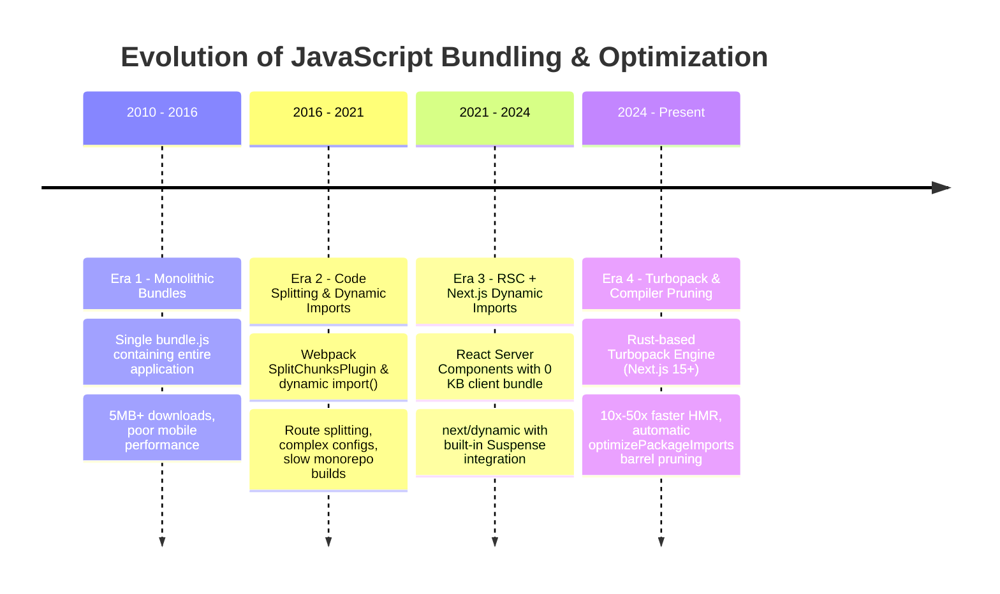
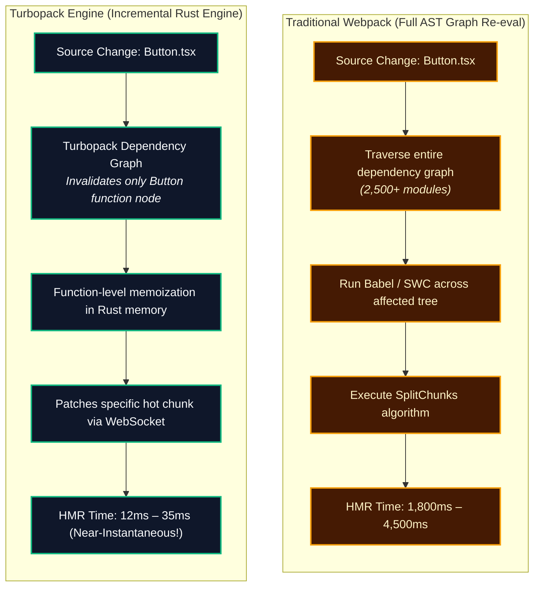

# Chapter 09: Dynamic Imports, Bundling & Code Splitting Optimization (Webpack / Turbopack Internals, `next/dynamic`, Tree-Shaking & Bundle Analysis)

> "In enterprise frontend systems, JavaScript bundle size is not merely a bandwidth concern—it is a direct tax on mobile CPU execution. Every additional 100 KB of client JavaScript forces the V8 engine to spend tens of milliseconds parsing, compiling, and hydrating on the main thread, directly degrading Interaction to Next Paint (INP) and Largest Contentful Paint (LCP). True architectural mastery lies in keeping client bundles near zero by default."  
> — **Frontend Performance Engineering Axiom**

---

## 1. Why This Topic Exists

The modern web is inundated with client-side JavaScript bloat:
1. **The V8 CPU Compilation Tax:** Downloading a 2 MB JavaScript bundle over 5G takes only 200ms. However, parsing, compiling, and executing that 2 MB bundle on an average mobile device's V8 engine takes **1,200ms to 2,500ms** of saturated main-thread compute. During this window, the page is frozen, resulting in severe Core Web Vitals penalties (**INP > 500ms**).
2. **The Barrel File Explosion:** Modern component libraries and icon packages (`lucide-react`, `@mui/icons-material`, `lodash`) often export thousands of symbols from a single index file (`index.ts`). Importing `import { Star } from 'lucide-react'` can inadvertently force the bundler to parse thousands of files, slowing down development server compilation by 300% and inflating production bundles if tree-shaking fails.
3. **The RSC Boundary Leverage:** React Server Components (RSC) fundamentally altered bundle physics by having a **0 KB client bundle footprint**. However, the moment a developer adds `'use client'` to a component, every imported dependency (Chart.js, Monaco Editor, Three.js) is shipped to the client browser.

Next.js provides industrial-grade tools to manage this complexity: **Turbopack** (the Rust-based successor to Webpack), `next/dynamic`, lazy loading with SSR opt-outs, `optimizePackageImports`, and automated bundle analyzers.

---

## 2. Learning Objectives

- Master the architecture of **Code Splitting** and **Dynamic Imports** using `next/dynamic` and `React.lazy`.
- Control Server-Side Rendering execution for client-only libraries (`{ ssr: false }`) to safely bypass server hydration errors.
- Dissect the build-time engine architecture: **Webpack SplitChunks** vs. **Turbopack's incremental computation graph**.
- Understand AST-level **Tree-Shaking** and how package `sideEffects: false` flags eliminate dead code.
- Optimize barrel file compilation using the Next.js `optimizePackageImports` compiler directive.
- Profile and audit production bundle sizes using `@next/bundle-analyzer` to identify and eliminate bloat.
- Bridge architectural mental models directly to **Angular** (Lazy-loaded routes, standalone `@defer` blocks) and **.NET** (Blazor WebAssembly lazy assembly loading and IL Linker trimming).

---

## 3. Historical Evolution



<details className="raw-schematic-details">
<summary>📄 View Raw ASCII Schematic</summary>

```text
ERA 1: Monolithic Bundles (2010 - 2016)
┌────────────────────────────────────────────────────────┐
│ Single bundle.js containing entire application.        │
│ - Entire site downloaded before any page renders.      │
│ - 5MB+ initial downloads; terrible mobile performance. │
└────────────────────────────────────────────────────────┘
                           │
                           ▼
ERA 2: Webpack 4/5 Code Splitting & Dynamic Imports (2016 - 2021)
┌────────────────────────────────────────────────────────┐
│ import('./module').then(...) + SplitChunksPlugin       │
│ - Route-based code splitting.                          │
│ - Complex Webpack configuration.                       │
│ - Slow build times for large enterprise monorepos.     │
└────────────────────────────────────────────────────────┘
                           │
                           ▼
ERA 3: React 18/19 RSC + Next.js Dynamic Imports (2021 - 2024)
┌────────────────────────────────────────────────────────┐
│ Server Components = 0 KB client bundle.                │
│ next/dynamic with built-in Suspense integration.       │
│ Client components loaded strictly on-demand.           │
└────────────────────────────────────────────────────────┘
                           │
                           ▼
ERA 4: Turbopack & Compiler-Assisted Pruning (2024 - Present)
┌────────────────────────────────────────────────────────┐
│ Rust-based Turbopack Engine (Next.js 15+).             │
│ - 10x - 50x faster local HMR and production builds.    │
│ - Automatic optimizePackageImports pruning barrel files│
│ - Function-level dead-code elimination and SWC transforms│
└────────────────────────────────────────────────────────┘
```

</details>

---

## 4. First Principles & Intuitive Physical Analogies (Layer 1)

### Analogy 1: The Giant Heavyweight Trunk vs. The Modular Tool Belt

Imagine arriving at a construction job site:
- **Monolithic Client Bundles (The Giant Trunk):**  
  You drag a 300-kilogram metal chest onto the site before you can even hammer a single nail. Inside the chest is a cement mixer, a pneumatic drill, a welding torch, and 500 specialized wrenches. You only need a hammer to fix a picture frame, but you spent 2 hours dragging the entire chest up the stairs.
- **Dynamic Code Splitting (The Modular Tool Belt):**  
  You walk onto the site wearing a lightweight tool belt carrying just a pencil and a hammer (50 KB initial bundle). If and when you need the specialized welding torch (e.g., the user clicks "View Interactive 3D Model"), a motorized delivery drone flies in and drops the torch right into your hands on demand (`next/dynamic`).

### Analogy 2: The Encyclopedic Dictionary vs. The Search Engine Result

- **Importing Barrel Files without Tree-Shaking:** Ordering an entire 24-volume print edition of the Encyclopedia Britannica shipped to your doorstep by mail just to look up the definition of the word "apple".
- **Tree-Shaking:** A surgical laser scanner that cuts out only the single sentence describing "apple", slips it into an envelope, and incinerates the remaining 23 volumes before the mail leaves the post office.

---

## 5. Internal Working & Engine Architecture (Layer 2)

### 1. The Next.js Chunking Topology

During compilation, Next.js chunks your application into distinct, highly optimized bundles:

```text
.next/static/chunks/
├── app-pages-internals.js        # Next.js router runtime & Flight stream deserializer
├── framework-[hash].js           # React core, ReactDOM, scheduler (~45 KB)
├── main-[hash].js                # Shared client entrypoint & global utilities
├── [route]-page-[hash].js        # Segment-specific client components
└── dynamic-[hash].js             # Isolated chunks generated by next/dynamic()
```

### 2. How `next/dynamic` Works Under the Hood

When you define a dynamic import:
```typescript
const HeavyChart = dynamic(() => import('@/components/HeavyChart'), {
  loading: () => <Skeleton />,
  ssr: false,
});
```

1. **Compilation Phase:** The bundler (Turbopack or Webpack) detects the dynamic `import()` statement. It separates `HeavyChart` and all of its exclusive dependencies into a standalone, isolated JavaScript chunk file (e.g., `1842.chunk.js`).
2. **SSR Opt-Out (`ssr: false`):**
   - The server **completely skips** rendering this component during SSR.
   - The server streams HTML containing **only the fallback skeleton** (`<Skeleton />`).
   - This shields the server from executing client-only browser APIs (`window`, `document`, `navigator`, `WebGL`).
3. **Client Hydration Phase:**
   - Once the client browser hydrates the surrounding tree, Next.js injects a `<script src="/_next/static/chunks/1842.chunk.js">` tag.
   - Once the script finishes downloading and parsing, React reconciles the tree, replacing the skeleton with the live `HeavyChart` component without interrupting user interaction!

### 3. Tree-Shaking & The `sideEffects: false` Flag

Tree-shaking is AST-based dead code elimination:
- In ECMAScript Modules (`import` / `export`), imports are static and immutable.
- The bundler constructs a complete Dependency Graph. If a file exports `export function A()` and `export function B()`, and your code only imports `A`, the bundler marks `B` as unused.
- **The Catch:** JavaScript functions can produce side effects when executed (e.g., modifying `window.customProperty = 1`). Unless a library's `package.json` explicitly states:
  ```json
  {
    "sideEffects": false
  }
  ```
  The bundler **cannot safely delete unreferenced code**, because doing so might alter runtime behavior! Modern Next.js uses the SWC/Turbopack compiler to aggressively analyze and eliminate pure unused modules.

---

## 6. Runtime Flow & Execution Traces

### Execution Trace: User-Triggered Dynamic Code Loading

```text
1. User lands on `/dashboard` (Initial Load).
   -> Browser downloads `framework.js` (45 KB) and `dashboard-page.js` (15 KB).
   -> Total JavaScript payload: 60 KB.
   -> Time to Interactive (TTI): 80ms. INP: 12ms (Optimal!).
   -> Heavy Chart widget is NOT loaded.

2. User clicks "Generate Financial Forecast" button.
   -> State triggers `setShowAnalytics(true)`.
   -> React encounters dynamic component boundary: `<DynamicAnalyticsModal />`.

3. Next.js Client Runtime intercepts the boundary:
   -> Immediately displays `<LoadingSkeleton />`.
   -> Emits dynamic HTTP request: `GET /_next/static/chunks/analytics-modal-88f2.js` (350 KB).

4. Network & Execution:
   -> Browser downloads 350 KB chunk.
   -> V8 parses and evaluates the module.
   -> Component resolves. React transitions from Skeleton to live Interactive Modal.

5. Caching:
   -> Browser caches `analytics-modal-88f2.js` indefinitely (immutable hash).
   -> Subsequent clicks open the modal in 0ms!
```

---

## 7. Memory Model & Network Graph

```text
Without Code Splitting (Monolithic Initial Load)
┌────────────────────────────────────────────────────────────────────────┐
│ Initial Bundle: 1,800 KB                                               │
│ [React + Lucide + Chart.js + Monaco Editor + Three.js + App Code]      │
│ └── V8 Heap Allocation: 42 MB                                          │
│ └── Main Thread Compilation Delay: 650 ms (Long Task / INP Failure)    │
└────────────────────────────────────────────────────────────────────────┘

With Strategic RSC + Dynamic Imports
┌────────────────────────────────────────────────────────────────────────┐
│ Initial Bundle: 68 KB (React + Core UI Shell)                          │
│ └── V8 Heap Allocation: 3.2 MB                                         │
│ └── Main Thread Compilation Delay: 18 ms (Sub-frame, zero freeze)      │
│                                                                        │
│ On-Demand Chunks (Downloaded only when accessed):                      │
│ ├── Chunk 1: Monaco Editor (850 KB) -> Only on /editor route           │
│ ├── Chunk 2: Three.js Canvas (620 KB) -> Only when 3D tab opened      │
│ └── Chunk 3: Chart.js (210 KB) -> Only when analytics modal opens     │
└────────────────────────────────────────────────────────────────────────┘
```

---

## 8. Visual Diagrams (ASCII / Text)

### Turbopack Incremental Computation vs. Webpack AST Bundling



<details className="raw-schematic-details">
<summary>📄 View Raw ASCII Schematic</summary>

```text
TRADITIONAL WEBPACK (Full AST Graph Re-eval)
┌────────────────────────────────────────────────────────────────────────┐
│ Source Code File Changed: components/Button.tsx                        │
│ 1. Traverse entire module dependency graph (2,500 modules).            │
│ 2. Run Babel / SWC loaders across affected tree.                       │
│ 3. Execute SplitChunks re-optimization algorithm.                      │
│ 4. Re-emit bundle chunks.                                              │
│ -> HMR Time: 1,800ms - 4,500ms on large apps.                          │
└────────────────────────────────────────────────────────────────────────┘

TURBOPACK ENGINE (Incremental Computation in Rust)
┌────────────────────────────────────────────────────────────────────────┐
│ Source Code File Changed: components/Button.tsx                        │
│ 1. Turbopack Dependency Graph: Only invalidates Button function node.  │
│ 2. Function-level memoization in Rust memory.                          │
│ 3. Directly patches the specific hot chunk over WebSocket.             │
│ -> HMR Time: 12ms - 35ms (Near-Instantaneous at scale!).               │
└────────────────────────────────────────────────────────────────────────┘
```

</details>

---

## 9. Real World Usage & Production Patterns

### Pattern 1: Lazy Loading Heavy Client Component with SSR Disabled

```tsx
// app/dashboard/page.tsx
'use client';

import { useState } from 'react';
import dynamic from 'next/dynamic';

// 1. Define dynamic import with explicit loading skeleton and SSR disabled
const HeavyCodeEditor = dynamic(() => import('@/components/MonacoCodeEditor'), {
  loading: () => (
    <div className="h-96 w-full animate-pulse bg-gray-900 rounded-lg flex items-center justify-center">
      <span className="text-gray-400">Loading IDE Environment...</span>
    </div>
  ),
  ssr: false, // Prevents window/navigator crash on Node.js server!
});

export default function DeveloperDashboard() {
  const [isEditorOpen, setIsEditorOpen] = useState(false);

  return (
    <div className="p-8">
      <h1>Developer Console</h1>
      <button 
        onClick={() => setIsEditorOpen(true)}
        className="btn-primary"
      >
        Open Cloud IDE
      </button>

      {isEditorOpen && (
        <div className="mt-4">
          <HeavyCodeEditor initialCode="console.log('Hello Enterprise');" />
        </div>
      )}
    </div>
  );
}
```

### Pattern 2: Optimizing Barrel Files in `next.config.ts`

Eliminate slow compilation and bundle bloat from libraries exporting thousands of icons or components:

```typescript
// next.config.ts
import type { NextConfig } from 'next';

const nextConfig: NextConfig = {
  // Turbopack / Webpack optimization: Transforms barrel imports into direct file imports
  // Converts: import { Star, Bell } from 'lucide-react'
  // Into:     import Star from 'lucide-react/dist/esm/icons/star'
  experimental: {
    optimizePackageImports: [
      'lucide-react',
      '@headlessui/react',
      'lodash-es',
      '@tanstack/react-table',
      'date-fns',
    ],
  },
};

export default nextConfig;
```

### Pattern 3: Configuring `@next/bundle-analyzer`

```typescript
// next.config.mjs
import withBundleAnalyzer from '@next/bundle-analyzer';

const bundleAnalyzer = withBundleAnalyzer({
  enabled: process.env.ANALYZE === 'true',
});

/** @type {import('next').NextConfig} */
const nextConfig = {
  // Enterprise production settings
  reactStrictMode: true,
};

export default bundleAnalyzer(nextConfig);
```

*Execution:*  
Run `ANALYZE=true npm run build` to open interactive Treemap visualizations of your client and server bundles in your browser.

---

## 10. Angular Comparison

| Dimension | Next.js Dynamic Imports | Angular (v17+) |
| :--- | :--- | :--- |
| **Component Lazy Loading** | `dynamic(() => import(...))` with built-in fallback skeleton. | `@defer (on viewport) { <heavy-chart /> } @placeholder { ... }`. |
| **SSR Opt-Out** | Native option: `{ ssr: false }`. | Handled via `isPlatformBrowser(platformId)` or `@defer` without server pre-rendering. |
| **Route-Based Splitting** | Automatic based on filesystem routes (`page.tsx`). | Declarative in route configuration via `loadComponent: () => import(...)`. |
| **Bundling Engine** | Webpack 5 or native Rust-based Turbopack. | Vite (Dev mode) + esbuild/Rollup (Build mode) via Angular CLI. |
| **Server Zero-Bundle** | React Server Components (RSC) have **0 KB** client footprint. | Not supported; all rendered Angular components ship client code. |

---

## 11. .NET Comparison

| Dimension | Next.js Dynamic Imports | ASP.NET Core Blazor (.NET 8/9/10) |
| :--- | :--- | :--- |
| **Assembly / Chunk Splitting**| ECMAScript dynamic `import()` creating `.js` chunks. | Lazy Assembly Loading (`.wasm` / `.dll` chunks via `LazyAssemblyLoader`). |
| **Dead Code Elimination** | Tree-shaking (SWC / Turbopack AST elimination). | IL Linker / Native AOT Trimming (`<PublishTrimmed>true</PublishTrimmed>`). |
| **Component Fallback** | React `Suspense` fallback. | Blazor `<Suspense>` or custom loading render fragments. |
| **Bundle Profiling** | `@next/bundle-analyzer` (HTML Treemap). | `dotnet-wasi` diagnostics or Chrome DevTools Network inspection. |

---

## 12. Enterprise Perspective & Production Risks (Layer 4)

### 1. Cumulative Layout Shift (CLS) on Dynamic Imports
- **The Failure Mode:** Dynamically loading a large widget (e.g., `<DynamicHeroBanner />`) with `{ ssr: false }` without specifying an explicit `min-height` on the loading skeleton.
- **The Disaster:** The page renders at 0px height. Once the chunk downloads 500ms later, the banner pops in, shifting the entire page down 400 pixels. The user experiences a jarring visual jump, causing a disastrous **CLS score > 0.25** and failing Google Core Web Vitals audits.
- **The Architectural Fix:** Always wrap dynamic imports in a container with a fixed aspect ratio or matching `min-height` skeleton that matches the exact physical dimensions of the loaded component.

### 2. The Dynamic Import Inside Render Loop Anti-Pattern
- **The Failure Mode:** Writing `dynamic()` inside a React component function body:
  ```tsx
  // FATAL MEMORY & PERFORMANCE FLAW
  export default function ProductList({ items }) {
    return items.map(item => {
      const DynamicBadge = dynamic(() => import('./Badge')); // Re-created on every render!
      return <DynamicBadge key={item.id} />;
    });
  }
  ```
- **The Disaster:** Every single render pass instantiates a completely new dynamic component constructor. React unmounts and remounts the component on every state change, re-fetching the JavaScript chunk repeatedly and crashing client performance.
- **The Architectural Fix:** **Always declare dynamic imports at the top-level module scope** outside of all component functions!

---

## 13. Performance Considerations

```text
Performance Impact of Code Splitting on Mobile (Mid-tier Android, 4G Connection)
┌─────────────────────────────────┬──────────────┬──────────────┬──────────────────┐
│ Strategy                        │ JS Payload   │ LCP          │ INP (Main Thread)│
├─────────────────────────────────┼──────────────┼──────────────┼──────────────────┤
│ Monolithic Client Bundle        │ 1,450 KB     │ 3.8s (Poor)  │ 320 ms (Poor)    │
│ Route Splitting Only            │ 380 KB       │ 2.1s (Needs) │ 140 ms (Needs)   │
│ RSC + Dynamic Imports + Pruning │ 72 KB        │ 1.1s (Good)  │ 18 ms (Good!)    │
└─────────────────────────────────┴──────────────┴──────────────┴──────────────────┘
```

---

## 14. Tradeoffs

| Technique | Advantages | Disadvantages |
| :--- | :--- | :--- |
| **`next/dynamic` with `ssr: false`** | Eliminates server crashes for client-only libraries; reduces initial bundle size. | Content is invisible to search engine crawlers (SEO penalty); layout shift risk. |
| **React Server Components (RSC)** | True 0 KB client bundle; secure server execution; direct DB access. | Cannot use React hooks (`useState`, `useEffect`) or browser event listeners. |
| **`optimizePackageImports`** | Dramatically speeds up compilation; prevents barrel file bloat with zero code changes. | Experimental compiler feature; requires manual configuration of library package names. |

---

## 15. Common Mistakes & Interview Traps

### Trap 1: Using `next/dynamic` for Tiny Components
- **Scenario:** A developer wraps a simple 20-line `<Button>` or `<Icon>` in `dynamic()`.
- **The Reality:** **Anti-pattern.** Every dynamic import creates an extra HTTP request and overhead in the bundler runtime. Wrapping a 1 KB component in dynamic loading actually degrades performance by adding network latency and chunk overhead! Only dynamically split heavy dependencies (>30 KB, such as charts, editors, complex date pickers, or 3D canvases).

### Trap 2: Believing Dynamic Imports Automatically Fix SEO
- **Scenario:** A candidate says: *"I dynamically imported my product reviews to improve speed, so Google crawls them faster."*
- **The Reality:** If you set `{ ssr: false }`, the reviews are **not present in the initial HTML document**. Search engine bots may not wait for dynamic scripts to download, potentially ignoring the reviews completely. For SEO-critical content, keep SSR enabled!

---

## 16. Interview Questions & Architectural Answers (Senior, Lead, Architect - Layer 5)

### Question 1 (Senior): "What is the difference between `React.lazy` and `next/dynamic`?"
**Architectural Answer:**  
- **`React.lazy`:** The core React primitive for dynamic imports. It works strictly on the client side and requires manual wrapping with `<Suspense>`. It has no native awareness of Next.js server-side rendering pipelines.
- **`next/dynamic`:** A comprehensive Next.js wrapper around `React.lazy` and `Suspense`. It provides:
  1. Built-in `ssr: false` toggle to safely disable server rendering for browser-only code.
  2. Integrated `loading` fallback parameter without explicit `<Suspense>` boilerplate.
  3. Preloading support and synchronization with the Next.js chunk prefetching engine.

### Question 2 (Lead): "Our CI/CD production build takes 25 minutes, and our development server takes 8 seconds to compile hot reloads. How do you diagnose and fix this?"
**Architectural Answer:**  
1. **Switch to Turbopack:** Ensure Next.js is running with `--turbopack` in development to replace Webpack with Rust-based incremental graph compilation.
2. **Eliminate Barrel File Bottlenecks:** Profile imports using `next.config.ts` `experimental.optimizePackageImports` for heavy design systems (`lucide-react`, `@mui`, `lodash-es`).
3. **Execute Bundle Analyzer:** Run `ANALYZE=true next build` to identify accidental duplication (e.g., two different versions of `date-fns` or `lodash` bundled simultaneously).
4. **Enforce Modular Imports:** Replace `import { x } from 'heavy-lib'` with deep imports `import x from 'heavy-lib/x'` where barrel optimization is unavailable.

### Question 3 (Architect): "How do you architect a zero-bundle-size analytics and telemetry pipeline in an enterprise Next.js application?"
**Architectural Answer:**  
1. **Server-Side Tracking via Server Actions:** Shift standard event tracking (e.g., checkout completed, form submitted) entirely to the server inside Server Actions. Emit telemetry events directly from Node.js to Segment/Datadog using HTTP APIs. Client bundle cost: **0 KB**.
2. **Deferred Script Loading for Client Analytics:** For required client beacons (Google Tag Manager, Hotjar), use `next/script` with `strategy="afterInteractive"` or `strategy="lazyOnload"`. This guarantees scripts do not execute during critical initial paint.
3. **Web Worker Offloading via Partytown:** Offload third-party tracking scripts into background Web Workers, completely freeing the browser main thread from third-party analytics execution.

---

## 17. Senior-Level Mental Model & "How to Remember This Forever" (Memory Anchors - Layer 3)

### The Memory Peg: "The Heavy Gold Vault vs. The Cash on Demand"
- **Monolithic Bundles:** Carrying a 500-pound iron safe into the grocery store to buy an apple.
- **`next/dynamic`:** Carrying an ATM card in your wallet. When you reach the cashier, you withdraw the cash in 2 seconds.
- **RSC:** The cashier simply hands you the apple because the transaction was already cleared by the bank before you walked into the store!

---

## 18. Core Vocabulary & "Aha!" Breakthrough Insights (Refresher)

- **Turbopack:** The high-performance, Rust-based incremental bundler built into Next.js that replaces Webpack.
- **`ssr: false`:** A `next/dynamic` option that completely skips server rendering, preventing hydration mismatches on browser-only libraries.
- **Tree-Shaking:** The compile-time process of eliminating unused code from the final bundle based on static ES module import/export analysis.
- **`optimizePackageImports`:** A Next.js compiler optimization that transforms barrel imports into direct file paths, dramatically reducing compilation overhead.
- **The "Aha!" Insight:** The best way to optimize a client bundle is to **not send it to the client at all**. By keeping components as Server Components by default, you achieve 0 KB bundle weight without writing a single line of dynamic splitting boilerplate!

---

## 19. Key Takeaways

1. **Client JavaScript bundle size taxes mobile CPU compilation,** directly degrading Core Web Vitals (INP and LCP).
2. **`next/dynamic` allows on-demand chunk loading** and provides `{ ssr: false }` to safely run client-only libraries (Monaco, Chart.js, Three.js).
3. **Always declare `dynamic()` at the top-level module scope**; never instantiate dynamic components inside render loops.
4. **Use `optimizePackageImports` in `next.config.ts`** to eliminate barrel file compilation bottlenecks in large icon and component libraries.
5. **Always provide an explicit height or skeleton** when using dynamic imports to avoid Cumulative Layout Shift (CLS).
6. **React Server Components are your primary optimization tool:** they have a 0 KB client bundle footprint by default.

---

## 20. Revision Sheet

```text
┌────────────────────────────────────────────────────────────────────────────────────────┐
│                        NEXT.JS CODE SPLITTING CHEAT SHEET                              │
├────────────────────────────────────────────────────────────────────────────────────────┤
│ Dynamic Import Syntax:                                                                 │
│   import dynamic from 'next/dynamic';                                                  │
│                                                                                        │
│   const HeavyWidget = dynamic(() => import('@/components/HeavyWidget'), {              │
│     loading: () => <WidgetSkeleton />,                                                 │
│     ssr: false, // Optional: Disable server rendering                                  │
│   });                                                                                  │
│                                                                                        │
│ Barrel File Optimization (next.config.ts):                                             │
│   experimental: {                                                                      │
│     optimizePackageImports: ['lucide-react', 'lodash-es', '@headlessui/react'],        │
│   }                                                                                    │
│                                                                                        │
│ Bundle Analyzer Command:                                                               │
│   ANALYZE=true npm run build                                                           │
│                                                                                        │
│ Threshold Rule:                                                                        │
│   "Only dynamically split components > 30 KB; never split trivial UI buttons."         │
└────────────────────────────────────────────────────────────────────────────────────────┘
```
