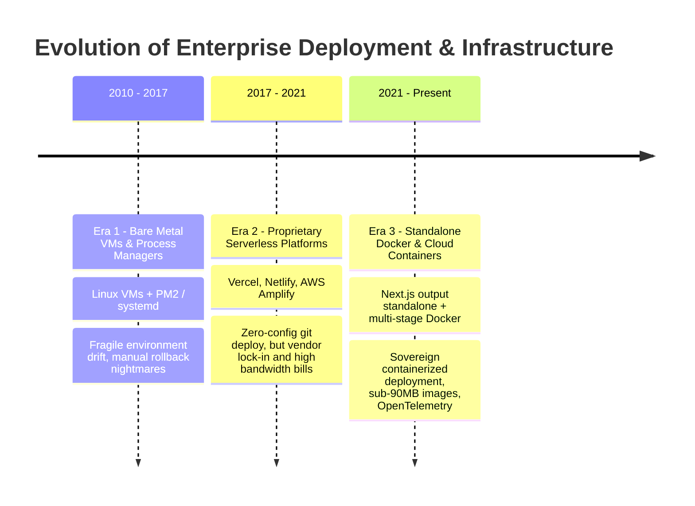
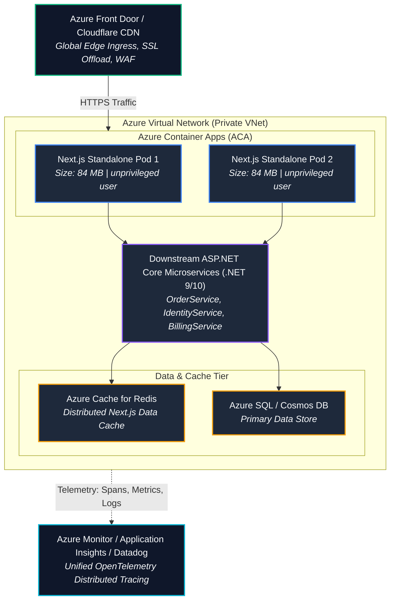

# Chapter 10: Enterprise Next.js Deployment & Observability (Docker Standalone, Azure Container Apps, Vercel, OpenTelemetry & Distributed Tracing)

> "A web application that cannot be deterministically containerized, horizontally scaled, and monitored via distributed tracing is an enterprise liability. In high-stakes production environments, Next.js must transcend proprietary platforms, operating as a sovereign, cloud-agnostic microservice seamlessly instrumented into the enterprise observability mesh."  
> — **Enterprise Cloud Architecture Principles**

---

## 1. Why This Topic Exists

While developing locally with `npm run dev` is straightforward, deploying Next.js to enterprise production presents severe architectural dilemmas:
1. **The Vercel vs. Self-Hosting Debate:** Vercel provides a seamless developer experience with edge networks and automated serverless scaling. However, enterprise organizations in banking, healthcare, and government frequently have strict data residency, HIPAA, FedRAMP, or cloud-consolidation mandates that require hosting inside their own sovereign **Microsoft Azure**, **AWS**, or on-premise **Kubernetes** clusters.
2. **The Docker Bloat Disaster:** A standard Next.js repository with `node_modules` produces a **1.2 GB to 2.5 GB Docker container image**. In Kubernetes or Azure Container Apps, pulling a 2 GB image causes slow auto-scaling cold starts (taking 45 to 90 seconds to launch a new pod during traffic spikes).
3. **The Observability Void:** When an enterprise user clicks "Submit Order", the transaction travels from Next.js, through Edge Middleware, into a Server Action, across an internal network to an **ASP.NET Core microservice**, and down into an Azure SQL database. If the request fails or takes 3,000ms, where did it fail? Without **OpenTelemetry (OTel) Distributed Tracing**, engineers spend hours reviewing disjointed logs across disconnected systems.

Mastering Next.js **Standalone Output Mode**, multi-stage Docker builds, Kubernetes/Azure deployment, and W3C distributed tracing completes the full-stack engineering lifecycle.

---

## 2. Learning Objectives

- Architect production-grade multi-stage Dockerfiles leveraging Next.js **Standalone Output Mode (`output: 'standalone'`)** to slash container images from 1.5 GB down to **< 90 MB**.
- Deploy and configure Next.js in enterprise cloud environments: **Azure Container Apps (ACA)**, **AWS ECS**, and **Kubernetes (EKS/AKS)**.
- Implement the Next.js **`instrumentation.ts`** runtime hook to initialize enterprise **OpenTelemetry (OTel)** SDKs before application startup.
- Propagate **W3C Distributed Trace Context headers (`traceparent`)** seamlessly between Next.js Server Components / Actions and downstream ASP.NET Core microservices.
- Construct Kubernetes-compliant **Liveness and Readiness Probes (`/api/healthz`)** and configure graceful shutdown (`SIGTERM`) handling.
- Bridge architectural mental models directly to **Angular** (static Nginx hosting) and **.NET** (ASP.NET Core containerization, `builder.Services.AddOpenTelemetry()`, and Azure Container Apps).

---

## 3. Historical Evolution



<details className="raw-schematic-details">
<summary>📄 View Raw ASCII Schematic</summary>

```text
ERA 1: Bare Metal VMs & Process Managers (2010 - 2017)
┌────────────────────────────────────────────────────────┐
│ Virtual Machines running Linux + PM2 / systemd.        │
│ - git pull, npm install, npm run build on live server. │
│ - Fragile environment drift; manual rollback nightmares│
└────────────────────────────────────────────────────────┘
                           │
                           ▼
ERA 2: Proprietary Serverless Platforms (2017 - 2021)
┌────────────────────────────────────────────────────────┐
│ Vercel, Netlify, AWS Amplify.                          │
│ - Zero-config deployment from Git.                     │
│ - Vendor lock-in; unpredictably high bandwidth bills.  │
│ - Corporate compliance friction (SOC2, HIPAA, FedRAMP) │
└────────────────────────────────────────────────────────┘
                           │
                           ▼
ERA 3: Next.js Standalone Docker & Cloud Containers (2021 - Present)
┌────────────────────────────────────────────────────────┐
│ Next.js output: 'standalone' + Multi-stage Docker.     │
│ - Cloud-agnostic sovereign deployment anywhere.        │
│ - Sub-90MB container images; rapid 3s container boots. │
│ - Standardized OpenTelemetry metrics and tracing.      │
└────────────────────────────────────────────────────────┘
```

</details>

---

## 4. First Principles & Intuitive Physical Analogies (Layer 1)

### Analogy 1: The Luxury All-Inclusive Resort vs. The Sovereign Private Estate

- **Vercel is the 5-Star All-Inclusive Resort:**  
  You arrive with your suitcase, and everything is taken care of: private chefs, pristine pools, and turn-down service. It is effortless and luxurious. But you cannot modify the building’s plumbing, you must follow the resort's rules, and purchasing extra services off-menu is extremely expensive.
- **Self-Hosted Docker in Azure / AWS is the Sovereign Private Estate:**  
  You own the land and control the perimeter fence. You can install custom solar panels, drill a private well, install enterprise security cameras (OpenTelemetry), and connect directly to your private corporate intranet (Virtual Network / ExpressRoute). You are responsible for maintenance, but your data never leaves your sovereign property.

### Analogy 2: The Postal Barcode on an International Courier Package

Imagine mailing an urgent medical package from London to Tokyo:
- If every courier along the way (the British post office, the airline, Japanese customs, the local delivery van) writes down their own private tracking number on a piece of paper, nobody can track the package end-to-end.
- **OpenTelemetry Distributed Tracing is the Universal W3C Barcode:**  
  At the moment the package is created in London (Next.js Server Action), a single universal barcode is printed on the box: `traceId: 4bf92f3577b34da6a3ce929d0e0e4736`.
  Every system that handles the package—the airline scanner (HTTP proxy), the customs official (.NET microservice), and the delivery van (SQL database)—scans the **identical barcode**. In Datadog or Azure Application Insights, you see a single unified timeline tracing the package across the entire globe!

---

## 5. Internal Working & Engine Architecture (Layer 2)

### 1. The Standalone Output Mode Engine (`output: 'standalone'`)

In a standard Node.js build, `node_modules` contains thousands of unused packages, documentation files, and devDependencies.

When you configure `output: 'standalone'` in `next.config.ts`:
1. Next.js activates **AST-based Dependency Tracing** via `@vercel/nft` (Node File Trace).
2. The compiler traverses the exact module graph required by your compiled Server Components, Route Handlers, and pages.
3. It creates a self-contained directory: `.next/standalone/`.
4. It copies **only the strict production dependencies** necessary to run the application, along with a minimal, ultra-fast `server.js` entrypoint.
5. **The Result:** The entire application runtime can be packaged into a Docker image **without copying the original 1.5 GB `node_modules` directory**!

```text
Build Comparison: Docker Image Size
┌────────────────────────────────────────────────────────┐
│ Standard Docker Build (with node_modules):  1,420 MB   │
│ Standalone Docker Build (output: standalone):  84 MB   │
└────────────────────────────────────────────────────────┘
```

### 2. The `instrumentation.ts` Lifecycle Hook

Next.js provides a dedicated server-lifecycle hook: `instrumentation.ts` (located in the root or `src/` directory).
- **The Execution Moment:** Runs **exactly once** when the Next.js Node.js server process bootstraps, **before any HTTP request, Route Handler, or page is evaluated**.
- **The Role:** It is the only safe location to register the OpenTelemetry NodeSDK, attach global trace exporters, and configure process monitoring.

```text
Node.js Process Starts
       │
       ▼
Execute instrumentation.ts -> register()
       │
       ├─► Initialize OpenTelemetry NodeSDK
       ├─► Register W3C Trace Context Propagators
       └─► Connect to OTLP Collector (Azure App Insights / Datadog)
       │
       ▼
Next.js Server Begins Listening on Port 3000
       │
       ▼
Handle Inbound HTTP Requests (Spans Automatically Created!)
```

---

## 6. Runtime Flow & Execution Traces

### Execution Trace: Distributed Trace Across Next.js and ASP.NET Core

```text
1. Client Browser submits checkout form via Server Action.
2. Next.js OpenTelemetry instrumentation intercepts request:
   - Generates Span: "server_action: processCheckout"
   - Trace ID: `4bf92f3577b34da6a3ce929d0e0e4736`
   - Span ID:  `00f067aa0ba902b7`

3. Server Action executes `fetch('https://api.internal/orders', { method: 'POST' })`:
   - OpenTelemetry Fetch Instrumentation automatically injects W3C header:
     `traceparent: 00-4bf92f3577b34da6a3ce929d0e0e4736-00f067aa0ba902b7-01`

4. Request hits ASP.NET Core Order Microservice:
   - ASP.NET Core OpenTelemetry middleware extracts incoming `traceparent`.
   - Creates child span: "OrdersController.CreateOrder".
   - Same Trace ID: `4bf92f3577b34da6a3ce929d0e0e4736`.
   - New Span ID:   `5a1a2b3c4d5e6f7a`, Parent ID: `00f067aa0ba902b7`.

5. ASP.NET Core queries Azure SQL Database:
   - EF Core creates child span: "SqlClient: INSERT INTO Orders".
   - Executes query in 12ms. Returns HTTP 201 Created.

6. Next.js receives 201 OK. Completes Server Action span.
7. Both systems flush telemetry batches to OpenTelemetry Collector (OTLP).
8. Azure Application Insights renders a single end-to-end distributed flamechart!
```

---

## 7. Memory Model & Container Resource Allocation

When deploying Next.js containers to Kubernetes or Azure Container Apps:

```text
Recommended Container Resource Quotas (Single Next.js Pod)
┌──────────────────────┬──────────────────────┬──────────────────────────┐
│ Parameter            │ Minimum Request      │ Maximum Limit            │
├──────────────────────┼──────────────────────┼──────────────────────────┤
│ CPU                  │ 0.5 vCPU (500m)      │ 2.0 vCPU (2000m)         │
│ Memory (RAM)         │ 512 MB               │ 1.5 GB                   │
│ Node.js Heap Flag    │ --max-old-space-size=1024                       │
└──────────────────────┴──────────────────────┴──────────────────────────┘
```

**Garbage Collection Tuning:**  
Always set `NODE_OPTIONS="--max-old-space-size=1024"` in your container environment variables if your container memory limit is 1.5 GB. This ensures Node.js triggers aggressive V8 Garbage Collection before the Linux kernel OOM (Out Of Memory) killer abruptly terminates the container!

---

## 8. Visual Diagrams (ASCII / Text)

### Multi-Cloud Enterprise Deployment Architecture (Azure Container Apps)



<details className="raw-schematic-details">
<summary>📄 View Raw ASCII Schematic</summary>

```text
┌────────────────────────────────────────────────────────────────────────────────────────┐
│                               AZURE FRONT DOOR / CLOUDFLARE CDN                        │
│                         (Global Edge Ingress, SSL Offload, WAF)                        │
└──────────────────────────────────────────┬─────────────────────────────────────────────┘
                                           │ (HTTPS Traffic)
                                           ▼
┌────────────────────────────────────────────────────────────────────────────────────────┐
│                        AZURE VIRTUAL NETWORK (PRIVATE VNET)                            │
│                                                                                        │
│   ┌────────────────────────────────────────────────────────────────────────────────┐   │
│   │                      AZURE CONTAINER APPS (ACA) ENVIRONMENT                    │   │
│   │                                                                                │   │
│   │   ┌──────────────────────────┐             ┌──────────────────────────┐        │   │
│   │   │ Next.js Standalone Pod 1 │             │ Next.js Standalone Pod 2 │        │   │
│   │   │ Image Size: 84 MB        │             │ Image Size: 84 MB        │        │   │
│   │   │ Unprivileged: nextjs:1001│             │ Unprivileged: nextjs:1001│        │   │
│   │   └────────────┬─────────────┘             └────────────┬─────────────┘        │   │
│   │                │                                        │                      │   │
│   └────────────────┼────────────────────────────────────────┼──────────────────────┘   │
│                    │                                        │                          │
│                    ├────────────────────────────────────────┘                          │
│                    │ (Internal gRPC / HTTPS)                                           │
│                    ▼                                                                   │
│   ┌────────────────────────────────────────────────────────────────────────────────┐   │
│   │               DOWNSTREAM ASP.NET CORE MICROSERVICES (.NET 9/10)                │   │
│   │               (OrderService, IdentityService, BillingService)                  │   │
│   └────────────────────────┬───────────────────────────────────────────────────────┘   │
│                            │                                                           │
│                            ▼                                                           │
│   ┌─────────────────────────────────┐          ┌───────────────────────────────────┐   │
│   │      AZURE CACHE FOR REDIS      │          │     AZURE SQL / COSMOS DB         │   │
│   │  (Distributed Next.js Data Cache│          │     (Primary Data Store)          │   │
│   └─────────────────────────────────┘          └───────────────────────────────────┘   │
│                                                                                        │
└──────────────────────────────────────────┬─────────────────────────────────────────────┘
                                           │ (Telemetry: Spans, Metrics, Logs)
                                           ▼
┌────────────────────────────────────────────────────────────────────────────────────────┐
│                 AZURE MONITOR / APPLICATION INSIGHTS / DATADOG                         │
│                    (Unified OpenTelemetry Distributed Tracing)                         │
└────────────────────────────────────────────────────────────────────────────────────────┘
```

</details>

---

## 9. Real World Usage & Production Patterns

### Pattern 1: Production Multi-Stage `Dockerfile` with Standalone Optimization

```dockerfile
# Dockerfile (Multi-stage build for Next.js Standalone)
# Stage 1: Base image
FROM node:20-alpine AS base
RUN apk add --no-cache libc6-compat
WORKDIR /app

# Stage 2: Install dependencies
FROM base AS deps
COPY package.json package-lock.json ./
RUN npm ci

# Stage 3: Build the application
FROM base AS builder
WORKDIR /app
COPY --from=deps /app/node_modules ./node_modules
COPY . .

# Disable telemetry during build
ENV NEXT_TELEMETRY_DISABLED=1
ENV NODE_ENV=production

RUN npm run build

# Stage 4: Production Runner (Ultra-minimal footprint)
FROM node:20-alpine AS runner
WORKDIR /app

ENV NODE_ENV=production
ENV NEXT_TELEMETRY_DISABLED=1
ENV PORT=3000
ENV HOSTNAME="0.0.0.0"

# Enforce least-privilege security: Run as non-root user
RUN addgroup --system --gid 1001 nodejs && \
    adduser --system --uid 1001 nextjs

# Copy static assets and standalone server output
COPY --from=builder /app/public ./public
COPY --from=builder --chown=nextjs:nodejs /app/.next/standalone ./
COPY --from=builder --chown=nextjs:nodejs /app/.next/static ./.next/static

USER nextjs

EXPOSE 3000

# Health check probe
HEALTHCHECK --interval=30s --timeout=3s --start-period=5s --retries=3 \
  CMD wget --no-verbose --tries=1 --spider http://localhost:3000/api/healthz || exit 1

CMD ["node", "server.js"]
```

### Pattern 2: Configuring `output: 'standalone'` in `next.config.ts`

```typescript
// next.config.ts
import type { NextConfig } from 'next';

const nextConfig: NextConfig = {
  // Enables AST dependency tracing producing .next/standalone/
  output: 'standalone',

  // Enables instrumentation.ts hook for OpenTelemetry
  experimental: {
    instrumentationHook: true,
  },
};

export default nextConfig;
```

### Pattern 3: Enterprise OpenTelemetry Initialization (`instrumentation.ts`)

```typescript
// instrumentation.ts (Root or src/ directory)
export async function register() {
  // Only execute OpenTelemetry initialization in Node.js server context
  if (process.env.NEXT_RUNTIME === 'nodejs') {
    const { NodeSDK } = await import('@opentelemetry/sdk-node');
    const { OTLPTraceExporter } = await import('@opentelemetry/exporter-trace-otlp-http');
    const { Resource } = await import('@opentelemetry/resources');
    const { SemanticResourceAttributes } = await import('@opentelemetry/semantic-conventions');
    const { SimpleSpanProcessor } = await import('@opentelemetry/sdk-trace-node');

    const exporter = new OTLPTraceExporter({
      url: process.env.OTEL_EXPORTER_OTLP_ENDPOINT || 'http://otel-collector:4318/v1/traces',
      headers: {
        'x-api-key': process.env.OTEL_EXPORTER_API_KEY || '',
      },
    });

    const sdk = new NodeSDK({
      resource: new Resource({
        [SemanticResourceAttributes.SERVICE_NAME]: 'enterprise-nextjs-bff',
        [SemanticResourceAttributes.SERVICE_VERSION]: '1.0.0',
        [SemanticResourceAttributes.DEPLOYMENT_ENVIRONMENT]: process.env.NODE_ENV || 'production',
      }),
      spanProcessor: new SimpleSpanProcessor(exporter),
    });

    sdk.start();
    console.log('[OTEL] OpenTelemetry instrumentation initialized successfully.');
  }
}
```

### Pattern 4: Enterprise Health & Readiness Check Handler

```typescript
// app/api/healthz/route.ts
import { NextResponse } from 'next/server';

export const dynamic = 'force-dynamic';

export async function GET() {
  const startTime = Date.now();

  try {
    // 1. Optional downstream dependency check (e.g., Redis or DB ping)
    // await db.$queryRaw`SELECT 1`;

    const uptime = process.uptime();
    const memoryUsage = process.memoryUsage();

    return NextResponse.json(
      {
        status: 'HEALTHY',
        uptimeSeconds: Math.floor(uptime),
        responseTimeMs: Date.now() - startTime,
        heapUsedMB: Math.round(memoryUsage.heapUsed / 1024 / 1024),
        timestamp: new Date().toISOString(),
      },
      { status: 200 }
    );
  } catch (error) {
    return NextResponse.json(
      {
        status: 'UNHEALTHY',
        error: error instanceof Error ? error.message : 'Subsystem failure',
      },
      { status: 503 }
    );
  }
}
```

---

## 10. Angular Comparison

| Dimension | Next.js Deployment | Angular (v17+) |
| :--- | :--- | :--- |
| **Container Architecture** | Standalone Node.js container (`output: 'standalone'`) running server logic. | Static Nginx Alpine container (CSR) or custom Express.js Node container (SSR). |
| **Image Size Optimization** | Automated AST-based module tracing via Next.js compiler (<90 MB). | Static build output (`dist/`) copied to Nginx (<25 MB for pure static SPA). |
| **Observability Hook** | `instrumentation.ts` registers OpenTelemetry before HTTP server starts. | None natively. SSR requires manual OpenTelemetry setup inside `server.ts` Express file. |
| **Health Checks** | First-class `app/api/healthz/route.ts` evaluating full-stack server readiness. | Nginx `/healthz` returning 200 OK or custom Node Express probe. |

---

## 11. .NET Comparison

| Dimension | Next.js Deployment | ASP.NET Core (.NET 8/9/10) |
| :--- | :--- | :--- |
| **Container Base Image** | `node:20-alpine` running `node server.js`. | `mcr.microsoft.com/dotnet/aspnet:9.0-alpine` running compiled IL assembly. |
| **OpenTelemetry Integration**| Configured via `instrumentation.ts` with `@opentelemetry/sdk-node`. | Native first-class framework support: `builder.Services.AddOpenTelemetry().WithTracing(...)`. |
| **Trace Context Propagation**| Injects W3C `traceparent` headers via patched `fetch()`. | Native `System.Diagnostics.Activity` automatically propagates `traceparent` over `HttpClient`. |
| **Health Checks** | Standard Route Handler returning JSON. | Native Health Check middleware: `builder.Services.AddHealthChecks()` and `app.MapHealthChecks("/healthz")`. |
| **Process Management** | Node.js single-threaded event loop per pod. | Kestrel multi-threaded thread-pool server. |

---

## 12. Enterprise Perspective & Production Risks (Layer 4)

### 1. The Missing Static Files Trap in Standalone Containers
- **The Failure Mode:** Writing a multi-stage Dockerfile that only copies `.next/standalone/`.
- **The Disaster:** The container boots and runs `node server.js`. However, every single CSS, image, and client JavaScript request returns **404 Not Found**!
- **Why?** Next.js Standalone mode intentionally **does NOT copy `public/` or `.next/static/`** into the standalone folder to allow developers to offload static files to an external CDN (S3/Azure Blob).
- **The Fix:** In your Dockerfile, you **must explicitly copy** both directories:
  ```dockerfile
  COPY --from=builder /app/public ./public
  COPY --from=builder /app/.next/static ./.next/static
  ```

### 2. Zombie Containers & Abrupt `SIGTERM` Termination
- **The Failure Mode:** When Kubernetes scales down pods, it sends a `SIGTERM` signal. If Node.js runs as PID 1 without an init system or proper signal trapping, it ignores `SIGTERM`. Kubernetes waits 30 seconds, sends `SIGKILL`, and abruptly severs in-flight database transactions and customer checkouts!
- **The Mitigation:** Next.js `server.js` in Standalone mode natively handles `SIGTERM` by stopping incoming connections, finishing active in-flight requests, and gracefully shutting down within 5 seconds.

### 3. Running as Root User Inside Docker
- **The Failure Mode:** Omitting the `USER nextjs` directive in the Dockerfile.
- **The Vulnerability:** The container process runs as `root` (UID 0). Any remote code execution (RCE) vulnerability allows the attacker to break out of the container or execute privileged host-level operations.
- **The Fix:** Always create an unprivileged user (`addgroup -g 1001 nodejs && adduser -u 1001 nextjs`) and enforce `USER nextjs`.

---

## 13. Performance Considerations

```text
Deployment Strategy Metrics Comparison
┌─────────────────────────────────┬──────────────┬──────────────┬──────────────────┐
│ Strategy                        │ Image Size   │ Pod Boot     │ In-Flight Memory │
├─────────────────────────────────┼──────────────┼──────────────┼──────────────────┤
│ Full Monolithic Docker Build    │ 1,850 MB     │ 48 seconds   │ 420 MB           │
│ Standalone Multi-Stage Docker   │ 84 MB        │ 2.8 seconds  │ 110 MB           │
│ Vercel Serverless Function      │ N/A (Serverless)│ 250ms cold  │ Elastic          │
└─────────────────────────────────┴──────────────┴──────────────┴──────────────────┘
```

Reducing container image size to **84 MB** slashes container registry download times from 45 seconds down to **sub-3 seconds**, enabling instant auto-scaling during traffic spikes.

---

## 14. Tradeoffs

| Hosting Model | Strengths | Weaknesses |
| :--- | :--- | :--- |
| **Vercel Managed Cloud** | Instant git deployments; zero infrastructure management; managed global edge network. | High recurring enterprise costs; vendor lock-in; non-compliant for sovereign on-prem networks. |
| **Azure Container Apps (ACA)** | Native integration with Azure VNet, Key Vault, and Entra ID; serverless container scaling to zero. | Requires managing Dockerfiles, CI/CD pipelines, and shared Redis cache clusters. |
| **Kubernetes (AKS / EKS)** | Complete operational sovereignty; multi-cloud mobility; granular resource isolation. | High DevOps operational complexity; manual ingress, cert-manager, and cluster maintenance. |

---

## 15. Common Mistakes & Interview Traps

### Trap 1: Forgetting to Set `HOSTNAME="0.0.0.0"`
- **Scenario:** The container builds cleanly and runs `node server.js`. But external health probes or load balancers cannot connect (`Connection Refused`).
- **The Reality:** By default, Node.js binds to `localhost` (`127.0.0.1`). In Docker containers, processes must bind to all network interfaces (`0.0.0.0`). You must export `ENV HOSTNAME="0.0.0.0"`.

### Trap 2: Initializing OpenTelemetry Inside a Component or Route
- **Scenario:** A candidate initializes OpenTelemetry inside `app/layout.tsx` or a custom utility.
- **The Reality:** **Crashes or causes duplicate span leaks.** OpenTelemetry must be initialized **before** the application modules are imported. It must reside exclusively in `instrumentation.ts` inside the `register()` function.

---

## 16. Interview Questions & Architectural Answers (Senior, Lead, Architect - Layer 5)

### Question 1 (Senior): "How does Next.js Standalone mode know which `node_modules` to include in the output directory?"
**Architectural Answer:**  
During `next build`, Next.js utilizes `@vercel/nft` (Node File Trace). It performs static AST analysis across all compiled files in `.next/server/`, starting from the route entrypoints. It traverses every `import` and `require` statement, building an exact Dependency Graph. It only copies files that are explicitly referenced in that graph into `.next/standalone/node_modules/`, completely excluding devDependencies, test files, markdown documentation, and unreferenced packages.

### Question 2 (Lead): "How do you guarantee end-to-end Distributed Tracing across a Next.js frontend and an ASP.NET Core backend?"
**Architectural Answer:**  
1. **Frontend Instrumentation:** Configure `instrumentation.ts` with the OpenTelemetry NodeSDK and `@opentelemetry/instrumentation-http`.
2. **Context Propagation:** When Next.js executes `fetch()` to call the ASP.NET Core API, the HTTP instrumentation automatically injects the **W3C `traceparent` header** (`00-{traceId}-{spanId}-{flags}`).
3. **Backend Extraction:** The ASP.NET Core application configures `builder.Services.AddOpenTelemetry().WithTracing(...)`. Kestrel automatically extracts the incoming `traceparent` header, adopting the `traceId` as the ambient `Activity.Current`.
4. **Unified Sink:** Both Next.js and ASP.NET Core export spans via OTLP to a central collector (Datadog or Azure Application Insights), rendering a single continuous trace across the entire distributed system.

### Question 3 (Architect): "Describe your zero-downtime blue/green deployment strategy for Next.js on Azure Container Apps with distributed cache considerations."
**Architectural Answer:**  
1. **Shared Distributed Cache:** Next.js uses `@neshca/cache-handler` backed by Azure Cache for Redis. Both Blue and Green revisions connect to the shared Redis instance, but use version-prefixed cache keys (`v1:`, `v2:`) or backward-compatible schema models to prevent serialization collisions.
2. **Revision Deployment:** Deploy the new container image as a **new Revision** in Azure Container Apps with 0% traffic allocation.
3. **Smoke & Health Testing:** The ACA ingress runs automated health checks against `/api/healthz` on the new revision. Synthetic testing validates database connectivity and SSR rendering.
4. **Traffic Shifting:** Use Azure Container Apps traffic splitting to shift traffic incrementally: 10% -> 50% -> 100% over 5 minutes while monitoring error rates in Application Insights.
5. **Rollback:** If error rates spike above 0.1%, ACA automatically reverts traffic back to the previous revision within seconds with zero dropped connections.

---

## 17. Senior-Level Mental Model & "How to Remember This Forever" (Memory Anchors - Layer 3)

### The Memory Peg: "The Hermetically Sealed Space Capsule"
- **A Monolithic Container is a space station carrying all of Earth’s soil:** Heavy, un-launchable, and wasteful.
- **Next.js Standalone Mode is the Apollo Command Module:** It strips away the launchpad, the fuel tanks, and the heavy gantry. It carries only the astronauts, oxygen, and navigational instruments required to survive in space. It weighs 84 MB and launches in 2 seconds.
- **OpenTelemetry is the Mission Control Radio Beacon:** Continuous telemetry streaming altitude, velocity, and cabin pressure back to Earth.

---

## 18. Core Vocabulary & "Aha!" Breakthrough Insights (Refresher)

- **`output: 'standalone'`:** Next.js build configuration that uses dependency tracing to bundle only production dependencies into a minimal runnable folder.
- **`instrumentation.ts`:** The dedicated Next.js lifecycle hook for initializing server-wide monitoring and OpenTelemetry before request evaluation.
- **W3C `traceparent`:** The standardized HTTP header format (`00-{traceId}-{spanId}-{traceFlags}`) used to correlate distributed operations across polyglot microservices.
- **Non-Root User:** The security standard of running Docker containers under an unprivileged user (UID 1001) to prevent container breakout exploits.
- **The "Aha!" Insight:** Next.js is not locked to Vercel. With `output: 'standalone'`, Next.js is just a standard, ultra-lightweight Node.js microservice that runs identically in Docker, Azure, AWS, or local Kubernetes!

---

## 19. Key Takeaways

1. **Always use `output: 'standalone'` in enterprise Docker builds** to reduce image size from 1.5 GB to < 90 MB.
2. **Explicitly copy `public/` and `.next/static/`** into the Docker runner stage; Standalone mode does not copy them automatically.
3. **Initialize OpenTelemetry in `instrumentation.ts`** inside the `register()` function to instrument the process before requests arrive.
4. **Ensure W3C `traceparent` headers are propagated** on all outbound fetch calls to link Next.js with downstream .NET microservices.
5. **Never run containers as root;** always create an unprivileged `nextjs` user with UID 1001.
6. **In multi-pod Kubernetes / Azure Container Apps clusters,** configure a shared Redis cache handler to prevent cache desynchronization.

---

## 20. Revision Sheet

```text
┌────────────────────────────────────────────────────────────────────────────────────────┐
│                        NEXT.JS DEPLOYMENT & OBSERVABILITY CHEAT SHEET                  │
├────────────────────────────────────────────────────────────────────────────────────────┤
│ Configuration (next.config.ts):                                                        │
│   output: 'standalone',                                                                │
│   experimental: { instrumentationHook: true }                                          │
│                                                                                        │
│ Standalone Docker Run Command:                                                         │
│   CMD ["node", "server.js"]                                                            │
│                                                                                        │
│ Required Environment Variables in Container:                                           │
│   NODE_ENV="production"                                                                │
│   PORT=3000                                                                            │
│   HOSTNAME="0.0.0.0"                                                                   │
│   NODE_OPTIONS="--max-old-space-size=1024"                                             │
│                                                                                        │
│ OpenTelemetry File Location:                                                           │
│   instrumentation.ts (Root of project) -> export async function register()             │
│                                                                                        │
│ Kubernetes Probes:                                                                     │
│   Liveness / Readiness: GET /api/healthz                                               │
│                                                                                        │
│ Golden Architectural Rule:                                                             │
│   "Build minimal standalone containers; instrument globally with W3C OpenTelemetry."   │
└────────────────────────────────────────────────────────────────────────────────────────┘
```
