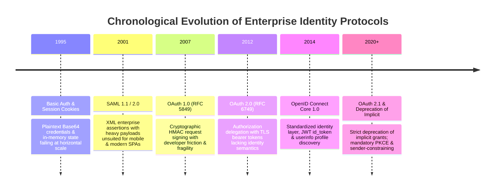
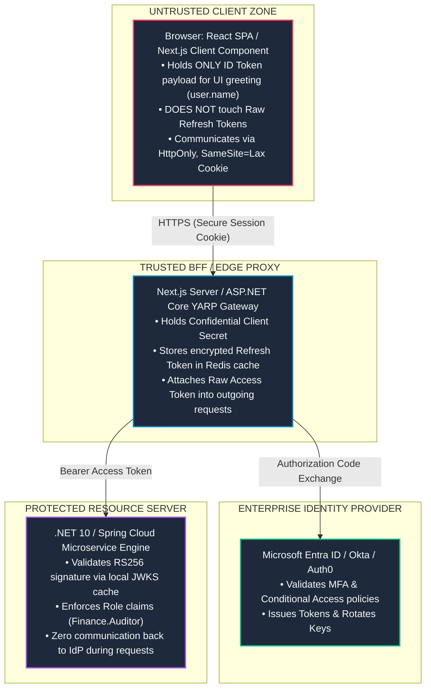

# Topic 01: Enterprise Authentication & Identity Landscape (OAuth 2.0, OIDC & Identity Providers)

## 1. Why This Topic Exists
In consumer web development, authentication is often trivialized as submitting a username and password to an endpoint and storing a user ID in local state. In modern enterprise software engineering, this naive model is an existential architectural failure. Enterprise applications operate within zero-trust perimeter models, multi-tenant software-as-a-service (SaaS) environments, distributed microservices, and federated identity ecosystems spanning Microsoft Entra ID (Azure AD), Okta, Ping Identity, and Google Workspace.

Frontend architects must design clients that never handle raw user credentials, delegate identity assertions to standards-compliant OpenID Connect (OIDC) providers, and handle cryptographically verifiable, ephemeral access tokens without exposing enterprise systems to credential harvesting or token replay attacks. Understanding the cryptographic foundation, protocol choreography, and trust boundaries of OAuth 2.0 and OIDC is essential for any senior engineer designing secure frontends in corporate and cloud-native topologies.

---

## 2. Learning Objectives
By mastering this chapter, you will be able to:
- Distinguish between **Authentication** (Who you are - OIDC) and **Authorization** (What you can access - OAuth 2.0).
- Trace the architectural topology between User Agents, Relying Parties (Clients), Identity Providers (Authorization Servers), and Protected Resource Servers.
- Dissect the structure, claims, signatures, and cryptographic validation of JSON Web Tokens (ID Tokens vs Access Tokens vs Refresh Tokens).
- Understand public vs confidential client trust boundaries in Single Page Applications (SPAs) versus Full-Stack (Next.js/BFF) environments.
- Evaluate enterprise federation topologies: SAML 2.0 to OIDC bridging, Multi-Tenant directory isolation, and Scim user provisioning.
- Mitigate token interception risks, signature stripping attacks, and asymmetric key caching pitfalls (`jwks_uri`).

---

## 3. Historical Evolution



<details>
<summary>📄 View Raw ASCII Schematic</summary>

```text
+--------------------------------------------------------------------------------------------------+
|                                    CHRONOLOGICAL EVOLUTION                                       |
+--------------------------------------------------------------------------------------------------+
| 1995 - Basic Auth & Monolithic Session Cookies: User credentials transmitted in plaintext base64;|
|        server stores stateful sessions in local memory. Breaks completely under horizontal scale.|
|                                                                                                  |
| 2001 - SAML 1.1 / 2.0: XML-based enterprise federation standard. Powerful enterprise assertions,  |
|        but massive payloads and complex XML signatures unsuited for mobile and modern web SPAs. |
|                                                                                                  |
| 2007 - OAuth 1.0 (RFC 5849): Cryptographic request signing without sharing passwords.           |
|        Notoriously fragile HMAC calculation requirements caused universal developer friction.    |
|                                                                                                  |
| 2012 - OAuth 2.0 Framework (RFC 6749): Authorization delegation protocol. Replaced request      |
|        signing with transport layer TLS security and bearer tokens. Lacked identity semantics.  |
|                                                                                                  |
| 2014 - OpenID Connect Core 1.0 (OIDC): Identity layer built on top of OAuth 2.0. Standardized   |
|        user profile discovery, `id_token` (JWT format), and userinfo endpoints.                  |
|                                                                                                  |
| 2020+ - OAuth 2.1 & Deprecation of Implicit Flow: Strict deprecation of implicit grants for SPAs;|
|         universal mandate for Authorization Code Flow with PKCE and token sender-constraining.   |
+--------------------------------------------------------------------------------------------------+
```

</details>

---

## 4. First Principles & Intuitive Physical Analogies (Layer 1)

### Analogy 1: The Valet Key vs The Driver's License
Imagine visiting an upscale hotel:
- **Authentication (OIDC / ID Token):** You walk up to the hotel front desk and present your government-issued **Passport or Driver's License**. The concierge inspects the holograms, verifies your photo and legal name, and confirms your identity: *"Welcome, Adarsh."* This document is meant strictly for the front desk to confirm **who you are**. You do **not** hand your passport to the valet to park your car.
- **Authorization (OAuth 2.0 / Access Token):** The hotel gives you an electronic **Valet Keycard**. The valet keycard does not have your photo, social security number, or home address on it. Instead, it contains cryptographic permissions (Scopes): it can start the engine and lock the doors, but it cannot open the trunk or glove compartment. When the parking attendant approaches the garage barrier (the API Resource Server), the barrier inspects the valet keycard's permissions and raises the gate.

### Analogy 2: The Notary Public and Cryptographic Wax Signets
When an ancient king issued an official royal decree:
1. The king stamped his unique engraved signet ring into hot red wax at the bottom of the parchment.
2. Anyone across the kingdom who possessed an authentic impression of the king's seal could verify that the decree was genuine without riding 500 miles back to the castle to ask the king.
3. If a rogue messenger changed even a single word in the decree, the physical wax seal broke.
In modern web identity:
- The **Identity Provider (Authorization Server)** is the King.
- The **Private Signing Key** is the Royal Signet Ring.
- The **JSON Web Signature (JWS)** is the Red Wax Seal.
- The **Public Key (`jwks_uri`)** is the distributed impression used by Resource Servers to verify authenticity locally in 0 milliseconds without calling the auth server.

---

## 5. Internal Working & Engine Architecture (Layer 2)

### 1. The 4 Principal Actors in Enterprise Identity
Enterprise identity systems adhere strictly to the RFC 6749 architectural roles:

```
+-----------------------------------------------------------------------------+
|                                    ACTORS                                   |
+-----------------------------------------------------------------------------+
| 1. RESOURCE OWNER (End User)                                                |
|    - The corporate employee or end customer granting access to resources.   |
|                                                                             |
| 2. USER AGENT (Browser)                                                     |
|    - The client execution environment running the SPA or Next.js app.       |
|                                                                             |
| 3. AUTHORIZATION SERVER / OIDC PROVIDER (IdP)                               |
|    - Issues ID Tokens and Access Tokens (e.g. Entra ID, Okta, Keycloak).     |
|    - Hosts `.well-known/openid-configuration` and `jwks_uri`.                |
|                                                                             |
| 4. CLIENT / RELYING PARTY (RP)                                              |
|    - Public Client: Browser SPA (Angular/React) incapable of holding secret.|
|    - Confidential Client: Node/Next.js/ASP.NET Core backend holding secrets.|
|                                                                             |
| 5. RESOURCE SERVER (API Gateway / Microservice)                             |
|    - Validates JWT signatures and authorizes requests based on scopes/roles.|
+-----------------------------------------------------------------------------+
```

### 2. Anatomy of the Modern Token Family

```
+-----------------------------------------------------------------------------------------------+
|                                    TOKEN COMPARISON MATRIX                                    |
+-------------------+-------------------+-----------------------+-------------------------------+
| Attribute         | ID Token (OIDC)   | Access Token (OAuth2) | Refresh Token (OAuth2)        |
+-------------------+-------------------+-----------------------+-------------------------------+
| Primary Purpose   | Identity assertion| Resource authorization| Acquire new access tokens     |
| Intended Audience | Client App (RP)   | Resource Server (API) | Authorization Server (IdP)    |
| Format            | Strictly JWT      | JWT or Opaque string  | Opaque cryptographically random|
| Consumption       | Decoded by UI     | Never decoded by UI;  | Sent only to `/token` endpoint|
|                   | for display       | forwarded in Bearer   |                               |
| Lifetime          | Short (15–60 min) | Short (5–15 min)      | Long (hours, days, or months) |
| Sensitive Claims  | `sub`, `email`,   | `aud`, `scp`, `roles`,| High risk; requires rotation  |
|                   | `name`, `amr`     | `tid`, `oid`          | and family revocation         |
+-------------------+-------------------+-----------------------+-------------------------------+
```

---

## 6. Runtime Flow & Execution Traces

### Protocol Trace: Modern OIDC Discovery & User Onboarding

```
Browser (React)              Next.js BFF / Reverse Proxy             Identity Provider (Entra / Okta)
      |                                  |                                          |
      | 1. Navigation to /login          |                                          |
      |--------------------------------->|                                          |
      |                                  | 2. Fetch OIDC Metadata Configuration     |
      |                                  |    GET /.well-known/openid-configuration |
      |                                  |----------------------------------------->|
      |                                  | 3. Returns Endpoints:                    |
      |                                  |    - authorization_endpoint              |
      |                                  |    - token_endpoint                      |
      |                                  |    - jwks_uri                            |
      |                                  |<-----------------------------------------|
      |                                  |                                          |
      | 4. Redirect 302 to IdP           |                                          |
      |    (with code_challenge, state)  |                                          |
      |<---------------------------------|                                          |
      |                                                                             |
      | 5. User Enters Corporate Credentials & MFA                                  |
      |---------------------------------------------------------------------------->|
      |                                                                             |
      | 6. Redirect 302 back to /api/auth/callback?code=AUTH_CODE&state=CSRF_STATE  |
      |<----------------------------------------------------------------------------|
      |                                                                             |
      | 7. Forward callback to BFF                                                  |
      |--------------------------------->|                                          |
      |                                  | 8. POST /token                           |
      |                                  |    (code, code_verifier, client_secret)  |
      |                                  |----------------------------------------->|
      |                                  | 9. Returns:                              |
      |                                  |    - id_token (JWT)                      |
      |                                  |    - access_token (JWT)                  |
      |                                  |    - refresh_token                       |
      |                                  |<-----------------------------------------|
      |                                  |                                          |
      | 10. Set Encrypted Session Cookie |                                          |
      |     (HttpOnly, Secure, Lax)      |                                          |
      |<---------------------------------|                                          |
```

---

## 7. Memory Model & Heap Layout

### 1. JSON Web Token (JWT) Decoupled Anatomy
A JWT consists of three base64url-encoded segments separated by periods (`.`):

```
+-----------------------------------------------------------------------------------------------+
| HEADER (Algorithm & Key ID)                                                                  |
| eyJhbGciOiJSUzI1NiIsImtpZCI6IjFhMmIzYyIsInR5cCI6IkpXVCJ9                                      |
| Decoded: { "alg": "RS256", "kid": "1a2b3c", "typ": "JWT" }                                    |
+-----------------------------------------------------------------------------------------------+
| PAYLOAD (Claims Set)                                                                          |
| eyJzdWIiOiIxMjM0NTYiLCJhdWQiOiJhcGk6Ly9mMSIsImlzcyI6Imh0dHBzOi8vbG9naW4uZXhhbXBsZS5jb20ifQ...  |
| Decoded:                                                                                      |
| {                                                                                             |
|   "iss": "https://login.microsoftonline.com/tenant-id/v2.0", // Issuer (Must match trusted IdP)|
|   "sub": "user_guid_9876",                                   // Subject (Immutable user ID)   |
|   "aud": "api://enterprise-finance-api",                     // Audience (Who token is for)   |
|   "exp": 1791244800,                                         // Expiration timestamp (Unix)   |
|   "nbf": 1791241200,                                         // Not Before timestamp (Unix)   |
|   "iat": 1791241200,                                         // Issued At timestamp (Unix)    |
|   "roles": ["Finance.Auditor", "Reports.Export"],            // Enterprise App Roles          |
|   "scp": "Reports.Read Reports.Write"                        // Delegated Scopes              |
| }                                                                                             |
+-----------------------------------------------------------------------------------------------+
| SIGNATURE (Cryptographic Seal)                                                                |
| SflKxwRJSMeKKF2QT4fwpMeJf36POk6yJV_adQssw5c...                                                |
| Computed as: RSASHA256(base64Url(Header) + "." + base64Url(Payload), PrivateKey)               |
+-----------------------------------------------------------------------------------------------+
```

### 2. JWKS Public Key Cache Memory Structure
Resource servers maintain an in-memory cache of JSON Web Key Sets (JWKS) to avoid network overhead during signature validation:

```
[V8 Heap Memory: JWKS Cache Engine]
├── jwksMap: Map<string, CryptoKey>
│   ├── Key: "1a2b3c"  ===> RS256 Public Key (Expiry: 24h, TTL checked)
│   └── Key: "9z8y7x"  ===> RS256 Public Key (Grace period key during IdP rotation)
└── Refresh Lock: Mutex (Prevents Thundering Herd when key rotation occurs)
```

---

## 8. Visual Diagrams (ASCII / Text)

### Enterprise Trust Boundaries & Token Partitioning



<details>
<summary>📄 View Raw ASCII Architecture Schematic</summary>

```text
+---------------------------------------------------------------------------------------------+
|                                    UNTRUSTED CLIENT ZONE                                    |
|                                                                                             |
|  [Browser: React SPA / Next.js Client Component]                                            |
|   - Holds ONLY ID Token payload (for UI greeting: user.name)                                |
|   - DOES NOT touch Raw Refresh Tokens                                                        |
|   - Communicates with BFF via HttpOnly, SameSite=Lax Session Cookie                          |
+---------------------------------------------------------------------------------------------+
                                       |
                                       | HTTPS (Secure Session Cookie)
                                       v
+---------------------------------------------------------------------------------------------+
|                                  TRUSTED BFF / EDGE PROXY                                   |
|                                                                                             |
|  [Next.js Server / ASP.NET Core YARP Gateway]                                               |
|   - Holds Confidential Client Secret                                                        |
|   - Stores encrypted Refresh Token in distributed server cache (Redis)                      |
|   - Attaches Raw Access Token into outgoing microservice requests                           |
+---------------------------------------------------------------------------------------------+
                      |                                       |
                      | Authorization Code Exchange           | Bearer Access Token
                      v                                       v
+-----------------------------------+   +-----------------------------------------------------+
|   ENTERPRISE IDENTITY PROVIDER    |   |             PROTECTED RESOURCE SERVER               |
|                                   |   |                                                     |
|  Microsoft Entra ID / Okta / Auth0|   |  .NET 10 / Spring Cloud Microservice Engine         |
|  - Validates MFA & Conditional    |   |  - Validates RS256 signature via local JWKS cache   |
|    Access policies                |   |  - Enforces Role claims ("Finance.Auditor")         |
|  - Issues Tokens & Rotates Keys   |   |  - Zero communication back to IdP during requests   |
+-----------------------------------+   +-----------------------------------------------------+
```

</details>

---

## 9. Real World Usage & Production Patterns

> 🧪 **Companion Interactive Lab:** [LabComponent.tsx](../../apps/portal/src/features/visualizers/topic-07-security/LabComponent.tsx) | Live in Portal: `topic-07-security`

### Pattern 1: Production JWT Claim Extraction & Expiration Sentinel

```typescript
export interface EnterpriseClaims {
  iss: string;
  sub: string;
  aud: string;
  exp: number;
  nbf?: number;
  iat: number;
  roles?: string[];
  scp?: string;
  email?: string;
  name?: string;
}

/**
 * Validates token structural format and extracts payload without cryptographic verification.
 * NOTE: Frontend decoding is purely for UI display/routing decisions.
 * Authoritative security MUST be enforced on the backend Resource Server!
 */
export function decodeJwtClaims<T = EnterpriseClaims>(token: string): T {
  if (!token || typeof token !== 'string') {
    throw new Error('Invalid token: Input must be a non-empty string');
  }

  const parts = token.split('.');
  if (parts.length !== 3) {
    throw new Error('Invalid JWT format: Token must contain exactly 3 segments');
  }

  try {
    const base64Url = parts[1];
    const base64 = base64Url.replace(/-/g, '+').replace(/_/g, '/');
    const jsonPayload = decodeURIComponent(
      atob(base64)
        .split('')
        .map((c) => '%' + ('00' + c.charCodeAt(0).toString(16)).slice(-2))
        .join('')
    );
    return JSON.parse(jsonPayload) as T;
  } catch (err) {
    throw new Error(`Failed to decode JWT payload: ${(err as Error).message}`);
  }
}

/**
 * Determines whether a token has expired, with a defensive 60-second clock skew buffer.
 */
export function isTokenExpired(token: string, clockSkewSeconds = 60): boolean {
  try {
    const claims = decodeJwtClaims(token);
    if (!claims.exp) return true;
    const currentTimeInSeconds = Math.floor(Date.now() / 1000);
    // Expire early by clockSkewSeconds to prevent in-flight network expiration
    return claims.exp - clockSkewSeconds <= currentTimeInSeconds;
  } catch {
    return true;
  }
}
```

### Pattern 2: Resilient OIDC Well-Known Discovery Resolver

```typescript
export interface OidcConfiguration {
  issuer: string;
  authorization_endpoint: string;
  token_endpoint: string;
  userinfo_endpoint: string;
  jwks_uri: string;
  response_types_supported: string[];
  id_token_signing_alg_values_supported: string[];
}

export class OidcDiscoveryClient {
  private static cache = new Map<string, { config: OidcConfiguration; expiresAt: number }>();
  private static CACHE_TTL_MS = 24 * 60 * 60 * 1000; // 24 hours

  public static async discover(issuerUrl: string): Promise<OidcConfiguration> {
    const normalizedIssuer = issuerUrl.replace(/\/+$/, '');
    const discoveryUrl = `${normalizedIssuer}/.well-known/openid-configuration`;

    const cached = this.cache.get(normalizedIssuer);
    if (cached && cached.expiresAt > Date.now()) {
      return cached.config;
    }

    const response = await fetch(discoveryUrl, {
      method: 'GET',
      headers: { Accept: 'application/json' },
    });

    if (!response.ok) {
      throw new Error(`OIDC Discovery failed for ${discoveryUrl} with HTTP ${response.status}`);
    }

    const config: OidcConfiguration = await response.json();

    // Invariant: Issuer returned in document MUST strictly match the requested URL
    if (config.issuer.replace(/\/+$/, '') !== normalizedIssuer) {
      throw new Error(
        `OIDC Security Violation: Discovery document issuer mismatch. Expected ${normalizedIssuer}, got ${config.issuer}`
      );
    }

    this.cache.set(normalizedIssuer, {
      config,
      expiresAt: Date.now() + this.CACHE_TTL_MS,
    });

    return config;
  }
}
```

---

## 10. Angular Comparison

| Architectural Aspect | Modern React / Next.js Implementation | Angular Enterprise Implementation (`@azure/msal-angular`) |
| :--- | :--- | :--- |
| **Authentication Service** | Custom React Context provider (`AuthProvider`) or NextAuth/Auth.js session wrapper. | Injectable singleton service (`MsalService`) registered in Root Injector with dependency injection. |
| **HTTP Token Injection** | Axios interceptors, TanStack Query `queryFn` wrappers, or Next.js fetch middleware. | Native `HttpInterceptorFn` (`MsalInterceptor`) dynamically intercepting `HttpClient` requests and injecting Bearer tokens. |
| **Route Protection** | Custom Layout wrappers, Server Component redirects, or Next.js Edge Middleware. | Declarative `CanActivateFn` Route Guards (`MsalGuard`) configured directly in Angular `Routes` array. |
| **Configuration Model** | Environment variables parsed via Zod schemas into React initialization hooks. | `MSAL_INSTANCE` and `MSAL_GUARD_CONFIG` injection tokens configured in `app.config.ts`. |
| **State Reactivity** | `useState`, `useSyncExternalStore`, or Zustand stores broadcasting authentication state. | RxJS `Observable` streams (`MsalBroadcastService.inProgress$`, `msalSubject$`). |

---

## 11. .NET Comparison

| Architectural Aspect | React / Frontend Ecosystem | .NET 10 / ASP.NET Core Ecosystem |
| :--- | :--- | :--- |
| **Token Authentication** | Pure client parsing of claims for UI state; no local signature verification. | `Microsoft.AspNetCore.Authentication.JwtBearer` middleware validating token signature against IdP JWKS. |
| **Enterprise Identity** | `@azure/msal-browser` or OpenID Connect client in browser. | `Microsoft.Identity.Web` integrating ASP.NET Core web apps and APIs with Microsoft Entra ID. |
| **Policy Authorization** | Conditional JSX rendering based on decoded role strings (`roles.includes('Admin')`). | `[Authorize(Policy = "RequireAdminRole")]` attributes evaluated by authorization handler pipelines. |
| **Data Protection** | Browser Web Cryptography API (`window.crypto.subtle`) or ephemeral memory. | ASP.NET Core Data Protection API (`IDataProtectionProvider`) encrypting cookies and anti-forgery tokens. |
| **Token Introspection** | Nonce verification and local decoding. | Server-side token introspection (`OAuth2TokenIntrospection`) for opaque tokens. |

---

## 12. Enterprise Perspective & Production Risks (Layer 4)

### 1. The Public Client Security Fallacy
A Single Page Application executing entirely in browser memory (Pure React SPA without a backend) is an **RFC 6749 Public Client**. It cannot securely maintain a `client_secret`. Any secret bundled into client JavaScript, environment variables prefixed with `NEXT_PUBLIC_` or `VITE_`, or stored in localStorage is completely compromised the moment an attacker inspects DevTools source maps.

**Enterprise Remedy:**
- Transition enterprise SPAs to the **Backend-For-Frontend (BFF)** pattern.
- The BFF acts as a **Confidential Client**, keeping the client secret and refresh tokens safely inside server memory or encrypted Redis clusters, issuing only encrypted, HttpOnly session cookies to the browser.

### 2. JWKS Key Rotation & The Thundering Herd Problem
When an enterprise Identity Provider rotates its RSA signing keys, old keys are retired and new keys appear in the `jwks_uri`. If your backend or Edge middleware flushes its key cache every time an unknown `kid` arrives, an attacker can flood your application with requests containing randomized `kid` headers, triggering a denial-of-service attack against your IdP and exhausting server outbound sockets.

---

## 13. Performance Considerations

### 1. Minimizing Token Size Overhead
Access tokens and ID tokens travel over every single HTTP request inside the `Authorization: Bearer <token>` header. If your enterprise identity team packs 50 Azure Active Directory group object IDs into a single JWT, the token size can balloon to **8 KB - 16 KB**.
- This exceeds default reverse proxy header limits (e.g. Nginx `large_client_header_buffers` 8KB limit), resulting in HTTP 431 `Request Header Fields Too Large` errors.
- **Architectural Fix:** Use claim filtering or application-specific App Roles instead of raw directory group emissions.

---

## 14. Tradeoffs

| Architecture Pattern | Advantages | Disadvantages / Trade-offs |
| :--- | :--- | :--- |
| **Direct SPA to IdP (Pure Client)** | No backend required; works with static hosting (S3/CloudFront). | High XSS vulnerability; tokens exposed to JavaScript; browser refresh token risk. |
| **Backend-For-Frontend (BFF)** | Zero token exposure to browser JS; HttpOnly cookies; robust CSRF defense. | Requires dedicated server infrastructure (Node/Next.js/.NET); stateful session scaling. |
| **Large Multi-Claim JWTs** | Eliminates database calls for user permissions at microservice tier. | Huge network header bloat; stale claims until token expiration. |
| **Reference (Opaque) Tokens** | Instant revocation capability; tiny payload size. | High database/network overhead as every microservice must call IdP introspection endpoint. |

---

## 15. Common Mistakes & Interview Traps

### Trap 1: Using the ID Token as an API Bearer Token
- **The Mistake:** Forwarding the OIDC `id_token` in the `Authorization: Bearer` header to backend microservices.
- **The Reality:** An `id_token` is meant **exclusively for the client application** to know who the user is. Its audience (`aud`) is the Client ID of the frontend. If a microservice accepts an `id_token`, any client application can spoof identity across services! Backend APIs must strictly require an `access_token` whose audience (`aud`) matches the specific API identifier.

### Trap 2: Confusing Base64 Decoding with Verification
- **The Mistake:** Believing that calling `atob()` or `jwt-decode` proves the user is authenticated.
- **The Reality:** Base64 is encoding, not encryption or validation. Anyone can fabricate a JSON string and base64-encode it. Tokens are only valid if their cryptographic signature is verified against the IdP's public keys.

---

## 16. Interview Questions & Architectural Answers (Senior, Lead, Architect - Layer 5)

### Staff/Principal Question: How would you design an enterprise Single Sign-On (SSO) architecture for a company with 50+ micro-frontends and multiple third-party API dependencies?
**Architectural Answer:**
1. **Federated Identity Layer:** Standardize all internal micro-frontends on OpenID Connect federated through an enterprise IdP (e.g., Microsoft Entra ID).
2. **Gateway / BFF Topology:** Deploy an API Gateway / BFF layer (Next.js server or ASP.NET Core YARP). Individual micro-frontends never manage raw OAuth tokens. The gateway handles the Authorization Code Flow with PKCE as a confidential client.
3. **Session Encapsulation:** The browser maintains a single secure, encrypted, `SameSite=Lax`, `HttpOnly` session cookie with the gateway domain.
4. **Token Exchange & Propagation:** When a micro-frontend triggers a request, the BFF looks up the user's cached access token, performs an OAuth 2.0 Token Exchange (RFC 8693) if downstream APIs require specific distinct audiences, and forwards downscoped tokens to backend microservices.
5. **Centralized Revocation:** When a user logs out or is terminated in Entra ID, the gateway invalidates the session in Redis, immediately severing access across all 50 micro-frontends without waiting for individual JWT expirations.

---

## 17. Senior-Level Mental Model & "How to Remember This Forever" (Memory Anchors - Layer 3)

### The "Airport Boarding Gate" Mental Model
- **Identity Provider (IdP):** The Passport Control Officer. You prove who you are with biometric data.
- **ID Token:** Your stamped Passport. It stays in your pocket; it tells you who you are.
- **Access Token:** Your Boarding Pass. You show it at the boarding gate (Resource Server). The gate agent scans the barcode to ensure you have a seat in Zone 1 (Scopes/Roles) without caring what your home address is.
- **Refresh Token:** Your frequent flyer account credentials used to print a new boarding pass at the transfer desk when connecting flights.

---

## 18. Core Vocabulary & "Aha!" Breakthrough Insights (Refresher)

- **Relying Party (RP):** The OAuth/OIDC client application (your frontend or BFF) relying on the IdP for identity assertions.
- **Audience (`aud`):** The intended recipient of a token. If the `aud` claim does not match your API's client identifier, reject the token immediately!
- **JWKS (`jwks_uri`):** JSON Web Key Set endpoint publishing the rolling public keys used to verify token signatures.
- **BFF (Backend-For-Frontend):** An architectural proxy layer that keeps tokens off untrusted client devices.
- **Token Exchange (RFC 8693):** A protocol allowing a trusted service to trade an incoming access token for a new downscoped token targeting a downstream service.

---

## 19. Key Takeaways
1. OpenID Connect is identity (Authentication); OAuth 2.0 is delegation (Authorization). Never conflate the two.
2. An ID Token is strictly for the client application; an Access Token is strictly for the Resource Server API.
3. Browser SPAs are public clients and must never store client secrets.
4. Always validate `iss`, `aud`, and `exp` claims when verifying tokens.
5. Decouple token verification from IdP uptime by caching public keys from `jwks_uri`.

---

## 20. Revision Sheet

```
+--------------------------------------------------------------------------------------------------+
|                                    OAUTH 2.0 & OIDC CHEAT SHEET                                  |
+--------------------------------------------------------------------------------------------------+
| Protocols:                                                                                       |
| - OAuth 2.0 : Access delegation framework (issues Access Tokens).                                |
| - OIDC      : Identity layer on top of OAuth 2.0 (issues ID Tokens via `openid` scope).          |
|                                                                                                  |
| Token Verification Checklist:                                                                    |
| 1. Algorithm Check   : Must match expected (e.g. RS256); reject "none" algorithm immediately.    |
| 2. Signature Check   : Verify with public key downloaded from IdP `jwks_uri`.                    |
| 3. Issuer (`iss`)    : Must exactly match trusted IdP URL.                                       |
| 4. Audience (`aud`)  : Must match your API identifier (for Access Token).                        |
| 5. Expiration (`exp`): Must be in the future (accounting for max 60s clock skew).                |
|                                                                                                  |
| Golden Architectural Rules:                                                                      |
| - Never send ID Tokens to API Resource Servers.                                                  |
| - Never store secrets in client-side code (`NEXT_PUBLIC_` / `VITE_`).                            |
| - Adopt BFF pattern to eliminate browser token handling in enterprise applications.              |
+--------------------------------------------------------------------------------------------------+
```
