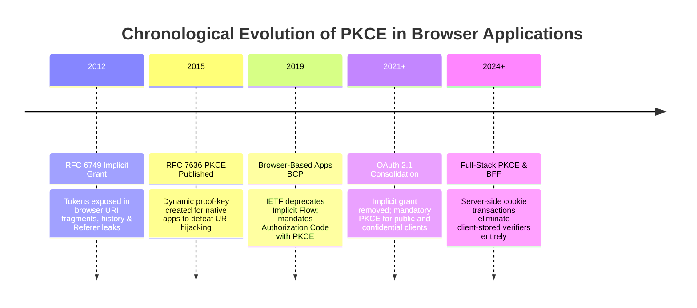
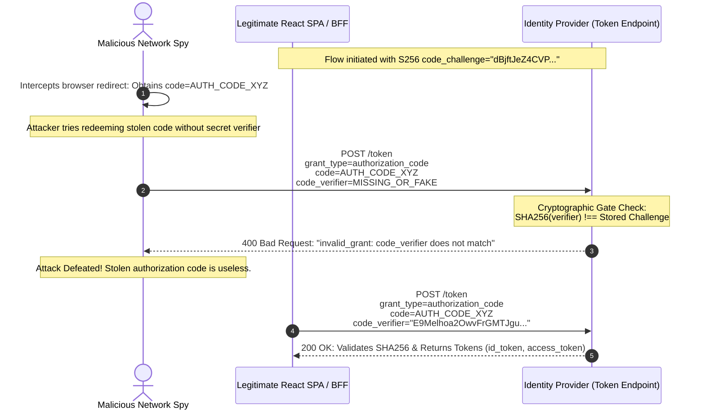

# Topic 02: The PKCE Flow in Modern SPAs & Next.js (Proof Key for Code Exchange)

## 1. Why This Topic Exists
In the early days of OAuth 2.0, single-page applications and mobile applications were advised to use the **Implicit Grant Flow** (`response_type=token`). The implicit flow returned raw access tokens directly in the URL hash fragment (`#access_token=...`) immediately following user authentication. This architecture was catastrophically vulnerable: tokens leaked into browser history logs, HTTP Referer headers, proxy caches, and were vulnerable to malicious script interception before the web application even loaded.

To eliminate this vulnerability, the OAuth Working Group published **RFC 7636: Proof Key for Code Exchange by OAuth Public Clients (PKCE)**, subsequently mandating it as the sole universal standard in **OAuth 2.1**. PKCE bridges the security gap of public clients: because a browser SPA cannot maintain a confidential client secret, PKCE dynamically creates an ephemeral, one-time cryptographic secret pair for every single login transaction. Understanding PKCE mechanics at the byte, hashing, and protocol levels is non-negotiable for frontend architects securing enterprise systems against authorization code interception attacks.

---

## 2. Learning Objectives
By mastering this chapter, you will be able to:
- Explain why the OAuth 2.0 Implicit Grant was universally deprecated and banned in OAuth 2.1.
- Understand the cryptographic mechanics of `code_verifier` generation, SHA-256 hashing, and Base64URL encoding to produce `code_challenge`.
- Trace the complete protocol dance: Authorization Request, Code Response, and Token Exchange.
- Differentiate between the `state` parameter (CSRF mitigation) and the `nonce` parameter (replay attack mitigation).
- Implement a cryptographically sound PKCE generator using the native Web Cryptography API (`window.crypto.subtle`).
- Compare client-side PKCE in pure SPAs against server-side PKCE executed in Next.js Server Components and Edge Middleware.
- Debug common production PKCE failure modes: clock skew, encoding corruption, and state session mismatch across tabs.

---

## 3. Historical Evolution



<details>
<summary>📄 View Raw ASCII Schematic</summary>

```text
+--------------------------------------------------------------------------------------------------+
|                                    CHRONOLOGICAL EVOLUTION                                       |
+--------------------------------------------------------------------------------------------------+
| 2012 - RFC 6749 Implicit Grant: Recommended for browser SPAs. Tokens returned in URI fragments.   |
|        Dangerous: Exposed to browser history, Referer headers, and XSS token interception.     |
|                                                                                                  |
| 2015 - RFC 7636 PKCE Published: Originally designed for native mobile apps to prevent custom URI |
|        scheme hijacking (where malicious native apps registered identical protocol schemes).    |
|                                                                                                  |
| 2019 - OAuth 2.0 for Browser-Based Apps (BCP): IETF formally deprecates Implicit Flow for SPAs.  |
|        Mandates Authorization Code Flow with PKCE (`S256`) for all browser applications.         |
|                                                                                                  |
| 2021+ - OAuth 2.1 Draft Consolidation: Implicit grant completely removed from specification.     |
|         PKCE made mandatory for ALL clients (both public SPAs and confidential server apps).    |
|                                                                                                  |
| 2024+ - Full-Stack PKCE & BFF Normalization: Client PKCE shifts into Next.js App Router &        |
|         server-side cookie transactions, eliminating browser storage of verifiers completely.    |
+--------------------------------------------------------------------------------------------------+
```

</details>

---

## 4. First Principles & Intuitive Physical Analogies (Layer 1)

### Analogy: The Bank Safety Deposit Box & The One-Time Combination
Imagine you need to pick up a box of bearer bonds from a high-security bank vault (the Identity Provider), but you cannot go in person. You must send a courier (the public browser URL redirect):
1. **The Vulnerability (Implicit Flow):** You tell the courier, *"Go to the bank and have them hand you the bag of money directly."* If an armed robber tackles the courier on the sidewalk (URL snooping / Referer leak), the money is gone instantly.
2. **The Traditional Code Flow (Without PKCE):** The bank gives the courier a claim ticket (Authorization Code). The courier brings the ticket back to you. But if a thief steals the ticket from the courier's bag, the thief can run to the bank, show the ticket, and steal the bonds!
3. **The PKCE Solution (One-Time Combination Lock):**
   - Before sending the courier, you generate a secret, random, 128-character password: **The Code Verifier**.
   - You put that password through a one-way mathematical meat grinder (SHA-256 hash) to create a fingerprint: **The Code Challenge**.
   - You tell the courier: *"Deliver this fingerprint to the bank and bring back a claim ticket."*
   - The bank stores your fingerprint alongside the ticket. Even if a thief steals the ticket on the street, **the ticket is useless** because the bank will not open the vault without the original, un-hashed secret password!
   - When the ticket reaches you, you present both the claim ticket AND your original secret password. The bank runs the password through the same meat grinder, sees that it matches the fingerprint, and releases the bonds.

---

## 5. Internal Working & Engine Architecture (Layer 2)

### 1. Cryptographic Generation Flow
PKCE relies on asymmetric one-way cryptographic transformation using **SHA-256**:

```
+--------------------------------------------------------------------------------------------------+
| STEP 1: GENERATE HIGH-ENTROPY RANDOM CODE VERIFIER                                               |
| - High-entropy cryptographic random byte array: [0..255] (Minimum 32 bytes, recommended 32-96)   |
| - Converted to Unreserved URL Characters: [A-Z], [a-z], [0-9], "-", ".", "_", "~"               |
| - Length: 43 to 128 characters.                                                                  |
| Example: "E9Melhoa2OwvFrGMTJguCH5UrGqhAqGFYZWvdK2_438..."                                         |
+--------------------------------------------------------------------------------------------------+
                                  |
                                  v
+--------------------------------------------------------------------------------------------------+
| STEP 2: APPLY SHA-256 ONE-WAY HASHING                                                            |
| - Subsumed into Web Crypto API: `window.crypto.subtle.digest('SHA-256', verifierBuffer)`         |
| - Generates binary digest: 32 bytes (256 bits).                                                  |
+--------------------------------------------------------------------------------------------------+
                                  |
                                  v
+--------------------------------------------------------------------------------------------------+
| STEP 3: BASE64URL ENCODING                                                                       |
| - Binary digest encoded using URL-safe Base64 (replace '+' with '-', '/' with '_', strip '=')   |
| - This output becomes: `code_challenge`                                                          |
| - Method declared: `code_challenge_method = S256`                                                |
| Example: "dBjftJeZ4CVP-mB92K27uhbUJU1p1r_wW1gFWFOEjXk"                                           |
+--------------------------------------------------------------------------------------------------+
```

### 2. State vs Nonce: Distinct Defensive Roles
Engineers frequently confuse `state` and `nonce`. They protect against entirely different attack vectors:

```
+--------------------------------------------------------------------------------------------------+
| Parameter | Primary Defense Target                  | Lifecycle & Verification Mechanism         |
+-----------+-----------------------------------------+--------------------------------------------+
| `state`   | Cross-Site Request Forgery (CSRF)       | Generated by client, stored in session.    |
|           | Prevents an attacker from injecting     | IdP echoes it back unchanged in callback.  |
|           | their own authorization code into your  | Client asserts: incoming.state === saved.  |
|           | session to link their account to yours. |                                            |
+-----------+-----------------------------------------+--------------------------------------------+
| `nonce`   | Token Replay Attacks                    | Generated by client, hashed into ID Token. |
|           | Prevents an attacker from capturing an  | IdP bakes it into `id_token` payload.      |
|           | ID token and replaying it to log into   | Client asserts: decoded.nonce === saved.   |
|           | another device or session.              |                                            |
+-----------+-----------------------------------------+--------------------------------------------+
```

---

## 6. Runtime Flow & Execution Traces

### The Complete PKCE Authorization Code Exchange

```
Browser (React / Next.js)              Identity Provider (Entra ID / Okta)             Protected API
       |                                                |                                    |
       | 1. Generate verifier & challenge               |                                    |
       |    verifier = cryptoRandomString(64)           |                                    |
       |    challenge = base64Url(sha256(verifier))     |                                    |
       |    Save verifier & state in sessionStorage     |                                    |
       |                                                |                                    |
       | 2. GET /authorize?                             |                                    |
       |    response_type=code                          |                                    |
       |    &client_id=my-client-id                     |                                    |
       |    &redirect_uri=https://app.com/callback      |                                    |
       |    &scope=openid profile email api://read      |                                    |
       |    &state=csrf_random_string                   |                                    |
       |    &code_challenge=dBjftJeZ4...                |                                    |
       |    &code_challenge_method=S256                 |                                    |
       |----------------------------------------------->|                                    |
       |                                                |                                    |
       | 3. User authenticates & consents (MFA)         |                                    |
       |    IdP stores challenge with issued Auth Code  |                                    |
       |                                                |                                    |
       | 4. Redirect 302:                               |                                    |
       |    https://app.com/callback?code=AUTH_CODE_XYZ |                                    |
       |    &state=csrf_random_string                   |                                    |
       |<-----------------------------------------------|                                    |
       |                                                |                                    |
       | 5. Validate incoming state matches stored state|                                    |
       |    Retrieve stored code_verifier               |                                    |
       |                                                |                                    |
       | 6. POST /token                                 |                                    |
       |    grant_type=authorization_code               |                                    |
       |    &client_id=my-client-id                     |                                    |
       |    &code=AUTH_CODE_XYZ                         |                                    |
       |    &redirect_uri=https://app.com/callback      |                                    |
       |    &code_verifier=E9Melhoa2...                 |                                    |
       |----------------------------------------------->|                                    |
       |                                                | 7. IdP computes:                   |
       |                                                |    test = base64Url(               |
       |                                                |      sha256(code_verifier)         |
       |                                                |    )                               |
       |                                                |    Assert: test === challenge!     |
       |                                                |                                    |
       | 8. Returns 200 OK:                             |                                    |
       |    { id_token, access_token, refresh_token }   |                                    |
       |<-----------------------------------------------|                                    |
       |                                                |                                    |
       | 9. Fetch API Data with Bearer Token            |                                    |
       |------------------------------------------------------------------------------------>|
```

---

## 7. Memory Model & Heap Layout

### Web Crypto Memory Buffer Allocation
The Web Cryptography API performs hashing operations in native C++ engine code off the V8 heap:

```
[V8 Heap: JavaScript Context]
├── codeVerifier: String (64 characters in UTF-16 representation)
└── ArrayBuffer / Uint8Array (Raw random bytes allocated via window.crypto.getRandomValues)
         │
         ▼ (Pointer passed across V8-Blink C++ Bridge)
[Native OS Cryptographic Engine: BoringSSL / Crypto Subsystem]
├── EVP_DigestInit_ex(ctx, EVP_sha256())
├── Memory Scratchpad: 256-bit SHA-256 accumulator
└── Output: 32 raw bytes (Returned back as ArrayBuffer)
```

---

## 8. Visual Diagrams (ASCII / Text)



<details>
<summary>📄 View Raw ASCII Attack Mitigation Schematic</summary>

```text
+---------------------------------------------------------------------------------------------+
|                                    INTERCEPTION ATTEMPT                                     |
|                                                                                             |
|   Attacker spies on network / intercepts callback redirect:                                 |
|   --> Obtains: `code=AUTH_CODE_XYZ`                                                         |
|                                                                                             |
|   Attacker attempts malicious redemption:                                                   |
|   POST /token                                                                               |
|   grant_type=authorization_code                                                             |
|   code=AUTH_CODE_XYZ                                                                        |
|   code_verifier=??? (ATTACKER DOES NOT HAVE THE VERIFIER!)                                  |
|                                                                                             |
|                                         |                                                   |
|                                         v                                                   |
|   +-------------------------------------------------------------------------------------+   |
|   |                       IDENTITY PROVIDER CRYPTOGRAPHIC GATE                          |   |
|   |                                                                                     |   |
|   |   Stored Challenge: "dBjftJeZ4CVP-mB92K27uhbUJU1p1r_wW1gFWFOEjXk"                   |   |
|   |   Attacker Verifier: Missing or Invalid String                                      |   |
|   |                                                                                     |   |
|   |   SHA256(Attacker Verifier) !== Stored Challenge                                    |   |
|   |   ===> HTTP 400 Bad Request: "invalid_grant: code_verifier does not match"          |   |
|   +-------------------------------------------------------------------------------------+   |
+---------------------------------------------------------------------------------------------+
```

</details>

---

## 9. Real World Usage & Production Patterns

> 🧪 **Companion Interactive Lab:** [LabComponent.tsx](../../apps/portal/src/features/visualizers/topic-07-security/LabComponent.tsx) | Live in Portal: `topic-07-security`

### Pattern 1: Pure Native Web Crypto PKCE Generator (`pkce.ts`)

```typescript
/**
 * Generates a cryptographically secure, high-entropy random string.
 * Uses RFC 7636 unreserved characters: [A-Z], [a-z], [0-9], "-", ".", "_", "~".
 */
export function generateCodeVerifier(length = 64): string {
  if (length < 43 || length > 128) {
    throw new RangeError('PKCE code_verifier length must be between 43 and 128 characters');
  }

  const charset = 'ABCDEFGHIJKLMNOPQRSTUVWXYZabcdefghijklmnopqrstuvwxyz0123456789-._~';
  const randomBytes = new Uint8Array(length);
  window.crypto.getRandomValues(randomBytes);

  let result = '';
  for (let i = 0; i < length; i++) {
    result += charset[randomBytes[i] % charset.length];
  }
  return result;
}

/**
 * Computes SHA-256 hash of a string and returns it base64url encoded.
 */
export async function generateCodeChallenge(verifier: string): Promise<string> {
  const encoder = new TextEncoder();
  const data = encoder.encode(verifier);
  const digest = await window.crypto.subtle.digest('SHA-256', data);

  // Convert ArrayBuffer to binary string
  const bytes = new Uint8Array(digest);
  let binary = '';
  for (let i = 0; i < bytes.byteLength; i++) {
    binary += String.fromCharCode(bytes[i]);
  }

  // Base64URL encoding (RFC 7636 Section 4.2)
  return btoa(binary)
    .replace(/\+/g, '-')
    .replace(/\//g, '_')
    .replace(/=+$/, '');
}

/**
 * Initiates the PKCE Authorization redirect.
 */
export async function initiatePkceLogin(config: {
  authEndpoint: string;
  clientId: string;
  redirectUri: string;
  scope: string;
}): Promise<void> {
  const verifier = generateCodeVerifier(64);
  const challenge = await generateCodeChallenge(verifier);
  const state = generateCodeVerifier(32);

  // Persist verifier and state in sessionStorage (isolated to current tab)
  sessionStorage.setItem('pkce_verifier', verifier);
  sessionStorage.setItem('pkce_state', state);

  const params = new URLSearchParams({
    response_type: 'code',
    client_id: config.clientId,
    redirect_uri: config.redirectUri,
    scope: config.scope,
    state: state,
    code_challenge: challenge,
    code_challenge_method: 'S256',
  });

  window.location.href = `${config.authEndpoint}?${params.toString()}`;
}
```

### Pattern 2: Next.js App Router Server-Side PKCE Callback Route (`app/api/auth/callback/route.ts`)

```typescript
import { NextRequest, NextResponse } from 'next/server';
import { cookies } from 'next/headers';

export async function GET(request: NextRequest): Promise<NextResponse> {
  const searchParams = request.nextUrl.searchParams;
  const code = searchParams.get('code');
  const incomingState = searchParams.get('state');

  const cookieStore = await cookies();
  const savedState = cookieStore.get('auth_state')?.value;
  const codeVerifier = cookieStore.get('auth_code_verifier')?.value;

  // 1. Verify CSRF state parameter
  if (!incomingState || !savedState || incomingState !== savedState) {
    return new NextResponse('Invalid state parameter (Possible CSRF attack)', { status: 400 });
  }

  if (!code || !codeVerifier) {
    return new NextResponse('Missing authorization code or code_verifier', { status: 400 });
  }

  // 2. Exchange authorization code for tokens directly from server (Confidential transaction)
  const tokenEndpoint = process.env.IDP_TOKEN_ENDPOINT!;
  const tokenResponse = await fetch(tokenEndpoint, {
    method: 'POST',
    headers: { 'Content-Type': 'application/x-www-form-urlencoded' },
    body: new URLSearchParams({
      grant_type: 'authorization_code',
      client_id: process.env.OAUTH_CLIENT_ID!,
      client_secret: process.env.OAUTH_CLIENT_SECRET!, // Kept safe on server!
      code: code,
      redirect_uri: `${process.env.APP_BASE_URL}/api/auth/callback`,
      code_verifier: codeVerifier,
    }),
  });

  if (!tokenResponse.ok) {
    const errorBody = await tokenResponse.text();
    return new NextResponse(`Token exchange failed: ${errorBody}`, { status: 502 });
  }

  const tokens = await tokenResponse.json();

  // 3. Clear transient PKCE cookies and establish encrypted session cookie
  const response = NextResponse.redirect(new URL('/dashboard', request.url));
  response.cookies.delete('auth_state');
  response.cookies.delete('auth_code_verifier');

  response.cookies.set('session', tokens.access_token, {
    httpOnly: true,
    secure: process.env.NODE_ENV === 'production',
    sameSite: 'lax',
    path: '/',
    maxAge: 3600, // 1 hour
  });

  return response;
}
```

---

## 10. Angular Comparison

| Feature / Pattern | Modern React / Web Platform | Angular Implementation (`angular-auth-oidc-client`) |
| :--- | :--- | :--- |
| **PKCE Enforcement** | Native `window.crypto.subtle` or library like `@azure/msal-browser`. | Configured via `OpenIdConfiguration` object: `{ customParamsAuthRequest: { response_type: 'code' } }`. |
| **Storage Mechanism** | `sessionStorage` or encrypted HttpOnly cookie. | In-memory storage, `sessionStorage`, or custom `AbstractSecurityStorage` provider. |
| **Callback Interception** | Route handler (`/api/auth/callback`) or `useEffect` hook inspecting `URLSearchParams`. | `OidcSecurityService.checkAuth()` executed in `APP_INITIALIZER` factory function before bootstrapping. |
| **Silent Token Renewal** | Hidden iframe or background `fetch` with refresh token. | `silentRenew: true` utilizing iframe or Refresh Token Rotation stream via RxJS Observables. |

---

## 11. .NET Comparison

| Feature / Pattern | Frontend Web PKCE | ASP.NET Core & Blazor WebAssembly |
| :--- | :--- | :--- |
| **PKCE Activation** | Programmatic parameters (`code_challenge_method=S256`). | Handled automatically by `OpenIdConnectOptions`: `options.UsePkce = true` (Default in .NET 6+). |
| **State & Correlation** | Ephemeral browser storage or state cookies. | Encrypted correlation cookie (`.AspNetCore.Correlation.*`) signed via ASP.NET Core Data Protection API. |
| **Blazor WebAssembly** | Uses `@azure/msal-browser` or custom JavaScript interop. | `Microsoft.AspNetCore.Components.WebAssembly.Authentication` automatically executes PKCE under the hood. |
| **Confidential vs Public**| Pure SPAs cannot use client secrets; Next.js BFF can. | ASP.NET Core Web Apps add client secrets; Blazor WASM acts as pure public client without secret. |

---

## 12. Enterprise Perspective & Production Risks (Layer 4)

### 1. Multi-Tab Session Overwrites
If a user opens two login tabs concurrently:
- Tab 1 generates `verifier_A` and saves it to `sessionStorage` (or cookie).
- Tab 2 generates `verifier_B` and overwrites `sessionStorage`.
- When Tab 1 completes authentication and returns to the callback URL, it reads `verifier_B` from storage, causing an immediate PKCE hash mismatch (`invalid_grant`).
**Enterprise Remedy:** Key the stored verifier by the unique `state` parameter:
`sessionStorage.setItem('pkce_' + state, verifier)`.

### 2. Stripping `code_challenge_method = S256`
RFC 7636 allows `code_challenge_method = plain` where the challenge is transmitted as raw plaintext without hashing. If an Identity Provider permits `plain`, an on-path attacker intercepting the initial authorization URL gains the verifier directly!
**Enterprise Remedy:** Configure enterprise IdP policies (Okta, Entra ID) to **strictly reject `plain`** and enforce `S256` exclusively.

---

## 13. Performance Considerations

### 1. Zero-Round-Trip Web Crypto Execution
Generating a 64-character verifier and executing SHA-256 via `crypto.subtle.digest` executes in **under 0.2 milliseconds** in modern browser engines. It introduces zero observable UI latency.

---

## 14. Tradeoffs

| Mechanism | Advantages | Disadvantages / Trade-offs |
| :--- | :--- | :--- |
| **PKCE with `S256`** | Complete immunity against code interception; zero client secrets needed. | Requires browser Web Crypto API support; slight state coordination overhead. |
| **PKCE in SPA vs BFF** | Pure SPA requires no server infrastructure. | SPA tokens still reside in browser memory, vulnerable to DOM-based XSS extraction. |
| **SessionStorage Verifier** | Automatically cleared when browser tab closes. | Does not survive redirects across different browser subdomains. |

---

## 15. Common Mistakes & Interview Traps

### Trap 1: Using `code_challenge_method = "plain"`
- **The Mistake:** Passing the raw unhashed verifier as the challenge.
- **The Reality:** Bypasses all cryptographic protection; vulnerable to URL logging. Modern specifications require `S256`.

### Trap 2: Storing the `code_verifier` in LocalStorage
- **The Mistake:** Using `localStorage.setItem('verifier', v)` for PKCE state.
- **The Reality:** `localStorage` is accessible across all tabs and sub-windows of the origin. Concurrent logins in other tabs will overwrite the verifier, causing sporadic, hard-to-reproduce login failures. Always use `sessionStorage` or keyed cookies.

---

## 16. Interview Questions & Architectural Answers (Senior, Lead, Architect - Layer 5)

### Staff/Principal Question: Why is PKCE still necessary if all traffic runs over TLS (HTTPS)?
**Architectural Answer:**
1. **TLS Protects the Pipe, Not the Endpoints:** TLS encrypts data in transit over the wire between the browser and server. It does not protect the authorization code from being intercepted **at the application or OS level**.
2. **URL & History Leakage:** The authorization code is returned in the browser query string (`?code=...`). It is recorded in browser history, proxy access logs, and can be read by malicious browser extensions with `tabs` permissions.
3. **Custom Protocol Handlers:** On mobile and desktop apps, malicious apps can register identical custom URL schemes (`myapp://callback`) to intercept the code.
4. **The PKCE Proof Guarantee:** Even if an attacker captures the authorization code through any of these non-network vectors, they cannot redeem it at the `/token` endpoint because they lack the `code_verifier`, which never traversed the front-channel URL!

---

## 17. Senior-Level Mental Model & "How to Remember This Forever" (Memory Anchors - Layer 3)

### The "Claim Check & Password" Anchor
- **Verifier:** Your secret password (kept strictly in your pocket).
- **Challenge:** The cryptographic fingerprint of your password (sent over the public road).
- **Code:** The claim ticket given by the counter.
- **Exchange:** You show the claim ticket AND whisper your secret password. The counter confirms the password matches the fingerprint and hands you the goods.

---

## 18. Core Vocabulary & "Aha!" Breakthrough Insights (Refresher)

- **RFC 7636:** The formal specification for Proof Key for Code Exchange (PKCE).
- **Code Verifier:** A high-entropy cryptographic random string (43–128 chars).
- **Code Challenge:** Base64URL-encoded SHA-256 hash of the code verifier.
- **`S256`:** The mandatory SHA-256 challenge transformation method.
- **Authorization Code:** An ephemeral, single-use ticket traded for tokens.

---

## 19. Key Takeaways
1. The Implicit Grant Flow is dead and forbidden in OAuth 2.1; PKCE is mandatory.
2. PKCE creates a dynamic, single-use cryptographic secret for public clients.
3. Always use `code_challenge_method = S256` and never `plain`.
4. Validate `state` for CSRF prevention and `nonce` for token replay prevention.
5. In Next.js and full-stack architectures, perform PKCE token exchange server-side to keep tokens in HttpOnly cookies.

---

## 20. Revision Sheet

```
+--------------------------------------------------------------------------------------------------+
|                                        PKCE CHEAT SHEET                                          |
+--------------------------------------------------------------------------------------------------+
| Steps:                                                                                           |
| 1. Generate Verifier  : Random string from [A-Za-z0-9-._~], length 43-128.                       |
| 2. Generate Challenge : base64Url(sha256(verifier)).                                             |
| 3. Send /authorize    : Include `code_challenge` and `code_challenge_method=S256`.               |
| 4. Receive Callback   : Extract `code`, verify `state`.                                          |
| 5. Post /token        : Send `code` + `code_verifier`. IdP validates hash.                       |
|                                                                                                  |
| Common Pitfalls:                                                                                 |
| - Standard Base64 instead of Base64URL (must replace +/ with -_ and strip =).                    |
| - Using localStorage instead of sessionStorage (multi-tab race condition).                       |
| - Permitting "plain" challenge method in production IdPs.                                        |
+--------------------------------------------------------------------------------------------------+
```
