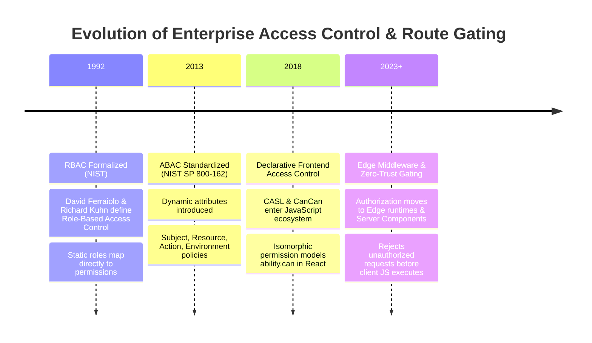
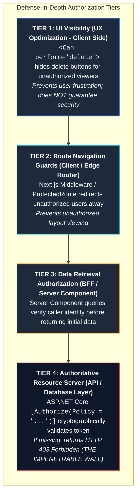

# Topic 06: Role-Based & Attribute-Based Access Control (RBAC / ABAC) in React

## 1. Why This Topic Exists
In simple consumer applications, access control is often binary: a user is either logged in or logged out. In modern enterprise applications (ERP systems, healthcare portals, banking platforms, SaaS dashboards), access control is multi-dimensional. A single enterprise tenant may have dozens of distinct user personas: Global Administrators, Compliance Auditors, Regional Sales Managers, Customer Support Agents, and Restricted Guests.

Frontend architects face a dual challenge: they must design responsive, clean user interfaces that gracefully show, hide, or disable elements based on user permissions, while simultaneously designing route protection barriers that prevent unauthorized users from viewing sensitive screens. Crucially, a senior architect must operate under the inviolable security principle: **UI hiding is NOT security**. Client-side permission checks are purely a User Experience (UX) convenience; authoritative security MUST be enforced on the backend resource tier. Mastering RBAC and ABAC architectures prevents privilege escalation vulnerabilities across enterprise systems.

---

## 2. Learning Objectives
By mastering this chapter, you will be able to:
- Compare **Role-Based Access Control (RBAC)**, **Attribute-Based Access Control (ABAC)**, and **Relationship-Based Access Control (ReBAC)**.
- Implement high-performance permission evaluation engines using **Bitwise Permission Masks** and declarative permission sets.
- Architect route-level authorization barriers across React Router layouts, Next.js Server Components, and Edge Middleware.
- Build declarative, fine-grained UI authorization components (`<Can perform="edit" on="Document">`) and custom hooks (`usePermission`).
- Defend against client-side DOM tampering, state manipulation, and unauthorized deep linking.
- Map claims, Entra ID App Roles, and JWT scopes into frontend authorization contexts without incurring redundant API round-trips.

---

## 3. Historical Evolution



<details className="raw-schematic-details">
<summary>📄 View Raw ASCII Schematic</summary>

```
+--------------------------------------------------------------------------------------------------+
|                                    CHRONOLOGICAL EVOLUTION                                       |
+--------------------------------------------------------------------------------------------------+
| 1992 - RBAC Formalized (NIST): David Ferraiolo & Richard Kuhn define Role-Based Access Control.  |
|        Users assigned static roles (e.g. "Admin", "User"); roles map directly to permissions.    |
|                                                                                                  |
| 2013 - Attribute-Based Access Control (ABAC - NIST SP 800-162): Introduces dynamic attributes     |
|        (Subject, Resource, Action, Environment: "User can edit if Department === Sales and Time |
|        is 9am-5pm and Location is Corporate IP").                                                |
|                                                                                                  |
| 2018 - Declarative Frontend Access Control (CASL / CanCan): JavaScript libraries popularize      |
|        declarative isomorphic permission models (`ability.can('read', 'Post')`) in React.        |
|                                                                                                  |
| 2023+ - Edge Middleware & Zero-Trust Route Gating: Routing authorization moves to Edge runtimes  |
|         and Server Components, rejecting unauthorized requests before client JS even executes.  |
+--------------------------------------------------------------------------------------------------+
```

</details>

---

## 4. First Principles & Intuitive Physical Analogies (Layer 1)

### Analogy 1: The Building Keycard vs The Biometric Security Checkpoint
Imagine visiting a corporate research facility:
- **RBAC (The Standard Keycard Color):** Everyone wearing a **Red Badge** (Role: Administrator) can enter Labs A, B, and C. Everyone wearing a **Yellow Badge** (Role: Contractor) can enter only the Cafeteria. It is fast, simple, and coarse-grained.
- **ABAC (The Context-Aware Biometric Scanner):** Even if you wear a Red Badge, the scanner at Lab A checks:
  1. *Who are you?* (Red Badge Employee)
  2. *What resource are you touching?* (Patient Health Records)
  3. *What are the environmental attributes?* (Is it between 08:00 and 18:00? Is your laptop connected to the secure internal network? Has your device undergone antivirus verification in the last 24 hours?)
  If any environmental attribute fails, access is denied despite your Red Badge!

### Analogy 2: The Theater Curtain vs The Locked Safe
- **The Client-Side UI Check (The Theater Curtain):** Hiding an "Edit Invoice" button or redirecting a `/admin` route in React is like closing the velvet curtain on stage. It keeps polite audience members from staring at the backstage crew. But anyone with a flashlight (opening browser DevTools or executing `fetch()` from the console) can walk right behind the curtain.
- **The Server-Side Authorization Check (The Locked Steel Safe):** The database and API endpoints represent the steel safe behind the curtain. No matter what buttons the user unhides in the DOM, if the safe refuses to open without cryptographic authorization, the assets remain 100% secure.

---

## 5. Internal Working & Engine Architecture (Layer 2)

### 1. The Access Control Spectrum: RBAC vs ABAC vs ReBAC

```
+-----------------------------------------------------------------------------------------------+
| Model   | Core Formula / Logic                                    | Best Used For             |
+-----------------------------------------------------------------------------------------------+
| RBAC    | HasRole(User, "BillingAdmin")                           | Coarse, static app roles  |
|         | Maps: User -> Roles -> Permissions                     | (SuperAdmin, Auditor)     |
+-----------------------------------------------------------------------------------------------+
| ABAC    | CanAccess(Subject, Action, Resource, Environment)       | Dynamic, context-rich     |
|         | Rules: User.Department === Resource.Department &&       | business rules (Finance,  |
|         |        Resource.Budget < $50,000                        | Healthcare, Compliance)   |
+-----------------------------------------------------------------------------------------------+
| ReBAC   | HasRelation(User, "editor", Document)                   | Collaborative Google Docs |
|         | Relational graphs: User owns Folder which contains Doc  | style resource hierarchies|
+-----------------------------------------------------------------------------------------------+
```

### 2. High-Performance Bitwise Permission Engine
In large applications with hundreds of permissions, evaluating string arrays (`['users:create', 'users:delete', ...]`) incurs memory and GC overhead. Frontend engines can use **Bitwise Flags** for ultra-fast, zero-allocation checking:

```
[Bitwise Permission Mask (32-bit Integer)]
Bit 0 (0x01 = 1)   : READ_USERS
Bit 1 (0x02 = 2)   : WRITE_USERS
Bit 2 (0x04 = 4)   : DELETE_USERS
Bit 3 (0x08 = 8)   : EXPORT_REPORTS
Bit 4 (0x10 = 16)  : BILLING_ADMIN

User Bitmask: 0x07 (Binary: 00000111) ===> (READ | WRITE | DELETE)
Check: (UserMask & DELETE_USERS) === DELETE_USERS  ===> TRUE (Evaluated in 1 CPU cycle!)
```

---

## 6. Runtime Flow & Execution Traces

### Multi-Tier Defense: Route Protection Flow in Full-Stack React / Next.js

```
Browser User Navigation                Edge Middleware / Proxy               Server Component / Page
         |                                        |                                     |
         | 1. Navigates to `/admin/billing`       |                                     |
         |--------------------------------------->|                                     |
         |                                        | 2. Inspect Session Cookie / JWT     |
         |                                        |    Extract claims: `roles: [...]`   |
         |                                        |                                     |
         |                                        | [CASE A: No Session]                |
         | 3. Redirect 307 to `/login`            | Redirect to `/login?returnUrl=...`  |
         |<---------------------------------------|                                     |
         |                                        |                                     |
         |                                        | [CASE B: Logged in, Missing Role]  |
         | 4. Rewrite to `/403-forbidden`         | Access Denied; Rewrite response     |
         |<---------------------------------------|                                     |
         |                                        |                                     |
         |                                        | [CASE C: Authorized!]               |
         |                                        | 5. Forward request with verified    |
         |                                        |    headers (x-user-role: Admin)     |
         |                                        |------------------------------------>|
         |                                        |                                     | 6. Fetch Protected Data
         |                                        |                                     |    from Backend API
         |                                        | 7. Return Pre-rendered HTML         |    (Authoritative check)
         | 8. Render Secure Admin Page            |<------------------------------------|
         |<---------------------------------------|
```

---

## 7. Memory Model & Heap Layout

### React Context Authorization State Topology

```
[React Fiber Tree V8 Heap]
└── AuthProviderContext.Provider
    └── value: {
          user: { id: "u_1", email: "adarsh@enterprise.com" },
          roles: Set(["Manager", "Auditor"]),           // Fast O(1) role lookup
          permissions: Set(["reports:read", "team:manage"]), // Canonical permission set
          can: (action, subject) => boolean            // Memoized evaluation function
        }
         │
         ├── <DashboardLayout> (Consumes useAuthContext)
         │   └── <Can perform="team:manage">
         │       └── <ManageTeamButton /> (Mounted only if permission granted)
         │
         └── <RestrictedAdminRoute> (Guards sub-tree)
```

---

## 8. Visual Diagrams (ASCII / Text)

### Multi-Layered Defense-in-Depth Authorization Model



<details className="raw-schematic-details">
<summary>📄 View Raw ASCII Schematic</summary>

```
+---------------------------------------------------------------------------------------------+
|                                    DEFENSE-IN-DEPTH TIERS                                   |
|                                                                                             |
|   +-------------------------------------------------------------------------------------+   |
|   | TIER 1: UI VISIBILITY (UX Optimization - Client Side)                               |   |
|   | `<Can perform="delete">` hides delete buttons for unauthorized viewers.             |   |
|   | (Prevents user frustration; does NOT guarantee security).                           |   |
|   +-------------------------------------------------------------------------------------+   |
|                                              │                                              |
|                                              ▼                                              |
|   +-------------------------------------------------------------------------------------+   |
|   | TIER 2: ROUTE NAVIGATION GUARDS (Client / Edge Router)                              |   |
|   | Next.js Middleware / ProtectedRoute redirects unauthorized users away from routes.  |   |
|   | (Prevents unauthorized layout viewing).                                             |   |
|   +-------------------------------------------------------------------------------------+   |
|                                              │                                              |
|                                              ▼                                              |
|   +-------------------------------------------------------------------------------------+   |
|   | TIER 3: DATA RETRIEVAL AUTHORIZATION (BFF / Server Component)                       |   |
|   | Server Component queries verify caller identity before returning initial data.      |   |
|   +-------------------------------------------------------------------------------------+   |
|                                              │                                              |
|                                              ▼                                              |
|   +-------------------------------------------------------------------------------------+   |
|   | TIER 4: AUTHORITATIVE RESOURCE SERVER (API / Database Layer)                        |   |
|   | ASP.NET Core `[Authorize(Policy = "...")]` cryptographically validates token.      |   |
|   | If missing, returns HTTP 403 Forbidden. (THE IMPENETRABLE WALL).                   |   |
|   +-------------------------------------------------------------------------------------+   |
+---------------------------------------------------------------------------------------------+
```

</details>

---

## 9. Real World Usage & Production Patterns

> 🧪 **Companion Interactive Lab:** [LabComponent.tsx](../../apps/portal/src/features/visualizers/topic-07-security/LabComponent.tsx) | Live in Portal: `topic-07-security`

### Pattern 1: Complete Declarative Permission Context & `<Can>` Component (`AccessControl.tsx`)

```typescript
import React, { createContext, useContext, useMemo } from 'react';

export type Permission = 
  | 'users:read' 
  | 'users:write' 
  | 'users:delete' 
  | 'reports:export' 
  | 'billing:manage';

export type Role = 'SuperAdmin' | 'BillingAdmin' | 'SalesLead' | 'Auditor' | 'StandardUser';

// Canonical Enterprise Role-to-Permission Matrix
const ROLE_PERMISSIONS: Record<Role, Permission[]> = {
  SuperAdmin: ['users:read', 'users:write', 'users:delete', 'reports:export', 'billing:manage'],
  BillingAdmin: ['billing:manage', 'reports:export'],
  SalesLead: ['users:read', 'reports:export'],
  Auditor: ['users:read', 'reports:export'],
  StandardUser: ['users:read'],
};

interface AuthContextValue {
  userRoles: Role[];
  permissions: Set<Permission>;
  hasRole: (role: Role | Role[]) => boolean;
  hasPermission: (permission: Permission | Permission[]) => boolean;
}

const AuthContext = createContext<AuthContextValue | null>(null);

export function AccessControlProvider({
  roles,
  children,
}: {
  roles: Role[];
  children: React.ReactNode;
}) {
  const contextValue = useMemo(() => {
    const permissions = new Set<Permission>();
    for (const role of roles) {
      const perms = ROLE_PERMISSIONS[role] || [];
      for (const p of perms) {
        permissions.add(p);
      }
    }

    const hasRole = (target: Role | Role[]): boolean => {
      const targets = Array.isArray(target) ? target : [target];
      return targets.some((r) => roles.includes(r));
    };

    const hasPermission = (target: Permission | Permission[]): boolean => {
      const targets = Array.isArray(target) ? target : [target];
      return targets.every((p) => permissions.has(p));
    };

    return { userRoles: roles, permissions, hasRole, hasPermission };
  }, [roles]);

  return <AuthContext.Provider value={contextValue}>{children}</AuthContext.Provider>;
}

export function useAccessControl() {
  const context = useContext(AuthContext);
  if (!context) {
    throw new Error('useAccessControl must be used within an AccessControlProvider');
  }
  return context;
}

/**
 * Declarative UI Authorization Component
 */
export function Can({
  perform,
  fallback = null,
  children,
}: {
  perform: Permission | Permission[];
  fallback?: React.ReactNode;
  children: React.ReactNode;
}) {
  const { hasPermission } = useAccessControl();
  return hasPermission(perform) ? <>{children}</> : <>{fallback}</>;
}
```

### Pattern 2: Next.js Edge Middleware RBAC Route Guard (`middleware.ts`)

```typescript
import { NextRequest, NextResponse } from 'next/server';

// Route protection configuration map
const ROUTE_PERMISSIONS: Record<string, string[]> = {
  '/admin': ['SuperAdmin'],
  '/billing': ['SuperAdmin', 'BillingAdmin'],
  '/analytics': ['SuperAdmin', 'SalesLead', 'Auditor'],
};

export function middleware(request: NextRequest) {
  const pathname = request.nextUrl.pathname;

  // Identify if route requires specific authorization
  const matchingPath = Object.keys(ROUTE_PERMISSIONS).find((prefix) =>
    pathname.startsWith(prefix)
  );

  if (!matchingPath) {
    return NextResponse.next();
  }

  const requiredRoles = ROUTE_PERMISSIONS[matchingPath];
  const sessionCookie = request.cookies.get('__Host-session-token')?.value;

  if (!sessionCookie) {
    const loginUrl = new URL('/login', request.url);
    loginUrl.searchParams.set('returnUrl', pathname);
    return NextResponse.redirect(loginUrl);
  }

  try {
    // In Edge middleware, parse verified claims or decrypt session
    const userRoles: string[] = JSON.parse(request.headers.get('x-user-roles') || '[]');
    const isAuthorized = requiredRoles.some((role) => userRoles.includes(role));

    if (!isAuthorized) {
      // 403 Forbidden: rewrite to error page without changing URL
      return NextResponse.rewrite(new URL('/unauthorized', request.url));
    }

    return NextResponse.next();
  } catch {
    return NextResponse.redirect(new URL('/login', request.url));
  }
}

export const config = {
  matcher: ['/admin/:path*', '/billing/:path*', '/analytics/:path*'],
};
```

---

## 10. Angular Comparison

| Feature / Architectural Pattern | Modern React Implementation | Angular Enterprise Implementation |
| :--- | :--- | :--- |
| **Route Authorization** | Edge Middleware or custom Layout `<ProtectedRoute>` component. | Declarative `CanActivateFn` Route Guards (`authGuard`, `roleGuard`) configured in Route objects. |
| **Route Child Protection** | Nested layout components checking permissions. | `CanActivateChildFn` guarding an entire tree of nested children routes. |
| **Route Lazy Load Blocker** | Dynamic `import()` wrapped in custom conditionals. | `CanMatchFn` preventing unauthorized feature modules from even downloading over the network. |
| **Declarative UI Visibility** | `<Can perform="edit">` component or `usePermission()` hook. | Structural Directive (`*hasPermission="'reports:export'"`) removing DOM nodes via `ViewContainerRef`. |

---

## 11. .NET Comparison

| Feature / Architectural Pattern | React / Next.js Implementation | ASP.NET Core Implementation |
| :--- | :--- | :--- |
| **Declarative Roles** | Custom `<Can>` components or route maps. | `[Authorize(Roles = "Admin,BillingManager")]` controller and endpoint attributes. |
| **Policy-Based Authorization** | Custom permission evaluation functions (`can(action, resource)`). | `AuthorizationPolicyBuilder` defining custom requirements evaluated by `IAuthorizationHandler`. |
| **Claims Principal** | Decoded JWT payload stored in React Context. | `ClaimsPrincipal` (`User.IsInRole()`, `User.HasClaim()`) universally accessible in execution contexts. |
| **Resource-Based Auth** | Evaluating dynamic object attributes (ABAC). | `IAuthorizationService.AuthorizeAsync(User, resource, "EditPolicy")` checking ownership and state before mutation. |

---

## 12. Enterprise Perspective & Production Risks (Layer 4)

### 1. The "DevTools Privilege Escalation" Fallacy
A junior developer hides the "Delete Company Account" button based on `user.role === 'Admin'`. An unauthorized user opens Chrome DevTools, edits the React DevTools state or flips the button DOM visibility, clicks "Delete", and deletes the company!
**Enterprise Remedy:** 
Never trust the client. The backend endpoint `DELETE /api/tenants/:id` must independently decode the cryptographic Bearer token, assert the `Admin` role in the JWT claims, and reject the request with HTTP 403 if missing.

### 2. Stale Claim Desynchronization
If an administrator revokes an employee's "BillingManager" role in Entra ID, but the employee's browser holds a 1-hour access token with the old role claim, the employee can continue performing billing actions until the token expires.
**Enterprise Remedy:** Implement **Continuous Access Evaluation (CAE)** or maintain a fast-invalidation token revocation cache in Redis to reject revoked claims immediately.

---

## 13. Performance Considerations

### 1. `Set` vs `Array` Permission Lookups
In enterprise applications with 200+ permissions, checking `permissions.includes('x')` inside 50 table rows runs in $O(N)$ time per check.
Using a JavaScript `Set`:
`permissions.has('x')` evaluates in **O(1) constant time**, preventing micro-stutters during high-frequency virtual list scrolling.

---

## 14. Tradeoffs

| Model | Strengths | Weaknesses / Trade-offs |
| :--- | :--- | :--- |
| **Pure RBAC** | Simple to model, intuitive UI management, lightweight tokens. | Inflexible; cannot express conditions like "only edit your own department records". |
| **ABAC** | Extremely powerful; handles complex environmental rules. | High computational complexity; difficult to audit; token or API request overhead. |
| **Client UI Hiding** | Smooth UX; prevents user error. | Zero security value by itself; completely reliant on backend enforcement. |

---

## 15. Common Mistakes & Interview Traps

### Trap 1: Checking Roles Instead of Permissions in UI Components
- **The Mistake:** Writing `<button disabled={user.role !== 'Admin' && user.role !== 'FinanceLead'}>`.
- **The Reality:** Tight coupling! If the company creates a new role "AuditorLead", you must hunt down hundreds of component files to add the new role string. Always check **granular permissions**: `<button disabled={!can('invoices:void')}>`. Map roles to permissions centrally.

### Trap 2: Relying on Frontend Route Guards for Security
- **The Mistake:** Believing that because a user was redirected away from `/admin`, the admin API is protected.
- **The Reality:** Any user can construct direct `curl` or `fetch()` HTTP requests to the backend endpoints. Route guards only protect the presentation view, never the data.

---

## 16. Interview Questions & Architectural Answers (Senior, Lead, Architect - Layer 5)

### Staff/Principal Question: How would you architect an isomorphic, zero-trust authorization system that shares permission policies between a Next.js frontend and downstream ASP.NET Core microservices?
**Architectural Answer:**
1. **Canonical Schema Contract:** Define permissions and policy rules in a shared, machine-readable format (JSON Schema, TypeScript types, or Open Policy Agent / Rego).
2. **Token Claim Hydration:** When Entra ID issues tokens, it emits canonical App Roles (`Finance.Auditor`, `Sales.Admin`) as verified claims in the JWT.
3. **Frontend Resolution:** The Next.js BFF / Client compiles the token claims into a canonical permission matrix via the Access Control Provider, driving the `<Can>` component and Edge Route middleware.
4. **Backend Enforcement:** ASP.NET Core microservices register matching policy requirements:
   `services.AddAuthorization(options => options.AddPolicy("CanExportReports", p => p.RequireClaim("roles", "Reports.Export")))`.
5. **Contract Invariant:** The client uses the policy to optimize UI display; the backend independently executes the identical policy rule. If policies drift, automated end-to-end contract tests (Playwright + Newman) flag discrepancies during CI.

---

## 17. Senior-Level Mental Model & "How to Remember This Forever" (Memory Anchors - Layer 3)

### The "Restaurant Menu" Mental Model
- **UI RBAC (The Menu):** Deciding whether to print the "Secret Wine List" on the menu for regular guests vs VIPs. It makes the dining experience pleasant.
- **API Authorization (The Sommelier at the Cellar Door):** Even if a guest writes "Secret Vintage 1982" on a napkin, the sommelier will check their credentials before retrieving the bottle from the cellar.

---

## 18. Core Vocabulary & "Aha!" Breakthrough Insights (Refresher)

- **RBAC:** Role-Based Access Control (Users -> Roles -> Permissions).
- **ABAC:** Attribute-Based Access Control (Subject + Action + Resource + Environment).
- **CanMatch Guard:** Angular routing concept that blocks unauthorized bundles from even downloading over the network.
- **UI Visibility vs Security:** UI controls optimize UX; API gateways enforce security.
- **Continuous Access Evaluation (CAE):** Real-time revocation of user access before token expiration.

---

## 19. Key Takeaways
1. Never conflate user experience (hiding buttons) with security (enforcing API authorization).
2. Code components against granular permissions (`invoices:edit`), never against high-level role names (`Manager`).
3. Store user permissions in a JavaScript `Set` for high-performance O(1) checks.
4. Use Next.js Edge Middleware for zero-latency, server-side route boundary enforcement.
5. Authoritative authorization MUST always be validated on the backend resource server.

---

## 20. Revision Sheet

```
+--------------------------------------------------------------------------------------------------+
|                                    RBAC / ABAC CHEAT SHEET                                       |
+--------------------------------------------------------------------------------------------------+
| Best Practice Component Pattern:                                                                 |
| ```tsx                                                                                           |
| <Can perform="reports:export" fallback={<UpgradeNotice />}>                                      |
|   <ExportButton />                                                                               |
| </Can>                                                                                           |
| ```                                                                                              |
|                                                                                                  |
| Golden Architectural Rules:                                                                      |
| 1. Always evaluate granular permissions, not static role names, in UI code.                      |
| 2. Use `Set.has()` for O(1) permission evaluations.                                              |
| 3. Never trust client-side state for sensitive mutations.                                        |
| 4. Every protected frontend route MUST mirror a protected backend API endpoint.                  |
+--------------------------------------------------------------------------------------------------+
```
