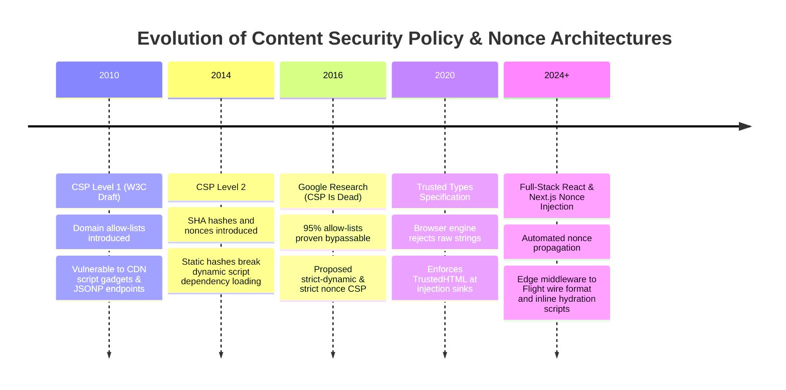
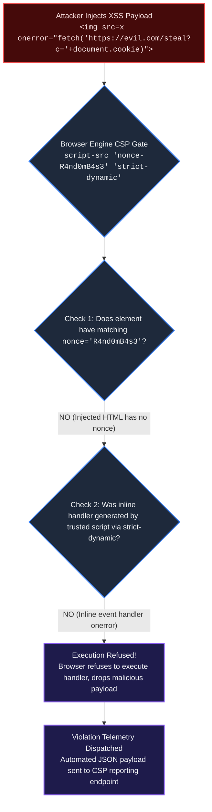

# Topic 07: Content Security Policy (CSP Level 3), Nonce Generation & Trusted Types

## 1. Why This Topic Exists
Cross-Site Scripting (XSS) has remained near the very top of the OWASP Top 10 vulnerabilities for over two decades. Despite modern frontend frameworks like React escaping strings by default inside JSX expressions, complex enterprise web applications still fall victim to XSS through dynamic HTML injection (`dangerouslySetInnerHTML`), markdown rendering engines, third-party analytics trackers, compromised npm dependencies, and open redirects.

The browser platform's ultimate, definitive line of defense against XSS and data exfiltration is the **Content Security Policy (CSP)**. A robust **CSP Level 3** policy completely restricts which executable scripts can run, prohibits unauthorized inline scripts, blocks untrusted network connections (`connect-src`), and forbids clickjacking embedding (`frame-ancestors`). 

For full-stack React and Next.js architects, mastering **Dynamic Cryptographic Nonces**, **`'strict-dynamic'` inheritance**, **Subresource Integrity (SRI)**, and the **Trusted Types API** transforms security from an afterthought into an immutable browser-enforced guarantee.

---

## 2. Learning Objectives
By mastering this chapter, you will be able to:
- Dissect core CSP Level 3 directives: `default-src`, `script-src`, `connect-src`, `frame-ancestors`, `object-src`, and `base-uri`.
- Understand the security vulnerabilities of hash-based policies vs the modern elegance of **Cryptographic Nonce-based CSP** paired with `'strict-dynamic'`.
- Implement dynamic, per-request cryptographic nonce generation inside Next.js Edge Middleware and propagate nonces to Server Components and the root layout.
- Protect third-party script imports from CDN supply-chain tampering using **Subresource Integrity (SRI)** (`integrity="sha384-..."`).
- Enforce the **Trusted Types API** (`require-trusted-types-for 'script'`) to eliminate DOM-based XSS at the browser engine level.
- Deploy CSP safely using `Content-Security-Policy-Report-Only` and automated telemetry violation collectors.

---

## 3. Historical Evolution



<details className="raw-schematic-details">
<summary>📄 View Raw ASCII Schematic</summary>

```
+--------------------------------------------------------------------------------------------------+
|                                    CHRONOLOGICAL EVOLUTION                                       |
+--------------------------------------------------------------------------------------------------+
| 2010 - CSP Level 1 (W3C Draft): Domain allow-lists (`script-src 'self' https://trusted.com`).   |
|        Flawed: Massive allow-lists; vulnerable to CDN script gadgets and JSONP endpoints.        |
|                                                                                                  |
| 2014 - CSP Level 2: Introduced SHA hashes and cryptographic nonces (`'nonce-abcdef'`).          |
|        Problematic for modern apps: Did not allow dynamically loaded script dependencies.        |
|                                                                                                  |
| 2016 - Google Research ("CSP Is Dead, Long Live CSP"): Proved 95% of domain allow-lists were    |
|        trivially bypassed. Proposed `'strict-dynamic'` and strict nonce-based CSP.               |
|                                                                                                  |
| 2020 - W3C Trusted Types Specification: Extends browser engine to reject raw string injection    |
|        into injection sinks (`innerHTML`, `eval`), requiring typed `TrustedHTML` objects.       |
|                                                                                                  |
| 2024+ - Full-Stack React & Next.js Automated Nonce Injection: Zero-config nonce propagation      |
|         across Edge Middleware, React Flight wire formats, and inline hydration scripts.         |
+--------------------------------------------------------------------------------------------------+
```

</details>

---

## 4. First Principles & Intuitive Physical Analogies (Layer 1)

### Analogy 1: The Secret Password on the Concert Ticket (Cryptographic Nonce)
Imagine a stadium hosting a VIP concert:
- **The Old Allow-List Approach (CSP Level 1):** The bouncer has a list of approved clothing brands: *"Anyone wearing a Nike or Adidas shirt can enter."* A counterfeiter buys an authentic Nike shirt, walks in, and smuggles a smoke grenade into the arena (a trusted CDN hosting an exploitable JSONP or Angular parser library).
- **The Modern Nonce Approach (CSP Level 3):** Every 5 seconds, the stadium's central server generates a brand-new, unique 128-bit random alphanumeric code: **The Nonce**. The server stamps this exact code onto the attendee's ticket and tells the bouncer: *"Only allow people whose ticket has THIS EXACT 128-bit number."*
- If an attacker injects a malicious script tag (`<script>evil()</script>`) via an XSS vulnerability, the browser engine inspects the injected tag. The attacker's tag has no ticket, or has an invalid nonce. The browser engine **refuses to execute a single byte of the attacker's script!**

### Analogy 2: The Tamper-Evident Wax Seal on the Supply Crate (SRI)
When your application loads an open-source library from an external CDN (e.g., `https://cdn.jsdelivr.net/...`):
- Without SRI: You trust that the CDN server will never be hacked.
- With **Subresource Integrity (SRI)**: You calculate the cryptographic SHA-384 fingerprint of the exact file contents ahead of time. When the browser downloads the file, it recalculates the hash. If an attacker hacked the CDN and added 1 extra line of keylogger code, the hash mismatches and the browser immediately discards the file.

---

## 5. Internal Working & Engine Architecture (Layer 2)

### 1. Anatomy of a Strict CSP Level 3 Policy
A publication-grade, production-hardened CSP configuration:

```http
Content-Security-Policy:
  default-src 'self';
  script-src 'nonce-{RANDOM_BASE64}' 'strict-dynamic';
  style-src 'self' 'nonce-{RANDOM_BASE64}';
  img-src 'self' blob: data: https:;
  font-src 'self';
  connect-src 'self' https://api.enterprise.com https://login.microsoftonline.com;
  object-src 'none';
  base-uri 'none';
  form-action 'self';
  frame-ancestors 'none';
```

```
+-----------------------------------------------------------------------------------------------+
| Directive            | Purpose & Security Guarantees                                          |
+-----------------------------------------------------------------------------------------------+
| `default-src 'self'` | Fallback directive for any resource type not explicitly declared.       |
|                      | Restricts resources to the exact originating host.                     |
|                                                                                               |
| `script-src 'nonce-X'| Enforces that all scripts must bear the per-request nonce.             |
|  'strict-dynamic'`   | 'strict-dynamic' allows trusted scripts to load other script modules.  |
|                                                                                               |
| `object-src 'none'`  | Disables legacy Flash, Java applets, and Silverlight plugins completely.|
|                                                                                               |
| `base-uri 'none'`    | Prevents attackers from injecting `<base href="...">` to hijack         |
|                      | relative script paths and form actions.                                |
|                                                                                               |
| `frame-ancestors     | Prevents the web page from being embedded inside `<iframe>` on ANY     |
|  'none'`             | other domain. Completely eliminates Clickjacking!                      |
+-----------------------------------------------------------------------------------------------+
```

### 2. The Power of `'strict-dynamic'`
In modern bundlers (Webpack, Vite, Next.js), scripts dynamically load other code-split chunks (`import('./analytics')`). 
- Without `'strict-dynamic'`: Every dynamically loaded chunk URL would need to be whitelisted in the CSP header.
- With `'strict-dynamic'`: If a script was executed because it carried a valid `nonce`, the browser **automatically trusts any sub-scripts dynamically injected by that trusted script**, preserving code splitting while blocking raw HTML injections!

---

## 6. Runtime Flow & Execution Traces

### Dynamic Nonce Generation & Injection in Next.js Full-Stack App

```
Browser Client                    Next.js Edge Middleware                   Next.js Server Component
      |                                       |                                         |
      | 1. HTTP GET /dashboard                |                                         |
      |-------------------------------------->|                                         |
      |                                       | 2. Generate Cryptographic Nonce:        |
      |                                       |    nonce = crypto.randomUUID()          |
      |                                       |    base64Nonce = btoa(nonce)            |
      |                                       |                                         |
      |                                       | 3. Construct CSP Header:                |
      |                                       |    script-src 'nonce-${base64Nonce}'... |
      |                                       |                                         |
      |                                       | 4. Attach nonce to request headers:     |
      |                                       |    request.headers.set('x-nonce', ...)  |
      |                                       |                                         |
      |                                       | 5. Forward request with x-nonce         |
      |                                       |---------------------------------------->|
      |                                       |                                         | 6. Read nonce from
      |                                       |                                         |    headers()
      |                                       |                                         | 7. Render root layout:
      |                                       |                                         |    <script nonce={nonce}>
      |                                       | 8. Receive rendered HTML stream         |
      |                                       |<----------------------------------------|
      | 9. Returns 200 OK Response:           |
      |    - Header: Content-Security-Policy  |
      |    - HTML: <script nonce="xyz">       |
      |<--------------------------------------|
      |
      | 10. Blink / WebKit Parsing Engine:
      |     Compares <script nonce="..."> against Response Header CSP.
      |     Matches ===> Executes JavaScript!
      |     Mismatches ===> BLOCKED! Outputs Console Security Violation.
```

---

## 7. Memory Model & Heap Layout

### Trusted Types Execution Hook in Blink Engine
The Trusted Types API prevents DOM-based XSS by hooking dangerous assignment sinks:

```
[JavaScript V8 Heap]
└── element.innerHTML = "<div>Hello</div>"
         │
         ▼ (Interception Hook at C++ Blink DOM Bridge)
[Blink C++ DOM Core: TrustedTypesEnforcement]
├── Check Policy: Is `require-trusted-types-for 'script'` enabled? (YES)
├── Inspect Type of Argument:
│   ├── Is it a string? ===> THROW TypeError:
│   │   "Failed to set 'innerHTML' on 'Element': This document requires 'TrustedHTML' assignment."
│   └── Is it an instance of TrustedHTML? ===> PERMIT ASSIGNMENT & PARSE DOM!
```

---

## 8. Visual Diagrams (ASCII / Text)

### Attack Mitigation: How Nonce-Based CSP Stops XSS



<details className="raw-schematic-details">
<summary>📄 View Raw ASCII Schematic</summary>

```
+---------------------------------------------------------------------------------------------+
|                                    XSS INJECTION ATTEMPT                                     |
|                                                                                             |
|   Attacker exploits a comment field:                                                        |
|   ``               |
|                                                                                             |
|                                         │                                                   |
|                                         ▼                                                   |
|   +-------------------------------------------------------------------------------------+   |
|   |                       BROWSER ENGINE CSP VALIDATOR GATE                             |   |
|   |                                                                                     |   |
|   |   Active CSP: `script-src 'nonce-R4nd0mB4s3' 'strict-dynamic'`                       |   |
|   |                                                                                     |   |
|   |   Check 1: Does injected inline script contain `nonce="R4nd0mB4s3"`?                 |   |
|   |            ===> NO! Injected HTML has no nonce attribute.                           |   |
|   |                                                                                     |   |
|   |   Check 2: Was inline handler generated by a trusted script via strict-dynamic?     |   |
|   |            ===> NO! It is an inline event handler attribute (`onerror`).             |   |
|   |                                                                                     |   |
|   |   ACTION: Execution Refused!                                                        |   |
|   |   Console Error: "Refused to execute inline event handler because it violates        |   |
|   |   the Content Security Policy directive: 'script-src'..."                           |   |
|   |                                                                                     |   |
|   |   Report: Automated JSON violation payload dispatched to reporting endpoint!        |   |
|   +-------------------------------------------------------------------------------------+   |
+---------------------------------------------------------------------------------------------+
```

</details>

---

## 9. Real World Usage & Production Patterns

> 🧪 **Companion Interactive Lab:** [LabComponent.tsx](../../apps/portal/src/features/visualizers/topic-07-security/LabComponent.tsx) | Live in Portal: `topic-07-security`

### Pattern 1: Next.js App Router Dynamic CSP Nonce Middleware (`middleware.ts`)

```typescript
import { NextRequest, NextResponse } from 'next/server';

export function middleware(request: NextRequest) {
  // 1. Generate a cryptographically secure random 16-byte nonce
  const nonceBytes = new Uint8Array(16);
  crypto.getRandomValues(nonceBytes);
  const nonce = btoa(String.fromCharCode(...nonceBytes));

  // 2. Build the Content-Security-Policy header string
  const cspHeader = `
    default-src 'self';
    script-src 'nonce-${nonce}' 'strict-dynamic' 'self' ${
      process.env.NODE_ENV === 'development' ? "'unsafe-eval'" : ''
    };
    style-src 'self' 'nonce-${nonce}';
    img-src 'self' blob: data: https:;
    font-src 'self';
    connect-src 'self' https://login.microsoftonline.com https://api.enterprise.com;
    object-src 'none';
    base-uri 'none';
    form-action 'self';
    frame-ancestors 'none';
  `.replace(/\s{2,}/g, ' ').trim();

  // 3. Clone request headers and inject nonce so Server Components can read it
  const requestHeaders = new Headers(request.headers);
  requestHeaders.set('x-nonce', nonce);
  requestHeaders.set('Content-Security-Policy', cspHeader);

  // 4. Create response and attach the CSP header
  const response = NextResponse.next({
    request: {
      headers: requestHeaders,
    },
  });

  response.headers.set('Content-Security-Policy', cspHeader);
  return response;
}

export const config = {
  matcher: [
    // Apply CSP to all paths except static files, images, and favicons
    '/((?!api|_next/static|_next/image|favicon.ico).*)',
  ],
};
```

### Pattern 2: Root Layout Consuming Nonce (`app/layout.tsx`)

```tsx
import { headers } from 'next/headers';
import React from 'react';

export default async function RootLayout({
  children,
}: {
  children: React.ReactNode;
}) {
  const headersList = await headers();
  const nonce = headersList.get('x-nonce') || undefined;

  return (
    <html lang="en">
      <head>
        {/* Any critical inline styles or scripts must carry the nonce */}
        <style nonce={nonce}>
          {`body { margin: 0; font-family: -apple-system, BlinkMacSystemFont, sans-serif; }`}
        </style>
      </head>
      <body>
        {children}
        {/* Next.js automatically propagates this nonce to its client hydration scripts */}
      </body>
    </html>
  );
}
```

---

## 10. Angular Comparison

| Feature / Architecture | Modern React / Next.js Implementation | Angular Enterprise Implementation |
| :--- | :--- | :--- |
| **Nonce Configuration** | Generated in Edge Middleware; passed via HTTP headers and consumed in layout. | Configured via `ngCspNonce` attribute in HTML or `CSP_NONCE` InjectionToken in `app.config.ts`. |
| **Inline Styles** | CSS modules, styled-components, or vanilla CSS classes with nonced `<style>`. | Angular CLI automatically injects `nonce` into component-scoped encapsulated styles. |
| **DOM Sanitization** | React escapes strings by default; manual sanitization via DOMPurify. | Built-in `DomSanitizer` class automatically stripping untrusted HTML/CSS/URLs unless marked safe. |
| **Trusted Types** | Enforced via browser CSP headers and manual policy definitions. | Supported natively via Angular CLI (`trustedTypes: true` in `angular.json`). |

---

## 11. .NET Comparison

| Feature / Architecture | Frontend React Implementation | ASP.NET Core Implementation |
| :--- | :--- | :--- |
| **CSP Middleware** | Next.js Edge Middleware (`middleware.ts`). | Custom ASP.NET Core Middleware or `NWebsec.AspNetCore.Middleware` setting response headers. |
| **Nonce Generation** | `crypto.getRandomValues()` in Edge V8 isolate. | `RandomNumberGenerator.GetBytes()` in ASP.NET Core middleware stored in `HttpContext.Items["csp-nonce"]`. |
| **Tag Helpers** | JSX `<script nonce={nonce}>`. | ASP.NET Core Razor Tag Helper: `<script asp-add-nonce="true">`. |
| **Clickjacking Defense** | CSP `frame-ancestors 'none'`. | `X-Frame-Options: DENY` and CSP `frame-ancestors` configured in Kestrel security middleware. |

---

## 12. Enterprise Perspective & Production Risks (Layer 4)

### 1. Breaking Google Tag Manager & Third-Party Analytics
The most common enterprise failure mode when rolling out a strict CSP is immediately breaking production marketing tags, analytics (Hotjar, Google Analytics), or payment gateways (Stripe, PayPal).
**Enterprise Remedy:** 
1. Never ship a strict blocking CSP directly to production.
2. Deploy the policy first using **`Content-Security-Policy-Report-Only`**.
3. Point `report-to` or `report-uri` to an automated telemetry collector (e.g. Sentry, Datadog) for **14 to 30 days**.
4. Audit incoming violation logs, configure required nonces and authorized domains, and only then flip to blocking mode.

### 2. The Development Mode `'unsafe-eval'` Trap
React Hot Module Replacement (HMR) and Webpack/Turbopack source maps utilize `eval()` internally during local development. If you enforce strict CSP in local development without conditionals, HMR breaks.
**Remedy:** Allow `'unsafe-eval'` strictly when `process.env.NODE_ENV === 'development'`.

---

## 13. Performance Considerations

### 1. Subresource Integrity (SRI) Caching Impact
SRI does **not** degrade caching performance. The browser caches the script file along with its calculated integrity hash in the HTTP disk cache. Subsequent visits verify the cached hash in sub-millisecond time.

---

## 14. Tradeoffs

| CSP Strategy | Security Level | Operational Complexity |
| :--- | :--- | :--- |
| **Domain Allow-List (CSP v1)** | Very Low (95% bypassable). | Low (Easy to understand; easy to break). |
| **Hash-Based CSP (SHA-256)** | High for static HTML. | Terrible for dynamic apps (every text change alters hash). |
| **Nonce + `'strict-dynamic'` (CSP v3)** | Maximum (Gold Standard). | Moderate (Requires server/middleware to generate per-request nonces). |
| **Trusted Types API** | Ultimate DOM-XSS Immunity. | High (Requires refactoring legacy third-party DOM scripts). |

---

## 15. Common Mistakes & Interview Traps

### Trap 1: Reusing the Same Static Nonce Across Requests
- **The Mistake:** Hardcoding `const STATIC_NONCE = "abc123xyz";` in application config.
- **The Reality:** A "nonce" stands for **Number used ONCE**. If the nonce is static, an attacker can simply inspect the HTML, read the static nonce, and craft an XSS payload containing `nonce="abc123xyz"`, completely invalidating all CSP protections! The nonce must be cryptographically generated per HTTP request.

### Trap 2: Using `X-Frame-Options` Instead of `frame-ancestors`
- **The Mistake:** Relying solely on `X-Frame-Options: SAMEORIGIN` for clickjacking defense.
- **The Reality:** `X-Frame-Options` is obsolete. It cannot express complex multi-parent nesting rules and is ignored by modern browsers when CSP `frame-ancestors` is present. Always declare `frame-ancestors 'none'` or specific allowed origins.

---

## 16. Interview Questions & Architectural Answers (Senior, Lead, Architect - Layer 5)

### Staff/Principal Question: How do you design and roll out a zero-trust Content Security Policy across a micro-frontend architecture with 10 independent feature teams without causing production outages?
**Architectural Answer:**
1. **Host-Level Gateway Policy:** The shell application / Edge Gateway owns the root CSP response header. Individual micro-frontends are prohibited from issuing their own conflicting CSP headers.
2. **Dynamic Nonce Injection Pipeline:** The Edge Gateway generates a cryptographic nonce per request and propagates it to all micro-frontend rendering engines via HTTP headers (`x-nonce`).
3. **Strict-Dynamic Adoption:** Utilize `script-src 'nonce-{nonce}' 'strict-dynamic'` so micro-frontends can load their dynamic chunks without registering individual file URLs in the gateway.
4. **Automated CI Validation:** Enforce an automated check in the build pipeline (oxlint / ESLint rules) that flags any raw `dangerouslySetInnerHTML`, untrusted inline scripts, or missing nonces before merge.
5. **Two-Stage Rollout:** Deploy the policy using `Content-Security-Policy-Report-Only: ... report-to /api/csp-reports`. Monitor violation streams in Datadog. Once violation volume drops to baseline legitimate anomalies over 30 days, promote the header to blocking mode.

---

## 17. Senior-Level Mental Model & "How to Remember This Forever" (Memory Anchors - Layer 3)

### The "Wristband at the Secret Society" Mental Model
- **The Nonce:** A uniquely stamped, glowing wristband given to you at the door for tonight only.
- **The Browser Engine:** The security guard checking wristbands. If an uninvited guest jumps the fence and starts dancing (an XSS script), the guard sees they have no wristband and escorts them out immediately.
- **Strict-Dynamic:** If a guest with a valid wristband invites a friend inside, that friend is trusted because of the original guest's credentials.

---

## 18. Core Vocabulary & "Aha!" Breakthrough Insights (Refresher)

- **CSP Level 3:** Modern Content Security Policy specification focusing on nonces and strict-dynamic.
- **Cryptographic Nonce:** A cryptographically random, single-use string generated per HTTP request.
- **`'strict-dynamic'`:** Directive instructing the browser to trust scripts dynamically loaded by an already-trusted script.
- **Subresource Integrity (SRI):** Cryptographic hash validation ensuring CDN files have not been modified.
- **Trusted Types:** W3C standard forcing dangerous DOM sinks to accept only validated `TrustedHTML` objects.

---

## 19. Key Takeaways
1. Domain allow-lists in CSP are obsolete; use Nonces paired with `'strict-dynamic'`.
2. Nonces must be cryptographically random and regenerated on every single HTTP request.
3. In Next.js, generate nonces in Edge Middleware and propagate them via request headers.
4. Always test new CSP deployments using `Content-Security-Policy-Report-Only` first.
5. Use `frame-ancestors 'none'` to eliminate Clickjacking permanently.

---

## 20. Revision Sheet

```
+--------------------------------------------------------------------------------------------------+
|                                        CSP CHEAT SHEET                                           |
+--------------------------------------------------------------------------------------------------+
| Gold Standard Policy:                                                                            |
| ```http                                                                                          |
| Content-Security-Policy:                                                                         |
|   default-src 'self';                                                                            |
|   script-src 'nonce-{NONCE}' 'strict-dynamic';                                                   |
|   style-src 'self' 'nonce-{NONCE}';                                                             |
|   img-src 'self' blob: data: https:;                                                             |
|   connect-src 'self' https://api.enterprise.com;                                                 |
|   object-src 'none';                                                                             |
|   base-uri 'none';                                                                               |
|   frame-ancestors 'none';                                                                        |
| ```                                                                                              |
|                                                                                                  |
| Rules to Live By:                                                                                |
| - Never hardcode a static nonce string.                                                          |
| - Never use 'unsafe-inline' in production script-src.                                            |
| - Use SRI (`integrity="sha384-..."`) for all third-party CDN script tags.                        |
+--------------------------------------------------------------------------------------------------+
```
