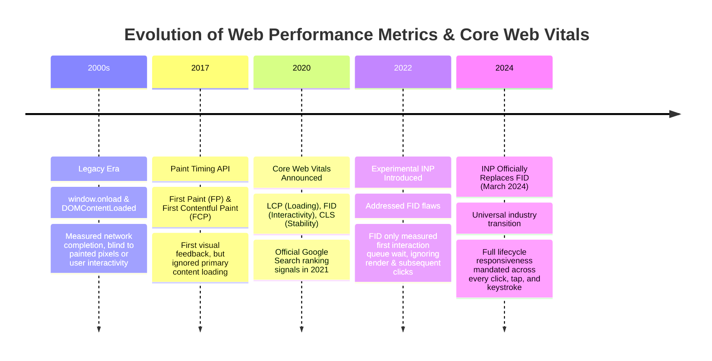
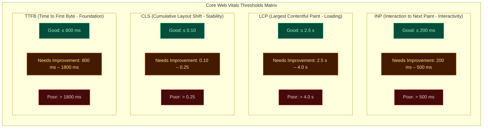

# Topic 01: Core Web Vitals Deep Dive (INP, LCP, CLS & TTFB)

## 1. Why This Topic Exists
For over a decade, frontend performance metrics were dominated by synthetic, unrepresentative milestones such as `window.onload` and `DOMContentLoaded`. An application could trigger `DOMContentLoaded` in 800 milliseconds while presenting the user with an empty white screen or a frozen UI unresponsive to touch and click inputs for five seconds. In modern web architecture, performance is defined not by when bytes finish downloading, but by the real-world user perception of speed, responsiveness, and visual stability.

Google formalized this paradigm with **Core Web Vitals (CWV)**, making them an authoritative ranking factor in search indexing and an industry-standard engineering SLA. In March 2024, Google permanently replaced First Input Delay (FID) with **Interaction to Next Paint (INP)**, shifting the performance bar from measuring a single input delay to profiling every user interaction across the entire lifespan of a page. Understanding the sub-millisecond mechanics, rendering phases, and V8 event loops behind INP, LCP, CLS, and TTFB is the baseline requirement for any Senior or Staff Frontend Architect.

---

## 2. Learning Objectives
By mastering this chapter, you will be able to:
- Dissect the 4 Core Web Vitals thresholds: **INP** (<200ms), **LCP** (<2.5s), **CLS** (<0.1), and **TTFB** (<800ms).
- Understand why **Interaction to Next Paint (INP)** replaced First Input Delay (FID) and trace its 3 constituent sub-phases: Input Delay, Processing Duration, and Presentation Delay.
- Analyze **Largest Contentful Paint (LCP)** candidates (images, video posters, block-level text) and the 4-phase LCP breakdown.
- Calculate **Cumulative Layout Shift (CLS)** using Impact Fraction and Distance Fraction, eliminating unscheduled layout shifts.
- Optimize **Time to First Byte (TTFB)** across DNS resolution, TLS handshakes, server generation, and CDN edge caching.
- Capture, observe, and aggregate Core Web Vitals programmatically in production using the native `PerformanceObserver` API.

---

## 3. Historical Evolution



<details className="raw-schematic-details">
<summary>📄 View Raw ASCII Schematic</summary>

```
+--------------------------------------------------------------------------------------------------+
|                                    CHRONOLOGICAL EVOLUTION                                       |
+--------------------------------------------------------------------------------------------------+
| 2000s - The Legacy Era: `window.onload` and `DOMContentLoaded`. Measured network completion,      |
|         blind to actual pixels painted or user interactivity.                                    |
|                                                                                                  |
| 2017 - Paint Timing API: First Paint (FP) and First Contentful Paint (FCP). Tracked the first    |
|        visual response, but ignored whether meaningful content had loaded.                       |
|                                                                                                  |
| 2020 - Google Announces Core Web Vitals: LCP (Loading), FID (Interactivity), CLS (Stability).    |
|        Became official Google Search ranking signals in 2021.                                    |
|                                                                                                  |
| 2022 - Experimental INP Introduced: Addressed FID's fatal flaw (FID only measured the first      |
|        interaction's queue wait, ignoring render time and subsequent clicks).                    |
|                                                                                                  |
| March 2024 - INP Officially Replaces FID: Universal industry transition. Full lifecycle        |
|              responsiveness mandated across every click, tap, and keystroke.                     |
+--------------------------------------------------------------------------------------------------+
```

</details>

---

## 4. First Principles & Intuitive Physical Analogies (Layer 1)

### Analogy 1: The Restaurant Service Experience (The Core Vitals Quartet)
Imagine dining at a premier restaurant:
1. **Time to First Byte (TTFB):** How long before the waiter greets your table and hands you a glass of water. If you wait 20 minutes just to see a waiter, the entire meal starts with friction.
2. **Largest Contentful Paint (LCP):** When your main entree (the steak) is placed on the table. You don't care when the breadsticks arrived (FCP); you consider the meal served when the primary dish is in front of you.
3. **Interaction to Next Paint (INP):** When you ask the waiter for more water. Do they nod immediately and fill your glass within 2 seconds (good INP)? Or do they freeze, walk into the kitchen for 10 minutes, and ignore you while running inventory (terrible INP / main-thread blocking)?
4. **Cumulative Layout Shift (CLS):** Just as you pick up your fork to slice the steak, the waiter violently bumps your table, shifting the plate 6 inches to the left so your fork stabs the tablecloth! Visual stability matters.

### Analogy 2: The Three Phases of INP (The Airport Baggage Claim)
When you land at an airport and request your luggage:
- **Phase 1: Input Delay:** How long you wait at the carousel before the conveyor belt starts turning (queue wait time while the main thread clears long tasks).
- **Phase 2: Processing Duration:** How long the machine takes to transport your specific bag onto the belt (your JavaScript event listener executing `onClick`).
- **Phase 3: Presentation Delay:** How long it takes for the carousel to revolve and deliver the bag into your hands (browser recalculating style, reflowing layout, painting pixels, and GPU compositing).
**INP = Input Delay + Processing Duration + Presentation Delay.**

---

## 5. Internal Working & Engine Architecture (Layer 2)

### 1. Interaction to Next Paint (INP) Engine Mechanics
INP profiles the **98th percentile** of all user interactions (clicks, taps, and keyboard presses) during the entire page session:

```
+--------------------------------------------------------------------------------------------------+
|                                    INP LIFECYCLE DECOMPOSITION                                   |
+--------------------------------------------------------------------------------------------------+
|                                                                                                  |
| User Action (Click/Key)                                                            Frame Rendered|
|      │                                                                                   │       |
|      ▼                                                                                   ▼       |
| ├─────────────────────────┼─────────────────────────────────────────┼─────────────────────────┤  |
| │       INPUT DELAY       │           PROCESSING DURATION           │   PRESENTATION DELAY    │  |
| ├─────────────────────────┼─────────────────────────────────────────┼─────────────────────────┤  |
| │ - Main thread blocked   │ - React event handler executes          │ - Style recalculation   │  |
| │   by previous Long Task │ - `setState` / Redux dispatch           │ - Layout (Reflow)       │  |
| │ - Event queued in OS/   │ - DOM modifications queued              │ - Paint & Rasterization │  |
| │   browser message loop  │ - Fiber reconciliation work loop        │ - Compositor frame swap │  |
| └─────────────────────────┴─────────────────────────────────────────┴─────────────────────────┘  |
|                                                                                                  |
| Total Budget: MUST BE LESS THAN 200ms (Good Threshold)                                           |
+--------------------------------------------------------------------------------------------------+
```

### 2. Cumulative Layout Shift (CLS) Mathematical Formula
CLS measures the sum total of all unexpected layout shifts occurring during a session:

```
Layout Shift Score = Impact Fraction * Distance Fraction

- Impact Fraction: The union of the visible area of the unstable elements BEFORE and AFTER
  the shift, relative to the viewport area (e.g. element occupies 50% of screen and moves).
- Distance Fraction: The greatest vertical or horizontal distance the unstable element moved,
  divided by the viewport's largest dimension (height or width).

Thresholds:
- Good: <= 0.1
- Needs Improvement: 0.1 to 0.25
- Poor: > 0.25
```

---

## 6. Runtime Flow & Execution Traces

### Largest Contentful Paint (LCP) 4-Phase Breakdown

```
0ms                  TTFB (~600ms)                Resource Load (~1500ms)               LCP Render (~2200ms)
 |                        |                                 |                                     |
 ├────────────────────────┼─────────────────────────────────┼─────────────────────────────────────┤
 │    1. TTFB (Network)   │      2. Resource Load Delay     │         3. Resource Load Duration   │ 4. Render Delay
 ├────────────────────────┼─────────────────────────────────┼─────────────────────────────────────┤
 │ DNS, TLS, Server time  │ HTML parsed; discovers LCP image│ Downloads image bytes over network  │ Decoding image,
 │ Edge proxy TTFB        │ (Avoid lazy-loading LCP!)       │ Optimized AVIF/WebP sizing          │ style, paint
 └────────────────────────┴─────────────────────────────────┴─────────────────────────────────────┘
                                                                                    Total Budget: < 2500ms
```

---

## 7. Memory Model & Heap Layout

### Performance Timeline & `PerformanceObserver` Buffer Layout
The browser maintains a circular memory buffer allocated in the Renderer process holding raw timing records:

```
[Renderer Memory: Performance Timeline Buffer]
├── PerformanceEntryList (Ring Buffer, capacity ~250 entries)
│   ├── Entry 0: { entryType: "navigation", name: "https://...", responseStart: 184.2 }
│   ├── Entry 1: { entryType: "paint", name: "first-contentful-paint", startTime: 412.8 }
│   ├── Entry 2: { entryType: "largest-contentful-paint", element: HTMLImageElement, startTime: 1240.5 }
│   ├── Entry 3: { entryType: "layout-shift", value: 0.042, hadRecentInput: false }
│   └── Entry 4: { entryType: "event", name: "pointerdown", duration: 84.6, processingEnd: 240.1 }
└── PerformanceObserver Callback: Invoked when microtask queue drains without interrupting V8 frame
```

---

## 8. Visual Diagrams (ASCII / Text)

### Core Web Vitals Target Thresholds Matrix



<details className="raw-schematic-details">
<summary>📄 View Raw ASCII Schematic</summary>

```
+---------------------------------------------------------------------------------------------+
|                                  CORE WEB VITALS SCORECARD                                  |
+--------------------+-----------------------+-----------------------+------------------------+
| Metric             | Good (Fast)           | Needs Improvement     | Poor (Failing)         |
+--------------------+-----------------------+-----------------------+------------------------+
| INP (Interactivity)| <= 200 ms             | 200 ms - 500 ms       | > 500 ms               |
| LCP (Loading)      | <= 2.5 s              | 2.5 s - 4.0 s         | > 4.0 s                |
| CLS (Stability)    | <= 0.1                | 0.1 - 0.25            | > 0.25                 |
| TTFB (Foundation)  | <= 800 ms             | 800 ms - 1800 ms      | > 1800 ms              |
+--------------------+-----------------------+-----------------------+------------------------+
```

</details>

---

## 9. Real World Usage & Production Patterns

> 🧪 **Companion Interactive Lab:** [LabComponent.tsx](../../apps/portal/src/features/visualizers/topic-08-performance/LabComponent.tsx) | Live in Portal: `topic-08-performance`

### Pattern 1: Production Native Web Vitals Observer (`vitalsObserver.ts`)

```typescript
export interface MetricReport {
  name: 'INP' | 'LCP' | 'CLS' | 'TTFB';
  value: number;
  rating: 'good' | 'needs-improvement' | 'poor';
}

/**
 * Observes Core Web Vitals using native PerformanceObserver APIs.
 * Zero external library dependencies.
 */
export function initializeVitalsObserver(onReport: (metric: MetricReport) => void): void {
  if (typeof window === 'undefined' || !('PerformanceObserver' in window)) return;

  // 1. Observe Largest Contentful Paint (LCP)
  try {
    const lcpObserver = new PerformanceObserver((entryList) => {
      const entries = entryList.getEntries();
      const lastEntry = entries[entries.length - 1] as PerformanceEntry & { startTime: number };
      if (lastEntry) {
        const value = Math.round(lastEntry.startTime);
        onReport({
          name: 'LCP',
          value,
          rating: value <= 2500 ? 'good' : value <= 4000 ? 'needs-improvement' : 'poor',
        });
      }
    });
    lcpObserver.observe({ type: 'largest-contentful-paint', buffered: true });
  } catch (err) {
    console.warn('[Vitals] LCP observation not supported:', err);
  }

  // 2. Observe Cumulative Layout Shift (CLS)
  try {
    let clsScore = 0;
    const clsObserver = new PerformanceObserver((entryList) => {
      for (const entry of entryList.getEntries() as any[]) {
        // Only count layout shifts that occurred WITHOUT recent user input
        if (!entry.hadRecentInput) {
          clsScore += entry.value;
          onReport({
            name: 'CLS',
            value: parseFloat(clsScore.toFixed(4)),
            rating: clsScore <= 0.1 ? 'good' : clsScore <= 0.25 ? 'needs-improvement' : 'poor',
          });
        }
      }
    });
    clsObserver.observe({ type: 'layout-shift', buffered: true });
  } catch (err) {
    console.warn('[Vitals] CLS observation not supported:', err);
  }

  // 3. Observe Interaction to Next Paint (INP)
  try {
    let longestInteractionDuration = 0;
    const inpObserver = new PerformanceObserver((entryList) => {
      for (const entry of entryList.getEntries() as any[]) {
        if (entry.interactionId && entry.duration > longestInteractionDuration) {
          longestInteractionDuration = entry.duration;
          const value = Math.round(longestInteractionDuration);
          onReport({
            name: 'INP',
            value,
            rating: value <= 200 ? 'good' : value <= 500 ? 'needs-improvement' : 'poor',
          });
        }
      }
    });
    inpObserver.observe({ type: 'event', buffered: true, durationThreshold: 16 } as any);
  } catch (err) {
    console.warn('[Vitals] INP observation not supported:', err);
  }
}
```

### Pattern 2: Eliminating CLS for Dynamic Images & Banners

```tsx
import React from 'react';

interface ResponsiveBannerProps {
  src: string;
  alt: string;
  aspectRatio: string; // e.g. "16 / 9"
}

export function ZeroClsBanner({ src, alt, aspectRatio }: ResponsiveBannerProps) {
  return (
    <div
      style={{
        width: '100%',
        aspectRatio: aspectRatio, // Reserves exact layout height before image downloads!
        backgroundColor: '#f0f0f0',
        overflow: 'hidden',
        position: 'relative',
      }}
    >
      
    </div>
  );
}
```

---

## 10. Angular Comparison

| Metric / Feature | React / Next.js Implementation | Angular Implementation |
| :--- | :--- | :--- |
| **Image Optimization** | `next/image` providing automatic AVIF conversion, `priority`, and layout reserving. | `NgOptimizedImage` (`ngSrc`) enforcing explicit width/height, automatic `srcset`, and `priority` flag for LCP. |
| **Deferred Loading** | `React.lazy` and dynamic `import()` with `<Suspense>`. | Declarative `@defer (on viewport)` block natively deferring heavy components until scrolled into view. |
| **Hydration & INP** | Streaming SSR with Selective Hydration. | Non-destructive Hydration (`provideClientHydration(withEventReplay())`) capturing early user clicks before hydration. |
| **Change Detection Overhead**| Virtual DOM tree diffing (reconciling un-memoized component trees). | Zone.js intercepting all browser events (can cause long tasks); moving to zoneless Signals reduces INP drastically. |

---

## 11. .NET Comparison

| Metric / Feature | Web Platform Frontend | ASP.NET Core & Blazor Equivalent |
| :--- | :--- | :--- |
| **TTFB Optimization** | Edge caching, streaming HTML via RSC Flight format. | ASP.NET Core Response Caching, Output Caching (`[OutputCache]`), and Kestrel HTTP/3 QUIC pipeline. |
| **LCP Delivery** | Static site generation or Edge CDN caching. | Server-rendered Razor Pages / MVC streaming HTML chunks directly from Kestrel sockets. |
| **Blazor WebAssembly INP** | Pure JavaScript execution. | High initial INP penalty due to downloading `dotnet.wasm` runtime and JIT compilation (mitigated via AOT compilation). |
| **Blazor Server Interactivity**| Local DOM updates in browser. | Every interaction trips over WebSocket SignalR circuit; high network latency directly damages INP! |

---

## 12. Enterprise Perspective & Production Risks (Layer 4)

### 1. The "Lazy Loading LCP" Production Blunder
A junior developer adds `loading="lazy"` to all `` tags across the site.
- **The Disaster:** The largest hero banner image on the homepage now waits until the browser finishes layout and determines its viewport position before initiating the image download.
- **Result:** LCP degrades from **1.8s to 4.9s**, immediately pushing the application into Google's "Poor" CWV penalty zone!
- **Enterprise Rule:** Never apply `loading="lazy"` to above-the-fold images. Always apply `fetchpriority="high"` and pre-load LCP candidates.

### 2. Third-Party Analytics Script Destruction of INP
Marketing installs Google Tag Manager, Hotjar, Facebook Pixel, and HubSpot. Each script attaches synchronous `mousemove` and `click` listeners on `window`. When a user clicks, the main thread freezes for 350ms executing analytics trackers before React can paint the updated UI.
**Enterprise Remedy:** Offload third-party scripts to a background Web Worker using libraries like **Partytown**.

---

## 13. Performance Considerations

### 1. The 16.6ms Frame Budget vs INP 200ms Threshold
To maintain smooth 60 FPS animations, the main thread must yield every **16.6ms**.
For INP, the threshold is **200ms**. However, if an interaction triggers a continuous sequence of 80ms tasks without yielding, the browser cannot paint the next visual frame, violating the INP budget.

---

## 14. Tradeoffs

| Optimization Choice | CWV Benefit | Engineering Trade-off |
| :--- | :--- | :--- |
| **CSS `aspect-ratio` Placeholders** | 100% elimination of CLS. | Requires rigid layout dimensions; tricky for variable-height user content. |
| **AVIF Image Format** | 20-30% smaller LCP payload than WebP. | Higher CPU encoding time during build; requires fallback for legacy Safari. |
| **Offloading Work to Web Workers** | Dramatic INP reduction. | Asynchronous `postMessage` serialization overhead; zero direct DOM access. |

---

## 15. Common Mistakes & Interview Traps

### Trap 1: Confusing FID with INP
- **The Mistake:** Thinking First Input Delay (FID) is still relevant in modern interviews.
- **The Reality:** Google officially retired FID in March 2024. FID only measured the delay of the very first click on a page. INP measures **all interactions** throughout the user's entire journey, reporting the worst interaction near the 98th percentile.

### Trap 2: Believing Client-Side Hydration Doesn't Hurt LCP
- **The Mistake:** Thinking that as soon as the SSR HTML paints, LCP is satisfied.
- **The Reality:** If your LCP candidate is rendered via client-side JavaScript (e.g. dynamic carousel), the user stares at a blank container until the heavy JS bundle downloads, parses, and executes, obliterating LCP.

---

## 16. Interview Questions & Architectural Answers (Senior, Lead, Architect - Layer 5)

### Staff/Principal Question: How would you architect a systematic engineering program to diagnose and reduce a failing INP score (450ms) across a complex React dashboard?
**Architectural Answer:**
1. **RUM Telemetry Isolation:** Deploy a `PerformanceObserver` tracking the 3 INP sub-phases (Input Delay, Processing Duration, Presentation Delay) tagged by target selector (`button#checkout`, `input#search`). Determine which sub-phase contributes the largest share of the 450ms.
2. **If Input Delay Dominates (>150ms):** The main thread is congested with unrelated background tasks when the user clicks. Audit long tasks: debounce scroll listeners, offload analytics to Partytown/Web Workers, and break initialization scripts using `scheduler.yield()`.
3. **If Processing Duration Dominates (>200ms):** The React event handler is doing too much work. Decouple urgent UI updates from secondary work using React 18/19 Concurrent transitions:
   `startTransition(() => setFilteredData(heavyFilter(data)))`. Keep urgent state updates (`setInputValue`) immediate.
4. **If Presentation Delay Dominates (>100ms):** The DOM tree is too large, causing expensive style recalculation and layout. Virtualize large tables with `@tanstack/react-virtual`, simplify deep CSS selectors, and leverage `content-visibility: auto`.
5. **CI Regression Guard:** Add automated Lighthouse / Playwright CI tests with CPU 4x throttling to fail PRs that introduce long tasks >50ms in critical interaction paths.

---

## 17. Senior-Level Mental Model & "How to Remember This Forever" (Memory Anchors - Layer 3)

### The "Highway Journey" Mental Model
- **TTFB:** The toll booth gate lifting so your car can enter the highway.
- **LCP:** Reaching the scenic mountain overlook (the main destination).
- **INP:** How fast the steering wheel responds when you turn it at 70 mph.
- **CLS:** Potholes causing your car to swerve unexpectedly.

---

## 18. Core Vocabulary & "Aha!" Breakthrough Insights (Refresher)

- **INP:** Interaction to Next Paint (measures worst interaction latency through full session).
- **LCP:** Largest Contentful Paint (measures time when primary content is painted).
- **CLS:** Cumulative Layout Shift (quantifies unexpected visual movement).
- **TTFB:** Time to First Byte (measures initial server and network response latency).
- **Input Delay:** Time between physical user interaction and event handler execution.
- **Presentation Delay:** Time between event handler completion and browser frame rasterization.

---

## 19. Key Takeaways
1. INP is the gold standard for interactivity; FID is obsolete.
2. An INP score under 200ms requires optimizing Input Delay, Processing Duration, and Presentation Delay.
3. Reserve explicit aspect ratios on all dynamic media to achieve CLS under 0.1.
4. Never lazy load your LCP image candidate; prioritize it with `fetchpriority="high"`.
5. Use native `PerformanceObserver` to collect real-user metrics (RUM) in production.

---

## 20. Revision Sheet

```
+--------------------------------------------------------------------------------------------------+
|                                    CORE WEB VITALS CHEAT SHEET                                   |
+--------------------------------------------------------------------------------------------------+
| The Big 4:                                                                                       |
| - INP  : <= 200 ms (Input Delay + Processing Duration + Presentation Delay)                       |
| - LCP  : <= 2.5 s  (TTFB + Load Delay + Load Duration + Render Delay)                            |
| - CLS  : <= 0.1    (Impact Fraction * Distance Fraction)                                         |
| - TTFB : <= 800 ms (DNS + TLS + Server Processing + Network Transit)                             |
|                                                                                                  |
| Top 3 Fixes:                                                                                     |
| 1. Fix LCP: Add `fetchpriority="high"` to main hero image; remove `loading="lazy"`.              |
| 2. Fix CLS: Set CSS `aspect-ratio` or `width`/`height` on all images and embeds.                 |
| 3. Fix INP: Break long tasks using `scheduler.yield()` and use `startTransition()` for non-urgent.|
+--------------------------------------------------------------------------------------------------+
```
