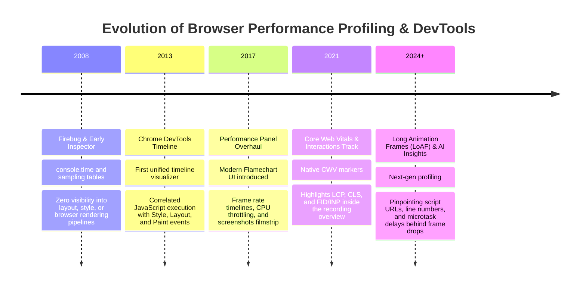
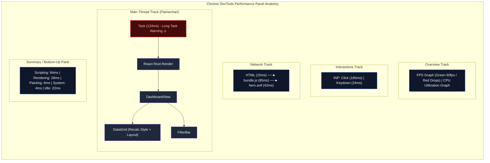

# Topic 02: Chrome DevTools Performance Profiling & Flamechart Analysis

## 1. Why This Topic Exists
Many frontend developers approach performance optimization through guesswork: randomly wrapping components in `React.memo()`, `useCallback()`, or rearranging `useEffect` dependencies without empirical evidence. This "voodoo optimization" often bloats memory, increases code complexity, and fails to move the needle on real-world user metrics.

In enterprise software engineering, performance optimization is an empirical science. The primary laboratory instrument is the **Chrome DevTools Performance Panel**. A Staff Frontend Engineer must be able to record a performance trace under realistic mobile CPU and network throttling, dissect the multi-threaded V8 and Blink timeline, diagnose **Long Tasks (>50ms)** on the main thread flamechart, identify **Forced Synchronous Layout (Layout Thrashing)**, and pinpoint exact line-level call-stack bottlenecks. 

Mastering DevTools flamecharts separates engineers who guess from architects who measure, diagnose, and mathematically prove performance gains.

---

## 2. Learning Objectives
By mastering this chapter, you will be able to:
- Configure a deterministic profiling environment: 4x/6x CPU throttling, network throttling, and clean incognito states.
- Read and navigate the DevTools Performance Timeline: Main Thread, Compositor, GPU, Network, and Interactions lanes.
- Interpret the **Flamechart**: Width as duration, depth as call stack, and identifying hot functions via Bottom-Up and Call Tree views.
- Diagnose the 4 classic rendering bottlenecks: Long JavaScript execution, Forced Synchronous Reflow, Heavy Style Recalculation, and Excessive Rasterization.
- Instrument custom architectural benchmarks using the **User Timing API** (`performance.mark` and `performance.measure`).
- Correlate React component re-renders using the React DevTools Profiler alongside Chrome DevTools performance traces.

---

## 3. Historical Evolution



<details className="raw-schematic-details">
<summary>📄 View Raw ASCII Schematic</summary>

```
+--------------------------------------------------------------------------------------------------+
|                                    CHRONOLOGICAL EVOLUTION                                       |
+--------------------------------------------------------------------------------------------------+
| 2008 - Firebug & Early Web Inspector: Simple `console.time()` and rudimentary CPU profiler        |
|        sampling tables. Zero visualization of layout, style, or browser rendering pipelines.     |
|                                                                                                  |
| 2013 - Chrome DevTools Timeline Introduced: First unified timeline visualizer correlating       |
|        JavaScript execution with Style Recalculation, Layout, and Paint events.                 |
|                                                                                                  |
| 2017 - DevTools Performance Panel Overhaul: Introduced the modern Flamechart UI, Frame rate      |
|        timelines, CPU throttling, and screenshots filmstrip.                                     |
|                                                                                                  |
| 2021 - Core Web Vitals Lane & Interactions Track: DevTools highlights LCP, CLS, and FID/INP      |
|        markers natively inside the recording overview.                                           |
|                                                                                                  |
| 2024+ - Long Animation Frames (LoAF) API & AI-Assisted Flamechart Insights: Next-gen profiling   |
|         pinpointing exact script URLs, line numbers, and microtask delays behind frame drops.    |
+--------------------------------------------------------------------------------------------------+
```

</details>

---

## 4. First Principles & Intuitive Physical Analogies (Layer 1)

### Analogy: The Hospital Electrocardiogram (ECG) and the Surgical Team
Imagine monitoring a patient's heartbeat during surgery:
- **The Main Thread Timeline (The ECG Monitor):** A healthy human heart beats rhythmically at 60 beats per minute. A healthy browser main thread must pump visual frames every **16.6ms** (60 FPS) to maintain fluid rendering.
- **The Long Task (The Cardiac Arrest):** Whenever a function runs longer than **50ms**, the ECG monitor flashes a bright red warning! The main thread is frozen; the browser cannot process user clicks, scroll events, or repaint the screen.
- **The Flamechart (The Layered Surgical Report):** 
  - The top layer represents the surgeon entering the room (`Task`).
  - The next layer represents opening the tray (`dispatchSetState`).
  - Deeper layers represent fine-grained incisions (`reconcileChildren`, `renderItem`, `calculateStyles`).
  - The **wider** a block is on the horizontal axis, the more CPU time it consumed. The **deeper** it is vertically, the deeper the call stack recursion.

---

## 5. Internal Working & Engine Architecture (Layer 2)

### 1. DevTools Sampling Profiler Engine Mechanics
The Chrome DevTools profiler does not inject code into every JavaScript function (which would alter performance via the "Observer Effect"). Instead, it utilizes **Statistical Sampling Profiling**:

```
+--------------------------------------------------------------------------------------------------+
|                               V8 STATISTICAL SAMPLING PROFILER                                   |
+--------------------------------------------------------------------------------------------------+
| 1. High-Precision OS Timer fires every 1 millisecond (1000 Hz sample rate).                      |
|                                                                                                  |
| 2. On each timer tick, the profiler pauses the V8 thread momentarily and takes a snapshot of:    |
|    - Current Program Counter (PC) register                                                       |
|    - Execution Call Stack pointer (Top-of-Stack function down to root)                           |
|                                                                                                  |
| 3. V8 builds an Execution Call Tree:                                                             |
|    - Total Time (Inclusive): Time spent in function PLUS all functions it called.               |
|    - Self Time (Exclusive): Time spent strictly inside function body itself.                     |
|                                                                                                  |
| 4. Blink Engine emits Trace Events over Mojo IPC:                                                |
|    - "v8.compile", "UpdateLayoutTree" (Styles), "Layout" (Reflow), "RasterTask" (Paint).         |
+--------------------------------------------------------------------------------------------------+
```

### 2. Anatomy of a Long Task (>50ms)
The 50ms boundary is derived from the **RAIL model** (Response, Animation, Idle, Load). Because user input must receive feedback within 100ms, and the browser requires up to 50ms to finish housekeeping and layout, any JavaScript execution exceeding 50ms risks dropping frames and violating INP:

```
0ms                           50ms (Budget Limit)                  120ms (Task Complete)
 |                             |                                    |
 ├─────────────────────────────┼────────────────────────────────────┤
 │ Safe Execution Budget       │ RED DOGEAR WARNING: 70ms Overrun!  │
 ├─────────────────────────────┼────────────────────────────────────┤
 │ User inputs handled smoothly│ User input frozen! Frame dropped!  │
 └─────────────────────────────┴────────────────────────────────────┘
```

---

## 6. Runtime Flow & Execution Traces

### Trace: Forced Synchronous Reflow (Layout Thrashing) in the Flamechart
When code reads a geometry property (`offsetWidth`) immediately after writing to the DOM:

```
Timeline (ms):  0.0ms            0.5ms            1.0ms            1.5ms            2.0ms
Main Thread:    [ JavaScript: el.style.width = '100px' ]
                [ Recalculate Style & Reflow (FORCED!)  ] <--- DevTools Purple Bar!
                [ JavaScript: const w = el.offsetWidth   ]
                [ JavaScript: el.style.width = '110px' ]
                [ Recalculate Style & Reflow (FORCED!)  ] <--- DevTools Purple Bar!
                [ JavaScript: const w2 = el.offsetWidth  ]
                ... REPEATED 100 TIMES IN A LOOP ...
Result: 100ms frozen thread executing redundant layout calculations!
```

---

## 7. Memory Model & Heap Layout

### The 3 DevTools Profiler Analytical Views

```
1. FLAMECHART VIEW (Chronological Timeline)
   - X-axis: Time in milliseconds.
   - Y-axis: Call stack depth.
   - Purpose: Visualize exactly WHEN tasks ran and how they overlapped with frames.

2. BOTTOM-UP VIEW (Heavy Functions / Self Time)
   - Sorted by: Self Time (time spent directly inside the function).
   - Purpose: Instantly find the exact leaf functions consuming the most raw CPU cycles
     (e.g., regex matching, JSON parsing, crypto hashing).

3. CALL TREE VIEW (Root-Down / Total Time)
   - Sorted by: Total Time (Inclusive time).
   - Purpose: Trace from the root task downwards to find which top-level architectural
     subsystem initiated the expensive cascade (e.g., Redux root reducer, table render).
```

---

## 8. Visual Diagrams (ASCII / Text)

### DevTools Flamechart Lane Topology



<details className="raw-schematic-details">
<summary>📄 View Raw ASCII Schematic</summary>

```
+---------------------------------------------------------------------------------------------+
|                                CHROME DEVTOOLS PERFORMANCE PANEL                            |
+---------------------------------------------------------------------------------------------+
| [Overview Track]  [FPS Graph (Green 60fps / Red Drops)] [CPU Utilization Graph (Colors)]    |
+---------------------------------------------------------------------------------------------+
| [Interactions Track]  [ INP: Click (185ms) ]  [ Keydown (24ms) ]                            |
+---------------------------------------------------------------------------------------------+
| [Network Track]       |-- HTML --|  |--- bundle.js ---|  |--- hero.avif ---|                |
+---------------------------------------------------------------------------------------------+
| [Main Thread Track]                                                                         |
|                                                                                             |
|   +-------------------------------------------------------------+                           |
|   | Task (124ms) [RED TRIANGLE WARNING]                        |                           |
|   +-------------------------------------------------------------+                           |
|   |   React Root Render                                         |                           |
|   +---------------------------------------------------------+   |                           |
|   |     DashboardView                                       |   |                           |
|   +------------------------------------+--------------------+   |                           |
|   |       DataGrid                     | FilterBar          |   |                           |
|   +-------------------+----------------+                    |   |                           |
|   | Recalculate Style | Layout         |                    |   |                           |
|   +-------------------+----------------+--------------------+---+                           |
+---------------------------------------------------------------------------------------------+
| [Summary Tab]  [Bottom-Up Tab]  [Call Tree Tab]  [Event Log Tab]                            |
| Scripting: 84ms | Rendering: 28ms | Painting: 6ms | System: 4ms | Idle: 22ms                |
+---------------------------------------------------------------------------------------------+
```

</details>

---

## 9. Real World Usage & Production Patterns

> 🧪 **Companion Interactive Lab:** [LabComponent.tsx](../../apps/portal/src/features/visualizers/topic-08-performance/LabComponent.tsx) | Live in Portal: `topic-08-performance`

### Pattern 1: User Timing API Architectural Instrumentation (`profiler.ts`)

```typescript
/**
 * Injects custom performance marks and measures directly into the Chrome DevTools
 * "Timings" lane for pinpoint architectural tracing.
 */
export class PerformanceSentinel {
  public static mark(markName: string): void {
    if (typeof performance !== 'undefined' && 'mark' in performance) {
      performance.mark(markName);
    }
  }

  public static measure(measureName: string, startMark: string, endMark?: string): number | null {
    if (typeof performance === 'undefined' || !('measure' in performance)) return null;

    try {
      const measure = performance.measure(measureName, startMark, endMark);
      // Automatically log warning in console if task exceeded 50ms budget
      if (measure.duration > 50) {
        console.warn(
          `[PERF BUDGET OVERRUN] "${measureName}" took ${measure.duration.toFixed(2)}ms (Limit: 50ms)`
        );
      }
      return measure.duration;
    } catch {
      return null;
    } finally {
      // Clean up markers to prevent memory buffer bloat
      performance.clearMarks(startMark);
      if (endMark) performance.clearMarks(endMark);
    }
  }

  /**
   * Higher-order utility wrapping an expensive business operation in a DevTools measure.
   */
  public static async profileAsync<T>(name: string, fn: () => Promise<T>): Promise<T> {
    const start = `${name}-start`;
    const end = `${name}-end`;
    this.mark(start);
    try {
      return await fn();
    } finally {
      this.mark(end);
      this.measure(name, start, end);
    }
  }
}
```

### Pattern 2: React `<Profiler>` Integration with Flamechart Metrics

```tsx
import React, { Profiler, ProfilerOnRenderCallback } from 'react';
import { PerformanceSentinel } from './profiler';

const onRenderCallback: ProfilerOnRenderCallback = (
  id, // The "id" prop of the Profiler tree
  phase, // "mount" or "update"
  actualDuration, // Time spent rendering the committed update
  baseDuration, // Estimated time to render entire sub-tree without memoization
  startTime, // When React began rendering this update
  commitTime // When React committed this update
) => {
  // Bridge React Profiler data into browser Performance Timeline
  if (actualDuration > 16.6) {
    PerformanceSentinel.mark(`React-${id}-${phase}-dropped-frame`);
    console.warn(`[FRAME DROP] ${id} (${phase}): ${actualDuration.toFixed(2)}ms (Base: ${baseDuration.toFixed(2)}ms)`);
  }
};

export function ProfiledDataGrid({ children }: { children: React.ReactNode }) {
  return (
    <Profiler id="EnterpriseDataGrid" onRender={onRenderCallback}>
      {children}
    </Profiler>
  );
}
```

---

## 10. Angular Comparison

| Profiling Feature | Modern React Ecosystem | Angular Enterprise Ecosystem |
| :--- | :--- | :--- |
| **Component Profiler** | `<Profiler id="..." onRender={...}>` capturing mount/update durations. | Angular DevTools Profiler visualizing component Change Detection tree cycles. |
| **Flamechart Tracing** | User Timing marks correlate with React Fiber work loops. | Zone.js adds microtask tracking envelopes around all browser events in the flamechart. |
| **Zone.js Overhead** | Zero Zone overhead; pure native event loop execution. | Zone.js patches can clutter DevTools flamecharts with deep monkey-patched wrappers (`zone.js:run`). |
| **Signals Profiling** | React Compiler AST visualization or memoization audits. | Fine-grained dependency graph profiling in Angular DevTools showing exact node notifications. |

---

## 11. .NET Comparison

| Profiling Tool / Concept | Frontend Browser Profiling | .NET 10 / ASP.NET Core Ecosystem |
| :--- | :--- | :--- |
| **Flamechart Profiler** | Chrome DevTools Performance Panel. | Visual Studio Diagnostics Tools / PerfView / Speedscope traces. |
| **Sampling Mechanism** | V8 statistical timer samples call stack at 1000 Hz. | Event Tracing for Windows (ETW) / `dotnet-trace` sampling CLR execution at 1000 Hz. |
| **Allocation Profiling** | DevTools Heap Snapshots & Allocation instrumentation. | `.NET Object Allocation Tool` and `dotnet-gcdump` tracking Gen 0/1/2 heap allocations. |
| **Custom Markers** | `performance.mark()` and `performance.measure()`. | `System.Diagnostics.Activity` and OpenTelemetry spans propagating trace contexts. |

---

## 12. Enterprise Perspective & Production Risks (Layer 4)

### 1. The High-End MacBook Developer Delusion
Developers routinely test applications on 16-core MacBook Pros or high-end workstations with 64 GB RAM and gigabit fiber connections:
- A data grid renders in **12 milliseconds** on the developer's laptop.
- The same application deployed to a frontline factory worker or retail clerk using a **$150 budget Android device or corporate virtual desktop** takes **380 milliseconds**, dropping dozens of frames and failing INP catastrophically!
**Enterprise Mandatory Rule:** Always test and profile with **6x CPU Throttling** and **Fast 3G Network Throttling** to simulate median real-world hardware.

### 2. Profiling with Browser Extensions Active
Third-party extensions (password managers, ad-blockers, React DevTools, Grammarly) inject heavy content scripts into the DOM.
- A profile recorded with extensions active will show artificial 200ms long tasks caused by the extension, leading to wasted engineering hours hunting phantom bugs.
- **Rule:** Always profile inside a **Clean Incognito Window with all extensions disabled**.

---

## 13. Performance Considerations

### 1. The Observer Effect in Performance Profiling
Enabling "Advanced Paint Instrumentation" or recording screenshots filmstrips in DevTools incurs a **10%–25% CPU overhead** on the browser engine.
- Use screenshots to orient visual milestones (LCP), but disable them when measuring tight millisecond execution budgets.

---

## 14. Tradeoffs

| DevTools View | Best Used For | Blind Spots |
| :--- | :--- | :--- |
| **Flamechart Timeline** | Identifying WHEN tasks ran and diagnosing Layout Thrashing. | Overwhelming visual complexity; easy to get lost in deep stacks. |
| **Bottom-Up View** | Pinpointing expensive mathematical / parsing algorithms. | Completely obscures architectural parent caller context. |
| **Call Tree View** | Understanding which top-level feature initiated the work. | Harder to spot small, repeated leaf utility functions. |

---

## 15. Common Mistakes & Interview Traps

### Trap 1: Confusing Total Time (Inclusive) with Self Time (Exclusive)
- **The Mistake:** Looking at the Call Tree, seeing `App()` has 95% Total Time, and concluding that `App()` is poorly written.
- **The Reality:** `App()` is simply the root parent. It called 50 children. Look at **Self Time** to see where the CPU actually spent its clock cycles.

### Trap 2: Ignoring Forced Synchronous Reflow Warnings
- **The Mistake:** Focusing exclusively on yellow JavaScript bars and ignoring purple Layout bars.
- **The Reality:** A single JavaScript loop reading DOM properties in a loop can force 50 layout reflows, turning a 2ms script into a 150ms UI freeze. Look for purple bars with red warning triangles.

---

## 16. Interview Questions & Architectural Answers (Senior, Lead, Architect - Layer 5)

### Staff/Principal Question: You record a DevTools trace of a user clicking a dropdown filter. The interaction has an INP of 380ms. How do you isolate the exact bottleneck using the Flamechart?
**Architectural Answer:**
1. **Locate the Interaction:** Open the "Interactions" track in DevTools. Click on the red-highlighted `pointerdown` / `click` interaction block.
2. **Decompose the 3 Phases:** Inspect the breakdown:
   - If Input Delay is large (>100ms): Look to the left of the click event. Identify the Long Task that was hogging the main thread when the user clicked.
   - If Processing Duration is large (>150ms): Zoom into the Main Thread flamechart directly under the click. Inspect the JavaScript call stack. Switch to the **Bottom-Up tab** filtered to this selection to find the leaf functions with highest Self Time.
   - If Presentation Delay is large (>100ms): Look directly to the right of the JavaScript task. Are there wide purple `Recalculate Style` or `Layout` blocks? If so, the DOM mutation invalidated an excessively large DOM tree.
3. **Formulate the Surgical Fix:**
   - If React re-render cascade: Wrap background updates in `startTransition()`.
   - If Layout Thrashing: Batch DOM reads before writes or virtualize the list.
4. **Verify:** Re-record with 4x CPU Throttling and demonstrate that the total duration dropped below the 200ms threshold.

---

## 17. Senior-Level Mental Model & "How to Remember This Forever" (Memory Anchors - Layer 3)

### The "Mountain Range and Valley" Mental Model
- **The Flamechart:** An inverted mountain range (stalactites).
- **Width = Pain:** Wide stalactites mean frozen threads.
- **Depth = Stacks:** Deep stalactites mean deep function nesting.
- **Purple Spikes = Layout Thrashing:** Sharp purple spikes interrupting yellow JavaScript are forced reflow landmines.

---

## 18. Core Vocabulary & "Aha!" Breakthrough Insights (Refresher)

- **Flamechart:** Timeline visualizer where X-axis is time and Y-axis is call stack depth.
- **Long Task:** Any main thread execution block exceeding 50ms.
- **Self Time (Exclusive):** Time spent purely executing code inside the function itself.
- **Total Time (Inclusive):** Time spent executing the function plus all downstream functions it called.
- **User Timing API:** Standard browser API (`performance.mark/measure`) injecting custom timeline labels.
- **LoAF (Long Animation Frames):** Next-gen browser API profiling frame delays >50ms with script provenance.

---

## 19. Key Takeaways
1. Never optimize blindly; profile empirically using Chrome DevTools Performance Panel.
2. Always profile with 4x/6x CPU Throttling inside a clean Incognito Window with extensions disabled.
3. Long Tasks exceed 50ms and directly degrade INP.
4. Use Bottom-Up view to find raw CPU hogs (Self Time); use Call Tree to find architectural triggers (Total Time).
5. Eliminate Forced Synchronous Reflow (purple bars inside loops) by batching DOM reads and writes.

---

## 20. Revision Sheet

```
+--------------------------------------------------------------------------------------------------+
|                                  DEVTOOLS PROFILING CHEAT SHEET                                  |
+--------------------------------------------------------------------------------------------------+
| Profile Setup:                                                                                   |
| 1. Clean Incognito Window (No Extensions).                                                       |
| 2. CPU Throttling: 4x or 6x Slowdown.                                                            |
| 3. Network: Fast 3G (if auditing network/LCP).                                                   |
|                                                                                                  |
| Color Codes on Main Thread:                                                                      |
| - Yellow : JavaScript execution.                                                                 |
| - Purple : Style recalculation & Layout (Reflow).                                                |
| - Green  : Paint & Rasterization.                                                                |
| - Red    : Long Task warning (>50ms).                                                            |
|                                                                                                  |
| Golden Rule:                                                                                     |
| High Inclusive Time + Low Exclusive Time ===> Manager function (look at its children!).         |
| High Exclusive Time                     ===> Leaf worker function (optimize this code!).         |
+--------------------------------------------------------------------------------------------------+
```
