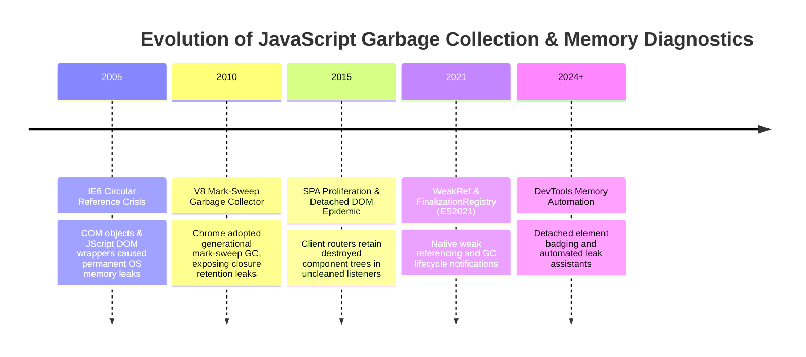
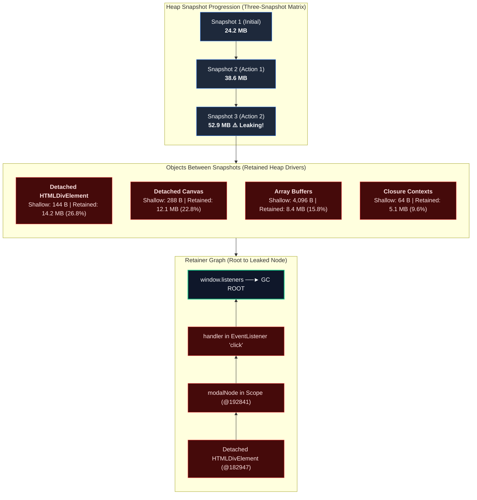

# Topic 03: Memory Leak Diagnosis & V8 Heap Snapshot Analysis

## 1. Why This Topic Exists
In traditional multi-page websites, memory leaks were largely forgiven because every page navigation destroyed the renderer process, discarding the entire JavaScript heap and returning memory to the operating system. In modern Single Page Applications (SPAs) and complex enterprise dashboards (trading terminals, healthcare monitoring, CRM suites), users keep the application running continuously in a single browser tab for 8 to 12 hours.

In this environment, an insidious memory leak—a forgotten `window.addEventListener`, an un-cleared `setInterval`, an unbounded cache `Map`, or a detached DOM tree retained by a closure—quietly accumulates megabytes of dead memory on every user action. Over time, the V8 heap expands from 50 MB to 1.5 GB. Minor garbage collections escalate into aggressive, multi-second Major Mark-Sweep-Compact pauses, locking the main thread, dropping frames, and culminating in the operating system silently terminating the tab with the dreaded "Out of Memory" crash (`STATUS_BREAKPOINT` / `Aw, Snap!`).

Mastering **V8 Heap Snapshots**, **Retainer Graphs**, **Shallow vs Retained Size**, and the **Three-Snapshot Technique** is essential for diagnosing and eliminating client memory leaks in production.

---

## 2. Learning Objectives
By mastering this chapter, you will be able to:
- Trace the lifecycle of V8 memory: GC Roots, Active Reachability, and Mark-Sweep-Compact garbage collection.
- Dissect the 5 classic frontend memory leaks: Detached DOM Trees, Uncleared Timers, Global Event Listeners, Unbounded Caches, and the Meteor Closure Leak.
- Distinguish between **Shallow Size** (direct object memory) and **Retained Size** (memory freed if object is destroyed).
- Execute the **Three-Snapshot Technique** in Chrome DevTools Memory Panel to isolate leaked objects deterministically.
- Navigate **Retainer Graphs** to identify the exact dominating reference holding dead objects in memory.
- Leverage modern JavaScript weak references: `WeakMap`, `WeakSet`, `WeakRef`, and `FinalizationRegistry` to build leak-proof caches.

---

## 3. Historical Evolution



<details className="raw-schematic-details">
<summary>📄 View Raw ASCII Schematic</summary>

```
+--------------------------------------------------------------------------------------------------+
|                                    CHRONOLOGICAL EVOLUTION                                       |
+--------------------------------------------------------------------------------------------------+
| 2005 - Internet Explorer 6 Circular Reference Crisis: Circular references between COM objects     |
|        and JScript DOM wrappers caused permanent OS memory leaks until browser process killed.  |
|                                                                                                  |
| 2010 - V8 Mark-Sweep Garbage Collector: Chrome adopts modern generational mark-sweep GC,       |
|        eliminating circular reference leaks, but exposing closure retention leaks.             |
|                                                                                                  |
| 2015 - SPA Proliferation & Detached DOM Epidemic: Complex client-side routers retain destroyed   |
|        page component DOM trees in uncleaned event listeners.                                   |
|                                                                                                  |
| 2021 - WeakRef & FinalizationRegistry Standardized (ES2021): Native JavaScript primitives       |
|        allowing weak referencing and garbage collection lifecycle notifications.                |
|                                                                                                  |
| 2024+ - Chrome DevTools Memory Panel Automation: Automatic detached element badging and          |
|         DOM leak diagnostic assistants integrated directly into DevTools Elements & Memory.     |
+--------------------------------------------------------------------------------------------------+
```

</details>

---

## 4. First Principles & Intuitive Physical Analogies (Layer 1)

### Analogy 1: The Helium Balloon and the Tangled String (GC Roots & Retainers)
Imagine a room filled with helium balloons:
- **The Ceiling:** The Root of the World (**GC Root**: `window`, `document`, active call stack frames).
- **The Balloon:** A JavaScript object or DOM element.
- **The String:** A reference pointer (`obj.child = childObj`).
- If a balloon is tied to the ceiling by even a single microscopically thin thread, it **cannot be vacuumed away by the cleanup crew (Garbage Collector)**.
- If you remove a modal dialog from the screen, but an event listener on `window` still holds a reference to one small button inside that dialog, the string is still connected to the ceiling! The entire dialog, all its 500 child DOM elements, images, and state objects **remain floating in memory** as a **Detached DOM Tree**.

### Analogy 2: Shallow Size vs Retained Size (The King vs The Royal Entourage)
Imagine an emperor traveling with an army:
- **Shallow Size:** How much the emperor weighs personally on a bathroom scale (e.g. 80 kg). An empty JavaScript object or a single DOM node itself takes only 32 to 64 bytes of memory.
- **Retained Size:** The entire weight of the emperor, plus his armor, his 500 guards, horses, carriages, and supply wagons. If the emperor is eliminated, **the entire entourage disbands and leaves the kingdom**.
- When diagnosing memory leaks in DevTools, **always sort by Retained Size**, never Shallow Size!

---

## 5. Internal Working & Engine Architecture (Layer 2)

### 1. V8 Reachability & The Dominator Tree
V8 garbage collection determines what to free by tracing object reachability starting from **GC Roots**:

```
+--------------------------------------------------------------------------------------------------+
|                                     DOMINATOR TREE TOPOLOGY                                      |
+--------------------------------------------------------------------------------------------------+
|                                                                                                  |
|   [GC ROOT: window]                                                                              |
|          │                                                                                       |
|          ├── Event Listener: "resize"                                                            |
|          │        │                                                                              |
|          │        ▼ (Retains closure scope)                                                      |
|          │    [Closure Scope: handleResize]                                                      |
|          │        │                                                                              |
|          │        ▼ (Retains variable `cachedModal`)                                             |
|          │    [Detached HTMLDivElement: #checkout-modal] (DOM Node detached from document)       |
|          │        │                                                                              |
|          │        ├── Child: <ul>                                                                |
|          │        ├── Child: <li> (x 1,000 product rows)                                         |
|          │        └── Child:  (x 1,000 heavy image bitmaps)                                 |
|          │                                                                                       |
|          └── Active Document DOM (Clean UI)                                                      |
|                                                                                                  |
| Consequence: Because `window.resize` holds `handleResize`, 25 megabytes of detached DOM           |
| tree memory CANNOT be reclaimed by V8 Garbage Collector!                                         |
+--------------------------------------------------------------------------------------------------+
```

### 2. The 5 Classic Frontend Memory Leaks
1. **Detached DOM Tree:** Removing an element with `parentNode.removeChild()` while JavaScript still holds a variable reference or event listener pointing to it.
2. **Uncleared Timers:** `setInterval(() => { doWork(heavyData); }, 1000)` where `clearInterval` is never called in component unmount cleanup.
3. **Global Event Listeners:** `window.addEventListener('scroll', handler)` without a corresponding `removeEventListener`.
4. **The Meteor Closure Leak:** When an outer function creates two closures, one referencing a large variable and the other long-lived, V8's shared `Context` allocates the large variable on the shared heap context, preventing it from ever being collected.
5. **Unbounded Caches:** `const cache = new Map();` accumulating entries indefinitely without a Least-Recently-Used (LRU) eviction limit or weak referencing.

---

## 6. Runtime Flow & Execution Traces

### The Three-Snapshot Technique Execution Flow
The authoritative, reproducible methodology for finding memory leaks:

```
DevTools Memory Panel              Application User Action                      Heap Analysis State
          |                                   |                                          |
          | 1. Take Snapshot 1 (Baseline)     |                                          |
          |----------------------------------------------------------------------------->|
          |                                   |                                          |
          |                                   | 2. Perform Action (e.g., Open Modal)     |
          |                                   |    and Reverse Action (Close Modal)      |
          |                                   |----------------------------------------->|
          |                                   |                                          |
          | 3. Force Manual GC (Trash Can Icon)|                                         |
          | 4. Take Snapshot 2                |                                          |
          |----------------------------------------------------------------------------->|
          |                                   |                                          |
          |                                   | 5. Repeat Action (Open Modal)            |
          |                                   |    and Reverse Action (Close Modal)      |
          |                                   |----------------------------------------->|
          |                                   |                                          |
          | 6. Force Manual GC (Trash Can Icon)|                                         |
          | 7. Take Snapshot 3                |                                          |
          |----------------------------------------------------------------------------->|
          |                                                                              |
          | 8. Select Snapshot 3                                                         |
          | 9. Switch View from "Summary" to "Objects allocated between Snapshot 1 and 2"|
          | 10. Filter by: "Detached"                                                    |
          | ===> REVEALS EXACT LEAKED OBJECTS THAT SURVIVED ACTION REVERSAL!             |
```

---

## 7. Memory Model & Heap Layout

### Retainer Graph Trace in Chrome DevTools
When inspecting a leaked object in the Memory Panel, the **Retainers Tree** shows the chain of ownership from the object up to the root:

```
Object: Detached HTMLDivElement @182947 (Shallow: 72 B, Retained: 14,248,320 B)
├── [retained by] element in closure context @192841
│   ├── [retained by] context in event listener "click"
│   │   ├── [retained by] listeners in EventTarget (HTMLButtonElement #global-fab)
│   │   │   └── [retained by] native DOM document tree ===> GC ROOT!
```
To fix the leak, you cut the string at any point in the retainer chain (e.g., remove the click event listener on `#global-fab` when unmounting).

---

## 8. Visual Diagrams (ASCII / Text)

### DevTools Memory Panel: Three-Snapshot Matrix



<details className="raw-schematic-details">
<summary>📄 View Raw ASCII Schematic</summary>

```
+---------------------------------------------------------------------------------------------+
|                                CHROME DEVTOOLS HEAP SNAPSHOT                                |
+---------------------------------------------------------------------------------------------+
| Snapshot 1 (Initial): 24.2 MB                                                               |
| Snapshot 2 (After Action 1): 38.6 MB                                                        |
| Snapshot 3 (After Action 2): 52.9 MB  <--- GROWING HEAP CONFIRMS ACTIVE LEAK!               |
+---------------------------------------------------------------------------------------------+
| Class Filter: [ Detached                      ]  Perspective: [ Objects between Snap 1 & 2 ]|
+--------------------+--------------+-------------------+---------------+---------------------+
| Constructor        | Distance     | Shallow Size (B)  | Retained Size | % of Total Heap     |
+--------------------+--------------+-------------------+---------------+---------------------+
| Detached HTMLDivEl | 6            | 144 B             | 14.2 MB       | 26.8%               |
| Detached Canvas    | 7            | 288 B             | 12.1 MB       | 22.8%               |
| Array              | 4            | 4,096 B           | 8.4 MB        | 15.8%               |
| Closure            | 5            | 64 B              | 5.1 MB        | 9.6%                |
+--------------------+--------------+-------------------+---------------+---------------------+
| Retainers View (Bottom Pane):                                                               |
|  v Detached HTMLDivElement @182947                                                          |
|    v modalNode in Scope @192841                                                             |
|      v handler in EventListener "click"                                                     |
|        v window.listeners                                                                   |
+---------------------------------------------------------------------------------------------+
```

</details>

---

## 9. Real World Usage & Production Patterns

> 🧪 **Companion Interactive Lab:** [LabComponent.tsx](../../apps/portal/src/features/visualizers/topic-08-performance/LabComponent.tsx) | Live in Portal: `topic-08-performance`

### Pattern 1: Memory-Safe Event Listener Hook (`useEventListener.ts`)

```typescript
import { useEffect, useRef } from 'react';

/**
 * Enterprise hook guaranteeing 100% leak-proof event listener attachment.
 * Automatically cleans up listeners on component unmount or target change.
 */
export function useEventListener<K extends keyof WindowEventMap>(
  eventName: K,
  handler: (event: WindowEventMap[K]) => void,
  element: Window | HTMLElement | null = typeof window !== 'undefined' ? window : null
): void {
  // Save current handler in ref so changing handler doesn't cause listener re-subscription
  const savedHandler = useRef(handler);

  useEffect(() => {
    savedHandler.current = handler;
  }, [handler]);

  useEffect(() => {
    if (!element || !element.addEventListener) return;

    // Define listener calling latest handler ref
    const eventListener = (event: Event) => {
      savedHandler.current(event as WindowEventMap[K]);
    };

    element.addEventListener(eventName, eventListener);

    // CRITICAL: Cleanup function MUST execute on unmount to prevent Detached DOM / window leak!
    return () => {
      element.removeEventListener(eventName, eventListener);
    };
  }, [eventName, element]);
}
```

### Pattern 2: Leak-Proof Ephemeron Cache with `WeakMap` & `FinalizationRegistry`

```typescript
/**
 * LRU Cache backed by WeakMap.
 * When the key object is garbage collected by V8, the cache entry is automatically reclaimed!
 */
export class EphemeronCache<K extends object, V> {
  private weakMap = new WeakMap<K, V>();
  private registry: FinalizationRegistry<string>;

  constructor(onEvicted?: (keyId: string) => void) {
    this.registry = new FinalizationRegistry<string>((keyId) => {
      if (onEvicted) {
        onEvicted(keyId);
      }
    });
  }

  public set(key: K, value: V, keyIdentifier?: string): void {
    this.weakMap.set(key, value);
    if (keyIdentifier) {
      // Register for cleanup notification when key object is GC-ed
      this.registry.register(key, keyIdentifier);
    }
  }

  public get(key: K): V | undefined {
    return this.weakMap.get(key);
  }

  public has(key: K): boolean {
    return this.weakMap.has(key);
  }
}
```

---

## 10. Angular Comparison

| Memory Management Feature | Modern React Implementation | Angular Enterprise Implementation |
| :--- | :--- | :--- |
| **Subscription Lifecycle** | `useEffect` return cleanup callback (`return () => sub.unsubscribe()`). | RxJS `takeUntilDestroyed(this.destroyRef)` or `async` pipe auto-unsubscribing in templates. |
| **Component Destruction** | Component unmount hook (`useEffect(..., [])`). | `ngOnDestroy()` lifecycle interface or `DestroyRef` injection token. |
| **Detached DOM Leaks** | Holding references to unmounted component root nodes in state or refs. | Element references injected via `ElementRef` held in long-lived Injectable services. |
| **Zone.js Microtask Leaks** | Plain JavaScript event listener leaks. | Async operations registered inside NgZone (`Zone.current.fork()`) preventing zone cleanup if un-cancelled. |

---

## 11. .NET Comparison

| Memory Concept | Frontend V8 Engine | .NET 10 CLR Engine |
| :--- | :--- | :--- |
| **Generational Garbage Collection**| Two Spaces: New Space (Semi-spaces) and Old Space. | Three Generations: Gen 0 (Short-lived), Gen 1 (Buffer), Gen 2 (Long-lived) + LOH (Large Objects). |
| **Event Listener Leaks** | `window.addEventListener` without `removeEventListener`. | C# Event subscription `publisher.Event += OnEvent;` without `-=` in `Dispose()`. |
| **Deterministic Cleanup** | `useEffect` return cleanup function. | `IDisposable` and `IAsyncDisposable` implemented via `using` statements. |
| **Weak References** | `WeakMap`, `WeakSet`, `WeakRef<T>`. | `WeakReference<T>` allowing GC collection while maintaining object handle. |

---

## 12. Enterprise Perspective & Production Risks (Layer 4)

### 1. The Single Page Application "Shift Worker" Crash
A customer support agent opens a CRM dashboard at 9:00 AM and handles 200 customer tickets over an 8-hour shift without refreshing the tab:
- Each ticket view leaks a 5 MB Detached DOM Tree (rich text editor + customer history chart).
- After 100 tickets, the browser tab consumes **500 MB** of dead memory.
- After 200 tickets, the heap surpasses **1.2 GB**. The browser begins freezing for 2 seconds on every click due to continuous Major GC cycles, eventually crashing with `Aw, Snap!`.
**Enterprise Remedy:** Implement automated memory leak smoke tests in Playwright / Puppeteer that open and close key views 50 times in a loop, asserting that heap size returns to baseline within a 5% margin.

### 2. Leaking Closures via Console Logging in Production
In Chrome DevTools, passing variables to `console.log(heavyObject)` **prevents `heavyObject` from being garbage collected** while the DevTools console remains open!
**Enterprise Remedy:** Strip all `console.log` statements in production builds using Terser or SWC minifier plugins (`drop_console: true`).

---

## 13. Performance Considerations

### 1. GC Pause Latency vs Heap Size
V8 garbage collection pause times scale with the size and complexity of the heap:
- A healthy 30 MB heap executes Minor GC in **<1ms** and Major GC in **5ms–15ms**.
- A bloated 800 MB leaked heap can take **80ms–250ms** for a Major GC pause, completely paralyzing 60 FPS animations and triggering INP violations!

---

## 14. Tradeoffs

| Technique | Advantages | Disadvantages / Trade-offs |
| :--- | :--- | :--- |
| **`WeakMap` Caching** | Absolute zero leak guarantee; automatic V8 reclamation. | Non-enumerable (cannot loop over keys or count cache size); keys must be objects. |
| **Manual `dispose()` APIs** | Explicit, deterministic teardown of resources. | Relies on developer discipline; prone to human omission bugs. |
| **Three-Snapshot Technique** | Mathematically proves leaks with 100% precision. | Labor-intensive; requires isolated testing without noisy background timers. |

---

## 15. Common Mistakes & Interview Traps

### Trap 1: Sorting Heap Snapshots by Shallow Size
- **The Mistake:** Sorting by "Shallow Size" and spending hours optimizing strings and numbers.
- **The Reality:** Shallow size only tells you what the object itself weighs (typically 32 bytes). **Always sort by Retained Size** to see which object is holding an entire tree of downstream memory hostage!

### Trap 2: Believing `delete obj.property` Is the Same as Garbage Collection
- **The Mistake:** Writing `delete user.cache` and expecting instant memory reclamation.
- **The Reality:** `delete` alters V8 Hidden Classes (Shapes), slowing down future property lookups by kicking objects into slow dictionary mode. To allow GC, simply set the reference to `null` or `undefined` (`user.cache = null`).

---

## 16. Interview Questions & Architectural Answers (Senior, Lead, Architect - Layer 5)

### Staff/Principal Question: A production React trading dashboard displays a memory leak that manifests only after several hours of continuous operation. Walk me through your end-to-end diagnosis and remediation protocol.
**Architectural Answer:**
1. **Reproduction in Clean Environment:** Launch Chrome in Incognito with extensions disabled. Open the dashboard.
2. **Execute Three-Snapshot Technique:**
   - Take Snapshot 1 (Baseline).
   - Trigger the high-frequency trading view (open and close market depth chart 10 times).
   - Force manual Garbage Collection in DevTools. Take Snapshot 2.
   - Repeat the open/close cycle 10 more times. Force GC. Take Snapshot 3.
3. **Isolate Leaked Objects:**
   - Select Snapshot 3, switch view to "Objects allocated between Snapshot 1 and Snapshot 2".
   - Filter by "Detached" to check for unmounted React Fiber trees or Canvas contexts.
4. **Inspect Retainer Graphs:**
   - Expand the leaked `Detached HTMLCanvasElement`.
   - Trace up the Retainers pane to identify the root retainer: locate whether it is an uncleared `requestAnimationFrame` loop, a WebSocket message subscription closure, or a `ResizeObserver` attached to `window`.
5. **Implement Remediation:**
   - Add explicit cleanup in `useEffect` return functions (`cancelAnimationFrame`, `observer.disconnect()`, `ws.removeEventListener`).
6. **Automate CI Regression Prevention:**
   - Add a Playwright memory test measuring `performance.memory.usedJSHeapSize` across 20 simulated route transitions, asserting zero monotonic memory growth.

---

## 17. Senior-Level Mental Model & "How to Remember This Forever" (Memory Anchors - Layer 3)

### The "Ghost Ship at Anchor" Mental Model
- **The Detached DOM Tree:** A ghost ship that has sailed away from the harbor (removed from the document DOM), but someone left an anchor rope tied to a bollard on the pier (an event listener on `window`).
- **The Fix:** Cut the rope (`removeEventListener`). The ship drifts out to sea and the V8 garbage collector sinks it.

---

## 18. Core Vocabulary & "Aha!" Breakthrough Insights (Refresher)

- **GC Root:** Objects accessible directly by the runtime (`window`, active call stack frames) from which reachability begins.
- **Shallow Size:** Memory held directly by the object itself (excluding referenced children).
- **Retained Size:** Memory that will be automatically freed if the object and its dominator sub-tree are garbage collected.
- **Detached DOM Tree:** DOM nodes removed from the active HTML document that remain alive on the V8 heap due to JavaScript references.
- **WeakMap:** Key-value store where keys are weakly held objects that do not prevent garbage collection.
- **Three-Snapshot Technique:** Profiling pattern isolating objects that survive reversible user actions across garbage collections.

---

## 19. Key Takeaways
1. Always clean up event listeners, intervals, and observers in `useEffect` cleanup returns.
2. Sort DevTools Heap Snapshots by **Retained Size**, never Shallow Size.
3. Use the **Three-Snapshot Technique** to eliminate false-positive memory noise.
4. Detached DOM nodes are the #1 cause of catastrophic client-side memory exhaustion.
5. Use `WeakMap` for caching data associated with DOM nodes or components.

---

## 20. Revision Sheet

```
+--------------------------------------------------------------------------------------------------+
|                                    MEMORY LEAK CHEAT SHEET                                       |
+--------------------------------------------------------------------------------------------------+
| The 3-Snapshot Recipe:                                                                           |
| 1. Snapshot 1: Baseline.                                                                         |
| 2. Action + Reverse Action -> Click Trash Can (GC) -> Snapshot 2.                                |
| 3. Repeat Action + Reverse Action -> Click Trash Can (GC) -> Snapshot 3.                         |
| 4. Select Snapshot 3 -> "Objects allocated between Snapshot 1 and 2" -> Filter "Detached".      |
|                                                                                                  |
| Golden Code Rules:                                                                               |
| - Every `addEventListener` MUST have a matching `removeEventListener`.                           |
| - Every `setInterval` MUST have a matching `clearInterval`.                                      |
| - Every `ResizeObserver` / `IntersectionObserver` MUST call `.disconnect()`.                     |
| - Use `WeakMap` for object-keyed caches.                                                         |
+--------------------------------------------------------------------------------------------------+
```
