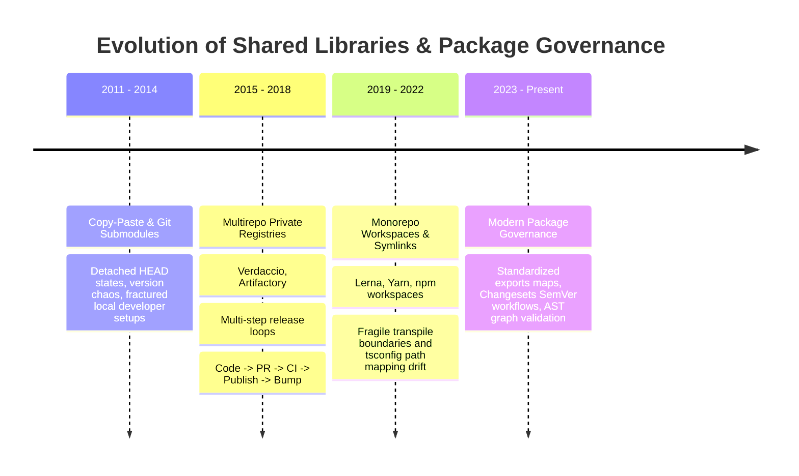
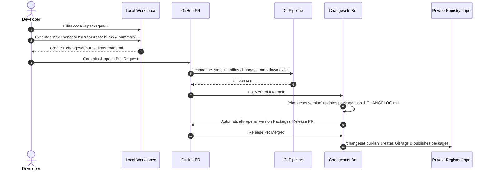

# Phase 09 — Topic 03: Shared Libraries, Package Governance & SemVer

## 1. Why This Topic Exists
In high-growth engineering organizations, code duplication accelerates technical debt, fragmentation, and divergent domain logic. When ten frontend squads independently implement currency formatters, HTTP interceptors, authentication guards, and validation schemas, subtle divergence introduces security vulnerabilities, compliance failures, and inconsistent customer experiences.

Shared libraries solve this fragmentation by providing single-source-of-truth modules across corporate applications. However, naive library sharing frequently creates worse pathologies than duplication: "Dependency Hell," catastrophic breaking releases, brittle coupling, cascading build failures, circular workspace graphs, and bloated production bundles. Without rigorous package governance, semantic versioning protocols, and boundary isolation, a shared library repository degrades into an unmaintainable dumping ground where no team dares update dependencies.

Architects must master the mechanics of package boundary design, version resolution, release automation (such as Changesets), and module consumption models (compiled packages versus source-mapped internal packages) to maintain developer velocity and enterprise stability.

---

## 2. Learning Objectives
By completing this chapter, you will be able to:
- Architect the boundary between **Publishable Packages** (distributed via private artifact registries) and **Internal Workspace Packages** (consumed directly via monorepo symlinks).
- Enforce strict **Semantic Versioning (SemVer 2.0.0)** workflows using automated tooling like `@changesets/cli`.
- Configure modern `package.json` entry points using standard `exports`, `imports`, `types`, and subpath conditional resolutions.
- Manage `dependencies`, `devDependencies`, and `peerDependencies` to eliminate duplicate runtime instances (e.g., dual React runtimes).
- Detect and prevent circular package dependencies using directed acyclic graph (DAG) analyzers and ESLint boundary rules.
- Design automated dependency governance pipelines using Renovate, automated lockfile upgrades, and semantic release gates.

---

## 3. Historical Evolution


<details className="raw-schematic-details">
<summary>📄 View Raw ASCII Schematic</summary>

```
+---------------------------------------------------------------------------------------------------+
| 2011 - 2014: Copy-Paste & Git Submodules                                                          |
| Code shared via git submodules or copy-pasting. Submodules suffered detached HEAD states,        |
| version tracking chaos, and fractured local developer setups.                                    |
+---------------------------------------------------------------------------------------------------+
                                                  |
                                                  v
+---------------------------------------------------------------------------------------------------+
| 2015 - 2018: Multirepo Private Registries (Verdaccio, Artifactory)                                |
| Every shared utility lived in an isolated Git repo published to a private npm registry.           |
| Cross-repo bug fixing required multi-step release loops: Code -> PR -> CI -> Publish -> Bump.     |
| Developer feedback loops stretched from minutes to entire days.                                   |
+---------------------------------------------------------------------------------------------------+
                                                  |
                                                  v
+---------------------------------------------------------------------------------------------------+
| 2019 - 2022: Monorepo Workspaces & Symlinked Packages (Lerna, Yarn, npm workspaces)              |
| Workspaces enabled symlinked local packages. However, bundler transpile boundaries were          |
| fragile; tsconfig path mapping created runtime module-resolution drift against production npm.  |
+---------------------------------------------------------------------------------------------------+
                                                  |
                                                  v
+---------------------------------------------------------------------------------------------------+
| 2023 - Present: Modern Package Governance (Changesets, Dual ESM/CJS, Conditional Exports)         |
| Standardized Node.js `exports` maps, zero-build workspace consumption with Next.js/Vite,        |
| Changesets for automated SemVer PR workflows, and strict AST graph validation via Turborepo/Nx.   |
+---------------------------------------------------------------------------------------------------+
```

</details>

---

## 4. First Principles & Intuitive Physical Analogies (Layer 1)
Think of shared library governance through physical engineering analogs:

### Analogy 1: The Standard Shipping Container (Publishable vs. Internal Packages)
An **Internal Workspace Package** is like an open conveyor belt inside an automated factory. As long as parts remain on the factory floor, robotic arms can grab raw, unpainted metal parts immediately without packaging, customs inspection, or shipping labels. It enables instant iteration.
A **Publishable Package** is an ISO-certified shipping container loaded onto an ocean freighter. It must have standardized corner castings (manifests), barcode manifests (`package.json` export maps), safety certifications (types declaration maps), and weatherproofing (pre-bundled, minified artifacts). It operates across foreign factory docks (other repos and build systems) that do not know your internal tools.

### Analogy 2: The Railroad Gauge Specification (`peerDependencies`)
Suppose a railway car company builds passenger cars. The passenger car does not come with its own set of steel rails attached to the wheels; it expects the railway owner to provide standard 1,435 mm steel tracks.
If the passenger car bundled its own rails (`dependencies`), placing it on an existing track would cause an immediate, catastrophic collision of dual conflicting rail beds. `peerDependencies` declare: *"I run on React version 19.x. You, the host platform, must supply this runtime track; I will plug into it."*

### Analogy 3: The Sealed Precision Meter (Semantic Versioning 2.0.0)
SemVer is a contract stamped onto an instrument:
- **PATCH (`x.y.Z`)**: Calibrating internal gears. The dials and mounting bolts remain completely identical. Safe to replace hot.
- **MINOR (`x.Y.z`)**: Adding a secondary readout gauge on the faceplate. Old needles read identically; new readouts are available for those who want them. Fully backwards compatible.
- **MAJOR (`X.y.z`)**: Altering the high-voltage plug shape or mounting bolt positions. If you attempt to plug this in without re-drilling your chassis, the factory shorts out.

---

## 5. Internal Working & Engine Architecture (Layer 2)

### Package Boundary Architecture & Resolution Flow
When Node.js or bundlers (Vite, Webpack, esbuild) encounter an import like `import { Button } from '@acme/ui'`, modern resolution bypasses legacy `main` and evaluates the `exports` map in `@acme/ui/package.json`:

```
              import { Button } from '@acme/ui'
                             |
                             v
           Inspect packages/ui/package.json
                             |
          +------------------+------------------+
          |                                     |
   Vite / Modern Bundler               Node.js CJS Runtime
          |                                     |
   Evaluate condition:                   Evaluate condition:
   "import": "./dist/index.mjs"          "require": "./dist/index.cjs"
   "types": "./dist/index.d.ts"          "types": "./dist/index.d.ts"
          |                                     |
          +------------------+------------------+
                             |
          Validate Single Instance Constraints
      (Ensure @acme/ui resolves host's 'react' peer)
```

### The Structure of a Production `package.json` Export Map
```json
{
  "name": "@acme/ui",
  "version": "2.4.1",
  "type": "module",
  "exports": {
    ".": {
      "types": "./dist/index.d.ts",
      "import": "./dist/index.js",
      "require": "./dist/index.cjs"
    },
    "./button": {
      "types": "./dist/button.d.ts",
      "import": "./dist/button.js",
      "require": "./dist/button.cjs"
    },
    "./package.json": "./package.json"
  },
  "main": "./dist/index.cjs",
  "module": "./dist/index.js",
  "types": "./dist/index.d.ts",
  "sideEffects": false,
  "peerDependencies": {
    "react": ">=18.2.0 <20.0.0",
    "react-dom": ">=18.2.0 <20.0.0"
  },
  "devDependencies": {
    "@types/react": "^19.0.0",
    "react": "^19.0.0",
    "react-dom": "^19.0.0",
    "typescript": "^5.5.0"
  }
}
```

### Critical Resolution Rules
1. **`sideEffects: false`**: Signals to the bundler that unused named exports can be aggressively tree-shaken from consumers. If a package contains global CSS imports (`import './styles.css'`), `sideEffects` must explicitly list `["*.css"]` or CSS will be dropped during production optimization.
2. **Subpath Conditional Ordering**: In `package.json` `exports`, `types` must always precede `import` and `require`. Bundlers parse top-down; reversing the order causes TypeScript language servers to miss typing definitions.

---

## 6. Runtime Flow & Execution Traces

### Trace: Resolution of a Shared React Component with `peerDependencies`
Here is what occurs step-by-step when an application consumes a shared UI library:

```
Step 1: Host App ('apps/web') runs:
        import { Modal } from '@acme/ui';
        import { useState } from 'react';

Step 2: Bundler module resolver resolves '@acme/ui' via node_modules/@acme/ui/package.json.
        Matches "exports": { ".": { "import": "./dist/index.js" } }.

Step 3: Resolver scans '@acme/ui/dist/index.js' AST imports:
        import { useEffect } from 'react';

Step 4: Hoisted Peer Resolution:
        - Does '@acme/ui/node_modules/react' exist? (NO - peerDependencies are not installed nested).
        - Resolver traverses up to host 'apps/web/node_modules/react' or root monorepo 'node_modules/react'.
        - SUCCESS: Single React instance bound to memory address 0x00A1F.

Step 5: Runtime Fiber Mounting:
        React runtime executes useState() in host app using memory 0x00A1F.
        React runtime executes useEffect() in @acme/ui using SAME memory 0x00A1F.
        Invariant check passes: React dispatcher hook context is shared.
```

If `@acme/ui` mistakenly declared `react` in `dependencies` instead of `peerDependencies`, a nested `node_modules/@acme/ui/node_modules/react` would be loaded at memory `0x00B99`. The host dispatcher throws:
`Error: Invalid hook call. Hooks can only be called inside the body of a function component.`

---

## 7. Memory Model & Package Dependency Graph Layout

```
MONOREPO DEPENDENCY TOPOLOGY (Directed Acyclic Graph)

                     [ apps/portal (App) ]
                           /        \
                          /          \
                         v            v
             [ @acme/feature-auth ]  [ @acme/feature-dashboard ]
                         \            /
                          \          /
                           v        v
                        [ @acme/ui-kit ]
                               |
                               v
                     [ @acme/core-utils ]
                               |
                               v
                       [ @acme/types ]

V8 RUNTIME HOISTED MODULE MAP IN BUNDLER MEMORY:

Module Table (Map):
+-------------------------+-------------------------+----------------------+
| Module Specifier        | Resolved Filepath       | Memory Instance      |
+-------------------------+-------------------------+----------------------+
| 'react'                 | /repo/node_modules/react| Instance #1 (Shared) |
| '@acme/types'           | /repo/packages/types    | Pure TS (Erased)     |
| '@acme/core-utils'      | /repo/packages/utils    | Instance #1 (Shared) |
| '@acme/ui-kit'          | /repo/packages/ui-kit   | Instance #1 (Shared) |
+-------------------------+-------------------------+----------------------+
```

---

## 8. Visual Diagrams (ASCII / Text)

### The Automated Release Cycle with Changesets



<details className="raw-schematic-details">
<summary>📄 View Raw ASCII Schematic</summary>

```
Developer Branch: feature/modal-a11y
       |
       | 1. Code Changes made in packages/ui
       v
Run: npx changeset
       | Prompt: Which packages changed? -> @acme/ui
       | Prompt: Bump type? -> minor
       | Prompt: Summary? -> "Added keyboard trap to Modal dialog"
       v
Creates: .changeset/purple-lions-roam.md
       |
       | 2. Commit & Open Pull Request
       v
CI: Verify changesets exist via 'changeset status'
       |
       | 3. PR Merged to 'main'
       v
GitHub Action: 'changeset version'
       | - Consumes markdown changeset files
       | - Bumps packages/ui/package.json to 2.5.0
       | - Updates CHANGELOG.md automatically
       | - Opens "Version Packages" Release PR
       v
Release PR Merged:
       | - Action runs 'changeset publish'
       | - Publishes to Private npm Registry / GitHub Packages
       | - Creates Git Tags (e.g., @acme/ui@2.5.0)
```

</details>

---

## 9. Real World Usage & Production Patterns

> 🧪 **Companion Interactive Lab:** [LabComponent.tsx](../../apps/portal/src/features/visualizers/topic-09-architecture/LabComponent.tsx) | Live in Portal: topic-09-architecture

### Pattern 1: Changeset Definition File (`.changeset/calm-pandas-sing.md`)
```markdown
---
"@acme/ui": minor
"@acme/portal": patch
---

Added keyboard focus trap and ARIA announcement support to Modal primitive.
Consumers using custom triggers should verify focus restoration behavior.
```

### Pattern 2: Enforcing Package Boundary Rules with ESLint
Prevent lower-level packages from importing higher-level feature logic:

```javascript
// .eslintrc.js (or eslint.config.mjs)
export default [
  {
    rules: {
      'import/no-restricted-paths': [
        'error',
        {
          zones: [
            // Core utils cannot import from UI or Features
            {
              target: './packages/core-utils',
              from: './packages/ui-kit',
              message: 'Violates Architecture: Core utils cannot depend on UI kit.'
            },
            {
              target: './packages/ui-kit',
              from: './packages/feature-*',
              message: 'Violates Architecture: UI primitives cannot depend on business features.'
            },
            // Features cannot import other sibling features directly
            {
              target: './packages/feature-auth',
              from: './packages/feature-billing',
              message: 'Features must communicate via events or core state, not direct coupling.'
            }
          ]
        }
      ]
    }
  }
];
```

### Pattern 3: Dual Compilation Config (TSUP / Rollup)
```typescript
// packages/ui/tsup.config.ts
import { defineConfig } from 'tsup';

export default defineConfig({
  entry: ['src/index.ts', 'src/button.ts', 'src/modal.ts'],
  format: ['esm', 'cjs'],
  dts: true,
  splitting: true,
  sourcemap: true,
  clean: true,
  treeshake: true,
  external: ['react', 'react-dom'],
  minify: process.env.NODE_ENV === 'production'
});
```

---

## 10. Angular Comparison
For an engineer transitioning from enterprise Angular:

| Architectural Concept | Enterprise Angular Ecosystem | Modern React / TypeScript Ecosystem |
| :--- | :--- | :--- |
| **Library Scaffolding** | `ng generate library my-lib` creates secondary entrypoints via `ng-package.json`. | Configured via `package.json` subpath exports and tools like `tsup`, `unbuild`, or Vite library mode. |
| **Secondary Entry Points** | `package.json` sub-entry points (`@angular/common/http`, `@angular/material/button`). | Standard Node.js `exports` subpaths (`@acme/ui/button`, `@acme/ui/modal`). |
| **Singleton Services** | `providedIn: 'root'` registers singletons across all lazy-loaded bundles in the root injector. | Dependent on single module instance in memory or React Context provider mounted at tree root. |
| **Peer Dependencies** | Angular CLI automatically aligns `@angular/core` peer dependencies across libraries. | Explicitly managed in `peerDependencies` with semantic version ranges to prevent dual React runtimes. |
| **Build Pipeline** | Angular Package Format (APF) compiled by `ng-packagr` to flat ES modules (FESM). | Dual ESM/CJS or direct source TypeScript transpilation (e.g. Next.js `transpilePackages`). |

---

## 11. .NET Comparison
For a Senior .NET / ASP.NET Core Architect:

| Architectural Concept | .NET / C# Ecosystem | React / TypeScript Ecosystem |
| :--- | :--- | :--- |
| **Package Definition** | `.csproj` file with `<PackageReference>` and `<ProjectReference>`. | `package.json` with `dependencies`, `peerDependencies`, and `workspace:*` references. |
| **Package Packaging** | `dotnet pack` producing `.nupkg` ZIP archives containing compiled assemblies. | `npm pack` or `tsup` compiling to `.tgz` containing ES modules, CJS, and `.d.ts` declaration maps. |
| **Internal vs External** | Project References (`<ProjectReference Include="../Lib/Lib.csproj" />`) vs NuGet packages. | Workspace protocols (`"dependencies": { "@acme/ui": "workspace:*" }`) vs registry packages. |
| **Dependency Clashes** | Assembly Binding Redirects / Runtime Assembly Load Contexts handling version conflicts. | npm flat node_modules hoisting, pnpm hardlinks/symlinks, or peerDependency failure alerts. |
| **Versioning Protocol** | `MinVer` or `GitVersion` computing SemVer from Git commit tags during MSBuild. | `@changesets/cli` collecting markdown change intents in PRs to automate SemVer bumping. |

---

## 12. Enterprise Perspective & Production Risks (Layer 4)

### The "Diamond Dependency" Catastrophe
When `App` depends on `Lib-A` (requiring `Lib-C v1.0.0`) and `Lib-B` (requiring `Lib-C v2.0.0`):
- In npm/Yarn, if `Lib-C` exposes a React context or global singleton state, two isolated copies of `Lib-C` will be instantiated in memory.
- Components rendered by `Lib-A` will write to Context-Instance-1; components rendered by `Lib-B` will read from Context-Instance-2, resulting in silent runtime failure where state updates appear to vanish.

### Registry Poisoning & Supply Chain Tampering
- Internal packages must use scoped names (`@company-name/package-name`).
- Internal registries must configure **Dependency Confusion Protection**: if `@company-name/utils` is not registered on public npm, attackers can register it publicly with version `99.99.99`. Unconfigured build agents defaulting to public npm will download the attacker's package over the private internal package.

---

## 13. Performance Considerations
- **Source Consumption vs. Pre-Bundling**: In local monorepos, configuring bundlers (Next.js `transpilePackages`, Vite `optimizeDeps`) to consume raw TypeScript directly eliminates `watch` build steps for 5x faster hot module replacement (HMR). Pre-bundling with `tsup` should be reserved for cross-repo publishable artifacts.
- **Tree-Shaking Auditing**: Always test your library bundle through `bundle-analyzer` or `publint`. Avoid exporting large barrel files (`index.ts` re-exporting 500 components); prefer subpath exports (`@acme/ui/table`) to allow consumers to download only the necessary bytes.

---

## 14. Tradeoffs

| Architecture Choice | Primary Benefit | Operational Cost / Drawback |
| :--- | :--- | :--- |
| **Zero-Build Internal Packages** | Zero build step during development; instantaneous HMR; simplified tooling. | Consumers must support compiling TypeScript and identical JSX transforms. |
| **Pre-Compiled Dual ESM/CJS** | Maximum compatibility; can be consumed by legacy Node, Webpack, or external teams. | Slower CI builds; requires compilation step before consumers can see local edits. |
| **Strict Peer Dependencies** | Guarantees single runtime instance; prevents duplicate React bundles. | Stricter installation requirements; can break consumer builds during minor upgrades. |
| **Changesets Release Workflow** | Human-readable intent capture; prevents automated accidental breaking releases. | Developers must remember to run `changeset` on every PR affecting library packages. |

---

## 15. Common Mistakes & Interview Traps
- **Trap 1: Putting React in `dependencies` of a shared UI library.**
  - *Symptom*: Consumers crash with "Cannot read property of null (reading 'useReducer')" or "Multiple copies of React."
  - *Fix*: Move `react` and `react-dom` to `peerDependencies` and keep them in `devDependencies` for local testing.
- **Trap 2: Circular Package Dependencies.**
  - *Symptom*: Intermittent `undefined` imports at runtime during module loading order initialization.
  - *Fix*: Run `madge --circular packages/` or `nx graph` in CI to fail PRs introducing circular package links.
- **Trap 3: Forgetting `"sideEffects": false` in `package.json`.**
  - *Symptom*: Importing `import { Button } from '@acme/ui'` bundles the entire 5MB library including Charts and Grids.
  - *Fix*: Explicitly configure `"sideEffects": ["*.css"]` in the library `package.json`.

---

## 16. Interview Questions & Architectural Answers (Senior, Lead, Architect - Layer 5)

### Question 1 (Senior Level): Why does a library need `peerDependencies` instead of regular `dependencies` for React?
**Answer**:
React relies on a shared in-memory dispatcher singleton to manage active hooks (`useState`, `useEffect`, `useContext`). If a library specifies React as a standard `dependency`, package managers (npm/yarn) may install a nested instance under `node_modules/library/node_modules/react` if versions do not strictly match.
When the library executes hooks, it invokes the dispatcher belonging to its nested instance, while the host application uses the root instance. The nested dispatcher has no mounted Fiber root, throwing "Invalid hook call." Specifying React as a `peerDependency` instructs the package manager that the host application is required to provide the singleton instance at runtime.

### Question 2 (Lead Level): How do you design an automated SemVer release pipeline for 20+ interconnected packages in a monorepo?
**Answer**:
I implement `@changesets/cli` integrated with GitHub Actions:
1. **Developer Pull Request**: When a PR alters files in a package, CI runs `changeset status`. If changes are detected without an associated markdown changeset file in `.changeset/`, the PR check fails.
2. **Changeset Generation**: Developers run `npx changeset`, selecting the affected packages, SemVer bump type (patch, minor, major), and writing a human-readable release summary.
3. **Merge to Main**: A GitHub Action runs `changeset version`. This parses changesets, resolves version bumps, handles cross-package dependency cascades (bumping packages that depend on updated packages), updates individual `package.json` files and `CHANGELOG.md` files, and automatically commits them to a persistent "Version Packages" release PR.
4. **Publish Execution**: Once the release PR is approved and merged, the Action runs `changeset publish`, building artifacts via `tsup`, publishing to our private registry (Verdaccio/GitHub Packages), and tagging Git commits.

### Question 3 (Architect Level): How do you prevent dependency confusion attacks when your monorepo consumes both internal private packages and public npm packages?
**Answer**:
To eliminate dependency confusion:
1. **Scoped Namespace Ownership**: All internal packages use an organization scope (`@acme/core-utils`). We register and reserve the `@acme` scope on public npmjs.com with two-factor authentication and organization lockouts, preventing external actors from registering matching public packages.
2. **Registry Scoping in `.npmrc`**: We configure project-level `.npmrc` to strictly route scoped packages to the internal private registry:
   ```ini
   @acme:registry=https://npm.pkg.github.com
   //registry.npmjs.org/:_authToken=...
   ```
3. **Internal Artifact Virtual Repositories**: We route all outbound traffic through an enterprise registry proxy (Artifactory or Nexus) that enforces priority resolution: internal private repositories shadow and supersede public registries for internal package names.

---

## 17. Senior-Level Mental Model & "How to Remember This Forever" (Memory Anchors - Layer 3)

### The "Train Track vs. Train Car" Rule
- **The Application** is the **Track Infrastructure** (supplies React, ReactDOM, Node runtime).
- **The Shared Library** is the **Train Car** (declares `peerDependencies`: requires track gauge 19.x).
- **Never let a train car carry its own railway track.** If it drops its own rails, the train derails instantly.

---

## 18. Core Vocabulary & "Aha!" Breakthrough Insights (Refresher)
- **Changeset**: A markdown file recording version bump intentions and release notes committed alongside code in a feature branch.
- **Conditional Exports**: The modern Node.js `package.json` `"exports"` field mapping subpaths to specific runtime environments (`import`, `require`, `types`, `browser`).
- **Tree-Shaking**: The process where modern bundlers drop unused dead exports from the final bundle, relying on `"sideEffects": false`.
- **Hoisting**: Package manager optimization where common dependencies are moved to the root `node_modules` directory to avoid duplication.
- **Diamond Dependency**: A topological condition where package A depends on B and C, both of which depend on differing versions of D.

---

## 19. Key Takeaways
- Use **`peerDependencies`** for framework singletons (React, ReactDOM) to eliminate duplicate runtime instances.
- Never rely solely on `tsconfig.json` path mapping for library boundaries; configure explicit `package.json` `"exports"` maps.
- Use **Changesets** to decouple version bump intent from the actual publishing execution.
- Set `"sideEffects": false` (or specify CSS files) to allow consumer bundlers to tree-shake unused exports.
- Run automated DAG cycle detection (`madge` or `nx graph`) in CI to guarantee acyclic dependency architectures.

---

## 20. Revision Sheet
- **Q: What is the risk of using `dependencies` for React in a component library?**
  *A:* Duplication of the React runtime in memory, breaking hook dispatcher state and triggering "Invalid hook call."
- **Q: What is the purpose of `exports` over `main` in `package.json`?**
  *A:* Subpath encapsulation (preventing internal deep imports), dual ESM/CJS support, and environment-specific conditional resolution.
- **Q: How does `sideEffects: false` impact bundle size?**
  *A:* Informs bundlers that modules have no runtime side-effects, allowing 100% of unreferenced exports to be deleted during minification.
- **Q: What command creates a version changeset?**
  *A:* `npx changeset`
- **Q: What tool verifies package export validity against Node standards?**
  *A:* `publint` or `are-the-types-wrong`.
