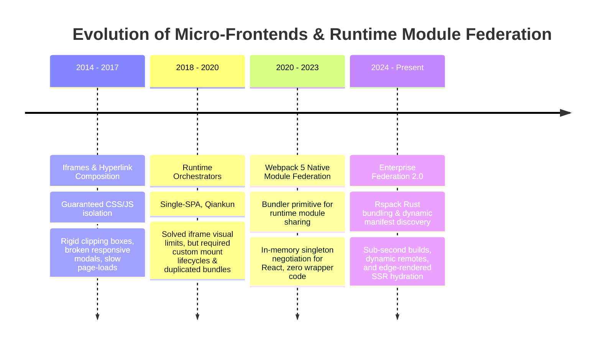
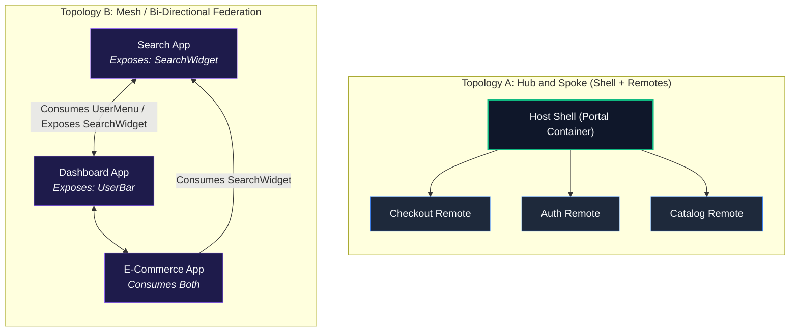

# Phase 09 — Topic 04: Micro-Frontends & Module Federation

## 1. Why This Topic Exists
As engineering organizations scale past hundreds of frontend developers across multiple distributed teams, monolithic single-page applications become organizational bottlenecks. Deployment coordination requires multi-squad synchronization meetings, a single broken test suite halts production releases for dozens of teams, and codebase compile times degrade from seconds to tens of minutes.

Micro-frontends emerged to decompose monolithic SPAs into independently developed, tested, and deployed frontend applications. While early micro-frontend techniques relied on crude iframes or runtime script loaders that suffered severe performance, layout, and state synchronization penalties, **Module Federation** (introduced in Webpack 5 and ported to modern bundlers like Rspack and Vite) revolutionized distributed frontends.

Module Federation enables independent runtime builds to dynamically share JavaScript modules, components, and libraries over the network with zero build-time coupling, automatic singleton negotiation, and seamless user experience. Architects must understand the internal mechanics, runtime container negotiation, network loading topologies, and resilience patterns required to build reliable federated architectures.

---

## 2. Learning Objectives
By completing this chapter, you will be able to:
- Evaluate the core trade-offs of micro-frontend paradigms: **Iframes**, **Single-SPA Orchestration**, and **Module Federation**.
- Configure Webpack 5 and Rspack `ModuleFederationPlugin` with hosts, remotes, exposed modules, and shared dependencies.
- Enforce strict singletons for framework runtimes (`react`, `react-dom`, `@tanstack/react-query`) to prevent broken hook dispatchers and duplicate memory allocations.
- Implement dynamic remote container resolution at runtime to decouple host builds from static remote deployment URLs.
- Design resilient UI fallback boundaries using React Suspense and Error Boundaries to safeguard host availability when remote CDNs experience outages.
- Architect bidirectional federation where applications act simultaneously as hosts and remotes.

---

## 3. Historical Evolution


<details className="raw-schematic-details">
<summary>📄 View Raw ASCII Schematic</summary>

```
+---------------------------------------------------------------------------------------------------+
| 2014 - 2017: Iframes & Hyperlink Composition                                                      |
| Micro-frontends isolated via iframes. Guaranteed CSS/JS isolation, but suffered severe UI        |
| limitations: rigid clipping boxes, broken responsive modals, slow page-loads, and heavy memory.   |
+---------------------------------------------------------------------------------------------------+
                                                  |
                                                  v
+---------------------------------------------------------------------------------------------------+
| 2018 - 2020: Runtime Orchestrators (Single-SPA, Qiankun)                                          |
| JavaScript packages loaded dynamically on route changes into a shared DOM. Solved iframe visual   |
| limitations, but required custom lifecycle hooks (mount/unmount) and suffered duplicate bundles.  |
+---------------------------------------------------------------------------------------------------+
                                                  |
                                                  v
+---------------------------------------------------------------------------------------------------+
| 2020 - 2023: Webpack 5 Native Module Federation                                                   |
| Bundler-level primitive allowing separate builds to dynamically exchange modules at runtime.       |
| In-memory singleton negotiation for React, shared vendor deduplication, and zero wrapper code.    |
+---------------------------------------------------------------------------------------------------+
                                                  |
                                                  v
+---------------------------------------------------------------------------------------------------+
| 2024 - Present: Enterprise Federation 2.0 & High-Speed Bundlers (Rspack, Vite Plugins)           |
| Module Federation 2.0 with sub-second Rust-based bundling (Rspack), dynamic remote manifest        |
| discovery, and edge-rendered micro-frontends with SSR hydration support.                          |
+---------------------------------------------------------------------------------------------------+
```

</details>

---

## 4. First Principles & Intuitive Physical Analogies (Layer 1)
Think of Module Federation through physical engineering analogs:

### Analogy 1: The Modular Aircraft Carrier (Host vs. Remote)
A naval aircraft carrier (The **Host Container**) provides propulsion, radar, a flight deck, and electric power grid. It does not construct every aircraft on board.
Instead, modular fighter jets and radar reconnaissance drones (The **Remote Micro-Apps**) land onto the carrier deck. They plug directly into the carrier's high-voltage power couplings and jet fuel lines (the **Shared Singletons**). If a fighter jet encounters engine trouble, the aircraft carrier does not sink; the hangar door closes and the crew deploys backup defense systems (The **Error Boundary**).

### Analogy 2: The Universal Electrical Grid (Shared Singletons & Version Negotiation)
If each appliance in an office brought its own diesel generator into the cubicle, the building would fill with exhaust and noise (bloated duplicate libraries).
Module Federation establishes an electrical wall socket standard. When the Host and Remote meet, they negotiate: *"I have 120V 60Hz power (React 19.0.0). Do you require this?"* Remote replies: *"Yes, my requirements are `>=18.2.0 <20.0.0`. I will turn off my internal generator and plug into yours."*

---

## 5. Internal Working & Engine Architecture (Layer 2)

### The Container and Remotes Runtime Architecture
When an application utilizes Module Federation, each build outputs a special container entrypoint (`remoteEntry.js`). This entrypoint contains a tiny runtime manifest that describes the exposed modules and its shared dependency requirements.

```
       [ Host Application: Shell (port 3000) ]
                      |
                      | 1. Evaluates React Tree
                      | 2. Reaches <Suspense><RemoteComponent /></Suspense>
                      v
       [ Module Federation Runtime ]
                      |
                      | 3. Dynamic Script Injection:
                      |    Loads 'http://cdn.company.com/billing/remoteEntry.js'
                      v
       [ Remote Container Entry (remoteEntry.js) ]
                      |
                      | 4. Executes Container Interface:
                      |    remote.init(__webpack_share_scopes__.default)
                      | 5. Version Negotiation:
                      |    Matches host React v19.0.0 with remote React peer
                      v
       [ Remote Container Internal Scope ]
                      |
                      | 6. Fetches Exposed Module:
                      |    remote.get('./BillingWidget')()
                      v
       [ Mounts <BillingWidget /> into Host React Fiber Tree ]
```

### The Container Interface
Every `remoteEntry.js` exposes two core asynchronous methods to the global scope:
1. `init(shareScope)`: Initializes the container with the host application's shared dependency registry (`__webpack_share_scopes__.default`).
2. `get(moduleName)`: Returns a factory function `() => Promise<Module>` that loads the specific compiled chunk containing the requested component.

---

## 6. Runtime Flow & Execution Traces

### Trace: Dynamic Remote Loading & Singleton Resolution
```
Step 1: Host initializes global '__webpack_share_scopes__.default'.
        Registers:
        {
          "react": { "19.0.0": { loaded: 1, get: () => Promise.resolve(React) } },
          "react-dom": { "19.0.0": { loaded: 1, get: () => Promise.resolve(ReactDOM) } }
        }

Step 2: Host encounters dynamic import:
        const RemoteBilling = lazy(() => import('billingApp/BillingWidget'));

Step 3: Webpack interceptor checks local registry for 'billingApp'.
        Downloads 'http://cdn.acme.com/billing/remoteEntry.js'.

Step 4: Host runs:
        window.billingApp.init(__webpack_share_scopes__.default);

Step 5: 'billingApp' checks share scope:
        - It needs 'react': found loaded instance 19.0.0. Satisfies '^19.0.0'.
        - Remote skips downloading its own React bundle chunk.
        - Reuses the Host's in-memory React instance.

Step 6: Host invokes:
        window.billingApp.get('./BillingWidget').then(factory => {
          const Module = factory();
          // Successfully mounts Module into the Host's Virtual DOM
        });
```

---

## 7. Memory Model & Shared Scopes Layout

```
V8 HEAP MEMORY - RUNTIME MODULE FEDERATION LAYOUT

+--------------------------------------------------------------------------+
| GLOBAL OBJECT (window)                                                   |
|                                                                          |
| __webpack_share_scopes__: {                                              |
|   default: {                                                             |
|     "react": {                                                           |
|       "19.0.0": {                                                        |
|         from: "shell-host",                                              |
|         loaded: 1,                                                       |
|         lib: 0x00FE41A  <--- SINGLE INSTANCE SHARED POINTER             |
|       }                                                                  |
|     },                                                                   |
|     "react-dom": {                                                       |
|       "19.0.0": {                                                        |
|         from: "shell-host",                                              |
|         loaded: 1,                                                       |
|         lib: 0x00FE49C  <--- SINGLE INSTANCE SHARED POINTER             |
|       }                                                                  |
|     }                                                                    |
|   }                                                                      |
| }                                                                        |
|                                                                          |
| Shell Fiber Root (Host) --------\                                        |
|                                  +---> Shares Dispatcher (0x00FE41A)    |
| Remote Widget Fiber (Remote) ---/                                        |
+--------------------------------------------------------------------------+
```

---

## 8. Visual Diagrams (ASCII / Text)

### Micro-Frontend Topologies: Host/Remote vs. Bi-Directional



<details className="raw-schematic-details">
<summary>📄 View Raw ASCII Schematic</summary>

```
TOPOLOGY A: HUB AND SPOKE (SHELL + REMOTES)

                +-------------------------+
                |    Host Shell (Portal)  |
                +-------------------------+
                      /       |       \
                     /        |        \
                    v         v         v
             +----------+ +-------+ +----------+
             | Checkout | | Auth  | | Catalog  |
             |  Remote  | | Remote| |  Remote  |
             +----------+ +-------+ +----------+

TOPOLOGY B: MESH / BI-DIRECTIONAL FEDERATION

             +-------------------+
             |   Search App      |<------------+
             | (Exposes: Widget) |             |
             +-------------------+             | Consumes SearchWidget
                      ^                        |
    Consumes          |                        |
    UserMenu          | Exposes                |
                      v SearchWidget           v
             +-------------------+    +--------------------+
             |   Dashboard App   |<-->|   E-Commerce App   |
             | (Exposes: UserBar)|    | (Consumes Both)    |
             +-------------------+    +--------------------+
```

</details>

---

## 9. Real World Usage & Production Patterns

> 🧪 **Companion Interactive Lab:** [LabComponent.tsx](../../apps/portal/src/features/visualizers/topic-09-architecture/LabComponent.tsx) | Live in Portal: topic-09-architecture

### Pattern 1: Webpack / Rspack `ModuleFederationPlugin` Configuration

```javascript
// host-shell/webpack.config.js
const { ModuleFederationPlugin } = require('@module-federation/enhanced/webpack');

module.exports = {
  // ...
  plugins: [
    new ModuleFederationPlugin({
      name: 'shell',
      remotes: {
        billing: 'billing@https://billing.internal.acme.com/remoteEntry.js',
        analytics: 'analytics@https://analytics.internal.acme.com/remoteEntry.js'
      },
      shared: {
        react: {
          singleton: true,
          requiredVersion: '^19.0.0',
          eager: true // Host bundles React eagerly so shell loads instantly
        },
        'react-dom': {
          singleton: true,
          requiredVersion: '^19.0.0',
          eager: true
        },
        '@tanstack/react-query': {
          singleton: true,
          requiredVersion: '^5.0.0'
        }
      }
    })
  ]
};
```

```javascript
// billing-remote/webpack.config.js
const { ModuleFederationPlugin } = require('@module-federation/enhanced/webpack');

module.exports = {
  // ...
  plugins: [
    new ModuleFederationPlugin({
      name: 'billing',
      filename: 'remoteEntry.js',
      exposes: {
        './BillingWidget': './src/components/BillingWidget.tsx',
        './InvoiceHistory': './src/components/InvoiceHistory.tsx'
      },
      shared: {
        react: {
          singleton: true,
          requiredVersion: '^19.0.0' // Remote does NOT mark eager: true
        },
        'react-dom': {
          singleton: true,
          requiredVersion: '^19.0.0'
        },
        '@tanstack/react-query': {
          singleton: true,
          requiredVersion: '^5.0.0'
        }
      }
    })
  ]
};
```

### Pattern 2: Fault-Tolerant Dynamic Remote Loader Component
```tsx
import React, { Component, ErrorInfo, ReactNode, Suspense, lazy } from 'react';

interface RemoteBoundaryProps {
  fallbackTitle: string;
  children: ReactNode;
}

interface RemoteBoundaryState {
  hasError: boolean;
  error?: Error;
}

export class RemoteErrorBoundary extends Component<RemoteBoundaryProps, RemoteBoundaryState> {
  state: RemoteBoundaryState = { hasError: false };

  static getDerivedStateFromError(error: Error): RemoteBoundaryState {
    return { hasError: true, error };
  }

  componentDidCatch(error: Error, errorInfo: ErrorInfo) {
    console.error(`[MFE Failure] Remote micro-frontend crashed:`, error, errorInfo);
  }

  render() {
    if (this.state.hasError) {
      return (
        <div className="p-4 rounded border border-red-300 bg-red-50 text-red-900">
          <h3 className="font-semibold">{this.props.fallbackTitle} Unavailable</h3>
          <p className="text-sm">This module failed to load. The rest of the portal remains functional.</p>
        </div>
      );
    }
    return this.props.children;
  }
}

// Consuming remote with boundary protection
const BillingWidget = lazy(() => import('billing/BillingWidget'));

export function BillingSection() {
  return (
    <RemoteErrorBoundary fallbackTitle="Billing Widget">
      <Suspense fallback={<div className="animate-pulse h-32 bg-gray-100 rounded" />}>
        <BillingWidget />
      </Suspense>
    </RemoteErrorBoundary>
  );
}
```

---

## 10. Angular Comparison
For an engineer transitioning from enterprise Angular:

| Architectural Concept | Enterprise Angular Ecosystem | Modern React Module Federation |
| :--- | :--- | :--- |
| **Micro-Frontend Architecture** | Handled via `@angular-architects/module-federation` wrapping Angular CLI. | Native Webpack 5, Rspack, or `@module-federation/enhanced`. |
| **Zone.js Invariant** | Multiple Angular remotes share a single `window.Zone` or run in `zone-less` mode to prevent duplicate change detection triggers. | Host and Remotes share a single `React` singleton to preserve the hook dispatcher and Fiber tree. |
| **Routing Integration** | Angular Remotes expose `Routes` array consumed by the Shell's router via `loadChildren: () => loadRemoteModule(...)`. | React Remotes expose standard components or routers wrapped in host route configurations. |
| **Dependency Injection** | Angular Injectors must be bridged between Shell and Remotes to prevent isolated DI boundaries. | Shared services passed down via props, custom events, or shared React Context instances. |

---

## 11. .NET Comparison
For a Senior .NET / ASP.NET Core Architect:

| Architectural Concept | .NET / C# Ecosystem | React / Module Federation |
| :--- | :--- | :--- |
| **Dynamic Loading** | `Assembly.LoadFrom()` or `AssemblyLoadContext` dynamically loading satellite `.dll` assemblies at runtime. | Dynamic script injection loading remote `remoteEntry.js` into browser memory. |
| **Interface Contracts** | Shared contract interfaces defined in a common `.Contracts.dll` assembly. | TypeScript declaration types (`.d.ts`) published or shared to guarantee prop interfaces. |
| **Process Model** | Plugins run either in-process with shared memory or out-of-process via gRPC/IPC. | In-process execution within the browser's single JavaScript main thread V8 heap. |
| **Type Invariants** | CLR enforces strict type safety; two identical types from different assemblies cannot cast without reflection. | V8 allows loose typing, but React checks `instanceof` and hook symbols; singleton guarantees identity. |

---

## 12. Enterprise Perspective & Production Risks (Layer 4)

### The CSS Pollution Disaster
- If Remote A introduces global CSS (`h1 { font-size: 32px; color: red; }`), it immediately overrides the typography across the entire Host and all sibling Remotes in the DOM.
- **Enterprise Mitigation**: Enforce CSS Modules, Tailwind with unique prefixes (`tw-remote-billing-`), or Shadow DOM style encapsulation.

### Network Outages and CDN Availability
- In monolithic deployments, all code is served from a single bundle. In micro-frontends, a user session might fetch 10 different `remoteEntry.js` files from 4 different squad CDNs.
- If the Billing squad's AWS S3 bucket experiences a DNS outage, the entire host app can crash if not strictly guarded by `<RemoteErrorBoundary>` and `<Suspense>`.

---

## 13. Performance Considerations
- **Waterfall Dynamic Loading**: If the Host waits for its own bundle to finish, mounts, renders `<RemoteA>`, downloads `remoteEntry.js`, evaluates it, and only then discovers Remote A needs `chunk-341.js`, load latency compounds. Use `<link rel="modulepreload">` or manifest prefetching for known critical remotes.
- **Shared Vendor Duplication**: If the Host requires React `19.0.0` and a remote specifies React with strict version `18.2.0` (and `singleton: false`), the user downloads both React runtimes, inflating the bundle by 140KB+.

---

## 14. Tradeoffs

| Architecture Choice | Primary Benefit | Operational Cost / Drawback |
| :--- | :--- | :--- |
| **Module Federation** | Sub-second independent deployments; shared runtime vendor deduplication. | Complex bundler configuration; runtime coordination and version drift risks. |
| **Iframes** | Absolute CSS, JS, and global scope isolation; impervious to sibling crashes. | Poor UX; difficult modal overlays, slow initialization, high memory usage. |
| **Single-SPA (Vanilla)** | Bundler agnostic; supports mixing frameworks (Vue, Angular, React). | High boilerplate; manual mount/unmount lifecycles; poor vendor deduplication. |
| **Monolithic SPA** | Simplest DX; atomic end-to-end type safety; zero runtime coordination overhead. | Deployment bottlenecks; sprawling merge queues; slow build and test cycles at scale. |

---

## 15. Common Mistakes & Interview Traps
- **Trap 1: Forgetting `singleton: true` on React.**
  - *Symptom*: Remote renders but immediately throws `TypeError: Cannot read properties of null (reading 'useState')`.
  - *Fix*: Configure both host and remotes with `{ react: { singleton: true }, 'react-dom': { singleton: true } }`.
- **Trap 2: Loading Remotes synchronously without an async boundary.**
  - *Symptom*: Webpack throws `Shared module is not available for eager consumption`.
  - *Fix*: Create a `bootstrap.tsx` file containing `import('./index')` and make `index.ts` just call `import('./bootstrap')`.
- **Trap 3: Hardcoding Remote URLs in production builds.**
  - *Symptom*: Remotes cannot be dynamically routed between Staging, QA, and Production environments without rebuilding the host.
  - *Fix*: Implement dynamic remote container resolution using external URL manifests or environment variables.

---

## 16. Interview Questions & Architectural Answers (Senior, Lead, Architect - Layer 5)

### Question 1 (Senior Level): Why do you get the "Shared module is not available for eager consumption" error in Module Federation, and how do you fix it?
**Answer**:
When Module Federation initializes, it must asynchronously download and negotiate the shared scope dependencies (`__webpack_share_scopes__`) before any component requiring those dependencies executes.
If your entry point (`index.ts`) immediately executes synchronous code importing React, the runtime has not yet completed the asynchronous negotiation phase, throwing this error.
The fix is introducing an asynchronous boundary:
1. Move the application execution to a separate file, `bootstrap.ts` (e.g., `createRoot(document.getElementById('root')!).render(<App />)`).
2. In the primary entry file `index.ts`, replace synchronous code with a dynamic import: `import('./bootstrap')`.
This turns the initial execution into an asynchronous chunk load, allowing Webpack to resolve and negotiate the shared scope before `bootstrap.ts` runs.

### Question 2 (Lead Level): How do you handle routing across a host and multiple independent federated micro-frontends?
**Answer**:
We use a **Hybrid Route Delegation Pattern**:
1. **Host Shell**: Owns the primary browser URL history using a single root `BrowserRouter` and maps top-level domain paths to remotes:
   ```tsx
   <Routes>
     <Route path="/billing/*" element={<BillingRemoteApp />} />
     <Route path="/catalog/*" element={<CatalogRemoteApp />} />
   </Routes>
   ```
2. **Remote Applications**: Remotes run as memory routers (`MemoryRouter`) in standalone mode or configure their routes relative to the host's subpath prefix (`basename="/billing"`).
3. **Synchronized Navigation**: When the remote needs to trigger a host-level route transition, it dispatches an event via a typed event bus or passes a navigation callback prop rather than manipulating `window.history` directly, preventing route desynchronization.

### Question 3 (Architect Level): How do you architect a Module Federation platform that supports dynamic remote discovery and zero-downtime rolling deploys across 50 squads?
**Answer**:
To scale to 50 squads without static host rebuilds:
1. **Dynamic Remote Manifest Service**: Remotes are not hardcoded in the host's Webpack config. Instead, host fetches a lightweight JSON manifest from an Edge Worker / CDN on startup:
   ```json
   {
     "billing": "https://cdn.acme.com/remotes/billing/v2.4.1/remoteEntry.js",
     "analytics": "https://cdn.acme.com/remotes/analytics/v1.9.0/remoteEntry.js"
   }
   ```
2. **Dynamic Script Injector**: The host utilizes a dynamic remote component loader that takes the URL from the manifest, dynamically injects the `<script>` tag, initializes the container with `__webpack_share_scopes__.default`, and calls `window[scope].get(module)`.
3. **Immutable Content Hashing**: Remote assets are deployed to versioned subdirectories (`/v2.4.1/`), guaranteeing that ongoing user sessions do not fetch mismatched hash chunks during mid-day deployments.
4. **Resilience & Rollbacks**: The manifest service supports feature-flagged Canary deployments (e.g., 5% of users receive `v2.4.2`). If the client-side Error Boundary captures elevated crash rates from a remote, telemetry signals the Edge Worker to roll back the manifest pointer instantly without touching the host code.

---

## 17. Senior-Level Mental Model & "How to Remember This Forever" (Memory Anchors - Layer 3)

### The "Universal Power Outlet" Rule
- **The Host** owns the building's electrical wiring (`__webpack_share_scopes__.default`).
- **The Remote** is an electrical appliance plugging into the wall.
- If both the Host and the Remote try to be the electrical utility (`singleton: false`), the building's wiring catches fire (`Invalid hook call`).
- Always designate the core framework runtime (`react`, `react-dom`) as a **single protected circuit**.

---

## 18. Core Vocabulary & "Aha!" Breakthrough Insights (Refresher)
- **Host**: The shell application that initializes the share scope and mounts remote components.
- **Remote**: An independent application build that exposes modules to other applications via `remoteEntry.js`.
- **Share Scope**: The shared global in-memory registry where host and remotes register and resolve compatible dependency versions.
- **Eager Consumption**: Bundling a shared dependency directly into the initial entry chunk rather than loading it asynchronously.
- **Bi-directional Federation**: An architecture where an application simultaneously acts as a host (consuming remotes) and a remote (exposing widgets to others).

---

## 19. Key Takeaways
- Module Federation eliminates the performance penalties of iframes and the operational complexity of runtime orchestrators.
- Always configure `react` and `react-dom` as `{ singleton: true }` in shared dependencies to prevent multiple hook dispatchers.
- Use an asynchronous `bootstrap.ts` boundary to resolve "Shared module is not available for eager consumption."
- Wrap all remote components in React `Suspense` and dedicated `ErrorBoundary` components to isolate remote network/runtime crashes.
- Prefer dynamic manifest discovery over hardcoded remote URLs to enable independent squad deployment lifecycles.

---

## 20. Revision Sheet
- **Q: What are the two essential methods exposed on `window[remoteName]` in Module Federation?**
  *A:* `init(shareScope)` and `get(moduleName)`.
- **Q: What happens if two micro-frontends share a library with `singleton: false`?**
  *A:* Each application instantiates its own copy in memory, increasing bundle size and partitioning in-memory state.
- **Q: What is the purpose of `bootstrap.ts` in Module Federation?**
  *A:* It provides an asynchronous boundary via dynamic import (`import('./bootstrap')`) allowing bundlers to negotiate shared scopes before code executes.
- **Q: How can a host app survive a total outage of a remote CDN?**
  *A:* By wrapping the lazy-loaded remote component in an `ErrorBoundary` that renders a graceful degradation UI.
- **Q: What bundlers support Module Federation today?**
  *A:* Webpack 5, Rspack (native Rust), and Vite (via `@originjs/vite-plugin-federation` or Module Federation 2.0).
