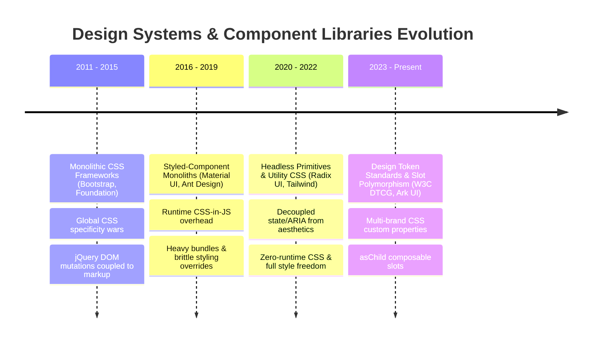
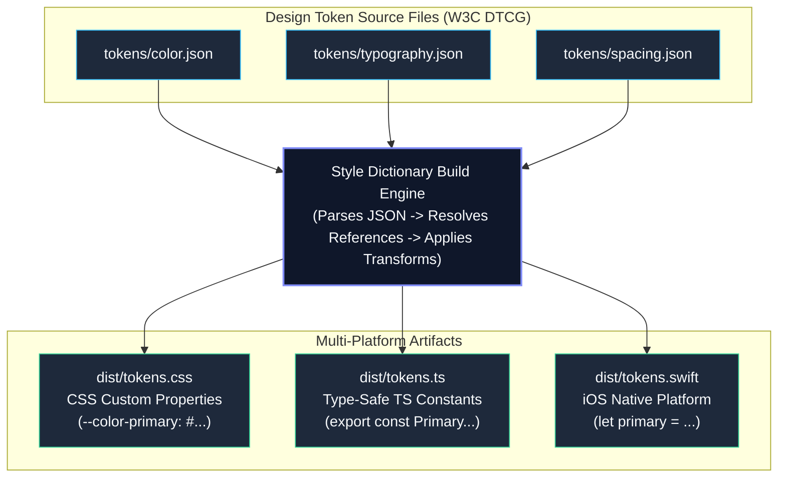

# Phase 09 — Topic 05: Design System Architecture & Component Libraries

## 1. Why This Topic Exists
In large enterprise organizations, UI fragmentation creates severe brand erosion, accessibility litigation liabilities, and wasted engineering effort. When engineering teams write bespoke dropdowns, dialogs, and form inputs, critical accessibility (a11y) behaviors—such as keyboard focus trapping, ARIA attribute binding, and screen reader announcements—are consistently omitted or buggy.

A modern enterprise **Design System** is not merely a collection of stylized UI components; it is an organizational API contract between product design and engineering. It codifies design tokens (colors, typography, spacing, elevations), accessibility compliance (W3C WAI-ARIA APG standards), and reusable headless behavioral primitives.

Architects must know how to construct multi-tiered component libraries that separate un-styled behavioral logic (Headless primitives like Radix UI or React Aria) from aesthetic styling systems (Tailwind, CSS Variables, CSS Modules), support polymorphic composition (the `asChild` Slot pattern), and maintain visual stability across dozens of consuming applications through automated visual regression testing.

---

## 2. Learning Objectives
By completing this chapter, you will be able to:
- Architect a multi-layered enterprise design system: **Design Tokens**, **Headless Primitives**, and **Styled Component Primitives**.
- Transform multi-platform design tokens using **Style Dictionary** and the W3C Design Tokens specification into CSS Custom Properties.
- Implement accessible interactive primitives using headless architectures (Radix UI, React Aria Primitives).
- Implement polymorphic component composition using the modern **Slot (`asChild`)** pattern, eliminating anti-patterns of the legacy `as` prop.
- Engineer accessible keyboard focus management, modal focus traps, and screen reader announcements compliant with WCAG 2.2 AA.
- Establish visual regression testing pipelines using Playwright and Storybook to detect layout and styling regressions prior to release.

---

## 3. Historical Evolution


<details className="raw-schematic-details">
<summary>📄 View Raw ASCII Schematic</summary>

```
+---------------------------------------------------------------------------------------------------+
| 2011 - 2015: Monolithic CSS Frameworks (Bootstrap, Foundation)                                    |
| Heavy global CSS classes and jQuery plugins. Components were tightly coupled to markup structure. |
| Overriding themes required brutal CSS specificity battles (!important wars).                      |
+---------------------------------------------------------------------------------------------------+
                                                  |
                                                  v
+---------------------------------------------------------------------------------------------------+
| 2016 - 2019: Styled-Component Monoliths (Material UI, Ant Design, styled-components)             |
| Opinionated, pre-styled React component libraries. While feature-rich, customizing styles was     |
| painful, bundle sizes were immense (CSS-in-JS runtime overhead), and accessibility was incomplete. |
+---------------------------------------------------------------------------------------------------+
                                                  |
                                                  v
+---------------------------------------------------------------------------------------------------+
| 2020 - 2022: Headless Primitives & Utility-First CSS (Radix UI, Reach UI, Tailwind CSS)          |
| Decoupled behavior from aesthetics. Libraries handled complex WAI-ARIA state and keyboard traps;  |
| developers brought zero-runtime CSS (Tailwind, CSS Modules). Solved styling lock-in completely.   |
+---------------------------------------------------------------------------------------------------+
                                                  |
                                                  v
+---------------------------------------------------------------------------------------------------+
| 2023 - Present: Design Token Standards & Slot-Based Polymorphism (W3C DTCG, Radix Slot, Ark UI)   |
| W3C Design Token Community Group (DTCG) formats, multi-brand themes via CSS custom properties,    |
| zero-runtime type-safe tokens (Style Dictionary), and `asChild` composition replacing `as` props.  |
+---------------------------------------------------------------------------------------------------+
```

</details>


---

## 4. First Principles & Intuitive Physical Analogies (Layer 1)
Think of modern design system architecture through physical engineering analogs:

### Analogy 1: The Electric Guitar & Amplifier (Headless vs. Styling)
A **Headless UI Component** (like Radix or React Aria) is an electric guitar without an amplifier. It possesses all the structural mechanics: precision fretboards, strings, pickups, and volume knobs (keyboard focus traps, ARIA attributes, open/close state machine). By itself, it produces very little sound.
The **Styling Layer** (Tailwind, CSS variables) is the guitar amplifier and effects pedal board. You can plug that exact same precision guitar into a heavy distortion metal amp or a warm vintage jazz acoustic amp without modifying the strings or frets. The behavior remains robust while the aesthetic output changes completely.

### Analogy 2: The Architectural Blueprint Spec Sheet (Design Tokens)
If an architect specified "paint the door nice blue," three painters would buy navy, turquoise, and sky blue.
Design tokens represent precise RAL / Pantone color codes: `color.brand.primary = #0F62FE`.
Whether that specification is handed to a carpenter (CSS), an aluminum fabricator (iOS Swift), or an industrial plastic molder (Android Kotlin), the color is mathematically identical.

### Analogy 3: The Modular Coupler (The `asChild` / Slot Pattern)
The legacy `as` prop (`<Button as={Link} />`) is like trying to melt a train hitch directly into a car bumper. The TypeScript types become entangled, DOM ref forwarding breaks, and props collide.
The **Slot pattern** is a universal mechanical coupler. The parent button component injects its accessibility attributes (`role="button"`, `tabIndex={0}`, `onClick`) directly into the child component's existing chassis without altering what the child is.

---

## 5. Internal Working & Engine Architecture (Layer 2)

### Three-Tier Enterprise Design System Architecture
```
+--------------------------------------------------------------------+
| TIER 1: DESIGN TOKENS (Platform-Agnostic Source of Truth)          |
| JSON Token Spec (W3C DTCG) -> Style Dictionary Pipeline            |
| Outputs: :root CSS Custom Properties (--color-brand-primary)       |
+--------------------------------------------------------------------+
                                 |
                                 v
+--------------------------------------------------------------------+
| TIER 2: HEADLESS BEHAVIORAL PRIMITIVES (Unstyled)                  |
| State machines, WAI-ARIA APG compliance, keyboard navigation       |
| (Focus trapping, Esc key dismiss, roving tabindex, ARIA expanded)   |
| Powered by: Radix UI Primitives / React Aria Primitives            |
+--------------------------------------------------------------------+
                                 |
                                 v
+--------------------------------------------------------------------+
| TIER 3: ENTERPRISE COMPONENT LIBRARY (Styled & Branded)            |
| Applied tokens via CSS Modules or Tailwind classes                 |
| Exposes ergonomic, polymorphic API (<Button asChild>, <Modal>)    |
+--------------------------------------------------------------------+
```

### The Slot Pattern (`asChild`) Mechanics
When using Radix UI's Slot pattern, the component inspects its `children`. If `asChild` is `true`, it clones the child element and merges its own props and event handlers:

```typescript
// Conceptual implementation of Slot cloning
function Slot({ children, ...slotProps }: SlotProps) {
  if (React.isValidElement(children)) {
    return React.cloneElement(children, {
      ...mergeProps(slotProps, children.props)
    });
  }
  return null;
}
```
Event handlers are composed so both the library's internal handler and the user's custom handler execute without clobbering each other.

---

## 6. Runtime Flow & Execution Traces

### Trace: Modal Dialog Mounting, Focus Trapping, and Keyboard Dismiss
```
Step 1: User clicks <button onClick={() => setOpen(true)}>Open Dialog</button>.
        Host app updates state. <Dialog.Root open={true}> evaluates.

Step 2: Headless Dialog mounts <Dialog.Portal> into document.body.
        - Appends backdrop overlay and content node outside standard DOM hierarchy.
        - Adds 'aria-hidden="true"' to all other root DOM nodes (inert isolation).

Step 3: Focus Trap Initialization:
        - Stores previously focused element in memory: document.activeElement (0x00D9F).
        - Queries all focusable elements inside DialogContent.
        - Moves browser focus: contentNode.querySelector('[autofocus]') || firstFocusable.focus().

Step 4: Event Listener Registration:
        - Registers 'keydown' listener on window.
        - If 'Tab' key is pressed on the last focusable element, intercept default behavior
          and manually focus the first element (circular keyboard trap).
        - If 'Escape' key is pressed, triggers onOpenChange(false).

Step 5: User closes Dialog:
        - Dialog unmounts from DOM.
        - Removes 'aria-hidden' from siblings.
        - Focus Restoration: Restores browser focus to original element (0x00D9F).
```

---

## 7. Memory Model & Token Resolution Layout

```
BROWSER CSSOM ENGINE MEMORY

:root (CSSOM Rule Table)
+-------------------------------------+-----------------------+
| Property Token                      | Computed Value        |
+-------------------------------------+-----------------------+
| --color-brand-primary               | #0F62FE               |
| --color-surface-bg                  | #FFFFFF               |
| --radius-sm                         | 4px                   |
| --radius-md                         | 8px                   |
| --space-4                           | 16px                  |
+-------------------------------------+-----------------------+

[data-theme="dark"] (Overriding Rule Scope)
+-------------------------------------+-----------------------+
| Property Token                      | Overridden Value      |
+-------------------------------------+-----------------------+
| --color-surface-bg                  | #121212               |
| --color-text-primary                | #F4F4F4               |
+-------------------------------------+-----------------------+

V8 FIBER RECONCILER NODE
+-------------------------------------------------------------+
| FiberNode (Tag: HostComponent 'button')                      |
| memoizedProps: {                                            |
|   className: "btn-primary",  // Depends on CSS Vars         |
|   "aria-expanded": true,                                    |
|   "aria-haspopup": "dialog",                                |
|   onClick: [Function: handleToggle]                         |
| }                                                           |
+-------------------------------------------------------------+
```

---

## 8. Visual Diagrams (ASCII / Text)

### Design Token Pipeline (Style Dictionary)


<details className="raw-schematic-details">
<summary>📄 View Raw ASCII Schematic</summary>

```
[ tokens/color.json ]      [ tokens/typography.json ]      [ tokens/spacing.json ]
          \                           |                           /
           \                          |                          /
            v                         v                         v
       +-------------------------------------------------------------+
       |                  Style Dictionary Build Engine               |
       |  (Parses JSON -> Resolves References -> Applies Transforms)  |
       +-------------------------------------------------------------+
             /                        |                        \
            /                         |                         \
           v                          v                          v
 [ dist/tokens.css ]        [ dist/tokens.ts ]          [ dist/tokens.swift ]
 CSS Custom Properties      Type-Safe TS Constants      iOS Native Platform
 (--color-primary: #...)    (export const Primary...)   (let primary = ...)
```

</details>


---

## 9. Real World Usage & Production Patterns

> 🧪 **Companion Interactive Lab:** [LabComponent.tsx](../../apps/portal/src/features/visualizers/topic-09-architecture/LabComponent.tsx) | Live in Portal: topic-09-architecture

### Pattern 1: W3C Design Tokens Community Group (DTCG) Spec File
```json
{
  "color": {
    "brand": {
      "primary": {
        "$value": "#0F62FE",
        "$type": "color",
        "$description": "Primary corporate identity color"
      },
      "secondary": {
        "$value": "#8A3FFC",
        "$type": "color"
      }
    },
    "surface": {
      "background": {
        "$value": "{color.neutral.50}",
        "$type": "color"
      }
    }
  },
  "spacing": {
    "unit": {
      "$value": "4px",
      "$type": "dimension"
    },
    "md": {
      "$value": "{spacing.unit} * 4",
      "$type": "dimension"
    }
  }
}
```

### Pattern 2: Enterprise Polymorphic Button with Radix Slot (`asChild`)
```tsx
import React, { ButtonHTMLAttributes, forwardRef } from 'react';
import { Slot } from '@radix-ui/react-slot';

export interface ButtonProps extends ButtonHTMLAttributes<HTMLButtonElement> {
  variant?: 'primary' | 'secondary' | 'danger';
  size?: 'sm' | 'md' | 'lg';
  asChild?: boolean;
}

export const Button = forwardRef<HTMLButtonElement, ButtonProps>(
  ({ variant = 'primary', size = 'md', asChild = false, className = '', children, ...props }, ref) => {
    // If asChild is true, Slot renders the child element (e.g., Next.js <Link>)
    // while forwarding all classes, refs, and accessibility props to it.
    const Component = asChild ? Slot : 'button';

    const baseStyles = 'inline-flex items-center justify-center font-medium transition-colors rounded focus:outline-none focus:ring-2';
    
    const variantStyles = {
      primary: 'bg-[var(--color-brand-primary)] text-white hover:opacity-90',
      secondary: 'bg-[var(--color-surface-muted)] text-[var(--color-text-main)] hover:bg-gray-200',
      danger: 'bg-red-600 text-white hover:bg-red-700'
    }[variant];

    const sizeStyles = {
      sm: 'px-2.5 py-1.5 text-xs',
      md: 'px-4 py-2 text-sm',
      lg: 'px-6 py-3 text-base'
    }[size];

    return (
      <Component
        ref={ref}
        className={`${baseStyles} ${variantStyles} ${sizeStyles} ${className}`}
        {...props}
      >
        {children}
      </Component>
    );
  }
);

Button.displayName = 'Button';
```

### Pattern 3: Consuming Polymorphic Component (Next.js Link Integration)
```tsx
import Link from 'next/link';
import { Button } from '@acme/ui';

// Renders an <a> tag styled identically to a primary button without invalid nesting (<button><a>...</a></button>)
export function NavigationBar() {
  return (
    <nav>
      <Button asChild variant="primary" size="md">
        <Link href="/dashboard">Go to Dashboard</Link>
      </Button>
    </nav>
  );
}
```

---

## 10. Angular Comparison
For an engineer transitioning from enterprise Angular:

| Architectural Concept | Enterprise Angular Ecosystem | Modern React Design System |
| :--- | :--- | :--- |
| **Component Architecture** | Angular Material / Angular CDK (Component Dev Kit). | Radix UI / React Aria Primitives / Ark UI. |
| **Headless Behavior** | Angular CDK directives (`cdkTrapFocus`, `cdkConnectedOverlay`, `cdkDrag`). | Headless compound components (`<Dialog.Root>`, `<Dialog.Portal>`, `<Dialog.Content>`). |
| **Encapsulation** | View Encapsulation (`Emulated` / Shadow DOM) scoping component CSS rules. | CSS Modules, Tailwind CSS, or scoped CSS Custom Properties. |
| **Dynamic Injection** | `ng-template`, `ngTemplateOutlet`, and `ngProjectAs` for content projection. | React Children composition, Slot (`asChild`), and compound component props. |
| **Theming** | Sass mixins (`@include mat.all-component-themes($theme)`) compiled at build time. | Runtime CSS Custom Properties (`:root` / `[data-theme="dark"]`) switching with zero build step. |

---

## 11. .NET Comparison
For a Senior .NET / WPF / Blazor Architect:

| Architectural Concept | .NET (WPF / Blazor) Ecosystem | React Design System |
| :--- | :--- | :--- |
| **Styling Abstraction** | XAML Styles, ControlTemplates, and ResourceDictionaries. | CSS Custom Properties (Tokens) and Tailwind / CSS Modules. |
| **Lookless Controls** | WPF Custom Controls (overriding `ControlTemplate` while preserving logic in `Control.cs`). | Headless UI Primitives (Radix UI) decoupling behavior from markup styling. |
| **Accessibility** | UI Automation (UIA) and `AutomationPeer` classes. | W3C WAI-ARIA attributes (`aria-expanded`, `aria-controls`, `role="dialog"`). |
| **Design Tokens** | Global static resource keys (`StaticResource BrandPrimaryColor`). | Standardized CSS Custom Properties (`var(--color-brand-primary)`). |

---

## 12. Enterprise Perspective & Production Risks (Layer 4)

### Accessibility Litigation & WCAG Compliance
- Enterprises in e-commerce, banking, and public sectors face aggressive lawsuits under ADA (Americans with Disabilities Act) and European Accessibility Act (EAA).
- Building custom dropdowns from raw `<div>` tags without keyboard focus navigation (`ArrowDown`, `ArrowUp`, `Enter`, `Escape`) or missing `role="listbox"` and `aria-activedescendant` is an immediate liability. Using headless primitives guaranteed against WAI-ARIA APG standards mitigates legal exposure.

### CSS-in-JS Runtime Overhead at Scale
- Early design systems relied on runtime CSS-in-JS libraries like `styled-components` or `emotion`.
- In large enterprise applications with thousands of mounted DOM nodes, runtime style calculation causes severe main-thread freezing and INP degradation during re-renders. Modern enterprise design systems mandate zero-runtime styling (Tailwind, Vanilla Extract, or standard CSS custom properties).

---

## 13. Performance Considerations
- **Zero-Runtime CSS**: Use CSS Custom Properties and static utility classes. The browser handles CSS token inheritance in native C++ engine code rather than executing JavaScript hash generators on every render.
- **Component Subpath Exports**: Ensure every component primitive (`@acme/ui/button`, `@acme/ui/dialog`) can be independently imported to avoid forcing consumers to download the entire component library into their initial bundle.

---

## 14. Tradeoffs

| Architecture Choice | Primary Benefit | Operational Cost / Drawback |
| :--- | :--- | :--- |
| **Headless UI Primitives (Radix)** | Flawless accessibility; complete styling flexibility; zero runtime CSS. | Requires writing aesthetic styles; higher initial boilerplate than pre-styled UI kits. |
| **Opinionated UI Kit (MUI / AntD)** | Ready out-of-the-box; fast prototyping; zero CSS knowledge required. | Heavy bundle size; hard to match custom corporate brand guidelines; high CSS specificity debt. |
| **Slot Pattern (`asChild`)** | Clean HTML markup; perfect TypeScript inference; no invalid `<button><a>` DOM. | Requires using child cloning internally; consumers must supply a single valid React element. |
| **Token Pipeline (Style Dictionary)** | Single source of truth for Web, iOS, Android; multi-brand scalability. | Requires cross-discipline coordination between Figma designers and frontend teams. |

---

## 15. Common Mistakes & Interview Traps
- **Trap 1: The `as` Prop Polymorphic Trap.**
  - *Symptom*: Using `<Button as="a" href="...">`. TypeScript generic types become deeply nested and slow down compile times; ref forwarding frequently breaks.
  - *Fix*: Use the Radix `asChild` Slot pattern.
- **Trap 2: Reinventing Modal Focus Trapping from scratch.**
  - *Symptom*: Modals allow screen reader focus to escape into the background page, or focus is lost when the modal closes.
  - *Fix*: Use tested headless primitives (`@radix-ui/react-dialog`) that handle inert backgrounds and focus restoration automatically.
- **Trap 3: Hardcoding Hex Colors in Components.**
  - *Symptom*: Dark mode requires overriding hundreds of classes individually with `!important`.
  - *Fix*: Bind all component colors exclusively to semantic design tokens (`--color-surface-bg`).

---

## 16. Interview Questions & Architectural Answers (Senior, Lead, Architect - Layer 5)

### Question 1 (Senior Level): Why is the `asChild` Slot pattern superior to the legacy `as` prop for polymorphic components?
**Answer**:
The legacy `as` prop suffers from three architectural limitations:
1. **TypeScript Type Complexity**: Typing an `as` prop requires complex generic conditional types (`ComponentPropsWithRef<C>`) which degrade TypeScript compiler performance and produce incomprehensible error messages.
2. **Ref Forwarding Fragility**: Correctly typing and forwarding the `ref` to an arbitrary element or third-party component passed via `as` frequently causes type mismatches and runtime ref drops.
3. **Markup Rigidity**: The `as` prop forces the component to render as that single element.
The `asChild` pattern delegates rendering to the child component:
- The parent component renders a `<Slot>`, which merges its accessibility attributes, classes, and event handlers onto the immediate child element via `React.cloneElement`.
- TypeScript typing remains simple and predictable.
- It prevents invalid DOM structures (e.g. putting an `<a>` inside a `<button>`).

### Question 2 (Lead Level): How do you structure design tokens to support multi-brand and dark/light theming across enterprise products?
**Answer**:
We structure tokens into a **Three-Tier Architecture**:
1. **Global / Primitive Tokens**: Pure values with no semantic meaning (`blue-500: #0F62FE`, `gray-900: #121212`, `space-4: 16px`).
2. **Semantic / Contextual Tokens**: Pointers to primitive tokens expressing intent (`surface-primary: {color.neutral.50}`, `text-interactive: {color.blue.500}`).
3. **Component Tokens**: Scoped to specific UI elements (`button-primary-bg: {color.surface-interactive}`).
For theming:
- We export tokens as CSS Custom Properties.
- Theme switching updates the semantic tier via CSS scope attributes:
  ```css
  :root { --surface-primary: var(--gray-50); --text-primary: var(--gray-900); }
  [data-theme="dark"] { --surface-primary: var(--gray-950); --text-primary: var(--gray-100); }
  [data-brand="healthcare"] { --color-brand-primary: var(--teal-600); }
  ```
- No JavaScript re-render or CSS recompilation is required; the browser's CSSOM handles the theme update in single-digit milliseconds.

### Question 3 (Architect Level): How do you enforce accessibility and visual regression testing across a design system in continuous integration?
**Answer**:
We implement a three-stage automated quality gate:
1. **Automated Unit & Accessibility Testing (Vitest + axe-core)**:
   Every component story is automatically rendered in JSDOM and audited using `jest-axe`. Any missing ARIA roles, invalid contrast ratios, or missing form labels immediately fails the build.
2. **Visual Regression Testing (Playwright + Storybook)**:
   In CI, Playwright spins up headless Chromium and captures pixel-perfect snapshots of all component variants across mobile, tablet, and desktop viewports, comparing them against approved baseline images with a strict 0.05% pixel difference threshold.
3. **Package Governance & Automated Linting**:
   We configure `@typescript-eslint` rules and custom ESLint boundary rules that prevent product squads from writing raw inline styles or arbitrary hex colors, enforcing that all UI code consumes design tokens.

---

## 17. Senior-Level Mental Model & "How to Remember This Forever" (Memory Anchors - Layer 3)

### The "Puppet and Marionettist" Rule
- **Headless UI** is the **Marionettist**: invisible strings managing focus, ARIA tags, and keyboard events.
- **Your CSS / Design System** is the **Puppet Costume**: colors, typography, borders, and animations.
- Never try to weave the strings directly into the velvet cloth. Keep the strings (logic) separate from the velvet (styling).

---

## 18. Core Vocabulary & "Aha!" Breakthrough Insights (Refresher)
- **Headless UI**: Components providing state and accessibility behavior without injecting any HTML markup or CSS styling.
- **Design Tokens**: The atomic visual design decisions of an organization stored in platform-agnostic format (JSON).
- **Slot Pattern (`asChild`)**: A composition pattern where a parent passes its props and behavior onto its immediate child element.
- **WAI-ARIA APG**: Accessible Rich Internet Applications Authoring Practices Guide—the official W3C specification for accessible widgets.
- **Roving Tabindex**: A keyboard navigation strategy where only the currently focused item has `tabIndex="0"` and all siblings have `tabIndex="-1"`.

---

## 19. Key Takeaways
- Decouple component architecture into Design Tokens, Headless Behavior, and Styled Primitives.
- Standardize on the W3C Design Tokens format and compile to CSS Custom Properties using Style Dictionary.
- Never build complex accessible interactive widgets from scratch; leverage battle-tested headless primitives (Radix UI, React Aria).
- Replace fragile `as` props with the `asChild` Slot composition model.
- Enforce WCAG 2.2 AA compliance in CI using automated axe-core audits and visual regression testing.

---

## 20. Revision Sheet
- **Q: What is a design token?**
  *A:* A named design decision (color, spacing, elevation) stored in JSON and compiled to CSS variables and platform-specific constants.
- **Q: What problem does the `asChild` pattern solve?**
  *A:* It enables polymorphic component composition without the TypeScript typing issues, ref errors, and invalid DOM nesting of the `as` prop.
- **Q: Why are Headless UI primitives preferred over traditional UI libraries?**
  *A:* They provide complete accessibility compliance and keyboard state management without imposing styling opinions or runtime CSS overhead.
- **Q: What is the benefit of CSS Custom Properties over Sass variables for theming?**
  *A:* CSS variables resolve at runtime in the browser CSSOM, allowing instant dark mode and theme switching without recompilation or page reloads.
- **Q: What W3C specification defines accessible keyboard interactions for web components?**
  *A:* WAI-ARIA Authoring Practices Guide (APG).
