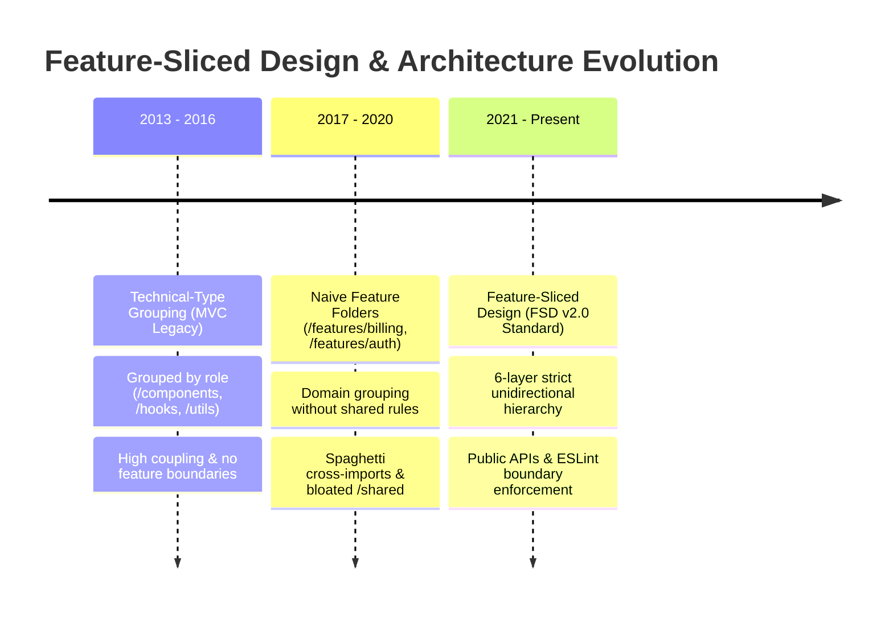
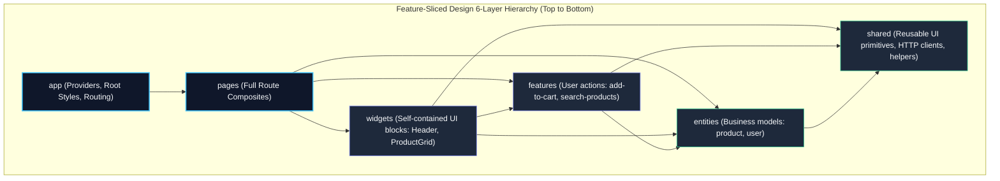

# Phase 09 — Topic 06: Feature-Sliced Design (FSD) Architectural Standard

## 1. Why This Topic Exists
Most React applications begin with a naive "technical type" folder structure: `components/`, `hooks/`, `services/`, `utils/`, and `types/`. While intuitive for small applications with 10 components, this technical-grouping paradigm degrades into severe architectural entropy as codebases scale. Developers cannot determine which hook belongs to which business flow; deleting a single feature requires hunting down files across seven directories; and circular imports between hooks and components become rampant.

**Feature-Sliced Design (FSD)** is an architectural methodology engineered specifically for modern frontend applications. It replaces arbitrary file organization with a formalized, hierarchical structure based on domain responsibility and a strict **unidirectional dependency rule**.

By organizing code into **Layers**, **Slices**, and **Segments**, FSD guarantees high cohesion, low coupling, controlled public APIs, and predictable refactoring. Architects must master FSD principles to guide enterprise teams away from chaotic spaghetti code and enforce scalable frontend folder architectures.

---

## 2. Learning Objectives
By completing this chapter, you will be able to:
- Explain the structural hierarchy of Feature-Sliced Design: **Layers**, **Slices**, and **Segments**.
- Enforce the **Unidirectional Dependency Rule**: higher layers can only import from lower layers; cross-imports between slices on the same layer are strictly prohibited.
- Structure internal segments (`ui`, `model`, `api`, `lib`, `config`) within feature and entity slices.
- Protect slice boundaries using strict **Public API (`index.ts`)** exports, preventing consumers from reaching into internal implementation details.
- Orchestrate cross-feature communication through parent composition (Widgets/Pages) or decoupled event buses.
- Configure automated architectural linting using `eslint-plugin-boundaries` or `@feature-sliced/eslint-config` to fail pull requests that violate layer hierarchy.

---

## 3. Historical Evolution


<details className="raw-schematic-details">
<summary>📄 View Raw ASCII Schematic</summary>

```
+---------------------------------------------------------------------------------------------------+
| 2013 - 2016: Technical-Type Grouping (MVC Legacy)                                                 |
| Organization by technical role: /controllers, /views, /models or /components, /hooks, /utils.     |
| Scaling failure: Code for a single feature was scattered everywhere; high coupling and no bounds. |
+---------------------------------------------------------------------------------------------------+
                                                  |
                                                  v
+---------------------------------------------------------------------------------------------------+
| 2017 - 2020: Naive Feature Folders (/features/billing, /features/auth)                            |
| Grouped by business domain. A major improvement, but lacked rules for shared code: /shared became|
| a 100,000-line dumping ground, and features directly imported each other, creating spaghetti cycles.|
+---------------------------------------------------------------------------------------------------+
                                                  |
                                                  v
+---------------------------------------------------------------------------------------------------+
| 2021 - Present: Feature-Sliced Design (FSD v2.0 Standard)                                         |
| Standardized 6-layer architectural hierarchy with strict unidirectional dependencies.            |
| Explicit public APIs, formalized segments (ui/model/api), and automated AST lint enforcement.     |
+---------------------------------------------------------------------------------------------------+
```

</details>


---

## 4. First Principles & Intuitive Physical Analogies (Layer 1)
Think of Feature-Sliced Design through physical engineering analogs:

### Analogy 1: The Geological Strata (The Unidirectional Dependency Rule)
Consider the layers of the Earth's crust:
- **Bedrock (Shared)**: Basalt, granite, water, iron (UI primitives, HTTP clients).
- **Subsoil (Entities)**: Organic minerals, root systems (Users, Products, Orders).
- **Topsoil (Features)**: Plant roots interacting with worms (Add to Cart, Like Post).
- **Vegetation (Widgets)**: Fully grown trees combining soil and water (Header, OrderSummary).
- **Canopy / Atmosphere (Pages & App)**: The full biosphere visible from space.
Water and gravity flow strictly downwards: rain from the sky filters down through vegetation, soil, and rock. **Rock never depends on the tree; bedrock cannot reach up into the clouds.**

### Analogy 2: The Modern Hotel (Public APIs & Slices)
Each floor (layer) contains distinct suites (slices). Room 401 is a self-contained suite (The `auth` feature).
If a guest in Room 402 wants to talk to Room 401, they do not climb through Room 401's bathroom window (`import ... from 'features/auth/ui/internal-secret-button'`).
They must ring the front doorbell at Room 401's entrance (`import { AuthModal } from '@/features/auth'`). Everything inside Room 401's bathroom and closet is private and hidden.

---

## 5. Internal Working & Engine Architecture (Layer 2)

### The 6 Standard FSD Layers (Top to Bottom)
In FSD, layers are ordered by domain specificity. Lower layers are generic; higher layers are specific:

```
[ Layer 1: app ]       -> Application bootstrap, providers, router config, global styles
       |
       v
[ Layer 2: pages ]     -> Full compositional screens/routes (e.g., HomePage, CheckoutPage)
       |
       v
[ Layer 3: widgets ]   -> Large self-contained UI blocks (e.g., Header, OrderSummaryWidget)
       |
       v
[ Layer 4: features ]  -> User interactions yielding business value (e.g., AddToCart, FilterPosts)
       |
       v
[ Layer 5: entities ]  -> Real-world business concepts (e.g., User, Product, Order, Article)
       |
       v
[ Layer 6: shared ]    -> Reusable utilities, UI kit primitives, API clients, design tokens
```

### The Slice and Segment Breakdown
Within layers (except `app` and `shared`), code is partitioned into **Slices** (business domains) and **Segments** (technical concerns):

```
features/                      <--- Layer
├── add-to-cart/               <--- Slice
│   ├── api/                   <--- Segment: backend requests, TanStack Query mutations
│   ├── model/                 <--- Segment: business state, Zustand store, validation schema
│   ├── ui/                    <--- Segment: React components (AddToCartButton, CartDrawer)
│   ├── lib/                   <--- Segment: local helper functions
│   └── index.ts               <--- Public API: ONLY exported symbols can be consumed
```

### The Cardinal Rule: No Horizontal Imports
A feature slice (e.g., `features/add-to-cart`) **CANNOT** import from another feature slice (e.g., `features/favorites`).
If two features need to interact, they must be composed at a higher layer (such as a `widget` or `page`), or share logic via a lower `entity` or `shared` layer.

---

## 6. Runtime Flow & Execution Traces

### Trace: Composing a "Product Card" Widget in FSD
```
Step 1: Page Layer renders:
        import { ProductCardWidget } from '@/widgets/product-card';
        // (Pages Layer -> Widget Layer: ALLOWED)

Step 2: Widget Layer coordinates multiple features and entities:
        import { ProductCardUI } from '@/entities/product';
        import { AddToCartButton } from '@/features/add-to-cart';
        import { ToggleFavoriteButton } from '@/features/favorites';
        // (Widget Layer -> Feature & Entity Layers: ALLOWED)

Step 3: Feature Layer executes interaction:
        AddToCartButton invokes useAddToCartMutation() from '@/features/add-to-cart/api'.
        Mutation updates in-memory cache for entity:
        queryClient.invalidateQueries({ queryKey: ['product', productId] });

Step 4: Entity Layer updates UI:
        ProductCardUI displays updated product stock from '@/entities/product/model'.
        
Step 5: Architectural Rule Verification:
        - Did 'add-to-cart' import 'favorites'? NO.
        - Did 'entities/product' import 'widgets/product-card'? NO.
        - Unidirectional flow strictly preserved.
```

---

## 7. Memory Model & Layer Dependency Hierarchy

```
FSD DEPENDENCY FLOW (STRICT DIRECTED ACYCLIC GRAPH)

           [ app ]
              |
              v
           [ pages ]
            /     \
           v       v
      [ widgets ]   \
        /      \     \
       v        v     \
 [ features ]  [ entities ]
       \        /     /
        v      v     v
         [ shared ]

IMPORT MATRIX VALIDATION:
+-------------------+-----+-------+---------+----------+----------+--------+
| Importer \ Target | app | pages | widgets | features | entities | shared |
+-------------------+-----+-------+---------+----------+----------+--------+
| app               | NO  | YES   | YES     | YES      | YES      | YES    |
| pages             | NO  | NO    | YES     | YES      | YES      | YES    |
| widgets           | NO  | NO    | NO      | YES      | YES      | YES    |
| features          | NO  | NO    | NO      | NO*      | YES      | YES    |
| entities          | NO  | NO    | NO      | NO       | NO*      | YES    |
| shared            | NO  | NO    | NO      | NO       | NO       | NO*    |
+-------------------+-----+-------+---------+----------+----------+--------+
*Note: Slices cannot import other sibling slices on the same layer.
```

---

## 8. Visual Diagrams (ASCII / Text)

### Anatomy of an FSD Directory Structure


<details className="raw-schematic-details">
<summary>📄 View Raw Directory Tree Schematic</summary>

```
src/
├── app/
│   ├── providers/
│   │   ├── QueryProvider.tsx
│   │   └── ThemeProvider.tsx
│   ├── styles/
│   │   └── globals.css
│   └── App.tsx
├── pages/
│   ├── catalog/
│   │   └── ui/CatalogPage.tsx
│   └── product-details/
│       └── ui/ProductDetailsPage.tsx
├── widgets/
│   ├── header/
│   │   ├── ui/Header.tsx
│   │   └── index.ts
│   └── product-grid/
│       ├── ui/ProductGrid.tsx
│       └── index.ts
├── features/
│   ├── add-to-cart/
│   │   ├── api/addToCartApi.ts
│   │   ├── ui/AddToCartButton.tsx
│   │   └── index.ts
│   └── search-products/
│       ├── ui/SearchBar.tsx
│       └── index.ts
├── entities/
│   ├── product/
│   │   ├── api/types.ts
│   │   ├── ui/ProductCard.tsx
│   │   └── index.ts
│   └── user/
│       ├── model/userStore.ts
│       └── index.ts
└── shared/
    ├── api/
    │   └── httpClient.ts
    ├── ui/
    │   ├── button/
    │   └── modal/
    └── lib/
        └── formatCurrency.ts
```

</details>


---

## 9. Real World Usage & Production Patterns

> 🧪 **Companion Interactive Lab:** [LabComponent.tsx](../../apps/portal/src/features/visualizers/topic-09-architecture/LabComponent.tsx) | Live in Portal: topic-09-architecture

### Pattern 1: Public API Encapsulation (`entities/product/index.ts`)
```typescript
// entities/product/index.ts
// ONLY export what other layers are permitted to consume.
// Keep internal helper functions and raw schemas private.

export { ProductCard } from './ui/ProductCard';
export { ProductPriceTag } from './ui/ProductPriceTag';
export { useProductDetails } from './api/useProductDetails';
export type { Product, ProductId } from './model/types';
```

### Pattern 2: ESLint Boundary Rules (`eslint.config.js`)
Enforce FSD unidirectional layer imports and disallow sibling cross-imports:

```javascript
import boundaries from 'eslint-plugin-boundaries';

export default [
  {
    plugins: { boundaries },
    settings: {
      'boundaries/elements': [
        { type: 'app', pattern: 'src/app/*' },
        { type: 'pages', pattern: 'src/pages/*' },
        { type: 'widgets', pattern: 'src/widgets/*' },
        { type: 'features', pattern: 'src/features/*' },
        { type: 'entities', pattern: 'src/entities/*' },
        { type: 'shared', pattern: 'src/shared/*' }
      ]
    },
    rules: {
      'boundaries/element-types': [
        'error',
        {
          default: 'disallow',
          rules: [
            {
              from: 'app',
              allow: ['pages', 'widgets', 'features', 'entities', 'shared']
            },
            {
              from: 'pages',
              allow: ['widgets', 'features', 'entities', 'shared']
            },
            {
              from: 'widgets',
              allow: ['features', 'entities', 'shared']
            },
            {
              from: 'features',
              allow: ['entities', 'shared']
            },
            {
              from: 'entities',
              allow: ['shared']
            },
            {
              from: 'shared',
              allow: ['shared']
            }
          ]
        }
      ],
      'boundaries/entry-point': [
        'error',
        {
          default: 'disallow',
          rules: [
            {
              target: ['widgets', 'features', 'entities'],
              allow: 'index.ts' // Force consumers to go through public API
            }
          ]
        }
      ]
    }
  }
];
```

### Pattern 3: Cross-Feature Composition in a Widget
```tsx
// widgets/product-card/ui/ProductCardWidget.tsx
import React from 'react';
import { ProductCard, Product } from '@/entities/product';
import { AddToCartButton } from '@/features/add-to-cart';
import { FavoriteButton } from '@/features/toggle-favorite';

interface ProductCardWidgetProps {
  product: Product;
}

// Composition coordinates two decoupled features around a shared entity
export function ProductCardWidget({ product }: ProductCardWidgetProps) {
  return (
    <ProductCard
      product={product}
      renderActions={
        <div className="flex gap-2">
          <AddToCartButton productId={product.id} />
          <FavoriteButton productId={product.id} />
        </div>
      }
    />
  );
}
```

---

## 10. Angular Comparison
For an engineer transitioning from enterprise Angular:

| Architectural Concept | Enterprise Angular Ecosystem | React Feature-Sliced Design (FSD) |
| :--- | :--- | :--- |
| **Layer Structure** | Often organized as `CoreModule` (singletons), `SharedModule` (UI/pipes), and lazy feature modules. | Explicit 6 layers: `app`, `pages`, `widgets`, `features`, `entities`, `shared`. |
| **Entities Layer** | Angular domain models with state services (e.g., `UserService`, `UserInterface`). | `entities/<entity>/model` containing types, entity-level UI cards, and TanStack Query hooks. |
| **Cross-Module Communication** | Event emitters or Injectable root services (`providedIn: 'root'`). | UI slot composition (`renderActions`) at the Widget/Page layer or shared entity cache invalidation. |
| **Public API** | Library `public-api.ts` exposing exported components/services. | Slice `index.ts` acting as the sole public gateway for the slice. |

---

## 11. .NET Comparison
For a Senior .NET / Clean Architecture Architect:

| Architectural Concept | Clean / Onion Architecture in .NET | Feature-Sliced Design in Frontend |
| :--- | :--- | :--- |
| **Domain Entities** | `Core.Domain` layer (Entities, Value Objects, Domain Events). | `entities/` layer (Product, User, Order types and domain-bound display cards). |
| **Use Cases** | `Core.Application` layer (Commands, Queries, MediatR handlers). | `features/` layer (User interactions: `add-to-cart`, `submit-review`). |
| **UI Composition** | ASP.NET Razor Pages / ViewComponents combining ViewModels. | `widgets/` and `pages/` layers combining features and entities into screens. |
| **Infrastructure / Common**| `Infrastructure` / `Common` projects (HTTP clients, DB context, logging). | `shared/` layer (UI primitives, axios client, date formatters, tokens). |
| **Dependency Inversion** | Higher-level layers define interfaces; lower layers implement them. | Strict downwards dependency rule: higher layers depend on lower layers; never inverted. |

---

## 12. Enterprise Perspective & Production Risks (Layer 4)

### The "Bloated Shared Layer" Disease
- Without strict FSD governance, engineers default to putting any slightly ambiguous code into `shared/`.
- Over 18 months, `shared/` accumulates business logic, auth checks, and entity interfaces, effectively recreating the monolithic spaghetti anti-pattern under a new name.
- **Enterprise Mitigation**: Automated CI audit: `shared/` cannot import domain models or contain business logic. `shared/` must be completely domain-agnostic (pure UI tokens, mathematical utilities, network wrappers).

### Deep Path Import Fragility
- If squad members bypass public APIs: `import { helper } from '@/features/auth/ui/internal/helper'`, internal refactoring within the `auth` squad breaks external squads without warning.
- Enforcing ESLint `boundaries/entry-point: index.ts` ensures internal refactoring can occur safely without breaking consumer imports.

---

## 13. Performance Considerations
- **Bundle Splitting by Page & Widget**: FSD aligns directly with modern code-splitting boundaries. Every slice in `pages/` maps 1:1 to an asynchronous route chunk (`lazy(() => import('@/pages/catalog'))`). Heavy slices in `widgets/` (such as complex data grids) can be dynamically imported without affecting initial bundle size.
- **Tree-Shaking via Pure Public APIs**: Slices must avoid exporting giant objects (`export default { A, B, C }`); always use named exports (`export { A, B }`) in `index.ts` so bundlers can tree-shake unused features.

---

## 14. Tradeoffs

| Architecture Choice | Primary Benefit | Operational Cost / Drawback |
| :--- | :--- | :--- |
| **Feature-Sliced Design** | Predictable onboarding; zero circular dependencies; isolated safe refactoring. | Initial learning curve; higher directory nesting; strict discipline required. |
| **Technical Grouping (/hooks, /components)** | Easy to start; minimal folder structure for trivial POC apps. | Disastrous at scale; severe coupling; unmaintainable past 20 components. |
| **Unidirectional Dependency Rules** | Clean directed acyclic graph (DAG); guarantees elimination of import cycles. | Can feel rigid; requires learning composition patterns to coordinate features. |
| **Public API Encapsulation** | Complete freedom to refactor internal slice files without breaking consumers. | Requires maintaining `index.ts` files for every slice. |

---

## 15. Common Mistakes & Interview Traps
- **Trap 1: Feature-to-Feature Cross Imports.**
  - *Symptom*: `features/cart` imports `features/auth`. Creates circular dependencies and tight coupling.
  - *Fix*: Lift coordination up to `widgets` or `pages`, or extract common data into `entities/user`.
- **Trap 2: Putting Business Models in `shared/`.**
  - *Symptom*: `shared/types/user.ts` contains user validation, permissions, and billing flags.
  - *Fix*: Move domain concepts to `entities/user`. `shared/` must remain domain-agnostic.
- **Trap 3: Deep Internal Imports.**
  - *Symptom*: Importing from `entities/product/ui/internal-badge.tsx` instead of `entities/product`.
  - *Fix*: Export through `entities/product/index.ts` and enforce ESLint entry-point rules.

---

## 16. Interview Questions & Architectural Answers (Senior, Lead, Architect - Layer 5)

### Question 1 (Senior Level): What is the difference between an `entity` and a `feature` in Feature-Sliced Design?
**Answer**:
In FSD:
- An **Entity** represents a real-world business subject or concept (e.g., `User`, `Product`, `Order`, `Invoice`). It contains domain types, data models, state stores, and display UI primitives (e.g., a `ProductCard` displaying title, image, and price). Entities are passive; they do not perform state-mutating business actions on other domains.
- A **Feature** represents an interactive user action that yields business value (e.g., `add-to-cart`, `like-post`, `submit-review`, `filter-catalog`). Features contain user interaction logic, form handlers, API mutations, and action buttons. Features can import and depend on Entities, but Entities can never import Features.

### Question 2 (Lead Level): How do two features communicate in FSD if horizontal imports are strictly forbidden?
**Answer**:
We resolve cross-feature communication using three architectural patterns:
1. **Composition at Higher Layers (Widgets / Pages)**: The parent widget renders Feature A and Feature B side-by-side and coordinates them via props or slots.
2. **Shared Entity State**: If Feature A mutates data that Feature B needs to read, Feature A performs the mutation, and the shared entity cache (e.g., TanStack Query or an entity Zustand store in `entities/order`) is updated. Feature B automatically reacts to the entity state update without knowing Feature A exists.
3. **Decoupled Event Bus / Custom Events**: For loosely coupled global reactions, Feature A dispatches an event (`events.emit('order:completed', payload)`), and Feature B subscribes to the event via a shared event bus located in `shared/lib`.

### Question 3 (Architect Level): How do you migrate an existing 200,000-line monolithic React codebase to Feature-Sliced Design without halting feature development?
**Answer**:
We execute an **Incremental Hybrid Strangler Migration**:
1. **Scaffold FSD Base & Path Aliases**: Configure `@/app`, `@/pages`, `@/widgets`, `@/features`, `@/entities`, `@/shared` in `tsconfig.json` alongside the legacy `@/components` and `@/hooks`.
2. **Phase 1: Extract `shared/`**: Migrate low-risk, domain-agnostic primitives (button, input, modal, date utilities, HTTP client) from `/components` and `/utils` into `shared/`.
3. **Phase 2: Extract Core `entities/`**: Identify top 3 business entities (e.g., `User`, `Product`, `Workspace`). Consolidate their types and basic card components into `entities/`.
4. **Phase 3: Migrate by Vertical Feature Slice**: When a squad picks up a user story affecting an existing domain (e.g., Checkout), they migrate that vertical slice into `features/checkout` and `pages/checkout`.
5. **Phase 4: ESLint Gate Enforcement**: Activate `eslint-plugin-boundaries` on newly created FSD folders. Prevent legacy code from importing new FSD internals, and prohibit new FSD code from importing legacy spaghetti files.

---

## 17. Senior-Level Mental Model & "How to Remember This Forever" (Memory Anchors - Layer 3)

### The "Gravity and Rain" Rule
- Code dependencies must flow like **Water falling under Gravity**: from the clouds (`app`) down through the trees (`widgets`), soil (`features`), roots (`entities`), to the bedrock (`shared`).
- Water **never flows backwards up into the sky**.
- If you find yourself importing a `feature` into an `entity`, you are trying to make water flow up a mountain.

---

## 18. Core Vocabulary & "Aha!" Breakthrough Insights (Refresher)
- **Layer**: The highest-level hierarchy in FSD (App, Pages, Widgets, Features, Entities, Shared).
- **Slice**: A business domain partition within a layer (e.g., `features/add-to-cart`, `entities/product`).
- **Segment**: A technical concern within a slice (`ui`, `model`, `api`, `lib`).
- **Public API**: The `index.ts` file at the root of a slice defining the contract exposed to outside layers.
- **Unidirectional Flow**: The architectural constraint that modules can only import code from strictly lower layers.

---

## 19. Key Takeaways
- Feature-Sliced Design eliminates the architectural decay of technical-type folder structures.
- Strict unidirectional dependencies ensure a directed acyclic import graph (no circular loops).
- Slices on the same layer must never import from each other directly.
- Slices must encapsulate internal files behind explicit `index.ts` public APIs.
- Enforce FSD architectural boundaries automatically in CI using `eslint-plugin-boundaries`.

---

## 20. Revision Sheet
- **Q: Name the 6 layers of FSD from top to bottom.**
  *A:* App -> Pages -> Widgets -> Features -> Entities -> Shared.
- **Q: Can `entities/user` import from `features/auth`?**
  *A:* No. Entities is a lower layer than Features; imports can only flow downwards.
- **Q: Can `features/cart` import from `features/checkout`?**
  *A:* No. Slices on the same layer cannot import horizontally from each other.
- **Q: Where do design tokens and generic button components live in FSD?**
  *A:* In the `shared/` layer (`shared/ui`, `shared/theme`).
- **Q: How should consumers import from a slice?**
  *A:* Exclusively through the slice's public API root (`@/features/add-to-cart`), never through internal paths (`@/features/add-to-cart/ui/Button`).
