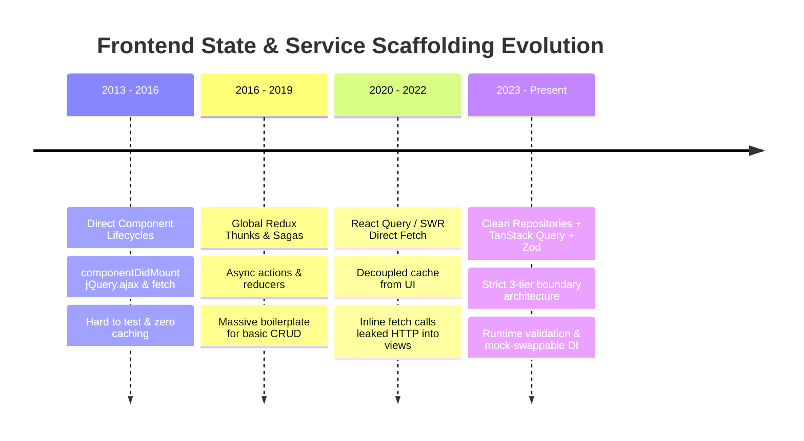
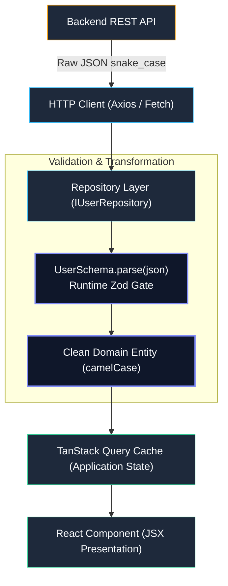

# Phase 09 — Topic 07: Scalable State & Service Scaffolding

## 1. Why This Topic Exists
In naive React applications, components directly invoke `fetch()` or `axios.get()` inside `useEffect` hooks, mixing UI layout, network transport configuration, JSON deserialization, business validation, and state caching into a single monolithic component function.

This tight coupling creates severe enterprise failure modes:
1. When backend APIs change route endpoints or payload shapes, dozens of React components across multiple repositories break simultaneously.
2. Unit testing components requires cumbersome network mocking (or complex mock servers) instead of clean behavioral unit tests.
3. Caching, deduplication, retry logic, and authorization headers are duplicated haphazardly across components.

By applying **Clean Architecture**, the **Repository Pattern**, and lightweight **Dependency Injection (DI)** to frontend applications, architects establish clear boundaries between the UI presentation layer, domain business models, and external data sources. This separation ensures long-term testability, resilience, and maintainability.

---

## 2. Learning Objectives
By completing this chapter, you will be able to:
- Implement the **Repository Pattern** in frontend TypeScript to isolate UI components from data-fetching transport mechanics.
- Decouple HTTP clients (Axios, Fetch) behind abstract interface contracts.
- Validate external backend responses at runtime boundaries using schema parsers like **Zod**.
- Evaluate Dependency Injection patterns in React: **React Context DI**, **Factory Functions / Currying**, and **IoC Containers** (InversifyJS/TSyringe).
- Integrate repositories with server-state caching libraries like **TanStack Query** without polluting domain layers with React hooks.
- Swap production API repositories with high-speed in-memory mock repositories for instantaneous, hermetic unit tests.

---

## 3. Historical Evolution


<details className="raw-schematic-details">
<summary>📄 View Raw ASCII Schematic</summary>

```
+---------------------------------------------------------------------------------------------------+
| 2013 - 2016: Direct Fetch in Component Lifecycles                                                 |
| Components executed jQuery.ajax or fetch in componentDidMount. Heavy mixing of networking and UI. |
| Hard to test, zero deduplication, zero cache sharing between siblings.                           |
+---------------------------------------------------------------------------------------------------+
                                                  |
                                                  v
+---------------------------------------------------------------------------------------------------+
| 2016 - 2019: Global Redux Thunks & Action Creators                                                |
| API calls moved to asynchronous Redux Thunks or Sagas. While separated from JSX, it introduced     |
| massive boilerplate: actions, action-types, reducers, and selectors for basic CRUD operations.   |
+---------------------------------------------------------------------------------------------------+
                                                  |
                                                  v
+---------------------------------------------------------------------------------------------------+
| 2020 - 2022: React Query / SWR Direct Hook Fetching                                               |
| TanStack Query eliminated Redux boilerplate by handling caching and deduplication. However, many  |
| teams put raw fetch() calls directly into queryFn inline callbacks, re-introducing coupling.      |
+---------------------------------------------------------------------------------------------------+
                                                  |
                                                  v
+---------------------------------------------------------------------------------------------------+
| 2023 - Present: Clean Repositories + TanStack Query + Zod Boundary Contracts                       |
| Strict three-tier frontend architecture: Repositories (Data Access) -> Custom Query Hooks         |
| (Application State / Cache) -> Presentational Components (UI). Zero runtime leakage of HTTP.      |
+---------------------------------------------------------------------------------------------------+
```

</details>


---

## 4. First Principles & Intuitive Physical Analogies (Layer 1)
Think of frontend service scaffolding through physical engineering analogs:

### Analogy 1: The Restaurant Waiter & Kitchen Pantry (The Repository Pattern)
The dining customer (**The React Component**) wants a steak. The customer does not walk into the kitchen, butcher the beef, light the gas burner, or inspect the spice shelf (**The HTTP transport & DB**).
The customer places an order with the waiter (**The Repository Interface**): `waiter.orderSteak()`.
Whether the restaurant sources its beef from a local farm, frozen storage, or a culinary supplier (REST, GraphQL, LocalStorage, or Mock DB), the customer receives the identical meal on their plate. The kitchen plumbing can be completely remodeled without altering how the customer orders.

### Analogy 2: The Customs Border Inspection Station (Zod Runtime Validation)
TypeScript compile-time types are like a passport photo stamped on paper. Once the application runs in production, TypeScript types are completely erased.
If a backend microservice unexpectedly returns `null` for a field typed as `string`, your React component crashes with `TypeError: Cannot read properties of null`.
A **Zod schema** is a physical customs officer standing at the airport border. Every inbound JSON payload is physically weighed, scanned, and verified before entering the application's domain memory. If the payload is malformed, the border agent halts it immediately with an explanatory error.

---

## 5. Internal Working & Engine Architecture (Layer 2)

### Three-Tier Clean Frontend Architecture
```
+--------------------------------------------------------------------+
| 1. PRESENTATION LAYER (React Components)                           |
| Consumes application hooks; renders JSX, handles user clicks.      |
| Knows nothing about HTTP status codes, URLs, or query parameters.  |
+--------------------------------------------------------------------+
                                 |
                                 v
+--------------------------------------------------------------------+
| 2. APPLICATION / STATE LAYER (Custom Hooks / TanStack Query)       |
| Manages caching, stale-while-revalidate, optimistic updates.       |
| Invokes Repository methods.                                        |
+--------------------------------------------------------------------+
                                 |
                                 v
+--------------------------------------------------------------------+
| 3. DATA ACCESS LAYER (Domain Repositories & HTTP Client)          |
| Implements interface contracts (e.g., UserRepository).             |
| Validates payloads via Zod, manages tokens, handles Axios/Fetch.   |
+--------------------------------------------------------------------+
```

### Dependency Inversion Principle (DIP) in TypeScript
High-level modules (State Hooks) should not depend on low-level modules (Axios API Client). Both should depend on abstractions (Repository Interfaces).

```
[ Custom Hook: useUserProfile ]
             |
             | depends on
             v
[ Interface: IUserRepository ] <-----------------+
             ^                                   |
             | implements                        | implements
             |                                   |
[ AxiosUserRepository ]                 [ MockUserRepository ]
(Production HTTP Transport)             (Hermetic Unit Tests)
```

---

## 6. Runtime Flow & Execution Traces

### Trace: End-to-End Clean Flow with Zod Validation
```
Step 1: User navigates to profile screen.
        UserProfileComponent mounts and invokes:
        const { data: user, isLoading } = useUserProfile(userId);

Step 2: Custom hook invokes TanStack Query:
        queryClient.fetchQuery({
          queryKey: ['user', userId],
          queryFn: () => userRepository.getById(userId)
        });

Step 3: AxiosUserRepository initiates HTTP transport:
        const response = await httpClient.get(`/api/v1/users/${userId}`);

Step 4: Runtime Boundary Validation (Zod):
        const validatedUser = UserSchema.parse(response.data);
        // If backend returned invalid data, throws ZodError immediately with exact field path.

Step 5: Cache & State Update:
        TanStack Query stores validatedUser in cache memory.
        UserProfileComponent re-renders with type-safe domain entity.
```

---

## 7. Memory Model & Dependency Resolution Layout

```
V8 HEAP MEMORY - SERVICE CONTAINER RESOLUTION

+--------------------------------------------------------------------------+
| REACT CONTEXT ROOT INJECTOR (ServiceContext.Provider)                    |
|                                                                          |
| Service Registry Map: {                                                  |
|   "userRepository": Instance (0x00B1A2) [AxiosUserRepository]            |
|       ├── httpClient: Instance (0x00A010) [AxiosInstance]                |
|       │     └── baseURL: "https://api.acme.com"                          |
|       └── schema: Object (0x00994B) [ZodObject]                          |
|                                                                          |
|   "orderRepository": Instance (0x00B1FF) [AxiosOrderRepository]          |
| }                                                                        |
+--------------------------------------------------------------------------+
                                     ^
                                     | useContext(ServiceContext)
                                     |
+------------------------------------+-------------------------------------+
| Fiber Node: UserProfileComponent                                         |
| hooks: [                                                                 |
|   useContext -> returns 0x00B1A2 (IUserRepository)                       |
|   useQuery   -> binds to 0x00B1A2.getById()                              |
| ]                                                                        |
+--------------------------------------------------------------------------+
```

---

## 8. Visual Diagrams (ASCII / Text)

### Repository Pattern with Runtime Schema Gate


<details className="raw-schematic-details">
<summary>📄 View Raw ASCII Schematic</summary>

```
[ Backend REST API ]
        |
        | Raw JSON: { id: "123", full_name: "Alice", email: "alice@acme.com" }
        v
[ HTTP Client (Axios) ]
        |
        v
[ Repository Layer ]
        |
        |---> Passes through: UserSchema.parse(json)
        |     Transforms snake_case -> camelCase
        |
        v
[ Clean Domain Entity ]
{ id: "123", fullName: "Alice", email: "alice@acme.com" }
        |
        v
[ TanStack Query Cache ]
        |
        v
[ React Component (JSX Presentation) ]
```

</details>


---

## 9. Real World Usage & Production Patterns

> 🧪 **Companion Interactive Lab:** [LabComponent.tsx](../../apps/portal/src/features/visualizers/topic-09-architecture/LabComponent.tsx) | Live in Portal: topic-09-architecture

### Pattern 1: Domain Interface & Zod Schema Contract
```typescript
import { z } from 'zod';

// 1. Runtime Schema definition
export const UserSchema = z.object({
  id: z.string().uuid(),
  name: z.string().min(1),
  email: z.string().email(),
  role: z.enum(['admin', 'member', 'guest']),
  createdAt: z.string().datetime()
});

// 2. TypeScript Static Type inferred automatically from Schema
export type User = z.infer<typeof UserSchema>;

// 3. Repository Interface Contract
export interface IUserRepository {
  getById(id: string): Promise<User>;
  updateRole(id: string, role: User['role']): Promise<User>;
}
```

### Pattern 2: Production Axios Repository Implementation
```typescript
import axios, { AxiosInstance } from 'axios';
import { IUserRepository, User, UserSchema } from './types';

export class AxiosUserRepository implements IUserRepository {
  constructor(private readonly client: AxiosInstance) {}

  async getById(id: string): Promise<User> {
    const response = await this.client.get(`/api/v1/users/${id}`);
    // Runtime validation ensures payload strictly matches contract
    return UserSchema.parse(response.data);
  }

  async updateRole(id: string, role: User['role']): Promise<User> {
    const response = await this.client.patch(`/api/v1/users/${id}/role`, { role });
    return UserSchema.parse(response.data);
  }
}
```

### Pattern 3: React Context Dependency Injection & Custom Hook Integration
```tsx
import React, { createContext, useContext, ReactNode } from 'react';
import { useQuery, useMutation, useQueryClient } from '@tanstack/react-query';
import { IUserRepository, User } from './types';

interface ServiceContainer {
  userRepository: IUserRepository;
}

const ServiceContext = createContext<ServiceContainer | null>(null);

export function ServiceProvider({
  services,
  children
}: {
  services: ServiceContainer;
  children: ReactNode;
}) {
  return <ServiceContext.Provider value={services}>{children}</ServiceContext.Provider>;
}

// Hook to access repository from DI context
export function useUserRepository(): IUserRepository {
  const context = useContext(ServiceContext);
  if (!context) {
    throw new Error('useUserRepository must be used within a ServiceProvider');
  }
  return context.userRepository;
}

// Clean Application Hook integrating TanStack Query with Repository
export function useUser(userId: string) {
  const repo = useUserRepository();
  
  return useQuery({
    queryKey: ['users', userId],
    queryFn: () => repo.getById(userId),
    staleTime: 5 * 60 * 1000 // 5 minutes
  });
}
```

### Pattern 4: Hermetic Mock Repository for Vitest
```typescript
import { IUserRepository, User } from './types';

export class MockUserRepository implements IUserRepository {
  private users: Map<string, User> = new Map();

  constructor(initialUsers: User[] = []) {
    initialUsers.forEach((u) => this.users.set(u.id, u));
  }

  async getById(id: string): Promise<User> {
    const user = this.users.get(id);
    if (!user) throw new Error(`User not found: ${id}`);
    return { ...user };
  }

  async updateRole(id: string, role: User['role']): Promise<User> {
    const user = await this.getById(id);
    const updated = { ...user, role };
    this.users.set(id, updated);
    return updated;
  }
}
```

---

## 10. Angular Comparison
For an engineer transitioning from enterprise Angular:

| Architectural Concept | Enterprise Angular Ecosystem | Modern React Clean Architecture |
| :--- | :--- | :--- |
| **Service Scaffolding** | `@Injectable({ providedIn: 'root' }) class UserService`. | Classes or factory functions implementing TypeScript interfaces (`IUserRepository`). |
| **Dependency Injection** | Built-in Hierarchical Injector (`constructor(private userRepo: UserRepository)`). | React Context Provider (`<ServiceProvider services={{ userRepo }} />`) or custom hooks. |
| **HTTP Transport** | `HttpClient` using RxJS Observables with interceptors. | Axios / Fetch instance wrapped in a Repository, consumed via TanStack Query. |
| **Interface Binding** | `providers: [{ provide: USER_REPO_TOKEN, useClass: AxiosUserRepo }]`. | Passed as props into `<ServiceProvider services={{ userRepository: new AxiosUserRepository(client) }}>`. |

---

## 11. .NET Comparison
For a Senior .NET / ASP.NET Core Architect:

| Architectural Concept | .NET / ASP.NET Core Clean Architecture | React TypeScript Clean Architecture |
| :--- | :--- | :--- |
| **Repository Pattern** | `public interface IUserRepository { Task<User> GetByIdAsync(Guid id); }`. | `export interface IUserRepository { getById(id: string): Promise<User>; }`. |
| **Dependency Injection** | `services.AddScoped<IUserRepository, SqlUserRepository>()` in `Program.cs`. | `<ServiceProvider services={{ userRepository: new AxiosUserRepository(http) }} />`. |
| **DTO Validation** | FluentValidation / DataAnnotations validating inbound DTOs at model binding. | **Zod** schema parsing inbound JSON at the HTTP boundary (`UserSchema.parse(res.data)`). |
| **Unit Testing** | `Mock<IUserRepository>` using Moq or NSubstitute in xUnit. | `new MockUserRepository([testUser])` passed directly into test renderers. |

---

## 12. Enterprise Perspective & Production Risks (Layer 4)

### The Runtime Silent Type Mismatch Hazard
- In TypeScript, casting an API response (`const user = response.data as User`) provides **zero runtime safety**.
- If the backend team renames `user.displayName` to `user.fullName`, TypeScript compiles cleanly without error.
- In production, UI components attempting to run `user.displayName.toUpperCase()` crash the client application with unhandled exceptions.
- **Enterprise Mitigation**: Enforce Zod runtime parsing in all repository methods to halt invalid data at the boundary with actionable log telemetry.

### Memory Leaks from Statefull Singleton Repositories
- If repositories store mutable local cache state inside class instance fields across user logout/login cycles, data from User A can leak into the session for User B.
- Repositories must remain **stateless data access gateways**. All caching must be delegated to dedicated cache management systems (TanStack Query) that clear automatically on session invalidation.

---

## 13. Performance Considerations
- **Zod Parsing Overhead**: Parsing extremely large arrays (e.g., 50,000 raw rows) with deep nested Zod schemas can incur 50–100ms CPU execution times on low-end mobile devices. Use `z.array(ItemSchema)` judiciously, or perform light schema validation on high-volume real-time feeds.
- **Request Deduplication**: TanStack Query automatically deduplicates identical concurrent query invocations triggered by multiple components mounting at the same millisecond, preventing duplicate HTTP requests to the backend.

---

## 14. Tradeoffs

| Architecture Choice | Primary Benefit | Operational Cost / Drawback |
| :--- | :--- | :--- |
| **Repository Pattern** | Decouples UI from transport; flawless testability with mock classes. | Additional architectural layer; more files to maintain compared to inline fetch. |
| **Zod Boundary Parsing** | Catches backend payload regressions immediately at runtime with clear errors. | Slight CPU overhead during JSON parsing; schemas must be kept synchronized. |
| **React Context DI** | Standard React primitive; zero external IoC dependencies or decorators required. | Context re-renders if service references are not properly memoized. |
| **IoC Containers (Inversify)** | Powerful enterprise container with constructor injection and scoping. | Requires `reflect-metadata`, TypeScript experimental decorators, and bundle size. |

---

## 15. Common Mistakes & Interview Traps
- **Trap 1: Putting React Hooks inside the Repository Class.**
  - *Symptom*: Calling `useQuery` or `useState` inside a repository method throws "Invalid hook call."
  - *Fix*: Repositories are pure TypeScript classes or objects. Hooks belong strictly in the application layer (`useUser.ts`).
- **Trap 2: Using `as Type` casting on HTTP responses.**
  - *Symptom*: TypeScript promises type safety, but production crashes with `undefined` property errors when API changes.
  - *Fix*: Use Zod schema validation: `Schema.parse(response.data)`.
- **Trap 3: Hardcoding `axios` calls directly in custom hooks.**
  - *Symptom*: Cannot test custom hooks without mock service worker (MSW) or stubbing global `axios`.
  - *Fix*: Inject the repository interface into the hook.

---

## 16. Interview Questions & Architectural Answers (Senior, Lead, Architect - Layer 5)

### Question 1 (Senior Level): How do you structure data-fetching in React to maintain testability without mocking `window.fetch` or `axios` in every unit test?
**Answer**:
I separate data-fetching into a three-tiered Clean Architecture:
1. **Repository Interface**: Define a pure TypeScript interface (`IOrderRepository`) declaring domain operations (`getOrders(): Promise<Order[]>`).
2. **Implementation Classes**: Create `AxiosOrderRepository` for production and `MockOrderRepository` for tests.
3. **Application Hook**: The React hook `useOrders()` consumes `IOrderRepository` provided via React Context.
In unit tests, rather than configuring complex mock HTTP servers or mocking network globals, we pass an instance of `MockOrderRepository` preloaded with fixture data directly into the `<ServiceProvider>`. Tests execute synchronously and hermetically in memory, completely decoupled from HTTP transport details.

### Question 2 (Lead Level): How do you combine TanStack Query with the Repository Pattern without creating architectural redundancy?
**Answer**:
We assign distinct responsibilities to each layer:
- **Repository Layer**: Responsible purely for **Data Access and Contract Validation**. It handles HTTP transport, serialization, query parameters, authorization headers, and Zod runtime schema validation. It knows nothing about React, component lifecycles, or cache policies.
- **TanStack Query Layer**: Responsible purely for **Client-Side Cache Coordination and Lifecycle State**. Custom hooks (`useUserQuery(id)`) wrap `useQuery`, designating the cache key (`['users', id]`), stale times, and invoking the repository method (`() => userRepo.getById(id)`).
This provides clear separation: if we change from REST to GraphQL, only the Repository changes. If we tune cache invalidation or pagination, only the TanStack Query hook changes.

### Question 3 (Architect Level): Would you use a heavyweight IoC container like InversifyJS in an enterprise React application, or React Context?
**Answer**:
In modern enterprise React, I recommend **React Context with Factory Scaffolding** over heavyweight IoC containers (like InversifyJS or TSyringe), for three reasons:
1. **Tooling & Build Compatibility**: InversifyJS requires `reflect-metadata` and experimental TypeScript decorator flags (`experimentalDecorators`, `emitDecoratorMetadata`), which break modern zero-config Rust/Go bundlers (Vite/esbuild/SWC/Rspack) or require complex Babel transforms.
2. **Tree-Shaking & Bundle Size**: IoC containers inject metadata reflection registries into the bundle, increasing initial payload sizes.
3. **React-Native Composition**: React already possesses a native, hierarchical dependency injection mechanism: **Context**. By defining a `ServiceContext` providing an interface map, we achieve true inversion of control, simple override semantics in tests, and perfect compatibility with React Concurrent Mode and Server Components with zero external bundle overhead.

---

## 17. Senior-Level Mental Model & "How to Remember This Forever" (Memory Anchors - Layer 3)

### The "Restaurant Waiter and Kitchen Pantry" Rule
- **The React Component** is the **Guest at the Dining Table**.
- **The Repository** is the **Waiter**.
- **The Backend API** is the **Kitchen Stove and Pantry**.
- A dining guest should **never walk into the kitchen to chop onions**. They place an order with the waiter, and the waiter delivers the dish on a plate.

---

## 18. Core Vocabulary & "Aha!" Breakthrough Insights (Refresher)
- **Repository Pattern**: An abstraction layer between business logic and data storage/transport mechanisms.
- **Runtime Validation**: Verifying that untyped external data (JSON) matches expected types at runtime using libraries like Zod.
- **Dependency Inversion Principle (DIP)**: Software design principle stating that high-level modules should depend on abstractions, not concrete implementations.
- **TanStack Query**: Server-state synchronization library managing caching, deduplication, and stale data.
- **Hermetic Testing**: Tests that run in complete isolation from external services, networks, or file systems.

---

## 19. Key Takeaways
- Never allow React components to call raw HTTP clients (`fetch`, `axios`) directly.
- Separate data-fetching into Presentation (JSX), Application Cache (TanStack Query), and Data Access (Repositories).
- Use **Zod** to validate external JSON payloads at runtime boundaries, preventing silent type drift bugs.
- Leverage React Context as a lightweight, bundle-friendly Dependency Injection container.
- Repositories enable instantaneous, hermetic unit tests via mock implementations.

---

## 20. Revision Sheet
- **Q: What is the main purpose of the Repository Pattern in frontend development?**
  *A:* To decouple UI components from data-fetching transport details and API endpoints.
- **Q: Why is TypeScript compile-time typing insufficient for API responses?**
  *A:* TypeScript types are erased at runtime; if backend payloads change, invalid data passes silently into memory until a runtime crash occurs.
- **Q: What tool allows runtime schema parsing and TypeScript static type inference simultaneously?**
  *A:* Zod (`z.infer<typeof Schema>`).
- **Q: How does the Repository Pattern improve unit testing?**
  *A:* It allows components to be tested using fast in-memory mock repositories without needing network mocks or HTTP servers.
- **Q: Should a Repository class contain React hooks?**
  *A:* No. Repositories must be pure TypeScript classes or objects; hooks belong strictly in the application layer.
