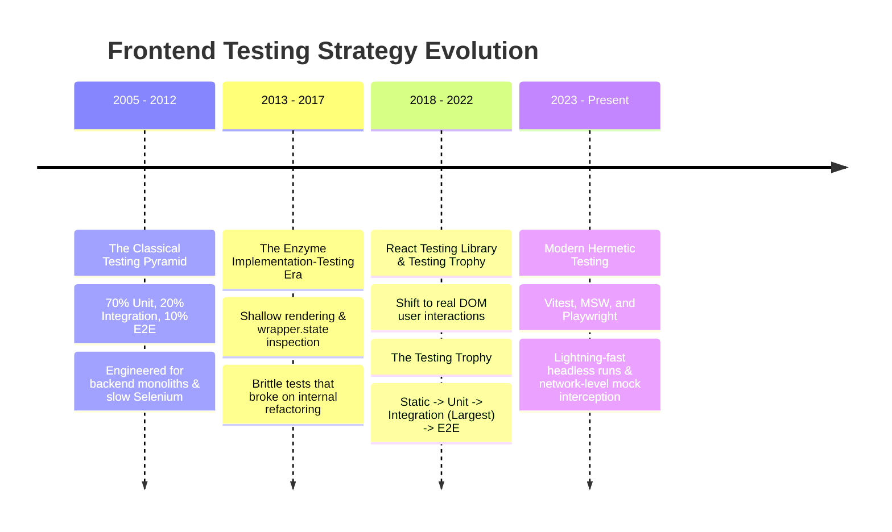
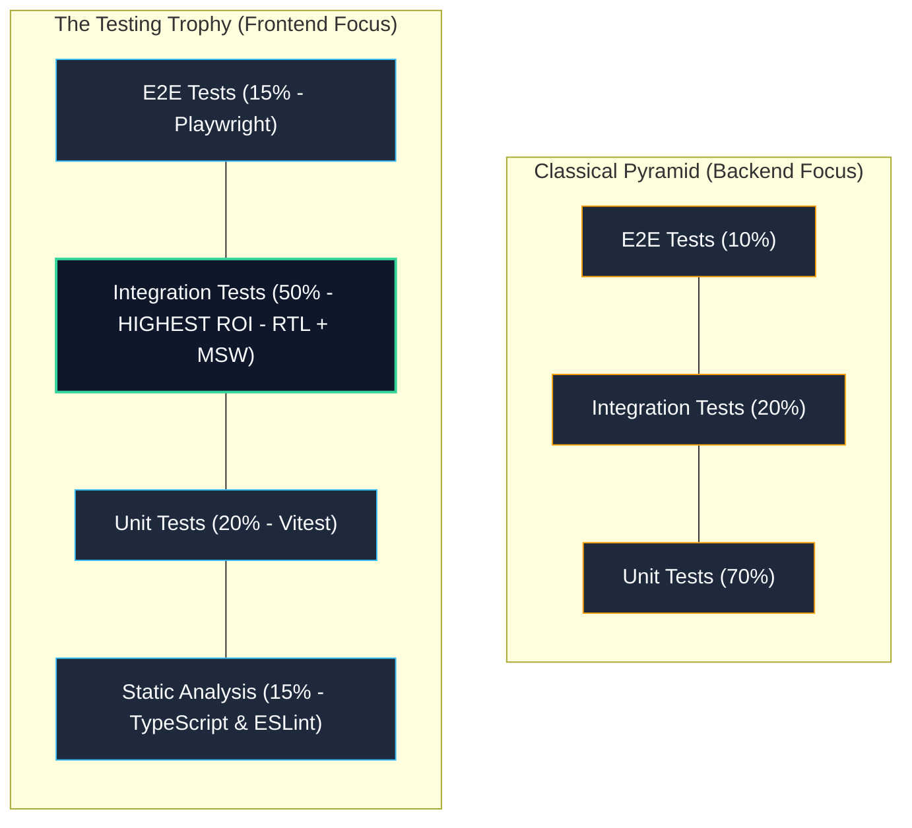
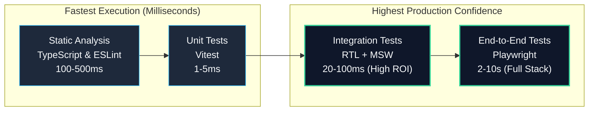

# Phase 10 — Topic 01: The Modern Frontend Testing Pyramid & Testing Trophy

## 1. Why This Topic Exists
In high-growth frontend engineering teams, test suites frequently suffer from one of two catastrophic pathologies:
1. **The "Unit Test Mirage" (Inverted Pyramid / Ice Cream Cone)**: Thousands of isolated unit tests mocking every imported dependency, verifying that internal functions were called with specific arguments. While CI passes in seconds with 95% code coverage, the application repeatedly crashes in production because components fail to integrate correctly with the DOM, browser APIs, and network responses.
2. **The "E2E Monolith Nightmare"**: Over-reliance on slow, brittle end-to-end browser tests that run for 45 minutes in CI, fail intermittently due to network jitter, and lead developers to ignore test failures ("just re-run the build until it passes").

To build enterprise software with high velocity and high reliability, architects must move beyond naive testing metrics (such as line coverage) and adopt modern frontend testing models: the **Testing Trophy** and the modernized **Frontend Testing Pyramid**.

Understanding where to invest testing effort—balancing Static Analysis, Unit Tests, Integration Tests, and End-to-End Tests—enables teams to achieve maximum confidence with minimum maintenance overhead.

---

## 2. Learning Objectives
By completing this chapter, you will be able to:
- Compare the classical **Testing Pyramid (Mike Cohn)** with Kent C. Dodds' **Testing Trophy** model for modern single-page applications.
- Calculate and optimize the **Confidence-to-Cost Ratio** across Static, Unit, Integration, and E2E testing layers.
- Define strict **Test Boundaries**: establish exactly what must be tested (user observable behavior, contract boundaries) versus what must never be tested (internal state, private methods, third-party libraries).
- Eliminate the primary causes of test flakiness (uncontrolled timers, network races, DOM rendering delays).
- Formulate a **Risk-Based Testing Matrix** for mission-critical enterprise systems (such as FinTech transactions and healthcare workflows).
- Establish quality gates in CI/CD pipelines enforcing architectural integrity without stalling merge queues.

---

## 3. Historical Evolution


<details className="raw-schematic-details">
<summary>📄 View Raw ASCII Schematic</summary>

```
+---------------------------------------------------------------------------------------------------+
| 2005 - 2012: The Classical Testing Pyramid (Mike Cohn / Martin Fowler)                            |
| 70% Unit Tests, 20% Integration Tests, 10% UI/E2E Tests. Engineered for backend monoliths where   |
| unit tests were instantaneous and UI testing required brittle Selenium WebDriver browsers.        |
+---------------------------------------------------------------------------------------------------+
                                                  |
                                                  v
+---------------------------------------------------------------------------------------------------+
| 2013 - 2017: The Enzyme & Implementation-Testing Era                                              |
| Airbnb's Enzyme enabled shallow rendering: `wrapper.state()`, `wrapper.find('MyComponent')`.      |
| Severe failure mode: Tests broke upon refactoring internal state even when UI behavior was        |
| identical, and passed when UI was completely broken to users.                                      |
+---------------------------------------------------------------------------------------------------+
                                                  |
                                                  v
+---------------------------------------------------------------------------------------------------+
| 2018 - 2022: React Testing Library & The Testing Trophy (Kent C. Dodds)                           |
| Shift from "shallow testing" to testing real user interactions against JSDOM.                     |
| The Testing Trophy: Static (TS) -> Unit -> Integration (Largest) -> E2E.                          |
| Philosophy: "The more your tests resemble the way your software is used, the more confidence..."   |
+---------------------------------------------------------------------------------------------------+
                                                  |
                                                  v
+---------------------------------------------------------------------------------------------------+
| 2023 - Present: Modern Hermetic Testing (Vitest, MSW, Playwright)                                 |
| Vite-native instant unit/integration tests, Service Worker network interception (MSW), and       |
| lightning-fast headless browser automation with Playwright. Hermetic, zero-mock integration runs.  |
+---------------------------------------------------------------------------------------------------+
```

</details>


---

## 4. First Principles & Intuitive Physical Analogies (Layer 1)
Think of testing layers through physical engineering analogs:

### Analogy 1: The Automobile Assembly Plant
Imagine testing a newly manufactured automobile:
- **Static Analysis (Type Checking)**: Checking the engineering blueprints. Does a 12mm bolt attempt to screw into an 8mm threaded hole? TypeScript catches this before any steel is cut.
- **Unit Testing**: Testing the standalone alternator on a laboratory bench with an oscilloscope. Does it generate 14 volts when spun by an electric drill?
- **Integration Testing (The Engine Bay Test)**: Installing the alternator, battery, starter motor, and ignition switch together on the engine block. When you turn the key, does the engine start? You test the components working as a subsystem.
- **End-to-End Testing (The Test Track Drive)**: A test driver takes the completed car onto a test track in the rain, accelerating to 100 km/h, braking hard, and turning on the windshield wipers and air conditioning.

If you only test the alternator on the bench (Unit) and immediately ship the car to customers, you will discover on the highway that the ignition wire was never plugged into the starter motor. **Integration is where real-world systems fail.**

### Analogy 2: The Smoke Detector Battery
If you want to know if a smoke detector works, do you take a multimeter, disassemble the plastic housing, and measure the voltage of capacitor C12? (Enzyme implementation testing: `expect(wrapper.state('voltage')).toBe(9)`).
Or do you press the "TEST" button on the outside and listen for the siren? (React Testing Library: `userEvent.click(button); expect(siren).toBeInTheDocument()`).
Users do not care what capacitor C12 does; users care that the siren sounds when smoke is detected.

---

## 5. Internal Working & Engine Architecture (Layer 2)

### The Classical Pyramid vs. The Testing Trophy


<details className="raw-schematic-details">
<summary>📄 View Raw ASCII Schematic</summary>

```
CLASSICAL PYRAMID (Backend Focus)         THE TESTING TROPHY (Frontend Focus)

              / \                                        .-.
             /   \                                      /   \
            / E2E \  (10%)                             | E2E |  (15%)
           /-------\                                   |-----|
          /         \                                 /       \
         / Integ-    \  (20%)                        | Integration |  (50% - HIGHEST ROI)
        /   ration    \                              |             |
       /---------------\                              \       /
      /                 \                              |-----|
     /    Unit Tests     \  (70%)                      | Unit | (20%)
    /                     \                            |-----|
   /-----------------------\                           |Static| (15% - TS / ESLint)
                                                       '-----'
```

</details>


### Why Integration Has the Highest ROI in Frontend
In frontend architecture:
1. **Pure Units are Trivial**: Most individual components are small presentational functions. Testing `<Button>Click</Button>` in absolute isolation tests whether the browser's button element works.
2. **True Failure Modes Occur at the Boundaries**: Bugs occur when:
   - Component A updates a shared state store (Zustand / Context) and Component B fails to re-render.
   - An API response arrives with snake_case fields and the data transformer drops them.
   - A form validation hook fires, but the submit button does not disable itself.
3. **Integration Tests Span Boundaries**: By mounting the component tree with its real state providers and mocking only the network boundary via Mock Service Worker (MSW), an integration test exercises 85% of the real execution path in milliseconds.

---

## 6. Runtime Flow & Execution Traces

### Trace: Execution of an Integration Test vs. Fragile Unit Test
```
SCENARIO: User clicks "Submit Payment" on a checkout form.

APPROACH A: Fragile Unit Test with Mocks
Step 1: Test mocks 'usePaymentHook': jest.mock('./usePaymentHook').
Step 2: Mounts shallow component: shallow(<PaymentForm />).
Step 3: Simulates click: wrapper.find('button').simulate('click').
Step 4: Asserts: expect(mockPaymentHook.mutate).toHaveBeenCalledWith({ amount: 100 }).
RESULT: PASSES!
REALITY IN BROWSER: FAILS AT RUNTIME!
Because 'usePaymentHook' had a syntax error in its API header construction,
and the form's input field had an invalid HTML 'name' attribute. The mock hid the bug.

APPROACH B: Integration Test with React Testing Library & MSW
Step 1: MSW intercepts network at Service Worker layer:
        http.post('/api/checkout', () => HttpResponse.json({ success: true }))
Step 2: Render full feature tree with real QueryClient and Form provider:
        render(<CheckoutFeature />)
Step 3: User interaction via real DOM events:
        await userEvent.type(screen.getByLabelText(/card number/i), '4242...')
        await userEvent.click(screen.getByRole('button', { name: /pay now/i }))
Step 4: Assert visible UI reaction:
        expect(await screen.findByText(/payment successful/i)).toBeInTheDocument()
RESULT: Exercises real state, real DOM validation, real serialization, and real UI updates.
Confidence: 99%.
```

---

## 7. Memory Model & Test Isolation Heap Topology

```
V8 MEMORY FOOTPRINT IN JSDOM TEST RUNNER

+--------------------------------------------------------------------------+
| TEST RUNNER MAIN WORKER PROCESS (Node.js Heap)                          |
|                                                                          |
| Vitest / Jest Runner Engine                                              |
|                                                                          |
| +----------------------------------------------------------------------+ |
| | ISOLATED ENVIRONMENT (JSDOM / Happy-DOM)                             | |
| |                                                                      | |
| | window (Mock Global Scope)                                           | |
| | document (In-Memory XML/HTML Document Tree)                          | |
| |                                                                      | |
| | Mounted Component Tree:                                              | |
| | [QueryClientProvider] (0x00A1F0)                                     | |
| |      |                                                               | |
| |      v                                                               | |
| | [CheckoutFeature] (0x00A24C)                                         | |
| |      ├── <form>                                                      | |
| |      ├── <input aria-label="Card Number">                           | |
| |      └── <button role="button">Pay Now</button>                      | |
| |                                                                      | |
| | MSW Interceptor (0x00A990) -> Intercepts Node 'http'/'fetch' socket  | |
| +----------------------------------------------------------------------+ |
|                                                                          |
| Teardown: afterEach(() => cleanup()) -> Garbage collects document tree. |
+--------------------------------------------------------------------------+
```

---

## 8. Visual Diagrams (ASCII / Text)



| Testing Layer | Scope | Execution Speed | Confidence Level | Primary Tooling |
| :--- | :--- | :--- | :--- | :--- |
| **Static** | Type safety, syntax contracts, imports | 100-500 ms (Fast) | Syntax & type leaks only | TypeScript, ESLint |
| **Unit** | Pure utilities, custom reducers, math functions | 1-5 ms per test | Low (misses UI/DOM integration) | Vitest |
| **Integration** | Connected features, user workflows, DOM events | 20-100 ms per test | **VERY HIGH** (resembles real user) | React Testing Library + MSW |
| **End-to-End** | Full real browser, real backend DB, CDN | 2-10 sec per test | **MAXIMUM** (tests production stack) | Playwright |

<details className="raw-schematic-details">
<summary>📄 View Raw ASCII Schematic</summary>

```
+----------------+---------------------+-------------------+---------------------+
| Testing Layer  | Scope               | Execution Speed   | Confidence Level    |
+----------------+---------------------+-------------------+---------------------+
| Static         | Type safety, syntax | 100-500 ms (Fast) | Syntax & type leaks |
| (TS / ESLint)  | contracts           |                   | only                |
+----------------+---------------------+-------------------+---------------------+
| Unit           | Pure utilities,     | 1-5 ms per test   | Low (misses UI/DOM  |
| (Vitest)       | reducers, math      |                   | integration)        |
+----------------+---------------------+-------------------+---------------------+
| Integration    | Connected features, | 20-100 ms per test| VERY HIGH           |
| (RTL + MSW)    | state, DOM events   |                   | (resembles user)    |
+----------------+---------------------+-------------------+---------------------+
| End-to-End     | Full browser, real  | 2-10 sec per test | MAXIMUM             |
| (Playwright)   | backend DB, CDN     | (Slow, high CI $$)| (tests full stack)  |
+----------------+---------------------+-------------------+---------------------+
```

</details>


---

## 9. Real World Usage & Production Patterns

> 🧪 **Companion Interactive Lab:** [TestingLab.tsx](../../apps/portal/src/features/visualizers/topic-10-testing/TestingLab.tsx) | Live in Portal: topic-10-testing

### Pattern 1: High-Confidence Integration Test (RTL + MSW)
```tsx
// features/billing/BillingFlow.test.tsx
import { render, screen } from '@testing-library/react';
import userEvent from '@testing-library/user-event';
import { http, HttpResponse } from 'msw';
import { setupServer } from 'msw/node';
import { QueryClient, QueryClientProvider } from '@tanstack/react-query';
import { BillingSection } from './BillingSection';

// 1. Declarative network mock at the network boundary
const server = setupServer(
  http.get('/api/billing/invoices', () => {
    return HttpResponse.json([
      { id: 'inv-101', amount: 4900, status: 'paid', description: 'Enterprise Plan' }
    ]);
  }),
  http.post('/api/billing/upgrade', async () => {
    return HttpResponse.json({ success: true, newPlan: 'Enterprise Plus' });
  })
);

beforeAll(() => server.listen());
afterEach(() => server.resetHandlers());
afterAll(() => server.close());

function renderWithProviders(ui: React.ReactElement) {
  const queryClient = new QueryClient({
    defaultOptions: { queries: { retry: false } }
  });
  return render(
    <QueryClientProvider client={queryClient}>
      {ui}
    </QueryClientProvider>
  );
}

test('allows user to review invoices and trigger plan upgrade', async () => {
  const user = userEvent.setup();
  renderWithProviders(<BillingSection />);

  // Assert initial server data renders to DOM
  expect(await screen.findByText('Enterprise Plan')).toBeInTheDocument();
  expect(screen.getByText('$49.00')).toBeInTheDocument();

  // Perform user action via accessibility role queries
  const upgradeBtn = screen.getByRole('button', { name: /upgrade plan/i });
  await user.click(upgradeBtn);

  // Assert successful optimistic or server-confirmed response
  expect(await screen.findByText(/successfully upgraded to enterprise plus/i)).toBeInTheDocument();
});
```

### Pattern 2: Unit Testing a Pure Domain Entity / Invariant
```typescript
// domain/pricing/calculateTax.test.ts
import { describe, it, expect } from 'vitest';
import { calculateTax } from './calculateTax';

describe('calculateTax Domain Invariant', () => {
  it('applies zero tax for tax-exempt European cross-border B2B purchases', () => {
    const result = calculateTax({
      amountCents: 10000,
      customerCountry: 'DE',
      sellerCountry: 'IE',
      hasValidVatId: true
    });
    expect(result.taxCents).toBe(0);
    expect(result.isReverseCharge).toBe(true);
  });

  it('rejects negative or fractional amount inputs', () => {
    expect(() => calculateTax({ amountCents: -50, customerCountry: 'US', sellerCountry: 'US', hasValidVatId: false }))
      .toThrow('Amount must be positive integer cents');
  });
});
```

---

## 10. Angular Comparison
For an engineer transitioning from enterprise Angular:

| Architectural Concept | Enterprise Angular Testing | Modern React Testing Ecosystem |
| :--- | :--- | :--- |
| **Test Runner** | Karma (browser-based) or Jasmine / Jest with `ts-jest`. | **Vitest** (Vite-native, ESM first, Rust-backed transform). |
| **Component Harness** | `TestBed.configureTestingModule({ declarations: [...] })`. | Direct functional render via `render(<Component />)` from RTL. |
| **DOM Inspection** | `fixture.debugElement.query(By.css('.my-class'))`. | Semantic accessibility queries (`screen.getByRole('button')`). |
| **Change Detection** | Manual triggers required: `fixture.detectChanges()`. | Automatic React reconciler execution via RTL & `act()`. |
| **HTTP Mocking** | `HttpClientTestingModule` and `HttpTestingController`. | **Mock Service Worker (MSW)** intercepting network requests. |

---

## 11. .NET Comparison
For a Senior .NET / ASP.NET Core Architect:

| Architectural Concept | .NET / C# Testing | React / Frontend Testing |
| :--- | :--- | :--- |
| **Test Framework** | xUnit / NUnit with `[Fact]` and `[Theory]`. | Vitest / Jest with `describe()`, `it()`, and `test()`. |
| **Integration Server** | `WebApplicationFactory<Program>` spinning up test host in memory. | React Context Providers + JSDOM with MSW network interception. |
| **Mocking Framework** | Moq or NSubstitute mocking interfaces (`Mock<IRepository>`). | MSW mocking at HTTP level or mock repository classes in DI context. |
| **Browser E2E** | Selenium WebDriver / Playwright .NET. | Playwright (TypeScript native) with trace viewer and auto-waiting. |
| **Assertion Library** | FluentAssertions (`result.Should().Be(10)`). | Jest / Vitest matchers (`expect(result).toBe(10)`). |

---

## 12. Enterprise Perspective & Production Risks (Layer 4)

### The "False Sense of Security" Line Coverage Trap
- Many corporate audit policies mandate "80% Code Coverage" before PRs can merge.
- Developers achieve this by writing snapshot tests on every component: `expect(render(<App />)).toMatchSnapshot()`.
- Snapshots achieve 95% line coverage in seconds. However, when a developer accidentally breaks a critical checkout flow, they update the snapshot with `u` without inspecting the diff.
- In production, customers cannot check out, despite 95% line coverage.
- **Enterprise Mitigation**: Disallow blind snapshot testing on large component trees; enforce behavioral assertion requirements in PR reviews.

### Test Suite Rot and Merge Queue Starvation
- When CI takes 40 minutes due to 200 slow Playwright tests hitting a shared staging database:
  - Developer productivity plummets.
  - Flaky tests cause developers to re-trigger builds repeatedly, creating massive cloud compute bills and merge delays.
- Reserve full E2E Playwright tests for the top 5% mission-critical smoke paths; execute the remaining 95% of test scenarios via fast Vitest + MSW integration tests in under 2 minutes.

---

## 13. Performance Considerations
- **JSDOM Cleanup Overhead**: In large test suites with 2,000 tests, JSDOM memory leaks if event listeners and DOM trees are not cleaned up. RTL handles `cleanup()` automatically after each test, but ensure custom global singletons are cleared in `afterEach`.
- **Parallelization via Worker Threads**: Vitest executes test files in parallel across CPU worker threads. Keep test files independent and hermetic (avoid sharing global mutable variables across tests) to allow 100% parallel execution.

---

## 14. Tradeoffs

| Testing Layer | Primary Benefit | Operational Cost / Drawback |
| :--- | :--- | :--- |
| **Integration (RTL + MSW)** | Highest confidence; refactor-resilient; catches boundary bugs. | Slower than pure unit tests (20-80ms vs 1ms); requires setting up providers. |
| **Pure Unit Tests** | Extremely fast (sub-millisecond); easy to test mathematical edge cases. | Zero confidence in DOM rendering, CSS layout, or component communication. |
| **End-to-End (Playwright)** | 100% real environment verification; tests actual DB, CDN, and browser engines. | Slow; expensive to run; prone to environmental network and timing flakiness. |
| **Static Analysis (TS)** | Zero runtime cost; catches typos and null pointer exceptions before execution. | Cannot verify business logic, visual aesthetics, or asynchronous timings. |

---

## 15. Common Mistakes & Interview Traps
- **Trap 1: Testing implementation details (state, internal methods).**
  - *Symptom*: Refactoring from `useState` to `useReducer` breaks 40 unit tests even though the UI behaves identically.
  - *Fix*: Query elements by user roles (`getByRole`), never inspect component internal state.
- **Trap 2: Mocking everything.**
  - *Symptom*: Mocking child components, state stores, and hooks leaves nothing real being tested.
  - *Fix*: Render the real component tree; mock only the external network boundary via MSW.
- **Trap 3: Using `fireEvent` instead of `userEvent`.**
  - *Symptom*: `fireEvent.click()` dispatches a synthetic click event without triggering browser focus, keydowns, or hover states.
  - *Fix*: Always use `@testing-library/user-event` to simulate realistic user interaction chains.

---

## 16. Interview Questions & Architectural Answers (Senior, Lead, Architect - Layer 5)

### Question 1 (Senior Level): Why does Kent C. Dodds recommend the "Testing Trophy" over the classical "Testing Pyramid" for modern web applications?
**Answer**:
The classical Testing Pyramid was designed for backend services where database interactions and network boundaries were heavy, making unit tests the cheapest and fastest option.
In modern frontend Single Page Applications:
1. **Components are integration points**: A UI component primarily integrates markup, styling, local/global state, and network data. Testing a component isolated from its state and DOM provides negligible confidence.
2. **Mocking causes test fragility**: High unit test coverage in frontend requires extensive mocking of hooks, stores, and sibling components. These tests break whenever implementation details change, even if user behavior is intact.
The Testing Trophy places the largest emphasis on **Integration Tests** (using React Testing Library and MSW). Integration tests mount the connected component hierarchy, execute real DOM events, and intercept network requests. They offer the optimal balance: near-E2E confidence at a fraction of the execution time and maintenance cost.

### Question 2 (Lead Level): How do you eliminate test flakiness across an enterprise test suite of 5,000+ frontend tests?
**Answer**:
To eliminate flakiness systematically:
1. **Replace Arbitrary Sleep Delays with Deterministic Auto-Waiting**: Ban `setTimeout` or `sleep(1000)` in tests. Use RTL's `findBy*` queries or Playwright's locator auto-waiting which poll the DOM until the condition is met or timeout occurs.
2. **Network Hermeticity via MSW**: Eliminate dependencies on live staging backends. All API interactions are intercepted by Mock Service Worker with deterministic responses, eliminating network timeouts and database state collisions.
3. **Isolate Worker State**: Ensure tests do not mutate shared global state (`window`, `localStorage`, or singleton stores) without resetting them in `afterEach` hooks.
4. **Quarantine & Flaky Detection in CI**: Run a dedicated "flaky detector" step in CI that re-runs failed tests three times. If a test passes on retry, quarantine it to a backlog ticket and prevent it from failing the main developer merge queue.

### Question 3 (Architect Level): How do you design a frontend testing strategy for a high-consequence enterprise domain (e.g., medical device interface or banking trading terminal)?
**Answer**:
We implement a **Risk-Weighted Testing Framework**:
1. **Tier 1: Mission-Critical Core (Money Movement / Medical Calculations)**:
   - 100% mutation testing coverage using Stryker to verify test assertion validity.
   - Comprehensive unit tests on pure mathematical domain models.
   - Hermetic integration tests covering all error, edge, and timeout permutations.
   - Playwright E2E tests running on real browser engines against an isolated sandbox environment.
2. **Tier 2: High-Traffic User Journeys (Login, Account Overview, Settings)**:
   - Strong integration test coverage via RTL and MSW.
   - Visual regression testing in CI using Playwright to detect layout corruption.
3. **Tier 3: Low-Risk Content (Marketing pages, Help center, Footers)**:
   - Rely on TypeScript static checks, ESLint accessibility audits (`jsx-a11y`), and basic smoke navigation tests.
This risk-weighted allocation concentrates expensive E2E and mutation testing where business failure is unacceptable, while keeping CI pipeline execution times under 5 minutes.

---

## 17. Senior-Level Mental Model & "How to Remember This Forever" (Memory Anchors - Layer 3)

### The "Smoke Detector Test" Rule
- **Never disassemble the plastic casing to measure internal circuit voltages** (Never test internal state).
- **Press the TEST button on the outside and listen for the siren** (Test the public user interface).
- If the siren sounds when you press the button, the detector works.

---

## 18. Core Vocabulary & "Aha!" Breakthrough Insights (Refresher)
- **Testing Trophy**: A testing model prioritizing Integration tests as the highest ROI layer in modern frontend development.
- **Shallow Rendering**: The legacy practice of rendering only the immediate parent component while stubbing all children (now an anti-pattern).
- **Hermetic Testing**: Tests that run in complete isolation with zero reliance on external networks, shared databases, or third-party states.
- **User-Centric Queries**: Selecting DOM elements using accessibility attributes (`getByRole('button', { name: /save/i })`) matching how assistive tech and users find elements.
- **Mutation Testing**: An advanced quality tool (e.g., Stryker) that intentionally introduces bugs into application code to verify whether existing tests catch them.

---

## 19. Key Takeaways
- The Testing Trophy places the largest investment in **Integration Tests** because UI failure modes happen at component boundaries.
- Never test implementation details (component state, internal helper methods); test user-observable behavior.
- Query elements using accessibility roles (`getByRole`) rather than arbitrary CSS classes or implementation selectors.
- Mock at the network boundary using **Mock Service Worker (MSW)** rather than mocking internal React hooks.
- Allocate testing effort using a risk-based matrix: mission-critical financial/medical paths receive full E2E and mutation testing, while presentational UI relies on integration tests.

---

## 20. Revision Sheet
- **Q: What is the primary flaw of the classical Testing Pyramid when applied to SPAs?**
  *A:* It over-indexes on isolated unit tests that provide minimal confidence that connected UI components, DOM events, and state stores work together.
- **Q: What does Kent C. Dodds' Testing Trophy recommend as the largest testing layer?**
  *A:* Integration tests.
- **Q: Why is testing component state (`wrapper.state()`) an anti-pattern?**
  *A:* It couples tests to implementation details; refactoring internal state breaks the tests even when user behavior is identical.
- **Q: What is the preferred query priority in React Testing Library?**
  *A:* `getByRole` > `getByLabelText` > `getByPlaceholderText` > `getByText` > `getByDisplayValue` > `getByTestId`.
- **Q: What tool enables network mocking at the browser/node network level rather than mocking React hooks?**
  *A:* Mock Service Worker (MSW).
