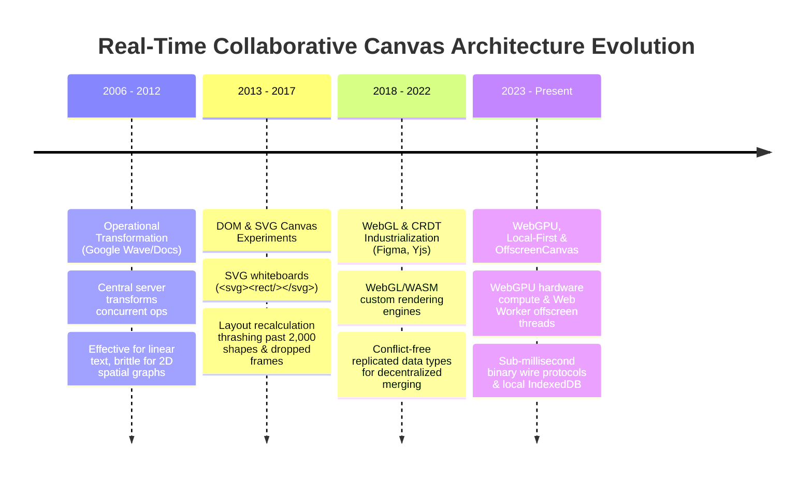

# Phase 11 — Topic 02: Real-Time Collaborative Canvas (Figma / Miro Scale)

## 1. Why This Topic Exists
Designing a real-time collaborative canvas (such as Figma, Miro, or Excalidraw) is one of the most prestigious and challenging system design problems asked in Staff and Principal Frontend Architect interviews.

Unlike traditional CRUD applications—where the browser acts as a passive consumer of paginated database records—a collaborative canvas is a distributed, high-performance graphics workstation executing inside the browser. It combines three extreme engineering constraints:
1. **Real-Time Multiplayer Synchronization**: Dozens of distributed users concurrently drag, resize, rotate, and color vector shapes across unreliable cellular and Wi-Fi networks without central locking.
2. **Conflict-Free Convergence**: If User A moves a rectangle to (100, 200) while User B simultaneously deletes it or changes its color to blue, both clients must deterministically converge to the exact same state without human intervention or server round-trip latency.
3. **High-Frequency Graphics at 60 to 120 FPS**: A single canvas document may contain 50,000 vector shapes. Rendering 50,000 shapes using standard DOM nodes or SVG elements instantly freezes the browser’s Blink rendering engine with massive memory thrashing.

Architects must master the mechanics of **Conflict-Free Replicated Data Types (CRDTs)**, **Spatial Indexing (QuadTrees / R-Trees)**, **Canvas 2D / WebGL rendering pipelines**, and **Ephemeral Presence Protocols**.

---

## 2. Learning Objectives
By completing this chapter, you will be able to:
- Contrast **Conflict-Free Replicated Data Types (CRDTs)** with legacy **Operational Transformation (OT)** algorithms for distributed concurrent document editing.
- Architect high-performance graphics engines choosing between **HTML5 Canvas 2D / WebGL / WebGPU** and explain why DOM/SVG trees collapse past 2,000 nodes.
- Implement **Spatial Indexing** (QuadTree and R-Tree algorithms) to achieve sub-millisecond viewport culling, rendering only objects currently inside the user's camera frustum.
- Design a dual-channel network transport separating **Persistent Document Mutations** (guaranteed ordering via WebSockets/CRDTs) from **Ephemeral Presence** (lossy multiplayer mouse cursors).
- Formulate an offline-first synchronization strategy allowing users to continue drawing on flights and deterministically merge changes upon reconnecting.
- Prevent memory leaks and garbage collection pauses using typed arrays (`Float32Array`) and object pools.

---

## 3. Historical Evolution


<details className="raw-schematic-details">
<summary>📄 View Raw ASCII Schematic</summary>

```
+---------------------------------------------------------------------------------------------------+
| 2006 - 2012: Operational Transformation (Google Wave / Google Docs)                               |
| Relied on a central server to transform concurrent operations (OT). While effective for linear    |
| text strings, OT algorithms were notoriously difficult to implement for complex 2D spatial graphs.|
+---------------------------------------------------------------------------------------------------+
                                                  |
                                                  v
+---------------------------------------------------------------------------------------------------+
| 2013 - 2017: The DOM & SVG Canvas Experiments                                                     |
| Early collaborative whiteboards used SVG elements (<svg><rect .../></svg>).                       |
| Failure mode: Past 2,000 elements, browser layout recalculations and style trees caused massive    |
| 500ms main-thread freezing and dropped frames during panning and zooming.                         |
+---------------------------------------------------------------------------------------------------+
                                                  |
                                                  v
+---------------------------------------------------------------------------------------------------+
| 2018 - 2022: WebGL & CRDT Industrialization (Figma, Yjs, Automerge)                               |
| Figma demonstrated the power of WebGL and C++ compiled to WebAssembly with custom rendering.      |
| Mathematical breakthrough of state/op-based CRDTs (Yjs, Automerge) enabled decentralized merging. |
+---------------------------------------------------------------------------------------------------+
                                                  |
                                                  v
+---------------------------------------------------------------------------------------------------+
| 2023 - Present: WebGPU, Local-First Architecture & OffscreenCanvas                                |
| Modern collaborative canvases leverage WebGPU, OffscreenCanvas in Web Workers, sub-millisecond   |
| Yjs binary wire protocols, and zero-latency local-first IndexedDB persistence.                    |
+---------------------------------------------------------------------------------------------------+
```

</details>


---

## 4. First Principles & Intuitive Physical Analogies (Layer 1)
Think of real-time collaborative canvas architecture through physical engineering analogs:

### Analogy 1: The Shared Blueprint on a Job Site (OT vs. CRDT)
Imagine two architects sitting in different cities drafting a building blueprint:
- **Operational Transformation (OT - The Central Architect)**: Architect A calls a central supervisor in Chicago and says: *"Move Room 3 right 5 feet."* The supervisor calculates the offset, translates it, and calls Architect B to say: *"Move Room 3 right 4.2 feet relative to your local ruler."* If the supervisor's phone goes dead (server outage), both architects must freeze their pens completely.
- **CRDT (The Self-Resolving Math Formula)**: Each room is stamped with a unique Lamport timestamp and cryptographic vector clock. Architect A and Architect B make edits offline. When their blueprints are mailed to each other, a strict mathematical rule (e.g. *"Highest Lamport timestamp wins; position updates and color changes commute independently"*) allows both blueprints to snap into identical shapes automatically without any supervisor.

### Analogy 2: The Camera Frustum & The Security Guard (Spatial Viewport Culling)
Imagine a giant 10-mile industrial warehouse containing 100,000 shipping crates:
If a security camera drone (**The User Viewport / Camera**) is looking through a tiny window at Section C, does the computer need to draw all 100,000 crates?
No! A **QuadTree Spatial Index** is an organized filing cabinet that partitions the warehouse into quadrants (Northwest, Northeast, Southwest, Southeast). The drone asks: *"Which boxes intersect my 800x600 window?"* The QuadTree responds in 0.2 milliseconds with the 14 relevant crates. The remaining 99,986 crates are completely ignored by the GPU.

---

## 5. Internal Working & Engine Architecture (Layer 2)

### High-Level System Architecture Topology
```
[ User Browser (Client A) ]                     [ User Browser (Client B) ]
+-------------------------+                     +-------------------------+
| Viewport Canvas (WebGL) |                     | Viewport Canvas (WebGL) |
|            ^            |                     |            ^            |
|            | 60 FPS     |                     |            | 60 FPS     |
| [ Spatial QuadTree ]    |                     | [ Spatial QuadTree ]    |
|            ^            |                     |            ^            |
|            |            |                     |            |            |
| [ Local Yjs CRDT Doc ]  |                     | [ Local Yjs CRDT Doc ]  |
+-------------------------+                     +-------------------------+
      |               |                               |               |
      | Document Sync | Cursor Stream                 | Document Sync | Cursor Stream
      | (Lossless)    | (Lossy Ephemeral)             | (Lossless)    | (Lossy Ephemeral)
      v               v                               v               v
+-------------------------------------------------------------------------+
|                  REAL-TIME MULTIPLEXED WEBSOCKET SERVER                 |
|  - Room Manager (Pub/Sub)                                               |
|  - Yjs Binary Update Relayer (State Vectors)                            |
|  - S3 / Database Snapshot Flusher (Periodic 60s snapshots)              |
+-------------------------------------------------------------------------+
```

### The Graphics Engine: Why DOM/SVG Fails and Canvas Succeeds
```
+-------------------------------------+-------------------------------------+
| DOM / SVG RENDERING ENGINE          | HTML5 CANVAS 2D / WEBGL ENGINE      |
+-------------------------------------+-------------------------------------+
| - Every shape is a C++ DOM Node     | - The entire canvas is 1 DOM node!  |
| - Retained Mode: Browser tracks     | - Immediate Mode: You instruct GPU: |
|   styles, layout, events for each   |   "Draw 50,000 triangles at buffer" |
| - 10,000 shapes = 10,000 C++ nodes  | - Memory: Flat typed array buffers  |
| - Memory: >250 MB RAM               | - Memory: ~15 MB RAM                |
| - Frame Rate: Drops to 4 FPS        | - Frame Rate: Stable 60 to 120 FPS  |
+-------------------------------------+-------------------------------------+
```

### CRDT Mechanics: The Lamport Clock & State Vector
When two users update the same shape property concurrently:
- Each mutation carries: `[Client ID, Clock Tick, Lamport Timestamp]`.
- CRDT maps properties into a conflict-free map (e.g. `Y.Map`):
  - Property updates commute: Setting `x = 100` and `fill = 'red'` do not collide; both apply.
  - Conflicting updates to the exact same property (User A sets `x = 100`, User B sets `x = 200` at the same instant) are resolved deterministically by comparing `(Lamport Timestamp, ClientID)`. Because integers can always be strictly ordered, both clients select the identical winner.

---

## 6. Runtime Flow & Execution Traces

### Trace: User Drags a Rectangle in Collaborative Session
```
Step 1: User A depresses mouse pointer at coordinate (150, 200) and drags to (300, 400).

Step 2: Pointer Event Handling:
        Camera converts screen pixels to virtual World Coordinates:
        worldX = (screenX - panOffsetX) / zoomLevel;

Step 3: Local CRDT Mutation:
        shapeMap.set('x', 300);
        shapeMap.set('y', 400);
        // Updates local Yjs document; produces binary delta chunk: Uint8Array [0x01, 0x9F...]

Step 4: Spatial Index Update:
        QuadTree removes shape from previous bounding box and re-inserts at (300, 400).

Step 5: Immediate Local Render (Zero Latency):
        RequestAnimationFrame draws updated position at 60 FPS without waiting for server.

Step 6: Network Dispatch:
        - Channel 1 (Document Sync): Sends CRDT binary delta over WebSocket to server.
        - Channel 2 (Ephemeral Presence): Broadcasts mouse position { x: 300, y: 400, user: 'Alice' }.

Step 7: Client B receives delta:
        - Y.applyUpdate(clientB_Doc, binaryDelta);
        - QuadTree updates shape coordinate in Client B's index.
        - Client B's render loop draws updated shape and renders Alice's flying mouse cursor.
```

---

## 7. Memory Model & Spatial QuadTree Partitioning

```
QUADTREE SPATIAL PARTITIONING IN V8 MEMORY

+--------------------------------------------------------------------------+
| ROOT NODE (World Bounding Box: 0, 0 to 10,000 x 10,000)                  |
| Objects count > capacity (10) -> Subdivided into 4 child quadrant nodes: |
|                                                                          |
|         Northwest (NW)          |         Northeast (NE)                 |
|         Bounds: [0, 0, 5k, 5k]  |         Bounds: [5k, 0, 10k, 5k]       |
|         Objects: [Shape A, B]   |         Objects: [Shape C]             |
|         ------------------------+-------------------------               |
|         Southwest (SW)          |         Southeast (SE)                 |
|         Bounds: [0, 5k, 5k, 10k]|         Bounds: [5k, 5k, 10k, 10k]     |
|         Objects: [Shape D, E]   |         Subdivided further into leaves |
+--------------------------------------------------------------------------+
                                     ^
                                     | query(cameraViewportBounds)
                                     |
                  Returns ONLY shapes intersecting camera:
                  Time Complexity: O(log N) instead of O(N) linear scan!
```

---

## 8. Visual Diagrams (ASCII / Text)

### Dual-Channel Multiplexed WebSocket Protocol

```mermaid
sequenceDiagram
    autonumber
    participant ClientA as Client A (Browser)
    participant Server as Collab Server
    participant DB as Snapshot DB
    participant ClientB as Client B (Browser)

    rect rgb(20, 30, 45)
        Note over ClientA,ClientB: Channel 1: Document State (Lossless CRDT Updates)
        ClientA->>Server: Binary Yjs Update [Reliable TCP/WS]
        Server->>DB: Persist Snapshot & Op Log
        Server->>ClientB: Broadcast Yjs Op [Reliable TCP/WS]
        ClientB->>ClientB: Merge CRDT State & Re-render Canvas
    end

    rect rgb(25, 35, 30)
        Note over ClientA,ClientB: Channel 2: Ephemeral Presence (Lossy 60Hz Telemetry)
        ClientA->>Server: Cursor Position {x, y, user} [Lossy WS]
        Server->>ClientB: High-frequency In-Memory Broadcast
        ClientB->>ClientB: Render Remote Mouse Pointer
    end
```


<details className="raw-schematic-details">
<summary>📄 View Raw ASCII Schematic</summary>

```
CLIENT A (Browser)                                    COLLAB SERVER
+---------------------------+                         +----------------------------+
| Document Edits (Lossless) | --[ Reliable TCP/WS ]-> | Room Yjs State             |
| (Shapes, Text, Properties)|                         | (Persisted to Snapshot DB) |
+---------------------------+                         +----------------------------+
                                                                    |
+---------------------------+                         +----------------------------+
| Ephemeral Presence        | --[ Unreliable WS ]---> | Ephemeral Presence Relayer |
| (Mouse Cursors, Selection)|                         | (Pure in-memory broadcast) |
+---------------------------+                         +----------------------------+
                                                                    |
                                                                    v
                                                      CLIENT B (Browser)
                                                      Receives updates & renders
```

</details>


---

## 9. Real World Usage & Production Patterns

> 🧪 **Companion Interactive Lab:** [CanvasDesignLab.tsx](../../apps/portal/src/features/visualizers/topic-11-system-design/CanvasDesignLab.tsx) | Live in Portal: topic-11-system-design

### Pattern 1: QuadTree Spatial Index Implementation (TypeScript)
```typescript
export interface BoundingBox {
  x: number;
  y: number;
  width: number;
  height: number;
}

export interface CanvasShape {
  id: string;
  bounds: BoundingBox;
  type: 'rectangle' | 'ellipse' | 'text';
  fill: string;
}

export class QuadTree {
  private shapes: CanvasShape[] = [];
  private nodes: QuadTree[] = [];
  private readonly MAX_OBJECTS = 10;
  private readonly MAX_LEVELS = 5;

  constructor(private level: number, private bounds: BoundingBox) {}

  clear() {
    this.shapes = [];
    this.nodes.forEach((node) => node.clear());
    this.nodes = [];
  }

  insert(shape: CanvasShape) {
    if (this.nodes.length > 0) {
      const index = this.getIndex(shape.bounds);
      if (index !== -1) {
        this.nodes[index].insert(shape);
        return;
      }
    }

    this.shapes.push(shape);

    if (this.shapes.length > this.MAX_OBJECTS && this.level < this.MAX_LEVELS) {
      if (this.nodes.length === 0) {
        this.subdivide();
      }
      let i = 0;
      while (i < this.shapes.length) {
        const idx = this.getIndex(this.shapes[i].bounds);
        if (idx !== -1) {
          this.nodes[idx].insert(this.shapes.splice(i, 1)[0]);
        } else {
          i++;
        }
      }
    }
  }

  // Subdivides the node into 4 equal quadrants
  private subdivide() {
    const subWidth = this.bounds.width / 2;
    const subHeight = this.bounds.height / 2;
    const x = this.bounds.x;
    const y = this.bounds.y;

    this.nodes[0] = new QuadTree(this.level + 1, { x: x + subWidth, y, width: subWidth, height: subHeight }); // NE
    this.nodes[1] = new QuadTree(this.level + 1, { x, y, width: subWidth, height: subHeight }); // NW
    this.nodes[2] = new QuadTree(this.level + 1, { x, y: y + subHeight, width: subWidth, height: subHeight }); // SW
    this.nodes[3] = new QuadTree(this.level + 1, { x: x + subWidth, y: y + subHeight, width: subWidth, height: subHeight }); // SE
  }

  private getIndex(pRect: BoundingBox): number {
    let index = -1;
    const midX = this.bounds.x + this.bounds.width / 2;
    const midY = this.bounds.y + this.bounds.height / 2;

    const topQuadrant = pRect.y < midY && pRect.y + pRect.height < midY;
    const bottomQuadrant = pRect.y > midY;

    if (pRect.x < midX && pRect.x + pRect.width < midX) {
      if (topQuadrant) index = 1; // NW
      else if (bottomQuadrant) index = 2; // SW
    } else if (pRect.x > midX) {
      if (topQuadrant) index = 0; // NE
      else if (bottomQuadrant) index = 3; // SE
    }
    return index;
  }

  // Returns all shapes that intersect with the camera viewport
  queryViewport(viewport: BoundingBox, returnShapes: CanvasShape[] = []): CanvasShape[] {
    const index = this.getIndex(viewport);
    if (index !== -1 && this.nodes.length > 0) {
      this.nodes[index].queryViewport(viewport, returnShapes);
    } else {
      for (const node of this.nodes) {
        node.queryViewport(viewport, returnShapes);
      }
    }
    returnShapes.push(...this.shapes);
    return returnShapes;
  }
}
```

### Pattern 2: Yjs CRDT Document Synchronization Integration
```typescript
import * as Y from 'yjs';
import { WebsocketProvider } from 'y-websocket';

export class CollaborativeDocument {
  public doc: Y.Doc;
  public shapesMap: Y.Map<any>;
  private provider: WebsocketProvider;

  constructor(roomId: string) {
    this.doc = new Y.Doc();
    this.shapesMap = this.doc.getMap('shapes');

    // Connects to real-time relay server
    this.provider = new WebsocketProvider(
      'wss://collab.internal.acme.com',
      roomId,
      this.doc
    );

    // Awareness handles ephemeral mouse cursors and active selections
    this.provider.awareness.setLocalStateField('user', {
      name: 'Adarsh Architect',
      color: '#0F62FE'
    });
  }

  updateShapePosition(shapeId: string, x: number, y: number) {
    // Mutations are atomic and automatically produce broadcasted binary deltas
    this.doc.transact(() => {
      const shape = this.shapesMap.get(shapeId);
      if (shape) {
        shape.set('x', x);
        shape.set('y', y);
      }
    });
  }

  updateCursor(x: number, y: number) {
    // Ephemeral update: never written to database
    this.provider.awareness.setLocalStateField('cursor', { x, y });
  }
}
```

---

## 10. Angular Comparison
For an engineer transitioning from enterprise Angular:

| Architectural Concept | Enterprise Angular Perspective | Collaborative Canvas Architecture |
| :--- | :--- | :--- |
| **Rendering Strategy** | Heavy reliance on Angular Templates & DOM directives (`*ngFor`). | Bypasses DOM entirely; renders directly to an immediate-mode HTML5 Canvas / WebGL context. |
| **Zone.js Interference** | Zone.js would trigger change detection on every mouse move (120 FPS), crashing performance. | Canvas loops run in `requestAnimationFrame` strictly outside Angular (`ngZone.runOutsideAngular`). |
| **State Synchronization** | RxJS `BehaviorSubject` with REST polling or SignalR. | Decentralized **Yjs CRDT binary deltas** with deterministic mathematical convergence. |
| **Spatial Indexing** | Not built into framework; DOM relies on browser layout engine. | Custom TypeScript QuadTree / R-Tree managing spatial coordinates. |

---

## 11. .NET Comparison
For a Senior .NET / ASP.NET Core Architect:

| Architectural Concept | .NET Architecture | Collaborative Canvas Architecture |
| :--- | :--- | :--- |
| **Multiplayer Engine** | ASP.NET Core SignalR with Redis Backplane. | WebSocket relay servers streaming Yjs binary vector clocks. |
| **State Resolution** | Centralized database locks (ACID transactions) or Event Sourcing. | Decentralized **CRDTs (Conflict-Free Replicated Data Types)** with zero locks. |
| **Graphics Engine** | Direct2D / SkiaSharp in desktop WPF / MAUI apps. | WebGL / WebGPU graphics pipelines compiled via WebAssembly. |
| **Spatial Querying** | SQL Server Spatial Indexes (`STIntersects`) or NetTopologySuite. | Client-side memory QuadTrees for sub-millisecond viewport culling. |

---

## 12. Enterprise Perspective & Production Risks (Layer 4)

### Memory Leakage from Document Tombstones
- In CRDTs, when an object is deleted, it cannot be simply removed from memory immediately; it must be retained as a **Tombstone** so remote clients can verify that the deletion occurred after an older update.
- Over months of active collaboration, a canvas document with 10,000 active shapes can accumulate **500,000 tombstones**, inflating memory usage to hundreds of megabytes.
- **Enterprise Mitigation**: Implement **Garbage Collection Compaction**:
  - When all connected peers have acknowledged state vector V, the server snapshots the document and creates a compacted checkpoint, safely purging tombstones older than V.

### WebSocket Disconnect Storms
- When an enterprise network blip occurs in an office with 500 engineers, all 500 WebSocket connections sever simultaneously.
- If all 500 clients reconnect instantly, the backend server experiences a **Thundering Herd Connection Storm** that overwhelms CPU and memory.
- **Enterprise Mitigation**: Implement **Exponential Backoff with Random Jitter**:
  ```typescript
  const delay = Math.min(30000, 1000 * Math.pow(2, retryCount) + Math.random() * 1000);
  ```

---

## 13. Performance Considerations
- **Viewport Frustum Culling**: Never iterate over all shapes during rendering. Querying a QuadTree narrows 50,000 shapes down to the ~20 shapes inside the camera frustum in **under 0.5ms**, keeping rendering times well under the 16.6ms 60 FPS budget.
- **Typed Arrays for Vector Buffers**: Instead of storing coordinates in JavaScript objects (`{ x: 100, y: 200 }`), store shape geometry in flat `Float32Array` buffers. This eliminates V8 object allocation overhead and avoids garbage collection pauses during dragging.

---

## 14. Tradeoffs

| Architecture Choice | Primary Benefit | Operational Cost / Drawback |
| :--- | :--- | :--- |
| **CRDT (Yjs / Automerge)** | Decentralized convergence; flawless offline-first editing; zero server locks. | Tombstone memory overhead; larger binary payloads than custom OT. |
| **Operational Transformation (OT)**| Minimal payload size; compact document history. | Complex algorithm; requires central authoritative server; poor offline support. |
| **HTML5 Canvas / WebGL** | Stable 60-120 FPS rendering; handles 50,000+ objects; low memory. | Loses native browser accessibility (no DOM tags); custom text selection required. |
| **QuadTree Spatial Index** | O(log N) viewport querying; sub-millisecond frustum culling. | Overhead re-indexing objects whenever shapes are moved or resized. |

---

## 15. Common Mistakes & Interview Traps
- **Trap 1: Proposing SVG or DOM nodes for 50,000 shapes.**
  - *Symptom*: Browser crashes with out-of-memory errors; layout thrashing drops frame rate to 2 FPS.
  - *Fix*: State immediately that DOM/SVG does not scale past 2,000 nodes; propose HTML5 Canvas 2D or WebGL.
- **Trap 2: Sending mouse cursor coordinates through the database.**
  - *Symptom*: Database write queues explode; massive storage bloat for transient mouse positions.
  - *Fix*: Separate persistent document state (CRDT to DB) from ephemeral presence (pure WebSocket broadcast).
- **Trap 3: Linear O(N) canvas rendering loops.**
  - *Symptom*: Looping over `shapes.forEach(render)` wastes CPU cycles drawing off-screen shapes.
  - *Fix*: Implement QuadTree spatial viewport culling.

---

## 16. Interview Questions & Architectural Answers (Senior, Lead, Architect - Layer 5)

### Question 1 (Senior Level): Why do collaborative canvas applications like Figma and Miro avoid using SVG or DOM elements for their rendering engine?
**Answer**:
SVG and DOM elements operate in **Retained Mode**:
Every single SVG rectangle (`<rect>`) is a full C++ DOM node in the browser engine (Blink/WebKit). The browser maintains computed styles, CSS cascade rules, layout geometry, bounding boxes, accessibility trees, and event listener lists for every element.
When a document grows past 2,000 to 5,000 shapes:
1. Panning or zooming triggers forced synchronous layout calculations and style recalculations across thousands of nodes, dropping frame rates from 60 FPS to 3 FPS.
2. V8 heap consumption exceeds hundreds of megabytes.
Canvas 2D and WebGL operate in **Immediate Mode**:
The entire application view is a single HTML `<canvas>` DOM element. The application manages its own geometry in typed array buffers and issues direct GPU draw calls (`ctx.fillRect()` or WebGL drawArrays). Drawing 50,000 shapes takes single-digit milliseconds and uses a fraction of the memory, guaranteeing smooth 60 to 120 FPS interactions.

### Question 2 (Lead Level): How does a Conflict-Free Replicated Data Type (CRDT) resolve concurrent editing conflicts without a central locking server?
**Answer**:
CRDTs achieve **Strong Eventual Consistency** through mathematical properties:
1. **Commutative & Associative Operations**: Update operations are designed such that applying Operation A then B yields the exact same state as applying Operation B then A (`A ∘ B = B ∘ A`).
2. **Idempotence**: Applying the same update multiple times does not alter the state (`A ∘ A = A`).
3. **Monotonic Semi-Lattices**: In state-based CRDTs, states form a partial order with a unique least upper bound (join).
When two clients make concurrent edits without connectivity:
- Property changes to different keys (e.g. User A changes `x`, User B changes `fill`) commute naturally.
- Conflicting edits to the same key use deterministic tie-breaking: each update carries a Lamport timestamp and a unique Client UUID. If timestamps collide, the client with the lexicographically higher UUID wins. Because all clients execute the identical comparison algorithm, every client converges to the exact same document state without server arbitration.

### Question 3 (Architect Level): How do you design a spatial indexing and viewport culling pipeline for a canvas containing 100,000 vector shapes?
**Answer**:
We implement a **Hierarchical QuadTree Spatial Index paired with Viewport Frustum Culling**:
1. **Data Structure**: The 2D world space is partitioned into a recursive QuadTree. Each node represents a rectangular bounding box. When a quadrant accumulates more than 16 shapes, it subdivides into 4 child nodes (NW, NE, SW, SE).
2. **Dynamic Insertion & Mutation**: As shapes are created or resized, they are registered in the leaf quadrant enclosing their bounding box. When a shape is dragged, it is removed and re-inserted into the tree.
3. **Frustum Culling Query**: On every `requestAnimationFrame` (every 16.6ms), the camera calculates its visible world-space rectangle (`[camX, camY, camWidth, camHeight]`). We query the QuadTree:
   - If a quadrant bounding box does not intersect the camera rectangle, the entire quadrant and all its children are culled in a single `O(1)` check.
   - The query traverses only intersecting nodes, returning the ~30 visible shapes in `O(log N)` time.
4. **Rendering Execution**: The GPU renders only the culled shapes, completely ignoring the remaining 99,970 off-screen shapes and guaranteeing sub-5ms frame render times.

---

## 17. Senior-Level Mental Model & "How to Remember This Forever" (Memory Anchors - Layer 3)

### The "Warehouse Drone & Self-Healing Blueprint" Rule
- **The Canvas is a 10-mile Warehouse**: Never look at all 100,000 crates; use the **QuadTree** so the camera drone only paints what fits in its lens.
- **CRDT is the Self-Healing Blueprint**: No supervisor in Chicago needed; mathematical vector clocks ensure blueprints merge seamlessly when mailed together.
- **Fly Cursors on Unreliable Rails**: Never write mouse cursor wiggles to the persistent database.

---

## 18. Core Vocabulary & "Aha!" Breakthrough Insights (Refresher)
- **CRDT (Conflict-Free Replicated Data Type)**: Data structure that can be replicated across multiple computers and merged concurrently without conflicts.
- **QuadTree**: A 2D spatial tree data structure that recursively subdivides space into four quadrants for fast spatial querying.
- **Immediate Mode**: Graphics paradigm where the developer explicitly redraws primitives every frame rather than the browser maintaining an object tree.
- **Frustum Culling**: The graphics optimization of discarding objects outside the visible camera view before issuing draw calls.
- **Lamport Timestamp**: A logical clock used to determine the partial ordering of events in distributed computer systems.

---

## 19. Key Takeaways
- Never use DOM or SVG nodes for large-scale vector canvases; use HTML5 Canvas 2D, WebGL, or WebGPU.
- Use **CRDTs (Yjs)** over Operational Transformation for robust multiplayer synchronization and offline editing.
- Implement **QuadTree spatial indexing** to cull off-screen shapes and achieve 60 FPS across 50,000+ objects.
- Separate high-priority document mutations (lossless TCP/WS) from ephemeral presence cursor broadcasts (lossy).
- Compact CRDT tombstones periodically on the server to prevent memory bloat over time.

---

## 20. Revision Sheet
- **Q: Why does SVG collapse when rendering 20,000 shapes?**
  *A:* Each SVG element is a retained-mode C++ DOM node; style and layout calculations overwhelm browser memory and the main thread.
- **Q: What mathematical properties allow CRDTs to merge without server locks?**
  *A:* Commutativity, associativity, and idempotence.
- **Q: What is the time complexity of querying visible shapes in a balanced QuadTree?**
  *A:* `O(log N)` instead of linear `O(N)` scanning.
- **Q: What is the difference between document state and awareness/presence state in Yjs?**
  *A:* Document state contains persistent shapes stored in CRDTs and saved to databases; awareness state contains ephemeral mouse cursors and active selections that are never persisted.
- **Q: What browser API coordinates 60 FPS canvas redraw loops?**
  *A:* `requestAnimationFrame()`.
