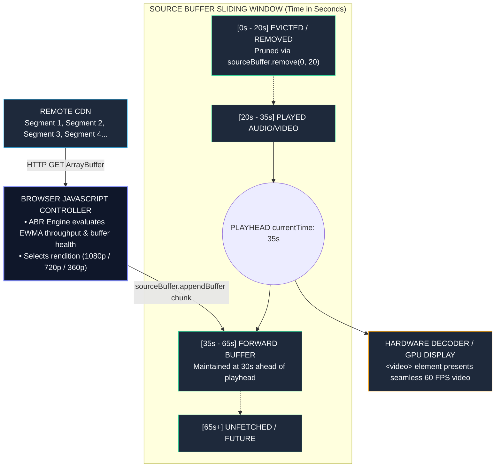

# 05: System Design: Global Streaming Media Player

---

## 1. Why This Topic Exists

Streaming video powers the modern internet, accounting for over 65% of global downstream internet traffic. Platforms such as Netflix, YouTube, Disney+, and Twitch deliver gigabytes of high-definition video across radically heterogeneous network conditions—from gigabit fiber in modern office buildings to intermittent, high-jitter 3G connections in rural areas.

In consumer web applications, rendering a video seems trivial: drop an `<video src="movie.mp4" controls />` tag into the DOM and let the browser handle it. However, in an enterprise or global media streaming service, this naive approach fails immediately:
1. **The Static Bitrate Trap:** A static `.mp4` file is encoded at a fixed bitrate (e.g., 4K at 20 Mbps). If the user's cellular bandwidth dips to 5 Mbps, the video freezes indefinitely to re-buffer, destroying user retention. Conversely, if a mobile user moves to gigabit Wi-Fi, the player cannot upgrade to higher quality without restarting the stream.
2. **Memory Blowouts & Buffer Choke:** Browsers cannot load multi-gigabyte video files into RAM. Without strict buffer management, the browser's video engine either exhausts memory or runs out of forward buffer during sudden network drops.
3. **Digital Rights Management (DRM):** Premium studios (Hollywood, live sports) require hardware-level content protection. Plain MP4 files can be easily downloaded and pirated.
4. **Global Quality of Experience (QoE) Telemetry:** Engineering teams must continuously track key streaming metrics—Time to First Frame (TTFF), Rebuffer Ratio, and Bitrate Switch frequency—across millions of concurrent global viewers to optimize Content Delivery Network (CDN) routing.

Designing a world-class web streaming player requires orchestrating low-level browser media APIs: **Media Source Extensions (MSE)**, **Adaptive Bitrate (ABR) Algorithms**, and **Encrypted Media Extensions (EME)**.

---

## 2. Learning Objectives

By the end of this chapter, you will be able to:
- Construct an end-to-end web streaming architecture utilizing HLS (HTTP Live Streaming) and MPEG-DASH.
- Master the low-level W3C Media Source Extensions (MSE) pipeline (`MediaSource`, `SourceBuffer`, and buffer pruning).
- Implement Adaptive Bitrate (ABR) algorithms balancing throughput estimation with Buffer-Occupancy-based heuristics (BOLA).
- Demystify Encrypted Media Extensions (EME) for multi-DRM content protection (Widevine, FairPlay, PlayReady).
- Build a resilient forward-buffering pipeline that prevents playback stalls while strictly limiting client memory consumption.
- Architect a non-blocking Quality of Experience (QoE) telemetry pipeline delivering real-time streaming health metrics to analytics gateways.

---

## 3. Historical Evolution

The architecture of internet video streaming has evolved through three major technological eras:

1. **The Plugin & Flash Video Era (2000–2010):**
   HTML had no native media playback capabilities. Video playback relied on the Adobe Flash Player plugin (`.flv` files over RTMP - Real-Time Messaging Protocol) or Microsoft Silverlight. While RTMP supported low latency, it required proprietary server daemons, bypassed standard HTTP caching, and suffered from severe security vulnerabilities.
2. **The Native `<video>` & Progressive Download Era (2010–2014):**
   HTML5 standardized the `<video>` tag, eliminating third-party plugins. However, early HTML5 video relied on **Progressive Download** of monolithic MP4 files. The browser used HTTP byte-range requests (`Range: bytes=0-1048576`) to seek ahead, but the bitrate remained permanently locked to a single resolution.
3. **The Adaptive Bitrate (ABR) & Web Standards Era (2014–Present):**
   The W3C standardized **Media Source Extensions (MSE)** and **Encrypted Media Extensions (EME)**. Video files are sliced into small 2-to-6 second chunks (`.m4s` or `.ts`) encoded at multiple bitrates (from 360p at 500 kbps to 4K at 15 Mbps). The browser JavaScript engine dynamically chooses which quality chunk to download next, adapting continuously to real-time network fluctuations.

---

## 4. First Principles & Intuitive Physical Analogies (Layer 1)

### The Continuous Pipeline, Reservoirs, and Bucket Sorters

Imagine an industrial irrigation system supplying water to a turbine generator:
- **The Water Reservoirs on the Mountain (Multi-Bitrate CDN Chunks):** High on the mountain, the water company maintains three reservoirs: a crystal-clear spring (4K), a clear stream (1080p), and a muddy creek (360p). All three streams are portioned into identical 4-second barrels.
- **The Pipeline Manager (Adaptive Bitrate Controller):** A technician stands by the valves. They continuously measure two physical metrics:
  1. *Flow Rate:* How fast are barrels traveling down the hill right now? (Bandwidth throughput).
  2. *Holding Basin Level:* How many barrels of water are currently sitting in the local holding basin? (Buffer occupancy).
- **The Holding Basin (Media Source Extensions Buffer):** The local plant keeps a buffer of 30 seconds of water. If a temporary landslide blocks the mountain road (Wi-Fi dip), the turbine keeps spinning smoothly using the water already sitting in the basin.
- **The Valve Decision (ABR Switching):** If the holding basin starts running low (dropping from 30s to 8s), the technician immediately opens the valve to the muddy creek (360p) because smaller barrels arrive faster, preventing the turbine from grinding to a halt. When the basin refills to 30s, they switch back to the crystal-clear spring.

---

## 5. Internal Working & Engine Architecture (Layer 2)

A production-grade web media player architecture operates across four distinct pipeline tiers:

```
+-----------------------------------------------------------------------+
| 1. MANIFEST & INDEX PARSER TIER                                       |
|    - Fetches Master Manifest (HLS .m3u8 or DASH .mpd)                 |
|    - Parses Video/Audio Rendition Ladders (Resolutions & Bitrates)    |
|    - Tracks Live Window sliding or VOD total duration                 |
+-----------------------------------------------------------------------+
                                   |
                                   v
+-----------------------------------------------------------------------+
| 2. ABR ENGINE & SEGMENT DOWNLOAD SCHEDULER                            |
|    - Bandwidth Estimator: EWMA of past segment chunk download speeds  |
|    - Buffer Level Monitor: Measures current buffer ahead of playhead  |
|    - BOLA / Throughput Decision Algorithm: Selects optimal rendition  |
|    - Segment Fetcher: Downloads next 4s video/audio chunk (ArrayBuffer)|
+-----------------------------------------------------------------------+
                                   |
                                   v
+-----------------------------------------------------------------------+
| 3. MSE DECODING & BUFFER MANAGEMENT PIPELINE                          |
|    - MediaSource attached to HTMLVideoElement via URL.createObjectURL |
|    - SourceBuffer (Video) <--- sourceBuffer.appendBuffer(ArrayBuffer) |
|    - SourceBuffer (Audio) <--- sourceBuffer.appendBuffer(ArrayBuffer) |
|    - Buffer Pruner: Evicts decoded chunks behind playhead (saves RAM) |
+-----------------------------------------------------------------------+
                                   |
                                   v
+-----------------------------------------------------------------------+
| 4. HARDWARE PLAYBACK, DRM & TELEMETRY                                 |
|    - Encrypted Media Extensions (EME): Decrypts chunks via CDM        |
|    - GPU Hardware Acceleration: Decodes H.264 / HEVC / AV1 frames     |
|    - QoE Telemetry Dispatcher: Emits TTFF, rebuffering, dropped frames|
+-----------------------------------------------------------------------+
```

### 1. The Manifest Structure (HLS & DASH)
Adaptive streaming relies on a hierarchical playlist:
- **Master Playlist (`master.m3u8`):** Defines the available variants:
  ```m3u8
  #EXTM3U
  #EXT-X-STREAM-INF:BANDWIDTH=800000,RESOLUTION=640x360,CODECS="avc1.4d401f,mp4a.40.2"
  360p/index.m3u8
  #EXT-X-STREAM-INF:BANDWIDTH=2500000,RESOLUTION=1280x720,CODECS="avc1.4d401f,mp4a.40.2"
  720p/index.m3u8
  #EXT-X-STREAM-INF:BANDWIDTH=6000000,RESOLUTION=1920x1080,CODECS="avc1.640028,mp4a.40.2"
  1080p/index.m3u8
  ```
- **Media Playlist (`1080p/index.m3u8`):** Slices the video into sequential chunks:
  ```m3u8
  #EXTINF:4.000,
  segment_001.mp4
  #EXTINF:4.000,
  segment_002.mp4
  ```

### 2. Media Source Extensions (MSE) Internals
The browser's native `<video>` tag cannot parse streaming chunks directly. MSE bridges this gap:
1. JavaScript instantiates a `new MediaSource()`.
2. A virtual object URL is created: `video.src = URL.createObjectURL(mediaSource)`.
3. When `mediaSource` fires the `'sourceopen'` event, JavaScript adds typed buffers:
   `const videoBuffer = mediaSource.addSourceBuffer('video/mp4; codecs="avc1.640028"')`.
4. Segments are fetched via `fetch(url)` as raw binary `ArrayBuffer` instances and appended:
   `videoBuffer.appendBuffer(chunkArrayBuffer)`.
5. The browser's native C++ media pipeline handles demuxing, decoding, and GPU presentation.

### 3. Adaptive Bitrate (ABR) Heuristics
The player must decide which rendition to fetch for the next chunk:
- **Throughput-Based Adaptation:** Calculates Exponential Weighted Moving Average (EWMA) of download speed:
  `Throughput = ChunkSizeBytes / DownloadDurationSeconds`.
  If measured speed is 5 Mbps, the player picks the highest rendition under 5 Mbps (with a 20% safety margin).
- **Buffer-Based Adaptation (BOLA):** Throughput estimation is notoriously noisy on cellular networks. Modern engines (like DASH.js) prioritize **Buffer Occupancy**:
  - Buffer < 5 seconds: Emergency state -> Download lowest bitrate (prevent stall).
  - Buffer 5–20 seconds: Stable state -> Linearly ramp quality with buffer height.
  - Buffer > 25 seconds: Saturated state -> Lock onto maximum resolution.

---

## 6. Runtime Flow & Execution Traces

Let us trace what occurs during a sudden bandwidth drop from 20 Mbps down to 1.5 Mbps while streaming at 1080p:

```
Time   Event                                  Buffer Level   ABR Decision
0.0s   Playing Segment 12 (1080p, 6 Mbps)    24.0s          Healthy buffer
2.0s   User enters subway; Wi-Fi drops        22.0s          -
4.0s   Segment 13 download takes 8.2 seconds  15.8s          Throughput drops: 1.8 Mbps
12.2s  Segment 13 finishes appending          15.8s + 4s     Buffer holds at 19.8s
12.3s  ABR Engine runs decision loop          19.8s          Calculates EWMA = 1.6 Mbps
12.4s  Downshifts next chunk to 720p (1.2 Mbps) 19.8s         Proactive safety downshift
14.0s  Segment 14 (720p) downloads in 1.4s    18.4s          Throughput matches expectation
15.4s  Segment 14 appends seamlessly          22.4s          Buffer rebuilds smoothly
```

**Key Architectural Invariant:** The viewer experienced **zero rebuffering stalls**. The video resolution gracefully shifted from 1080p to 720p without the playback cursor pausing for even a single millisecond.

---

## 7. Memory Model & Heap Layout

```
MEDIA STREAMING HEAP & BROWSER MEMORY MODEL:
+---------------------------------------------------------------+
| V8 JAVASCRIPT ENGINE HEAP (Lightweight Metadata)              |
|                                                               |
|  [ PlayerController Instance ]                                |
|    ├── currentRendition: { width: 1920, bitrate: 6000000 }    |
|    ├── ewmaThroughput: 18450000 (bits/sec)                    |
|    └── playlistMap: Parsed Manifest AST                       |
|                                                               |
|  [ Active Fetch Chunk: ArrayBuffer (4 MB transient) ]         |
+---------------------------------------------------------------+
| BROWSER NATIVE C++ MEDIA PIPELINE (Off JS Heap)               |
|                                                               |
|  [ SourceBuffer Video Queue ]                                 |
|    ├── Segment 10 (Decoded frames in GPU RAM)                 |
|    ├── Segment 11 (Compressed H.264 bitstream: 3 MB)          |
|    ├── Segment 12 (Compressed H.264 bitstream: 3 MB)          |
|    └── Total Buffer Footprint: ~60 MB                         |
|                                                               |
|  [ Eviction Policy Worker ]                                   |
|    Executes sourceBuffer.remove(0, currentTime - 30)          |
|    Prevents unconstrained RAM accumulation on mobile devices  |
+---------------------------------------------------------------+
```

---

## 8. Visual Diagrams (ASCII / Text)

### Media Source Extensions (MSE) Pipeline & Buffer Sliding Window



<details className="raw-schematic-details">
<summary>📄 View Raw ASCII Schematic</summary>

```
+-----------------------------------------------------------------+
| REMOTE CDN                                                      |
| [ Segment 1 ]  [ Segment 2 ]  [ Segment 3 ]  [ Segment 4 ] ...  |
+-----------------------------------------------------------------+
                             |
                             | HTTP GET (ArrayBuffer)
                             v
+-----------------------------------------------------------------+
| BROWSER JAVASCRIPT CONTROLLER                                   |
|                                                                 |
|   ABR Engine ----> Evaluates Throughput & Buffer                |
|                    Selects: Rendition (1080p / 720p / 360p)     |
+-----------------------------------------------------------------+
                             |
                             | sourceBuffer.appendBuffer(chunk)
                             v
+-----------------------------------------------------------------+
| SOURCE BUFFER SLIDING WINDOW (Time in Seconds)                  |
|                                                                 |
|  [ EVICTED / REMOVED ]   [ BUFFERED AUDIO / VIDEO ]   [ UNFETCHED ]
|  <-------------------->   ========================>                |
|  0s                   20s            35s        60s           90s |
|                                       ^                           |
|                                   PLAYHEAD                        |
|                                (currentTime)                      |
|                                                                   |
|  * Past chunks (< 20s) pruned via sourceBuffer.remove(0, 20)      |
|  * Forward buffer maintained at 30s ahead of playhead             |
+-----------------------------------------------------------------+
                             |
                             v
+-----------------------------------------------------------------+
| HARDWARE DECODER / GPU DISPLAY                                  |
| <video> element presents seamless 60 FPS output                 |
+-----------------------------------------------------------------+
```

</details>

---

## 9. Real World Usage & Production Patterns

> 🧪 **Companion Interactive Lab:** [CanvasDesignLab.tsx](../../apps/portal/src/features/visualizers/topic-11-system-design/CanvasDesignLab.tsx) | Live in Portal: topic-11-system-design

### Production Implementation: Adaptive Bitrate Controller & MSE Pipeline

Below is a complete, self-contained architecture demonstrating manifest selection, the MSE buffer appending pipeline, and non-blocking QoE telemetry:

#### 1. The Adaptive Bitrate Manager (`abrController.ts`)

```typescript
// abrController.ts - Throughput & Buffer-Occupancy ABR Engine

export interface VideoRendition {
  id: string;
  bitrate: number; // in bits per second
  width: number;
  height: number;
  urlPattern: string;
}

export class ABRController {
  private renditions: VideoRendition[];
  private ewmaThroughput: number = 5000000; // Initial 5 Mbps assumption
  private readonly alpha = 0.2; // Smoothing factor for EWMA

  constructor(renditions: VideoRendition[]) {
    // Sort renditions ascending by bitrate
    this.renditions = [...renditions].sort((a, b) => a.bitrate - b.bitrate);
  }

  // Update bandwidth estimation after every downloaded segment
  public recordSegmentFetch(bytes: number, durationSeconds: number): void {
    const measuredBitsPerSec = (bytes * 8) / Math.max(durationSeconds, 0.05);
    this.ewmaThroughput = this.alpha * measuredBitsPerSec + (1 - this.alpha) * this.ewmaThroughput;
  }

  // Select next rendition balancing buffer occupancy and throughput
  public chooseRendition(bufferAheadSeconds: number): VideoRendition {
    // Emergency rule: If buffer is critical (< 6s), force lowest rendition to prevent stall
    if (bufferAheadSeconds < 6.0) {
      return this.renditions[0];
    }

    // Safety margin: Target 75% of available estimated throughput
    const targetBitrate = this.ewmaThroughput * 0.75;

    // Pick highest rendition that fits within safe bitrate budget
    let selected = this.renditions[0];
    for (const rendition of this.renditions) {
      if (rendition.bitrate <= targetBitrate) {
        selected = rendition;
      } else {
        break;
      }
    }

    return selected;
  }
}
```

#### 2. The MSE Streaming Engine Hook (`useStreamingEngine.ts`)

```typescript
// useStreamingEngine.ts - React Hook for MSE Pipeline & Buffer Pruning
import { useEffect, useRef, useState } from 'react';
import { ABRController, VideoRendition } from './abrController';

export function useStreamingEngine(videoElement: HTMLVideoElement | null, renditions: VideoRendition[]) {
  const [currentRendition, setCurrentRendition] = useState<VideoRendition>(renditions[0]);
  const abrRef = useRef(new ABRController(renditions));
  const mediaSourceRef = useRef<MediaSource | null>(null);
  const sourceBufferRef = useRef<SourceBuffer | null>(null);
  const nextSegmentIndexRef = useRef(1);
  const isAppendingRef = useRef(false);

  useEffect(() => {
    if (!videoElement) return;

    const mediaSource = new MediaSource();
    mediaSourceRef.current = mediaSource;
    videoElement.src = URL.createObjectURL(mediaSource);

    mediaSource.addEventListener('sourceopen', () => {
      // Initialize SourceBuffer with fragmented MP4 mime type
      const mime = 'video/mp4; codecs="avc1.640028,mp4a.40.2"';
      if (!MediaSource.isTypeSupported(mime)) {
        console.error('MIME type not supported:', mime);
        return;
      }

      const sb = mediaSource.addSourceBuffer(mime);
      sourceBufferRef.current = sb;

      // Start buffer management loop
      const interval = setInterval(async () => {
        if (!sourceBufferRef.current || isAppendingRef.current) return;
        if (sourceBufferRef.current.updating) return;

        const currentPlayhead = videoElement.currentTime;
        let bufferAhead = 0;

        // Calculate forward buffer duration
        const buffered = sourceBufferRef.current.buffered;
        for (let i = 0; i < buffered.length; i++) {
          if (buffered.start(i) <= currentPlayhead && buffered.end(i) >= currentPlayhead) {
            bufferAhead = buffered.end(i) - currentPlayhead;
            break;
          }
        }

        // Buffer Pruning: Evict decoded frames older than 30s behind playhead
        if (currentPlayhead > 35) {
          try {
            sourceBufferRef.current.remove(0, currentPlayhead - 30);
            return; // Wait for next tick after removal
          } catch (e) {
            // Prune error ignored
          }
        }

        // If forward buffer is healthy (> 30s), hold off fetching
        if (bufferAhead >= 30) return;

        // Schedule next segment fetch
        isAppendingRef.current = true;
        const targetRendition = abrRef.current.chooseRendition(bufferAhead);
        setCurrentRendition(targetRendition);

        const segIndex = nextSegmentIndexRef.current;
        const segmentUrl = targetRendition.urlPattern.replace('{index}', segIndex.toString());

        const startTime = performance.now();
        try {
          const res = await fetch(segmentUrl);
          const data = await res.arrayBuffer();
          const durationSec = (performance.now() - startTime) / 1000;

          abrRef.current.recordSegmentFetch(data.byteLength, durationSec);

          // Append to MSE pipeline
          sourceBufferRef.current.appendBuffer(data);
          nextSegmentIndexRef.current++;
        } catch (err) {
          console.error('Segment fetch failed:', err);
        } finally {
          isAppendingRef.current = false;
        }
      }, 1000);

      return () => clearInterval(interval);
    });

    return () => {
      if (mediaSource.readyState === 'open') {
        mediaSource.endOfStream();
      }
    };
  }, [videoElement, renditions]);

  return { currentRendition };
}
```

#### 3. QoE Telemetry Dispatcher (`qoeTelemetry.ts`)

```typescript
// qoeTelemetry.ts - Non-Blocking Quality of Experience Analytics

export interface QoEMetrics {
  timeToFirstFrameMs: number;
  totalRebufferCount: number;
  totalRebufferDurationSec: number;
  currentBitrate: number;
}

export class QoETelemetry {
  private startTime = performance.now();
  private firstFrameRecorded = false;
  private rebufferCount = 0;
  private rebufferStart = 0;
  private totalRebufferDuration = 0;

  public attachToVideo(video: HTMLVideoElement): void {
    // Measure Time to First Frame (TTFF)
    video.addEventListener('loadeddata', () => {
      if (!this.firstFrameRecorded) {
        this.firstFrameRecorded = true;
        const ttff = performance.now() - this.startTime;
        this.sendBeacon('TTFF', { ttffMs: ttff });
      }
    });

    // Detect Rebuffering Stalls
    video.addEventListener('waiting', () => {
      this.rebufferCount++;
      this.rebufferStart = performance.now();
    });

    video.addEventListener('playing', () => {
      if (this.rebufferStart > 0) {
        const stallDuration = (performance.now() - this.rebufferStart) / 1000;
        this.totalRebufferDuration += stallDuration;
        this.rebufferStart = 0;
        this.sendBeacon('REBUFFER_EVENT', { durationSec: stallDuration });
      }
    });

    // Send final session summary on tab close
    window.addEventListener('visibilitychange', () => {
      if (document.visibilityState === 'hidden') {
        this.flushFinalSummary();
      }
    });
  }

  private sendBeacon(event: string, payload: Record<string, any>): void {
    const body = JSON.stringify({ event, ...payload, timestamp: Date.now() });
    navigator.sendBeacon('/api/telemetry/qoe', body);
  }

  private flushFinalSummary(): void {
    this.sendBeacon('SESSION_END', {
      totalRebuffers: this.rebufferCount,
      totalRebufferDuration: this.totalRebufferDuration,
    });
  }
}
```

---

## 10. Angular Comparison

For senior engineers coming from Angular, streaming media architecture differences focus primarily on reactive event orchestration:

| Architectural Dimension | Angular Streaming Strategy | Modern React Streaming Strategy |
| :--- | :--- | :--- |
| **Media Event Streams** | **RxJS `fromEvent` Pipelines:** Angular components pipe video events (`waiting`, `playing`, `timeupdate`) through RxJS operators (`bufferTime`, `debounceTime`, `distinctUntilChanged`). | **Imperative Listeners & Custom Hooks:** Video events attach to DOM elements via `useEffect()`, dispatching state updates into isolated custom hooks or external Zustand stores. |
| **Overlay UI Controls** | **Angular CDK Portals & Overlays:** Control bars, settings menus, and subtitles utilize CDK Overlay and structural directives (`*ngIf`). | **Compound Components & Headless Primitives:** Subtitle tracks, scrubber bars, and volume sliders built via Radix UI primitives or compound JSX components. |
| **Zone.js Overhead** | **Mandatory `runOutsideAngular`:** High-frequency media events (e.g. `timeupdate` firing 4 times/sec) must run outside `NgZone` to prevent triggering change detection across the entire page. | **Isolated State Lifecycles:** Scrubber updates mutate dedicated refs or isolated progress components without triggering top-level page re-renders. |

---

## 11. .NET Comparison

For engineers experienced with .NET, media streaming maps directly to Azure Media Services and CLR streaming primitives:

| .NET Streaming Concept | .NET Architecture Primitive | Browser / Web Standards Equivalent |
| :--- | :--- | :--- |
| **Dynamic Packaging** | Azure Media Services transforming monolithic MP4s into multi-bitrate HLS/DASH streams on the fly. | **HLS / DASH CDN Ingestion:** Serving static `.m3u8` manifests and pre-packaged fragmented `.m4s` chunks over global CDNs. |
| **Binary Stream Pipeline** | `System.IO.Pipelines.PipeReader` streaming unmanaged bytes directly to network sockets without memory duplication. | **MSE `SourceBuffer.appendBuffer()`:** Feeding raw binary `ArrayBuffer` chunks directly into native browser C++ decoding pipelines. |
| **DRM License Server** | ASP.NET Core Web API issuing PlayReady / Widevine JWT license tokens via Microsoft Azure DRM. | **EME `MediaKeys`:** `navigator.requestMediaKeySystemAccess()` handling key exchange with the browser Content Decryption Module (CDM). |
| **Telemetry Ingestion** | Azure Event Hubs / Application Insights ingesting high-throughput real-time video telemetry. | **`navigator.sendBeacon()`:** Non-blocking asynchronous HTTP POST sending QoE metrics directly to backend ingress gateways. |

---

## 12. Enterprise Perspective & Production Risks (Layer 4)

Deploying a global media player involves complex operational and financial risks:

### 1. The Mobile Memory Exhaustion (OOM) Crash
- **The Risk:** High-definition video chunks consume substantial RAM (a 1080p stream consumes ~40–60 MB per minute of video).
- **The Failure Mode:** If the player keeps appending segments into `SourceBuffer` without pruning old segments, mobile browsers (especially iOS Safari and low-end Android) silently terminate the browser tab due to exceeding system memory limits.
- **The Enterprise Defense:** Implement aggressive **Sliding Window Buffer Pruning**. Execute `sourceBuffer.remove(0, currentTime - 30)` regularly to evict chunks that have already played, keeping the resident memory footprint capped under 80 MB.

### 2. Multi-CDN Switching & Edge Stall Failures
- **The Risk:** An individual CDN provider (e.g. Fastly, Cloudflare, Akamai) experiences an edge failure, causing segment HTTP requests to time out (HTTP 504 / Connection Reset).
- **The Failure Mode:** If the video player retries the broken CDN indefinitely, the buffer drains to 0s, resulting in an extended rebuffering freeze.
- **The Enterprise Defense:** Implement a **Multi-CDN Failover Strategy**. If three consecutive segment fetches fail or exceed a 3,000ms latency threshold, automatically rewrite segment URLs to point to a backup CDN domain without interrupting the active playback buffer.

### 3. DRM License Revocation & Clock Drift
- **The Risk:** Premium VOD rentals enforce strict license expiration policies.
- **The Failure Mode:** If the client machine's system clock drifts or the license expires mid-movie, playback stops abruptly with an encrypted CDM decoding error.
- **The Enterprise Defense:** Synchronize player time with server NTP timestamps and renew DRM licenses proactively in the background before expiration.

---

## 13. Performance Considerations

```
STREAMING VIDEO PERFORMANCE BUDGET:
-------------------------------------------------------------
Time to First Frame (TTFF):     < 800ms
Rebuffering Ratio:               < 0.5% of total session time
Buffer Target Ahead of Playhead: 25 to 35 seconds
Memory Footprint (SourceBuffer): < 80 MB (Strict sliding window)
Bitrate Shift Smoothness:        Max 1 switch per 10 seconds (hysteresis)
-------------------------------------------------------------
```

### Strategic Optimizations:
1. **ABR Switching Hysteresis:**
   Never switch renditions on instantaneous bandwidth spikes. Require the throughput estimate to remain stable for at least **two consecutive chunks** before upgrading quality, preventing jarring resolution oscillations ("flickering quality").
2. **Pre-fetching Initial Chunks via Link Headers:**
   Serve the HTML shell with `Link: <master.m3u8>; rel=preload; as=fetch` and preload the lowest-bitrate initial chunk (`segment_001.mp4`) to achieve sub-500ms TTFF.
3. **Audio / Video Separation:**
   Deliver audio and video as separate tracks (`SourceBuffer` for audio, separate `SourceBuffer` for video). This allows video resolution to adapt dynamically without interrupting continuous, high-fidelity audio.

---

## 14. Tradeoffs

| Architecture Choice | Advantages | Costs / Tradeoffs |
| :--- | :--- | :--- |
| **Media Source Extensions (MSE)** | Total control over buffering, bitrate adaptation, and multi-CDN routing in JavaScript. | High implementation complexity; requires managing manual buffer pruning and audio/video synchronization. |
| **Native `<video src="...">`** | Extreme simplicity; zero JavaScript parsing overhead; native OS hardware optimization. | No adaptive bitrate switching; no custom DRM routing; no fine-grained buffer telemetry control. |
| **Throughput-Based ABR** | Fast response to rapid bandwidth improvements; straightforward mathematical calculation. | Prone to false alarms on cellular networks; can trigger unnecessary downshifts during temporary TCP congestion. |
| **Buffer-Based ABR (BOLA)** | Highly resilient against noisy network fluctuations; drastically reduces rebuffering rates. | Slower to upgrade video quality when bandwidth suddenly improves dramatically. |

---

## 15. Common Mistakes & Interview Traps

- **Trap 1: Appending to `SourceBuffer` while `updating === true`.**
  *Why it fails:* Calling `sourceBuffer.appendBuffer()` while a previous append or remove operation is still in flight throws an `InvalidStateError` DOMException and breaks the streaming pipeline. Always wait for the `'updateend'` event.
- **Trap 2: Ignoring Audio/Video Demuxing and Timestamp Drift.**
  *Why it fails:* If audio and video segment timestamps drift by more than 50ms, the browser video player drops frames, introduces lip-sync lag, or abruptly halts playback.
- **Trap 3: Using standard JSON fetch for video telemetry on page unload.**
  *Why it fails:* Calling `fetch('/api/telemetry')` inside an `unload` or `beforeunload` event is frequently canceled by the browser when the page tears down. Always use `navigator.sendBeacon()`.
- **Trap 4: Forgetting `URL.revokeObjectURL()`.**
  *Why it fails:* Failing to revoke the object URL created for `MediaSource` leaks the underlying media stream memory in the browser process even after the React component unmounts.

---

## 16. Interview Questions & Architectural Answers

### Question 1 (Senior Level): How does Adaptive Bitrate (ABR) streaming work in modern browsers using Media Source Extensions?
**Answer**:
1. **Manifest Parsing:** The player downloads a master manifest (HLS `.m3u8` or DASH `.mpd`) detailing multiple resolution/bitrate ladders and chunk durations (typically 2–6 seconds).
2. **MSE Initialization:** JavaScript instantiates a `MediaSource` object and binds it to the `<video>` element using `URL.createObjectURL()`. It attaches typed `SourceBuffer` instances for video and audio.
3. **Continuous Decision Loop:** An ABR algorithm continuously evaluates two metrics: estimated throughput (via EWMA of recent chunk download speeds) and buffer occupancy (seconds of unplayed video ahead of the playhead).
4. **Chunk Retrieval & Appending:** The player fetches the optimal quality chunk as an `ArrayBuffer` via `fetch()` and appends it to `SourceBuffer` via `appendBuffer()`.
5. **Decoupled Playback:** The browser's native C++ media pipeline decodes and presents video frames at 60 FPS while JavaScript manages forward buffering and evicts played chunks to bound memory usage.

### Question 2 (Lead Level): How do you design an ABR algorithm that prevents the "quality oscillation" (flickering) trap on mobile connections?
**Answer**:
Quality oscillation occurs when a player detects a momentary bandwidth spike, upgrades quality, discovers the higher bitrate chunk takes longer to download, exhausts its buffer, downshifts, and repeats the cycle indefinitely. We prevent this using a **Hybrid Buffer-Throughput Algorithm with Hysteresis**:
1. **Safety Discounting:** We apply a conservative 25% safety margin to raw throughput estimates (`safeThroughput = 0.75 * ewmaThroughput`).
2. **Buffer Floor Protection (BOLA Heuristic):** Quality upgrades are strictly forbidden unless the forward buffer exceeds a comfortable safety threshold (e.g. > 15 seconds).
3. **Hysteresis Hold Timers:** Once an upgrade occurs, the player locks that rendition for a minimum duration (e.g., 20 seconds or 3 segments) unless the buffer drops into an emergency critical state (< 6 seconds).
4. **Stepwise Transitions:** Upgrades are limited to one rendition step at a time (e.g., 720p -> 1080p), whereas emergency downshifts can jump directly to the lowest baseline rendition to prevent playback stalls.

### Question 3 (Architect Level): How do you architect a global video streaming platform for multi-DRM content protection across Chrome, Safari, and Edge?
**Answer**:
We utilize the W3C **Encrypted Media Extensions (EME)** standard combined with a **Common Encryption (CENC - ISO/IEC 23001-7)** pipeline:
1. **Multi-DRM Packaging:** Content is encoded once using Common Encryption (`cenc` or `cbcs`). The manifest advertises support for multiple DRM systems: Google Widevine (Chrome/Firefox/Android), Apple FairPlay (Safari/iOS), and Microsoft PlayReady (Edge/Windows).
2. **Device Capability Probing:** In JavaScript, the player invokes `navigator.requestMediaKeySystemAccess()` to detect which DRM system is supported by the client device's Content Decryption Module (CDM).
3. **Session & Key Exchange:**
   - The video stream emits an `'encrypted'` event containing initialization data (PSSH - Protection System Specific Header).
   - JavaScript creates a `MediaKeySession` and generates a license request.
   - The player sends this request to the enterprise DRM License Gateway with user entitlement JWT tokens.
4. **Decryption at Hardware Boundary:** The license gateway returns the cryptographic key. JavaScript forwards the key to the CDM via `session.update(key)`. Video decryption occurs inside the client hardware's protected memory space (TEE / Widevine L1 / Apple Secure Enclave), completely inaccessible to JavaScript or browser inspection tools.

---

## 17. Senior-Level Mental Model & "How to Remember This Forever" (Memory Anchors)

### The "Mountain Reservoir & Water Turbine" Anchor
- **The Three Reservoirs:** Video renditions (4K, 1080p, 360p) waiting on CDN servers.
- **The Local Holding Basin:** Media Source Extensions (MSE) buffer ahead of the playhead.
- **The Safety Technician:** ABR Controller checking basin depth and water flow.
- **The Emergency Lever:** When the basin drops below 6 seconds, throw the lever to 360p immediately; keeping the turbine spinning (zero rebuffering) is vastly more important than temporary water clarity.

---

## 18. Core Vocabulary & "Aha!" Breakthrough Insights (Refresher)

- **HLS (HTTP Live Streaming):** Apple's HTTP-based adaptive streaming protocol utilizing `.m3u8` playlists and `.ts` or fragmented `.mp4` chunks.
- **MPEG-DASH:** Dynamic Adaptive Streaming over HTTP, the international ISO standard utilizing XML `.mpd` manifests.
- **MSE (Media Source Extensions):** W3C standard allowing JavaScript to feed binary audio/video data directly into an HTML5 `<video>` element.
- **EME (Encrypted Media Extensions):** W3C API coordinating hardware-level DRM key exchange between the browser and Content Decryption Modules.
- **QoE (Quality of Experience):** User-centric streaming health metrics, predominantly Rebuffering Ratio, Time to First Frame, and Average Bitrate.

---

## 19. Key Takeaways

1. **Decouple Download from Playback:** Never rely on static MP4 progressive downloads. Use MSE with chunked HLS/DASH streaming for adaptive quality.
2. **Buffer-First ABR Strategy:** Prioritize buffer occupancy over raw bandwidth estimates to prevent false alarms and quality oscillation on cellular connections.
3. **Mandatory Buffer Pruning:** Constantly evict decoded media segments older than 30 seconds behind the playhead using `sourceBuffer.remove()` to prevent mobile browser OOM crashes.
4. **Hardware-Backed DRM:** Coordinate EME and CENC pipelines to deliver studio-compliant content protection without exposing keys to JavaScript.
5. **Non-Blocking Telemetry:** Transmit streaming QoE health metrics using `navigator.sendBeacon()` to ensure zero impact on main-thread video decoding.

---

## 20. Revision Sheet

- **Q: What is the primary purpose of W3C Media Source Extensions (MSE)?**
  *A:* To allow JavaScript to construct and pass media streams directly into an HTML5 `<video>` element via binary `ArrayBuffer` appends.
- **Q: What is the difference between HLS and MPEG-DASH?**
  *A:* HLS uses M3U8 playlist text files and is native to Apple platforms; DASH uses XML MPD manifests and is an open ISO standard. Both operate on chunked adaptive streaming principles.
- **Q: Why does mobile Safari crash if a video player streams continuously for hours without pruning?**
  *A:* The `SourceBuffer` accumulates gigabytes of compressed and uncompressed video chunks in RAM, triggering the mobile operating system's Out-Of-Memory (OOM) killer.
- **Q: How does `navigator.sendBeacon()` differ from `fetch()` for video QoE telemetry?**
  *A:* `sendBeacon` transmits data asynchronously in the background and is guaranteed to complete even if the user abruptly closes the tab or navigates away.
- **Q: What is Time to First Frame (TTFF)?**
  *A:* The elapsed duration from when a user clicks play until the first decoded video frame is visually presented on screen.
