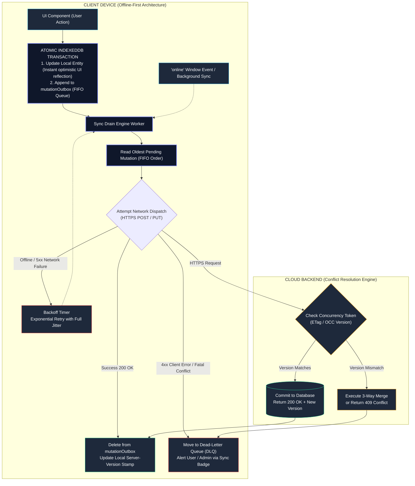

# 07: System Design: Resilient Offline-First Mobile Field Worker App

---

## 1. Why This Topic Exists

Enterprise mobile field operations—such as utility grid inspections, aviation maintenance, remote geological surveys, and disaster relief logistics—operate in environments where internet connectivity is unpredictable, intermittent, or entirely non-existent for hours or days at a time.

In typical consumer web applications, losing internet connectivity displays a generic "You are offline" error modal, disabling all form inputs until the network returns. However, in an enterprise field worker application, **work cannot stop simply because the device entered a basement, tunnel, or rural valley**. The application must remain 100% interactive: technicians must view schematics, record equipment readings, capture photo audits, and submit complex multi-step work orders without a live internet connection.

Transitioning from an "Online-First with Offline Caching" architecture to a true **Local-First / Offline-First** architecture fundamentally inverts how software handles state:
1. **Local Disk as the Primary Source of Truth:** The local client database (IndexedDB) is not a temporary cache; it is the primary, authoritative data store. User interactions write synchronously to local storage first.
2. **Asynchronous Bidirectional Replication:** The internet is treated merely as an opportunistic, background replication channel.
3. **The Outbox & Conflict Reconciliation Challenge:** When multiple workers make offline modifications to shared resources (e.g., two inspectors editing the same pipeline valve status), the system must reconcile diverging timelines without silently clobbering critical enterprise data.

Designing this architecture requires orchestrating IndexedDB durability, persistent FIFO mutation outbox queues, Dead-Letter Queues (DLQ), and robust conflict resolution strategies.

---

## 2. Learning Objectives

By the end of this chapter, you will be able to:
- Architect a complete Local-First / Offline-First data pipeline using browser IndexedDB storage.
- Construct a durable, transactional **FIFO Mutation Outbox** that guarantees zero data loss across browser crashes and device restarts.
- Implement automated synchronization drain loops featuring exponential backoff, jitter, and online event listeners.
- Master enterprise conflict reconciliation strategies: Last-Write-Wins (LWW), Optimistic Concurrency Control (OCC), and 3-Way Semantic Merge.
- Design a Dead-Letter Queue (DLQ) quarantine mechanism to prevent "poison-pill" mutations from blocking the entire sync outbox.
- Map offline-first browser primitives to ASP.NET Core / EF Core SQLite offline architectures and Angular PWA standards.

---

## 3. Historical Evolution

The architecture of offline web applications has traversed four technological generations:

1. **The HTML5 AppCache Disaster (2011–2014):**
   HTML5 introduced `application.cache` via manifest files. It was notoriously brittle, unintuitive, and difficult to invalidate. A single typo in the manifest file caused stale applications to lock permanently onto client devices without any update path, leading to its official deprecation across all web browsers.
2. **The Cache-First Service Worker Era (2015–2018):**
   The W3C standardized the **Service Worker API** and the **Cache Storage API**. Developers could intercept HTTP requests (`fetch` events) and serve static assets offline (`Cache-First` or `Stale-While-Revalidate`). However, this solved asset caching, not complex relational data mutations.
3. **The Naive `localStorage` Outbox Era (2018–2021):**
   Early offline SPAs attempted to buffer offline mutations in `localStorage`. This hit immediate physical constraints: `localStorage` is synchronous (blocks the main thread), is capped at a tiny 5 MB limit, lacks binary/blob support (preventing photo storage), and lacks transactional atomicity.
4. **The Modern Local-First & Replicated Database Era (2022–Present):**
   Modern architectures leverage **IndexedDB** wrapped in high-performance engines (Dexie.js, CRDTs like Yjs, or SQLite compiled to WebAssembly via OPFS - Origin Private File System). Applications write mutations to transactional outboxes and rely on the W3C **Background Sync API** to drain queues even when the web application is closed.

---

## 4. First Principles & Intuitive Physical Analogies (Layer 1)

### The Field Inspector's Clipboard, Outbox Tray, and Master Filing Cabinet

Imagine an inspector auditing deep underground municipal water tunnels with zero cellular reception:
- **The Clipboard (IndexedDB Local Store):** The inspector carries a clipboard with inspection sheets. When they verify a valve, they write directly on their clipboard with a pen. They do not wait for a messenger bird to fly to headquarters and return before writing down the number. The clipboard is the primary local truth.
- **The Outgoing Mail Tray (FIFO Mutation Outbox):** Every completed inspection form is stamped with a timestamp and sequence number, then placed into the inspector's physical leather satchel (the outbox queue).
- **The Courier Delivery (Background Synchronization):** When the inspector emerges from the tunnel into the sunlight, their mobile phone detects a radio tower. A courier automatically grabs the forms from the satchel, in exact sequence, and rushes them to headquarters.
- **The Master File Room & Discrepancy Desk (Conflict Reconciliation):** At headquarters, a clerk files the sheets. If another technician inspected the same valve an hour earlier, the clerk does not shred either sheet. They compare the sequence stamps (OCC / Version Vectors) or place the conflicting sheets in a "Discrepancy Basket" (User-Assisted Conflict UI) for the chief engineer to resolve.

---

## 5. Internal Working & Engine Architecture (Layer 2)

An enterprise offline-first data synchronization engine divides into four synchronized layers:

```
+-------------------------------------------------------------+
| 1. PRESENTATION LAYER (React Components)                    |
|    - Queries Local IndexedDB synchronously via Live Queries |
|    - Renders optimistic updates instantly (0ms latency)     |
|    - Dispatches mutations to Local Outbox                   |
+-------------------------------------------------------------+
                               |
                               v
+-------------------------------------------------------------+
| 2. LOCAL PERSISTENCE TIER (IndexedDB / Dexie.js)            |
|    - Authoritative Local Entities Store (WorkOrders, Assets)|
|    - Persistent FIFO Mutation Outbox Table                  |
|    - Dead-Letter Queue (DLQ) Table for Poison Mutations     |
|    - Binary Blob Store (Inspection Photos & Signatures)     |
+-------------------------------------------------------------+
                               |
                               | (Triggers on 'online' or periodic)
                               v
+-------------------------------------------------------------+
| 3. SYNCHRONIZATION DRAIN ENGINE                             |
|    - Background Sync Worker (Service Worker / Main Thread)  |
|    - Strict FIFO Sequencer: Processes mutations in order    |
|    - Exponential Backoff with Jitter for network failures   |
|    - Poison-Pill Quarantining: Moves 4xx errors to DLQ      |
+-------------------------------------------------------------+
                               |
                               v (HTTPS REST / GraphQL)
+-------------------------------------------------------------+
| 4. ENTERPRISE BACKEND & CONFLICT RESOLVER                   |
|    - Ingests Mutation Batch                                 |
|    - Optimistic Concurrency Control (ETag / rowVersion check)|
|    - Reconciles conflicts (LWW, Field Merge, or Rejection) |
|    - Returns Updated State Delta to Client                  |
+-------------------------------------------------------------+
```

### 1. The Transactional Mutation Contract
Every mutation must be recorded transactionally. If an inspector clicks "Complete Work Order," two operations must execute inside a single **IndexedDB ACID transaction**:
1. Mutate the local entity in the `workOrders` store (e.g. `status = 'COMPLETED'`).
2. Insert an entry into the `mutationOutbox` store (`{ id, action: 'UPDATE_STATUS', entityId, payload, timestamp, version }`).

If the device battery dies mid-write, IndexedDB rolls back both writes. There is never a state where the local entity shows "Completed" but the outbox has no record to send to the server.

### 2. The FIFO Outbox Drain Loop
When connectivity returns (`navigator.onLine === true` or Service Worker `sync` event):
1. The drain engine queries `mutationOutbox` sorted by `createdAt ASC`.
2. It takes the oldest pending mutation.
3. It sends the payload to the enterprise API endpoint accompanied by the client's known version tag (`If-Match: "v3"` or `clientVersion: 3`).
4. If successful: it deletes the record from `mutationOutbox` and updates the entity's server version.
5. If network fails (5xx, timeout): it schedules a retry using **Exponential Backoff with Full Jitter** (`delay = Math.min(maxDelay, baseDelay * 2^attempts + Math.random() * 1000)`).
6. If semantic client error occurs (4xx, schema failure): it isolates the record into the Dead-Letter Queue (DLQ) to prevent blocking subsequent independent mutations.

---

## 6. Runtime Flow & Execution Traces

Let us trace a field worker completing an inspection in an underground substation, followed by emerging into cellular range:

```
Time     Connectivity  User / Engine Action                         State
00:00    OFFLINE       Worker checks "Transformer A-1: Passed"      -
00:01    OFFLINE       IndexedDB Transaction executes:              -
                       1. Updates local Transformer A-1             Local Status = PASSED
                       2. Appends OUTBOX_MUTATION #101              Outbox Count = 1
00:02    OFFLINE       Worker snaps photo (3 MB JPEG)               -
00:03    OFFLINE       Saves photo blob to IndexedDB Blobs          Blob saved locally
00:04    OFFLINE       Appends OUTBOX_MUTATION #102 (Attach Photo)  Outbox Count = 2
15:00    OFFLINE       Worker exits facility; phone acquires 4G LTE -
15:01    ONLINE        Browser fires 'online' event                 Drain Engine Wakes Up
15:02    ONLINE        Sends OUTBOX #101 (Status Update) to API     HTTP 200 OK
15:03    ONLINE        Deletes #101 from Outbox                     Outbox Count = 1
15:04    ONLINE        Uploads OUTBOX #102 (Photo multipart)        HTTP 200 OK
15:06    ONLINE        Deletes #102 from Outbox                     Outbox Count = 0 (Synced!)
```

**Key Architectural Invariant:** The technician never waited on a loading spinner. All operations felt instantaneous, and synchronization occurred invisibly in the background.

---

## 7. Memory Model & Heap Layout

```
BROWSER LOCAL STORAGE & HEAP MEMORY TOPOLOGY:
+---------------------------------------------------------------+
| V8 HEAP (Transient JavaScript Execution)                     |
|                                                               |
|  [ LiveQuery Subscribers Map ]                                |
|    ├── Hook: useWorkOrders() (Subscribed to Dexie table)      |
|    └── Hook: useSyncStatus() (Outbox length: 2, state: "idle")|
|                                                               |
|  [ Drain Engine Worker ]                                      |
|    └── Active fetch promise, in-flight AbortController        |
+---------------------------------------------------------------+
| INDEXEDDB DISK STORAGE ENGINE (Blink C++ / LevelDB Backend)   |
|                                                               |
|  [ Database: 'field_operations_db' ]                          |
|    ├── ObjectStore: 'workOrders' (~12 MB JSON entities)       |
|    ├── ObjectStore: 'mutationOutbox' (~45 KB pending queue)   |
|    ├── ObjectStore: 'deadLetterQueue' (Quarantined entries)   |
|    └── ObjectStore: 'photoBlobs' (~85 MB unmanaged binary)    |
|                                                               |
|  * Uses navigator.storage.persist() to prevent OS eviction    |
+---------------------------------------------------------------+
```

---

## 8. Visual Diagrams (ASCII / Text)

### The End-to-End Offline-First Outbox Synchronization Loop



<details className="raw-schematic-details">
<summary>📄 View Raw ASCII Schematic</summary>

```
+-----------------------------------------------------------------------+
| CLIENT DEVICE (Offline-First Architecture)                            |
|                                                                       |
|  [ UI Component ]                                                     |
|         |                                                             |
|         v (Dispatches Action)                                         |
|  +-----------------------------------------------------------------+  |
|  | ATOMIC INDEXEDDB TRANSACTION                                     |  |
|  |   1. Update Local Entity (Instant UI Reflection)                |  |
|  |   2. Append to 'mutationOutbox' Table (FIFO Queue)               |  |
|  +-----------------------------------------------------------------+  |
|                                    |                                  |
|                                    v                                  |
|  [ Sync Drain Engine ] <------------------ [ 'online' / sync event ]  |
|         |                                                             |
|         | 1. Reads oldest mutation (FIFO)                             |
|         v                                                             |
|  [ Network Check ]                                                    |
|         |                                                             |
|         +-----------------+                                           |
|         | Offline / 5xx   | Success (200 OK)                          |
|         v                 v                                           |
|  [ Backoff Timer ]    [ Delete from Outbox ]                          |
|  (Retry with Jitter)  [ Update Server Version ]                       |
|                           |                                           |
|                           +---> Client 4xx Error (Semantic Conflict)  |
|                                 |                                     |
|                                 v                                     |
|                           [ Move to Dead-Letter Queue (DLQ) ]         |
|                           [ Alert User / Admin via Sync Badge ]       |
+-----------------------------------------------------------------------+
                                    |
                                    v HTTPS POST / PUT
+-----------------------------------------------------------------------+
| CLOUD BACKEND (Conflict Resolution Engine)                            |
|   1. Checks Concurrency Token (OCC / ETag)                            |
|   2. If version matches -> Commits to Database                        |
|   3. If version mismatch -> Executes 3-Way Merge or Returns Conflict  |
+-----------------------------------------------------------------------+
```

</details>

---

## 9. Real World Usage & Production Patterns

> 🧪 **Companion Interactive Lab:** [CanvasDesignLab.tsx](../../apps/portal/src/features/visualizers/topic-11-system-design/CanvasDesignLab.tsx) | Live in Portal: topic-11-system-design

### Production Implementation: Durable Outbox Engine & Sync Drainer

Below is an enterprise-grade offline-first architecture using a durable IndexedDB outbox, exponential backoff, and poison-pill isolation:

#### 1. Outbox Data Models & Schema (`offlineDb.ts`)

```typescript
// offlineDb.ts - IndexedDB Schema via Dexie or Raw IDB
export interface WorkOrder {
  id: string;
  title: string;
  status: 'PENDING' | 'IN_PROGRESS' | 'COMPLETED';
  version: number; // OCC Version Token
  updatedAt: number;
}

export interface OutboxMutation {
  id: string; // UUID
  entityId: string;
  action: 'UPDATE_STATUS' | 'ADD_NOTE' | 'UPLOAD_ATTACHMENT';
  payload: Record<string, any>;
  clientVersion: number;
  attempts: number;
  createdAt: number;
  lastError?: string;
}

export interface DeadLetterEntry extends OutboxMutation {
  quarantinedAt: number;
  fatalError: string;
}
```

#### 2. The Transactional Outbox Engine (`outboxService.ts`)

```typescript
// outboxService.ts - Atomic Mutations & IndexedDB Transactions

export class OutboxService {
  private db: IDBDatabase;

  constructor(db: IDBDatabase) {
    this.db = db;
  }

  // Atomically update local entity and stage outbox mutation
  public async executeMutation(
    entityId: string,
    action: OutboxMutation['action'],
    payload: Record<string, any>,
    expectedVersion: number
  ): Promise<void> {
    return new Promise((resolve, reject) => {
      // Open transaction across both stores
      const tx = this.db.transaction(['workOrders', 'mutationOutbox'], 'readwrite');
      const orderStore = tx.objectStore('workOrders');
      const outboxStore = tx.objectStore('mutationOutbox');

      tx.oncomplete = () => resolve();
      tx.onerror = () => reject(tx.error);

      // 1. Fetch current local entity
      const getReq = orderStore.get(entityId);
      getReq.onsuccess = () => {
        const order: WorkOrder = getReq.result;
        if (!order) {
          tx.abort();
          return reject(new Error('Entity not found'));
        }

        // Apply local optimistic update
        order.status = payload.status ?? order.status;
        order.updatedAt = Date.now();
        orderStore.put(order);

        // 2. Stage mutation in outbox
        const mutation: OutboxMutation = {
          id: crypto.randomUUID(),
          entityId,
          action,
          payload,
          clientVersion: expectedVersion,
          attempts: 0,
          createdAt: Date.now(),
        };

        outboxStore.add(mutation);
      };
    });
  }
}
```

#### 3. The Resilient Sync Drain Loop (`syncDrainer.ts`)

```typescript
// syncDrainer.ts - Outbox Drain Loop with Exponential Backoff & DLQ

export class SyncDrainer {
  private isDraining = false;
  private db: IDBDatabase;

  constructor(db: IDBDatabase) {
    this.db = db;
    // Wake up on connectivity restore
    window.addEventListener('online', () => this.drain());
  }

  public async drain(): Promise<void> {
    if (this.isDraining || !navigator.onLine) return;
    this.isDraining = true;

    try {
      while (navigator.onLine) {
        const mutation = await this.peekOldestMutation();
        if (!mutation) break; // Outbox is empty

        try {
          await this.sendToServer(mutation);
          // Success: delete from outbox
          await this.removeMutation(mutation.id);
        } catch (error: any) {
          const isFatal = error.status >= 400 && error.status < 500 && error.status !== 408;

          if (isFatal) {
            // Poison pill detected (4xx error): Quarantine to Dead-Letter Queue
            console.error(`Poison pill mutation ${mutation.id}. Moving to DLQ.`, error);
            await this.quarantineMutation(mutation, error.message);
            await this.removeMutation(mutation.id);
          } else {
            // Transient network failure (5xx, timeout): Apply backoff & pause
            mutation.attempts++;
            const backoffMs = Math.min(30000, 1000 * Math.pow(2, mutation.attempts) + Math.random() * 500);
            await this.updateMutationAttempts(mutation);
            await new Promise(r => setTimeout(r, backoffMs));
            break; // Stop draining this cycle, wait for next trigger
          }
        }
      }
    } finally {
      this.isDraining = false;
    }
  }

  private async sendToServer(mutation: OutboxMutation): Promise<void> {
    const res = await fetch(`/api/sync/${mutation.entityId}`, {
      method: 'POST',
      headers: {
        'Content-Type': 'application/json',
        'If-Match': `"${mutation.clientVersion}"`, // Optimistic Concurrency Control
      },
      body: JSON.stringify(mutation.payload),
    });

    if (!res.ok) {
      const err = new Error(`HTTP ${res.status}`);
      (err as any).status = res.status;
      throw err;
    }
  }

  private async peekOldestMutation(): Promise<OutboxMutation | null> {
    // Reads earliest mutation from IndexedDB index 'createdAt'
    return new Promise(resolve => {
      const tx = this.db.transaction('mutationOutbox', 'readonly');
      const req = tx.objectStore('mutationOutbox').index('createdAt').openCursor('next');
      req.onsuccess = () => resolve(req.result ? req.result.value : null);
    });
  }

  private async removeMutation(id: string): Promise<void> {
    return new Promise(resolve => {
      const tx = this.db.transaction('mutationOutbox', 'readwrite');
      tx.objectStore('mutationOutbox').delete(id);
      tx.oncomplete = () => resolve();
    });
  }

  private async quarantineMutation(mutation: OutboxMutation, reason: string): Promise<void> {
    return new Promise(resolve => {
      const tx = this.db.transaction(['deadLetterQueue'], 'readwrite');
      const dlqStore = tx.objectStore('deadLetterQueue');
      dlqStore.add({ ...mutation, quarantinedAt: Date.now(), fatalError: reason });
      tx.oncomplete = () => resolve();
    });
  }

  private async updateMutationAttempts(mutation: OutboxMutation): Promise<void> {
    return new Promise(resolve => {
      const tx = this.db.transaction('mutationOutbox', 'readwrite');
      tx.objectStore('mutationOutbox').put(mutation);
      tx.oncomplete = () => resolve();
    });
  }
}
```

---

## 10. Angular Comparison

For senior engineers with an Angular background, offline architectures present distinct implementation patterns:

| Architectural Dimension | Angular Offline Approach | Modern React Local-First Approach |
| :--- | :--- | :--- |
| **Service Worker Integration** | **`@angular/pwa` & `ngsw-config.json`:** Declarative asset and data caching configuration handled via Angular CLI build hooks. | Custom Service Worker or Workbox pipeline paired with Web Standards background sync. |
| **Local State Persistence** | **NgRx Meta-Reducers:** Intercepting actions to hydrate and persist store slices to IndexedDB via custom action reducers. | **Dexie.js / Live Queries:** Writing directly to IndexedDB tables; components observe queries via custom hooks (`useLiveQuery`). |
| **Offline HTTP Interceptors** | Intercepting Angular `HttpClient` calls in `HttpInterceptor` and queuing mutations into an RxJS offline queue. | **Application Outbox Service:** Explicit transactional writes directly to IndexedDB tables bypassing HTTP during offline operation. |

---

## 11. .NET Comparison

For engineers experienced with .NET enterprise mobile and client development, browser offline-first mechanics mirror proven .NET patterns:

| .NET Enterprise Offline Concept | .NET Architecture Technology | Browser / TypeScript Offline Equivalent |
| :--- | :--- | :--- |
| **Embedded Client Database** | **SQLite via Entity Framework Core (EF Core)** running locally in .NET MAUI or WPF. | **IndexedDB (via Dexie.js or idb)** running inside the browser engine sandbox. |
| **Persistent Storage Safety** | Files saved to local app storage (`FileSystem.AppDataDirectory`), safe from OS purging. | **`navigator.storage.persist()`:** Requesting browser persistent storage exemption from automatic cache eviction. |
| **Concurrency Tokens** | `[Timestamp]` or `[ConcurrencyCheck]` on EF Core entity properties creating SQL `WHERE RowVersion = @original`. | **Optimistic Concurrency Control:** Passing `clientVersion` via HTTP `If-Match` headers for server validation. |
| **Dead-Letter Queue (DLQ)** | RabbitMQ / Azure Service Bus Dead-Letter Queue for poisonous messages that fail processing. | **IndexedDB `deadLetterQueue` store:** Isolating poison mutations to prevent blocking the FIFO drain loop. |

---

## 12. Enterprise Perspective & Production Risks (Layer 4)

Operating an offline-first enterprise field application carries significant operational risks:

### 1. Browser Storage Eviction (The Silent Data Loss Disaster)
- **The Risk:** Browsers treat client-side storage as a "best-effort cache." If the user's mobile device runs low on disk space, iOS Safari or Android Chrome silently deletes the application's entire IndexedDB database to reclaim space.
- **The Failure Mode:** A field technician completes 40 equipment inspections over three days offline. The device disk gets full; the operating system purges IndexedDB; all 40 un-synced inspections are permanently lost.
- **The Enterprise Defense:** Execute `navigator.storage.persist()` at boot. This elevates the website's storage category from "Best-Effort" to **"Persistent Storage."** The browser guarantees it will never delete the IndexedDB database automatically without explicit user confirmation.

### 2. The Poison-Pill Outbox Blockade
- **The Risk:** A technician enters a value that violates a newly deployed backend validation rule (e.g., negative tire pressure).
- **The Failure Mode:** The server responds with `HTTP 422 Unprocessable Entity`. In a strict FIFO queue without error classification, the sync drainer retries the failing mutation forever. **All 50 valid mutations queued behind it are blocked indefinitely.**
- **The Enterprise Defense:** Classify errors. Any deterministic client error (`HTTP 400, 422`) must be immediately removed from the active outbox and quarantined into the **Dead-Letter Queue (DLQ)**. The drain loop logs the error, triggers an administrative warning badge, and proceeds immediately with the remaining valid mutations.

### 3. Split-Brain Timelines & Stale Write Clobbering
- **The Risk:** Two inspectors work on the same oil rig offline. Inspector A edits the safety checklist at 10:00 AM. Inspector B edits the checklist at 10:15 AM.
- **The Failure Mode:** If the backend uses naive Last-Write-Wins (LWW) based on server arrival time, whichever inspector connects to Wi-Fi first gets completely overwritten by the second inspector, erasing critical safety records.
- **The Enterprise Defense:** Implement **Optimistic Concurrency Control (OCC)** or **Field-Level 3-Way Merge**. If the server detects a version conflict, it rejects the clobbering write and serves a visual diff screen allowing the user or supervisor to resolve conflicting fields.

---

## 13. Performance Considerations

```
OFFLINE-FIRST PERFORMANCE TARGETS:
-------------------------------------------------------------
Local Form Submission Latency:   < 5ms (Instant write to IndexedDB)
IndexedDB Transaction Duration:  < 15ms (Dual-store atomic write)
Storage Eviction Protection:     100% Persistent Storage granted
Maximum Outbox Drain Rate:       10 mutations / second over 4G
Maximum Offline Media Storage:   Up to 500 MB (via Blob chunking)
-------------------------------------------------------------
```

### Strategic Optimizations:
1. **Batching Outbox Drains:**
   Instead of dispatching 50 individual HTTP POST requests for 50 queued mutations, group pending outbox items into a single **Bulk Sync Payload** (`POST /api/sync/batch`), reducing network overhead and TLS handshake costs.
2. **Compressing Photos Locally before IndexedDB Storage:**
   Do not save raw 12 MP camera images (8 MB) into IndexedDB. Use `OffscreenCanvas` in a Web Worker to compress the photo into a 1600px WebP image (400 KB) before storing it in the outbox.
3. **Index Optimization in IndexedDB:**
   Only index fields necessary for querying (`createdAt`, `status`, `entityId`). Excessive indices in IndexedDB degrade transaction write speeds and inflate disk usage.

---

## 14. Tradeoffs

| Architecture Choice | Advantages | Costs / Tradeoffs |
| :--- | :--- | :--- |
| **Local-First / Offline-First** | 100% application availability; zero network latency on user actions; works in tunnels/rural zones. | Substantial architecture complexity; requires managing distributed conflict resolution and data replication. |
| **Last-Write-Wins (LWW)** | Simplest conflict resolution; automatic convergence without user intervention. | Silently clobbers concurrent edits; potential for silent data loss in multi-user collaboration. |
| **Optimistic Concurrency (OCC)** | Guaranteed data integrity; prevents accidental overwrites; matches ACID expectations. | Requires manual conflict resolution UI when collisions occur; can frustrate field workers if rejected. |
| **CRDTs (Conflict-Free Replicated Data Types)** | Mathematical eventual consistency without central server locks; seamless auto-merge. | High memory overhead; complex serialization; difficult to model traditional relational business constraints. |

---

## 15. Common Mistakes & Interview Traps

- **Trap 1: Using `localStorage` for offline mutations.**
  *Why it fails:* `localStorage` is synchronous, blocks the main UI thread during writes, cannot store binary images, and is limited to 5 MB. Always use IndexedDB.
- **Trap 2: Non-Transactional local updates.**
  *Why it fails:* Updating the local entity and queuing the outbox mutation in separate, unrelated asynchronous steps creates race conditions and state desynchronization if the app crashes mid-way. Always use a single IndexedDB transaction.
- **Trap 3: Retrying 4xx client errors indefinitely.**
  *Why it fails:* Retrying a 400/422 validation failure creates an infinite loop that halts the entire FIFO outbox. Always quarantine 4xx errors to a Dead-Letter Queue (DLQ).
- **Trap 4: Forgetting `navigator.storage.persist()`.**
  *Why it fails:* Without persistent storage approval, the mobile operating system can delete your offline database whenever local device storage gets low.

---

## 16. Interview Questions & Architectural Answers

### Question 1 (Senior Level): How do you design an offline-first mobile web application that ensures no data is lost during network dropouts?
**Answer**:
1. **Local-First Principle:** The browser's IndexedDB is treated as the primary source of truth. All user interactions mutate local IndexedDB records immediately.
2. **Transactional Outbox:** Every state mutation is paired with an outbox record inside an **atomic IndexedDB transaction** encompassing both the entity store and the `mutationOutbox` store.
3. **Storage Persistence:** We invoke `navigator.storage.persist()` on boot to prevent the browser or OS from evicting IndexedDB under low-disk conditions.
4. **Resilient Sync Drainer:** An asynchronous drain loop listens for the `online` event and Service Worker `sync` events, sending queued mutations to the backend in strict FIFO sequence using exponential backoff with jitter.
5. **Poison-Pill Quarantine:** Deterministic 4xx errors are moved to a Dead-Letter Queue (DLQ) so they do not block subsequent valid mutations.

### Question 2 (Lead Level): How do you resolve concurrent data conflicts when multiple field workers edit the same asset while offline?
**Answer**:
We employ a **Tiered Conflict Resolution Strategy**:
1. **Optimistic Concurrency Control (OCC):** Every entity carries an integer version token (`version: 4`). When submitting an update, the client passes its base version in the HTTP `If-Match` header.
2. **Server-Side Conflict Detection:** If the server's current version matches the client's base version, the write succeeds and increments the version (`version: 5`). If the server version has progressed (e.g. now at 5), a conflict (`HTTP 412 Precondition Failed`) is returned.
3. **Field-Level 3-Way Merge:** The backend attempts a non-destructive merge: if Worker A updated `batteryLevel` and Worker B updated `tirePressure`, the changes commute naturally and both are applied.
4. **User-Assisted Split-Pane UI:** If both workers modified the exact same field to contradictory values, the server flags the entity as conflicted and presents a visual side-by-side reconciliation screen to a supervisor or the technician, allowing manual selection of the winning value.

### Question 3 (Architect Level): How do you handle schema migrations in an offline-first IndexedDB application when devices may stay offline across multiple software releases?
**Answer**:
Handling schema evolution across offline clients requires **Strict Monotonic Schema Versioning**:
1. **IndexedDB `onupgradeneeded` Pipeline:** IndexedDB natively supports integer database versioning (`indexedDB.open(name, version)`). We define sequential, declarative migration scripts (Version 1 -> Version 2 -> Version 3) using Dexie.js or raw IDB transactions.
2. **Additive Schema Rule:** Database schemas must follow the **Expansion-Contract Migration Pattern**. We never rename or delete object stores or indices in a single release. We only add new optional stores or fields.
3. **Outbox Schema Versioning:** Every mutation staged in `mutationOutbox` embeds a `schemaVersion` tag alongside its payload. When the sync drainer sends the payload, the backend API uses versioned endpoints (`/api/v2/work-orders`) or schema adapters to deserialize legacy mutation formats submitted by workers who were offline for weeks.
4. **Idempotent Migration Handlers:** Migration scripts must be idempotent, verifying index existence before creation to prevent upgrade aborts during browser process interruptions.

---

## 17. Senior-Level Mental Model & "How to Remember This Forever" (Memory Anchors)

### The "Subterranean Inspector & Leather Satchel" Anchor
- **The Clipboard (IndexedDB):** Write on it immediately. Never wait for a network signal.
- **The Leather Satchel (FIFO Outbox):** Place completed forms in sequence into the satchel.
- **The Emerging Sun (Online Event):** When stepping out into the sunlight, the courier rushes the satchel contents to headquarters.
- **The Quarantine Box (DLQ):** If a form has a spilled coffee stain (4xx error), move it to the quarantine desk so the courier can deliver the remaining 49 clean forms without delay.

---

## 18. Core Vocabulary & "Aha!" Breakthrough Insights (Refresher)

- **Local-First:** An architectural paradigm where the local device is the authoritative primary store, and the network is an asynchronous replication channel.
- **FIFO Mutation Outbox:** A persistent queue storing outgoing create/update/delete operations in chronological order until network connectivity confirms delivery.
- **Dead-Letter Queue (DLQ):** A secondary storage table holding failed or malformed messages that cannot be processed, preventing queue head-of-line blocking.
- **Exponential Backoff with Jitter:** A retry algorithm where wait times double on each consecutive failure and are randomized with jitter to prevent Thundering Herd retries.
- **Persistent Storage:** A browser storage mode requested via `navigator.storage.persist()` that exempts IndexedDB from automated operating system disk eviction.

---

## 19. Key Takeaways

1. **Write Locally First:** Enterprise field applications must write to IndexedDB first, updating UI state instantly without waiting for network verification.
2. **Atomic Outbox Transactions:** Always update local data entities and append outbox mutations within the same single IndexedDB transaction.
3. **Protect Storage from Eviction:** Request `navigator.storage.persist()` at boot to prevent mobile operating systems from purging IndexedDB during low disk space events.
4. **Prevent Queue Blockades with DLQ:** Immediately isolate fatal 4xx errors into a Dead-Letter Queue to keep the primary FIFO outbox drain flowing.
5. **Enforce Optimistic Concurrency:** Protect against concurrent offline write collisions using version tokens and field-level merge strategies.

---

## 20. Revision Sheet

- **Q: Why is `localStorage` unsuitable for enterprise offline applications?**
  *A:* It is synchronous, blocks the browser UI thread, is limited to 5 MB, cannot store binary blobs, and does not support atomic transactions.
- **Q: How does `navigator.storage.persist()` protect offline data?**
  *A:* It elevates browser storage from "best-effort" to "persistent," preventing the browser from automatically purging IndexedDB when device storage is low.
- **Q: What is a Dead-Letter Queue (DLQ) in an offline sync engine?**
  *A:* A holding table for unprocessable or corrupt mutations (e.g. 4xx validation failures), preventing them from blocking the primary outbox queue.
- **Q: Why should outbox retries use Exponential Backoff with Jitter?**
  *A:* To avoid overwhelming recovering backend servers with synchronized, simultaneous retry bursts (the Thundering Herd problem).
- **Q: What HTTP header is standard for Optimistic Concurrency Control?**
  *A:* `If-Match: "<version_or_etag>"`
